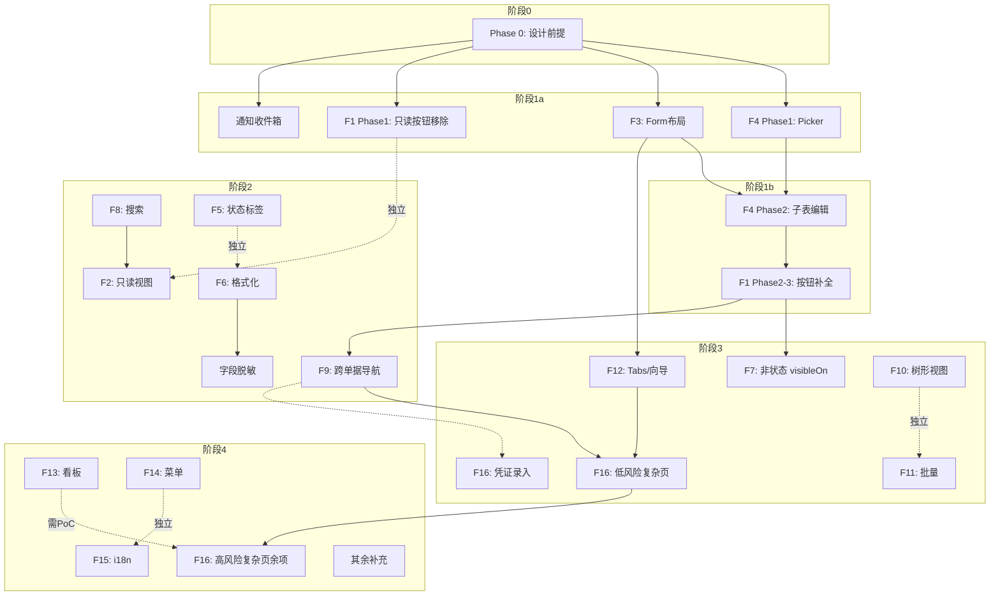

# 前端 UI 设计完备性、合理性及补充需求分析

> 日期：2026-07-19
> 范围：全 18+1 域（18 业务域 + notify 跨域通知派发）
> 数据来源：18 份 `ui-patterns.md`、23 域按纽审计报表、676 份 view.xml/676 份 xmeta、架构文档层（view-and-page-strategy.md、dashboards.md、approval-framework.md）、`docs-for-ai/` 平台约束、现有 bugs/analysis 记录、全部 `module-*/erp-*-dao` 下的 I*Biz 接口/BizModel 抽样

---

## 1. 核查方法

本报告从三个维度交叉验证：

| 维度 | 方法 | 输入 |
|------|------|------|
| **覆盖完备性** | 域维度：每域 ui-patterns.md → view.xml 手写层 → 审计数据表 → roadmap F 项映射 | 18 份 ui-patterns.md、23 域按纽审计、frontend-ui-roadmap.md |
| **设计合理性** | 平台约束维度：Nop docs-for-ai 禁止项/反模式 → 实际 view.xml 实现 → 已知 bugs | docs-for-ai 文档、实际 view.xml 抽样、`docs/bugs/` + `docs/analysis/` |
| **补充需求** | 缺口维度：每域 ui-patterns 设计 vs 实现 vs 跨域复用潜力 | 各域设计模式、跨域模式对比、CRM/CS/Project 重复看板模式分析 |

---

## 2. 覆盖完备性：18+1 域 UI 设计文档状态

### 2.1 `ui-patterns.md` 文档存在性

| 域 | ui-patterns.md 路径 | 行数 | 状态 | 
|----|-------------------|------|------|
| purchase | `docs/design/purchase/ui-patterns.md` | 268 | ✅ 完整 |
| sales | `docs/design/sales/ui-patterns.md` | 119 | ✅ 完整 |
| inventory | `docs/design/inventory/ui-patterns.md` | 178 | ✅ 完整 |
| finance | `docs/design/finance/ui-patterns.md` | 193 | ✅ 完整 |
| master-data | `docs/design/master-data/ui-patterns.md` | 196 | ✅ 完整 |
| manufacturing | `docs/design/manufacturing/ui-patterns.md` | 155 | ✅ 完整 |
| assets | `docs/design/assets/ui-patterns.md` | 113 | ✅ 完整 |
| projects | `docs/design/projects/ui-patterns.md` | 134 | ✅ 完整 |
| quality | `docs/design/quality/ui-patterns.md` | 168 | ✅ 完整 |
| maintenance | `docs/design/maintenance/ui-patterns.md` | 155 | ✅ 完整 |
| crm | `docs/design/crm/ui-patterns.md` | 295 | ✅ 完整 |
| customer-service | `docs/design/customer-service/ui-patterns.md` | 299 | ✅ 完整 |
| human-resource | `docs/design/human-resource/ui-patterns.md` | 382 | ⚠️ 见 §2.2 |
| aps | `docs/design/aps/ui-patterns.md` | 242 | ✅ 完整 |
| logistics | `docs/design/logistics/ui-patterns.md` | 395 | ✅ 完整 |
| b2b | `docs/design/b2b/ui-patterns.md` | 292 | ✅ 完整 |
| contract | `docs/design/contract/ui-patterns.md` | 257 | ✅ 完整 |
| drp | `docs/design/drp/ui-patterns.md` | 241 | ✅ 完整 |
| **notify** | `docs/design/notify/` — 不存在 | 0 | ❌ **缺失** |

所有 18 个业务域均已生成 `ui-patterns.md`（4,082 行总设计）。notify 域（跨域通知派发）没有专属设计目录或 `ui-patterns.md` —— 其设计仅存在于 `docs/architecture/notification-strategy.md`。

### 2.2 HR `ui-patterns.md` 结构缺陷

HR 是唯一缺少标准章节的文件：

| 标准章节（其他 17 域均有） | HR 状态 | 影响 |
|-------------------------|--------|------|
| `## 页面清单`（含类型/复杂度表格） | ❌ 缺失 | 无法快速了解 HR 页面覆盖范围 |
| `## 跨页面导航流` | ❌ 缺失（仅有菜单路径映射） | 无法验证页面跳转关系 |
| 设计原则 | ✅ 有（5 条） | — |
| 调研引用 | ✅ 有 | — |

虽然有每页详细布局（按 `## 一、员工列表页`、`## 二、员工详情页` 等展开），但无汇总表格，导致以下风险：
- 无法确认是否漏页（如排班管理、招聘看板是否有 UI 设计）
- 无法评估页面复杂度（未标注 ★ 级）

### 2.3 Notify 域设计文档缺失

Notify 域（`module-notify`）是跨域通知派发基础设施，但：
- **无 `docs/design/notify/` 目录**
- **无 `ui-patterns.md`**
- 其设计仅分布在 `docs/architecture/notification-strategy.md`（架构级）和 `module-notify/model/app-erp-notify.orm.xml`（ORM 级）

已知缺失项：通知收件箱 UI、通知偏好设置、未读/已读视觉标记、通知模板管理页面。详细设计建议见 §6.1。

### 2.4 设计文档 vs 实现覆盖总览

| F# | 维度 | 设计完备性 | 实现状态 | 备注 |
|----|------|-----------|---------|------|
| F1 | 状态按钮 | 18 域均设计 | 25 实体缺域专用按钮（blocker 级别），12 实体缺次要按钮 | 25 blocker + 12 major |
| F2 | 只读视图 | 13+ 实体有设计 | 7 已修复（Phase 1 部分执行） | 6 待执行 |
| F3 | Form 分组 | 18 域 39 核心实体（~12%）分组设计已定 | ~39 实体（12%）有分隔线布局 | — |
| F4 | 子表编辑+Picker | 7 高频 Picker + ~50+ 头行对有设计 | Phase 1 done（2026-07-19，7 个高频 Picker 列集+筛选字段已落地，`docs/design/picker-patterns.md` 范式文档化）；Phase 2 子表编辑仍缺失 | Phase 1 完成，Phase 2 为最大剩余缺口 |
| F5 | 状态标签 | 通用颜色映射已设计 | 全部缺失 | xmeta 层建议 |
| F6 | 字段格式化 | 格式要求已定义 | 全部缺失 | xmeta 层建议 |
| F7 | non-state visibleOn | 部分设计已提及 | 全部缺失 | 新概念 |
| F8 | 搜索增强 | 每域 3-5 示例已设计 | 全部缺失 | — |
| F9 | 跨单据导航 | 6 域导航链已设计 | 全部缺失 | — |
| F10 | 树形视图 | 6 实体已设计 | 全部缺失 | — |
| F11 | 批量操作 | 5 类已设计 | 全部缺失 | 需 BizModel 支撑 |
| F12 | Tabs/向导 | 16 页面已识别 | 全部缺失 | 新扩项 |
| F13 | Kanban/看板 | 7 视图已设计 | 全部缺失 | 新扩项 |
| F14 | 菜单对账 | 标准流程 | 未审计 | — |
| F15 | i18n | 补充策略已定 | 未执行 | — |
| F16 | 复杂手写页 | 16 页面已识别 | 全部缺失 | **新增** |
| cross | 通知收件箱 | 无设计 | 缺失 | **新识别** |
| cross | 字段脱敏 | 无设计 | 缺失 | **新识别** |

**结论**：设计完备性本身良好（notify 和 HR 部分除外），但实现缺口极大。设计文档先行完成，实现停留在 codegen 骨架级。

---

## 3. 域维度 UI 设计逐域评析

每域 `ui-patterns.md` 的质量不一。以下逐域评估设计深度、结构性不足和潜在改进。

### 3.1 Purchase（268 行）✅ 模板级

采购域 `ui-patterns.md` 是 17 域中质量最高的"参考模板"。结构完整（5 页清单+通用列表结构+编辑页结构+跨页面导航流+调研参考），设计细节充分（如 M2M 物料选择器字段列表、工具栏双轴按钮表、"从订单导入"按钮、"状态信息区"）。

- 优点：通用结构被多个域复用为基线
- 发现的设计约束：`ui-patterns.md` 第 2.1 节操作按钮动态渲染在 `approveStatus` 轴使用太宽泛（SUBMITTED 显示 [审核][驳回]），未区分 DIRECT vs WORKFLOW 模式——DIRECT 模式按钮由 codegen 自动生成，WORKFLOW 模式由 nop-wf 引擎注入，二者均不需手写。这意味着设计文档与实现模式存在偏差（设计文档要求手写，但平台已自动生成）。
- **改进建议**：在 `purchase/ui-patterns.md`「通用页面模式 > 列表页结构」节增加注释说明 DIRECT/WORKFLOW 模式差异，明确哪些是自动生成、哪些需手写域专用按钮（DIRECT 按钮由 CrudBizModel 为 ~24 实体自动生成，见 §7.1）

### 3.2 Sales（119 行）✅ 良好但偏简

销售域与采购域镜像对称，设计原则明确（可用量校验、赠品/折扣标记、价格优先级）。但仅 119 行，比采购（268 行）少一半以上。

- 缺失：无完整列表页结构定义、无编辑页通用结构定义、无"状态信息区"细节、无金额格式化要求
- 这些在采购域已定义，销售域通过"对称"原则可推导，但新读者不熟悉采购域时会有理解缺口
- **改进建议**：补充列表页/编辑页结构图表（可参考采购域并标记差异点），避免过度依赖"对称"假设

### 3.3 Inventory（178 行）✅ 良好，有独特模式

库存域 `ui-patterns.md` 独立定义了操作类型驱动 UI（opType→动态表单）、三层库存可视化（StockMove/StockLedger/StockBalance）、批次/序列号管理。跨页面导航流清晰。

- 优点：方向颜色（入库=绿、出库=红）在 StockLedger 设计中定义；只读实体的"搜索→行点击→详情 drawer"模式
- 发现的设计弱约束：设计了 PDA 扫码和操作类型驱动 UI，但 **未定义 StockTake 三阶段流程的 UI 结构**。DRAFT→CONFIRMED 计盘→DONE 生成差异单据 的操作流程仅在 use-cases.md 中有定义，ui-patterns 缺少相应的按钮/状态/视图切换设计
- **改进建议**：在 ui-patterns 中补充 StockTake 三阶段操作的 UI 切换结构

### 3.4 Finance（193 行）✅ 良好但凭证录入不够深

借贷平衡校验、期间控制、红冲追溯、三级下钻（总账→明细账→凭证）设计完整。但凭证录入页面交互细节（科目树选取的搜索/筛选行为、自动平衡按钮交互、模板快速应用）深度不够。

- **改进建议**：深化凭证录入交互设计，补充科目树弹窗搜索筛选、自动平衡算法（超尾行 vs 按金额比例摊）、红字冲销的 UI 操作流程
- 发现：凭证详情页的"业财回链"区域是跨域导航（F9）的关键实现参考，但其设计位于 finance/ui-patterns.md 而非跨域文档，实施时需其他域开发者主动查找

### 3.5 Master-Data（196 行）✅ 良好，树形管理充分

物料分类树、科目表树的交互设计完整（拖拽排序、右键菜单、层级约束、末级科目规则）。物料/SKU 编辑的表单布局设计详细。

- 优点：编码唯一性前置校验（异步检查）、引用预览（删除/停用前查引用单据数）的设计，是 F7 中主数据交互模式的实际来源
- **改进建议**：补充条码批量录入的交互设计（条码扫描枪输入缓冲、标签打印预览）

### 3.6 Manufacturing（155 行）✅ 良好，缺 BOM 树交互深度

工单 4 阶段进度条（plan/pick/report/complete）是独特的 dashboard 风格设计。但 BOM 树浏览的交互设计不够深——仅说"树节点展开/折叠"，未定义 phantom 节点图标差异、工艺路线水平流向图布局。

- **改进建议**：补充 BOM 树交互细节（phantom 节点 vs 正常节点的视觉差异、工艺路线流向图布局参数）

### 3.7 Assets（113 行）✅ 良好但偏简

资产卡片详情页的 dashboard 风格设计（双列布局+折旧时间线+处置向导 3 步）是独特价值点。但仅 113 行，为最短的 ui-patterns 之一。

- 缺失：无跨页面导航流中凭证回链的设计细节、无折旧计划视图的交互细节（水平条形图的交互：hover 显示数值？点击跳转凭证？）
- **改进建议**：补充折旧计划可视化的交互细节（hover 信息浮层、点击跳转凭证）

### 3.8 Projects（134 行）✅ 良好

任务看板（4 列拖拽）、周工时网格录入、项目 dashboard 进度条设计完整。项目作为辅助核算维度的跨域设计明确。

- 发现：工时网格录入模式与 HR 域考勤/工时表高度重复（行=任务/项目、列=星期几、0.5h 步进、<40h 警告）。二者各自设计但实为同一交互模式
- **改进建议**：将 Timesheet 周网格抽取为共享模式（见 §6.8 同网格组件设计）

### 3.9 CRM（295 行）✅ 丰富

18 域中行数最多的 ui-patterns 之一。线索列表、商机看板、活动时间线/日历、转化向导、营销活动详情设计完整。看板拖拽约束、阶段配置的 isWonStage 保护、UTM 归因显示等细节丰富。

- 优点：转化向导的三步弹窗设计为其他域的向导页面（如资产处置、维护访问）提供了模式参考
- 发现：商机看板设计假设 AMIS 拖拽组件可用，但项目未验证 AMIS 原生看板组件在 Nop 集成中的兼容性。实施前需 PoC
- **改进建议**：在看板设计部分标注 AMIS 组件依赖和实施风险

### 3.10 CS / Customer Service（299 行）✅ 丰富

工单看板设计完整（SLA 红黄绿、待分派闪烁高亮、拖拽分配处理人）。SLA 时间轴设计、知识库嵌入、客服仪表板设计深度足够。

- 优点：工单详情页的"活动日志"时间线是 F13 中 CS 活动日志的设计来源
- **改进建议**：知识库富文本编辑器的交互设计（代码高亮、表格、图片上传的具体组件选型）尚未定义

### 3.11 HR / Human Resource（382 行）⚠️ 最长但结构最乱

382 行的设计内容最多但结构最松散。缺少汇总表导致以下页面可能被遗漏：排班管理（shift-scheduling）、员工调查（employee-survey）、能力评估（competency-management）、合同到期提醒是否有独立页面。

- 而且：菜单路径映射（`## 布局与导航`）只列出了 `hr/dashboard`、`hr/employee`、`hr/department` 等，未覆盖招聘管道看板、休假日历、薪酬审批等设计中的页面——存在菜单不可达风险
- **改进建议**：补充 `## 页面清单` 汇总表 + `## 跨页面导航流` + 菜单路径与页面的完整映射

### 3.12 APS（242 行）✅ 良好，甘特图为独特核心

排产甘特图是唯一涉及拖拽、缩放、约束叠加的复杂交互设计。颜色编码（蓝=正常、黄=接近交期、红=延期、灰色斜纹=外协）、右键菜单设计完整。

- 发现：甘特图依赖 AMIS 第三方图表组件（如 `@antv/g2` 或 ECharts），项目尚未验证集成路径。目前 Nop 的 AMIS 版本未内置甘特图组件
- **改进建议**：在 ui-patterns 中标注甘特图的组件选型和实施风险（需自定义 AMIS 组件或嵌入式 iframe）

### 3.13 Logistics（395 行）✅ 最丰富的设计之一

发运单编辑的三列布局、追踪时间线地图、承运商 API 凭据安全、比价面板设计深度极好。可作为其他域的"复杂交互设计"参考。

- 优点：比价面板（弹窗 + 结果缓存 30 分钟 + 排序切换）是最充分的弹窗交互设计
- 发现：追踪时间线地图依赖第三方地图服务（高德/Google Maps），当前设计未讨论地图服务的选型和 API 凭证管理
- **改进建议**：补充地图服务选型分析和离线降级策略（无地图时降级为纯文本时间线）

### 3.14 B2B（292 行）✅ 良好

EDI 事务详情页的双栏报文查看器（请求/响应分 Tab 展示、XML/JSON 语法高亮）、ASN 5 阶段进度条设计为独特模式。代码映射的批量 CSV/Excel 导入设计完整。

- 发现：报文语法高亮依赖于代码编辑器组件（如 AMIS `editor` 或 `monaco-editor`），项目需确认组件可用性
- **改进建议**：在设计中标注语法高亮组件的选型和技术约束

### 3.15 Contract（257 行）✅ 良好

合同版本对比（双栏 diff：新增=绿/删除=红/修改=黄）是唯一涉及文本差异可视化设计的模式。开票计划的状态追踪（待开/部分/已开票/已付款）是 F5 中 status labels 的典型用例。

- 发现：版本对比功能依赖 diff 渲染组件（如 `react-diff-viewer`），Nop/AMIS 无内置支持，需自定义实现
- **改进建议**：补充版本对比组件的实施路径（前端自定义组件 vs 后端渲染 HTML diff 图片）

### 3.16 DRP（241 行）✅ 良好

净需求计算报表按物料分组折叠、每列来源标注（Σ 公式可视化）是唯一涉及计算过程透明化的设计。补货建议审批的可编辑表格（建议量→批准量可调整）设计完整。

- 发现：净需求计算报表的"每列来源"标注需要 `IdboProvider` 跨域聚合查询（既聚合库存余额、在单量、采购在途、销售未发货等数据），前端需等待后端聚合 API 就绪
- **改进建议**：补充前端与后端的数据契约（GraphQL query 的返回结构、分页参数等）

### 3.17 Quality（168 行）✅ 良好

质检读数子表的 PASS/FAIL 自动判定（颜色编码）、NCR 详情页的处理决定单选（退货/让步接收/降级/报废）+ CAPA 内嵌表格设计完整。质检仪表板 KPI 设计清晰。

- 发现：`ui-patterns.md` 第 1.2 节提到"让步接收按钮：部分不合格时可用，需填写让步理由 + 审批人"，但未定义让步理由输入 UI（弹窗？表单内嵌？）和审批人选择方式
- **改进建议**：补充让步接收的弹窗交互设计

### 3.18 Maintenance（155 行）✅ 良好

维护访问 4 步向导是唯一的完整向导交互设计。备件消耗的实时库存显示（库存不足黄色警告）是 F4 中库存感知 picker 的实际参考。

- 发现：设备状态色块（🟢 运行中/🔴 故障停机等）与 F5 的通用颜色映射不一致——F5 定义 DRAFT=灰/ACTIVE=蓝等审批状态色系，maintenance 的色系是设备状态专用。跨域配色不一致会使用户混淆
- **改进建议**：定义设备状态专用的色系映射，与 F5 的审批状态色系分别管理，避免冲突

---

## 4. 跨域 UI 模式去重分析

### 4.1 完全重复模式（3 组）

以下模式在多个域的 `ui-patterns.md` 中独立设计但实为同一交互，实施时只需一次实现：

| 重复组 | 涉及域 | 核心模式 | 建议处理 |
|--------|--------|---------|---------|
| **Timesheet 周网格** | HR（考勤/工时表）、Projects（工时录入） | 行=任务/项目、列=星期、0.5h 步进、<40h 警告 | 合并为共享组件 |
| **看板拖拽** | CRM（商机）、CS（工单）、Projects（任务） | 列动态定义、卡片拖拽/弹窗分配、SLA/超时/优先级颜色 | 合并为看板容器模板 |
| **树形管理** | Master-Data（物料分类、科目表）、Assets（资产分类） | 展开/折叠、拖拽排序、右键菜单、选择→内嵌列表 | 已有 Nop tree-select 组件，各域配置化使用 |

### 4.2 部分重复模式（4 组）

以下模式在多个域中使用但各有定制差异：

| 模式 | 涉及域 | 共同点 | 差异点 | 建议 |
|------|--------|--------|--------|------|
| **审批按钮组** | Purchase/Sales/Assets/Manufacturing/Finance/Inventory/Quality | submit/approve/reject/withdraw/reverse 6 按钮 | 各域调用不同 BizModel mutation 端点 | 按钮组结构可复用，API URL 域特定 |
| **状态信息区** | Purchase（采购单据底部）、Sales、Finance（凭证详情） | 显示付/收款状态+已核销金额+关联单据+凭证状态 | 各域不同的关联单据类型 | 定义通用结构模板，各域填充域特定数据 |
| **仪表板详情页** | Manufacturing（工单进度）、Assets（资产卡片）、Projects（项目详情）、Maintenance（设备详情） | KPI 卡片 + 进度条 + 关联列表 | 各域 KPI 不同、进度条阶段不同 | 定义通用仪表板布局模板 |
| **从来源单据导入** | Purchase（Receive/Invoice 从订单导入）、Sales（Delivery 从订单导入）、Inventory（StockMove 语） | 弹窗选已审核文档→导入明细行 | 来源单据类型不同 | 定义通用"导入行"协议 |

### 4.3 唯一模式（15 个）

以下模式仅在一个域中存在，无法复用，需逐一手写实现：

| 域 | 唯一模式 | 说明 |
|----|---------|------|
| APS | 排产甘特图 | 拖拽+缩放+约束叠加，无跨域复用可能性 |
| B2B | EDI 报文查看器 | 语法高亮+双栏报文，仅 EDI 场景需要 |
| B2B | ASN 5 阶段进度条 | 仅 ASN 入站流程有 |
| Contract | 版本对比 diff | 仅合同有版本历史需求 |
| Logistics | 追踪时间线地图 | 仅物流有承运商追踪需求 |
| Logistics | 承运商比价面板 | 仅物流需要多承运商比价 |
| Finance | 凭证录入 | 借贷平衡+科目树+模板应用，仅财务有 |
| Finance | 凭证模板配置 | 科目映射+金额占位符，仅财务有 |
| Finance | 三级下钻（总账→明细账→凭证） | 仅财务的 GL 查询有 |
| Purchase | 三单匹配 | PO/收货/发票三表联查，仅采购有 |
| CRM | 营销活动归因报表 | 活动趋势+UTM 归因，仅营销有 |
| Quality | NCR 详情页（处理决定+CAPA 内嵌） | 仅质检的不合格处理流程有 |
| Quality | 质检读数 PASS/FAIL 自动判定 | 仅质检的规格校验有 |
| Maintenance | 备件实时库存消耗 | 备件从其他域取得库存数据+消耗出库 |
| DRP | 净需求计算链可视化 | 每列来源标注+公式透明，仅 DRP 有 |

---

## 5. 设计合理性：不合理之处与改进建议

### 5.1 HR `ui-patterns.md` 结构不完整

**问题**：HR 文件长达 382 行却无页面清单汇总表，评审时需要逐节阅读推测范围。

**建议**：
- 补充 `## 页面清单` 表格，列名：页面、类型、复杂度、对应实体
- 补充 `## 跨页面导航流` 章节，覆盖 员工 → 合同 → 薪酬 → 考勤 → 招聘管道 的页面跳转
- 结构对齐其他 17 域标准
（见 §2.2 覆盖缺口诊断、§3.11 域评估）

### 5.2 Notify 域无前端 UI 设计

**问题**：通知是用户高频交互点（审批待办、异常告警等均通过通知触达），但目前完全无 UI。（见 §2.3 缺口详情）

**建议**：见 §6.1 完整设计需求清单。

### 5.3 ErpInvLandedCost 审批按钮缺少 visibleOn

**问题**：`module-inventory/erp-inv-web/pages/ErpInvLandedCost/ErpInvLandedCost.view.xml` 中 `row-approve-button` 无 `visibleOn` 条件，与其他 23 个审批按钮不一致。

**建议**：添加标准 `visibleOn="${approveStatus == 'SUBMITTED'}"` 或改为无条件但需要时添加备注说明原因。

### 5.4 ErpCsTicket 视图包含内联业务逻辑

**问题**：`ErpCsTicket.view.xml` 含约 80 行内联 JavaScript（知识库搜索建议的 GraphQL 适配器），混合视图与控制器逻辑。

**建议**：
- 将知识库搜索逻辑抽取为 `@BizQuery searchKnowledgeForTicket` 后端方法
- 前端只负责调用 API 和渲染结果
- 当前写法虽可行但不利于测试和维护

### 5.5 无共享 view.xml 组件库

**问题**：18 域各自独立 codegen + 手写 view.xml，跨域出现重复模式（物料选择器、状态标签定位、审批按钮组等）却无共享实现。

**建议**（远期）：
- 探索在 `app-erp-all/src/main/resources/_vfs/erp/common/` 下建立共享控件库
- 高频模式（如审批按钮组）定义为可复用的 `<action-group>` 片段
- 状态标签颜色映射通过 xmeta 层统一配置，而非逐 view.xml 编写

### 5.6 layoutControl="wizard" 未实现

**问题**：`docs/design/finance/ui-patterns.md` 设计"期末结账 5 步向导"（F12 已收录），但 AMIS 渲染器目前**未实现** `layoutControl="wizard"`，仅支持 `tabs`。

**影响**：F12 中的 wizard 需要替代实现方案：
- 用 `<tabs>` 模拟向导（每步一个 tab，通过 `visibleOn` 控制标签页前后进度）
- 在 `page.yaml` 中手写 AMIS wizard 组件（绕过 view.xml 渲染管线）

**建议**：在实现 F12 向导页面前，先确认是使用 tabs 模拟方案还是直接调用 AMIS wizard 组件，并在 `docs/design/` 中记录选型。

### 5.7 跨域看板模式不统一

**问题**：CRM 商机看板、CS 工单看板和 Project 任务看板在 `ui-patterns.md` 中各自独立设计，但核心交互相似（拖拽变更状态、列级权限、卡片展示）。

**建议**：虽然实体和状态不同（商机阶段/工单状态/任务状态互不通用），但看板容器实现可复用：
- 定义一个通用 `erp-kanban` AMIS 组件或 `view.xml` 模板
- 各域通过配置（列定义源、卡片模板、拖拽 mutation URL）而非硬编码实现
- 将此纳入 F13 实施路线

### 5.8 Flux vs AMIS 渲染器差异未纳入设计

**问题**：项目默认 AMIS 渲染器，但 `docs-for-ai` 标明 Flux 将逐步替代 AMIS。二者在控件命名、动作系统、容器组件上存在差异（属性重命名率约 30%）。

**影响**：所有 `view.xml` 手写层未来可能需要适配 Flux。目前无迁移计划，设计文档也未标注 Flux 兼容性。

**建议**：
- 在 `docs/architecture/` 中记录 Flux 迁移决策（是否迁移、何时迁移）
- 若计划迁移，新写 view.xml 尽量使用 AMIS 和 Flux 共享的属性名
- 避免在 view.xml 中使用 Flux 不兼容的属性（如 `visibleOn` → Flux 用 `visible`；`static` 控件 → Flux 用 `text`）

---

## 6. 补充需求：需要新增或增强的设计

### 6.1 【P0】Notify 域前端 UI 设计文档

需新建 `docs/design/notify/ui-patterns.md`，覆盖：
- 通知收件箱页面：列表、未读/已读切换、批量标记已读、按类型/时间筛选
- 通知偏好设置：通知类型开关（业务提醒/异常告警/系统通知）、渠道偏好（站内/邮件/SMS）
- 通知模板管理：CRUD + `${var}` 插值预览 + 激活/停用
- 全局未读标记：顶部导航栏或侧边栏的通知图标 + 未读数

**理由**：通知是用户审批待办和异常处理的核心入口，无 UI 等于用户无法收到审批提醒和故障告警。

### 6.2 【P1】HR `ui-patterns.md` 结构升级

需补充：
- `## 页面清单` 汇总表（参考 purchase/ui-patterns.md 格式）
- `## 跨页面导航流` 章节

**理由**：HR 是页面最多的域之一（36 个 view.xml），无汇总表存在遗漏风险。
（见 §2.2 诊断、§3.11 域评估）

### 6.3 【P0】跨域字段脱敏设计文档

需在 `docs/design/` 下建立跨域字段脱敏设计：
- HR：证件号（全脱敏 `**************`）、手机号（`138****0000`）、银行账户（`工行****1234`）
- Logistics：API Key（`sk****89ab`）、API Secret（`●●●●●●●●`），查看需二次验证

**理由**：涉及合规（个人信息保护法、PCI DSS），不可推迟到上线后处理。

### 6.4 【P2】子表编辑统一交互设计

F4 的子表编辑涉及大量重复模式（物料选取、自动推算、行删改），当前 `ui-patterns.md` 在各域独立设计但实为共性问题。

建议在 `docs/design/README.md` 或 `ui-common-patterns.md` 中补充：

| 模式 | 设计 | 适用域 |
|------|------|--------|
| 物料选择器 M2M | 弹窗显示编码+名称+规格+单位+参考价+可用量 | purchase/sales/inventory/manufacturing |
| 自动推算 | 选物料→填充默认值；改数量/单价→重算金额 | 所有头行域 |
| "从来源单据导入" | 弹窗选已审核文档→导入明细行 | purchase/sales |
| 行校验 | 数量>0、单价>0、金额=数量×单价 | 通用 |
| 批次/序列号输入 | 行内下拉 + 扫描枪录入 | inventory/manufacturing |

### 6.5 【P1】三单匹配交互设计

`view-and-page-strategy.md` 将三单匹配列为复杂手写页面（purchase 域），但 `purchase/ui-patterns.md` 仅提及"三单匹配校验"而未独立设计交互流程。

需补充：三表联查布局（PO/收货/发票横向对比）、差异高亮（超容差红色标记）、手动容差输入、判定操作（通过/驳回/强制通过）。

### 6.6 【P2】凭证录入页面交互设计

`finance/ui-patterns.md` 描述了凭证录入的需求，但交互细节未完全展开：
- 借贷方实时汇总栏的完整交互（含红字冲突时滞）
- 科目树弹窗的搜索/筛选行为
- 快捷模板的选取与切换
- 辅助核算字段的按需显隐（配置化）
- 异常处理反馈（期间已关闭、币种汇率缺失等）

### 6.7 【P2】共用看板组件设计

CRM 商机看板、CS 工单看板、Project 任务看板可共享 AMIS `cards` + 拖拽组件，但 `ui-patterns.md` 各自独立设计。

建议在 `docs/design/` 下建立 `kanban-component-pattern.md` 定义通用看板交互范式：
- 列定义源（接口返回维度列表）
- 拖拽 API 规范（`updateStatus(id, newStageId)`）
- 列级权限（哪些列不可拖出/拖入）
- 卡片模板参数（标题、字段、颜色前缀）

### 6.8 【P3】Timesheet 周网格组件设计

两个域需要同样的周网格录入模式：
- HR 考勤 / 工时表
- Project 工时录入

当前在 `hr/ui-patterns.md` 和 `projects/ui-patterns.md` 中各有一份类似设计。建议：
- 合并为共享 `timesheet-weekly-grid-pattern.md`
- 统一交互（行=任务/项目、列=星期几、0.5h 步进、<40h/周 警告）

### 6.9 【P3】Barcode/PDA 扫描交互设计

`inventory/ui-patterns.md` 和 `master-data/ui-patterns.md` 均提到条码扫描（PDA/扫描枪），但无独立交互设计。

建议在 `docs/design/inventory/barcode-ui-pattern.md` 补充：
- 扫描输入框的焦点管理（自动聚焦、批量扫描缓冲）
- 扫描成功/失败的即时反馈（音频/视觉）
- 序列号批量录入的数据流
- PDA 物料移动确认的视图结构

### 6.10 【P3】敏感操作确认流程设计

`domain-design-guidelines.md` §9 定义了删除策略（物理删除/作废/禁止），但无统一的前端确认流程设计。

建议补充：
- 删除前置引用预览（弹出 N 张单据引用明细）
- 停用主数据的业务影响预览（引用该主数据的未完成单据列表）
- 反审核的冲销预览（已生成的库存/凭证/核销将被冲销）

---

## 7. 后端就绪度检查：每 F 项的 BizModel 支撑状态

所有 F 项的实现前提是后端 `@BizQuery` / `@BizMutation` / `I*Biz` 已存在。以下逐项检查后端就绪度。

### 7.1 F1 状态按钮 — 后端就绪度：✅ 98%

| 类别 | 数量 | 后端状态 | 风险 |
|------|------|---------|------|
| DIRECT 审批按钮（submit/approve/reject/withdraw/reverse） | ~24 实体 | CrudBizModel 自动生成（`tagSet="use-approval"`） | ✅ 无风险 |
| 域专用状态按钮（confirm/done/cancel/surplus-shortage 等） | 25 blocker 实体（存在域专用按钮缺失的实体） | 对应域 BizModel 已实现 `@BizMutation` | ✅ 已验证 |
| WORKFLOW 按钮（nop-wf 注入） | 4 实体（payment/receipt/voucher/contract） | nop-wf 引擎自动注入 | ✅ 无风险 |
| Cancel 按钮（DONE 前普通作废） | 10 blocker 实体 + 更多 major 级别缺失 | 部分 BizModel 已实现 `cancel` 方法（如 sales，见按钮审计） | 🟡 cancel 在 blocker 和 major 层面均有多处缺失，需逐个确认 |
| Cancel 按钮（DONE 后反审核） | 部分实体 | 需先冲销下游单据，各域实现不等 | 🟡 需逐个确认反审核链路完整性 |

### 7.2 F2 只读视图 — 后端就绪度：✅ 100%

只读实体（StockLedger/StockBalance/Batch/SerialNumber/GlBalance/TrialBalance/DispatchLog）使用标准 CRUD `findPage`/`get` API，无额外后端依赖。

### 7.3 F3 Form 布局 — 后端就绪度：✅ 100%（ORM 字段就绪）

布局分组是纯前端 view.xml 定制，不依赖新后端方法。各组字段的 `visibleOn` 条件引用状态字段（`docStatus`/`approveStatus`），这些字段已在所有业务实体 ORM 中。

需注意：ORM 字段就绪度 100%，但 view.xml 分组设计覆盖率目前仅 ~12%（39/338 实体）。后端无阻塞，前端工作量为主要制约。

### 7.4 F4 子表编辑+Picker — 后端就绪度：🟡 约 70%

| 组件 | 后端依赖 | 状态 |
|------|---------|------|
| 物料选择器 | `ErpMdMaterialBiz.findPage` 标准 CRUD | ✅ 就绪 |
| 供应商选择器 | `ErpMdPartnerBiz.findPage`（需 `partnerType` 过滤） | ✅ 就绪 |
| 客户选择器 | `ErpMdPartnerBiz.findPage`（需 `partnerType` 过滤） | ✅ 就绪 |
| 员工选择器 | `ErpHrEmployeeBiz.findPage` | ✅ 就绪 |
| 资产选择器 | `ErpAstAssetBiz.findPage` | ✅ 就绪 |
| 币种选择器 | `ErpMdCurrencyBiz.findPage` | ✅ 就绪 |
| 科目选择器 | `ErpMdSubjectBiz.findList` + 树形结构 | ✅ 就绪 |
| 子表行保存 | 各头行实体的 `save`/`update`/`delete` CRUD | ✅ 就绪（标准 CrudBizModel） |
| 从来源单据导入 | `@BizQuery getLinesBySourceDoc` | 🟡 部分域有，部分需新增 |
| 自动推单（审核后自动生成下游单据） | 审批联动 `@BizMutation` 链 | ✅ 已由后端路线图实现 |

### 7.5 F5 状态标签 — 后端就绪度：✅ 100%

Nop 平台的 `DictLabelFetcher` 自动为所有字典字段生成 `_label` 值。只需 view.xml 引用 `status_label` 即可。无需新后端方法。

### 7.6 F6 字段格式化 — 后端就绪度：✅ 100%

xmeta 层配置 `domain`/`stdDomain` 后，Nop 自动匹配控件模板。`amount` domain 自动生成 `input-number` + 精度。无需新后端方法。

### 7.7 F7 非状态 visibleOn — 后端就绪度：⚠️ 60%

| 场景 | 后端依赖 | 状态 |
|------|---------|------|
| 字段值驱动显隐 | 无后端依赖，纯 AMIS `visibleOn` 表达式 | ✅ 就绪 |
| 配置门控 UI（功能依赖 `Derp-*` 配置标志） | `@BizQuery getConfigFlag` | 🟡 需确认各 BizModel 是否已暴露配置查询接口 |
| 编码唯一性前置校验 | `@BizQuery checkCodeUnique(code)` | 🟡 master-data 域已有部分实现，非全部 |
| 删除/停用引用预览 | `@BizQuery countReferencingDocs(id)` | 🟡 跨域查询需新增 `I*Biz` 方法 |
| 启用/停用 Switch | 标准 CRUD `update` | ✅ 就绪 |

### 7.8 F8 搜索增强 — 后端就绪度：✅ 100%

Nop 的 `findPage` 已支持多字段筛选（`filter_` 前缀自动映射）。只需 view.xml 配置 query form 的 cell 和 `filterOp`。无需新后端方法。

### 7.9 F9 跨单据导航 — 后端就绪度：🟡 70%

| 导航类型 | 后端依赖 | 状态 |
|---------|---------|------|
| 上游单据链接 | 各实体 `ref-*` 关联 ORM 配置 | ✅ 就绪（ORM `to-one` 引用） |
| 下游单据查询 | `@BizQuery findDownstreamDocs(id)` | 🟡 部分域有（purchase/sales），其他域需新增 |
| 关联单据抽屉弹窗 | `@BizQuery getRelatedDocDetail(id)` | 🟡 需逐一确认 |
| 一键跳转创建 | 源单据→目标单据的参数传递 | 🟡 需 `@BizMutation` 支持（部分已由后端路线图实现） |
| 财务管理三级下钻 | `findPage` on GlBalance/TrialBalance/Voucher | ✅ 就绪 |

### 7.10 F10 树形视图 — 后端就绪度：🟡 80%

Nop 的 `@TreeChildren` 注解支持树形递归查询。但：

| 实体 | 后端状态 |
|------|---------|
| ErpMdMaterialCategory | ✅ ORM 已配 `@TreeChildren(max:5)` |
| ErpMdSubject | ✅ 同 |
| ErpAstCategory | ✅ 同 |
| ErpMfgBom | ✅ 同（BOM 多级展开） |
| ErpHrDepartment | ✅ 同（组织架构树） |
| ErpCsServiceCatalogItem | ✅ 同 |

前端需调用 `__findList` 获取树形数据，而非 `__findPage`（分页不适用于树）。需确认各 BizModel 已暴露 `findList`。

### 7.11 F11 批量操作 — 后端就绪度：⚠️ 50%

| 操作 | 后端依赖 | 状态 |
|------|---------|------|
| 批量审批 | `@BizMutation batchApprove(ids)` | 🟡 部分域有，部分需新增 |
| 从订单导入行 | `@BizMutation importLinesFromOrder(orderId, receiveId)` | ✅ purchase/sales 已实现 |
| 自动核销 | `@BizMutation autoReconcile(invoiceIds, paymentId)` | 🟡 finance 域已有部分实现 |
| 批量导入（Excel/CSV） | Nop 标准 `importExcel` | ✅ 平台内置 |
| 批量重新排程 | `@BizMutation batchReschedule(ids)` | 🟡 aps 域待确认 |

### 7.12 F12 Tabs/向导 — 后端就绪度：✅ 95%

Tabs 是前端布局结构，不依赖新后端方法。但部分页面（如期末结账向导）需要 `@BizMutation` 支持（成本转结→汇兑损益→损益结转→凭证复审→结账 5 步），这些已在 finance 后端路线图中实现。

### 7.13 F13 Kanban/看板 — 后端就绪度：⚠️ 50%

| 看板 | 后端依赖 | 状态 |
|------|---------|------|
| CRM 商机看板 | `ErpCrmLeadBiz.findPage` + `@BizMutation updateStage(id,stageId)` | ✅ 已实现 |
| CS 工单看板 | `ErpCsTicketBiz.findPage` + `@BizMutation assignTicket(id,userId)` | ✅ 已实现 |
| Project 任务看板 | `ErpPrjTaskBiz.findPage` + `@BizMutation updateStatus(id,status)` | ✅ 已实现 |
| CRM 活动时间线 | `ErpCrmEventBiz.findList`（按 leadId 过滤） | ✅ 已实现 |
| CRM 活动日历 | `ErpCrmEventBiz.findPage`（按日期范围过滤） | ✅ 已实现 |
| CS 活动日志 | `ErpCsTicketActionBiz.findList`（按 ticketId 过滤） | ✅ 已实现 |
| HR 休假日历 | `ErpHrLeaveRequestBiz.findPage`（APPROVED + 日期范围） | ✅ 已实现 |

前端是主要实现成本（AMIS cards + 自定义拖拽）。

### 7.14 F14 菜单对账 — 后端就绪度：✅ 100%

纯 `action-auth.xml` 审计，无后端依赖。

### 7.15 F15 i18n — 后端就绪度：✅ 100%

Nop 平台 `i18n-en:` 属性系统已完成。补充 i18n 条目是纯配置工作。

### 7.16 F16 复杂手写页面 — 后端就绪度：⚠️ 60%

| 页面 | 后端依赖 | 状态 |
|------|---------|------|
| 凭证录入 | `ErpFinVoucherBiz` + `ErpFinVoucherLineBiz` CRUD + `post`/`reverse` | ✅ 已完整实现 |
| 凭证模板配置 | `ErpFinVoucherTemplateBiz` + `ErpFinVoucherTemplateLineBiz` CRUD | ✅ 已实现 |
| 三单匹配 | `@BizQuery getThreeWayMatchData(orderId,receiveId,invoiceId)` | 🟡 独立 query 未抽取 |
| 库存移动确认（PDA） | `ErpInvStockMoveBiz.confirm` + `getByScanCode` | 🟡 PDA 扫码 query 未抽取 |
| 排产甘特图 | `ErpApsOperationOrderBiz.findPage` + `@BizMutation reschedule` | 🟡 甘特图专属聚合 API 待确认 |
| BOM 树浏览 | `ErpMfgBomBiz.findList` + `@TreeChildren` | ✅ 已实现 |
| 工单进度仪表板 | `ErpMfgWorkOrderBiz.get` + `ErpMfgJobCardBiz.findList` | ✅ 已实现 |
| 薪酬核算审批 | `ErpHrSalaryBiz.findPage` + `@BizMutation approve` | ✅ 已实现 |
| 组织架构图 | `ErpHrDepartmentBiz.findList` + `@TreeChildren` | ✅ 已实现 |
| 发运追踪时间线 | `ErpLogShipmentBiz.get` + `ErpLogTrackingEventBiz.findList` | ✅ 已实现 |
| EDI 事务详情 | `ErpB2bEdiDocBiz.get` + `ErpB2bEdiLogBiz.findList` | ✅ 已实现 |
| ASN 五阶段流程条 | `ErpB2bAsnBiz.get` | ✅ 已实现 |
| 合同版本对比 | `ErpCtContractBiz.getVersion(id)` + 版本 diff API | 🟡 版本比较 API 待确认 |
| 净需求计算报表 | `ErpDrpPlanBiz.get` + `ErpDrpLineBiz.findList` + 聚合计算 | ✅ 已实现 |
| NCR 详情页 | `ErpQaNonConformanceBiz.get` + `ErpQaActionBiz.findList` | ✅ 已实现 |
| 维护访问 4 步向导 | `ErpMntVisitBiz.get`/`save` + `@BizMutation completeStep` | 🟡 分步提交 API 待确认 |

**后端就绪结论**：F1-F3/F5-F6/F8/F10/F12/F14-F15 后端基本就绪（100% 或接近 100%）。F4/F7/F9/F11/F13/F16 需要部分新增后端方法（整体约 70% 就绪）。

---

## 8. AMIS 组件可行性映射：非标准视图的实现路径

F13（看板/时间线/日历）和 F16（16 复杂手写页面）依赖不常用的 AMIS 组件或第三方库。以下逐项评估实现可行性和推荐路径。

### 8.1 看板类（F13）

| 看板 | AMIS 组件 | 可行性 | 实施路径 |
|------|----------|--------|---------|
| CRM 商机看板 | `cards` + 自定义拖拽 | 🟡 有条件 | AMIS `cards` ✅ 可用，但拖拽需自定义 `drag-drop` 行为或使用 `amis-widget` 封装 SortableJS。Nop 无内置看板组件 |
| CS 工单看板 | 同上 | 🟡 有条件 | 同上。SLA 红黄绿标记通过 `className` 条件动态设置 |
| Project 任务看板 | 同上 | 🟡 有条件 | 同上。BLOCKED 卡片强制阻塞原因输入需自定义弹窗 |

**建议**：三个看板共享一个自定义 AMIS 组件（`erp-kanban`），配置化（列源/卡片模板/拖拽 API）。若拖拽实现成本高，可退化为"点击→弹窗选状态"交互。

### 8.2 时间线/活动日志类（F13）

| 视图 | AMIS 组件 | 可行性 | 实施路径 |
|------|----------|--------|---------|
| CRM 活动时间线 | `timeline` | ✅ 可用 | AMIS `timeline` 组件 👌 支持时间倒序、自定义图标、标题+描述。Nop 已集成 |
| CS 活动日志 | `timeline` | ✅ 可用 | 同上。状态变迁显示在 title/description 中 |
| CRM 活动日历 | `calendar` | ✅ 可用 | AMIS `calendar` 组件 👌 支持日/周/月视图。数据源为 `ErpCrmEvent` DateRange 筛选 |
| HR 休假日历 | `calendar` + 自定义渲染 | 🟡 有条件 | AMIS `calendar` 支持自定义 `scheduleClass` 着色，但"矩阵布局（行=员工，列=日期）"需要自定义渲染或纯 `table` + `color` 模拟 |

### 8.3 复杂页面（F16）

| 页面 | 推荐 AMIS 方案 | 风险 | 替代方案 |
|------|---------------|------|---------|
| 凭证录入 | `form` + `input-table`（借贷行子表）+ 底部 `static` 汇总栏 | 🟢 低 | - |
| 凭证模板配置 | `form` + `input-table`（科目映射行） | 🟢 低 | - |
| 三单匹配 | `crud` × 3（PO/收货/发票三表并列）+ 差异列 `className` 高亮 | 🟡 中 | 若三 crud 并行布局困难，退化为单表聚合展示 |
| 库存移动确认（PDA） | `form` + `input-table`（行表）+ 扫描输入框 | 🟢 低 | 扫描枪输入 = 标准 `input-text` |
| 排产甘特图 | **无内置组件** | 🔴 高 | 自定义组件（Gantt 嵌入）或 iframe 集成 dhtmlxGantt/amCharts Gantt |
| BOM 树浏览 | `tree` + 点击→右侧 `form`（详情） | 🟢 低 | Nop tree-select 组件已集成 |
| 工单进度仪表板 | `cards`（4 阶段进度条）+ `crud`（JobCard 列表） | 🟢 低 | 进度条用 `progress` 组件 |
| 薪酬核算审批 | `crud`（汇总表）+ `action`（审批/导出） | 🟢 低 | - |
| 组织架构图 | `tree`（部门树）+ 点击节点显示员工列表 | 🟢 低 | Nop tree 组件已集成 |
| 发运追踪时间线 | `timeline` + 包裹 `cards` + 网关 `crud` | 🟡 中 | 时间线 OK，追踪地图需自定义或第三方 |
| EDI 事务详情 | `tabs`（报文 Tab 切换）+ `editor`（语法高亮） | 🟡 中 | AMIS `editor` ✅ 支持 JSON/XML/HTML，但语法高亮效果有限 |
| ASN 五阶段流程条 | `steps` / `progress`（阶段条）+ `crud`（明细行） | 🟢 低 | AMIS `steps` 组件 ✅ 支持阶段标记 |
| 合同版本对比 | **无内置 diff 组件** | 🔴 高 | 自定义组件（diff-viewer 封装）或后端渲染 HTML diff 图片 |
| 净需求计算报表 | `table`（按物料分组折叠）+ `collapse` / `tabs` | 🟢 低 | AMIS `collapse` 支持分组折叠 |
| NCR 详情页 | `form`（信息区）+ `radio`（处理决定）+ `crud`（CAPA 表） | 🟢 低 | - |
| 维护访问 4 步向导 | `wizard`（按理不支持）→ `tabs` + `visibleOn` 模拟 | 🟡 中 | `layoutControl="wizard"` 未实现；用 `form` ` tabs` 分步 |

### 8.4 高风险页面汇总

| 页面 | 风险等级 | 原因 | 建议路径 |
|------|---------|------|---------|
| 排产甘特图 | 🔴 高 | AMIS 无甘特图组件 | 自定义 Vue/React 组件封装 Gantt 库（dhtmlxGantt/amCharts）+ 注册为 AMIS 自定义组件 |
| 合同版本对比 | 🔴 高 | AMIS 无 diff 渲染组件 | 后端生成 `diff_html` + 前端 `html` 组件展示，或用 `vue-renderer` 嵌入 react-diff-viewer |
| 追踪时间线地图 | 🟡 中 | 地图依赖第三方服务 | 高德/Google Maps API key 需配置。降级：无地图时显示纯文本时间线 |
| AMIS 拖拽看板 | 🟡 中 | Nop 未集成 AMIS 拖拽组件 | 用 vue-renderer 嵌入 SortableJS 或退化为"点击→弹窗更新" |
| EDI 语法高亮 | 🟡 中 | AMIS `editor` 高亮有限 | 用 `editor` + 配置 `language="xml"`（AMIS 支持有限的语法着色） |

---

## 9. 用户旅程与跨 F 集成分析

F1-F16 不是孤立实施的——用户的操作流跨越多个 F 项。以下分析关键用户旅程中 F 项的依赖关系。

### 9.1 采购到付款（P2P）旅程

```
用户旅程: 采购订单 → 入库 → 发票 → 付款 → 凭证
涉及 F 项: F1 F3 F4 F8 F9 F12 F16   F1 F4 F8 F9   F1 F4 F8 F9 F16   F1 F8 F9   F16
           采购订单页          入库页          发票页          付款页     凭证页
```

| 步骤 | 涉及的 F 项 | 集成风险 |
|------|-----------|---------|
| 创建采购订单 | F3（form 分组） + F4（子表编辑+Picker） | 若 F3 布局未完成，子表编辑（F4）的容器不可用 |
| 审核采购订单 | F1（审批按钮 visibleOn） | 若 F1 未完成，审核流程卡住 |
| 关联入库单 | F9（跨单据导航） | 采购订单详情页底部无关联单链接 |
| 创建入库单（从订单） | F4（从来源单据导入） | 需 picker（F4 Phase1）+ 导入 API（后端） |
| 三单匹配 | F16（三单匹配页面） | 复杂页面未实现时，匹配只能人工纸质核验 |
| 生成凭证 | F16（凭证录入） | 无凭证录入=业财断裂 |

**阻塞链**：F3 → F4 → F1（审核按钮需要成型的页面结构）。F4 子表编辑是 P2P 旅程的**核心瓶颈**——~50 个头行对均有子表编辑需求。

### 9.2 销售到收款（O2C）旅程

```
类似 P2P 的对称旅程。集成风险一致，加上：
- F5（状态标签）用于赠品标记、价格来源标记
- F7（可见性条件）用于可用量校验的视觉反馈
```

### 9.3 库存管理旅程

```
用户旅程: 库存移动 → 库存流水 → 库存余额 → 盘点
涉及 F 项: F1 F3 F4 F8   F2 F6 F8   F2 F6 F8   F1 F3 F16
                                                     盘点 3 阶段流程（DRAFT→CONFIRMED→DONE）
```

- F16 的"库存移动确认（PDA）"与 F1/F4 重叠——移动确认是 F1 中的 `confirm` 按钮 + F4 的子表编辑 + F16 的 PDA 扫描输入。实施优先级冲突：A) 先 F1/F4 实现基本确认，B) 后 F16 补充扫描。**建议路线**：先实现基础确认（F1/F4），PDA 扫描（F16）作为 Phase 2。

### 9.4 制造执行旅程

```
生产工单 → 物料领用 → 工序执行 → 完工入库 → 成本核算
  F1 F12    F4 F8      F16         F4 F8      F16
                                    (完工入库=库存移动确认类的操作)
```

- 工单进度仪表板（F16）依赖 F12 的 tabs/仪表板容器
- 物料领用子表（F4）是 BOM 组件选取的关键入口

### 9.5 财务期末结账旅程

```
凭证录入 → 凭证审核 → 过账 → 成本转结 → 汇兑损益 → 损益结转 → 凭证复审 → 结账
 F16       F1         F1     F16        F16       F16        F12        F12
```

- 期末结账是**最长的单域旅程**（8 步），横跨 F1/F12/F16
- 结账向导（F12）的 5 步依次依赖前一步的 `@BizMutation` 完成
- 向导的"上一步/下一步"交互需 tabs + visibleOn 模拟（见 §8.3）

### 9.6 通知收件箱：跨域集成点

```
所有域 → [业务事件] → notify 引擎 → [通知收件箱]
 F1/F5/F7/F16       后端           cross-cutting
```

- 通知收件箱（跨切面 §5.2/§6.1）虽跨域，但 UI 结构简单（列表 + 筛选 + 标记已读）
- 后端的 `ErpSysNotificationBiz.findPage` 已就绪，无需额外 BizModel

---

## 10. 实施顺序建议

基于后端就绪度、用户旅程阻塞分析和平台约束，建议以下实施顺序。每项标注预估人天（S=1-2d、M=3-5d、L=8-15d、XL=20-40d）。

> 所有估计基于单人全职开发。多开发者并行时，有依赖关系的项仍须串行，无依赖的项可并行推进（如 F5/F6/F8 可在 Phase 2 并行）。

### 阶段 0——设计前提（Phase 0，建议 1-2 周，与阶段 1 部分重叠）

| 顺序 | 项 | 预估 | 理由 |
|------|----|------|------|
| 0a | **Notify ui-patterns.md 新建**（收件箱/偏好/模板） | S | 通知 UI 为 P0 需求，实施前需设计就绪 |
| 0b | **HR ui-patterns.md 结构升级**（汇总表+导航流） | S | Phase 1 实施 HR 相关按钮前完成 |
| 0c | **子表编辑统一交互设计文档** | M | F4 实施的设计前提（50+ 头行对依赖此设计） |
| 0d | **跨域字段脱敏设计文档** | S | 合规要求，Phase 2 实施脱敏前完成 |

### 阶段 1——扫除阻塞（建议 4-5 周，单人 / 2-3 周双人并行）

1a（并行阶段，建议 2-3 周）：

| 顺序 | F 项 | 预估 | 理由 |
|------|------|------|------|
| 1a-1 | **F4 Phase1**: Picker（7 个：物料/供应商/客户/员工/资产/币种/科目） | M | 所有子表编辑的前提 |
| 1a-2 | **Cross**: 通知收件箱页面 | M | P0 风险缓解，独立页面不依赖其他 F 项 |
| 1a-3 | **F1 Phase1**: 只读实体按钮移除（7/13 已完成，补齐剩余 6） | S | 技术债清理 |
| 1a-4 | **F3**: 核心域 form 分组（purchase/sales/inventory/finance 4 域） | M | 用户旅程骨架 |

1b（依赖 1a 完成后，建议 2-3 周）：

| 顺序 | F 项 | 预估 | 理由 |
|------|------|------|------|
| 1b-1 | **F4 Phase2**: 核心域子表编辑（purchase/sales 8 对头行） | XL | 业务核心，单组~50-150 行 view.xml |
| 1b-2 | **F1 Phase2-3**: 核心域 blocker 按钮 | L | 审批流程+域专用按钮 |

### 阶段 2——用户可用性（建议 3-4 周）

| 顺序 | F 项 | 预估 | 理由 |
|------|------|------|------|
| 2-1 | **F5**: 状态标签 | S | xmeta 配置，大幅提升可读性 |
| 2-2 | **F6**: 字段格式化 | S | xmeta 配置；字段脱敏的前置基础设施 |
| 2-3 | **F8**: 搜索增强 | M | view.xml 配置 |
| 2-4 | **Cross**: 敏感字段脱敏 | M | 合规要求，依赖 F6 xmeta format 就绪 |
| 2-5 | **F2**: 只读实体视图（补齐剩余 6 个） | S | 7/13 已完成 |
| 2-6 | **F9**: 跨单据导航 | M | 核心域导航链 |

### 阶段 3——功能完整性（建议 5-7 周）

| 顺序 | F 项 | 预估 | 理由 |
|------|------|------|------|
| 3-1 | **F7**: 非状态 visibleOn | M | 依赖 F1 完成（按钮 visibleOn 就绪后续做字段级） |
| 3-2 | **F10**: 树形视图（6 个树） | M | 低风险，独立实施 |
| 3-3 | **F16**: 凭证录入页面 | XL | 复杂度高但 roadmap 标 P0，业财核心不推至 Phase 4 |
| 3-4 | **F12**: Tabs/向导（16 页面，含结账向导） | L | 依赖 F3 完成 |
| 3-5 | **F16**: 低风险复杂页（NCR/BOM 树/工单进度/薪酬审批/ASN 阶段条/净需求报表/组织架构图） | L | 后端已就绪，纯前端工作 |
| 3-6 | **F11**: 批量操作 | M | 依赖对应 `@BizMutation` 就绪 |

### 阶段 4——润色+高风险（建议 4-6 周）

| 顺序 | F 项 | 预估 | 理由 |
|------|------|------|------|
| 4-1 | **F13**: Kanban/看板（3 个看板 + 2 时间线 + 2 日历） | XL | 拖拽功能需 PoC（见 §8.1） |
| 4-2 | **F15**: i18n | L | 可并行 |
| 4-3 | **F14**: 菜单对账 | S | 低风险审计 |
| 4-4 | **F16**: 高风险复杂页余项（甘特图/版本对比/三单匹配/EDI 查看器/发运追踪/维护向导/库存移动 PDA） | XL | 需自定义组件或第三方集成（见 §8.3-8.4） |
| 4-5 | **Cross**: 其余补充设计（Timesheet 组件共享/Barcode/PDA 交互/敏感操作确认流程） | L | 非阻塞 |

---

## 11. 实施顺序依赖图



---

## 12. 风险汇总

| # | 风险 | 严重度 | 影响域 | 应对 | 责任人/时限 | 验收标准 |
|---|------|--------|-------|------|
| R1 | Notify 域无 UI 设计，上线后用户无法查看通知 | 🔴 P0 | 全部 | 新建 `docs/design/notify/ui-patterns.md` | Owner: 前端负责人; Deadline: Phase 1 实施前 | notify/ui-patterns.md 存在且覆盖收件箱/偏好/模板/全局标记 |
| R2 | HR `ui-patterns.md` 无汇总表，可能漏页 | 🟡 P1 | HR | 补充标准章节 | Owner: 前端负责人; Deadline: Phase 0 | HR ui-patterns.md 包含页面清单+导航流章节 |
| R3 | 敏感字段脱敏无设计，合规风险 | 🔴 P0 | HR / Logistics | 建立跨域脱敏设计文档 | Owner: 安全负责人; Deadline: Phase 2 实施前 | 脱敏设计文档存在 + HR 证件号/Logistics API Key 脱敏方案确认 |
| R4 | Flux 迁移无计划，view.xml 手写层未来需重写 | 🟡 P2 | 全部 | 记录决策、标注意兼容属性 | Owner: 架构师; Deadline: 无硬性 | 架构决策记录（ADR）存在于 docs/architecture/ |
| R5 | layoutControl="wizard" 未实现，向导页需替代方案 | 🟡 P2 | Finance | 在实现 F12 前确认替代方案 | Owner: 前端负责人; Deadline: F12 开始前 | 选型确认记录（tabs 模拟 vs AMIS wizard）在设计文档中 |
| R6 | ErpInvLandedCost 审批按钮缺 visibleOn，状态守卫不一致 | 🟢 P3 | Inventory | 添加 visibleOn 或注释原因 | Owner: 实施开发者; Deadline: F1 实施期间 | ErpInvLandedCost.view.xml visibleOn 条件已添加 |
| R7 | 跨域看板组件各自实现，重复开发 | 🟢 P3 | CRM / CS / Project | 建立共享看板设计文档 | Owner: 前端负责人; Deadline: F13 开始前 | kanban-component-pattern.md 存在于 docs/design/ |
| R8 | 子表编辑 50+ 头行对全部缺失，无统一交互设计 | 🟡 P1 | 全部 | F4 覆盖，但建议在 design 层补充统一模式文档 | Owner: 前端负责人; Deadline: F4 Phase 1 实施前 | 子表编辑统一交互设计文档存在 + F4 按该文档实施 |

---

## 13. 未覆盖的非功能性 UI 主题

本报告评估了 18+1 域的**功能** UI 设计完备性，但以下非功能性前端主题未经系统性核查，在此列出以明确范围边界：

### 13.1 移动端响应式适配

AMIS 框架支持响应式布局（`className: "hidden-xxs visible-sm"`），但 18 份 `ui-patterns.md` 均未讨论移动端适配策略。Nop Platform 的 AMIS 集成默认面向桌面端。

**建议**：不要求移动端适配（目标用户为办公室桌面操作），但需在 `docs/architecture/view-and-page-strategy.md` 中明确记录此决定。

### 13.2 键盘导航与无障碍

ERP 日常操作（审核、录入、搜索）依赖键盘效率。Tab 键焦点顺序、回车提交、Esc 弹窗关闭等行为在当前 view.xml 中为默认值，未定制优化。

**建议**：在 F3（form 分组）和 F4（子表编辑）实施时，逐个 view.xml 验证 Tab 顺序和快捷键映射。

### 13.3 加载状态与骨架屏

Picker 弹窗、跨单据导航抽屉、子表动态加载等场景缺少加载指示器设计。AMIS 支持 `loadingConfig` 属性（骨架屏），但当前 view.xml 未见使用。

**建议**：在 F4 Phase 1（Picker）实施时统一引入 `loadingConfig`。

### 13.4 错误边界与异常 UI

GraphQL 错误未在前端做统一兜底处理。当后端 `@BizQuery` 抛 `NopException` 时，AMIS 默认显示红色 Alert，但不区分：A) 业务校验失败（预期）vs B) 系统异常（非预期）。

**建议**：在 `app-erp-all` 层定义 AMIS 全局错误边界组件，对 500/网络错误显示友好降级 UI。

### 13.5 权限门控 UI 的空白状态

当用户无某菜单权限时，目前显示"无权限"缺省页。但当某操作按钮因 `visibleOn` 条件永不显示时（如普通用户无审核按钮），用户可能误解为 Bug。

**建议**：在 F1 按钮补全时，对 `visibleOn` 条件增加 `hiddenIcon` 悬浮提示。

---

## 14. 测试策略缺口

Roadmap 的测试策略表（`frontend-ui-roadmap.md` §测试策略）为每 F 项指定了测试类型（单元/集成/E2E/手动）。本报告在此验证该策略的充分性并识别缺口：

| F 项 | 策略覆盖 | 缺口 | 建议 |
|------|---------|------|------|
| F1（按钮） | ✅ 断言视图含按钮 | — | — |
| F2（只读） | ✅ 断言无 CRUD 按钮 | — | — |
| F3（form 分组） | ✅ 断言分组标题存在 | — | — |
| F4（子表编辑） | 🟡 策略仅覆盖"是否存在"，未覆盖交互正确性 | 自动推算（选物料→填默认值）、行校验、"从订单导入"流程未设计测试用例 | Phase 1 实施时补充 E2E 用例覆盖基本 CRUD + 自动推算 |
| F5（状态标签） | ✅ 断言标签颜色匹配 | — | — |
| F6（格式化） | ✅ 断言金额/日期格式 | — | — |
| F7（visibleOn） | 🟡 策略仅覆盖显隐，未覆盖条件逻辑 | `visibleOn` 引用的后端字段变更后，前端条件的回归测试 | 实施时维护 visibleOn ↔ 后端字段映射表 |
| F8（搜索） | ✅ 断言筛选结果 | — | — |
| F9（导航） | 🟡 仅断言链接存在 | 跳转后页面状态（如参数传递是否正确）未覆盖 | 补充 E2E：点击链接→断言目标页 URL + 已选中记录 |
| F10（树形） | ✅ 断言树节点展开 | — | — |
| F11（批量） | 🟡 仅断言按钮存在 | 批量操作结果（如批量审批后状态变更）未验证 | 补充 E2E：批量勾选→执行→断言状态 |
| F12（tabs） | ✅ 断言 tab 切换 | — | — |
| F13（看板） | ❌ 无自动测试策略 | 拖拽交互无法用标准 E2E 覆盖；日历/时间线的日期变更测试 | 视觉效果用截图对比；拖拽用 Playwright `dragTo`（可行性需 PoC） |
| F14（菜单） | ✅ 手动审计 | — | — |
| F15（i18n） | 🟡 无自动化 i18n 条目验证 | 新增条目后未验证无空翻译 | 可添加 CI check：扫描 `i18n-en:` key 是否都有对应值 |
| F16（复杂页） | ❌ **重大缺口** | 甘特图（拖拽/缩放）和版本对比（diff 渲染）无现成测试方案。自定义 AMIS 组件在 AMIS 升级后可能渲染失败 | 自定义组件做快照测试 + AMIS 版本升级时回归验证全部自定义组件 |

**测试基础设施缺口**：
- 当前项目使用 `IGraphQLEngine` 录制回放测试，但这是**后端**测试模式。前端 E2E 测试（Playwright/Cypress）尚未建立。
- 在 Phase 1 开始前需确定是否引入前端 E2E 测试框架，或依赖手动测试。

---

## 15. 自定义 AMIS 组件维护风险

§8.4 识别了 5 个需要自定义或第三方组件的高风险/中风险页面（2 🔴 高：排产甘特图、合同版本对比；3 🟡 中：追踪时间线地图、AMIS 拖拽看板、EDI 语法高亮），但未讨论长期维护风险：

| 风险 | 描述 | 影响 | 缓解措施 |
|------|------|------|---------|
| **AMIS 版本升级** | Nop 平台升级 AMIS 版本时，自定义组件（Vue/React wrapper）可能因 DOM 结构或生命周期变化而失效 | 甘特图、diff 查看器、dnd 看板均在风险中 | 每自定义组件维护一个薄封装层，记录使用的 AMIS API 方法；升级前对自定义组件做回归测试 |
| **技能依赖** | 自定义 AMIS 组件需要前端工程师掌握 AMIS 自定义组件注册流程（`amis-widget` / `vue-renderer`） | 若团队无此经验，Phase 4 甘特图/diff 查看器将无法实施 | 在 Phase 3 安排 PoC（PoC 目标：一个简单 AMIS 自定义组件 + 注册流程 + 基本交互） |
| **第三方库许可** | dhtmlxGantt 为商业库（需付费许可）；react-diff-viewer 为 MIT 许可 | 预算影响（dhtmlxGantt 约 $599/开发者） | 评估替代方案：amCharts Gantt（可商用）vs dhtmlxGantt（功能更全）；diff 可选 `monaco-diff-editor`（MIT） |

---

## 16. 综合结论

### 覆盖完备性：✅ 良好（但有 2 个缺口）

18/18 业务域已有 `ui-patterns.md`（4,082 行设计文档），仅 notify 域完全缺失前端 UI 设计。HR 文件需结构升级。17/18 域符合标准模板（页面清单 + 设计原则 + 导航流 + 调研引用）。

### 设计合理性：⚠️ 部分不合理

主要问题集中为：
1. **Notify 域设计缺失** — 用户核心交互点无设计
2. **HR 结构异常** — 无汇总表和无导航流
3. **平台约束不匹配** — wizard 未实现、Flux 迁移未规划
4. **实现孤岛** — 无共享组件库，跨域重复模式各自实现

### 补充需求：建议 10 项（P0-P3）

优先级排序：
- 🔴 **P0（2 项）**：Notify 前端 UI 设计、敏感字段脱敏设计
- 🟡 **P1（2 项）**：HR 结构升级、三单匹配交互设计
- 🟡 **P2（3 项）**：子表编辑统一交互、凭证录入交互深化、共用看板组件
- 🟢 **P3（3 项）**：Timesheet 组件共享、Barcode/PDA 交互、敏感操作确认流程
