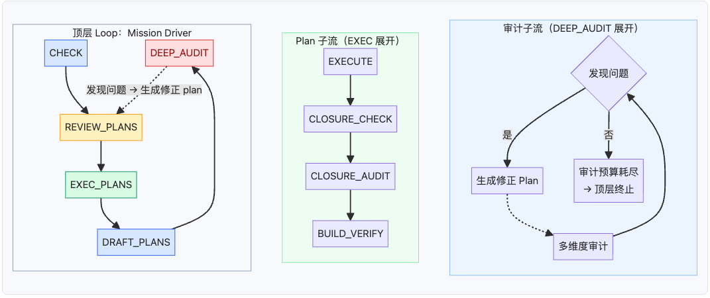
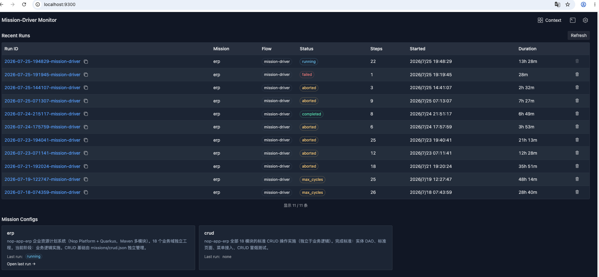
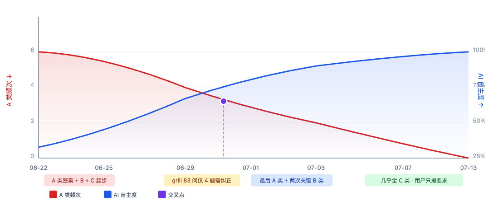
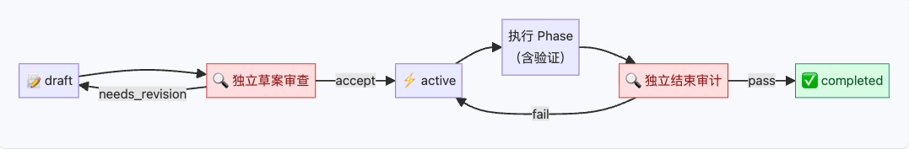

# Mission Driver：Loop Engineering 的一种通用参考实现

> 一个通用的 AI 任务驱动引擎如何通过 loop 嵌套实现局部容错和稳定保障。

# 第一部分：入门

## 一、问题：从 Vibe Coding 到自主运行

当前主流的 AI 辅助开发仍然是 Vibe Coding：人提示，AI 响应，人纠正，AI 再响应。这可称为 Human In The Loop（人在环中）模式。每一次产出都需要人确认和修正，人和 AI 交替工作。

这个模式有两个问题。

第一个是**质量失控**。AI 的执行本质上是概率采样过程，在没有外部控制结构介入时，AI 很容易走上岔路，比如改到一半跑去改别的代码，改完了忘记跑测试，失败了陷入死循环，进程崩溃后状态丢失只能从头再来。更危险的是自我宣称完成——跳过实际实现直接声称做完了。

第二个是**产能限制**。人在环中时，最终瓶颈仍然是人的工作时间和精力。人每天工作 8 小时，即使 AI 辅助让效率提升 3 倍，天花板也不过 24 人时。要真正释放 AI 的生产力，必须走向 Human On The Loop（人在环上）：AI 全自主 7×24 运行，人脱离 loop，成为按需介入的控制因子。

这不只是运行模式的转变，更是成本结构的变化。AI 可以 7×24 自主运行时，工时不再是制约因素。较弱的模型需要更长时间、消耗更多 token 才能完成工作，但它足够便宜，可以在夜间跑，不占用人的工作时间。多个 mission 可以并行处理不同的 roadmap 工作项。成本核算从"每小时人时产出"变成了"每美元智能产出"。

Mission Driver 就是实现这个转变的一种具体的控制结构。

## 二、什么是 Mission Driver（一分钟版）

Mission Driver 是一个声明式的任务驱动引擎。你给它一个目标（通过 roadmap 描述），它就自动进入一个循环：

```
检查健康状态（初始一次）→ 审查方案 → 执行方案 → 起草新方案 → （回到审查方案）→ 无新方案可起草时 → 深度审计 → （回到审查方案）...
```

循环一直跑，直到目标达成或审计预算耗尽。每一步都是独立的 AI 子进程或者脚本函数，单个步骤失败不会影响整体循环。

它是吸引子引导工程（Attractor-Guided Engineering）的一个组成部分（开源地址参见文末），不仅仅可以用于软件开发设计。通过配置自定义 flow、prompt 和 commands，它可以很自然地推广到数据处理、文档分析等场景，是一种通用的AI全自主运行机制。

它适合需要长时间运行、有明确验收标准、需要多步迭代的复杂任务。

Loop Engineering 是 AI 工程领域正在快速形成的一种设计方法论——用循环结构替代线性提示，让 AI 系统自主运行直到目标达成。它不是某个工具的专属特性，而是一种可以独立于具体工具来设计的工程模式。Mission Driver 就是 Loop Engineering 的一种通用参考实现。

## 三、怎么运作：Loop 嵌套与局部容错

如果把 Vibe Coding 看作是一种无限长的单一 Loop，Mission Driver 的核心就是将这个单一Loop分解为多层Loop的嵌套——Mission Driver 的主循环（五步闭环）在外层，内层嵌入了 Plan Loop（EXEC_PLANS 子流中的执行→检查→审计→验证闭环）和可选的 Audit Loop（DEEP_AUDIT 子流中的多维审计闭环）。理解了这个嵌套结构，就理解了它为什么能长时间稳定运行。



假设有 3 个 active plan，plan-002 的执行遇到了阻塞：

```text
EXEC_PLANS:
  ├── plan-001: EXECUTE ✓ → CHECK ✓ → BUILD ✓ → completed ✓
  ├── plan-002: EXECUTE ✗ → 重试 3 次仍失败 → subflow failed
  │              → 执行 agent 发现某个前提不成立
  │              → 将阻塞项移至 Deferred But Adjudicated，记录触发条件
  │              → 其余 Phase 继续执行 → completed（含 Follow-up 项）
  └── plan-003: EXECUTE ✓ → CHECK ✓ → BUILD ✓ → completed ✓
```

plan-002 的执行阻塞完全没有影响 plan-001 和 plan-003。阻塞被限制在子流程内部，不传播到兄弟子流程或父循环。这就是 loop 嵌套带来的局部容错。

> Plan 执行时，AI 根据实际情况决定：局部阻塞的项移入 `Deferred But Adjudicated` 并记录 successor 触发条件，其余范围正常完成；如果整个 plan 方向被证伪，则标记为 `superseded` 或 `cancelled`。plan 的 `.md` 文件状态始终由 AI agent 管理。

每一步的执行状态都持久化到磁盘（plan 文件中的 checkbox）。进程崩溃后重启，引擎扫描磁盘上的 checkbox 标记，从断点恢复，不回放历史。


# 第二部分：起步

## 四、快速上手

> Mission Driver 的源码工程在 AGE Template项目中，一般我们会在自己的项目中增加tools/mission-driver.sh脚本来代理调用Mission Driver，然后通过MISSION_DRIVER_HOME 环境变量来指向Mission Driver的源码目录。

**起步流程**：

1. 下载 AGE 模板，让 AI 阅读并适配你的项目（调整文档结构、配置 commands、初始化 roadmap）
2. 确保测试命令可执行（npm test / mvn test / Playwright）
3. 日常与 AI 对话时按 plan guide 拟制计划到 plans 目录，积累 plan 和 log
4. 启动 mission

```bash
# 生成 mission 配置 + roadmap
./tools/mission-driver.sh draft "你的目标描述" 

# 验证配置
node $MISSION_DRIVER_HOME/src/mission-check.mjs missions/<name>.json .

# Dry-run 验证流程编排
./tools/mission-driver.sh run <name> --dry-run --no-monitor

# 正式运行
./tools/mission-driver.sh run <name>
```

**监控**：

Mission Driver内置了一个可视化的监控页面



```bash
open http://localhost:9300              # 浏览器看板
cat _tmp/<runDir>/run-state.json        # 读状态
tail -f _tmp/<runDir>/<mission>.log     # 追日志
```


**中断和恢复**：

```bash
# Ctrl-C 安全中断（引擎捕获信号，清理子进程）
# 重新运行即自动恢复
./tools/mission-driver.sh run <name>

# 从特定步骤恢复
./tools/mission-driver.sh run <name> --from-step EXEC_PLANS

# 快速模式（跳过 DEEP_AUDIT）
./tools/mission-driver.sh run <name> --fast
```

**Postmortem**：

```bash
./tools/mission-driver.sh analyze           # 最近一次运行复盘
./tools/mission-driver.sh analyze <runId>   # 特定运行复盘
```

Postmortem 扫描所有事件和日志，运行复盘 agent，将结构化报告写入 memory 目录。后续同模块的 mission 会自动加载这些经验。

## 五、四层定义体系

Mission Driver 由四层定义组成，通过配置而非编程来使用。

### 5.1 Mission Config（missions/\<name\>.json）

纯静态配置，声明做什么、在哪做、怎么验证：

```json
{
  "name": "medical-qa",
  "description": "从医疗论文生成 QA 训练数据集",
  "roadmapPath": "docs/backlog/medical-qa-roadmap.md",
  "plansDir": "docs/plans/medical-qa",
  "commands": {
    "test": "python scripts/check_quality.py --min-records 500",
    "typecheck": "python -c \"import dataflow\" && echo OK"
  },
  "promptsDir": "missions/prompts/data-processing"
}
```

commands.test 是必需字段，CHECK 和 BUILD_VERIFY 都会运行它。build/lint/typecheck 可选，缺失则跳过。运行时状态在 _tmp/\<runId\>/run-state.json，不写入 mission.json。

### 5.2 Flow 定义

引擎核心是**通用状态机 DSL 执行器**（`FlowEngine`，零项目特定逻辑）。Flow 定义声明步骤怎么编排、如何转换、遇到错误怎么办。引擎按 flow 描述推进状态机，不绑定任何固定步骤。

一个简化的 flow 结构：

```json
{
  "name": "my-flow",
  "entry": "CHECK",
  "steps": {
    "CHECK": {
      "type": "agent",
      "promptPath": "prompts/health-check.md",
      "transitions": {
        "pass": { "goto": "NEXT_STEP" },
        "fail": { "done": "failed" }
      }
    },
    "NEXT_STEP": {
      "type": "subflow",
      "flow": "my-subflow",
      "forEach": "activePlans()",
      "transitions": {
        "all_complete": { "done": "completed" }
      }
    }
  }
}
```

- **步骤类型**：`agent`（AI 子进程）、`script`（JS 函数）、`subflow`（嵌套子流）、`group`（分组步骤）
- **控制流**：`transitions` 定义步骤间的跳转（`goto`/`done`/`retry`）；`forEach` 遍历集合为每个元素启动子流；`when`/`otherwise` 条件跳过
- **错误处理**：每步可配 `maxRetries`、`onMaxRetries`、`onError`、`onUnknown`；引擎还提供全局死循环检测（ping_pong + max_cycles + max_total_steps）

**随引擎内置的默认 flow**（`flows/mission-driver.json`）就是文章一直在讲的那个循环。它的实际结构是：CHECK **仅入口运行一次**，然后进入 REVIEW_PLANS → EXEC_PLANS → DRAFT_PLANS 的循环体；当 DRAFT_PLANS 无新方案可起草时进入 DEEP_AUDIT，之后回到循环体。它不是硬编码，只是一个**缺省配置**。EXEC_PLANS 和 DEEP_AUDIT 本身也是子流程（`plan-execution.json` / `deep-audit-loop.json`），可单独替换。

这意味着**可以设计全新的流程**——例如一个代码审查工作流，不需要 Plan 编排，可以直接写一个四步流程：FETCH_PR → RUN_LINT → AI_REVIEW → POST_COMMENT。在 `missions/flows/` 目录中存放自定义 flow.json，同时在 mission.json 中设置 `"flowName": "<custom>"` 即可，引擎不变。

### 5.3 Plan 文件

Plan 是由 AI 按照一定的格式要求自动生成的最小工作单元，它的核心不是定义一组待办工作，而是定义如何判断工作完成的关闭契约。它的标准结构如下：

```markdown
# 01 采购订单审批流接入

> Plan Status: draft
> Last Reviewed: 2026-07-25
> Source: roadmap item "核心业务逻辑 M1"

## Current Baseline
- ErpPurOrder 实体已建模，CRUD 已生成
- 尚无审批逻辑

## Goals
- 采购订单支持提交→审批→拒绝/通过状态流转
- 审批通过后触发库存过账

## Non-Goals
- 不做多级审批
- 不做审批委托

### Phase 1 - 审批状态机
Status: planned

- [ ] 实现 submitForApproval / approve / reject 方法
- [ ] 状态校验：仅 DRAFT 可提交

Exit Criteria:
- [ ] submit→approve 后 posted=true
- [ ] 单元测试覆盖所有状态转换

## Closure Gates
- [ ] 端到端：提交→审批→过账→冲销 完整链路跑通
- [ ] 独立子代理 closure audit 通过
- [ ] mvn test 全绿
```

顶部三行状态标记、Goals + Non-Goals（防止 scope drift）、每个 Phase 有 Status + checkbox + Exit Criteria、Closure Gates 是 plan 级关门检查。Checkbox 是机器可读的持久化状态，引擎通过扫描 checkbox 从断点恢复。标记 completed 前所有 checkbox 必须勾选。

**在 AGE 实践中，一般情况下人不需要阅读 Plan，完全依赖AI自主创建和更新**。

### 5.4 Roadmap

Roadmap是人类可阅读、可控制的宏观规划。按 `docs/backlog/00-roadmap-authoring-guide.md` 规范，工作项按里程碑分组，只携带 `todo`/`ready`/`done` 三种状态，里程碑本身不带状态：

```markdown
# Core Business Roadmap

> 前置条件：CRUD 全部完成

## Work Item Status

### Milestone M1 — 核心业务循环

- 采购申请审批→转订单逻辑：`done`
- 销售报价单审批→转订单逻辑：`done`
- Purchase Order BizModel（审批/入库触发/过账）：`done`
- Sales Order BizModel（审批/出库触发/过账）：`done`
- 三单匹配逻辑：`done`

### Milestone M2 — 业财一体端到端

- 采购到付款全链路（PO→Receive→Invoice→Pay）：`done`
- 销售到收款全链路（SO→Delivery→Invoice→Receipt）：`done`
- 期末结账全流程：`todo`
- 退货到退款全链路：`todo`

### Milestone M3 — 扩展域业务逻辑

- HR 排班引擎：`todo`
- 工资核算：`todo`
- APS 排产：`todo`
```

DRAFT_PLANS 启动 AI agent：完整读取 roadmap + 历史 plan 中的 deferred 项 → 阅读项目上下文和 planGuide → 选择接下来 1-3 个工作项 → 起草 plan 草案（`Status: draft`）→ 调用独立子 agent 审查通过后标记 `active`。无剩余工作可起草时返回 `nothing`，引擎据此决定是否进入审计轮次。

## 六、配置与定制

Mission Driver 引擎是完全通用的，定制可以通过配置和 prompt 覆盖来完成，完全不需要修改代码。一般情况下，在自己的项目中只需要增加一个mission-driver.sh，它通过环境变量配置的路径调用AGE模板项目中的 Mission Driver 实现即可。

| 定制层 | 机制 | 示例 |
|--------|------|------|
| Prompt 覆盖 | `missions/prompts/\<name\>.md` 覆盖内置 | 数据处理的 EXECUTE prompt 说"调脚本"而非"改代码" |
| Flow 微调 | 在 `missions/flows/mission-driver.json` 覆盖同名 flow，增删改步骤 | 在 CHECK 后插入一个合规审计步骤 |
| 全新流程 | 写 `missions/flows/\<custom\>.json`，mission.json 设 `flowName: "\<custom\>"` | 代码审查流 FETCH_PR → RUN_LINT → AI_REVIEW → POST_COMMENT，不含 Plan 编排 |
| 子流覆盖 | 在 `missions/flows/` 放同名子流 JSON（如 `plan-execution.json`）替换内置子流 | 替换 EXEC_PLANS 子流，让每个 active plan 执行前后调外部脚本 |
| Commands | `mission.json` 的 commands 字段 | test = 质量检查脚本 |

**flow 加载优先级**：项目 `missions/flows/\<flowName\>.json` → 引擎内置 `tools/mission-driver/flows/\<flowName\>.json`。同名文件项目优先。子流同样遵循此链。

`promptsDir` 配置允许不同 mission 指向不同的 prompt 子目录，实现同一引擎、不同 prompt 集：

```json
{
  "promptsDir": "missions/prompts/analysis",
  "flowName": "mission-driver"
}
```

引擎 prompt 加载链：`promptsDir`（任务类型级）→ `missionsDir/prompts`（项目级）→ 内置默认。不设 `promptsDir` 时行为不变。

内置的 CHECK→REVIEW→EXEC→DRAFT→AUDIT 适用于软件开发类的大部分场景。但对于数据处理、文档分析等任务，完全可以用不同的 flow 来适配——引擎不变，换一个 flow 文件即可。

以上定制方式充分体现了可逆计算理论中Delta差量定制的思想，是非侵入式定制的一种具体实现。Delta定制的详细介绍参见[《如何在不修改基础产品源码的情况下实现定制化开发》](https://mp.weixin.qq.com/s/JopDTYBIw0_Pmp0ZsTuMpA)

# 第三部分：实践方法

## 七、循环即智能

Mission Driver 的有效性并不仅仅来自于单次 AI 调用的质量，更主要的是来自于循环反馈改进。每一轮执行产生的反馈（测试结果、审计发现、人工纠正）应该被记录下来，用于改进下一轮。

AGE采用两条改进轨道并行运行：

**做事的提示词**（DRAFT/EXECUTE）：当 AI 生成的 plan 或代码被人工纠正时，纠正记录被子 agent 分析，提取通用规则写入 skill。下次 AI 自动加载。

**检查的提示词**（CLOSURE_AUDIT/DEEP_AUDIT）：当审计遗漏问题时，补充检查维度到审计 prompt。

```text
AI 生成第一版
  → 人工修改（修改过程被 log 记录）
  → 独立子 agent 对比原始和修改后版本
  → 提取"为什么改"的通用规则
  → 写入 skill 或编码规范
  → 下次 AI 自动加载
```

nop-app-erp 项目积累了 19 个可复用 skill，全部来自这种循环改进。

## 八、E2E 测试的 AI 自动生成

E2E 测试的手工编写和维护成本非常高，此前很少有团队能长期大范围的维护。现在则可以让 AI 自动生成。关键是降低难度：封装 PageObject 模式，提供 `getFieldValue(containerLocator, fieldName)` 等简化操作，让 AI 不需要对每个页面都重复处理复杂的 DOM 选择器。

例如，在 Nop 平台的 AMIS 页面中，每个字段都通过 view.xml 的 `<cell id="customerName">` 定义了稳定的业务标识，它会被渲染为 AMIS 组件的 `name` 属性。AI 只需以业务名称查找字段：

```
# AI 关注"取客户名称"这个意图，而非 DOM 路径
value = getFieldValue(page, "customerName")
# 封装层内部按 name 属性定位到对应 AMIS 组件的输入元素
```

这种封装让 AI 生成的测试脚本更稳定——页面布局调整时，只需更新 PageObject 封装层，已有的测试用例无需逐条修改。

nop-app-erp 从 0 到 260+ spec，在初期人工纠正频繁，后期则基本自动生成或修改。

# 第四部分：案例研究

## 九、nop-app-erp：22 天 154 模块

nop-app-erp 提供了一个可公开审计的案例：多层 Loop 嵌套如何驱动 AI 从空骨架产出产品级 ERP。在这个项目中，日志/审计/计划 等目录记录了所有关键性决策的执行过程和原因，因此可以完全用AI自主分析并回答一切关于这个项目演化的问题。
这一点是AGE明确要求项目本身是唯一事实真相源的必然结果：没有任何信息滞留在人脑中、Chat 窗口中、临时对话中，项目的文档和源码包含了项目最新情况以及它的完整演化轨迹信息。

### 规模指标（经独立审计校准）

| 维度 | 数值 |
|------|------|
| 开发周期 | 22 天 |
| 业务域 | 18 + 1 |
| Maven 模块 | 154 |
| 自有实体 | 352 + 110 引用桩 |
| Java 测试 | ~2890（0 failures） |
| Playwright E2E | 260+ spec（0 回归） |
| Plan 文件 | 187 份（全部双审计） |

### 一次真实的循环（07-10）

```
08:00 CHECK     — mvn 全绿
08:05 REVIEW    — 4 个 draft → 独立审查 → all active
09:30 EXEC      — 4 个 plan 全部执行完毕，全绿通过
16:00 DRAFT     — 路线图工作项全部 done
16:05 DEEP_AUDIT — 自动启动深度审计
```

一次循环约 8 小时。整个路线图横跨 22 天，由数十次循环完成。

### 编码前缺陷拦截

07-10 的一个 plan 批次，独立草案审查拦截了 4 个 P0 缺陷：码值冲突、BUDGET 污染实际财务、GlBalance 架构前提错误、维度歧义。全部在编码前拦截。没有 Plan Loop，这些缺陷会在实施甚至运行阶段才暴露。

### 知识转移曲线

用户介入分三类：A 类（明确指明平台机制，集中在早期）、B 类（指明工程原则方向）、C 类（只让 AI 自查对比，后期为主）。



两条曲线在 06-29 ~ 07-01 交叉，此后 AI 自主成为主要工作模式。

"用户后期介入归零不是因为 AI 学会了写代码，而是因为吸引子已经定义好了（吸引子的形式化定义见 §十二）。方向对了，AI 就能自动推进。"

人的注意力应该花在定义吸引子上，而不是监督执行。Mission Driver 做的是后者。整个 22 天只有 28 次人类干预，且集中在项目早期。后期随着吸引子定型，人类介入归零，AI 完全自主推进。

# 第五部分：深度分析

## 十、Loop Engineering 原理

传统的 pipeline 假设每一步都是确定性的，但是 AI 执行的本质就是概率性的——同一个 prompt 在不同 session 可能产生不同结果。

Loop 嵌套的优势：失败是预期的（loop 天然支持重试和跳过）、质量是迭代的（audit 发现后可以改进）、恢复是自然的（checkpoint 就是磁盘上的 checkbox）、隔离是结构性的（子流边界 = 容错边界）。

Loop Engineering 的三个基本原则是，轨迹可恢复（持久化到磁盘，崩溃后磁盘扫描恢复）、局部容错（子任务失败不传播到父循环）、独立验证（完成与否由独立子代理审计，不由执行者自验）。

### 稳定保障

| 防线 | 机制 | 作用 |
|------|------|------|
| 磁盘持久化 | 所有状态写磁盘 | 崩溃 → 重启 → 磁盘扫描 → 断点恢复 |
| 子流隔离 | 每个 plan 独立子流 | 局部错误不扩散 |
| 重试预算 | 每步最多 3 次全新 session | 避免同一上下文重复失败 |
| 死循环检测 | ping_pong + max_cycles + max_total_steps | 防止无限循环 |
| 看门狗 | 60 分钟子 agent 超时 | 防止挂死 |
| 独立审计 | CLOSURE_AUDIT 用不同子代理 | 防止执行者自欺 |

### 恢复机制

恢复不是 replay（不重新执行历史步骤），而是 disk scan（扫描磁盘标记）。引擎启动后扫描 plansDir 的 .md 文件，找到 Status: active 的 plan，读 checkbox（[x] 跳过，[ ] 恢复）。run-state.json 的 steps 历史仅用于审计查看，不驱动恢复。

## 十一、Plan Loop 与验证体系

每次 plan 的执行本身有一个内部控制循环——Plan Loop。



核心原则：生成与验收必须分离。草案审查和结束审计都由独立子代理在全新会话中执行，审计者不继承执行者的上下文，从零开始读仓库。

### 验证体系：脚本检测 + AI 自动改进

对于 Plan 是否完成的审计验证不是单纯的机械检查或 AI 审计，而是两者的配对协作。脚本自动检测，发现问题后 AI 自动诊断并修复，然后重新检测。

```
EXECUTE (agent: AI 执行 plan)
  ↓
CLOSURE_SCRIPT_CHECK (script: 检查 checkbox + evidence)
  ├── pass → BUILD_VERIFY
  └── fail → CLOSURE_AUDIT (独立子代理审查)
               ├── 可修 → 回 EXECUTE
               └── 不可修 → 阻塞项移至 Deferred/Follow-up
                              plan 其余范围继续 → completed
BUILD_VERIFY (agent: AI 运行 test/build/lint)
  ├── 失败 → AI 自动诊断 → 修复 → 重新运行
  └── 通过 → plan completed ✓
```

| 检查点 | 检测方式 | 发现问题后 |
|--------|---------|-----------|
| CHECK | 确认可编译、测试通过的基线 | AI 自动修复（最多 3 次全新 session） |
| CLOSURE_SCRIPT_CHECK | script 检查 checkbox + evidence | 进入 CLOSURE_AUDIT → 回 EXECUTE；不可修项移至 Deferred/Follow-up |
| BUILD_VERIFY | AI 运行 test/build/lint | AI 诊断 → 修复 → 重新运行 |
| DEEP_AUDIT | 多维度审计 + 对抗审查 | 生成 remediation plan |

机器负责裁判，AI 负责改进。

## 十二、AGE 理论：吸引子与动力系统

Mission Driver 是 AGE（Attractor-Guided Engineering）理论在工具层的核心实现：

```
状态空间 = 仓库/项目的所有可能状态
吸引子   = docs 文档体系（design/architecture 等规范化文档）
           定义"系统应长期收敛到什么稳定结构"
轨迹     = plans + logs + audits 记录的"怎么走到现在的"
控制     = 健康检查 + 执行验证 + 独立审计 校正偏离
```

需要注意，roadmap 不是吸引子。Roadmap 是人类可控制的宏观规划，是吸引子的任务化投影，真正的吸引子是 docs 中的文档体系。

### 吸引子的形成

吸引子不是一开始就明确的。它有一个从模糊到清晰的过程：

```
一句话需求 → Grill Me 澄清 → 吸引子雏形（docs 初稿 + roadmap）
  → roadmap 初期：调研竞品，细化吸引子
  → roadmap 中期：按项执行，审计收敛
  → 定期插入：审计/重构/再思考，修正吸引子
  → 收敛完成
```

整个 roadmap 全自主执行，而人类通过两个通道对它施加影响：执行前（Grill Me 澄清 + roadmap 设定）和执行中（异步注入 plan 到 plans 目录）。

### 异步人机交互

Mission Driver 执行中不需要人类实时交互。但人类可以随时通过 plans 目录异步注入新任务：

```
用户（或另一个 AI agent）生成新 plan → 放入 plans/ 目录
  → 下一轮 REVIEW_PLANS 自动拾取
  → draft 状态：独立审查 → 提升 active
  → active 状态：直接进入执行队列
```

plans 目录可以看作是文件系统上的共享队列，多个贡献者可以独立写入：人类开发者、Code Review agent、DEEP_AUDIT 生成的 remediation plan，都进入同一队列。并不需要强行打断当前正在执行的 mission来插入额外的工作。

## 十三、与 Codex goal 的对比

这里可以将 Mission Driver 与 Codex编程工具的goal模式做一个对比。通过对Codex的源码分析，可以发现Codex具有比较完善的机制（SQLite 状态库、goal 6 态状态机、pause/resume、token 预算），但以下维度与Mission Driver相比仍有较大区别。

| 维度 | Codex goal | Mission Driver                               |
|------|------------|----------------------------------------------|
| 状态持久化 | SQLite + rollout JSONL。但运行时计量状态仅在内存 Mutex，崩溃即丢失；rollout 可能未物化 | checkbox 磁盘持久化 + run-state.json，所有状态在磁盘      |
| 独立验证 | continuation prompt 要求自审，但 update_goal(complete) 仅写 DB 不检查客观状态 | 脚本检查和AI检查结合，CLOSURE_AUDIT 强制由独立子代理执行         |
| 任务粒度 | 每 thread 至多 1 个 goal（单一目标 + token 预算） | 多 plan 共存管理：plans/ 可同时有多个 active plan，引擎顺序执行 |
| 异步交互 | 可 pause/resume 同一线程，但无法异步注入新任务 | 随时往 plans/ 塞 plan，下轮自动拾取                     |
| 失败隔离 | 单 goal 内失败污染 context window | 子流隔离：一个 plan 失败不影响其他                         |
| 终止保障 | token 预算 + blocked 检测（模型自报需 3 轮；自报后 deferred 表防续跑） | 多层防线（重试预算、死循环检测、看门狗等），全部外部强制                 |
| 信息可见性 | SQLite + JSONL 需工具解析；运行时状态内存不可见 | 所有状态是文件，人和AI均可读                              |

# 第六部分：愿景

## 十四、Goal-Driven 愿景与经济范式

Mission Driver 的演进方向是 goal-driven 的 AI 系统——用户说目标，系统自动澄清、规划、执行、验证。

```
用户: "帮我分析 nop-stream 和 Flink 的区别，改进nop-stream直到它成为一个成熟的分布式流处理框架"
  → Grill Me（需求澄清）→ clarified spec
  → Auto-Detect（任务类型 → promptsDir）
  → Generate（roadmap + mission.json）
  → Run（自动循环执行直到完成）
```

其中 Generate（draft 命令）和 Run（run 命令）已有实现基础。Grill Me（deep-interview skill 增强）和 Wrapper（入口层）需要补建。

### 经济范式的转变

§一 已经指出 Human In The Loop 模式中效率瓶颈在于人必须在环内。Human On The Loop 的核心改变不是把人排除出去，而是把人的位置从 loop 内部的执行节点移到 loop 外部的控制因子。介入的频率和时机由吸引子的清晰度决定，而非 AI 的工作节奏。

这个结构性变化最深刻的影响是**模型选择策略的反转**：

- Human In The Loop 模式下，每一次产出都阻塞在人的确认上。人不能等，所以必须用最快最强的模型，哪怕它贵。响应延迟是首要约束，模型成本是次要的。
- 全自主运行模式下，没有人在等。弱模型虽然慢、token 消耗多、需要更多轮迭代才能完成工作，但它单价低、可以晚上跑、可以多个 mission 并行处理不同的 roadmap 工作项。响应延迟从约束变成可调度变量。

成本核算因此从"每小时人时产出"变成"每美元智能产出"——前者优化的是单次人机交互的效率，后者优化的是单位算力的累积产出。这两个优化目标导致完全不同的工程选择：前者追求单次对话质量，后者追求循环结构的稳定性和审计严密度。

## 十五、总结

Mission Driver 的价值在于三个方面：

第一，它用持久化的、可局部重试的 loop 嵌套替代线性 pipeline。AI 步骤是概率性的，需要重试、迭代、局部容错。子流隔离让一个 plan 的失败不影响其他 plan。

第二，它通过配置而非编程实现定制。引擎是通用的 Flow DSL 执行器，内置的五步循环只是默认 flow——可以微调步骤、替换子流，也可以设计全新的流程。不同任务类型的区别在 flow + prompt + commands 三层。

第三，它把所有状态放在磁盘上。checkbox 持久化 + 磁盘扫描恢复，进程崩溃后无损恢复。

它不局限于代码开发。任何需要多步迭代、质量审计、容错恢复的复杂任务，都可以用它驱动。这正是 Loop Engineering 作为一种工程实践的落地实现。

## 进一步阅读

- Mission Driver 源码：https://github.com/entropy-cloud/attractor-guided-engineering-template/tools
- Plan 编写指南：https://github.com/entropy-cloud/attractor-guided-engineering-template/plans/00-plan-authoring-and-execution-guide.md
- AGE 理论深度分析：`ai-dev/analysis/2026-06-07-trellis-vs-age-comparison.md`
- nop-app-erp 案例完整材料：https://github.com/entropy-cloud/nop-app-erp
