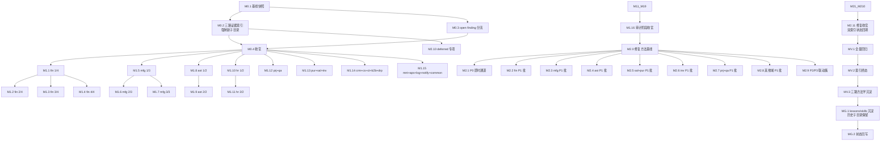

# ai-check 第二轮路线图（系统级代码 × 历史 × Deferred 三路交叉审计与修复）

> 最后更新：2026-08-28-2049（**M0 阶段完成**——M0.1/M0.2/M0.3/M0.4 全部 done，零代码改动，产物落盘 `docs/audits/check/2026-08-28-2049-ai-check-r2/`，引用 2026-08-28 3947/669 全量绿基线；M1 切片就绪；M2 修复批边界已定义）
> 来源：用户需求（2026-08-26~28，承接 ai-check 第一轮 C8.3 收口审计的"启动 ai-check-r2"建议 + 用户后续明示"检查所有历史审计 + plan 中 deferred 等内容，结合本项目实际代码"）
> 设计：**`docs/skills/code-history-deferred-triangulation-audit-prompt.md`**（本轮新增 skill）+ **`docs/skills/executions/audit-roadmap-authoring-workflow.md`**（配套执行流）
> 关联：`docs/backlog/ai-check-roadmap.md`（第一轮，已收口：533 finding / 45 fixed / 488 open 走 F2.x/F3.x）
> 关联：本轮 M0 产物：`docs/audits/check/2026-08-28-2049-ai-check-r2/{m0-1-baseline-snapshot,m0-2-deferred-trigger-index,m0-3-open-findings-bucketing,m0-4-closure,ai-check-r2-index}.md`
> 规范：`docs/backlog/00-roadmap-authoring-guide.md`
> 执行：mission driver（`./tools/mission-driver.sh run ai-check-r2`）；roadmap 状态块为唯一动态状态真相源
>
> **本轮审计结果子目录约定**（多次执行隔离纪律）：
> `docs/audits/check/<YYYY-MM-DD-HHmm>-ai-check-r2/ck-<slice>.md`
> `docs/audits/check/<YYYY-MM-DD-HHmm>-ai-check-r2/ai-check-r2-index.md`
> 详见 `docs/skills/code-history-deferred-triangulation-audit-prompt.md §1.1` 与 `docs/skills/executions/audit-roadmap-authoring-workflow.md §1.4`

## 目的

本路线图是 ai-check 第二轮 mission：在第一轮 533 finding（44 fixed + 488 open + 219 P3 + deferred 触发条件扫描）的基线上，以**"代码 × 历史 × Deferred"三路交叉审计**为方法学核心，系统性：

1. **消化第一轮 488 个 open finding**（按域簇批量走 F2.x/F3.x 修复，继承 ai-check 状态机）
2. **重启三路交叉审计**——按域 / 按切片重点扫描（特别是**第三路：历史 deferred 触发条件**——这是第一轮已发现但未系统化的盲区）
3. **覆盖第一轮未触达的隐藏维度**——历史 deferred 触发条件扫描结果中"今天已满足但未识别"项的批量立项

本轮的设计特征：
- **复用 ai-check 索引与状态机**（finding ID 连续，状态机延用）——避免 mission 闭包成本
- **三路审计是本轮核心方法学**（不是第一轮的 D1-D10 单维度），通过新 skill 固化
- **修复阶段规则更严**——必须先写失败测试再修复（与第一轮 F0.2 同规）
- **多次执行隔离**——每次执行新建 `docs/audits/check/<日期时间>-ai-check-r2/` 子目录，不复用历史目录

## Work Item Status

> 唯一的动态状态块。状态：`todo` / `ready` / `done`。初始全 `todo`。**独立草案审查**通过转 `ready`；**独立结束审计**通过转 `done`。AI 不自行重排优先级或发明工作项。

### Milestone M0 — 基线与三路证据索引（前置）

| # | Work Item | Status | Owner Doc | Deps | Skill |
|---|-----------|--------|-----------|------|-------|
| M0.1 | **基线快照**：跑 `mvn clean install -DskipTests` + `mvn test` + `bash docs/audits/nop-compliance-checker.sh` 记录当前基线；引用 `docs/testing/known-good-baselines.md` 最新全绿行作回归对照；同步登记 `known-good-baselines.md` `ai-check-r2-m0` 新行 | `done`（2026-08-28-2049 引用 3947/669 全量绿基线）| `docs/audits/compliance-baseline.md` | — | none |
| M0.2 | **三路证据索引**：① 第一路索引（按域 × B1/B2/B3/B4 维度扫一次本轮切片）；② 第二路索引（读 `docs/audits/` + `docs/lessons/` + `docs/audits/check/ai-check-index.md` 全量，按"复用 / 新增 / 残余风险"三态裁决）；③ **第三路索引（核心）**：读最近 50 份 plan 的 Deferred / Successor / Non-Goal 段，列出每条 deferred 项的触发条件 + 今天是否已满足 + 是否立项 finding。落盘 `docs/audits/check/<YYYY-MM-DD-HHmm>-ai-check-r2/ai-check-r2-deferred-trigger-index.md`（**强制新子目录**） | `done`（2026-08-28-2049 落盘 8 已满足 + 11 部分满足 + 21 未满足 deferred 扫描）| `docs/audits/check/` + `docs/plans/` | — | `code-history-deferred-triangulation-audit-prompt` |
| M0.3 | **第一轮 488 open finding 分流**：按域 / 按同型 把 488 open finding 分到 M2.x 修复批；同型 finding 合并工作项（如 "P1-CK-pur-003 / sal-004 / inv-005 / mfg2-012 / mfg3-011 全部归到 AbstractErpCrudBizModel 同源修复"） | `done`（2026-08-28-2049 落盘 28 域分布表 + 8 同型合并基类 + 13 批修复边界）| `docs/audits/check/ai-check-index.md` | M0.1 + M0.2 | none |
| M0.4 | **基线检查阶段收官**：`git status` 确认零代码改动（仅 docs 变更）；新 baseline 行登记 known-good-baselines.md | `done`（2026-08-28-2049 零代码改动确认 + 不重登记已知基线）| `docs/audits/00-audit-execution-guide.md` | M0.1~M0.3 | `closure-audit-prompt`（独立子代理） |

### Milestone M1 — 三路交叉审计（按域切片）

> **核心方法学**：每个工作项 = 1 份 plan EXECUTE 三路交叉审计，**plan EXECUTE 第一步必新建本轮审计结果子目录** `docs/audits/check/<YYYY-MM-DD-HHmm>-ai-check-r2/`，产出 `<执行目录>/ck-<slice>.md` + `<执行目录>/ai-check-r2-index.md` + 同步追加 `docs/audits/check/ai-check-index.md`。
> **完整枚举原则**（沿用 ai-check-r1）：禁止抽样；完成判据 = 计划切片全部 done + 三路证据齐全。
> **优先级**：S 级域（finance/mfg/hr/assets）行为维度按功能模块拆分；C 级域（aps/logistics/notify）合并。

| # | Work Item | Status | Owner Doc | Deps | Skill |
|---|-----------|--------|-----------|------|-------|
| M1.1 | **finance 三路交叉审计切片 1/4 — 过账与凭证**（第一路 BFMS §1-§4 全扫；第二路复用 ai-check-r1 P0-CK-mfg-001 / P1-CK-fin-001/003/005 等；第三路扫 finance 域最近 20 份 plan 的 Deferred） | `todo` | `docs/design/finance/posting.md` + `module-finance/erp-fin-service/src/main/java` | M0.x | `code-history-deferred-triangulation-audit-prompt` + `behavioral-failure-mode-scan-prompt` |
| M1.2 | **finance 切片 2/4 — AR/AP 核销与坏账**（同上结构，重点扩展维度 = 跨域反写闭环、`autoReconciliation` 路径） | `todo` | `docs/design/finance/ar-ap-reconciliation.md` + `bad-debt.md` | M1.1 | 同上 |
| M1.3 | **finance 切片 3/4 — 预算与成本** | `todo` | `docs/design/finance/budget.md` + `costing-methods.md` | M1.1 | 同上 |
| M1.4 | **finance 切片 4/4 — 期间结账与银行对账 + 跨域凭证链路** | `todo` | `docs/design/finance/period-close.md` + `bank-reconciliation.md` | M1.1 | 同上 |
| M1.5 | **manufacturing 三路交叉审计切片 1/3 — 工单与报工**（重点扩展维度 = 增量报工 / 多次部分完工路径；P0-CK-mfg-001 闭环验证） | `todo` | `docs/design/manufacturing/state-machine.md` | M0.x | 同上 |
| M1.6 | **manufacturing 切片 2/3 — BOM/MRP/CRP**（重点扩展维度 = MRP 仿真第 3 次循环 / 多场景冲突；P1-CK-mfg2-001/002/003 同型扫描） | `todo` | `mrp.md` + `crp.md` | M1.5 | 同上 |
| M1.7 | **manufacturing 切片 3/3 — 委外/批次追溯/差异** | `todo` | `subcontracting.md` + `batch-genealogy.md` + `variance-analysis.md` | M1.5 | 同上 |
| M1.8 | **assets 三路交叉审计切片 1/2 — 资产生命周期** | `todo` | `docs/design/assets/README.md` + `cip.md` + `split-merge.md` | M0.x | 同上 |
| M1.9 | **assets 切片 2/2 — 折旧与过账 + 盘点** | `todo` | `depreciation-and-posting.md` | M1.8 | 同上 |
| M1.10 | **hr 三路交叉审计切片 1/2 — 组织与员工** | `todo` | `docs/design/human-resource/` | M0.x | 同上 |
| M1.11 | **hr 切片 2/2 — 考勤与薪酬**（重点扩展维度 = 工资多币种 / xwf 审批失败语义） | `todo` | `payroll.md` + `attendance.md` | M1.10 | 同上 |
| M1.12 | **projects + quality 三路交叉审计** | `todo` | `docs/design/projects/` + `docs/design/quality/` | M0.x | 同上 |
| M1.13 | **purchase + sales + inventory 三路交叉审计**（重点扩展维度 = O2C/P2P 跨域反写闭环、增量核销、`upsertBalance` 同型） | `todo` | `docs/design/purchase/` + `docs/design/sales/` + `docs/design/inventory/` | M0.x | 同上 |
| M1.14 | **crm + cs + contract + b2b + drp 三路交叉审计** | `todo` | 各域 owner doc | M0.x | 同上 |
| M1.15 | **maintenance + aps + logistics + notify + common 三路交叉审计**（C 级域合并；扩展维度 = 设备维护 vs 资产 MAINTENANCE_EXPENSE 防双重扣减 + aps 排产可行性 + logistics webhook 路径） | `todo` | 各域 owner doc | M0.x | 同上 |
| M1.16 | **审计阶段收官**：校验所有切片三路证据齐全；本轮 `<执行目录>/ai-check-r2-index.md` 完整；`docs/audits/check/ai-check-index.md` 跨轮聚合同步；零代码改动（`git status` 仅 docs 变更）；独立子代理 closure audit | `todo` | `docs/audits/00-audit-execution-guide.md` | M1.1~M1.15 | `closure-audit-prompt` |

### Milestone M2 — P0 即时通道 + 第一轮 open finding 批量修复

> **修复方法论**（沿用 ai-check-r1 F0.2 + 加严）：每 finding 强制「先写失败测试 → 修复 → 测试绿 + 既有测试零回归」。证伪路径 = 书面 not-a-problem 说明（理由 + 证据）。
> **保护区域守门**：ORM 模型变更 = auto + dual-agent-approval（两个独立子 agent 分别检查批准）；会计过账 / auth / 数据删除 = plan-first + owner doc + tests。
> **修复优先级**：第一轮 488 open finding 的 P1 项按域批量；M1.x 新发现的 P0 即时通道（不进入批量）。

| # | Work Item | Status | Owner Doc | Deps | Skill |
|---|-----------|--------|-----------|------|-------|
| M2.0 | **修复方法基线**：每 finding 强制流程文档化（先写失败测试 → 修复 → 既有测试零回归）；基类化同型 finding（沿用第一轮 F1.3 AbstractErpCrudBizModel 范式）；基线检查点 = `mvn test -pl <domain>-service -am` 全绿 + 全 reactor 零新增失败 + compliance 不高于 M0 | `todo` | `docs/architecture/processor-extension-pattern.md` | M1.16 | none |
| M2.1 | **P0 即时通道**（如 M1.x 发现 P0）：就地修复 plan 内 + 异步注入 plan（`docs/plans/YYYY-MM-DD-HHmm-ai-check-r2-fix-*.md`）；不走 MR 批量 | `todo` | 找到 finding 的 owner doc | M1.x 任意 P0 发现 | `bug-d-diagnosis-prompt` |
| M2.2 | **finance 域 P1 修复批**：消化 M1.1-M1.4 立项 finding + 第一轮 open P1-CK-fin-*（97 项），按同型合并（fin-001/002/004 已于 r1 F2.1 修；r2 应聚焦 fin-006~019 等）+ check-then-act + 多账套隔离 | `todo` | `docs/design/finance/` | M2.0 | `bug-d-diagnosis-prompt` |
| M2.3 | **manufacturing 域 P1 修复批**（重点：mfg2-001 安全库存双扣 + mfg2-002 低阶码净额归集 + mfg2-003 仿真第 3 次循环 + mfg-003/004/005 等） | `todo` | `docs/design/manufacturing/` | M2.0 | `bug-d-diagnosis-prompt` |
| M2.4 | **assets 域 P1 修复批** | `todo` | `docs/design/assets/` | M2.0 | `bug-d-diagnosis-prompt` |
| M2.5 | **sales + purchase 域 P1 修复批** | `todo` | `docs/design/sales/` + `docs/design/purchase/` | M2.0 | `bug-d-diagnosis-prompt` |
| M2.6 | **inventory 域 P1 修复批** | `todo` | `docs/design/inventory/` | M2.0 | `bug-d-diagnosis-prompt` |
| M2.7 | **projects + quality 域 P1 修复批** | `todo` | `docs/design/projects/` + `docs/design/quality/` | M2.0 | `bug-d-diagnosis-prompt` |
| M2.8 | **mfg3 / crm / cs / ct / b2b / drp / log / aps / notify / maintenance / hr 域 P1 修复批**（按 r1 F2.5~F2.15 + r2 M1.x 新发现立项） | `todo` | 各域 owner doc | M2.0 | `bug-d-diagnosis-prompt` |
| M2.9 | **P2/P3 联动簇**：orgId 隔离族 + cron 键漂移家族 + notify 模板种子三库 + currentUserId 宽 catch 全域族 + 死常量清理 + 各域 P2 簇（按 r1 F3.x 沿用） | `todo` | `docs/architecture/module-boundaries.md` 等 | M2.0 | `bug-d-diagnosis-prompt` |
| M2.10 | **deferred 触发条件已满足项专项立项**（M0.2 第三路扫描结果）：对每条"今天已满足"的 deferred 项开修复 plan（含原 plan 编号 + 现状证据 + 触发条件达成证据） | `todo` | 原 plan 文件 + owner doc | M0.2 + M2.0 | `bug-d-diagnosis-prompt` |
| M2.11 | **修复阶段收官**：所有 P1 修复完毕；**两个索引状态回填**——本轮 `<执行目录>/ai-check-r2-index.md` + 跨轮 `docs/audits/check/ai-check-index.md`；同型 finding 状态继承（修复一处，全族回填） | `todo` | 两个索引文件 | M2.1~M2.10 | `closure-audit-prompt` |

### Milestone MV — 全量验证与索引终态校验

| # | Work Item | Status | Owner Doc | Deps | Skill |
|---|-----------|--------|-----------|------|-------|
| MV.1 | **全量回归**：`mvn clean install -DskipTests` BUILD SUCCESS（156 模块）+ `mvn test` 全 reactor 零新增失败 + compliance checker 不高于 M0.1 快照（合法新增走 baseline-raise 登记）+ 抽样 E2E 回归 | `todo` | `docs/testing/known-good-baselines.md` | M2.11 | `closure-audit-prompt`（独立子代理） |
| MV.2 | **索引终态校验**：所有 finding 到达 `fixed` / `not-a-problem` / `deferred`（deferred 计数与逐条理由显式报告） + 与第一轮 ai-check-r1 状态连续 + 19 域覆盖矩阵完整 + **跨轮 `ai-check-index.md` 终态闭合** | `todo` | `ai-check-index.md` | MV.1 | `closure-audit-prompt` |
| MV.3 | **三路交叉审计新发现的方法学沉淀**：本轮发现的"代码 × 历史 × Deferred 三路交叉"新模式入 `docs/lessons/`（如 `16-code-history-deferred-miss.md`） | `todo` | `docs/lessons/README.md` | MV.2 | none |

### Milestone MG — 收尾与知识沉淀

| # | Work Item | Status | Owner Doc | Deps | Skill |
|---|-----------|--------|-----------|------|-------|
| MG.1 | **新失败模式沉淀**：本轮三路交叉发现的可复用模式提升 `docs/lessons/` / `docs/skills/`；known-good-baselines 登记新基线行；**历史审计结果子目录保留**（不删除，作为审计证据） | `todo` | `docs/logs/00-log-writing-guide.md` | MV.3 | none |
| MG.2 | **状态回写**：本 roadmap 全部工作项 done；`docs/backlog/README.md` P 行更新（保持 ✅ done）；`docs/logs/` 收尾日志 | `todo` | 本路线图 | MG.1 | none |

## 框架/平台复用

- **核心方法学 skill**（本轮新增）：
  - `docs/skills/code-history-deferred-triangulation-audit-prompt.md`（**三路交叉审计员**——本轮核心；含 §1.1 多次执行隔离纪律）
  - `docs/skills/executions/audit-roadmap-authoring-workflow.md`（**配套执行流**——下次拟制审计类 roadmap 直接套用；含 §1.4 本轮子目录决策）
  - `docs/skills/audit-remediation-roadmap-authoring-prompt.md`（**roadmap 设计师**——本轮也按此 skill 拟制）
- **第一路取证 skill**：
  - `docs/skills/behavioral-failure-mode-scan-prompt.md` §1-§4（B1/B2/B3.1/B3.2 四类失败模式 + grep 程式）
  - `docs/skills/code-quality-audit-prompt.md`（通用 7 重点领域）
- **第二路证据基础**：`docs/audits/check/ai-check-index.md`（533 finding / 488 open / 19 域）+ `docs/audits/arm-index.md`（arm mission finding）+ `docs/lessons/01-15-*.md`（13 项已知失败模式）
- **第三路证据基础**：`docs/plans/2026-07-04-*.md` 起 300+ 份 plan，每份的 Deferred / Successor / Non-Goal 段
- **保护区域守门**：`docs/context/ai-autonomy-policy.md`（ORM/api.xml auto + dual-agent-approval；会计/财务过账 / auth / 数据删除 plan-first）
- **测试基础设施**：`module-common-test`（跨域测试基类）/ `app-erp-test-data`（种子）/ `erp-*-service` 各域 test 目录 / `app-erp-all` 集成用例
- **验证命令**：`mvn clean install -DskipTests` / `mvn test` / `bash docs/audits/nop-compliance-checker.sh`
- **多次执行隔离目录**：`docs/audits/check/<YYYY-MM-DD-HHmm>-ai-check-r2/`（每次执行必新建，不复用历史目录）

## 当前基线（2026-08-25~27 实仓快照）

- **第一轮 ai-check-r1 收口**：533 finding（1 P0 + 95 P1 + 218 P2 + 219 P3）/ 44 fixed（unique P0 + 跨域传染簇 + fin-001/002/003/004/005 + fin2-001/002/003/004/005 + fin3-001~005 + mfg2-012 / mfg3-011 / ast-007/015 / ast2-011/021 + prj-006/008 等）
- **488 open finding** = P1/P2/P3 大盘（详 ai-check-index.md）
- **基线测试**：`mvn test -pl app-erp-all` 54/0/0/1 + 全 reactor 3889/0/0/1/658（2026-08-27 V.1 行）
- **compliance checker 快照**（待 M0.1 复核；r1 C0.2 记录 R2c=1505 等）
- **第一轮 audit-remediation mission**：M0-MA1-MA7-MR1-MR4-MV-MG 流水线已收口；GC 大批 deferred 已裁决；RC mission 同期闭合（RC-R1.1~R1.89）
- **已知失败模式 13 项**（`docs/skills/README.md §已知失败模式`，含 lesson 09 业财过账吞咽 / lesson 10 dict 死状态 / lesson 11 arm-index 状态不回填）

## 依赖图

## 横切关注点

1. **两阶段时序硬约束**（继承 ai-check-r1）：M1.x 只产 finding / 不改任何代码；M2.x 才动手；M2.0 强制「先写失败测试 → 修复 → 既有测试零回归」
2. **三路交叉审计是本轮核心方法学**（不是第一轮 D1-D10 单维度）：每个 M1.x 工作项 plan EXECUTE 必跑三路，缺一路不算审计完
3. **复用 ai-check-r1 索引与状态机**（finding ID 连续，状态机延用 `open` / `verifying` / `fixed` / `not-a-problem` / `deferred`）
4. **复用裁决纪律**：M1.x 第二路取证时，每个候选 finding 必填「arm-index 复用裁决」列（同型已 fix 复用范式；同型 deferred 且触发条件满足立项；触发条件未满足入 §5 残余风险）
5. **deferred 触发条件扫描是本轮最大学习点**（M0.2 + M2.10 联动）：历史 deferred 项的触发条件经本轮系统化扫描后，**满足项**进入 M2.10 修复批；**未满足项**仍为残余风险，watch-only 监控
6. **保护区域守门**（沿用 ai-check-r1）：ORM 模型变更 auto + dual-agent-approval；会计过账 / 数据删除 / auth = plan-first + owner doc + tests + 独立 plan audit
7. **P0 即时通道**（沿用 ai-check-r1）：M1.x 发现的 P0 不进入 M2 批量；plan 内就地修复 或 异步注入修复 plan（`docs/plans/YYYY-MM-DD-HHmm-ai-check-r2-fix-*.md`）
8. **多次执行隔离纪律**（本轮新增强约束）：**每次执行必新建** `docs/audits/check/<YYYY-MM-DD-HHmm>-ai-check-r2/` **子目录**——不写到 `docs/audits/check/ck-*.md` 扁平空间；不复用历史目录；详见 `code-history-deferred-triangulation-audit-prompt.md §1.1` 与 `executions/audit-roadmap-authoring-workflow.md §1.4`
9. **跨轮索引规则**：本轮 `<执行目录>/ai-check-r2-index.md`（仅本轮）+ `docs/audits/check/ai-check-index.md`（跨轮聚合）；发现 ID 跨轮冲突按 `code-history-deferred-triangulation-audit-prompt.md §3.1` 处理（加 `-r2/-r3` 后缀）
10. **report 归档规范**（沿用 ai-check-r1 + 本轮强化）：M1.x 产出 `<执行目录>/ck-<domain>.md`（5 段结构）+ 本轮索引 + 跨轮索引同步
11. **compliance baseline 守护**：M0.1 记录基线；M2 修复后 baseline 不得高于 M0.1（合法新增走 baseline-raise + per-site 证据）
12. **绿色基线保持**：每个 MR 收尾时全量 `mvn clean install -DskipTests` 必须通过；MV.1 全量回归
13. **mission driver 串行模式**：按文档顺序取第一个 todo；M0 → M1.1~M1.16 → M2.0~M2.11 → MV.1~MV.3 → MG.1~MG.2；不允许跳跃
14. **本轮成果可供下次复用**：M2.10 完成的 deferred 触发条件扫描方法 + MV.3 的方法学沉淀 + MG.1 的 lessons/skills 入库 → 下次启动 r3 时可一键调用 `code-history-deferred-triangulation-audit-prompt` 的进化版本

## 规则

1. 遵循 `docs/backlog/00-roadmap-authoring-guide.md` 全部编写规则（里程碑无状态、状态只在工作项、AI 不重排优先级）
2. 工作项粒度：单次 AI 会话可完成、产物单一（一份报告或一组修复+测试）、可独立审计。S 级域按功能模块拆分；C 级域合并
3. 状态转换：独立草案审查通过 `todo → ready`（整体审查一次，通过后 M0/M1.1-M1.2 置 ready，后续项随依赖完成逐项置 ready）；结束审计通过 `ready → done`，执行者不得自我审计收官
4. 修复工作项由 M2.10 展开（第三路 deferred 触发条件扫描结果）；追加行引用 finding ID
5. 本路线图只登记编排与状态；finding 细节只在 `<执行目录>/ck-*-r2.md` 报告 + 跨轮 `ai-check-index.md` 中，不回写本文件
6. 冲突时以 `docs/context/source-of-truth-and-precedence.md` 裁决真相源
7. **审计 plan EXECUTE 不改代码**：M1.x 任何 plan 的 EXECUTE 阶段严禁修改生产代码、ORM 模型、配置；只产 finding + 索引更新。违反视为范围越界（M1.16 收官审计必查）
8. **修复 plan 必先写失败测试**：M2.x 任何修复 plan 的 EXECUTE 阶段第一动作必须是「写失败测试复现缺陷」，未复现不得动手修复
9. **多次执行隔离纪律**：每个 M1.x 工作项 plan EXECUTE 第一步必 `mkdir -p docs/audits/check/$(date +%Y-%m-%d-%H%M)-ai-check-r2`；不写到扁平空间；不复用历史目录
