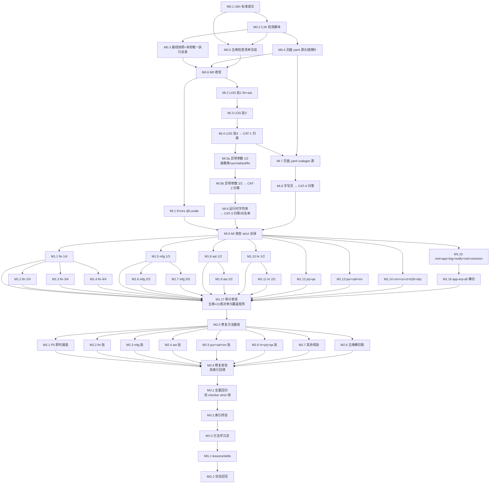

# ai-check 第三轮路线图（逐模块标准符合性深度审计 + i18n 硬编码清剿）

> 最后更新：2026-08-31（v3——**独立草案审查通过**：迭代 1 NEEDS REVISION（1 blocker extends 链断裂 + 4 major）→ v2 全部修订 → 迭代 2 **PASS-WITH-MINOR**（独立子代理实测 mission-check exit 0 + dry-run 16 步 completed + roadmap 解析器 48 工作项识别）；残余 minor（R-1 表格列序对齐解析器 / R-2~R-4 口径措辞）已随手清理；**M0 全部转 ready**，后续项随依赖完成逐项转 ready）
> 来源：用户需求（2026-08-31）——"拟制一个新的 ai-check mission：逐个模块深入检查；架构设计文档对前端、后端有明确规范要求，对测试数据、单元测试也有明确标准，确保所有工作按标准执行。系统存在大量中文日志与明文中文报错；ErrorCode 定义用中文没问题（后期经 i18n 给出英文），Errors 类上标记 Locale 为 zh-CN 即可；但明文直接写死在代码中的不行。需要用脚本工具先确认出来，然后逐个修改好，确保本项目支持国际化。"
> 设计：`docs/skills/executions/audit-roadmap-authoring-workflow.md`（审计类 roadmap 标准执行流）+ `docs/skills/audit-remediation-roadmap-authoring-prompt.md`（roadmap 设计师）+ `docs/skills/nop-platform-conformance-audit-prompt.md`（DIM-B 后端合规维度）
> 关联：`docs/backlog/ai-check-roadmap.md`（第一轮，F2.13~F2.15/F3.x/V/G 修复推进中）、`docs/backlog/ai-check-r2-roadmap.md`（第二轮三路交叉审计，M1.x/M2.x 待推进）——**本轮不替代两者，三者并行，边界见横切关注点 5**
> 规范：`docs/backlog/00-roadmap-authoring-guide.md`
> 执行：mission driver（`./tools/mission-driver.sh run ai-check-r3`）；roadmap 状态块为唯一动态状态真相源
>
> **本轮审计结果子目录约定**（多次执行隔离纪律）：
> `docs/audits/check/<YYYY-MM-DD-HHmm>-ai-check-r3/ck-<slice>.md`
> `docs/audits/check/<YYYY-MM-DD-HHmm>-ai-check-r3/ai-check-r3-index.md`
> 详见 `docs/skills/executions/audit-roadmap-authoring-workflow.md §1.4`

## 目的

本路线图是 ai-check 第三轮 mission。此前两轮以「行为缺陷发现 + 修复」为主线（r1 D1-D10 十维度、r2 代码×历史×Deferred 三路交叉），均为**判断驱动的抽样式审计**——机械可判定的违规类（如硬编码中文）缺少确定性清剿手段，规范符合性缺少逐模块×逐维度的强制核对矩阵，导致"执行过多轮但始终存在问题"。本轮以**标准符合性**为主线，针对性补三个能力：

1. **规范成文先行**（M0.1）：i18n 与日志语言标准当前不成文（全 docs 树无日志语言规定；F15 明确将后端消息列为 Non-Goal）。先立标准再审计，消除 finding 争议与标准漂移。
2. **确定性脚本清剿**（M0.2 + MI）：机械类违规用全量扫描脚本 + 基线单向收紧（actual 只降不升，--strict 门控），**脚本绿 = 闭环**——不靠抽样，零遗漏，防复发（复用 F15 i18n-coverage-checker.sh 与 nop-compliance-checker.sh 的成熟范式）。
3. **逐模块 × 五维规范矩阵强制覆盖**（M0.5 + M1）：后端 / 前端 / seed / 单元测试 / i18n 五个标准维度，21 个核对单元（19 业务域 + common-service + app-erp-all 横切）逐一按冻结清单核对，禁止抽样，完成判据 = 覆盖矩阵完整。

**i18n 专项是本轮的第一个确定性目标**（用户点名）：实测基线（2026-08-31 探针，**口径敏感项以 M0.2 脚本 + M0.3 快照冻结为准**）——LOG 语句含中文 335/483（69%）；异常路径携带中文参数约 195 处（171 throw 粗口径 + 24 `.param` 精确；throw 跨行计数口径 M0.2 脚本须精确定义「throw 语句至分号携带 CJK 字符串字面量」）；非注释运行时字符串含 CJK 1813 行；`*.page.yaml`/`*.flux.yaml` 含 CJK 2183 行（文件数口径敏感约 121~147，M0.3 冻结为准；仅 1 处用 i18n 机制）；827 个 `ErrorCode.define` 中文描述无任何英文 i18n 承载点；22 个 `*Errors.java` 均未标 `@Locale`（平台先例：nop-entropy `BatchErrors`/`NopAuthErrors` 标 `@Locale("zh-CN")`）。

**合规基线（M0.1 裁定，i18n 专项的判定准绳）**：

| 类别 | 判定 | 依据 |
| --- | --- | --- |
| `ErrorCode.define` 中文描述 | **合规**（zh-CN 为源语言；英文翻译后期经 i18n yaml 补充，本轮不建 827 条 en 镜像） | 用户裁定 + nop-entropy `error-handling.md:119` + `domain-design-guidelines.md` §七 |
| `*Errors.java` 接口 `@Locale("zh-CN")` | **必须补齐**（22 文件，声明源语言） | 用户裁定 + 平台注解 `io.nop.api.core.annotations.core.Locale` |
| LOG 消息中文 | **违规**（日志面向开发者/运维，统一英文；不走 i18n） | 用户裁定（M0.1 成文） |
| 异常路径携带中文散文参数 | **违规**（`.param(ARG_EXPECTED_STATUS, "非已作废")` 等 → 传状态码/枚举名/字典值本身） | 用户裁定（M0.1 成文） |
| 运行时字符串中文（`return "中文"` / 中文常量 / setter 默认业务数据） | **违规，白名单制**（`@Description` 中文按 E3 文档注册计划豁免；业务数据默认值逐簇裁决） | 用户裁定（M0.1 成文） |
| Java 注释中文 | **豁免**（约 20,555 行 / 1,488 文件，不属运行时面） | M0.1 裁定 |
| `*.page.yaml`/`*.flux.yaml` 用户可见文案中文 | **违规**（补 `i18nEn` 或模型源 `i18n-en` 属性；复用 `docs/design/i18n-glossary.md` 414 token 基准） | F15 同型（view.xml 已全覆盖，page/flux yaml 是剩余面） |
| `_` 前缀生成 i18n yaml | **禁手改**（en 覆盖写非下划线手写文件，`x:extends` 继承） | `nop-entropy error-handling.md:332-351` + lesson 06 |

> **双重真相源冻结**：本表是 M0.1 成文内容的来源快照；M0.1 done 后本表冻结为历史记录、不再更新，判定冲突以 `docs/architecture/i18n-compliance.md` 为唯一权威（见规则 5）。

## Work Item Status

> 唯一的动态状态块。状态：`todo` / `ready` / `done`。**独立草案审查**已通过（2026-08-31，迭代 2 PASS-WITH-MINOR）；**M0 全部 `done`**（2026-09-06 M0.6 收官：独立子代理 closure audit 通过，plan `2026-09-06-1451-3`）；后续项随依赖完成逐项转 `ready`。**独立结束审计**通过转 `done`。AI 不自行重排优先级或发明工作项。

### Milestone M0 — 标准成文与工具链基线（前置）

| Work Item | Status | Owner Doc | Deps | Skill |
|---|---|---|---|---|
| M0.1 **i18n/日志语言标准成文**：新建 `docs/architecture/i18n-compliance.md`——将本文件 §目的 的合规基线裁定表落为权威 owner doc（含判定准绳、白名单登记格式、修复模式对照表：LOG 英文化 / 异常参数传码 / 页面 yaml i18nEn / 模型源 i18n-en）；`docs/context/conventions.md` 增补节 + `docs/index.md` 路由 + `docs/skills/README.md` 已知失败模式增补（硬编码中文）；**不改任何生产代码** | `done` | `domain-design-guidelines.md` §七 + `view-and-page-strategy.md` §国际化策略 + `nop-entropy/docs-for-ai/02-core-guides/error-handling.md` | — | `audit-remediation-roadmap-authoring-prompt`（成文纪律） |
| M0.2 **CJK 硬编码检测脚本**：新建 `tools/check-hardcoded-cjk.mjs`——扫描 main Java（排除 `target/`/`_gen/`/`src/test/`/注释行）+ `*.page.yaml`/`*.flux.yaml`；五类分级：CAT-1 LOG 语句中文 / CAT-2 异常路径中文参数 / CAT-3 运行时字符串中文（文件级白名单豁免机制）/ CAT-4 页面 yaml 中文无 i18nEn / CAT-5 注释（豁免不计）；`--baseline` 落快照 + `--strict` 门控（新增违规即失败，镜像 F15 checker anti-fake-green 自证纪律）；基线文件落 `docs/audits/cjk-baseline.md`（对齐 compliance-baseline.md 范式：单向收紧，调高须独立计划裁决） | `done` | `docs/audits/i18n-coverage-checker.sh`（范式）+ `docs/audits/compliance-baseline.md`（门控范式） | M0.1 | none |
| M0.3 **基线快照与执行目录初始化**：新建**本轮唯一规范执行目录** `docs/audits/check/<YYYY-MM-DD-HHmm>-ai-check-r3/`（本轮内所有 plan 幂等复用该目录，`mkdir -p` 同一路径；目录路径登记于本轮索引头部；新开一轮执行才建新时间戳目录）；跑 M0.2 脚本落全量基线（脚本口径冻结 §目的 探针数）；记录 `mvn clean install -DskipTests` + `mvn test` + compliance checker + i18n-coverage-checker 四项基线（含 known-good-baselines 最新行登记的预存失败清单，作 MV.1 零新增失败对照面）；`docs/testing/known-good-baselines.md` 登记 `ai-check-r3-m0` 行 | `done` | `docs/testing/known-good-baselines.md` | M0.2 | none |
| M0.4 **页面 yaml CJK 源头链核实（探针）**：对含 CJK 的 `*.page.yaml`/`*.flux.yaml`（文件数约 121~147，M0.2/M0.3 口径冻结为准）逐类判定生成链——codegen 产物（须改 view.xml / xmeta 源 + `i18n-en` 属性，禁改生成物，lesson 06）/ 手写页（直接补 `i18nEn`）；产出修复策略矩阵落执行目录 `m0-4-page-yaml-source-map.md` | `done` | `docs/architecture/view-and-page-strategy.md` + `docs/lessons/`（lesson 06 代码生成产物编辑必被覆盖） | M0.2 | none |
| M0.5 **五维符合性审计检查清单冻结**：五维（DIM-B 后端 / DIM-F 前端 / DIM-S seed / DIM-T 单测 / DIM-I i18n）× 核对单元（19 业务域 + common-service + app-erp-all 横切，共 21 格）检查清单——每维列权威 owner doc 锚点 + 判定标准 + grep/脚本核查程序式 + **跨轮查重列**（每候选 finding 必查 `docs/audits/check/ai-check-index.md` 与 r1/r2 既有 finding：同型已 fixed 复用范式、同型 open 归并原 ID、确属新发才立 `-r3` 新 ID）；DIM-B 锚 `nop-platform-conformance-audit-prompt` 15 维度 + compliance checker R1-R12；DIM-F 锚 `view-and-page-strategy.md` + 各 pattern doc + e2e-runbook §编写规范；DIM-S 锚 `docs/architecture/seed-data.md`（快照重录双面义务 / `_init-data` 同步义务 / `TestErpSeedDataIntegrity` 门禁）；DIM-T 锚 `docs/architecture/testing-strategy.md`（覆盖要求 / SnapshotTest 纪律 / test-depth-classification）；DIM-I 锚 M0.1 owner doc + M0.2 脚本；落执行目录 `m0-5-audit-checklists.md` | `done` | 各维 owner doc（见左） | M0.1 + M0.2 | `nop-platform-conformance-audit-prompt`（维度来源） |
| M0.6 **M0 收官**：`git status` 确认零 `module-*`/`app-erp-all` 生产代码改动（M0 仅 docs + tools 脚本）；五项 M0 产物齐全；独立子代理 closure audit | `done` | `docs/audits/00-audit-execution-guide.md` | M0.1~M0.5 | `closure-audit-prompt`（独立子代理） |

### Milestone MI — i18n 硬编码清剿（脚本驱动，红 → 绿）

> **修复方法论**：每批 plan 第一动作 = 跑 `tools/check-hardcoded-cjk.mjs` 记录该批红线（失败测试等价物）→ 修复 → 脚本对应 CAT 该域归零 + 域模块 `mvn test` 全绿 + 既有测试零回归。**证伪/豁免路径 = 白名单显式登记**（文件 + 理由 + owner doc 指针），不接受无登记豁免。
> **排序依据**：2026-08-31 探针分域计数（finance/assets/purchase/sales 最重，先行）。

| Work Item | Status | Owner Doc | Deps | Skill |
|---|---|---|---|---|
| MI.1 **Errors 接口 `@Locale("zh-CN")` 补齐**：22 个 `*Errors.java` 加 `@Locale("zh-CN")` 注解 + import（纯加性；平台先例 `BatchErrors`/`NopAuthErrors`）；验证 = 全量 build + 域测试零回归 | `done` | `docs/errors/README.md` + `nop-entropy error-handling.md` | M0.6 | none |
| MI.2 **LOG 英文化批 1（最重两域）**：finance（54 行/21 文件）+ assets（39 行/10 文件）——LOG 消息改英文，保留 `{}` 占位参数；过账 dispatcher 族 warn/error 降级消息语义不变（对齐 lesson 09：不得借机改吞异常行为） | `done`（2026-09-07，plan `2026-09-06-2104-2`：两域 CAT1 54+39 → 0，`--strict` PASS，fin 533 / ast 339 测试绿 + 全 reactor 绿） | `docs/architecture/i18n-compliance.md`（M0.1） | M0.6 | none |
| MI.3 **LOG 英文化批 2**：manufacturing 31 + inventory 26 + cs 23 + b2b 22 + purchase 22 + sales 22 + hr 20（约 166 行） | `done`（2026-09-07，plan `2026-09-06-2104-3`：7 域 59 文件 CAT1 165 → 0（冻结 SNAPSHOT 口径 cs=22），`--strict` PASS exit 0（0 新增违规、CAT2/3/4 持平），7 模块聚合 `mvn test -am` 1727/0/0 + 全 reactor build/test 绿零新增失败；R12a 71>70 预存漂移归 successor 独立基线裁决） | 同上 | MI.2 | none |
| MI.4 **LOG 英文化批 3 + CAT-1 归零**：logistics 19 + notify 15 + projects 14 + contract 12 + maintenance 10 + crm 3 + drp 2 + quality 1（约 76 行）；收官断言 CAT-1 全域 = 0 | `done`（2026-09-07，plan `2026-09-07-0043-1`：9 域 30 文件 CAT1 77 → 0（含 aps 补遗 1），`--strict` PASS exit 0（全域 20 域 CAT1 = 0、totals 335 → 0 对账 = MI.2 93 + MI.3 165 + 本批 77、0 新增违规、CAT2/3/4 持平），9 模块聚合 `mvn test -am` 1145/0/0 + 全 reactor build/test 绿（4006/0/0/1 与 m0 基线一致）零新增失败；checker R2b/R2c/R12a 漂移经 HEAD worktree 复核为本批外预存，归 successor 独立基线裁决） | 同上 | MI.3 | none |
| MI.5a **异常路径中文参数清剿 1/2——抽象族 + 四大域**：common-service 抽象族先行（`AbstractProcessor.illegal*` helper 的期望态参数改传状态码/枚举名本身，调用点随签名收敛）+ purchase 32 / sales 30 / assets 29 / finance 20（探针粗口径，M0.2 冻结为准）；错误消息语义不变（中文仍由 ErrorCode 模板承载） | `done`（2026-09-07，plan `2026-09-07-0043-2`：common 5 / pur 36 / sal 31 / ast 41 / fin 23 = 136 行 75 文件 CAT2 → 0（冻结 SNAPSHOT 口径），`--strict` PASS exit 0（0 新增违规、全局 CAT2 204 → 68、CAT1/3/4 持平），5 模块聚合 `mvn test -am` 1542/0/0 + 全 reactor build/test 绿零新增失败；helper 契约收敛「传码不传散文」+ 否定语义 `!` 前缀 + 状态码约定（Phase 1 Decision，签名未变），已登记 `i18n-compliance.md` CAT-2 修复模式行；checker R2b/R2c/R12a 漂移经复核为本批外预存，沿 MI.4 successor 登记归独立基线裁决） | `domain-design-guidelines.md` §七 + `processor-extension-pattern.md` | MI.4 | none |
| MI.5b **异常路径中文参数清剿 2/2 + CAT-2 归零**：其余域（qa 10 / mfg 9 / inv 7 / mnt 7 / prj 7 / common 5 / md 3 等）；收官断言 CAT-2 全域 = 0 | `done`（2026-09-07，plan `2026-09-07-0043-3`：12 域 49 文件 CAT2 68 → 0（冻结 SNAPSHOT 口径 qa 11 / inv 11 / mfg 10 / drp 9 / prj 9 / mnt 7 / md 3 / crm 2 / cs 2 / notify 2 / b2b 1 / ct 1），`--strict` PASS exit 0（0 新增违规、全局 CAT2 204 → 0 对账 = MI.5a 136 + 本批 68、CAT1/3/4 持平），12 模块分相 `mvn test -am` 1978/0/0 + 全 reactor build/test 绿（4006/0/0/1 与 m0 基线一致）零新增失败；修复沿 MI.5a 契约（传码不传散文 + `!` 前缀否定 + `" / "` 码集 + 英文原因码），行为不变式未破坏；qa 域 `TestErpQaSpcOutOfControl` 首跑触发既有 sampleTime 实钟跨秒界 flake，复跑绿确证与本批零因果；checker 复跑 exit 0 零漂移） | 同上 | MI.5a | none |
| MI.6 **运行时字符串中文裁决清剿**：CAT-3 剩余面——`return "中文"` 13 处（AcctDocProvider 摘要名等 → 字典 key / 英文 / 白名单）、中文 String 常量 20 处、setter 默认业务数据、拼接型（fin ApDocument 管道等）；逐簇裁决：改 / 白名单登记（`@Description("中文")` 约 22 处按 E3 计划豁免直接登记）；**分批执行协议：每批完成记入 `docs/audits/cjk-baseline.md` 批注账，本项保持 todo 直至 CAT-3 = 0 或白名单全覆盖** | `todo` | `docs/architecture/i18n-compliance.md` 白名单节 | MI.5b | none |
| MI.7 **页面 yaml CJK 清剿——codegen 源**：按 M0.4 策略矩阵，codegen 产物类改模型源（view.xml title/label 补 `i18n-en`、xmeta 补属性），经 codegen 重生成验证；复用 `docs/design/i18n-glossary.md` 术语表 | `done`（2026-09-07，plan `2026-09-07-0902-2`：**零违规裁决**——M0.4 冻结矩阵全量 147 文件机械复验 build 前后两次重放逐项一致（39 stub / 108 手写 / stub∩CAT4 = 空集 / CAT4 = 1700 持平），stub 正文违规 = 0，原修复面 = 空集、零模型源变更（例外路径未触发）；codegen 重生成链洁净证明在案：全量 `mvn clean install -DskipTests` BUILD SUCCESS + build 后分类零漂移 + `--strict` PASS exit 0（0 新增违规，CAT4 持平）；F15 view.xml 层 PASS 0 defects / 0 gaps；全 reactor `mvn test` 4006/0/0/1 与 m0 基线一致零新增失败；执行中顺带修复 MI.6 批1 跨模块 `_cases` 快照遗留 38 文件 + 1 测试断言（fin/ast/cs 运行时字面量英文化的 purchase/sales/projects/app-erp-all 快照期望值外科同步，均有 code 实锚验证，非生产行为变更）） | `view-and-page-strategy.md` §国际化策略 + `i18n-glossary.md` | M0.4 + MI.4 | none |
| MI.8 **页面 yaml CJK 清剿——手写页 + CAT-4 归零**：手写 page.yaml/flux.yaml 补 `i18nEn`（含 CJK 文件数约 121~147、2183 行，按域分批；**分批执行协议：每批完成记入 cjk-baseline.md 批注账，本项保持 todo 直至 CAT-4 = 0**）；`i18n-coverage-checker.sh` 扩展或新增断言覆盖 page/flux yaml 层（防复发门控并入 M0.2 脚本） | `done`（2026-09-08，批 2/2 收官 plan `2026-09-07-1715-2`：其余 17 域 1318 行 82 文件 CAT4 → 0（maintenance 122/cs 120/quality 114/hr 118/purchase 99/manufacturing 96/inventory 93/b2b 91/assets 87/crm 79/master-data 74/contract 50/notify 42/drp 41/sales 39/aps 35/logistics 18 逐域归零，474+466+378=1318 对账一致），**全局 CAT-4 = 0 sites / 0 files**；`--strict` PASS exit 0（0 新增违规 vs 冻结快照）；批 1 修订版单一承载协议沿用零 Decision 新增；`npm run validate:flux` step [1/3] 导出 0 error（999 页）+ 整体 exit 1 余项 = 325 条既有 variant 外部漂移（successor 在案）；17 web 模块聚合测试 3190/0/0 零新增失败；全量 build 156 模块 BUILD SUCCESS；新词扩 `i18n-glossary.md` 批 2/2 节；批注账已记 `cjk-baseline.md` §批注账 MI.8 批 2/2 行；compliance checker exit 0（R2b/R2c/R12a 机器基线块批前在案差距 → successor: ai-check-r3-compliance-baseline-raise）。批 1/2 done 2026-09-07，plan `2026-09-07-0902-3`：fin 248/18 + prj 134/8 = 382 行 26 文件 CAT4 → 0，全局 CAT4 1700 → 1318 对账一致。CAT-4 = 0 条件达成，转 done） | 同上 | MI.7 | none |
| MI.9 **MI 收官**：`tools/check-hardcoded-cjk.mjs --strict` 全绿（CAT-1/2/3/4 = 0 或白名单显式登记）；compliance checker + i18n-coverage-checker 零回归；known-good-baselines 登记 MI 终态行；独立子代理 closure audit | `todo` | `docs/audits/cjk-baseline.md` | MI.1~MI.8（含 5a/5b） | `closure-audit-prompt`（独立子代理） |

### Milestone M1 — 逐模块五维标准符合性审计（按域切片，只读）

> **核心方法学**：每个工作项 = 1 份 plan，按 M0.5 冻结清单对五维逐项核对，**plan EXECUTE 第一步 `mkdir -p` 本轮唯一规范执行目录（幂等复用，见规则 8）**；产出 `<执行目录>/ck-<slice>.md`（含五维覆盖矩阵 + finding 列表）+ `<执行目录>/ai-check-r3-index.md` + 同步追加 `docs/audits/check/ai-check-index.md`。
> **完整枚举原则**：禁止抽样；完成判据 = 切片全部 done + 五维覆盖矩阵完整。
> **与 MI 时序**：MI 先行完成（i18n 面已清零），M1 审计 DIM-I 维仅验证零回归与白名单合规，不再产生同类 finding。
> **S 级域**（finance/manufacturing/assets/hr）按功能模块拆分；C 级域合并。

| Work Item | Status | Owner Doc | Deps | Skill |
|---|---|---|---|---|
| M1.1 **finance 切片 1/4 — 过账与凭证**（五维清单全跑） | `todo` | `docs/design/finance/posting.md` | M0.6 + MI.9 | `nop-platform-conformance-audit-prompt` + `code-quality-audit-prompt` |
| M1.2 **finance 切片 2/4 — AR/AP 核销与坏账** | `todo` | `ar-ap-reconciliation.md` + `bad-debt.md` | M1.1 | 同上 |
| M1.3 **finance 切片 3/4 — 预算与成本** | `todo` | `budget.md` + `costing-methods.md` | M1.1 | 同上 |
| M1.4 **finance 切片 4/4 — 期间结账与银行对账 + 跨域凭证链路** | `todo` | `period-close.md` + `bank-reconciliation.md` | M1.1 | 同上 |
| M1.5 **manufacturing 切片 1/3 — 工单与报工** | `todo`（执行完成待收官翻转：plan `2026-09-08-1042-2` 五维全跑零跳维，`ck-mfg-workorder-r3.md` 覆盖矩阵 5/5（B=finding / F=finding(minor) / S=pass / T=pass / I=pass）；三态裁决 复用 5 / 归并 16 / 新立 2（P1-CK-mfg-022-r3 + P3-CK-mfg-023-r3），历史 ID 零覆写；零生产代码改动核证通过；mfg service 回归两次 308/0/0/0 全绿；依本 roadmap 规则「结束审计通过 ready→done」+ plan Non-Goal「不做 roadmap 状态翻转」+ M1.1 同批先例，done 翻转归 owner/engine 依独立结束审计处置） | `docs/design/manufacturing/state-machine.md` | M0.6 + MI.9 | 同上 |
| M1.6 **manufacturing 切片 2/3 — BOM/MRP/CRP** | `todo` | `mrp.md` + `crp.md` | M1.5 | 同上 |
| M1.7 **manufacturing 切片 3/3 — 委外/批次追溯/差异** | `todo` | `subcontracting.md` + `batch-genealogy.md` + `variance-analysis.md` | M1.5 | 同上 |
| M1.8 **assets 切片 1/2 — 资产生命周期** | `todo`（执行完成待收官翻转：plan `2026-09-08-1042-3` 五维全跑零跳维，`ck-assets-lifecycle-r3.md` 覆盖矩阵 5/5（B=finding / F=pass / S=pass / T=pass / I=pass）；三态裁决 复用 8 / 归并 19 / 新立 1（P3-CK-ast-028-r3），历史 27 ID 零覆写；零生产代码改动核证通过；ast service 回归两次 339/0/0/0 全绿（锚点 cjk-baseline §批注账 337 + 姊妹 StateMachine 计划矩阵测试增量）；依本 roadmap 规则「结束审计通过 ready→done」+ plan Non-Goal「不做 roadmap 状态翻转」+ M1.1/M1.5 同批先例，done 翻转归 owner/engine 依独立结束审计处置） | `docs/design/assets/` | M0.6 + MI.9 | 同上 |
| M1.9 **assets 切片 2/2 — 折旧与过账 + 盘点** | `todo` | `depreciation-and-posting.md` | M1.8 | 同上 |
| M1.10 **hr 切片 1/2 — 组织与员工** | `todo`（执行完成待收官翻转：plan `2026-09-08-1454-1` 五维全跑零跳维，`ck-hr-org-r3.md` 覆盖矩阵 5/5（B=finding 归并态 0 新立 / F=pass / S=pass / T=pass 附 findDepartmentTree 测试缺位注记归并 P2-CK-hr-003 / I=pass）；三态裁决 复用 2 / 归并 13 / 新立 0，历史 17 ID 零覆写；零生产代码改动核证通过；hr service 回归两次 249/0/0/0 全绿（锚点 cjk-baseline §批注账 MI.6 批 2 行）；依本 roadmap 规则「结束审计通过 ready→done」+ plan Non-Goal「不做 roadmap 状态翻转」+ M1.1/M1.5/M1.8 同批先例，done 翻转归 owner/engine 依独立结束审计处置） | `docs/design/human-resource/` | M0.6 + MI.9 | 同上 |
| M1.11 **hr 切片 2/2 — 考勤、薪酬与排班** | `todo` | `docs/design/human-resource/payroll.md` + `shift-scheduling.md`（考勤语义散布于 README/state-machine） | M1.10 | 同上 |
| M1.12 **projects + quality 五维审计** | `todo`（执行完成待收官翻转：plan `2026-09-08-1454-2` 五维全跑零跳维，`ck-projects-r3.md` + `ck-quality-r3.md` 两报告覆盖矩阵 10/10 格（prj：B=finding（新立 4 全 P3）/F=pass/S=pass/T=pass/I=pass；qa：B=finding（新立 8：2 P2 + 6 P3）/F=pass/S=pass/T=pass/I=pass）；三态裁决 prj 复用 8/归并 13/新立 4 + qa 复用 8/归并 17/新立 8（P2-CK-qa-026/027-r3 + P3-CK-qa-028..033-r3），历史 21+25 ID 零覆写；SPC 双层门控 seed 静态行裁决复核成立不重开；零生产代码改动核证通过；prj 179/qa 184 service 回归两轮全绿（锚点 cjk-baseline §批注账 MI.6 批 2 行）；依本 roadmap 规则「结束审计通过 ready→done」+ plan Non-Goal「不做 roadmap 状态翻转」+ M1.1/M1.5/M1.8/M1.10 同批先例，done 翻转归 owner/engine 依独立结束审计处置） | `docs/design/projects/` + `docs/design/quality/` | M0.6 + MI.9 | 同上 |
| M1.13 **purchase + sales + inventory 五维审计** | `todo` | 各域 owner doc | M0.6 + MI.9 | 同上 |
| M1.14 **crm + cs + contract + b2b + drp 五维审计** | `todo` | 各域 owner doc | M0.6 + MI.9 | 同上 |
| M1.15 **maintenance + aps + logistics + notify + master-data + common 五维审计** | `todo` | 各域 owner doc | M0.6 + MI.9 | 同上 |
| M1.16 **app-erp-all 横切五维审计**（全局面：菜单/flux 页面导出门禁/`_init-data` 全量 seed 口径/集成测试快照纪律/E2E runbook 合规抽样） | `todo` | `docs/architecture/seed-data.md` + `docs/architecture/flux-page-export-and-validation.md` + `docs/testing/e2e-runbook.md` | M1.15 | 同上 |
| M1.17 **审计阶段收官**：五维 × 21 核对单元（19 业务域 + common-service + app-erp-all 横切）覆盖矩阵完整（缺一格不算完）；本轮索引完整；跨轮索引同步；`git status` 零代码改动；独立子代理 closure audit | `todo` | `docs/audits/00-audit-execution-guide.md` | M1.1~M1.16 | `closure-audit-prompt`（独立子代理） |

### Milestone M2 — P1 finding 批量修复

> **修复方法论**（沿用 r1 F0.2 + r2 M2.0 加严）：每 finding 强制「先写失败测试 → 修复 → 测试绿 + 既有测试零回归」。证伪路径 = 书面 not-a-problem 说明。
> **保护区域守门**：ORM/api.xml 变更 = auto + dual-agent-approval；会计过账 / auth / 数据删除 = plan-first + owner doc + tests。
> **seed 联动**：修复若触及 seed CSV，触发 `seed-data.md` §快照重录义务 双面重录（域 `_cases` + app-erp-all 集成快照）。

| Work Item | Status | Owner Doc | Deps | Skill |
|---|---|---|---|---|
| M2.0 **修复方法基线**：流程文档化 + 同型 finding 基类化裁决；检查点 = 域模块 `mvn test` 全绿 + 全 reactor 零新增失败 + compliance/cjk 双 checker 不高于基线 | `todo` | `processor-extension-pattern.md` | M1.17 | none |
| M2.1 **P0 即时通道**（M1.x 发现 P0 就地修复或异步注入 plan，`docs/plans/YYYY-MM-DD-HHmm-ai-check-r3-fix-*.md`） | `todo` | finding 对应 owner doc | M1.x | `bug-diagnosis-prompt` |
| M2.2 **finance P1 修复批**（DIM-B/T/S finding 按同型合并） | `todo` | `docs/design/finance/` | M2.0 | `bug-diagnosis-prompt` |
| M2.3 **manufacturing P1 修复批** | `todo` | `docs/design/manufacturing/` | M2.0 | 同上 |
| M2.4 **assets P1 修复批** | `todo` | `docs/design/assets/` | M2.0 | 同上 |
| M2.5 **purchase + sales + inventory P1 修复批** | `todo` | 各域 owner doc | M2.0 | 同上 |
| M2.6 **hr + projects + quality P1 修复批** | `todo` | 各域 owner doc | M2.0 | 同上 |
| M2.7 **其余域 P1 修复批**（crm/cs/ct/b2b/drp/mnt/aps/log/notify/md/common） | `todo` | 各域 owner doc | M2.0 | 同上 |
| M2.8 **五维横切族修复**（跨域同型：DIM-T 单测覆盖缺口族 / DIM-S seed 义务族 / DIM-F 前端 pattern 族 / DIM-B 平台反模式族——一处基类/范式修复全族回填） | `todo` | 各维权威 doc | M2.0 | 同上 |
| M2.9 **修复阶段收官**：P1 全部完毕；双索引状态回填（本轮 + 跨轮 `ai-check-index.md`）；同型 finding 状态继承 | `todo` | 两个索引文件 | M2.1~M2.8 | `closure-audit-prompt`（独立子代理） |

### Milestone MV — 全量验证与索引终态校验

| Work Item | Status | Owner Doc | Deps | Skill |
|---|---|---|---|---|
| MV.1 **全量回归**：`mvn clean install -DskipTests` BUILD SUCCESS + `mvn test` 全 reactor 零新增失败（对照 M0.3 基线行登记的预存失败清单）+ compliance checker 不高于 M0.3 快照（合法新增 baseline-raise）+ `tools/check-hardcoded-cjk.mjs --strict` 全绿 + `i18n-coverage-checker.sh` 全绿；known-good-baselines 登记终态行 | `todo` | `docs/testing/known-good-baselines.md` | MI.9 + M2.9 | `closure-audit-prompt`（独立子代理） |
| MV.2 **索引终态校验**：全部 finding 到达 `fixed` / `not-a-problem` / `deferred`（deferred 计数与逐条理由显式报告）+ 五维 × 21 核对单元覆盖矩阵完整 + 跨轮 `ai-check-index.md` 状态机连续（ID 冲突按 §3.1 `-r3` 后缀） | `todo` | `ai-check-index.md` | MV.1 | `closure-audit-prompt` |
| MV.3 **方法学沉淀**：「机械类违规须脚本基线门控而非抽样审计」+「规范成文先于符合性审计」模式入 `docs/lessons/` | `todo` | `docs/lessons/README.md` | MV.2 | none |

### Milestone MG — 收尾与知识沉淀

| Work Item | Status | Owner Doc | Deps | Skill |
|---|---|---|---|---|
| MG.1 **新失败模式沉淀**：可复用模式提升 `docs/lessons/` / `docs/skills/`（如 CJK 白名单裁决范式）；known-good-baselines 终态行复核；历史执行目录只读保留 | `todo` | `docs/logs/00-log-writing-guide.md` | MV.3 | none |
| MG.2 **状态回写**：本 roadmap 全部工作项 done；`docs/backlog/README.md` 行更新；`docs/logs/` 收尾日志 | `todo` | 本路线图 | MG.1 | none |

## 框架/平台复用

- **编排 skill**：`docs/skills/executions/audit-roadmap-authoring-workflow.md`（5 阶段执行流 + §1.4 隔离纪律）；`docs/skills/audit-remediation-roadmap-authoring-prompt.md`
- **审计 skill**：`nop-platform-conformance-audit-prompt.md`（DIM-B 15 维度）+ `code-quality-audit-prompt.md` + `behavioral-failure-mode-scan-prompt.md`（如切片需行为取证）；`plan-audit-prompt.md` / `closure-audit-prompt.md`
- **既有 checker（不重建）**：`docs/audits/nop-compliance-checker.sh`（R1-R12 数值门控 + `compliance-baseline.md` 单向收紧范式）、`docs/audits/i18n-coverage-checker.sh`（F15，view.xml/action-auth 层，anti-fake-green 纪律）——本轮新增脚本仅覆盖其盲区（Java 运行时面 + page/flux yaml 面）
- **i18n 资产**：`docs/design/i18n-glossary.md`（414 token 英译基准）、`module-*/erp-*-meta/postcompile/gen-i18n.xgen`（`_` 前缀生成链）、`_vfs/i18n/{en,zh-CN}/`（en 覆盖写非下划线手写文件）、`io.nop.api.core.annotations.core.Locale` 注解
- **测试基础设施**：`module-common-test` / `app-erp-all` 集成用例 / `_cases` 快照（SnapshotTest.RECORDING/CHECKING）
- **验证命令**：`mvn clean install -DskipTests` / `mvn test` / `bash docs/audits/nop-compliance-checker.sh` / `bash docs/audits/i18n-coverage-checker.sh` / `node tools/check-hardcoded-cjk.mjs`（M0.2 交付）
- **多次执行隔离目录**：`docs/audits/check/<YYYY-MM-DD-HHmm>-ai-check-r3/`

## 当前基线（2026-08-31 实仓探针快照）

- **i18n 硬编码面**（探索子代理实测，口径敏感项以 M0.2/M0.3 脚本口径冻结为准）：LOG 含中文 335/483（69%；finance 54 / assets 39 / manufacturing 31 / inventory 26 / cs 23 / b2b·purchase·sales 各 22 / hr 20 / logistics 19 / notify 15 / projects 14 / contract 12 / maintenance 10 / crm 3 / drp 2 / quality 1；aps/master-data/common/app-erp-all = 0）；异常路径中文参数约 195（throw 粗口径 171 + `.param` 精确 24；pur 32 / sal 30 / ast 40± / fin 20 / qa 10 / mfg 9 / inv 11± / mnt 7 / prj 7 / common 5 / md 3 等）；非注释引用字符串含 CJK 1813 行；`return "中文"` 13 + 中文常量 20 + `@Description("中文")` 约 22（E3 计划豁免候选）；page/flux yaml 含 CJK 2183 行 / 文件数约 121~147（i18nEn 仅 1 处）
- **合规面**：22 个 `*Errors.java` / 827 个 `ErrorCode.define` 全部内联中文描述，均未标 `@Locale`；含 `erp.err.*` key 的 i18n yaml = 0（英文消息本轮不建承载，见合规基线表）
- **注释中文**：约 20,555 行 / 1,488 文件——豁免，不计违规
- **既有门控**：i18n-coverage-checker（view.xml + action-auth 390 文件）PASS 但不扫 Java 与 page/flux yaml；compliance checker R1-R12 与 `compliance-baseline.md` 数值基线（R2c≈1542 等，以 M0.3 复核为准）
- **绿色基线**：`docs/testing/known-good-baselines.md` 最新行（2026-08-31，plan `2026-08-31-1426-2`：app-erp-all 69/0/0/1 + 全 reactor 3975 tests / 1 failure + 1 error——hr/drp 两个**预存失败**已登记为对照面，MV.1 零新增失败以此为对照；156 模块 install）
- **并行 mission**：ai-check r1（F2.13~F2.15/F3.x/V/G todo，已获用户全部人工批准授权）+ ai-check r2（M1.x/M2.x todo 待草案审查）

## 依赖图

## 横切关注点

1. **两阶段时序硬约束**（沿用 r1/r2）：M1.x 只产 finding / 不改任何代码；MI.x 与 M2.x 才动手；M2.x 强制「先写失败测试 → 修复 → 零回归」
2. **脚本即测试**（本轮新增纪律）：MI.x 修复的失败测试 = `check-hardcoded-cjk.mjs` 对应 CAT 红 → 绿；脚本须含 anti-fake-green 自证（注入缺陷可被捕获）；基线单向收紧，豁免唯一通道 = 白名单显式登记
3. **五维强制全覆盖**：M1.x 每切片必须按 M0.5 冻结清单五维全跑并产出覆盖矩阵，禁止抽样、禁止跳维
4. **保护区域守门**：ORM 模型 / api.xml 变更 = auto + dual-agent-approval（两个独立子 agent 分别批准）；会计过账 / auth / 数据删除 = plan-first + owner doc + tests + 独立 plan audit
5. **与 r1/r2 边界（不重复、不吞并）**：r1 行为 finding 修复（F2.13+）与 r2 三路交叉审计（M1/M2）继续独立推进；本轮不接管其工作项。三轮共写跨轮聚合索引 `docs/audits/check/ai-check-index.md`，finding ID 冲突按 `code-history-deferred-triangulation-audit-prompt.md §3.1` 加 `-r3` 后缀，历史 ID 永不覆写；M0.5 冻结的清单含**跨轮查重列**——每候选 finding 必做「复用 / 归并 / 新立」三态裁决，防同型重复立项
6. **生成产物纪律**（lesson 06）：`_gen/`、`_` 前缀文件禁手改；page.yaml 若判定为 codegen 产物必须改模型源（M0.4 矩阵为准）
7. **seed 不变式**：MI/M2 修复默认不动 `_init-data/` seed CSV 与种子 COA；确须变更时触发 `seed-data.md` §快照重录义务 双面重录（域 `_cases` + app-erp-all 集成快照）并在 plan 中登记
8. **过账语义不变式**：LOG 英文化与异常参数改造仅改消息载体，**禁止**借机改业务行为（lesson 09 吞异常语义、lesson 10 dict 死状态等既有裁决不重开；行为疑点登记 finding 走 M2，不在 MI 顺手改）
9. **多次执行隔离纪律**：本轮唯一规范执行目录由 M0.3 创建（`docs/audits/check/<YYYY-MM-DD-HHmm>-ai-check-r3/`，路径登记于本轮索引头部），本轮内所有 plan 幂等复用；历史轮次目录（含 r1/r2）只读，新开一轮执行才建新时间戳目录
10. **compliance baseline 守护**：M0.3 记录快照；MI/M2 后不得高于快照（合法新增走 baseline-raise + per-site 证据，用 `compliance-baseline-drift-adjudication-prompt`）
11. **绿色基线保持**：每个修复批收尾全量 `mvn clean install -DskipTests` 通过；MV.1 全量回归
12. **mission driver 串行模式**：按文档顺序取第一个 todo；M0 → MI → M1 → M2 → MV → MG；不允许跳跃
13. **报告归档规范**：M1.x 产出 `<执行目录>/ck-<slice>.md`（五维覆盖矩阵 + finding 列表 + 统计 + 剩余风险声明）；i18n 修复批产物 = 脚本输出 + 白名单登记，不产 ck-* 报告

## 规则

1. 遵循 `docs/backlog/00-roadmap-authoring-guide.md` 全部编写规则（里程碑无状态、状态只在工作项、AI 不重排优先级或发明工作项）
2. 工作项粒度：单次 AI 会话可完成、产物单一、可独立审计；S 级域按功能模块拆分，C 级域合并
3. 状态转换：独立草案审查通过 `todo → ready`（整体审查一次，通过后 M0 全部置 ready，后续项随依赖完成逐项置 ready）；结束审计通过 `ready → done`，执行者不得自我审计收官
4. 本路线图只登记编排与状态；finding 细节只在 `<执行目录>/ck-*.md` 报告 + 跨轮 `ai-check-index.md`，不回写本文件；MI 白名单登记落 `docs/audits/cjk-baseline.md`
5. 冲突时以 `docs/context/source-of-truth-and-precedence.md` 裁决真相源；i18n 判定冲突以 M0.1 产出的 `docs/architecture/i18n-compliance.md` 为本轮权威
6. **审计 plan EXECUTE 不改代码**：M1.x 任何 plan 严禁修改生产代码/ORM/配置/页面文件，只产 finding + 索引（M1.17 收官 `git status` 必查）
7. **修复 plan 必先写失败测试**：M2.x 第一动作写失败测试复现缺陷；MI.x 以脚本红线为等价物
8. **多次执行隔离与目录聚合规则**：本轮唯一规范执行目录由 M0.3 创建（`docs/audits/check/<YYYY-MM-DD-HHmm>-ai-check-r3/`，路径登记于本轮索引头部）；M1.x 各 plan EXECUTE 第一步 `mkdir -p` 该路径（幂等复用，不新建别的目录）；本轮索引 `<本轮目录>/ai-check-r3-index.md` 唯一，M1.17/MV.2 以该单点校验；历史轮次目录（含 r1/r2）只读，新开一轮执行才建新时间戳目录
