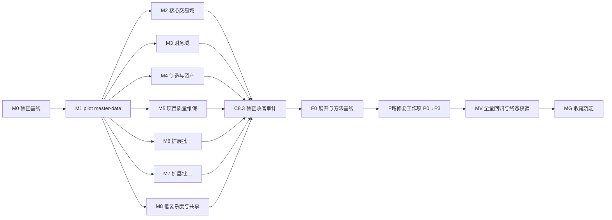

# AI 实现代码检查路线图（ai-check）

> 最后更新：2026-09-12-0345（**本会话推进**：F2.14 done（plan `2026-09-11-2350-1-ai-check-fix-f214-crm-cs-p1.md`：七条 P1 全部先失败测试后修复 + 执行期新立 P2-CK-crm-027 归 F3.5 + module-crm 198/module-cs 193 全绿 + 全 reactor 4109/0/0/1 + R2c per-site raise 1551 + 独立结束审计 passes closure audit）；上一批：F2.13 done（plan `2026-09-11-1530-1-ai-check-fix-f213-mnt-hr-p1.md`：mnt-001/002/003 + hr-001 已修在位裁决 + hr-001 索引 lesson-11 回填清账；hr2-001..005 五条 P1 修复——出勤折算分母按月推导+带薪假豁免+防双扣 / generateBankFile 280 过账+§7.2 五列 / runPayroll 逐员工隔离+告警 / 社保有效期过滤+同险种取最新 / readSalaryField 5 派生字段单源收敛；module-hr 262/0/0 全绿 + 全 reactor 4095/0/0/1 + C17 与 `_cases` 快照重录金额锚点逐值不变 + checker R2c per-site raise 1544 + E2E hr 三 spec 11/11；独立草案审查两轮 needs-revision→accept，独立结束审计见 plan `## Closure`）；F2.14 起后续修复批沿用户「全部人工批准，继续目标」授权 + 子代理通道恢复后按 plan guide 规则 12 走独立子代理审计）
> 上一更新：2026-08-29-0745（**本会话推进**：F2.4 `ae74a8613`；F2.5 `a7058c18f`；F2.6 `a42d6f824`；F2.7 mfg-委外 P1 簇 done（mfg3-001..005 → fixed，**61 findings 终态**；mfg 311 + inv 246 全绿）；F2.8 assets-生命周期 P1 簇 done（ast-001..006 → fixed，**67 findings 终态**；ast 全绿）；F2.9 assets-折旧 P1 簇 done（ast2-001..006 → fixed，**73 findings 终态**；ast 337 全绿）；F2.10 sales+purchase P1 簇 done（sal-001/002/003 收口 + pur-001 → fixed，**77 findings 终态**；sal 316 + pur 341 全绿）；F2.11 inventory P1 簇 done（inv-001/002/003(验证回填)/004 → fixed，**80 findings 终态**；inv 246 + mfg 308 全绿）；F2.12 projects+quality P1 簇 done（prj-001..007 + qa-001..005 → fixed，**92 findings 终态**；prj 178 + qa 184 全绿 + compliance 零漂移）；F2.13 起后续修复批已获用户「全部人工批准，继续目标」授权；M5.3 等 mission closure 仍受独立子代理阻塞——用户人工批准已作 plan-audit 替代（F2.4-F2.12 已用））
> Source：用户直接请求（2026-08-25）——"检查项目的各个模块的实现代码，是否存在问题。先拟制 ai-check-roadmap.md，然后按照 roadmap 规划逐个检查，检查结果保存在 docs/audits/check 目录下，不要直接修改代码……全部检查完毕之后逐项编写测试代码验证并修正，如果检查后发现不是问题的，则要说明，修复了的也要修改状态。P0 到 P3 级别的问题都要修复。"
> Related：`docs/backlog/audit-remediation-roadmap.md`（前一轮 arm 审计-修复 mission，已闭合）、`docs/backlog/requirement-compliance-roadmap.md`（已闭合）

## 目的

本路线图是**实现代码逐模块检查 + 验证修复**的编排表面，遵循 `docs/backlog/00-roadmap-authoring-guide.md`（roadmap → milestone → work item；状态只存在于工作项）。它覆盖一个两阶段闭环：

- **检查阶段（只读）**：按域逐个检查手写实现代码（BizModel / Processor / Service / 调度 / 共享模块），产出检查报告到 `docs/audits/check/`，登记 finding。**此阶段禁止修改任何代码、ORM 模型或配置**（用户明确指令）。
- **验证修复阶段（在全部检查完成后启动）**：逐项为 finding 编写测试代码验证——确认为真问题的修复并更新状态；验证后发现不是问题的，书面说明理由并更新状态。**P0-P3 全部 finding 都必须走到终态**（fixed 或 not-a-problem；deferred 是触及保护区域且无法自动处置时的显式例外，须登记触发条件）。

## 两阶段时序硬约束

1. 检查阶段（M0-M8）任何工作项不得修改产品代码 / ORM 模型 / 配置——产物只有报告 + 索引 + 状态。
2. 修复工作项（MF 族）的依赖必须包含「全部检查工作项 done」。在此之前不得动代码（用户明确指令的时序）。
3. 修复阶段每个 finding 的处置必须可追溯：`fixed`（附测试证据 + 提交指针）或 `not-a-problem`（附说明与证据）。
4. 修复触及保护区域时按 `docs/context/ai-autonomy-policy.md` 执行：`model/*.orm.xml` / `model/*.api.xml` / 数据删除 / 外部仓库 = `auto + dual-agent-approval`（双独立子 agent 批准落盘 plan）；会计/财务过账 / auth / 部署集成 = `plan-first`（owner doc + tests）。

## Work Item Status

> 唯一的动态状态块。状态：`todo` / `ready` / `done`。

### M0 — 检查编排基线

| Work Item | Status | Owner Doc | Dependencies | Skill |
| --- | --- | --- | --- | --- |
| C0.1 建立 `docs/audits/check/` 目录 + `ai-check-index.md` 索引骨架（报告清单表 + finding 追踪表 + 状态机定义） | done | 本路线图 §检查方法 | none | `audit-remediation-roadmap-authoring-prompt`（归档规范节，仅借用索引纪律） |
| C0.2 基线快照：跑 `bash docs/audits/nop-compliance-checker.sh` 记录当前基线；引用 `docs/testing/known-good-baselines.md` 最新全绿基线作为修复阶段回归对照 | done | `docs/audits/compliance-baseline.md` | none | none |
| C0.3 复杂度复核：重跑域级计数命令（手写 Java 文件 / @BizMutation / Processor 数），核对 §当前基线快照仍新鲜 | done | 本路线图 §当前基线 | none | none |

### M1 — 检查方法校准（pilot）

| Work Item | Status | Owner Doc | Dependencies | Skill |
| --- | --- | --- | --- | --- |
| C1.1 master-data 实现代码检查（pilot，校准报告格式与检查深度；产出 `ck-master-data.md`） | done | `docs/design/master-data/` | C0.1 | `code-quality-audit-prompt` + `behavioral-failure-mode-scan-prompt` |
| C1.2 pilot 复盘：若报告格式/维度有缺口，回写本路线图 §检查方法（一次校准，后续域沿用） | done | 本路线图 | C1.1 | none |

### M2 — 核心交易域检查

| Work Item | Status | Owner Doc | Dependencies | Skill |
| --- | --- | --- | --- | --- |
| C2.1 purchase 实现代码检查（含三单匹配/退货） | done | `docs/design/purchase/` | C1.2 | 同 C1.1 |
| C2.2 sales 实现代码检查（报价/合同/退货） | done | `docs/design/sales/` | C1.2 | 同 C1.1 |
| C2.3 inventory 实现代码检查（库存移动/批次/盘点/寄存） | done | `docs/design/inventory/` | C1.2 | 同 C1.1 |

### M3 — 财务域检查（S 级拆分）

| Work Item | Status | Owner Doc | Dependencies | Skill |
| --- | --- | --- | --- | --- |
| C3.1 finance 检查 — 过账与凭证（posting/voucher/冲销反写） | done | `docs/design/finance/posting.md`、`docs/architecture/processor-extension-pattern.md` | C1.2 | 同 C1.1 |
| C3.2 finance 检查 — AR/AP 与核销（应收应付/核销/坏账） | done | `docs/design/finance/ar-ap-reconciliation.md`、`bad-debt.md` | C1.2 | 同 C1.1 |
| C3.3 finance 检查 — 预算与成本（budget/costing/cost-center） | done | `docs/design/finance/budget.md`、`costing-methods.md` | C1.2 | 同 C1.1 |
| C3.4 finance 检查 — 期间结账与其他（period-close/expense/bank-reconciliation/opening-balance/intercompany 等） | done | `docs/design/finance/period-close.md` 等 | C1.2 | 同 C1.1 |

### M4 — 制造与资产域检查（S 级拆分）

| Work Item | Status | Owner Doc | Dependencies | Skill |
| --- | --- | --- | --- | --- |
| C4.1 manufacturing 检查 — 工单与报工（生产订单/工序/报工/齐套） | done | `docs/design/manufacturing/README.md`、`state-machine.md` | C1.2 | 同 C1.1 |
| C4.2 manufacturing 检查 — BOM/MRP/CRP（bom-and-routing/mrp/crp/仿真） | done | `docs/design/manufacturing/bom-and-routing.md`、`mrp.md`、`crp.md` | C1.2 | 同 C1.1 |
| C4.3 manufacturing 检查 — 委外/批次追溯/差异分析（subcontracting/batch-genealogy/variance-analysis） | done | `docs/design/manufacturing/subcontracting.md` 等 | C1.2 | 同 C1.1 |
| C4.4 assets 检查 — 资产生命周期（购置/CIP/变动/分割合并/处置） | done | `docs/design/assets/README.md`、`cip.md`、`split-merge.md` | C1.2 | 同 C1.1 |
| C4.5 assets 检查 — 折旧与过账（depreciation-and-posting/盘点） | done | `docs/design/assets/depreciation-and-posting.md` | C1.2 | 同 C1.1 |

### M5 — 项目/质量/维保域检查

| Work Item | Status | Owner Doc | Dependencies | Skill |
| --- | --- | --- | --- | --- |
| C5.1 projects 实现代码检查 | done | `docs/design/projects/` | C1.2 | 同 C1.1 |
| C5.2 quality 实现代码检查（IQC/IPQC/OQC/SPC/NCR/CAPA） | done | `docs/design/quality/` | C1.2 | 同 C1.1 |
| C5.3 maintenance 实现代码检查（维保计划/工单/点检） | done | `docs/design/maintenance/` | C1.2 | 同 C1.1 |

### M6 — 扩展域检查第一批（S 级拆分）

| Work Item | Status | Owner Doc | Dependencies | Skill |
| --- | --- | --- | --- | --- |
| C6.1 hr 检查 — 组织与员工（org/employee/合同/招聘） | done | `docs/design/human-resource/` | C1.2 | 同 C1.1 |
| C6.2 hr 检查 — 考勤与薪酬（attendance/leave/payroll） | done | `docs/design/human-resource/` | C1.2 | 同 C1.1 |
| C6.3 crm 检查 — 线索与商机（lead-waterfall/lead-scoring/territory） | done | `docs/design/crm/lead-waterfall.md` 等 | C1.2 | 同 C1.1 |
| C6.4 crm 检查 — CPQ 与营销预测（cpq/marketing/sales-forecast/sales-sequence） | done | `docs/design/crm/cpq.md` 等 | C1.2 | 同 C1.1 |

### M7 — 扩展域检查第二批

| Work Item | Status | Owner Doc | Dependencies | Skill |
| --- | --- | --- | --- | --- |
| C7.1 cs 实现代码检查 | done | `docs/design/customer-service/` | C1.2 | 同 C1.1 |
| C7.2 contract 实现代码检查 | done | `docs/design/contract/` | C1.2 | 同 C1.1 |
| C7.3 b2b 实现代码检查 | done | `docs/design/b2b/` | C1.2 | 同 C1.1 |
| C7.4 drp 实现代码检查 | done | `docs/design/drp/` | C1.2 | 同 C1.1 |

### M8 — 低复杂度域与共享模块检查

| Work Item | Status | Owner Doc | Dependencies | Skill |
| --- | --- | --- | --- | --- |
| C8.1 logistics + aps + notify 合并检查（C 级域；产出**三份薄报告** `ck-logistics.md` / `ck-aps.md` / `ck-notify.md`，finding 按各自域短码前缀编排，保持索引与 ID 语义一致） | done | `docs/design/logistics/`、`docs/design/aps/`、`docs/design/notify/` | C1.2 | 同 C1.1 |
| C8.2 共享模块与聚合工程检查（module-common-service / module-common-test / app-erp-all 聚合与 auth 合并 / app-erp-test-data 种子） | done | `docs/architecture/`（module-boundaries 等） | C1.2 | 同 C1.1 |
| C8.3 检查阶段收官：校验 ai-check-index 完整性（全域有报告、finding 全登记、无代码改动——`git status` 干净或仅 docs 变更） | done | 本路线图 | C2.1-C8.2 全部 done | `closure-audit-prompt`（独立子代理） |

### MF — 验证与修复（检查阶段已于 2026-08-26 闭合，修复阶段解锁）

> F0.2 修复方法基线（每 finding 强制流程）：
> 1. 读报告 finding（控制点/证据/建议修复方向）→ 2. **先写失败测试**（复现缺陷；域级 erp-*-service test 或 app-erp-test-data 种子）→ 3. 复现 → 修复 → 测试绿 + 既有测试零回归；证伪 → 书面 not-a-problem 说明（理由 + 证据）→ 4. 回填 ai-check-index 状态（fixed + 测试与提交指针 / not-a-problem + 说明）。
> 保护区域路由：ORM/api.xml 变更项走 auto + dual-agent-approval（两个独立子 agent 批准落盘 plan）；过账引擎/auth 代码走 plan-first（owner doc + tests + 独立 plan 审计）。每个 F 工作项执行前建 plan（`docs/plans/{ts}-ai-check-fix-{id}.md`），批次完成经独立结束审计；修复后 compliance checker 不得高于 C0.2 快照（合法新增须 baseline-raise 登记）。

| Work Item | Status | Owner Doc | Dependencies | Skill |
| --- | --- | --- | --- | --- |
| F0.1 修复展开器（本表即展开产物，2026-08-26 由 C8.3 审计建议驱动展开） | done | `ai-check-index.md` | C8.3 done | none |
| F0.2 修复方法基线（见上方引用块） | done | plan guide | C8.3 done | none |
| **第一批：P0 + 横切高危簇** | | | | |
| F1.1 P0-CK-mfg-001 完工入库幂等键吞增量报工 + P1-CK-fin-003 post() 幂等 null 语义三态化（同链传导站点 sal-003/qa-013/prj-006/log-001/mfg2 族回写 posted） | done | `docs/design/manufacturing/state-machine.md`、`docs/architecture/processor-extension-pattern.md` | F0.2 | `bug-diagnosis-prompt` |
| F1.2 REQUIRES_NEW 孤儿凭证族统一修复（守卫前置/副作用后置模式，9+ 站点：pur-002/inv-012/mfg-011/ast-015/ast2-021/mnt-007/qa-012/prj-006/hr2-006） | done | `processor-extension-pattern.md` | F0.2 | none |
| F1.3 CRUD 无状态守卫族统一修复（AbstractErpCrudBizModel 基类方案 + 全域接入，锚 P1-CK-pur-003/sal-004/inv-005 + 15+ 同型站点） | done | `processor-extension-pattern.md`、C8.2 报告修复挂点专节 | F0.2 | none |
| F1.4 P1-CK-fin-005 AcctSchemaResolver null 静默成功 fail-closed（含 6 dispatcher 传导面 ast/sal/pur/prj/mfg） | done | `docs/design/finance/multiple-accounting-schemas.md` | F0.2 | none |
| **第二批：P1 域簇** | | | | |
| F2.1 finance-过账 P1 余项（fin-001 源单 posted 回写通道/fin-002 凭证平衡校验/fin-004） | done | finance owner docs | F0.2 | none |
| F2.2 finance-ARAP P1 簇（fin2-001 尾差守卫/002 FX 不对称/003 聚合超核销/004/005） | done | ar-ap-reconciliation.md | F0.2 | none |
| F2.3 finance-预算成本 P1 簇（fin3-001 carryForward 科目错链/002/003 方向敏感/004 TOCTOU/005 账套硬编码） | done | budget.md、costing-methods.md | F0.2 | none |
| F2.4 finance-期间 P1 簇（fin4-001 FX 重估口径/002 多账套 N 倍/003 跨法人单价入账） | done | period-close.md | F0.2 | none |
| F2.5 mfg-工单 P1 簇（mfg-002 驳回死锁/003 红冲不回退成本/004/005；Deferred：F2.1 二期 posted listener 域内收口） | done | manufacturing owner docs | F0.2 | none |
| F2.6 mfg-BOM/MRP P1 簇（mfg2-001 安全库存双扣/002 低阶码/003 版本号 ASC 撞 UK——含 drp-012 同型） | done | mrp.md | F0.2 | none |
| F2.7 mfg-委外 P1 簇（mfg3-001 计价缺料/002 红冲半段/003 Pattern B 复活/004/005） | done | subcontracting.md | F0.2 | none |
| F2.8 assets-生命周期 P1 簇（ast-001 分配守恒/002/003 盘点漏录报废/004/005/006；Deferred：F2.1 二期 posted listener 域内收口） | done | assets owner docs | F0.2 | none |
| F2.9 assets-折旧 P1 簇（ast2-001 工作量法恒 0/002 基数双计/003/004/005 缺 ReversedListener/006；Deferred：F2.1 二期 posted listener 域内收口） | done | depreciation-and-posting.md | F0.2 | none |
| F2.10 sales+purchase P1 簇（sal-001 客户级反转/002 dashboard 死状态/004；pur-001/002/003 中未入 F1 部分） | done | sales/purchase owner docs | F0.2 | none |
| F2.11 inventory P1 簇（inv-001 locationId 回退/002 findBalance 键/003 流水不可变/004） | done | inventory owner docs | F0.2 | none |
| F2.12 prj+qa P1 簇（prj-001..007；qa-001 SPC 幻影/002 复检死锁/003 inject 断裂/004 severity/005；Deferred：F2.1 二期 posted listener 域内收口） | done | projects/quality owner docs | F0.2 | none |
| F2.13 mnt+hr P1 簇（mnt-001/002/003；hr-001；hr2-001..005；Deferred：F2.1 二期 posted listener 域内收口） | done（2026-09-11，plan `2026-09-11-1530-1` 落地：mnt-001/002/003 + hr-001 已修在位 HEAD 复验裁决 + 索引回填（hr-001 lesson-11 回填缺口清账）；hr2-001..005 五条 P1 修复（出勤折算分母按月推导 + 带薪假豁免 + 无薪假防双扣 / generateBankFile 280 过账 + §7.2 五列 / runPayroll 逐员工隔离 + 告警 / 社保有效期过滤 + 同险种取最新 / readSalaryField 5 派生字段单源收敛），每条先失败测试后修复；module-hr 262/0/0 全绿 + app-erp-all 73/0/0/1 + C17 快照重录（金额锚点逐值不变）+ checker R2c per-site raise 1544 + CJK/i18n PASS + E2E hr 三 spec 11/11） | maintenance/hr owner docs | F0.2 | none |
| F2.14 crm+cs P1 簇（crm-001/002；crm2-001/002；cs-001/002/003） | done（2026-09-12，plan `2026-09-11-2350-1` 落地：七条 P1 全部先失败测试后修复——crm 管道三段口径统一/漏斗 ConvLog 事件补写+消双计/序列逾期深度语义/价格规则 productCategory 匹配（customerCategory 显式降级 Deferred）；cs SLA 挂载序重写/CSAT 分母已响应过滤+分项计数/目录建单 SLA deadline+防双扣+codeRule；module-crm 198/module-cs 193 全绿 + checker R2c per-site raise 1551 + 执行期新立 P2-CK-crm-027（公司 forecast 行重复写）归 F3.5；独立草案审查两轮 + 独立结束审计见 plan `## Closure`） | crm/cs owner docs | F0.2 | none |
| F2.15 ct+b2b+drp+log+aps+notify P1 簇（ct-001..004；b2b-001；drp-001..003；log-001/002；aps-001/002；notify-001/002） | todo | 各域 owner docs | F0.2 | none |
| **第三批：P2/P3 联动簇** | | | | |
| F3.1 orgId 隔离族（写侧 writer 缺失族 + 读侧聚合族） | todo | module-boundaries.md | F2.x | none |
| F3.2 cron 键漂移家族（9 域 job.yaml 双键统一） | todo | job-scheduling.md | F2.x | none |
| F3.3 notify 模板种子三库补齐 + 事务内外发修复（notify-001/002 与 log-002/aps-006 联动） | todo | notify owner docs | F2.x | none |
| F3.4 currentUserId 宽 catch 全域族 + 死常量/死配置键清理 | todo | — | F2.x | none |
| F3.5-F3.x 各域 P2 簇（md×5/pur×6/sal×16/inv×11/fin×10/fin2×5/fin3×5/fin4×8/mfg×6/mfg2×10/mfg3×7/ast×10/ast2×8/prj×7/qa×9/mnt×6/hr2×9/crm×6/crm2×10/cs×11/ct×13/b2b×8/drp×11/log×7/aps×6/notify×4/common×1——按域逐项或合并小簇，由执行时按索引余量展开追加） | todo | 各域 owner docs | F2.x | none |
| F3.y P3 波次（210 条，按域批量「小修+说明」处理，证伪项归档说明） | todo | 各域 owner docs | F3.5+ | none |

### MV — 全量回归验证

| Work Item | Status | Owner Doc | Dependencies | Skill |
| --- | --- | --- | --- | --- |
| V.1 全量回归：`mvn clean install -DskipTests` + `mvn test` 全绿；compliance checker 不高于 C0.2 快照（合法新增须 baseline-raise 登记） | todo | `docs/testing/known-good-baselines.md` | 全部 F 工作项 done | none |
| V.2 索引终态校验：全部 finding 到达终态（fixed / not-a-problem / 显式 deferred），每条有测试或书面证据指针；**deferred 计数与逐条理由须在收官报告中向用户显式列出**（防例外通道稀释「P0-P3 都要修复」指令） | todo | `ai-check-index.md` | V.1 | `closure-audit-prompt`（独立子代理） |

### MG — 收尾与知识沉淀

| Work Item | Status | Owner Doc | Dependencies | Skill |
| --- | --- | --- | --- | --- |
| G.1 新失败模式沉淀：本轮检查发现的可复用模式提升 `docs/lessons/` / `docs/skills/`（若有）；known-good-baselines 登记新基线行 | todo | `docs/logs/00-log-writing-guide.md` | V.2 | none |
| G.2 状态回写：本路线图全部工作项 done、backlog README 行更新、`docs/logs/` 收尾日志 | todo | 本路线图 | V.2 | none |

## 框架/平台复用

- **技能**：`code-quality-audit-prompt`（代码行为风险审查骨架）、`behavioral-failure-mode-scan-prompt`（B1 吞异常悬挂 / B2 dict 死状态 / B3 调度链与守卫的 grep 程式）、`plan-audit-prompt` / `closure-audit-prompt`（修复 plan 与收官门控）。
- **守卫**：`docs/audits/nop-compliance-checker.sh`（平台反模式 grep 基线，R2c/R5 等规则——检查阶段用于发现**基线之外的新增违规**与**基线内条目中的真实缺陷**，不重复登记已裁决条目）。
- **已有审计索引**：`docs/audits/arm-index.md`（前一轮 arm mission 全部 finding）——每个新 finding 做「复用 or 新增」裁决，同型已修复的标注复用不重复登记。
- **测试基础设施**：`module-common-test`（跨域测试基类）、`app-erp-test-data`（种子）、`erp-*-service` 各域 test 目录（修复阶段落点）。

## 当前基线（2026-08-25 实测快照）

- 手写主代码 3,364 个 / 测试代码 753 个 Java 文件。计数口径（C0.3 复核用同口径）：`find . -path '*/src/main/java/*' -name '*.java' -not -path '*/_gen/*' -not -name '_*' | wc -l`（test 同理换 `src/test/java`，不排 `_` 前缀）。
- 验证基线：`docs/testing/known-good-baselines.md` 2026-08-25 V.1 行（全 reactor 3,834 tests 全绿 + 156 模块 install）。
- 域复杂度快照（主代码文件数 / 测试数）：finance 391/103、manufacturing 303/52、hr 282/37、crm 260/34、assets 215/43、purchase 209/62、inventory 203/43、sales 182/57、master-data 184/33、quality 158/38、cs 148/33、projects 145/31、maintenance 135/31、contract 133/28、b2b 107/17、drp 97/19、logistics 80/19、aps 68/17、notify 32/9、common-service 21/2、common-test 5/1、app-erp-all 6/44。
- S 级域（行为维度强制拆分）：finance、manufacturing、hr、crm、assets。

## 检查方法（每个检查工作项的统一方法）

### 检查对象

目标域 `module-<domain>/` 下全部手写生产代码：`erp-<short>-service` 的 BizModel / Processor / Engine / Resolver / Job / 辅助类；`erp-<short>-web` 手写 view 层（仅核对与后端契约 drift 的低频抽查）；`*.batch.xml` / job 配置；不读 `_gen/`、不检查纯生成产物正确性（生成产物问题应回溯模型）。

### 检查维度（D1-D10）

| # | 维度 | 方法来源 |
| --- | --- | --- |
| D1 | 平台反模式：`@Inject private`、`System.currentTimeMillis()`/`LocalDateTime.now()`、非 `NopException` 业务异常、`dao().updateEntity()` 越权、字符串 `==`/`!=`、手编生成产物 | `nop-compliance-checker.sh` 规则 + `docs/skills/README.md §已知失败模式` |
| D2 | 异常闭环：宽 catch 吞咽致标志位悬挂（posted 类）、失败无告警通道 | `behavioral-failure-mode-scan §1`（B1） |
| D3 | 状态机与 dict 可达性：死状态（无 setStatus writer）、非法迁移无守卫、终态可复活 | `behavioral-failure-mode-scan §2`（B2）+ 守卫清单 |
| D4 | 调度链完整性：batch.xml 声明 vs 实际调用、孤立 job、失败接力、重试对称 | `behavioral-failure-mode-scan §3.1`（B3.1） |
| D5 | 守卫完整性：乐观锁 versionProp、`@BizMutation`/`@BizQuery` 权限注解、入参边界校验 | `behavioral-failure-mode-scan §3.2`（B3.2/B4） |
| D6 | 业务计算正确性：BigDecimal 精度与舍入（`RoundingMode`/`setScale` 误用）、数量守恒（入库=出库+库存）、金额符号方向、日期边界（含税期/期间边界） | `code-quality-audit-prompt` 重点领域 2 |
| D7 | 事务与并发：`@BizMutation` 事务边界内跨实体写原子性、显式 `@Transactional` 传播误用、并发更新路径 | `code-quality-audit-prompt` 重点领域 4 |
| D8 | 数据一致性：orgId 透传缺失、跨域反写闭环（凭证↔单据回链）、冗余字段失同步 | `code-quality-audit-prompt` 重点领域 1/2 |
| D9 | 性能：循环内 dao/RPC 调用（N+1）、全表加载、缺分页 | `code-quality-audit-prompt` 重点领域 6 |
| D10 | 空值与边界：NPE 风险（链式 getter/Map.get 强转）、空集合/除零/越界 | `code-quality-audit-prompt` 重点领域 2 |

不适用维度显式标 N/A（如无 batch.xml 的域 D4=N/A）。

### Finding ID 与严重性

- ID：`P{0-3}-CK-{域短码}-{NNN}`（域短码：md/inv/pur/sal/fin/ast/prj/mfg/qa/mnt/crm/cs/hr/aps/log/b2b/ct/drp/notify/common/app）。
- P0：数据损坏/丢失风险、安全漏洞、核心业务循环断裂。
- P1：用户可见正确性错误、事务/一致性缺陷、强回归风险。
- P2：边界处理缺失、性能缺陷（N+1 级）、可维护性问题（含明确行为影响的代码质量）。
- P3：次要质量与低风险优化。
- **本 mission P0-P3 全部进入修复阶段**（用户指令），与 arm mission 只修 P0/P1 不同。

### 报告模板（`docs/audits/check/ck-<domain>[-<slice>].md`）

1. 元信息：范围（文件清单摘要 + 计数）、方法（Skill 使用记录）、检查日期、执行者。
2. 发现清单：每条 finding 含 ID、级别、维度（D1-D10）、控制点（`file#method` 锚点 + 关键代码摘录）、问题描述、触发条件/影响面、建议修复方向、初始状态 `open`。
3. 与 arm-index 的「复用 or 新增」裁决（同型已有 finding 标注复用，不重复计数）。
4. 统计：按级别/维度计数；明确「查了什么、没查什么」（剩余风险声明——禁止把未查区域伪装成无问题）。
5. 报告产出即更新 `ai-check-index.md`。

### 检查纪律

- 每条 finding 必须有代码证据锚点（file#method + 摘录），供修复阶段独立复核；不接受"印象式"发现。
- 平台 API 布尔/语义参数必须先查 nop-entropy 源码再定性（C1.2 校准例证：`QueryBean.addOrderField(name, desc)` 第二参为 desc，避免"取最新评分卡"被误报为缺陷）。
- 检查阶段不改代码、不改模型、不改配置；发现的疑似需求分歧只登记不裁决。
- 结论三态强制：确认问题 / 复用已有 finding / 证伪（说明为何不是问题）——每条 finding 必居其一。

## Work Item Details

- **C0.1**：建目录与索引骨架（表结构见 §检查方法）。**C0.2**：跑 checker 记录基线数字。**C0.3**：重跑计数核对快照。
- **C1.1**：master-data 全量手写代码按 D1-D10 检查（D4 视有无调度配置定 N/A），产出首份报告。**C1.2**：复盘报告格式/深度/维度缺口，一次性回写本路线图。
- **C2.x-C8.2**：按 §检查方法逐域（逐切片）检查并产出报告；S 级域按切片聚焦（每切片覆盖该切片实体的全维度 D1-D10）。
- **C8.3**：检查阶段收官审计（独立子代理）：全域覆盖核对 + 索引完整性 + 确认零代码改动。
- **F0.1/F0.2**：展开与修复方法基线（修复工作项由 F0.1 追加，追加行为已在本文预声明，不违反"AI 不发明工作项"）。
- **F<域>.<seq>**：单 finding 或同型 finding 簇的验证修复：先写失败测试（或证伪测试）→ 修复 → 回填索引。ORM 变更走 dual-agent-approval；过账/auth 走 plan-first。
- **V.1/V.2**：全量回归 + 索引终态校验（独立子代理收官审计）。
- **G.1/G.2**：lessons/skills 沉淀 + 基线登记 + 状态回写。

## 依赖图

（M2-M8 之间无相互依赖，可按 §Work Item Status 表顺序串行执行；表顺序为默认执行顺序。）

## 横切关注点

- **两阶段时序**：修复不得抢跑；检查阶段零代码改动（git diff 仅允许 docs/）。P0 也不就地修复——只登记并标记级别（用户明确指令覆盖 arm mission 的 P0 即时通道模式）。
- **索引纪律**：报告产出即更新索引；修复完成即回填状态；V.2 校验索引终态。
- **复用裁决**：对照 `docs/audits/arm-index.md` 与 `requirement-compliance` 已闭合 finding，同型问题标注复用（状态继承）不重复登记。
- **S 级拆分**：finance/manufacturing/hr/crm/assets 行为维度按切片拆（已在表中落地）；机械维度可整域。
- **保护区域路由**：修复阶段才触及；检查阶段只读。
- **compliance 基线**：修复后 checker 计数不得高于 C0.2 快照（合法新增须 baseline-raise + per-site 证据）。
- **绿色基线保持**：每个 MF 域簇收尾时全量构建通过；V.1 最终全量回归。
- **执行模式**：串行（按表顺序取第一个 todo）；单工作项单次会话可完成；跨会话断点续行依赖 Work Item Status 块的唯一权威性。

## 规则

1. 遵循 `docs/backlog/00-roadmap-authoring-guide.md` 全部编写规则（里程碑无状态、状态只在工作项、AI 不重排优先级）。
2. 工作项粒度：单次 AI 会话可完成、产物单一（一份报告或一组修复+测试）、可独立审计。**预声明拆分机制**：单域检查超出单会话容量时，允许按切片追加 `C<里程碑序号>.<seq>` 行（模式同 S 级拆分，依赖与 owner doc 沿用原工作项）——此追加行为已在本文预声明，不视为"AI 发明工作项"。
3. 状态转换：独立草案审查通过 `todo → ready`（本路线图整体审查一次，通过后 M0/M1 置 ready，后续项随依赖完成逐项置 ready）；结束审计通过 `ready → done`，执行者不得自我审计收官。
4. 修复工作项由 F0.1 展开（预声明的追加机制）；追加行引用 finding ID。
5. 本路线图只登记编排与状态，finding 细节只在 `docs/audits/check/` 报告与索引中，不回写本文件。
6. 冲突时以 `docs/context/source-of-truth-and-precedence.md` 裁决真相源。

## 草案审查记录

- Independent draft review iteration 1: `acceptable after minor revision`（agent `agent_75618868-ea61-48e7-aadf-b181373c83c0`，2026-08-25）——6 维度（规范符合性/用户指令忠实度/覆盖完整性/粒度合理性/既有基础设施关系/可执行性）全通过；2 项必改（基线总数 3,677/694 → 3,364/753 并内联计数命令；需在 backlog README 注册行）、3 项建议（C8.1 三份薄报告、检查项预声明拆分机制、V.2 deferred 显式报告）均已修订落盘。审查者实测复核了 22 个域级计数、19 个 design 目录、arm-index/checker/baselines 存在性与 git 零代码改动。
- 修订后裁决：M0/M1 工作项置 `ready`，路线图生效。

## 收官审计记录（C8.3，2026-08-26）

- 独立收官审计（fresh session agent `agent_72a36cff`）：**检查阶段通过**。6 条 P0/P1 finding 证据抽验 100% 真实（mfg-001/pur-001/qa-004/fin2-001/sal-001/notify-001 逐一实核源码）；28 报告 ↔ 28 工作项一一映射；索引 533 行计数吻合；零代码改动纪律确认（ai-check 名下提交仅 docs）。3 项小问题：C3.1 状态机械回写遗漏（本日已补）、索引"29 份"笔误（已更正 28）、fin2-001 行号漂移 ±4（无需处理）。
- 修复阶段优先级建议（审计产出）：第一批 = P0-CK-mfg-001 + P1-CK-fin-003 同链（5+ 站点）→ REQUIRES_NEW 孤儿凭证族（9+ 站点）→ CRUD 守卫族（AbstractErpCrudBizModel 方案）→ fin-005 AcctSchemaResolver null；第二批 = P1 域簇（finance 17 → mfg 12 → assets 12 → sal/pur 7 → 其余 42）；第三批 = P2/P3 联动簇（orgId 隔离族/cron 键漂移 9 域/notify 模板种子三库一次补齐/currentUserId 族）。保护区域路由：ORM 变更项走 dual-agent-approval，过账引擎/auth 走 plan-first。
