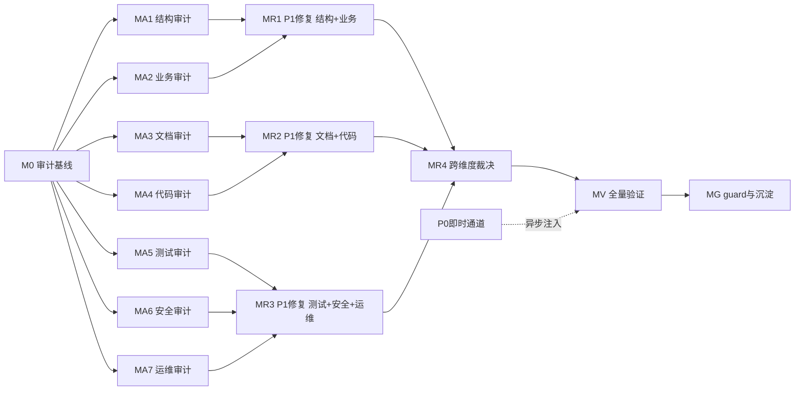

# 审计-修复路线图

> 最后更新：2026-07-27（v2 — 经 3 路独立子代理审查后修订）
> 来源：`docs/skills/audit-remediation-roadmap-authoring-prompt.md`
> 范围文档：`docs/audits/audit-remediation-scope-and-dimension-matrix.md`
> 审查记录：3 路独立子代理（规范合规 / 覆盖面 / 可执行性），发现 S 级未拆分 / R*.x 占位符卡死 / 并发维度缺失 / 流水线退化等问题，本版全部修订

## 目的

本路线图覆盖 nop-app-erp（19 域、154 模块）的全面审计与 P0/P1 彻底修复。引用 `docs/backlog/00-roadmap-authoring-guide.md` 作为规范。ORM 变更已授权。

## Work Item Status

> 唯一的动态状态块。状态：`todo` / `ready` / `done`。初始全 `todo`。

### Milestone M0 — 审计编排基线

| # | Work Item | Status | Owner Doc | Deps | Skill |
|---|-----------|--------|-----------|------|-------|
| 0.1 | 初始化审计维度矩阵 + 复杂度评估 + 未闭包发现清单 | done | `docs/audits/audit-remediation-scope-and-dimension-matrix.md`（closure audit 通过 plan 2026-07-27-1015-1 Phase 1） | — | none |
| 0.2 | 初始化审计报告索引 arm-index.md | done | `docs/audits/arm-index.md`（closure audit 通过 plan 2026-07-27-1015-1 Phase 1） | — | none |
| 0.3 | 跑 compliance checker 确认精确基线 + 全量 mvn build+test 确认绿色基线 | done | `docs/audits/compliance-baseline.md §M0 锚点注记`（HEAD=0e963531d 实测落锚 plan 2026-07-27-1015-1 Phase 2） | — | none |

### Milestone MA1 — 结构与架构层审计

> ORM 审计为机械性字段/类型检查，S 级域可整域审计（单次会话可完成）；跨模块依赖与平台合规按 S/A/B+C 分批

| # | Work Item | Status | Owner Doc | Deps | Skill |
|---|-----------|--------|-----------|------|-------|
| A1.1 | finance ORM 模型审计（48 实体，S 级整域——机械检查） | done | `docs/design/finance/` | 0.3 | `docs/skills/orm-model-audit-prompt.md` |
| A1.2 | manufacturing ORM 模型审计（41 实体，S 级整域） | done | `docs/design/manufacturing/` | 0.3 | `docs/skills/orm-model-audit-prompt.md` |
| A1.3 | hr ORM 模型审计（42 实体，S 级整域） | done | `docs/design/human-resource/` | 0.3 | `docs/skills/orm-model-audit-prompt.md` |
| A1.4 | purchase+sales ORM 模型审计（A 级，机械维度允许 2 域合并） | done | `docs/design/purchase/`+`sales/` | 0.3 | `docs/skills/orm-model-audit-prompt.md` |
| A1.5 | assets+inventory ORM 模型审计（A 级） | done | `docs/design/assets/`+`inventory/` | 0.3 | `docs/skills/orm-model-audit-prompt.md` |
| A1.6 | crm+quality+projects ORM 模型审计（A 级） | done | 各域 README | 0.3 | `docs/skills/orm-model-audit-prompt.md` |
| A1.7 | master-data ORM 模型审计（B 级，DAG 根域单独） | done | `docs/design/master-data/` | 0.3 | `docs/skills/orm-model-audit-prompt.md` |
| A1.8 | cs+contract+b2b+maintenance+drp ORM 审计（B 级合并） | done | 各域 README | 0.3 | `docs/skills/orm-model-audit-prompt.md` |
| A1.9 | aps+logistics+notify ORM 审计（C 级合并） | done | 各域 README | 0.3 | `docs/skills/orm-model-audit-prompt.md` |
| A1.10 | 跨模块依赖与 DAG 审计（全域跨域） | done | `docs/architecture/data-dependency-matrix.md` | 0.3 | `docs/skills/cross-module-dependency-audit-prompt.md` |
| A1.11 | Nop 平台合规审计 — finance+mfg+hr（S 级） | todo | `../nop-entropy/docs-for-ai/` | 0.3 | `docs/skills/nop-platform-conformance-audit-prompt.md` |
| A1.12 | Nop 平台合规审计 — pur+sal+assets+inv（A 级核心） | todo | 同上 | 0.3 | `docs/skills/nop-platform-conformance-audit-prompt.md` |
| A1.13 | Nop 平台合规审计 — crm+qa+prj+cs+ct+b2b+mnt+drp+md+aps+log+notify（A+B+C 合并） | todo | 同上 | 0.3 | `docs/skills/nop-platform-conformance-audit-prompt.md` |
| A1.14 | 架构治理复审（daoFor Type 4 残留 / 字典真相 / 共享内核守卫 / CI guard） | todo | `docs/audits/2026-07-23-0000-architecture-governance-review.md` | 0.3 | 参考arch-gov-review方法 |

### Milestone MA2 — 业务正确性层审计

> 状态机审查需理解业务语义，S 级域按功能模块拆分；业财端到端按业务链路拆分

| # | Work Item | Status | Owner Doc | Deps | Skill |
|---|-----------|--------|-----------|------|-------|
| A2.1 | 采购到付款端到端（PO→Receive→Invoice→Pay） | todo | `docs/design/flow-overview.md`+`purchase/` | 0.3 | `docs/skills/multi-dimensional-audit-prompt.md` |
| A2.2 | 销售到收款端到端（SO→Delivery→Invoice→Receipt） | todo | `docs/design/flow-overview.md`+`sales/` | 0.3 | `docs/skills/multi-dimensional-audit-prompt.md` |
| A2.3 | 期末结账端到端（期间+结转+坏账+成本） | todo | `docs/design/finance/period-close.md` | 0.3 | `docs/skills/multi-dimensional-audit-prompt.md` |
| A2.4 | 库存核算一致性（成本+余额+流水三方对账） | todo | `docs/design/inventory/`+`finance/costing-methods.md` | 0.3 | `docs/skills/multi-dimensional-audit-prompt.md` |
| A2.5a | finance 状态机审查 — 过账与凭证（S 级拆分 1/3） | todo | `docs/design/finance/posting.md` | 0.3 | `docs/skills/state-machine-business-review-prompt.md` |
| A2.5b | finance 状态机审查 — 预算与期间（S 级拆分 2/3） | todo | `docs/design/finance/budget.md`+`period-close.md` | 0.3 | `docs/skills/state-machine-business-review-prompt.md` |
| A2.5c | finance 状态机审查 — AR/AP 核销（S 级拆分 3/3） | todo | `docs/design/finance/` | 0.3 | `docs/skills/state-machine-business-review-prompt.md` |
| A2.6a | manufacturing 状态机审查 — 工单与报工（S 级拆分 1/2） | todo | `docs/design/manufacturing/` | 0.3 | `docs/skills/state-machine-business-review-prompt.md` |
| A2.6b | manufacturing 状态机审查 — MRP/BOM（S 级拆分 2/2） | todo | `docs/design/manufacturing/mrp.md` | 0.3 | `docs/skills/state-machine-business-review-prompt.md` |
| A2.7a | hr 状态机审查 — 员工与组织（S 级拆分 1/2） | todo | `docs/design/human-resource/` | 0.3 | `docs/skills/state-machine-business-review-prompt.md` |
| A2.7b | hr 状态机审查 — 考勤与工资（S 级拆分 2/2） | todo | `docs/design/human-resource/` | 0.3 | `docs/skills/state-machine-business-review-prompt.md` |
| A2.8 | purchase 状态机审查（A 级单域，29 状态字段） | todo | `docs/design/purchase/state-machine.md` | 0.3 | `docs/skills/state-machine-business-review-prompt.md` |
| A2.9 | sales 状态机审查（A 级单域，25 状态字段） | todo | `docs/design/sales/state-machine.md` | 0.3 | `docs/skills/state-machine-business-review-prompt.md` |
| A2.10 | assets 状态机审查（A 级单域，18 状态字段） | todo | `docs/design/assets/state-machine.md` | 0.3 | `docs/skills/state-machine-business-review-prompt.md` |
| A2.11 | inventory 状态机审查（A 级单域，19 状态字段） | todo | `docs/design/inventory/state-machine.md` | 0.3 | `docs/skills/state-machine-business-review-prompt.md` |
| A2.12 | quality 状态机审查（A 级单域，16 状态字段） | todo | `docs/design/quality/state-machine.md` | 0.3 | `docs/skills/state-machine-business-review-prompt.md` |
| A2.13 | projects 状态机审查（A 级单域，16 状态字段） | todo | `docs/design/projects/state-machine.md` | 0.3 | `docs/skills/state-machine-business-review-prompt.md` |
| A2.14 | crm+cs+contract+b2b+maintenance 状态机审查（A+B 合并） | todo | 各域 state-machine.md | 0.3 | `docs/skills/state-machine-business-review-prompt.md` |
| A2.15 | aps+logistics 状态机审查（C 级合并） | todo | 各域 README | 0.3 | `docs/skills/state-machine-business-review-prompt.md` |
| A2.16 | 预算与承付正确性（commitment 释放路径完整性） | todo | `docs/design/finance/budget.md` §承付 | 0.3 | `docs/skills/multi-dimensional-audit-prompt.md` |
| A2.17 | **并发与乐观锁审计**（并发库存扣减/发票核销/期间结账的 lost-update 风险 + @Version 覆盖） | todo | `docs/design/flow-overview.md` §事务边界 | 0.3 | `docs/skills/open-ended-audit-prompt.md` |
| A2.18 | **多账套/多公司隔离审计**（账套切换污染 / orgId 隔离彻底性） | todo | `docs/architecture/multi-company.md` | 0.3 | `docs/skills/multi-dimensional-audit-prompt.md` |

### Milestone MA3 — 文档-实现一致性层审计

| # | Work Item | Status | Owner Doc | Deps | Skill |
|---|-----------|--------|-----------|------|-------|
| A3.1 | 设计文档作为行为基线审计（全域 docs/design/） | todo | `docs/design/README.md` | 0.3 | `docs/skills/design-doc-audit-prompt.md` |
| A3.2 | 设计完整性扫描（vs product-scope + erp-survey） | todo | `docs/requirements/product-scope.md` | 0.3 | `docs/skills/design-completeness-scan-prompt.md` |
| A3.3 | finance owner doc vs 代码 drift | todo | `docs/design/finance/` | 0.3 | `docs/skills/multi-dimensional-audit-prompt.md` |
| A3.4 | manufacturing owner doc vs 代码 drift | todo | `docs/design/manufacturing/` | 0.3 | `docs/skills/multi-dimensional-audit-prompt.md` |
| A3.5 | pur+sal+inv owner doc vs 代码 drift | todo | 各域 README | 0.3 | `docs/skills/multi-dimensional-audit-prompt.md` |
| A3.6 | API 契约（api.xml）vs 实现一致性（全域） | todo | `module-*/model/*.api.xml` | 0.3 | `docs/skills/multi-dimensional-audit-prompt.md` |
| A3.7 | 索引路由有效性（docs/index.md + 子索引） | todo | `docs/index.md` | 0.3 | `docs/skills/index-routing-audit-prompt.md` |
| A3.8 | **可定制性验证**（Delta 定制/扩展字段实际可用性 + 不破坏基线抽样） | todo | `docs/architecture/customization-capabilities.md` | 0.3 | `docs/skills/open-ended-audit-prompt.md` |

### Milestone MA4 — 代码与前端质量层审计

| # | Work Item | Status | Owner Doc | Deps | Skill |
|---|-----------|--------|-----------|------|-------|
| A4.1a | finance 代码质量审计 — 过账与凭证链路（S 级拆分 1/2） | todo | `docs/design/finance/posting.md` | 0.3 | `docs/skills/code-quality-audit-prompt.md` |
| A4.1b | finance 代码质量审计 — 预算/AR-AP/成本/期间（S 级拆分 2/2） | todo | `docs/design/finance/` | 0.3 | `docs/skills/code-quality-audit-prompt.md` |
| A4.2a | manufacturing 代码质量审计 — 工单/BOM（S 级拆分 1/2） | todo | `docs/design/manufacturing/` | 0.3 | `docs/skills/code-quality-audit-prompt.md` |
| A4.2b | manufacturing 代码质量审计 — MRP/质量集成（S 级拆分 2/2） | todo | `docs/design/manufacturing/mrp.md` | 0.3 | `docs/skills/code-quality-audit-prompt.md` |
| A4.3 | **assets 折旧引擎与 Processor 链路专属审计**（48 Processor，全域最高密度） | todo | `docs/design/assets/` | 0.3 | `docs/skills/code-quality-audit-prompt.md` |
| A4.4 | hr 代码质量审计（S 级，92 mutation） | todo | `docs/design/human-resource/` | 0.3 | `docs/skills/code-quality-audit-prompt.md` |
| A4.5 | pur+sal+inv+qa+crm 代码质量抽样（A 级合并） | todo | 各域 README | 0.3 | `docs/skills/code-quality-audit-prompt.md` |
| A4.6 | finance+mfg view.xml vs 后端契约 drift | todo | 各域 view.xml | 0.3 | `docs/skills/multi-dimensional-audit-prompt.md` |
| A4.7 | pur+sal+inv view.xml drift | todo | 各域 view.xml | 0.3 | `docs/skills/multi-dimensional-audit-prompt.md` |
| A4.8 | crm+hr view.xml drift（view.xml 数 34+36 最多） | todo | 各域 view.xml | 0.3 | `docs/skills/multi-dimensional-audit-prompt.md` |
| A4.9 | i18n 完整性（全域合并跑 checker） | todo | `docs/audits/i18n-coverage-checker.sh` | 0.3 | i18n-checker |

### Milestone MA5 — 测试层审计

| # | Work Item | Status | Owner Doc | Deps | Skill |
|---|-----------|--------|-----------|------|-------|
| A5.1 | finance 测试覆盖深度（64 测试 / 137 mutation，比 0.47） | todo | `docs/design/finance/` | 0.3 | `docs/skills/open-ended-audit-prompt.md` |
| A5.2 | manufacturing 测试覆盖深度（30 测试 / 74 mutation，比 0.41） | todo | `docs/design/manufacturing/` | 0.3 | `docs/skills/open-ended-audit-prompt.md` |
| A5.3 | hr 测试覆盖深度（15 测试 / 92 mutation，比 0.16 — 全域最低！） | todo | `docs/design/human-resource/` | 0.3 | `docs/skills/open-ended-audit-prompt.md` |
| A5.4 | assets 测试覆盖深度（14 测试 / 61 mutation，比 0.23） | todo | `docs/design/assets/` | 0.3 | `docs/skills/open-ended-audit-prompt.md` |
| A5.5 | 测试隔离性（全域合并 + 已知 5 项残留收敛） | todo | `docs/testing/` | 0.3 | `docs/skills/open-ended-audit-prompt.md` |
| A5.6 | E2E 测试有效性（抽样 260+ spec 业务断言强度） | todo | `tests/e2e/` | 0.3 | `docs/skills/open-ended-audit-prompt.md` |

### Milestone MA6 — 安全与权限层审计

| # | Work Item | Status | Owner Doc | Deps | Skill |
|---|-----------|--------|-----------|------|-------|
| A6.1 | 全域 @BizMutation/@BizQuery 权限注解完整性 grep | todo | `docs/design/roles-and-permissions.md` | 0.3 | `docs/skills/open-ended-audit-prompt.md` |
| A6.2 | finance+mfg+pur+sal 权限深度抽样 | todo | `docs/design/roles-and-permissions.md` | A6.1 | `docs/skills/multi-dimensional-audit-prompt.md` |
| A6.3 | 数据权限运行验证（orgId/角色隔离抽样） | todo | `docs/design/roles-and-permissions.md` | 0.3 | `docs/skills/multi-dimensional-audit-prompt.md` |
| A6.4 | **保护区域纪律审计**（accounting 过账 / data deletion 是否有 owner doc + 测试 + plan-audit 证据） | todo | `docs/context/ai-autonomy-policy.md` §保护区域 | 0.3 | `docs/skills/multi-dimensional-audit-prompt.md` |

### Milestone MA7 — 运维与性能层审计

| # | Work Item | Status | Owner Doc | Deps | Skill |
|---|-----------|--------|-----------|------|-------|
| A7.1 | 错误码完整性（全域 throw new 核对 ErrorCode） | todo | `docs/design/domain-design-guidelines.md §7.1` | 0.3 | `docs/skills/open-ended-audit-prompt.md` |
| A7.2 | 索引完整性（ORM index vs 查询模式，S+A 级域） | todo | 各域 orm.xml | 0.3 | `docs/skills/open-ended-audit-prompt.md` |
| A7.3 | N+1 查询抽样（S 级域列表查询） | todo | 各域 BizModel | 0.3 | `docs/skills/open-ended-audit-prompt.md` |
| A7.4 | CI/guard 持续激活验证（compliance checker 基线漂移 + 19 web 测试 @Tag） | todo | `docs/audits/compliance-baseline.md` | 0.3 | compliance-checker |

### Milestone MR1 — P1 修复（结构 + 业务维度）

> 依赖 MA1 + MA2 完成。R1.0 是"展开器"工作项——其 plan 产物是将 arm-index.md 中 MA1+MA2 批次的 P1 finding 转化为 roadmap 中的具体修复工作项行（R1.1, R1.2...）。这属于执行本 roadmap 横切关注点预声明的设计，不违反 authoring guide 的"AI 不发明工作项"规则。若该批次无 P1 finding，R1.0 直接标记 done 并注明"无 P1 发现"。

| # | Work Item | Status | Owner Doc | Deps | Skill |
|---|-----------|--------|-----------|------|-------|
| R1.0 | MA1+MA2 P1 发现汇总、排序并展开为具体修复工作项行 | todo | `docs/audits/arm-index.md` | MA1+MA2 done | none |
| R1.x | _（R1.0 执行后自动展开：每个 P1 finding 一个工作项行，按域组织。此处为占位说明——R1.0 的 plan 会向本表追加 R1.1, R1.2... 具体行，新增行初始 Status=todo）_ | （占位） | （见 R1.0） | R1.0 | （见 R1.0） |

### Milestone MR2 — P1 修复（文档 + 代码维度）

> 依赖 MA3 + MA4 完成。R2.0 同构展开机制。

| # | Work Item | Status | Owner Doc | Deps | Skill |
|---|-----------|--------|-----------|------|-------|
| R2.0 | MA3+MA4 P1 发现汇总、排序并展开为具体修复工作项行 | todo | `docs/audits/arm-index.md` | MA3+MA4 done | none |
| R2.x | _（R2.0 执行后自动展开：新增行初始 Status=todo）_ | （占位） | （见 R2.0） | R2.0 | （见 R2.0） |

### Milestone MR3 — P1 修复（测试 + 安全 + 运维维度）

> 依赖 MA5 + MA6 + MA7 完成。R3.0 同构展开机制。

| # | Work Item | Status | Owner Doc | Deps | Skill |
|---|-----------|--------|-----------|------|-------|
| R3.0 | MA5+MA6+MA7 P1 发现汇总、排序并展开为具体修复工作项行 | todo | `docs/audits/arm-index.md` | MA5+MA6+MA7 done | none |
| R3.x | _（R3.0 执行后自动展开：新增行初始 Status=todo）_ | （占位） | （见 R3.0） | R3.0 | （见 R3.0） |

### Milestone MR4 — 跨维度 P1 裁决

> 若 MR1-MR3 无跨维度冲突，R4.1 直接标记 done 并在 plan 中注明"无跨维度冲突"

| # | Work Item | Status | Owner Doc | Deps | Skill |
|---|-----------|--------|-----------|------|-------|
| R4.1 | 跨维度发现裁决（多维度重复发现 / 修复方案冲突） | todo | `docs/audits/arm-index.md` §跨维度发现 | MR1+MR2+MR3 done | `docs/skills/multi-dimensional-audit-prompt.md` |

### Milestone MV — 全量验证与跨维度一致性回归

| # | Work Item | Status | Owner Doc | Deps | Skill |
|---|-----------|--------|-----------|------|-------|
| V.1 | 全量 mvn clean install -DskipTests + mvn test 绿色验证 | todo | — | MR4 done | none |
| V.2 | compliance checker 基线对比（不得高于 M0 基线） | todo | `docs/audits/compliance-baseline.md` | V.1 | compliance-checker |
| V.3 | 抽样 E2E 回归 | todo | `tests/e2e/` | V.1 | none |
| V.4 | 独立子代理 closure audit（全部 P0 + 关键 P1 修复） | todo | `docs/audits/arm-index.md` | V.1-V.3 | `docs/skills/closure-audit-prompt.md` |
| V.5 | 审计报告索引完整性校验（所有 P0/P1 可追溯到修复或 deferred） | todo | `docs/audits/arm-index.md` | V.4 | none |

### Milestone MG — 持续 guard 激活与知识沉淀

| # | Work Item | Status | Owner Doc | Deps | Skill |
|---|-----------|--------|-----------|------|-------|
| G.1 | compliance checker 基线更新 | todo | `docs/audits/compliance-baseline.md` | MV done | none |
| G.2 | 新失败模式提升为 docs/lessons/ | todo | `docs/lessons/` | MV done | none |
| G.3 | 重复审计维度提升为 docs/skills/ 新提示 | todo | `docs/skills/` | MV done | none |
| G.4 | 更新 project-context.md + README.md 已知失败模式 | todo | context+skills | MV done | none |

## 框架/平台复用

| 能力 | 提供方式 |
|------|----------|
| 19 个可复用审计 skill | `docs/skills/*-prompt.md`（orm-model-audit / cross-module-dependency / nop-platform-conformance / state-machine-business-review / design-doc-audit / design-completeness-scan / code-quality-audit / index-routing-audit / multi-dimensional-audit / open-ended-audit / closure-audit 等） |
| Compliance checker（19 规则） | `docs/audits/nop-compliance-checker.sh` + CI `.github/workflows/compliance.yml` |
| i18n 覆盖检查器 | `docs/audits/i18n-coverage-checker.sh` |
| 测试基础设施 | JUnit（~2890 测试）+ Playwright E2E（260+ spec）|

## 当前基线

- **验证基线**：`mvn clean install -DskipTests` 全绿（154 模块）；`mvn test` 全绿（~2890 测试，0 failures）
- **Compliance 基线**：见 `docs/audits/compliance-baseline.md`（19 规则）
- **已有审计**：18 份历史审计；2026-07-23 架构治理审查 9 finding 全部已闭包
- **残留风险**：见范围文档 §3.2

## 审计维度矩阵

见 `docs/audits/audit-remediation-scope-and-dimension-matrix.md`。

## Work Item Details

### M0
- 0.1-0.2：文件已产出（scope matrix + arm-index），plan 2026-07-27-1015-1 Phase 1 独立 closure audit 通过（修补 aps 分类边界裁决 + §2.5 v2 维度工作项编号 2 处），转 done
- 0.3：plan 2026-07-27-1015-1 Phase 2 实测落锚（HEAD=0e963531d，全 19 规则 0 漂移 + 156 模块 BUILD SUCCESS + 1756 单元测试 0 failures/0 errors/1 skipped），登记为审计-修复回归起点，转 done

### MA1（结构审计，14 工作项）
- A1.1-A1.9：ORM 按域复杂度分批（S 级整域——ORM 审计是机械性字段/类型检查不需功能拆分；A 级 2 域合并；B/C 级多域合并）
- A1.10：跨模块 DAG 审计 — **done**（plan 2026-07-27-1227-1 closure audit PASS：DAG 零循环零禁止方向、外部声明 108/108=100% 覆盖、0 P0；3 项 P1 [owner doc §5.6.2 数值偏差 / finance IDaoProvider 跨域 DAO 查询 / owner doc §3.2 finance 纯读规则不完整] 登记 MR1；owner doc §5.6.2 自述偏低 69% 已由审计脚本 `docs/audits/scripts/cross-module-dep-extract.py` 闭合提供权威值；F1–F9 全部已闭包确认）
- A1.11-A1.13：Nop 平台合规审计按 S/A/B+C 三批
- A1.14：架构治理复审

### MA2（业务审计，20 工作项）
- A2.1-A2.4：业财端到端四条链路
- A2.5a-c：finance 状态机按功能模块拆分 3 片（过账/预算期间/AR-AP）— S 级行为维度必须拆分
- A2.6a-b：manufacturing 状态机拆分 2 片（工单/MRP-BOM）
- A2.7a-b：hr 状态机拆分 2 片（员工组织/考勤工资）
- A2.8-A2.11：A 级域状态机单域单工作项（purchase/sales/assets/inventory）
- A2.12-A2.14：A+B 级合并 + C 级合并
- A2.15：预算 commitment 释放路径
- A2.16：**并发与乐观锁审计**（新增——use-case-implementation-audit 标记 3 处并发缺口：UC-SAL-10 并发扣批次 / UC-INV-08 乐观锁 / UC-SAL-10 乐观锁；ERP 核心并发风险）
- A2.17：**多账套/多公司隔离审计**（新增——ERP 特定维度物化）

### MA3（文档审计，8 工作项）
- A3.1-A3.7：设计文档/完整性/drift/API 契约/索引路由
- A3.8：**可定制性验证**（新增——Delta/扩展字段实际可用性抽样，ERP 特定维度物化）

### MA4（代码审计，9 工作项）
- A4.1-A4.2：S 级域代码质量
- A4.3：**assets 折旧引擎与 Processor 链路专属审计**（新增——48 Processor 全域最高密度，折旧正确性直接影响财务报表）
- A4.4-A4.5：hr S 级 + A 级合并
- A4.6-A4.8：view.xml drift 三批
- A4.9：i18n 完整性

### MA5（测试审计，6 工作项）
- A5.1-A5.4：S 级域测试覆盖深度（finance/mfg/hr/assets）— hr 测试/mutation 比 0.16 全域最低
- A5.5-A5.6：测试隔离性 + E2E 有效性

### MA6（安全审计，4 工作项）
- A6.1-A6.3：权限注解 + 数据权限
- A6.4：**保护区域纪律审计**（新增——accounting/data deletion 是否有 owner doc + 测试 + plan-audit 证据）

### MA7（运维审计，4 工作项）
- A7.1-A7.4：错误码/索引/N+1/CI guard

### MR1-MR3（P1 修复）
- R*.0 是"展开器"：读 arm-index.md 中对应 MA 批次的 P1 finding，排序后向 roadmap 追加具体修复工作项行（R*.1, R*.2...）。详见横切关注点 §R*.0 展开机制

### MR4-MG
- R4.1：跨维度裁决（无冲突时直接 done 并注明）
- V.1-V.5：全量验证 + closure audit + 索引校验
- G.1-G.4：基线更新 + 知识沉淀

## 依赖图

## 横切关注点

### 执行模式说明（重要）

Mission Driver 的 closed loop 按**文档顺序**取第一个 `todo` 工作项。本 roadmap 中 MA1-MA7 按文档顺序排列，MR1-MR3 排在 MA 之后。因此**实际执行轨迹是串行的**：M0 → MA1 → MA2 → … → MA7 → MR1 → MR2 → MR3 → MR4 → MV → MG。

"流水线"体现在两个机制：
1. **P0 即时通道**：审计 plan 在 EXECUTE 阶段发现 P0 时当即修复或异步注入修复 plan（`docs/plans/YYYY-MM-DD-HHmm-arm-fix-*.md`），下一轮 REVIEW_PLANS 自动拾取——不等 MR 批量修复
2. **R*.0 展开机制**（见下方）：R*.0 完成后 MR 的具体修复工作项立即成为 `todo`，DRAFT_PLANS 可继续推进

### P0 即时通道纪律

审计中发现 P0 必须当即处理（就地修复或异步注入 plan），不得留到 MR 批量修复。审计报告中对每个 P0 必须标注其修复路径与状态。

### R*.0 展开机制（解决占位符卡死问题）

R*.0 是"展开器"工作项，其 plan 的 EXECUTE 产物是：
1. 读取 `docs/audits/arm-index.md` 中对应 MA 批次的 P1 finding 清单
2. 为每个 P1 finding 在**本 roadmap 文件的对应 MR 表中追加一行**具体工作项（R*.1, R*.2...），含 finding ID / 域 / 修复范围 / Skill
3. 若该批次无 P1 finding，R*.0 的 plan 直接注明"无 P1 发现"，R*.0 标记 done，MR 里程碑跳过

**这属于执行本 roadmap 预声明的设计（横切关注点），不违反 authoring guide 的"AI 不发明工作项"规则。** 工作项的"发明权"在于 roadmap 设计者声明展开机制，R*.0 只是执行该机制。

展开后的 R*.1, R*.2... 工作项的 Status 初始为 `todo`，DRAFT_PLANS 随后正常起草修复 plan。

### 报告归档纪律

- 报告使用 `arm-` 前缀命名：`docs/audits/YYYY-MM-DD-HHmm-arm-<milestone>-<domain-cluster>-<dimension>.md`
- **报告产出即更新** `docs/audits/arm-index.md`（审计 plan 的 EXECUTE 阶段最后一项）
- **修复完成即回填**索引状态
- Finding ID 规范：`P<级别>-<里程碑>-<序号>`（如 `P0-MA1-001`）
- MV V.5 校验索引完整性

### 其他纪律

- **ORM 变更已授权**：允许修改 `module-<domain>/model/*.orm.xml`，修改后必须 `mvn clean install -DskipTests` 重新生成。生成产物仍禁止手编
- **审计 plan 的 BUILD_VERIFY**：审计 plan 不改代码，BUILD_VERIFY 跑全量 `mvn test` 会浪费 ~20min/次。DRAFT_PLANS 起草审计 plan 时，可在 Closure Gates 中声明"本 plan 不改代码，BUILD_VERIFY 的 mvn test 仅作回归基线确认"以管理预期。若 Mission Driver 支持按 plan 类型跳过 BUILD_VERIFY，优先使用
- **compliance 命令**：`mission.json` 中的 `compliance` 命令不会被 BUILD_VERIFY 自动执行（非引擎识别 key）。它仅在 plan 的 EXECUTE 阶段被显式调用（如 M0.3 / V.2 / A7.4）
- **复杂度驱动粒度**：ORM 等机械维度 S 级可整域；状态机/代码/测试等行为维度 S 级必须按功能模块拆分
- **CI 基线守护**：每次修复后 compliance checker 基线不得高于 M0 记录的基线

## 规则

1. 遵循 `00-roadmap-authoring-guide.md` 的状态跟踪规则
2. 里程碑无状态；只在所属工作项上跟踪状态
3. 状态转换：独立草案审查通过 → `todo` 转 `ready`；独立结束审计通过 → `ready` 转 `done`
4. AI 按文档顺序执行 todo 工作项，不重新仲裁优先级。**例外**：R*.0 展开机制（横切关注点预声明）允许向本表追加具体修复工作项行
5. 审计工作项的 plan 产物 = 审计报告 + 索引更新；修复工作项的 plan 产物 = 代码/文档/ORM 变更 + 测试
6. P0 永不进入 MR 批量修复——即时通道是 P0 唯一合法修复路径
7. 工作项粒度：ORM 等机械维度 S 级整域可接受；状态机/代码/测试等行为维度 S 级必须按功能模块拆分（2-4 片）
8. 涉及 ORM 变更的修复工作项，plan 需声明并走标准 plan-audit + closure-audit
9. Skill 列引用 `docs/skills/` 下的完整文件路径，DRAFT_PLANS 应读取该文件作为审计方法指导
