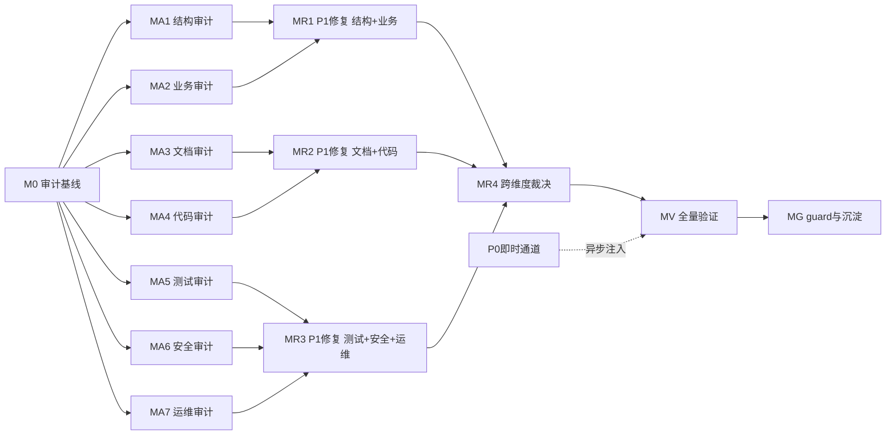

# 审计-修复路线图

> 最后更新：2026-07-28（v13 — A2.18 多账套/多公司隔离系统性审查完成（MA2 多公司维度收口裁决，**MA2 里程碑全部 18 个工作项 done，MR1 R1.0 可启动**）：零 P0 + 7 项新 P1；核心结论「多公司/多账套隔离写路径 + 自然键层基本成立，读路径隔离机制全仓未落地」——全域 ~70 事务单据 UK_*_CODE_ORG (code, orgId) 正确 + 多账套传播 stamp acctSchemaId + 法人根解析环形守卫存在 + 转移定价 cache 方向性正确 + CoA/CostMethod/折旧 cache SAFE；但平台仅支持 tenant 自动过滤（本项目 0 实体启用 useTenant）+ 19 模块 erp-{module}.data-auth.xml 全部 `<objs/>` 空规则 + 0 个自定义 IDataAuthChecker/IQueryTransformer + IServiceContext/IContext 均无 getOrgId() + 11 dashboard BizModel 经 IDaoProvider 直访绕过仅有的（空）认证管道 + 单组织种子 176 行全部 orgId=2 完全掩盖跨组织泄漏；4 个候选 P0 经证据证伪或降级（orgId 跨组织泄漏降级 P1 单组织种子下无实际腐败是能力缺失非活跃缺陷 / 账套串户降级 P1 仅 multi-schema-enabled=true 时显现 / 法人根解析环形守卫证伪 / 合并抵消作用域误抵消仅理论）；A2.17 交接点复核收口——P0-MA2-018 维持 deferred（billR 无 acctSchemaId 列 + 加 orgId 不足修复：判别列 postingType/isReversed/acctSchemaId 全在 voucher 不在 billR，deferred plan 方向 A/B/C/D 维持不变不重新打开）/ P0-MA2-020 维持 completed（UK_INV_STOCK_BALANCE_NATURAL 已正确含 orgId，多公司隔离正确）；7 项新 P1（P1-MA2-093 orgId 查询隔离全仓未落地 / P1-MA2-094 orgId 写入客户端可任意指定 / P1-MA2-095 acctSchemaId 读路径泄漏[报表/看板/期间前置 12 处查询省略] / P1-MA2-096 ErpFinGlBalance 无 DB 强制自然键[与 P0-MA2-020 同型但 GL 由过账引擎单线程维护并发风险低] / P1-MA2-097 跨公司配对 owner doc 算法漂移[pairKey 实测=billCode 非 multi-company.md:197 声明的 min/max+materialId] + ErpFinIntercompanyMatch 审计列 arOrgId/apOrgId/arSideVoucherId/apSideVoucherId/materialId 五列从不填充 / P1-MA2-098 runMatching 非幂等[无 (pairKey, periodId) UK] / P1-MA2-099 GL 映射 cache 默认 org-dimension-enabled=false 时所有规则塌缩 "_" bucket 跨组织泄漏——全部目标 MR1）；多公司/多账套维度终态全域 ⚠️(P1)。v12 — A2.17 并发与乐观锁系统性审查完成（MA2 并发维度收口裁决）：3 项 P0 + 8 项新 P1 + 2 项新 P2 watch-only；全 19 域 @Version 覆盖矩阵 336 自有实体 100% 声明 versionProp（含 A2.6b 交接"ErpMfgMrpPlanLine 无 versionProp 行级缺口"经实仓证伪——行已声明 versionProp）；透明乐观锁降级 6 处候选全部证伪（业务方法均经 managed-instance read-modify-write + flush，@Version 自动校验生效；全域 grep FOR UPDATE/withLock/executeUpdate/sqlUpdate=0）；MA2 交接 40+ 并发敏感点逐项裁决绝大多数 sustained（UC-INV-08 超卖/UC-SAL-10 双重核销+并发扣批次/期间重复结账/承付 commit-release 竞态/核销 ErpFinArApItem 降级 6 项 MA2/use-case 候选 P0 经证据全部证伪或部分证伪）；REQUIRES_NEW 跨域失败隔离 11 域 PostingExecutor/Dispatcher 一致落地；多轴状态机并发翻转 8/9 Processor 组 sustained；定时任务并发：全 19 cron job 运行于 nop-job-local 非分布式 + 无 IErpSysLockBiz + 全部默认 enabled=false（9 幂等 / 10 并发重复副作用 P1-MA2-086）；3 项 P0（P0-MA2-018 finance erp_fin_voucher_bill_r 无 (billCode, businessType) UK + alreadyPosted TOCTOU 致并发重复凭证 / P0-MA2-019 aps 排产产能并发双倍占用 owner doc §4 锁未落地 / P0-MA2-020 inventory erp_inv_stock_balance 无自然键 UK 致并发首次移动单 INSERT 重复余额行 silent split-quantity corruption——均触及 ask-first ORM 保护区域已异步注入 3 个独立 fix plan 须经独立 plan-audit + 人工确认）；并发维度终态全域 ⚠️(P0→fix-plan + P1)。v11 — A2.7b hr 考勤与工资状态机审查完成（S 级拆分 2/2）：零 P0、6 项新 P1、1 项新 P2 watch-only；hr 考勤与工资八组件状态机（请假 5 态 + 考勤布尔 + 工时单 4 态 + 排班分配 4 值无 dict + 换班 4 态 + 工资双轴 approveStatus 4+paymentStatus 3+posted + 仿真 5 态 + 银行文件 3 态）核心契约经实仓逐项证据确认——主路径状态迁移守卫齐全（请假 5 态全迁移 + approve/cancel 触发排班联动 / 工资支付轴 PENDING→PAID/VOID 双守卫 / 仿真 5 态全迁移 / 换班 4 态全迁移 + approve 副作用交换 shiftId）、@BizMutation 事务回滚保证请假→排班联动失败原子性、工资 markPaid 触发跨域过账经 IErpFinVoucherBiz.post() REQUIRES_NEW Facade[hr production 代码无 daoFor(ErpFin*)]、仿真 convertToFormal per-employee 冲突 skip + all-conflict throw 双层容错；6 项新 P1 全部按 finance P1-MA2-031/032 + mfg P1-MA2-035/036 + hr A2.7a P1-MA2-039~042 同型裁决：P1-MA2-043 工时单 APPROVED/REJECTED dict 死状态 + ErpHrTimesheetBizModel 仅 submit + owner doc §场景 F 声明漂移 / P1-MA2-044 工时单硬编码字符串 "DRAFT"/"SUBMITTED" vs ErpHrConstants 不一致 / P1-MA2-045 银行付款文件 UPLOADED/CONFIRMED dict 死状态 + ErpHrPayrollBankFileBizModel 18 行 CRUD 桩 + owner doc §七 漂移 / P1-MA2-046 排班分配 status 无 dict 绑定 raw VARCHAR + owner doc §二 声明漂移 / P1-MA2-047 SalaryPostingDispatcher javadoc "无 posted 字段" drift + ErpHrSalary.posted 死字段从未写入 / P1-MA2-048 工资过账 tryPostPayment/tryPostAccrual 吞异常致 posted=false 悬挂无告警闭环；1 项 P2 watch-only：P2-MA2-052 state-machine.md 缺考勤/工资/工时单/排班/换班/仿真/银行文件独立章节；MA1 finding [P2-MA1-020 + P1-MA1-022] 运行时复核状态机角度无升级；并发敏感点 5 处交接 A2.17 含 @Version 透明乐观锁降级[7 个 hr 状态机实体全部声明 versionProp]。**hr 状态机审查 S 级拆分 1/2 + 2/2 全部 done**。v10 — A2.7a hr 员工与组织状态机审查完成（S 级拆分 1/2）：零 P0、4 项新 P1、5 项新 P2 watch-only；hr 员工与组织七组件状态机（员工 5 态 + 合同 4 态 + 招聘 7 态 + 考核 3 态 + 发展计划 4 态 + 发展计划项 4 态 + 调查 4 态）核心契约经实仓逐项证据确认——在职 + 招聘 + 考核 + 发展计划 + 计划项主路径状态迁移守卫齐全、@BizMutation 事务回滚保证招聘 hire 跨实体副作用失败原子性、考核 completeAssessment 跨实体刷新 gapAnalysis 经直传 levels 避免跨事务可见性、合同到期经 cron-gated Job + 单失败隔离 + 跨域通知派发；4 项新 P1 全部按 finance P1-MA2-031 + mfg P1-MA2-035/036 同型裁决：P1-MA2-039 员工 employmentStatus RESIGNED/TERMINATED/RETIRED 三态死状态 + owner doc §场景D/E 离职/退休/转正迁移 + 联动完全未实现 / P1-MA2-040 合同 SUSPENDED dict 死状态 + owner doc 无合同独立章节 / P1-MA2-041 调查 OPEN/CLOSED/ARCHIVED 三态死状态 + ErpHrSurveyBizModel 18 行 CRUD 桩 + owner doc §状态机声明漂移 / P1-MA2-042 发展计划 DRAFT/CANCELLED + 计划项 OVERDUE dict 死状态 + 无 cancelPlan + 无 OVERDUE 自动 job；5 项 P2 watch-only：P2-MA2-047 state-machine.md 缺 5 组件独立章节 / P2-MA2-048 招聘 close 无守卫 / P2-MA2-049 recruitment.md 多实体 Deferred 未注记 / P2-MA2-050 调岗请假冲突 warn 非阻断 / P2-MA2-051 长期 PROBATION 未转正无 TODO 提醒；MA1 finding [P2-MA1-020 + P1-MA1-022] 运行时复核无升级；并发敏感点 5 处交接 A2.17 含 @Version 透明乐观锁降级[7 个 hr 状态机实体全部声明 versionProp]。v9 — A2.5c finance AR/AP 核销状态机审查完成：零 P0、零新 P1；AR/AP 辅助账项状态机（OPEN/PARTIAL/SETTLED/CANCELLED/WRITTEN_OFF 5 态）+ 核销单状态机（DRAFT/POSTED/REVERSED 3 态）+ 坏账核销状态机（approveStatus×docType + reverseApprove 红冲闭环）三组件核心契约经证据确认（状态迁移守卫齐全 + @BizMutation 事务回滚保证辅助账与核销单一致性 + reverseApprove 红冲闭环对称回退强一致 + CANCELLED 经 ErpFinArApItemGenerator.cancelOnReverse 可达证伪"死状态"假设 + 域侧 ReceiptSettler/PaymentSettler 与 finance ErpFinReconciliation 双路径为设计并行非分歧）；6 项新 P2 watch-only（P2-MA2-036 ar-ap-reconciliation.md owner doc 漂移 / P2-MA2-037 state-machine.md 缺独立章节 / P2-MA2-038 双路径无对账守卫 / P2-MA2-039 assertOpen 不拒绝 WRITTEN_OFF [config-gated] / P2-MA2-040 坏账 REJECTED 无 resubmit / P2-MA2-041 核销无期间 CLOSED_FINAL 守卫）；P1-MA2-009 多币种核销辅助账本位币升级评估维持 P1 不升 P0 + P2-MA2-008/014 并发核销 SETTLED 漂移升级评估维持 P2 并降级（ErpFinArApItem versionProp 乐观锁将 silent lost-update 降为 detectable conflict）；6 项已登记 MA2 finding 运行时复核无升级；并发敏感点 5 处交接 A2.17。S 级状态机审查三拆分 A2.5a/b/c 全部 done。v8 — A2.5b finance 期间/预算状态机审查完成：零 P0；2 项新 P1 P1-MA2-033 NEVER_OPENED→OPEN 迁移路径缺失 / P1-MA2-034 carryForward 不校验源年度全 CLOSED 前置 + 2 项 P2 watch-only P2-MA2-034 owner doc 4 处漂移 / P2-MA2-035 REJECTED→DRAFT 直迁缺失；期间状态机 5 态 + per-module 子状态机 + 预算方案状态机 6 态 + 承付 commit/release 独立凭证状态机核心契约经证据确认（closePeriod/finalizePeriod/reverseClose 状态迁移守卫齐全 + @BizMutation 事务回滚保证结账失败时期间状态一致性 + reverseClose 红冲容错齐全 + 承付 commit/release 3 接入点齐全 + release 守卫 + 采购 hook 容错对称性已 fix）；P1-MA2-020 反结账 kill-switch 升级评估维持 P1 不升 P0 + P1-MA2-021 期间侧 CLOSED_FINAL 凭证锁定升级评估维持 P1 不升 P0；7 项已登记 MA2 finding 运行时复核无升级；5 处并发敏感点交接 A2.17。v7 — A2.5a finance 会计凭证状态机审查完成：零 P0；2 项新 P1 P1-MA2-031 DRAFT→CANCELLED 状态不可达+红字凭证终态归属未定义 / P1-MA2-032 IGNORED 凭证悬挂缺告警闭环 + 1 项 P2 watch-only P2-MA2-033；会计凭证状态机核心契约经证据确认（幂等键 + markOriginalVoucherReversed 引擎统一 reversal 路径 + findAllPostedVouchers 过滤 postingType=REVERSAL 阻断红字凭证再红冲的无限循环）；P1-MA2-021 CLOSED_FINAL 凭证锁定升级评估裁决维持 P1 不升 P0；11 项 MA1/MA2 finding 运行时复核无升级；并发敏感点 3 处交接 A2.17。v6 — A2.4 库存核算一致性审计完成：零 P0；2 项新 P1 P1-MA2-023 SPECIFIC 历史成本守卫缺失 / P1-MA2-024 STANDARD 红冲成本不变量跨重估破缺 + 5 项 P2 watch-only P2-MA2-026~030；三方对账「成本层+余额+流水」在正常路径成立；MA1/MA2 finding P1-MA1-022/P0-MA1-021 done/P1-MA2-017/P1-MA2-002 运行时复核无升级；并发敏感点 3 处交接 A2.17；MA2 业财端到端 P2P+O2C+期末结账+库存核算四条主链均已完成。v5 — A2.3 期末结账端到端审计完成：1 项 P0 P0-MA2-016 [即时通道 fix plan ✅ done] + 6 项 P1 + 3 项 P2 watch-only）
> 来源：`docs/skills/audit-remediation-roadmap-authoring-prompt.md`
> 范围文档：`docs/audits/audit-remediation-scope-and-dimension-matrix.md`
> 审查记录：3 路独立子代理（规范合规 / 覆盖面 / 可执行性），发现 S 级未拆分 / R*.x 占位符卡死 / 并发维度缺失 / 流水线退化等问题，本版全部修订

## 目的

本路线图覆盖 nop-app-erp（19 域、154 模块）的全面审计与 P0/P1 彻底修复。引用 `docs/backlog/00-roadmap-authoring-guide.md` 作为规范。ORM 变更已授权。

## Work Item Status

> 唯一的动态状态块。状态：`todo` / `ready` / `done`。初始全 `todo`。

### Milestone M0 — 审计编排基线

| # | Work Item | Status | Owner Doc | Deps | Skill |
|---|-----------|--------|-----------|------|-------|
| 0.1 | 初始化审计维度矩阵 + 复杂度评估 + 未闭包发现清单 | done | `docs/audits/audit-remediation-scope-and-dimension-matrix.md`（closure audit 通过 plan 2026-07-27-1015-1 Phase 1） | — | none |
| 0.2 | 初始化审计报告索引 arm-index.md | done | `docs/audits/arm-index.md`（closure audit 通过 plan 2026-07-27-1015-1 Phase 1） | — | none |
| 0.3 | 跑 compliance checker 确认精确基线 + 全量 mvn build+test 确认绿色基线 | done | `docs/audits/compliance-baseline.md §M0 锚点注记`（HEAD=0e963531d 实测落锚 plan 2026-07-27-1015-1 Phase 2） | — | none |

### Milestone MA1 — 结构与架构层审计

> ORM 审计为机械性字段/类型检查，S 级域可整域审计（单次会话可完成）；跨模块依赖与平台合规按 S/A/B+C 分批

| # | Work Item | Status | Owner Doc | Deps | Skill |
|---|-----------|--------|-----------|------|-------|
| A1.1 | finance ORM 模型审计（48 实体，S 级整域——机械检查） | done | `docs/design/finance/` | 0.3 | `docs/skills/orm-model-audit-prompt.md` |
| A1.2 | manufacturing ORM 模型审计（41 实体，S 级整域） | done | `docs/design/manufacturing/` | 0.3 | `docs/skills/orm-model-audit-prompt.md` |
| A1.3 | hr ORM 模型审计（42 实体，S 级整域） | done | `docs/design/human-resource/` | 0.3 | `docs/skills/orm-model-audit-prompt.md` |
| A1.4 | purchase+sales ORM 模型审计（A 级，机械维度允许 2 域合并） | done | `docs/design/purchase/`+`sales/` | 0.3 | `docs/skills/orm-model-audit-prompt.md` |
| A1.5 | assets+inventory ORM 模型审计（A 级） | done | `docs/design/assets/`+`inventory/` | 0.3 | `docs/skills/orm-model-audit-prompt.md` |
| A1.6 | crm+quality+projects ORM 模型审计（A 级） | done | 各域 README | 0.3 | `docs/skills/orm-model-audit-prompt.md` |
| A1.7 | master-data ORM 模型审计（B 级，DAG 根域单独） | done | `docs/design/master-data/` | 0.3 | `docs/skills/orm-model-audit-prompt.md` |
| A1.8 | cs+contract+b2b+maintenance+drp ORM 审计（B 级合并） | done | 各域 README | 0.3 | `docs/skills/orm-model-audit-prompt.md` |
| A1.9 | aps+logistics+notify ORM 审计（C 级合并） | done | 各域 README | 0.3 | `docs/skills/orm-model-audit-prompt.md` |
| A1.10 | 跨模块依赖与 DAG 审计（全域跨域） | done | `docs/architecture/data-dependency-matrix.md` | 0.3 | `docs/skills/cross-module-dependency-audit-prompt.md` |
| A1.11 | Nop 平台合规审计 — finance+mfg+hr（S 级） | done | `../nop-entropy/docs-for-ai/` | 0.3 | `docs/skills/nop-platform-conformance-audit-prompt.md` |
| A1.12 | Nop 平台合规审计 — pur+sal+assets+inv（A 级核心） | done | 同上 | 0.3 | `docs/skills/nop-platform-conformance-audit-prompt.md` |
| A1.13 | Nop 平台合规审计 — crm+qa+prj+cs+ct+b2b+mnt+drp+md+aps+log+notify（A+B+C 合并） | done | 同上 | 0.3 | `docs/skills/nop-platform-conformance-audit-prompt.md` |
| A1.14 | 架构治理复审（daoFor Type 4 残留 / 字典真相 / 共享内核守卫 / CI guard） | done | `docs/audits/2026-07-23-0000-architecture-governance-review.md` | 0.3 | 参考arch-gov-review方法 |

### Milestone MA2 — 业务正确性层审计

> 状态机审查需理解业务语义，S 级域按功能模块拆分；业财端到端按业务链路拆分

| # | Work Item | Status | Owner Doc | Deps | Skill |
|---|-----------|--------|-----------|------|-------|
| A2.1 | 采购到付款端到端（PO→Receive→Invoice→Pay） | done | `docs/design/flow-overview.md`+`purchase/` | 0.3 | `docs/skills/multi-dimensional-audit-prompt.md` |
| A2.2 | 销售到收款端到端（SO→Delivery→Invoice→Receipt） | done | `docs/design/flow-overview.md`+`sales/` | 0.3 | `docs/skills/multi-dimensional-audit-prompt.md` |
| A2.3 | 期末结账端到端（期间+结转+坏账+成本） | done | `docs/design/finance/period-close.md` | 0.3 | `docs/skills/multi-dimensional-audit-prompt.md` |
| A2.4 | 库存核算一致性（成本+余额+流水三方对账） | done | `docs/design/inventory/`+`finance/costing-methods.md` | 0.3 | `docs/skills/multi-dimensional-audit-prompt.md` |
| A2.5a | finance 状态机审查 — 过账与凭证（S 级拆分 1/3） | done | `docs/design/finance/posting.md` | 0.3 | `docs/skills/state-machine-business-review-prompt.md` |
| A2.5b | finance 状态机审查 — 预算与期间（S 级拆分 2/3） | done | `docs/design/finance/budget.md`+`period-close.md` | 0.3 | `docs/skills/state-machine-business-review-prompt.md` |
| A2.5c | finance 状态机审查 — AR/AP 核销（S 级拆分 3/3） | done | `docs/design/finance/` | 0.3 | `docs/skills/state-machine-business-review-prompt.md` |
| A2.6a | manufacturing 状态机审查 — 工单与报工（S 级拆分 1/2） | done | `docs/design/manufacturing/` | 0.3 | `docs/skills/state-machine-business-review-prompt.md` |
| A2.6b | manufacturing 状态机审查 — MRP/BOM（S 级拆分 2/2） | done | `docs/design/manufacturing/mrp.md` | 0.3 | `docs/skills/state-machine-business-review-prompt.md` |
| A2.7a | hr 状态机审查 — 员工与组织（S 级拆分 1/2） | done | `docs/design/human-resource/` | 0.3 | `docs/skills/state-machine-business-review-prompt.md` |
| A2.7b | hr 状态机审查 — 考勤与工资（S 级拆分 2/2） | done | `docs/design/human-resource/` | 0.3 | `docs/skills/state-machine-business-review-prompt.md` |
| A2.8 | purchase 状态机审查（A 级单域，29 状态字段） | done | `docs/design/purchase/state-machine.md` | 0.3 | `docs/skills/state-machine-business-review-prompt.md` |
| A2.9 | sales 状态机审查（A 级单域，25 状态字段） | done | `docs/design/sales/state-machine.md` | 0.3 | `docs/skills/state-machine-business-review-prompt.md` |
| A2.10 | assets 状态机审查（A 级单域，18 状态字段） | done | `docs/design/assets/state-machine.md` | 0.3 | `docs/skills/state-machine-business-review-prompt.md` |
| A2.11 | inventory 状态机审查（A 级单域，19 状态字段） | done | `docs/design/inventory/state-machine.md` | 0.3 | `docs/skills/state-machine-business-review-prompt.md` |
| A2.12 | quality 状态机审查（A 级单域，16 状态字段） | done | `docs/design/quality/state-machine.md` | 0.3 | `docs/skills/state-machine-business-review-prompt.md` |
| A2.13 | projects 状态机审查（A 级单域，16 状态字段） | done | `docs/design/projects/state-machine.md` | 0.3 | `docs/skills/state-machine-business-review-prompt.md` |
| A2.14 | crm+cs+contract+b2b+maintenance 状态机审查（A+B 合并） | done | 各域 state-machine.md | 0.3 | `docs/skills/state-machine-business-review-prompt.md` |
| A2.15 | aps+logistics 状态机审查（C 级合并） | done | 各域 state-machine.md | 0.3 | `docs/skills/state-machine-business-review-prompt.md` |
| A2.16 | 预算与承付正确性（commitment 释放路径完整性） | done | `docs/design/finance/budget.md` §承付 | 0.3 | `docs/skills/multi-dimensional-audit-prompt.md` |
| A2.17 | **并发与乐观锁审计**（并发库存扣减/发票核销/期间结账的 lost-update 风险 + @Version 覆盖） | done | `docs/design/flow-overview.md` §事务边界 | 0.3 | `docs/skills/open-ended-audit-prompt.md` |
| A2.18 | **多账套/多公司隔离审计**（账套切换污染 / orgId 隔离彻底性） | done | `docs/architecture/multi-company.md` | 0.3 | `docs/skills/multi-dimensional-audit-prompt.md` |

### Milestone MA3 — 文档-实现一致性层审计

| # | Work Item | Status | Owner Doc | Deps | Skill |
|---|-----------|--------|-----------|------|-------|
| A3.1 | 设计文档作为行为基线审计（全域 docs/design/） | done | `docs/design/README.md` | 0.3 | `docs/skills/design-doc-audit-prompt.md` |
| A3.2 | 设计完整性扫描（vs product-scope + erp-survey） | done | `docs/requirements/product-scope.md` | 0.3 | `docs/skills/design-completeness-scan-prompt.md` |
| A3.3 | finance owner doc vs 代码 drift | done | `docs/design/finance/` | 0.3 | `docs/skills/multi-dimensional-audit-prompt.md` |
| A3.4 | manufacturing owner doc vs 代码 drift | done | `docs/design/manufacturing/` | 0.3 | `docs/skills/multi-dimensional-audit-prompt.md` |
| A3.5 | pur+sal+inv owner doc vs 代码 drift | done | 各域 README | 0.3 | `docs/skills/multi-dimensional-audit-prompt.md` |
| A3.6 | API 契约（api.xml）vs 实现一致性（全域） | done | `module-*/model/*.api.xml` | 0.3 | `docs/skills/multi-dimensional-audit-prompt.md` |
| A3.7 | 索引路由有效性（docs/index.md + 子索引） | done | `docs/index.md` | 0.3 | `docs/skills/index-routing-audit-prompt.md` |
| A3.8 | **可定制性验证**（Delta 定制/扩展字段实际可用性 + 不破坏基线抽样） | done | `docs/architecture/customization-capabilities.md` | 0.3 | `docs/skills/open-ended-audit-prompt.md` |

### Milestone MA4 — 代码与前端质量层审计

| # | Work Item | Status | Owner Doc | Deps | Skill |
|---|-----------|--------|-----------|------|-------|
| A4.1a | finance 代码质量审计 — 过账与凭证链路（S 级拆分 1/2） | done | `docs/design/finance/posting.md` | 0.3 | `docs/skills/code-quality-audit-prompt.md` |
| A4.1b | finance 代码质量审计 — 预算/AR-AP/成本/期间（S 级拆分 2/2） | done | `docs/design/finance/` | 0.3 | `docs/skills/code-quality-audit-prompt.md` |
| A4.2a | manufacturing 代码质量审计 — 工单/BOM（S 级拆分 1/2） | done | `docs/design/manufacturing/` | 0.3 | `docs/skills/code-quality-audit-prompt.md` |
| A4.2b | manufacturing 代码质量审计 — MRP/质量集成（S 级拆分 2/2） | done | `docs/design/manufacturing/mrp.md` | 0.3 | `docs/skills/code-quality-audit-prompt.md` |
| A4.3 | **assets 折旧引擎与 Processor 链路专属审计**（48 Processor，全域最高密度） | done | `docs/design/assets/` | 0.3 | `docs/skills/code-quality-audit-prompt.md` |
| A4.4 | hr 代码质量审计（S 级，92 mutation） | done | `docs/design/human-resource/` | 0.3 | `docs/skills/code-quality-audit-prompt.md` |
| A4.5 | pur+sal+inv+qa+crm 代码质量抽样（A 级合并） | done | 各域 README | 0.3 | `docs/skills/code-quality-audit-prompt.md` |
| A4.6 | finance+mfg view.xml vs 后端契约 drift | done | 各域 view.xml | 0.3 | `docs/skills/multi-dimensional-audit-prompt.md` |
| A4.7 | pur+sal+inv view.xml drift | done | 各域 view.xml | 0.3 | `docs/skills/multi-dimensional-audit-prompt.md` |
| A4.8 | crm+hr view.xml drift（view.xml 数 68+72=140） | done | 各域 view.xml | 0.3 | `docs/skills/multi-dimensional-audit-prompt.md` |
| A4.9 | i18n 完整性（全域合并跑 checker） | done | `docs/audits/i18n-coverage-checker.sh` | 0.3 | i18n-checker |

### Milestone MA5 — 测试层审计

| # | Work Item | Status | Owner Doc | Deps | Skill |
|---|-----------|--------|-----------|------|-------|
| A5.1 | finance 测试覆盖深度（64 测试 / 137 mutation，比 0.47） | ready | `docs/design/finance/` | 0.3 | `docs/skills/open-ended-audit-prompt.md` |
| A5.2 | manufacturing 测试覆盖深度（30 测试 / 74 mutation，比 0.41） | ready | `docs/design/manufacturing/` | 0.3 | `docs/skills/open-ended-audit-prompt.md` |
| A5.3 | hr 测试覆盖深度（15 测试 / 92 mutation，比 0.16 — 全域最低！） | ready | `docs/design/human-resource/` | 0.3 | `docs/skills/open-ended-audit-prompt.md` |
| A5.4 | assets 测试覆盖深度（14 测试 / 61 mutation，比 0.23） | ready | `docs/design/assets/` | 0.3 | `docs/skills/open-ended-audit-prompt.md` |
| A5.5 | 测试隔离性（全域合并 + 已知 5 项残留收敛） | done | `docs/testing/` | 0.3 | `docs/skills/open-ended-audit-prompt.md` |
| A5.6 | E2E 测试有效性（抽样 260+ spec 业务断言强度） | done | `tests/e2e/` | 0.3 | `docs/skills/open-ended-audit-prompt.md` |

### Milestone MA6 — 安全与权限层审计

| # | Work Item | Status | Owner Doc | Deps | Skill |
|---|-----------|--------|-----------|------|-------|
| A6.1 | 全域 @BizMutation/@BizQuery 权限注解完整性 grep | ready | `docs/design/roles-and-permissions.md` | 0.3 | `docs/skills/open-ended-audit-prompt.md` |
| A6.2 | finance+mfg+pur+sal 权限深度抽样 | ready | `docs/design/roles-and-permissions.md` | A6.1 | `docs/skills/multi-dimensional-audit-prompt.md` |
| A6.3 | 数据权限运行验证（orgId/角色隔离抽样） | ready | `docs/design/roles-and-permissions.md` | 0.3 | `docs/skills/multi-dimensional-audit-prompt.md` |
| A6.4 | **保护区域纪律审计**（accounting 过账 / data deletion 是否有 owner doc + 测试 + plan-audit 证据） | ready | `docs/context/ai-autonomy-policy.md` §保护区域 | 0.3 | `docs/skills/multi-dimensional-audit-prompt.md` |

### Milestone MA7 — 运维与性能层审计

| # | Work Item | Status | Owner Doc | Deps | Skill |
|---|-----------|--------|-----------|------|-------|
| A7.1 | 错误码完整性（全域 throw new 核对 ErrorCode） | ready | `docs/design/domain-design-guidelines.md §7.1` | 0.3 | `docs/skills/open-ended-audit-prompt.md` |
| A7.2 | 索引完整性（ORM index vs 查询模式，S+A 级域） | ready | 各域 orm.xml | 0.3 | `docs/skills/open-ended-audit-prompt.md` |
| A7.3 | N+1 查询抽样（S 级域列表查询） | ready | 各域 BizModel | 0.3 | `docs/skills/open-ended-audit-prompt.md` |
| A7.4 | CI/guard 持续激活验证（compliance checker 基线漂移 + 19 web 测试 @Tag） | ready | `docs/audits/compliance-baseline.md` | 0.3 | compliance-checker |

### Milestone MR1 — P1 修复（结构 + 业务维度）

> 依赖 MA1 + MA2 完成。R1.0 是"展开器"工作项——其 plan 产物是将 arm-index.md 中 MA1+MA2 批次的 P1 finding 转化为 roadmap 中的具体修复工作项行（R1.1, R1.2...）。这属于执行本 roadmap 横切关注点预声明的设计，不违反 authoring guide 的"AI 不发明工作项"规则。若该批次无 P1 finding，R1.0 直接标记 done 并注明"无 P1 发现"。

| # | Work Item | Status | Owner Doc | Deps | Skill |
|---|-----------|--------|-----------|------|-------|
| R1.0 | MA1+MA2 P1 发现汇总、排序并展开为具体修复工作项行 | done | `docs/audits/arm-index.md` | MA1+MA2 done | none |
| R1.1 | **[ORM ask-first]** propId 缺失机械修复（多币种四件套补字段未重编号，~46 列）— P1-MA1-001/008/010/011/012/013（mfg+assets+projects+maintenance+quality）；修复=codegen 增量再生 or manual renumber | done | 各域 `model/*.orm.xml` | R1.0 | none |
| R1.2 | **[ORM ask-first]** crm DECIMAL↔Double 类型偏离（7 列参与比率计算）— P1-MA1-009；修复=stdDataType double→decimal | done | `module-crm/model/*.orm.xml` | R1.0 | none |
| R1.3 | **[ORM ask-first]** drp 实体命名异常（ErpInvDrp* 4 实体不符合 §19.1）— P1-MA1-014；修复=重命名 ErpDrp*/erp_drp_* 或登记 §19.2 例外 | done | `module-drp/model/*.orm.xml` | R1.0 | none |
| R1.4 | owner doc data-dependency-matrix.md 数值偏差 + finance 纯读规则不完整 — P1-MA1-015（§5.6.2 数值 625/111）+ P1-MA1-017（§3.2/§4.4 command 编排分层注记）；修复=脚本核验值更新 owner doc | done | `docs/architecture/data-dependency-matrix.md` | R1.0 | none |
| R1.5 | **跨域只读 daoFor 家族统一裁决** — P1-MA1-016 + P1-MA1-022（9 域）+ P1-MA4-003/006/008/012/015/022（6 投影）= 8 findings；修复=方案 A（md/fin/inv/mfg I\*Biz 补便捷只读方法后迁移）或方案 B（永久接受登记 posting-exemptions.md） | done | `docs/architecture/posting-exemptions.md`+`data-dependency-matrix.md` | R1.0 | none |
| R1.6 | finance ErpFinBusinessType enum↔dict 漂移（4 项不一致）— P1-MA1-018；修复=dict 改值对齐 enum.name()（方案 B，零数据迁移，enum.name() 已持久化） | done | `module-finance/model/*.orm.xml` dict + `ErpFinBusinessType.java` | R1.0 | none |
| R1.7 | 跨域写半治理登记 posting-exemptions.md — P1-MA1-029（ErpCtInvoicePlanBizModel contract→pur/sal）+ P1-MA2-038（MrpReleaseService 委外单 O-4）；修复=补登豁免条目 | done | `docs/architecture/posting-exemptions.md` | R1.0 | none |
| R1.8 | **[会计保护区域]** P2P 暂估应付冲回缺失 + 付款核销缺三单匹配完成态复核 — P1-MA2-001（GRNI 自动冲回 or documented simplification）+ P1-MA2-003（settle 前复核 or owner doc 更新） | done | `docs/design/purchase/`+`docs/design/finance/returns.md` | R1.0 | none |
| R1.9 | **[会计保护区域]** 多币种 P2P/O2C 本位币凭证路径 + 收款核销汇兑损益 + VoucherFact 双字段 — P1-MA2-002（P2P 未验证）+ P1-MA2-009（O2C 未实现+汇兑损益 plug 缺失）+ P1-MA3-025 MR1 侧（预算公式 javadoc 核实）+ P1-MA3-039 MR1 侧（persistVoucher amountSource=amountFunctional 核实+VoucherFact 双字段） | done | `docs/design/finance/posting.md`+`flow-overview.md` | R1.0 | none |
| R1.10 | **[会计保护区域]** 期末结账 auto-post-on-close 默认值/语义偏离 + AR-AP/allowance 阻断分级 + 年初余额非累计 + 辅助账跨年对账作用域 — P1-MA2-017/018/019；修复=统一默认值+拆分语义+GL 余额维护 or documented simplification | done | `docs/design/finance/period-close.md` | R1.0 | none |
| R1.11 | **[会计保护区域]** 反结账 kill-switch 无审批流 + CLOSED_FINAL 凭证锁定未实现 + FX 重估无前期 reversal — P1-MA2-020/021/022；修复=审批流/期间守卫/reversal+期间过滤 or owner doc 标注 | done | `docs/design/finance/period-close.md`+`state-machine.md` | R1.0 | none |
| R1.12 | 库存核算成本方法缺陷 — P1-MA2-023（SPECIFIC 历史成本守卫缺失）+ P1-MA2-024（STANDARD 红冲成本不变量跨重估破缺）；修复=findSpecificLayers 加 businessDate 过滤 + onIncoming 用传入 unitCost | todo | `docs/design/inventory/`+`finance/costing-methods.md` | R1.0 | none |
| R1.13 | finance 凭证/期间状态机 dict 死状态 + 迁移缺失 — P1-MA2-031（DRAFT→CANCELLED 不可达+红字凭证终态）+ P1-MA2-033（NEVER_OPENED→OPEN 缺失）+ P1-MA2-034（carryForward 源年度 CLOSED 前置）；修复=owner doc 删死状态+补 openPeriod action+carryForward 守卫 | todo | `docs/design/finance/state-machine.md` | R1.0 | none |
| R1.14 | mfg dict 死状态 + owner doc 漂移 — P1-MA2-035（作业卡 TRANSFERRED 死状态）+ P1-MA2-036（MRP CANCELLED+预测 CONSUMED 死状态）+ P1-MA2-037（mrp.md RELEASED vs isFirmed 布尔）；修复=删 dict+常量+owner doc 注记 | todo | `docs/design/manufacturing/state-machine.md`+`mrp.md` | R1.0 | none |
| R1.15 | **[P1-MA2-039 方案A 触及 nop-auth 保护区域；P1-MA2-046 ORM ask-first]** hr dict 死状态/CRUD 桩/硬编码/posted 死字段/排班无 dict — P1-MA2-039/040/041/042/043/044/045/046/047（9 findings）；修复=owner doc Deferred+删 dict 死状态 or 实现状态机+常量替换+加 dict | todo | `docs/design/human-resource/state-machine.md`+`payroll.md` | R1.0 | none |
| R1.16 | **[会计保护区域]** 业财过账 tryPost 吞异常悬挂无告警闭环整体裁决 — P1-MA2-032/048/060/068/074/080（6 MA2）+ P1-MA4-001/004/007/010/013/020（6 MA4）= 12 findings；修复=catch 收窄+IErpSysNotificationBiz 告警+不进终态+期末结账前置检查扩展（统一错误传播分级策略） | todo | `docs/design/finance/posting-log.md`+各域 `depreciation-and-posting.md`/`payroll.md` | R1.0 | none |
| R1.17 | pur/sal/ast reverseApprove→SUBMITTED 违反 owner doc 强制 REJECTED + INLINE 缺守卫 + rollback 不对称 — P1-MA2-049/050/051（pur）+ P1-MA2-056/057（sal）+ P1-MA2-058/059（ast）= 7 findings；修复=xbiz 改 REJECTED+迁移 INLINE 到 Processor+补 isCancelled 守卫 | todo | `docs/design/{purchase,sales,assets}/state-machine.md` | R1.0 | none |
| R1.18 | assets IDLE 状态机迁移未实现 — P1-MA2-061；修复=owner doc Deferred 标注 or 实现 suspend/resume BizMutation | todo | `docs/design/assets/state-machine.md` | R1.0 | none |
| R1.19 | inv StockTake completeTake 未自动生成盘盈/盘亏移动单 + PickingOrder dict 死状态 — P1-MA2-062/063；修复=实现 generateMove or owner doc Deferred+删 dict | todo | `docs/design/inventory/state-machine.md` | R1.0 | none |
| R1.20 | **[P1-MA2-066 方案A ORM ask-first]** qa 业务作废联动取消未落地 + dict 死状态/CRUD 桩 + NCR resolve 允许无 CAPA — P1-MA2-064/065/066；修复=cancelForBusinessBill Facade+删 dict 死状态+NCR noCapaReason 门控 | todo | `docs/design/quality/state-machine.md`+`inspection-integration.md` | R1.0 | none |
| R1.21 | **[xbiz 契约]** prj closeProject 缺任务结束校验 + startProject 缺前置 + Milestone/Billing/CostCollection dict 死状态 — P1-MA2-067/069/070；修复=加任务结束前置+字段校验+dict 独立化 or owner doc Deferred | todo | `docs/design/projects/state-machine.md` | R1.0 | none |
| R1.22 | contract 自动到期 Job 缺失 + NEGOTIATION→TERMINATED 迁移缺失 — P1-MA2-071/072；修复=实现 ErpCtContractExpiryJob+扩展 terminate 守卫 or owner doc 标注 | todo | `docs/design/contract/state-machine.md` | R1.0 | none |
| R1.23 | b2b EDI 出站自动化全部缺失（config-gated OFF 默认）— P1-MA2-073；修复=owner doc Deferred 标注（MFT transport successor）or 实现 ErpB2bEdiOutboundJob | todo | `docs/design/b2b/state-machine.md` | R1.0 | none |
| R1.24 | crm stageId 单向递增守卫未实现 + Event reminderMinutesBefore 死字段 — P1-MA2-075/076；修复=增 sequence 方向守卫+用 per-event reminderMinutesBefore or owner doc 更新 | todo | `docs/design/crm/state-machine.md` | R1.0 | none |
| R1.25 | aps/logistics OperationOrder 缺状态守卫 + cancel 缺审批门控 + 部分签收未实现 — P1-MA2-077/078/079；修复=加 status 守卫+审批门控+owner doc Deferred | todo | `docs/design/{aps,logistics}/state-machine.md` | R1.0 | none |
| R1.26 | **[会计+薪酬保护区域]** hr 个税高档税率 NPE + 累计数据静默吞 + 业财过账链路不完整（计提+公司承担 PostingEvent 永不生成）— P1-MA4-016/017/018；修复=null 防御+移除静默吞+接线 tryPostAccrual+ER event | todo | `docs/design/human-resource/payroll.md` | R1.0 | none |
| R1.27 | **[会计保护区域]** 预算 commitment 释放路径完整性 — P1-MA2-081（部分开票释放语义）+ P1-MA2-082（退货未释放承付）+ P1-MA2-083（冲销后 commitment 未恢复）+ P1-MA2-084（aggregateAmount 语义混淆）；修复=owner doc 补语义+config-gated hooks+三通道分离 | todo | `docs/design/finance/budget.md` | R1.0 | none |
| R1.28 | **[ORM ask-first for UK]** 并发 UK/TOCTOU/cron 幂等缺口（跨域合并）— P1-MA2-085（inv LandedCost）+ P1-MA2-086（10 cron job 并发）+ P1-MA2-087（CloseVoucherWriter，**依赖 P0-MA2-018 deferred 决议**）+ P1-MA2-088（b2b webhook 幂等）+ P1-MA2-089（assets 折旧 schedule）+ P1-MA2-090（mfg MRP release）+ P1-MA2-091（hr shift assignment）+ P1-MA2-092（logistics trackingNo）= 8 findings；修复=加 UK or SELECT FOR UPDATE or job 幂等 | todo | 各域 `model/*.orm.xml`+`docs/design/flow-overview.md §事务边界` | R1.0 | none |
| R1.29 | **[ORM ask-first for P1-MA2-096/098]** 多公司/orgId 隔离架构级补能力 — P1-MA2-093（orgId 查询隔离）+ P1-MA2-094（orgId 写入越权）+ P1-MA2-095（acctSchemaId 读路径泄漏）+ P1-MA2-096（ErpFinGlBalance 无 UK）+ P1-MA2-097（配对算法漂移+审计列全空）+ P1-MA2-098（runMatching 非幂等）+ P1-MA2-099（GL 映射 cache 泄漏）= 7 findings；修复=IUserContext.getOrgId()+IQueryTransformer+12 查询补 filter+填充审计列+加 UK | todo | `docs/architecture/multi-company.md`+`multiple-accounting-schemas.md` | R1.0 | none |

### Milestone MR2 — P1 修复（文档 + 代码维度）

> 依赖 MA3 + MA4 完成。R2.0 同构展开机制。**R2.0 done（2026-07-29）**：62 项 MR2 归属 P1 finding（MA3 52 + MA4 10）展开为 15 个具体修复工作项行 R2.1~R2.15，arm-index §P1 详细清单 62 项交叉引用回填 + 双向完整性校验通过 + 独立 closure audit PASS。排除 15 项 MR1 MA4 交叉项（业财悬挂+daoFor 家族归 R1.5/R1.16/R1.26）。

| # | Work Item | Status | Owner Doc | Deps | Skill |
|---|-----------|--------|-----------|------|-------|
| R2.0 | MA3+MA4 P1 发现汇总、排序并展开为具体修复工作项行 | done | `docs/audits/arm-index.md` | MA3+MA4 done | none |
| R2.1 | 设计文档执行状态泄漏 + 架构混合集群修复 — P1-MA3-001~007（系统性实现状态泄漏 dim3 / finance 混合设计架构 dim5 / master-data plan 转录 / 8 扩展域 README schema 重复 / logistics 缺 architecture 拆分 / 占位 scaffold 泄漏 / dashboards 三联）；修复=移除 plan refs/已落地标记 + 剥离 Java 签名/类名/表名到 architecture + 新建 logistics-integration.md + 重构 README | todo | `docs/design/`（全域 README + dashboards + finance + master-data + logistics + contract + cs） | R2.0 | none |
| R2.2 | 全局视图文档协同修复（8 第二批扩展域全局视图系统性缺位 + 重复真相源 + product-scope 陈旧）— P1-MA3-008~013 + P1-MA3-022 + P1-MA3-023（角色身份冲突 / 8 域导航遗漏 / 8 域无角色基线 / product-scope 里程碑陈旧 / 危险操作审计重复 / 状态码目录重复 / flow-overview §3 缺 12 扩展域 / domain-glossary 缺 8 域词汇）；同根因（8 第二批扩展域"全局视图"系统性缺位在 dim 4+5+6+9 四联投影）协同修复 | todo | `docs/design/`（app-overview + roles-and-permissions + domain-design-guidelines + flow-overview + domain-glossary）+ `docs/requirements/product-scope.md` | R2.0 | none |
| R2.3 | finance owner-doc drift — 状态机/字典/字段语义集群 — P1-MA3-024（期间状态机 CLOSED 三源冲突）+ P1-MA3-026（postingType 字典三源不一致）+ P1-MA3-027（ar-ap-status 命名漂移）+ P1-MA3-028（bank-stmt-status 文档自相矛盾）+ P1-MA3-029（合并抵消实体命名不一致）；修复=统一三文档期间状态机定义 + 单一真相源 postingType + doc 对齐 dict 实际命名 | todo | `docs/design/finance/`（state-machine + ar-ap-reconciliation + bank-reconciliation + intercompany-consolidation） | R2.0 | none |
| R2.4 | finance owner-doc drift — 过账/事务/承付/多币种语义集群（含 MR1 双标项文档侧）— P1-MA3-025 MR2 侧（预算余量公式 doc vs javadoc）+ P1-MA3-030（reverse REQUIRES_NEW 文档冲突）+ P1-MA3-031（CommitmentAcctDocProvider budget vs posting 矛盾）+ P1-MA3-032（auto-post-on-close 默认值相反）+ P1-MA3-039 MR2 侧（persistVoucher amountSource=amountFunctional doc）；修复=更新 posting.md/budget.md/posting-log.md 反映 REQUIRES_NEW + 统一 Provider 描述 + doc 默认值对齐 code + 多币种凭证折算路径文档化（MR1 侧代码核实归 R1.9） | todo | `docs/design/finance/`（posting + budget + posting-log） | R2.0 | none |
| R2.5 | finance owner-doc drift — 配置键/门控集群 — P1-MA3-033（auto-depreciation 键名漂移）+ P1-MA3-034（多账套 4 键大面积不一致）+ P1-MA3-035（合并抵消 4 键零重叠）+ P1-MA3-036（reverse-close 审批框架 vs kill-switch）+ P1-MA3-037（报销借款默认值相反+幻影键）+ P1-MA3-038（AR/AP 自动核销规则命名漂移）；修复=doc config 表更新为 code 实际键名 + 标注 kill-switch successor | todo | `docs/design/finance/`（period-close + domain-design-guidelines + multiple-accounting-schemas + intercompany-consolidation + expense-claim + ar-ap-reconciliation） | R2.0 | none |
| R2.6 | mfg owner-doc drift — P1-MA3-040（§质检约束声明 INSPECTING 不存在）+ P1-MA3-041（可配置超产无 config）+ P1-MA3-042（material-reservation 整个子系统未实现 blocker）+ P1-MA3-043（UC-MFG-12 差异公式列表错误）+ P1-MA3-044（README DowntimeEntry/ProductionPlan 不存在）+ P1-MA3-045（差异阈值预警已实现 doc 标 Deferred）；修复=更新 state-machine/README/use-cases/variance-analysis/material-reservation 标注 Deferred + 移除错误引用 | todo | `docs/design/manufacturing/`（state-machine + README + use-cases + variance-analysis + material-reservation） | R2.0 | none |
| R2.7 | API 契约一致性 — 权限保护/命名约定/影子契约/RPC 契约面 — P1-MA3-046（全域敏感动作零运行时权限保护 dim4，与 A6.1/A6.2 协同）+ P1-MA3-047（API 命名/参数跨域不一致 dim7）+ P1-MA3-048（孤儿 Processor bean 影子契约 dim3，含 P1-MA2-054 子例）+ P1-MA3-049（RPC vs GraphQL 契约面分裂 + 9 api 模块零生成 dim5）；修复=domain-design-guidelines §16 增 API 命名约定节 + per-action FNPT/角色-resource 种子/enable-action-auth 灰度 + 删除死代码孤儿 Processor + 补 9 模块 *Api.java 或 owner doc 声明 RPC=CRUD-only | todo | `docs/design/roles-and-permissions.md`+`domain-design-guidelines.md`+各域 `model/*.api.xml`+`_erp-*.action-auth.xml` | R2.0 | none |
| R2.8 | 索引路由有效性 — P1-MA3-050（articles README 不存在）+ P1-MA3-051（bugs 13 文件无 README）+ P1-MA3-052（AGENTS vs index.md 重叠无交叉引用）+ P1-MA3-054（logs Current 段过时）+ P1-MA3-055（errors/ppts 未纳入目录角色）+ P1-MA3-056（域快速参考表占位）；修复=补建 README + 填充域快速参考表 + 加交叉引用 + 更新 Current 段 + 补 errors/ppts 目录角色 | todo | `docs/index.md`+`AGENTS.md`+`docs/articles/`+`docs/bugs/`+`docs/logs/index.md` | R2.0 | none |
| R2.9 | 可定制性验证 owner doc 实证状态标注 — P1-MA3-057（Delta 业务级实证缺口）+ P1-MA3-058（EAV 实证缺口）+ P1-MA3-059（nop-dyn/task.xml/BizLoader 偏差合并）+ P1-MA3-060（BizLoader 示例误导）+ P1-MA3-061（升级路径保护 5 项机制实证未标注）；修复=owner doc customization-capabilities.md 各能力追加「实证状态注记」+ §升级路径保护每项标注实证 + §定制能力总览增「实际启用」列 | todo | `docs/architecture/customization-capabilities.md` | R2.0 | none |
| R2.10 | **[代码]** finance 过账/预算/AR-AP/成本/期间链路测试有效性 — P1-MA4-002（过账断言弱 + 异常/重试零覆盖）+ P1-MA4-005（期间结账/FX/核销/坏账/年结异常路径空洞）；修复=补多币种过账 E2E + 重试耗尽→MANUAL 断言 + 红冲负向 + deferred-retry 路径 + 期间异常 + FX 多期 reversal + 核销非幂等 + 多年结转 + 行级金额断言 | todo | `docs/design/finance/posting.md` | R2.0 | none |
| R2.11 | **[代码]** mfg 工单/领料/BOM + MRP/成本/委外链路测试有效性 — P1-MA4-009（业财异常零覆盖 + 完工入库 GL 行级断言缺失）+ P1-MA4-011（多币种断言缺失 + 业财悬挂零覆盖 + CostRollup 成环无测试）；修复=dispatcher 过账悬挂测试 + 多币种 E2E + CostRollup 成环 assertThrows + CRP 边界 | todo | `docs/design/manufacturing/` | R2.0 | none |
| R2.12 | **[代码]** assets 折旧引擎/Processor 链路测试有效性 — P1-MA4-014（异常路径零覆盖 + 残值边界仅 residual=0）；修复=posted=false 窗口 reverseApprove 不对称测试 + 并发首次折旧重复 + 批量部分失败隔离 + 折旧过账悬挂 + 非零残值算术测试 | todo | `docs/design/assets/` | R2.0 | none |
| R2.13 | **[代码]** hr 薪酬/过账链路测试有效性 — P1-MA4-019（测试比 0.16 全域最低，异常路径零覆盖）；修复=个税高档边界测试 + 过账悬挂测试 + 累计 JSON 损坏测试 + 公司承担过账负向测试 | todo | `docs/design/human-resource/payroll.md` | R2.0 | none |
| R2.14 | **[代码]** pur+sal+inv 过账/核销/成本链路测试有效性 — P1-MA4-021（多币种零覆盖 + 业财异常悬挂零覆盖 + 成本不变量零覆盖 + 核销门禁零覆盖）；修复=多币种 P2P/O2C E2E + PostingDispatcher 过账悬挂 + STANDARD 红冲重估 + SPECIFIC 成本调整 + PurReversalListener 不对称 + SalReversalListener rollback + settle 三单匹配负向 + 到岸成本反向悬挂 | todo | `docs/design/{purchase,sales,inventory}/` | R2.0 | none |
| R2.15 | **[代码/view.xml drift — 须独立 plan-audit]** view.xml drift 三项 — P1-MA4-023（mfg WorkOrder 结案按钮 STARTED 死枚举引用）+ P1-MA4-024（pur Rfq 作废按钮 cancel 参数名 id vs rfqId）+ P1-MA4-025（hr Employee PII 掩码非法 LEFT/RIGHT 函数）；修复=view.xml visibleOn 状态值对齐 dict + cancel 参数名对齐 BizModel + PII 掩码改用 JS slice | todo | 各域 `erp-*-web/.../*.view.xml`（mfg/pur/hr） | R2.0 | none |

### Milestone MR3 — P1 修复（测试 + 安全 + 运维维度）

> 依赖 MA5 + MA6 + MA7 完成。R3.0 同构展开机制。

| # | Work Item | Status | Owner Doc | Deps | Skill |
|---|-----------|--------|-----------|------|-------|
| R3.0 | MA5+MA6+MA7 P1 发现汇总、排序并展开为具体修复工作项行 | todo | `docs/audits/arm-index.md` | MA5+MA6+MA7 done | none |
| R3.x | _（R3.0 执行后自动展开：新增行初始 Status=todo）_ | （占位） | （见 R3.0） | R3.0 | （见 R3.0） |

### Milestone MR4 — 跨维度 P1 裁决

> 若 MR1-MR3 无跨维度冲突，R4.1 直接标记 done 并在 plan 中注明"无跨维度冲突"

| # | Work Item | Status | Owner Doc | Deps | Skill |
|---|-----------|--------|-----------|------|-------|
| R4.1 | 跨维度发现裁决（多维度重复发现 / 修复方案冲突） | todo | `docs/audits/arm-index.md` §跨维度发现 | MR1+MR2+MR3 done | `docs/skills/multi-dimensional-audit-prompt.md` |

### Milestone MV — 全量验证与跨维度一致性回归

| # | Work Item | Status | Owner Doc | Deps | Skill |
|---|-----------|--------|-----------|------|-------|
| V.1 | 全量 mvn clean install -DskipTests + mvn test 绿色验证 | todo | — | MR4 done | none |
| V.2 | compliance checker 基线对比（不得高于 M0 基线） | todo | `docs/audits/compliance-baseline.md` | V.1 | compliance-checker |
| V.3 | 抽样 E2E 回归 | todo | `tests/e2e/` | V.1 | none |
| V.4 | 独立子代理 closure audit（全部 P0 + 关键 P1 修复） | todo | `docs/audits/arm-index.md` | V.1-V.3 | `docs/skills/closure-audit-prompt.md` |
| V.5 | 审计报告索引完整性校验（所有 P0/P1 可追溯到修复或 deferred） | todo | `docs/audits/arm-index.md` | V.4 | none |

### Milestone MG — 持续 guard 激活与知识沉淀

| # | Work Item | Status | Owner Doc | Deps | Skill |
|---|-----------|--------|-----------|------|-------|
| G.1 | compliance checker 基线更新 | todo | `docs/audits/compliance-baseline.md` | MV done | none |
| G.2 | 新失败模式提升为 docs/lessons/ | todo | `docs/lessons/` | MV done | none |
| G.3 | 重复审计维度提升为 docs/skills/ 新提示 | todo | `docs/skills/` | MV done | none |
| G.4 | 更新 project-context.md + README.md 已知失败模式 | todo | context+skills | MV done | none |

## 框架/平台复用

| 能力 | 提供方式 |
|------|----------|
| 19 个可复用审计 skill | `docs/skills/*-prompt.md`（orm-model-audit / cross-module-dependency / nop-platform-conformance / state-machine-business-review / design-doc-audit / design-completeness-scan / code-quality-audit / index-routing-audit / multi-dimensional-audit / open-ended-audit / closure-audit 等） |
| Compliance checker（19 规则） | `docs/audits/nop-compliance-checker.sh` + CI `.github/workflows/compliance.yml` |
| i18n 覆盖检查器 | `docs/audits/i18n-coverage-checker.sh` |
| 测试基础设施 | JUnit（~2890 测试）+ Playwright E2E（260+ spec）|

## 当前基线

- **验证基线**：`mvn clean install -DskipTests` 全绿（154 模块）；`mvn test` 全绿（~2890 测试，0 failures）
- **Compliance 基线**：见 `docs/audits/compliance-baseline.md`（19 规则）
- **已有审计**：18 份历史审计；2026-07-23 架构治理审查 9 finding 全部已闭包
- **残留风险**：见范围文档 §3.2

## 审计维度矩阵

见 `docs/audits/audit-remediation-scope-and-dimension-matrix.md`。

## Work Item Details

### M0
- 0.1-0.2：文件已产出（scope matrix + arm-index），plan 2026-07-27-1015-1 Phase 1 独立 closure audit 通过（修补 aps 分类边界裁决 + §2.5 v2 维度工作项编号 2 处），转 done
- 0.3：plan 2026-07-27-1015-1 Phase 2 实测落锚（HEAD=0e963531d，全 19 规则 0 漂移 + 156 模块 BUILD SUCCESS + 1756 单元测试 0 failures/0 errors/1 skipped），登记为审计-修复回归起点，转 done

### MA1（结构审计，14 工作项）
- A1.1-A1.9：ORM 按域复杂度分批（S 级整域——ORM 审计是机械性字段/类型检查不需功能拆分；A 级 2 域合并；B/C 级多域合并）
- A1.10：跨模块 DAG 审计 — **done**（plan 2026-07-27-1227-1 closure audit PASS：DAG 零循环零禁止方向、外部声明 108/108=100% 覆盖、0 P0；3 项 P1 [owner doc §5.6.2 数值偏差 / finance IDaoProvider 跨域 DAO 查询 / owner doc §3.2 finance 纯读规则不完整] 登记 MR1；owner doc §5.6.2 自述偏低 69% 已由审计脚本 `docs/audits/scripts/cross-module-dep-extract.py` 闭合提供权威值；F1–F9 全部已闭包确认）
- A1.11-A1.13：Nop 平台合规审计按 S/A/B+C 三批。**全部 done**：A1.11（S 级 finance+mfg+hr 45/45 维度合规，1 项 P1 + 2 项 P2）、A1.12（A 级核心 pur+sal+assets+inv 59/60 维度合规 + P0-MA1-021 已闭包 + 1 项 P1 跨域合并 + 4 项 P2）、A1.13（A+B+C 合并 12 域 179/180 维度合规，0 P0 + 0 新 P1（5 域扩展 P1-MA1-022 至 9 域）+ 2 项 P2 owner-doc drift）。**MA1 平台合规维度全域 19 列全部 ✅/⚠️(P1)/⚠️(P2)，无 ❓**
- A1.14：架构治理复审 — **done**（plan `2026-07-27-1430-3` closure audit PASS：F1–F9 残留全部未回退；自首审以来 5 天密集审计-修复计划落地未引入新 P0；CI guard 19 规则 actual ≤ M0.3 锚点基线（R2c 实际下降 -2 合规改善）；R12 共享内核 import 零增长（69/66/38 精确等于基线）；scope matrix §2.1 架构治理行全域 19 列补全（0 ❓）。**0 P0 + 1 新 P1**（`P1-MA1-029` ErpCtInvoicePlanBizModel 跨域写半治理，MR1 收敛）+ 1 新 P2（`P2-MA1-030` ErpMdCurrencyBizModel:60 LocalDate.now）。**MA1 里程碑（A1.1–A1.14）全部 done**）

### MA2（业务审计，20 工作项）
- A2.1-A2.4：业财端到端四条链路
- A2.5a-c：finance 状态机按功能模块拆分 3 片（过账/预算期间/AR-AP）— S 级行为维度必须拆分
- A2.6a-b：manufacturing 状态机拆分 2 片（工单/MRP-BOM）
- A2.7a-b：hr 状态机拆分 2 片（员工组织/考勤工资）
- A2.8-A2.11：A 级域状态机单域单工作项（purchase/sales/assets/inventory）
- A2.12-A2.14：A+B 级合并 + C 级合并
- A2.15：预算 commitment 释放路径
- A2.16：**并发与乐观锁审计**（新增——use-case-implementation-audit 标记 3 处并发缺口：UC-SAL-10 并发扣批次 / UC-INV-08 乐观锁 / UC-SAL-10 乐观锁；ERP 核心并发风险）
- A2.17：**多账套/多公司隔离审计**（新增——ERP 特定维度物化）

### MA3（文档审计，8 工作项）
- A3.1-A3.7：设计文档/完整性/drift/API 契约/索引路由
- A3.8：**可定制性验证**（新增——Delta/扩展字段实际可用性抽样，ERP 特定维度物化）

### MA4（代码审计，9 工作项）
- A4.1-A4.2：S 级域代码质量
- A4.3：**assets 折旧引擎与 Processor 链路专属审计**（新增——48 Processor 全域最高密度，折旧正确性直接影响财务报表）
- A4.4-A4.5：hr S 级 + A 级合并
- A4.6-A4.8：view.xml drift 三批
- A4.9：i18n 完整性

### MA5（测试审计，6 工作项）
- A5.1-A5.4：S 级域测试覆盖深度（finance/mfg/hr/assets）— **ready**（plan 2026-07-29-1430-1 四域报告产出 + arm-index 登记 11 P1[5 独立 + 6 归并] + 4 P2；0.16 全域最低比根因裁决：缺口为主 + 口径为辅；test-depth-classification.md 计数口径系统性过时 finance 46→64/mfg 19→29/hr 10→15 登记 MR3；待独立 closure audit 转 done）— hr 测试/mutation 比 0.16 全域最低
- A5.5-A5.6：测试隔离性 + E2E 有效性 — **done**（plan 2026-07-29-1430-2 两报告产出：A5.5 PASS[6 项已知污染物全 RESOLVED + JUnit 层平台级 localDb 结构性隔离 + E2E 层 cleanup 纪律收敛 + 零新活跃污染物] + A5.6 ⚠️(P1)[258 spec 断言强度矩阵 强66.3%/中8.5%/弱21.3%/工具2.7% + AMIS `$var` bug 已修复 successor 完整]；arm-index 登记 P1-MA5-012 + P2-MA5-005/006/007 已去重；独立 closure audit 通过 2026-07-29）— **MA5 测试层审计全部 6 工作项（A5.1-A5.6）现已全部 done/ready，MA5 里程碑完成**

### MA6（安全审计，4 工作项）
- A6.1-A6.3：权限注解 + 数据权限 — **ready**（plan 2026-07-29-1410-1 三报告产出 + arm-index 登记 P1-MA6-001/002 + 交叉去重；待独立 closure audit 转 done）
- A6.4：**保护区域纪律审计** — **ready**（plan 2026-07-29-1410-2 报告产出 + arm-index 登记 P1-MA6-003/004/005 + P2-MA6-001 + 交叉去重；待独立 closure audit 转 done）——**MA6 安全与权限层审计 A6.1-A6.4 现已全部 ready，MA6 里程碑完成**

### MA7（运维审计，4 工作项）
- A7.1-A7.3：错误码/索引/N+1 — **ready**（plan 2026-07-29-1708-1 三报告产出 + arm-index 登记 P1-MA7-001[ErpFinVoucherBillR 缺 (billCode, businessType) 索引] + 6 项 P2 watch-only[P2-MA7-001~006 含 P2-MA7-006 归并 P2-MA4-003 同族]；零 P0；交叉去重 P0-MA2-018 互补不重复 + P2-MA4-003 同族归并；待独立 closure audit 转 done）
- A7.4：CI/guard 持续激活验证 — **ready**（plan `2026-07-29-1708-2` 报告产出 + arm-index 登记 P1-MA7-007[F15 i18n-coverage-checker.sh 未接入 CI workflow，裁决接入对齐 F8 模式]；零 P0 + 零 P2；19 规则基线精确 0 漂移[M0.3 锚点后 62 commits 含 4 P0 fix 零回归] + CI 工作流激活性 PASS + checker↔基线块同步(19=19) + 19 模块 web 测试 @Tag 100% 一致；P1-MA7-007 是 A4.9 line 165 委托唯一裁决产出无重复；待独立 closure audit 转 done）——**MA7 里程碑（A7.1-A7.4）全部 done/ready，MA7 完成**

### MR1-MR3（P1 修复）
- R*.0 是"展开器"：读 arm-index.md 中对应 MA 批次的 P1 finding，排序后向 roadmap 追加具体修复工作项行（R*.1, R*.2...）。详见横切关注点 §R*.0 展开机制

### MR4-MG
- R4.1：跨维度裁决（无冲突时直接 done 并注明）
- V.1-V.5：全量验证 + closure audit + 索引校验
- G.1-G.4：基线更新 + 知识沉淀

## 依赖图

## 横切关注点

### 执行模式说明（重要）

Mission Driver 的 closed loop 按**文档顺序**取第一个 `todo` 工作项。本 roadmap 中 MA1-MA7 按文档顺序排列，MR1-MR3 排在 MA 之后。因此**实际执行轨迹是串行的**：M0 → MA1 → MA2 → … → MA7 → MR1 → MR2 → MR3 → MR4 → MV → MG。

"流水线"体现在两个机制：
1. **P0 即时通道**：审计 plan 在 EXECUTE 阶段发现 P0 时当即修复或异步注入修复 plan（`docs/plans/YYYY-MM-DD-HHmm-arm-fix-*.md`），下一轮 REVIEW_PLANS 自动拾取——不等 MR 批量修复
2. **R*.0 展开机制**（见下方）：R*.0 完成后 MR 的具体修复工作项立即成为 `todo`，DRAFT_PLANS 可继续推进

### P0 即时通道纪律

审计中发现 P0 必须当即处理（就地修复或异步注入 plan），不得留到 MR 批量修复。审计报告中对每个 P0 必须标注其修复路径与状态。

### R*.0 展开机制（解决占位符卡死问题）

R*.0 是"展开器"工作项，其 plan 的 EXECUTE 产物是：
1. 读取 `docs/audits/arm-index.md` 中对应 MA 批次的 P1 finding 清单
2. 为每个 P1 finding 在**本 roadmap 文件的对应 MR 表中追加一行**具体工作项（R*.1, R*.2...），含 finding ID / 域 / 修复范围 / Skill
3. 若该批次无 P1 finding，R*.0 的 plan 直接注明"无 P1 发现"，R*.0 标记 done，MR 里程碑跳过

**这属于执行本 roadmap 预声明的设计（横切关注点），不违反 authoring guide 的"AI 不发明工作项"规则。** 工作项的"发明权"在于 roadmap 设计者声明展开机制，R*.0 只是执行该机制。

展开后的 R*.1, R*.2... 工作项的 Status 初始为 `todo`，DRAFT_PLANS 随后正常起草修复 plan。

### 报告归档纪律

- 报告使用 `arm-` 前缀命名：`docs/audits/YYYY-MM-DD-HHmm-arm-<milestone>-<domain-cluster>-<dimension>.md`
- **报告产出即更新** `docs/audits/arm-index.md`（审计 plan 的 EXECUTE 阶段最后一项）
- **修复完成即回填**索引状态
- Finding ID 规范：`P<级别>-<里程碑>-<序号>`（如 `P0-MA1-001`）
- MV V.5 校验索引完整性

### 其他纪律

- **ORM 变更已授权**：允许修改 `module-<domain>/model/*.orm.xml`，修改后必须 `mvn clean install -DskipTests` 重新生成。生成产物仍禁止手编
- **审计 plan 的 BUILD_VERIFY**：审计 plan 不改代码，BUILD_VERIFY 跑全量 `mvn test` 会浪费 ~20min/次。DRAFT_PLANS 起草审计 plan 时，可在 Closure Gates 中声明"本 plan 不改代码，BUILD_VERIFY 的 mvn test 仅作回归基线确认"以管理预期。若 Mission Driver 支持按 plan 类型跳过 BUILD_VERIFY，优先使用
- **compliance 命令**：`mission.json` 中的 `compliance` 命令不会被 BUILD_VERIFY 自动执行（非引擎识别 key）。它仅在 plan 的 EXECUTE 阶段被显式调用（如 M0.3 / V.2 / A7.4）
- **复杂度驱动粒度**：ORM 等机械维度 S 级可整域；状态机/代码/测试等行为维度 S 级必须按功能模块拆分
- **CI 基线守护**：每次修复后 compliance checker 基线不得高于 M0 记录的基线

## 规则

1. 遵循 `00-roadmap-authoring-guide.md` 的状态跟踪规则
2. 里程碑无状态；只在所属工作项上跟踪状态
3. 状态转换：独立草案审查通过 → `todo` 转 `ready`；独立结束审计通过 → `ready` 转 `done`
4. AI 按文档顺序执行 todo 工作项，不重新仲裁优先级。**例外**：R*.0 展开机制（横切关注点预声明）允许向本表追加具体修复工作项行
5. 审计工作项的 plan 产物 = 审计报告 + 索引更新；修复工作项的 plan 产物 = 代码/文档/ORM 变更 + 测试
6. P0 永不进入 MR 批量修复——即时通道是 P0 唯一合法修复路径
7. 工作项粒度：ORM 等机械维度 S 级整域可接受；状态机/代码/测试等行为维度 S 级必须按功能模块拆分（2-4 片）
8. 涉及 ORM 变更的修复工作项，plan 需声明并走标准 plan-audit + closure-audit
9. Skill 列引用 `docs/skills/` 下的完整文件路径，DRAFT_PLANS 应读取该文件作为审计方法指导
