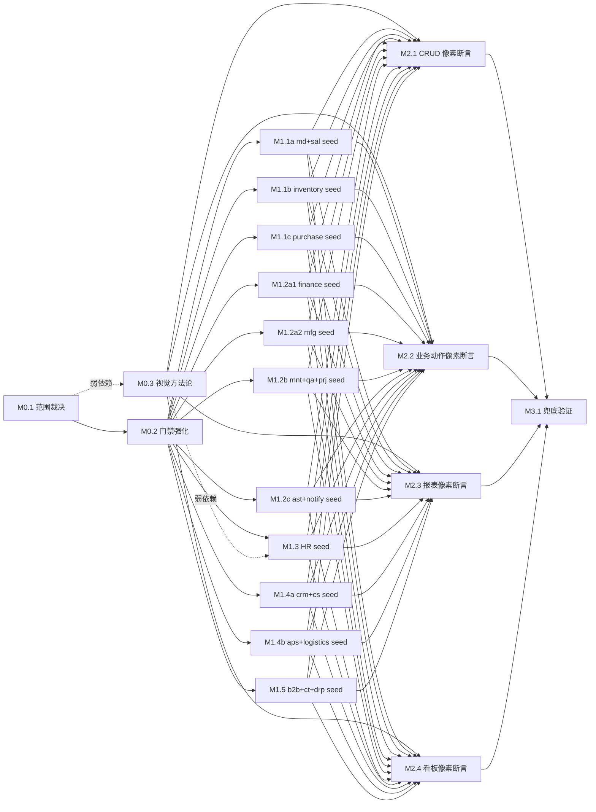

---
---

# 全量测试数据 + 视觉回归覆盖路线图（约 363 实体 seed 全覆盖 + 像素视觉断言扩面；待 M0.1 裁决口径精确化）

> 最后更新：2026-08-31（**人工批准转 ready**——roadmap 经 4 轮独立子代理审查收敛（iteration 1/2/3/4），iteration 4 = 0 Blocker + 0 Major + 0 Minor 残留；用户 2026-08-31 批准进入 mission driver 执行期，所有 19 工作项由 `todo` 转 `ready`；**不立即执行**，待后续用 `./tools/mission-driver.sh run comprehensive-test-data-and-visual-coverage` 启动）
> **注意**：roadmap frontmatter **不含** `audit-rounds` 字段。`audit-rounds` 是 mission driver run 时 `flow.json:maxAuditRounds`（DEEP_AUDIT step 轮次进度）的展示值，与 roadmap 自身的草案审查 iteration 无关。roadmap 草案审查轮次由 §审查记录段 iteration N 记录。
> 触发条件：演示/沙盒默认 seed 装载已落地（plan 1143-1）+ 视觉扩面深化触发（AGENTS.md「当前重点」明示「看板运行时视觉/浏览器回归」+ 各域细化端到端验证）+ RBAC 精细化 / 合规审计需求（影响 M1.3 HR F7 PII 集与 M1.5 EDI 凭据字段）
> 来源：`docs/backlog/README.md` L134（`comprehensive-test-data-and-visual-coverage` 条目；backlog 完成口径列写「M1.1~M1.9 全量 seed 补齐 + M2.1~M2.6 像素断言扩面」为 9+6 旧版口径；本 roadmap 据实仓精确盘点修订为 3+11+4+1=19 工作项，详见 §目的「完成口径对账」段）
> 设计输入：实仓精确盘点（363 app.erp.* / 93 seed / 270 缺 seed 精确）+ 既有相关 plan 血缘（见 §框架/平台复用）
> 执行：mission driver（`./tools/mission-driver.sh run comprehensive-test-data-and-visual-coverage`）；roadmap 状态块为唯一动态状态真相源
> 规范：`docs/backlog/00-roadmap-authoring-guide.md`
> 审查记录：iteration 1（独立子代理 3 路：规范合规 / 覆盖面 / 可执行性）→ NEEDS REVISION（8 Blocker + 16 Major + 17 Minor，全部已并入 iteration 2 v2）；iteration 2（独立子代理 3 路）→ NEEDS REVISION（4 Blocker + 12 Major + 10 Minor，全部已并入本 iteration 3 v3；详见文末 §审查记录 + 文首本字段迭代同步）

## 目的

本路线图覆盖 nop-app-erp 两个相互独立的深化切片：

1. **种子数据全量化**——将当前 93 个 `app.erp.*` 实体 seed（占实测 363 实体的 25.6%；含 sys_notification_template 跨域表 + uom/uom_conversion 软缩写命名）扩展到 363 全量覆盖，让 `app-erp-all` 默认装载后每个业务实体都具备最小可用数据集（演示 + E2E + 业务动作 negative 隔离三重用途）。**实仓精确盘点缺 seed = 270 个**（19 域精确分布见 §当前基线）。
2. **视觉 E2E 像素断言扩面**——在既有 DOM 内容/结构断言层（`tests/e2e/visual/` 实测 23 个 spec：20 `*.visual.spec.ts` + 2 `*.snapshot.spec.ts` + 1 `field-format.value.spec.ts`，120+ passed）之上补齐像素快照断言层（`tests/e2e/visual/{dashboards,reports}.snapshot.spec.ts` 范式 + `complex-pages.snapshot.spec.ts` 探索性采集脚本），覆盖 CRUD 页面、业务动作对话框/抽屉、报表下载产物、看板 echarts canvas 四大场景，捕获布局/样式回归（DOM 断言的结构盲区）。

**完成口径对账**（backlog 表格口径 vs 本 roadmap 实际工作项）：

| backlog 完成口径（README L134） | 本 roadmap 实际 | 差异说明 |
|---|---|---|
| M0.1 范围裁决 + M0.2 门禁强化 + M0.3 视觉方法论 | M0.1 / M0.2 / M0.3 三项 ✓ | 一致 |
| M1.1~M1.9 全量 seed 补齐（9 项） | M1.1a / M1.1b / M1.1c / M1.2a1 / M1.2a2 / M1.2b / M1.2c / M1.3 / M1.4a / M1.4b / M1.5（11 项） | backlog M1.1~M1.9 是 9 逻辑段；本 roadmap 按域簇 / 实体数规模拆为 11 物理工作项（M1.2a 拆为 fin/mfg 两项各 26 实体；M1.4 拆为 crm+cs 45 实体 vs aps+logistics 15 实体两项） |
| M2.1~M2.6 像素断言扩面（6 项：CRUD/业务动作/报表/看板 + 2 余项） | M2.1 / M2.2 / M2.3 / M2.4（4 项） | backlog M2.5/M2.6 推测为「负向视觉断言」+「跨浏览器矩阵」，归 Non-Goal：负向视觉断言与数据负向测试耦合度高出 successor 候选；跨浏览器矩阵沿用 2010-2 Non-Goal |
| 兜底验证全绿 | M3.1 兜底验证 1 项 | 一致 |

**总工作项数 = 19**（3 + 11 + 4 + 1）。

**关键约束**（来自 backlog 表格 + 既有裁决）：

- **执行期任何 seed 变更触发快照重录双面义务**：seed 数据驱动 DOM 内容与像素渲染，seed 变更必须同步重录 DOM 断言 + 像素断言两套基线（PR 模板 grep「快照重录合规声明」段 + `git diff --stat tests/e2e/visual/**-snapshots/` 对账）。
- **E2E 运行不依赖 AI**：所有视觉断言在 playwright headed/headless CI 中独立运行；AI 仅在「诊断」（像素 diff 根因定位）层介入，不在「裁决」（fail vs pass）层介入；`playwright.config.ts` 不引入任何 AI 模型/服务调用。
- **AI 截屏仅诊断不裁决**：像素 diff 信号由 AI 视觉理解定位根因（哪一块布局/样式变化），但 pass/fail 判定严格遵循 Playwright `toHaveScreenshot` 断言的 `maxDiffPixelRatio` 容差结果 + DOM 内容断言结果，AI 不主观判定。`tests/e2e/visual/_helper.ts` 顶部加注释块固化（位置：现有 import 块下、Pixel-snapshot section comment 之上）。
- **保护区域**（来自 `docs/context/ai-autonomy-policy.md`，不再自创"敏感字段集"统一术语）：
  - **ORM 模型变更 = auto + dual-agent-approval**：M0.1 裁决若涉及 ORM 实体增列，须双独立子 agent 批准；M1.x 默认走 CSV-only 路径，不触 ORM；M2.x mask 调整不触 ORM。
  - **敏感字段处理 = 引用既有保护政策**：(a) 薪酬/合同 → auth/permissions plan-first（M1.3 HR 域 seed 涉 E4.2 MaskHelper 范式）；(b) EDI 凭据/供应商价格/成本分解 → accounting/finance postings plan-first（M1.2a1 finance + M1.5 b2b EDI）；(c) 外部系统集成 → deployment/external integrations plan-first（M1.2c notify 跨域派发）。
  - **视觉 mask 调整 = plan 内独立 plan-audit**：属 §执行机制 4 保护区域暂停协议范畴（plan 模板含显式 `独立 plan-audit` checkbox），与 dual-agent-approval 区分清楚。
- **基线口径**（多档数字差异，**M0.1 裁决后落地统一口径**）：

| 口径源 | `app.erp.*` 总数 | 备注 |
|---|---|---|
| 实仓 grep（实测，权威） | **363** | `className="app.erp.*"` 唯一计数，含 notGenCode 子类 |
| backlog README L134（过时应更新） | 350 | 旧版估计，未修订 |
| `TestErpSeedDataIntegrity.java:36` 注释（Phase 1 Decision (a) 早期） | 352 | 早于当前 ORM 实体扩展 |
| `seed-data.md:26` 提及 | 418 = 352 app.erp + 66 平台 | 含平台实体，跨域混合口径 |
| 1143-1 L56 实测（宽口径含 sys_* 部署表） | 275 缺 seed | 含 `erp_sys_config` 等部署配置表 |
| **本 roadmap 实仓精确盘点（窄口径 app.erp.*）** | **270 缺 seed** | 不含 sys_* 部署表 |

**完成口径**（backlog 表格 + M3.1 兜底）：M0 + M1 + M2 全部 done + M3.1 兜底验证全绿（363 实体 findAll 0 异常 + 270 缺 seed 全量补齐 + 引用完整性 0 悬空 + 全域 visual spec 像素层通过 + known-good-baselines.md 新基线行登记）。

## Work Item Status

> 唯一的动态状态块。状态：`todo` / `ready` / `done`。初始全 `todo`；独立草案审查通过转 `ready`；独立结束审计通过转 `done`。AI 不自行重排优先级或发明工作项。

### Milestone M0 — 前置：范围裁决 / 门禁强化 / 视觉方法论（3 项）

> 状态：2026-08-31 全部 `ready`（人工批准 + 4 轮独立子代理审查收敛）

| # | Work Item | Status | Owner Doc | Deps | Skill |
|---|-----------|--------|-----------|------|-------|
| M0.1 | **范围裁决**——精确口径：(a) 实仓 363 vs backlog 350 vs `TestErpSeedDataIntegrity` 注释 352 vs `seed-data.md` 418 = 352+66 vs 1143-1 实证 275 缺 seed 的多档口径对账（含 notGenCode 子类 / sys_* 跨域表 / 部署配置表 / 平台表是否计入 app.erp.*）+ (b) seed 数据分层（演示种子 vs E2E 种子 vs 业务动作 negative 种子）+ (c) 视觉断言扩面边界（哪些页面进、哪些不进、何时 mask；负向视觉断言归 Non-Goal 理由）+ (d) 与 1143-1 默认装载语义的关系（演示/沙盒默认开，prod 保持关闭，seed 完整性门禁是 prod 适用面）+ (e) **270 个缺 seed 实体的最小可用数据集定义**（按域逐实体列表） | `done`（2026-09-01，plan `2026-09-01-0301-1-m01-seed-scope-adjudication` 落地 + 独立结束审计 APPROVE：裁决段 + 六档对账表 + 三层分层 + 270 实体规格表落 `seed-data.md`，视觉扩面边界落 `e2e-runbook.md`；compliance R2c=1542 零漂移） | `docs/architecture/seed-data.md`（新增「全量化裁决」段 + 多档口径对账表）+ `docs/testing/e2e-runbook.md` §视觉扩面边界 | — | none |
| M0.2 | **门禁强化**——基于既有 `TestErpSeedDataIntegrity`（plan 2000-1：418 实体 findAll + 1057 to-one 全仓引用完整性扫描）扩展至 363+ 实体（按 M0.1 裁决口径）+ 新增「seed CSV 存在性 + 行数 > 0」全量断言 + 「白名单豁免」常量表（weak pointer / placeholder 引用的合规登记）+ 与 1143-1 的「97 CSV」实证基线快照对齐 + `mvn test -pl app-erp-all` 已知回归（C03/C04/C08/C09/C12 + 2 hr/drp）的 snapshots 双面重录前置评估；本计划不修改任何 seed CSV 内容 | `ready` | `docs/architecture/seed-data.md` + `app-erp-all/src/test/java/io/nop/app/all/seed/TestErpSeedDataIntegrity.java` | M0.1 | `nop-testing` |
| M0.3 | **视觉方法论固化**——明文规范：AI 截屏仅诊断不裁决（裁决面 = Playwright `toHaveScreenshot` 断言结果）+ **`tests/e2e/visual/_helper.ts` 顶部加注释块固化**；mask 动态区域的标准（日期参数、时间戳、用户名、echarts canvas 动画末态、AMIS 自适应布局断点）；跨次重跑的稳定性阈值（基于 2010-2 实测容差基线）；snapshot 重录协议（DOM 断言 + 像素断言双面同步触发条件）+ **PR 模板 grep「快照重录合规声明」段**；与 2010-2 像素基线范式 + **6 处 Deferred**（1249-2 / 2330-2 / 1728-1 / 0930-3 / 1045-2 / 1145-1；2010-2 L7 列）的层叠关系（DOM 主层 + 像素互补层）；CI 集成约定（字体固化 + mask + 容差范式入 playwright.config.ts / `tests/e2e/visual/_helper.ts` / e2e-runbook.md）；**M2.x 共享 `_helper.ts` 函数扩展规则**：M2.x 只能新增按场景拆分 helper 子集（如 `assertCrudRendered` / `assertBusinessActionRendered` / `assertReportRendered` / `assertDashboardRendered`——与既有 `_helper.ts:151` `assertDashboardRendered` DOM 层 + `:260` `assertReportRendered` DOM 层 + 像素层 `assertSnapshot` 包装**继承**而非重命名；像素层新子集命名为 `assertXxxPixelSnapshot` 与 DOM 层 `assertXxxRendered` 区分），不可改既有 `assertSnapshot`——共享函数扩展一律归 M0.3 范畴 | `done`（2026-09-01，plan `2026-09-01-0301-2-m03-visual-methodology-codification` 落地 + 独立结束审计 APPROVE：`_helper.ts` 注释块 + runbook「视觉方法论」段九要素（含合规声明载体裁决 = plan Draft Review Record 载体 + §837 `toHaveScreenshot`/spec 计数勘误）+ dashboards.md 视觉扩面注记 + M0.1 回调义务登记（触发条件已满足）；compliance R2c=1542 零漂移；执行期登记 7 处预存 spec 失败归 successor（`docs/bugs/2026-09-01-0400`），M2.x 前须先修复 reports 浏览器断言层） | `docs/testing/e2e-runbook.md`（新增「视觉方法论」段）+ `docs/design/dashboards.md` §视觉扩面注记 + `tests/e2e/visual/_helper.ts` 顶部注释块 | M0.1（弱依赖，可并行；M0.3 规范本身不依赖 M0.1 裁决，但最终 mask 区域与扩面边界需 M0.1 落地后回调修订） | none |

### Milestone M1 — 全量 seed 补齐（按域簇 / 子表规模 11 项，实仓精确 270 个缺 seed 实体）

> 状态：2026-08-31 全部 `ready`（人工批准 + 4 轮独立子代理审查收敛）
> **补齐原则**（待 M0.1 裁决确认）：每实体最小可用数据集（行数 ≤ 20，FK 引用闭环，能触发域内核心业务动作的最小正例 + 必要 negative 用例）；不引入生产种子（演示/沙盒语义）；优先触发既有 E2E 套件的「数据可见性」断言。
> **owner-doc 同步**：每工作项完成后回写 `docs/design/<domain>/` owner doc 增「种子数据」段。
> **工作项拆分依据**：按 `docs/plans/00-plan-authoring-and-execution-guide.md:55`「一个计划，一个结果表面」+ 本 roadmap 自设阈值（每工作项 ≤ 50 缺 seed 实体）+ 域业务边界，拆为 11 个可独立 plan 工作项。

| # | Work Item | Status | Owner Doc | Deps | Skill |
|---|-----------|--------|-----------|------|-------|
| M1.1a | **核心 CRUD 域 seed 扩面 A——master-data + sales（12 缺）**——master-data 4 缺：ErpMdMaterialCustoms / ErpMdSupplierApproval / ErpMdSubjectMapping / ErpSysConfig；sales 8 缺：ErpSalContract / ErpSalPriceList / ErpSalPriceListLine / ErpSalPricingRule / ErpSalQuotation / ErpSalQuotationLine / ErpSalReturn / ErpSalReturnLine；含 sales 主子表（order/line 既有）+ 4 个主子表（quotation/return/receipt/pricing）的引用闭环 | `ready` | `docs/design/master-data/` + `sales/` | M0.1 + M0.2 | `nop-backend-dev` |
| M1.1b | **核心 CRUD 域 seed 扩面 B——inventory（16 缺）**——inventory 16 缺：ErpInvBatch / ErpInvCostAdjust / ErpInvCostAdjustLine / ErpInvLandedCost / ErpInvLandedCostLine / ErpInvOwnershipTransfer / ErpInvOwnershipTransferLine / ErpInvPickingOrder / ErpInvPickingOrderLine / ErpInvReservation / ErpInvReservationLine / ErpInvSerialNumber / ErpInvStockTake / ErpInvStockTakeLine / ErpInvTransferOrder / ErpInvTransferOrderLine；8 组主子表的完整引用闭环 + 与现有 stock_move/stock_balance 既有 5 seed 的衔接 | `ready` | `docs/design/inventory/` | M0.1 + M0.2 | `nop-backend-dev` |
| M1.1c | **核心 CRUD 域 seed 扩面 C——purchase（12 缺）**——purchase 12 缺：ErpPurQuotation / ErpPurQuotationLine / ErpPurRequisition / ErpPurRequisitionLine / ErpPurReturn / ErpPurReturnLine / ErpPurRfq / ErpPurRfqLine / ErpPurSupplierPriceList / ErpPurSupplierScorecard / ErpPurSupplierScorecardCriteria / ErpPurSupplierScorecardVariable；9 组主子表完整链路 + 供应商评分主子表 | `ready` | `docs/design/purchase/` | M0.1 + M0.2 | `nop-backend-dev` |
| M1.2a1 | **核心业务域 seed 扩面 A1——finance（26 缺）**——finance 26 缺：ErpFinApDocument / ErpFinApDocumentLog / ErpFinBadDebt / ErpFinBankReconciliation / ErpFinBankReconciliationLine / ErpFinBankStatement / ErpFinBankStatementLine / ErpFinBudgetCarryForwardLog / ErpFinBudgetControlLog / ErpFinBudgetLine / ErpFinBudgetRollForwardLog / ErpFinBudgetScenario / ErpFinConsolidationElimination / ErpFinEmployeeAdvance / ErpFinExpenseClaim / ErpFinExpenseClaimLine / ErpFinFundAccount / ErpFinGlMappingRule / ErpFinIntercompanyMatch / ErpFinIntercompanyTransferPrice / ErpFinPostingException / ErpFinReconciliation / ErpFinReconciliationLine / ErpFinTrialBalance / ErpFinVoucherTemplate / ErpFinVoucherTemplateLine；含 finance 过账凭证扩展（既有 8 行 voucher/voucher_line/voucher_bill_r 扩展至 ~30 行覆盖 posting path）+ budget 全主子表 + reconciliation/bank 4 件套；**触财务过账区域 = plan-first** | `ready` | `docs/design/finance/`（须 plan-first owner doc 证据） | M0.1 + M0.2 | `nop-backend-dev` + `nop-testing` |
| M1.2a2 | **核心业务域 seed 扩面 A2——manufacturing（26 缺）**——manufacturing 26 缺：ErpMfgBatchGenealogy / ErpMfgBom / ErpMfgBomByproduct / ErpMfgBomLine / ErpMfgBomOperation / ErpMfgCostRollup / ErpMfgCostRollupLine / ErpMfgJobCard / ErpMfgJobCardTimeLog / ErpMfgMaterialIssue / ErpMfgMaterialIssueLine / ErpMfgMrpDemand / ErpMfgMrpPlan / ErpMfgMrpPlanLine / ErpMfgMrpScenario / ErpMfgMrpScenarioParam / ErpMfgMrpScenarioVersion / ErpMfgProductionVersion / ErpMfgRouting / ErpMfgRoutingOperation / ErpMfgSubcontractOrder / ErpMfgSubcontractOrderLine / ErpMfgWorkOrderBomLineSnapshot / ErpMfgWorkOrderBomOperationSnapshot / ErpMfgWorkOrderBomSnapshot / ErpMfgWorkOrderLine；工单/MRP/CRP/cost_rollup/subcontract/批次追溯 完整链路 | `ready` | `docs/design/manufacturing/` | M0.1 + M0.2 | `nop-backend-dev` |
| M1.2b | **核心业务域 seed 扩面 B——maintenance + quality + projects（28 缺）**——maintenance 7 缺：ErpMntCalibration / ErpMntEquipmentStatusLog / ErpMntMaintenanceTeam / ErpMntMaintenanceTeamMember / ErpMntSparePartUsageLine / ErpMntTaskTemplate / ErpMntTaskTemplateLine；quality 10 缺：ErpQaCalibration / ErpQaInspectionLine / ErpQaInspectionTemplate / ErpQaInspectionTemplateLine / ErpQaQualityGoal / ErpQaRecall / ErpQaRecallTarget / ErpQaReview / ErpQaRiskRegister / ErpQaSamplingPlan；projects 11 缺：ErpPrjActivityType / ErpPrjBilling / ErpPrjBillingLine / ErpPrjBudgetLine / ErpPrjCostCollectionLine / ErpPrjMilestone / ErpPrjProjectSettlement / ErpPrjProjectSettlementLine / ErpPrjProjectUser / ErpPrjRole / ErpPrjTask；运营域主子表完整链路 | `ready` | `docs/design/maintenance/` + `quality/` + `projects/` | M0.1 + M0.2 | `nop-backend-dev` |
| M1.2c | **核心业务域 seed 扩面 C——assets + notify 跨域派发（19 缺）**——assets 17 缺：ErpAstAssetActionLog / ErpAstAssetCapitalization / ErpAstAssetModel / ErpAstCip / ErpAstCipCostItem / ErpAstCipProgressBilling / ErpAstDisposal / ErpAstInventory / ErpAstInventoryLine / ErpAstMaintenance / ErpAstMaintenanceCost / ErpAstMerge / ErpAstMergeLine / ErpAstMovement / ErpAstSplit / ErpAstSplitLine / ErpAstValueAdjustment；notify 2 缺：ErpSysNotification / ErpSysNotificationRead（sys_notification_template 0330-1 已聚合不计）；资产生命周期主子表 + 跨域派发三件套；**notify 跨域触部署配置区域 = plan-first** | `ready` | `docs/design/assets/` + 跨域 `notify/` | M0.1 + M0.2 | `nop-backend-dev` |
| M1.3 | **HR 域 seed 扩面（32 缺）**——hr 32 缺：ErpHrAssessmentDetail / ErpHrAttendance / ErpHrCompetency / ErpHrCompetencyLevel / ErpHrDevelopmentPlan / ErpHrDevelopmentPlanItem / ErpHrEmployeeAssessment / ErpHrEmploymentContract / ErpHrGapAnalysis / ErpHrLeaveBalance / ErpHrLeaveRequest / ErpHrPayrollBankFile / ErpHrPosition / ErpHrRecruitment / ErpHrRoleCompetency / ErpHrSalary / ErpHrSalaryItem / ErpHrShift / ErpHrShiftAssignment / ErpHrShiftRotationPattern / ErpHrShiftSwapRequest / ErpHrSocialInsuranceBase / ErpHrSocialInsuranceConfig / ErpHrSurvey / ErpHrSurveyAnswer / ErpHrSurveyQuestion / ErpHrSurveyResponse / ErpHrSurveyResult / ErpHrTaxConfig / ErpHrTaxSpecialDeduction / ErpHrTimesheet / ErpHrTimesheetLine（既有 seed：ErpHrEmployee + ErpHrDepartment + ErpHrSalarySimulation + ErpHrSalarySimulationItemAdjustment）；**敏感字段脱敏纪律**：idCardNo / mobilePhone / bankAccountId / socialSecurityNo / salaryAmount 等按 2026-08-11 E4.2 plan MaskHelper 范式脱敏后再 seed；**触 auth/permissions 区域 = plan-first** | `ready` | `docs/design/human-resource/`（每子域增「种子数据」段 + F7 PII 集脱敏注记） | M0.1 + M0.2 + M0.3 弱依赖（HR 页面像素断言如纳入 M2.1 时） | `nop-backend-dev` |
| M1.4a | **第一批扩展域 seed 扩面 A——crm + cs（45 缺）**——crm 30 缺：ErpCrmActivity / ErpCrmBundlePricing / ErpCrmBundlePricingLine / ErpCrmCampaign / ErpCrmConfigRule / ErpCrmEvent / ErpCrmEventCategory / ErpCrmForecastAccuracy / ErpCrmFunnelStageMetrics / ErpCrmLeadConvLog / ErpCrmLeadFunnel / ErpCrmLeadScore / ErpCrmLeadScoreConfig / ErpCrmLeadScoreConfigLine / ErpCrmLeadScoreLine / ErpCrmLeadSequenceProgress / ErpCrmLeadStatus / ErpCrmLostReason / ErpCrmPriceRule / ErpCrmProductConfigurator / ErpCrmQuota / ErpCrmQuoteTemplate / ErpCrmSequence / ErpCrmSequenceAssignment / ErpCrmSequenceStep / ErpCrmSource / ErpCrmTeam / ErpCrmTeamMember / ErpCrmTerritory / ErpCrmTerritoryAssignmentRule；cs 15 缺：ErpCsAgentRate / ErpCsCannedCategory / ErpCsCannedResponse / ErpCsCatalogCategory / ErpCsCatalogFulfillment / ErpCsContract / ErpCsEntitlement / ErpCsKnowledgeBase / ErpCsServiceCatalogItem / ErpCsSlaPolicy / ErpCsTeam / ErpCsTicketAction / ErpCsTicketFulfillmentStep / ErpCsTicketTimerSession / ErpCsTimeEntry；含 CRM 销售预测 4 维度（forecast_period / forecast_line / forecast_accuracy / quota）+ cs ticket 全生命周期 | `ready` | `docs/design/crm/` + `cs/` | M0.1 + M0.2 | `nop-backend-dev` |
| M1.4b | **第一批扩展域 seed 扩面 B——aps + logistics（15 缺）**——aps 7 缺：ErpApsCapacityReservation / ErpApsConstraint / ErpApsDispatchLog / ErpApsDispatchRule / ErpApsOpRouting / ErpApsOperationOrder / ErpApsSchedule；logistics 8 缺：ErpLogCarrier / ErpLogCarrierConfig / ErpLogDeliveryBooking / ErpLogDeliveryWindow / ErpLogShipment / ErpLogShipmentLine / ErpLogShipmentLog / ErpLogShipmentParcel；APS 排产链 + logistics 路径 1/2 完整链路 | `ready` | `docs/design/aps/` + `logistics/` | M0.1 + M0.2 | `nop-backend-dev` |
| M1.5 | **第二批扩展域 seed 扩面——b2b + contract + drp（39 缺）**——b2b 13 缺：ErpB2bAsn / ErpB2bAsnLine / ErpB2bCertificationChecklist / ErpB2bCodeMapping / ErpB2bEdiDoc / ErpB2bEdiFormat / ErpB2bEdiLog / ErpB2bMftCertificate / ErpB2bMftConfig / ErpB2bMftLog / ErpB2bPartnerCredential / ErpB2bPartnerProfile / ErpB2bTestExchange；contract 15 缺：ErpCtApprovalMatrix / ErpCtApprovalRecord / ErpCtConsumptionLine / ErpCtContract / ErpCtContractLine / ErpCtContractVersion / ErpCtDocument / ErpCtInvoicePlan / ErpCtRebateAccrual / ErpCtRebateAgreement / ErpCtRebateSettlement / ErpCtRebateTier / ErpCtSignatureRequest / ErpCtTemplate / ErpCtVolumeDiscount；drp 11 缺：ErpDrpLine / ErpDrpParameter / ErpDrpPlan / ErpDrpScenario / ErpDrpScenarioParam / ErpDrpScenarioVersion / ErpInvDrpCrossDock / ErpInvDrpDockAppointment / ErpInvDrpLeadTimeRecord / ErpInvDrpSafetyStockCalc / ErpInvDrpSupplierScore；含 EDI 文档三件套（edi_format / edi_doc / edi_log）+ 合同主版本（contract + contract_version + approval_record）+ 分销网络；**EDI 凭据触 deployment/external integrations 区域 = plan-first** | `ready` | `docs/design/b2b/` + `contract/` + `drp/` | M0.1 + M0.2 | `nop-backend-dev` |

### Milestone M2 — 视觉 E2E 像素断言扩面（4 段）

> 状态：2026-08-31 全部 `ready`（人工批准 + 4 轮独立子代理审查收敛）
> **复用基础**（详见 §框架/平台复用）：2010-2 已建 `tests/e2e/visual/{dashboards,reports}.snapshot.spec.ts` 像素基线范式（`toHaveScreenshot` + mask + 容差 + 字体固化）；既有 20 个 `*.visual.spec.ts` + 1 个 `field-format.value.spec.ts` DOM 内容断言层 + 2 个 `*.snapshot.spec.ts` 像素基线层 + 1 个 `complex-pages.snapshot.spec.ts` 探索性采集脚本；e2e-runbook.md 套件结构与运行命令。
> **mask 重录协议**（M0.3 产出）：任何视觉断言变更触发 `tests/e2e/visual/**-snapshots/` 双面（DOM + 像素）重录，禁止单面重录；CI 中重录用 `--update-snapshots` 但 PR review 必须人工核查 mask 区域合理性；**视觉 mask 调整 = plan 内显式 `独立 plan-audit` checkbox**。
> **命名差异说明**：Playwright 真实 API 为 `toHaveScreenshot`（2010-2 实际使用，`_helper.ts:88` `expect(page).toHaveScreenshot`）；`toHaveSnapshot` 是部分文档用的旧别名。本 roadmap 统一称 `toHaveScreenshot`，命名规范在 M0.3 锁定。
> **helper.ts 共享函数规则**：M2.x 只能新增像素层 helper 子集（命名 `assertXxxPixelSnapshot`），与既有 DOM 层 `assertXxxRendered`（`_helper.ts:151` `assertDashboardRendered` + `:260` `assertReportRendered`）**语义并列**；不可改既有 `assertSnapshot`（像素统一封装）。

| # | Work Item | Status | Owner Doc | Deps | Skill |
|---|-----------|--------|-----------|------|-------|
| M2.1 | **CRUD 页面像素断言扩面**——按现有 23 个视觉 spec 域分布（20 `*.visual.spec.ts`：dashboards.visual / reports.visual / f12-page-structure / f13-non-standard-views / f16-complex-pages / f16-high-risk / f16-p2-complex-pages / tree-entity-views / ext-domains-child-table / ext-domains-list-filter / readonly-views / list-query-filter / fin-period-close-wizard / gl-mapping-rule / maintenance-visit-wizard / material-customs / party-search-picker / sensitive-masking / sensitive-operation-confirmations / status-tag；+ 1 `field-format.value.spec.ts`），按 M1.x seed 落地进度选 30~50 个代表性 CRUD 页面补 `toHaveScreenshot` 像素断言（含 list 表头/分页/过滤切换、form 字段集/必填校验、drawer/modal 打开等典型状态）；mask 区域按 M0.3 范式；**视觉 mask 调整 → plan 内独立 plan-audit checkbox** | `ready` | `docs/testing/e2e-runbook.md` §视觉扩面段 + `tests/e2e/visual/_helper.ts` 像素 helper 子集扩展 | M0.3 + M1.x 按域相关性（仅依赖 M2.1 涉及域，非 M1.x 全员） | `nop-testing`（主）+ `nop-frontend-dev`（辅） |
| M2.2 | **业务动作像素断言扩面**——`tests/e2e/business-actions/` 117 spec.ts 中关键路径（`approve` / `submit` / `post` / `reverse` / `confirm` / `cancel` / `reopen` / `close` 等高频 `@BizMutation` 触发的对话框/抽屉/列表变更快照），按 M1.x seed 落地进度选 30~50 个代表性 mutation 路径补像素断言；含负向动作的拒绝弹窗/Toast 截图；**视觉 mask 调整 → plan 内独立 plan-audit checkbox** | `ready` | `docs/testing/e2e-runbook.md` §业务动作视觉段 | M0.3 + M1.x 按域相关性（仅依赖 M2.1 涉及域） | `nop-testing` + `nop-frontend-dev` |
| M2.3 | **报表像素断言扩面**——`tests/e2e/visual/reports.snapshot.spec.ts` 范式（2010-2 已建）扩展至全 50 个 `tests/e2e/reports/` spec.ts；每报表选 1~2 个代表性渲染快照（列表态 + 参数切换态 + 导出 HTML 态）；含报表下载产物字节级 diff（0204-1 plan「报表下载运行时回归」仅交付二进制有效性回归层，字节级 diff 仍 open optimization candidate，本里程碑不新增字节级 diff，仅像素层）；**视觉 mask 调整 → plan 内独立 plan-audit checkbox** | `ready` | `docs/testing/e2e-runbook.md` §报表视觉段 | M0.3 + M1.x（仅依赖 M1.x 有报表的域，notify / b2b 等无报表域不依赖） | `nop-testing` + `nop-frontend-dev` |
| M2.4 | **看板像素断言扩面**——`tests/e2e/visual/dashboards.snapshot.spec.ts` 范式（2010-2 已建）扩展至全 26 个 `tests/e2e/dashboards/` spec.ts；10 域看板（finance/inventory/manufacturing/sales/purchase/hr/quality/projects/maintenance/assets）每域选 1~3 个核心 KPI 卡片（KPI 值/趋势图/TopN 列表/告警列表）；echarts canvas 渲染末态固化（`animation: false` + `waitForFunction` 等价手段）；**视觉 mask 调整 → plan 内独立 plan-audit checkbox** | `ready` | `docs/testing/e2e-runbook.md` §看板视觉段 | M0.3 + M1.x（仅依赖 M1.x 有看板的域，notify 等无看板域不依赖） | `nop-testing` + `nop-frontend-dev` |

### Milestone M3 — 兜底验证与基线登记（1 项）

> 状态：2026-08-31 `ready`（人工批准 + 4 轮独立子代理审查收敛）

| # | Work Item | Status | Owner Doc | Deps | Skill |
|---|-----------|--------|-----------|------|-------|
| M3.1 | **全量回归基线登记**——final-closure：(1) `mvn clean install -DskipTests` 全 156 模块 BUILD SUCCESS + `mvn test` 全 reactor 与已知基线一致或更优（参考 `docs/testing/known-good-baselines.md` 最新基线行 2026-08-31 plan-1426-2 行 `mvn test -pl app-erp-all` 69/0/0/1 全绿 + compliance baseline R2c=1542 零漂移；2026-08-28 plan-0219-2 历史 3947/0/0/1/669 行已不在主表，按 1426-2 行最新基线为权威）；(2) `TestErpSeedDataIntegrity` 按 M0.1 裁决口径全量实体 findAll 0 异常 + 引用完整性 0 悬空（白名单豁免零增量）；(3) `bash docs/audits/nop-compliance-checker.sh` 对照 `docs/testing/known-good-baselines.md` 最新基线行（如 R2c=1542）核对零漂移（口径以 baseline 表为权威，不锁死"16 规则"）；(4) `tests/e2e/visual/{dashboards,reports}.snapshot.spec.ts` + M2.x 新增 `*.snapshot.spec.ts` 像素层全绿 + **快照重录合规检查**（逐 plan 复核 `## Draft Review Record` 含「快照重录合规声明」段 + `git diff --stat tests/e2e/visual/**-snapshots/` 变更对账）；(5) `./scripts/start-app.sh restart` 二轮 fresh-DB 启动 + GraphQL 抽样 = 19 域每域 1 表（19 表）+ 1143-1 baseline 5 表（Currency/Material/Partner/PurOrder/SalOrder；共 ≥24 表）findPage 行数与 CSV 行数一致；(6) **`mvn test -pl app-erp-all` 全绿**——`known-good-baselines.md:15` 2026-08-31 行登记 `mvn test -pl app-erp-all` 69/0/0/1 全绿（覆盖 §当前基线 已知 5 处集成测试预存回归 TestErpC03O2cGoldenPath / TestErpC04SalReturnWithCs / TestErpC08MrpApsRelease / TestErpC09QaNcrCapaScrap / TestErpC12PrjTimesheetSettlement **已全部 plan 1426-2 修复清零**——roadmap 不再标记为开放；+ 2 个 hr/drp 预存回归 `TestErpHrDepartmentPositionDeleteGuard#testDeleteEmptyPositionAllowed` + `TestErpDrpCrossDock#testStagingTimeoutFallbackJob` 由 successor 收尾，本 roadmap 不处置）；(7) `docs/testing/known-good-baselines.md` 新基线行登记（含 seed 扩展后 **93 → 363 实体 seed** + **270 个新增 CSV** + visual 像素扩面后 spec 计数 + M3.1 (1)(2)(3)(4)(6) 验证命令输出）；(8) 文档 owner-doc 同步：3 处 owner-doc（`seed-data.md` 全量化状态段 + `e2e-runbook.md` 视觉方法论 + `known-good-baselines.md` 新基线行）按 M3.1 (5)(7) 交叉字段（CSV 总数 / visual spec 数 / baseline R2c 数字 / TestErpSeedDataIntegrity 行基线）口径一致 | `ready` | `docs/testing/known-good-baselines.md` + `docs/architecture/seed-data.md` + `docs/testing/e2e-runbook.md` | M0.x + M1.x + M2.x 全部 `done` | `closure-audit-prompt` |

## Work Item Details

> 每个工作项的简短交付范围（无复选框；详细规格下沉到 plan）。

### M0 — 前置

- **M0.1 范围裁决**：产出 `docs/architecture/seed-data.md` 「全量化裁决」段 + 多档口径对账表（363 vs 350 vs 352 vs 418 vs 270/275 缺 seed 漂移）+ seed 数据分层定义 + 视觉扩面边界 + 270 个缺 seed 实体的最小可用数据集规格表（按域逐实体列表）。
- **M0.2 门禁强化**：`TestErpSeedDataIntegrity.java` 扩展（按 M0.1 裁决口径调整 findAll 范围 + 新增 CSV 存在性/行数断言 + 白名单豁免常量表扩展）；`mvn test -pl app-erp-all` 已知回归（C03/C04/C08/C09/C12 + 2 hr/drp）的 snapshots 双面重录前置评估。
- **M0.3 视觉方法论固化**：`tests/e2e/visual/_helper.ts` 顶部加 AI 截屏仅诊断不裁决注释块；`playwright.config.ts` 字体固化 + mask + 容差范式落地；`docs/testing/e2e-runbook.md` §视觉方法论段（PR 模板「快照重录合规声明」段 + mask 重录协议 + 6 处 Deferred 引用完整）；`toHaveScreenshot` 命名规范锁定；helper.ts 共享函数扩展规则明示（新增像素层 `assertXxxPixelSnapshot` 与 DOM 层 `assertXxxRendered` 并列）。

### M1 — 全量 seed 补齐

- **M1.1a**：`app-erp-all/src/main/resources/_vfs/_init-data/erp_md_*.csv` × 4 + `erp_sal_*.csv` × 8 共 12 CSV 落地；`docs/design/master-data/seed-data.md` + `docs/design/sales/seed-data.md` 增段。
- **M1.1b**：`erp_inv_*.csv` × 16（8 组主子表）共 16 CSV 落地；`docs/design/inventory/seed-data.md` 增段。
- **M1.1c**：`erp_pur_*.csv` × 12（9 组主子表）共 12 CSV 落地；`docs/design/purchase/seed-data.md` 增段。
- **M1.2a1**：`erp_fin_*.csv` × 26（10 组主子表 + bank 4 件套 + voucher_template + reconciliation 全链路）共 26 CSV 落地；财务过账段 plan-first（owner doc + tests + 独立 plan-audit）；`docs/design/finance/seed-data.md` 增段。
- **M1.2a2**：`erp_mfg_*.csv` × 26（11 组主子表：work_order/bom/routing/mrp/crp/cost_rollup/job_card/forecast/subcontract/snapshot/batch_genealogy）共 26 CSV 落地；`docs/design/manufacturing/seed-data.md` 增段。
- **M1.2b**：`erp_mnt_*.csv` × 7 + `erp_qa_*.csv` × 10 + `erp_prj_*.csv` × 11 共 28 CSV 落地；`docs/design/maintenance/quality/projects/seed-data.md` 各增段。
- **M1.2c**：`erp_ast_*.csv` × 17 + `erp_sys_notification*.csv` × 2 共 19 CSV 落地；notify 跨域派发段 plan-first；`docs/design/assets/seed-data.md` + `notify/seed-data.md` 增段。
- **M1.3**：`erp_hr_*.csv` × 32（16 组主子表）共 32 CSV 落地；F7 PII 集 MaskHelper 脱敏纪律落地；HR 域段 plan-first；`docs/design/human-resource/seed-data.md` 增段。
- **M1.4a**：`erp_crm_*.csv` × 30 + `erp_cs_*.csv` × 15 共 45 CSV 落地；`docs/design/crm/cs/seed-data.md` 各增段。
- **M1.4b**：`erp_aps_*.csv` × 7 + `erp_log_*.csv` × 8 共 15 CSV 落地；`docs/design/aps/logistics/seed-data.md` 各增段。
- **M1.5**：`erp_b2b_*.csv` × 13 + `erp_ct_*.csv` × 15 + `erp_drp_*.csv` × 11 共 39 CSV 落地；EDI 凭据段 plan-first；`docs/design/b2b/contract/drp/seed-data.md` 各增段。

### M2 — 视觉扩面

- **M2.1 CRUD 像素断言**：30~50 个 `*.snapshot.spec.ts` 新增或扩展（按现有 23 个视觉 spec 域分布）；`tests/e2e/visual/_helper.ts` 新增 `assertCrudPixelSnapshot` 子集。
- **M2.2 业务动作像素断言**：30~50 个业务动作 `*.snapshot.spec.ts` 新增；`tests/e2e/visual/_helper.ts` 新增 `assertBusinessActionPixelSnapshot` 子集。
- **M2.3 报表像素断言**：全 50 个 `tests/e2e/reports/` spec.ts 转像素基线；`tests/e2e/visual/_helper.ts` 新增 `assertReportPixelSnapshot` 子集。
- **M2.4 看板像素断言**：全 26 个 `tests/e2e/dashboards/` spec.ts 转像素基线；`tests/e2e/visual/_helper.ts` 新增 `assertDashboardPixelSnapshot` 子集。

### M3 — 兜底

- **M3.1 兜底验证**：8 条验证命令全绿（详见 §Work Item Status 表 M3.1 行）。

## 框架/平台复用

- **既有 seed 装配机制**：`app-erp-all/src/main/resources/_vfs/_init-data/` + `nop.orm.init-database-data` 配置 + 平台 `DataInitInitializer` 条件 bean（`nop-entropy/nop-persistence/nop-orm/src/main/resources/_vfs/nop/orm/beans/orm-defaults.beans.xml:92-97`，lazy init，仅 `init-database-data=true` 时实例化，按 ORM 拓扑序遍历所有实体表，对 `entityModel.tableName` 检查 `{location}/{tableName}.csv`，存在则经 `dao.saveEntity()` 插入；非幂等，fresh-DB 重置是运行前置条件）。
- **既有 seed 完整性门禁**：`TestErpSeedDataIntegrity`（plan 2000-1：418 实体 findAll 0 异常 + 1057 to-one 全仓引用完整性扫描 + 722 非空 FK 值零悬空 + 白名单豁免常量表 `WHITELIST_KEYS`；`app-erp-all/src/test/java/io/nop/app/all/seed/TestErpSeedDataIntegrity.java:53-211`）。
- **既有默认 seed 装载机制**：plan 1143-1（`application.yaml` 默认 `init-database-data: true` 演示/沙盒语义 + `scripts/start-app.sh` fresh-DB 重置入口 + 实证 97 CSV + 1 SQL 装载 0 冲突）。
- **既有视觉 DOM 内容/结构断言层**：20 个 `tests/e2e/visual/*.visual.spec.ts`（dashboards.visual + reports.visual + f12-page-structure + f13-non-standard-views + f16-* 3 个 + tree-entity-views + ext-domains-* 2 个 + readonly-views + list-query-filter + fin-period-close-wizard + gl-mapping-rule + maintenance-visit-wizard + material-customs + party-search-picker + sensitive-masking + sensitive-operation-confirmations + status-tag）+ 1 个 `field-format.value.spec.ts`；不依赖 `toHaveScreenshot`，经 AMIS GraphQL 拦截 → DOM 断言路径；既有 DOM 层 helper：`assertDashboardRendered`（`_helper.ts:151`）+ `assertReportRendered`（`_helper.ts:260`）。
- **既有像素基线层**：plan 2010-2（`tests/e2e/visual/{dashboards,reports}.snapshot.spec.ts` 像素基线范式 + `playwright.config.ts` 字体固化 + 动态区域 mask + `maxDiffPixelRatio` 容差 + `_exploration/{snapshot-feasibility.exploration,snapshot-feasibility.measure,complex-pages.snapshot}.spec.ts` 可行性裁决实证）；既有像素层 helper：`assertSnapshot`（`_helper.ts`，统一封装 `toHaveScreenshot`）。
- **既有 AMIS 渲染 + flux runtime**：`tests/e2e/visual/_helper.ts` + `playwright.config.ts` webServer（JVM flag `nop.web.render-mode=flux`）+ `tests/e2e/global-setup.ts` + `tests/e2e/auth.ts`。
- **既有敏感字段脱敏与审计**：plan 2026-08-11 E4.2（MaskHelper chokepoint + IAuditService 复用 + 5 域 39 字段披露点 + `erp.audit.field-read.enabled` config-gate）；M1.3 HR 域 seed 直接复用。
- **既有报表下载产物二进制有效性回归**：plan 0204-1（`docs/plans/2026-07-12-0204-1-report-download-runtime-regression.md`，二进制有效性回归层已落地，字节级 diff 仍 open optimization candidate）。
- **既有视觉 Deferred 6 处**：2010-2 L7 列（1249-2 纯像素基线 / 2330-2 + 1728-1 像素基线 + 跨浏览器 bundle / 0930-3 + 1045-2 + 1145-1 像素视觉回归 + 报表下载产物 diff + 跨浏览器 triple-bundle 血缘溯 0637-1）；M0.3 完整消费这 6 处。
- **既有跨域聚合采购规则**：1143-1 实证 14 域表名空间 + 4 平台表 + 1 部署配置（`erp_sys_notification_template`，0330-1 已聚合 27 行）；本 roadmap 需在 M0.1 裁决口径中显式登记 sys_notification_template / ErpSysConfig（master-data 域）是否计入 app.erp.*。
- **既有文档 owner doc**：`docs/architecture/seed-data.md`（seed 真相源 + 状态裁决）+ `docs/testing/e2e-runbook.md`（E2E + 种子库运行手册 + 像素级视觉回归层段 L837 + §视觉扩面边界待补）+ `docs/testing/known-good-baselines.md`（基线登记，含 2026-08-31 默认 seed 启用行 + 5 预存回归登记）+ `docs/design/dashboards.md`（看板视觉注记）。

## 当前基线（2026-08-31 实仓精确盘点）

### 实体与 seed 覆盖度

- **`app.erp.*` 实体总数**：**363 个**（按 `className="app.erp.*"` 唯一计数，无重复；含 notGenCode 子类）
- **`_init-data/` CSV 数**：97 CSV + 1 SQL（`zz-sequence-advance.sql`；1143-1 实仓实证）
  - **93 个** `app.erp.*` 实体有 seed（按 entity tableName 精确匹配 `DataInitInitializer.loadCsvData` 行为；含 0330-1 已聚合的 sys_notification_template 跨域表 1 个 + ErpMdUoM/ErpMdUoMConversion 软缩写命名 `erp_md_uom.csv`/`erp_md_uom_conversion.csv` 各 1；覆盖度 93/363 = **25.6%**）
  - 4 个平台表（`nop_auth_*` × 3 + `nop_sys_code_rule`）
  - 1 个跨域部署配置表（`erp_sys_notification_template`，0330-1 已聚合 27 行）
  - **合计 97 CSV**：93 app.erp + 4 平台 = 97
- **缺 seed 的 `app.erp.*` 实体**：**270 个**（**实仓精确**，按域分布如下；非 271~275 漂移范围）

| 域 | 总实体 | 已有 seed | **缺 seed** | M1.x 工作项 |
|---|---|---|---|---|
| master-data | 25 | 21 | **4** | M1.1a |
| inventory | 21 | 5 | **16** | M1.1b |
| purchase | 20 | 8 | **12** | M1.1c |
| sales | 16 | 8 | **8** | M1.1a |
| finance | 33 | 7 | **26** | M1.2a1 |
| manufacturing | 34 | 8 | **26** | M1.2a2 |
| maintenance | 15 | 8 | **7** | M1.2b |
| quality | 16 | 6 | **10** | M1.2b |
| projects | 17 | 6 | **11** | M1.2b |
| assets | 20 | 3 | **17** | M1.2c |
| notify | 3 | 1 | **2** | M1.2c |
| hr | 36 | 4 | **32** | M1.3 |
| crm | 35 | 5 | **30** | M1.4a |
| cs | 18 | 3 | **15** | M1.4a |
| aps | 7 | 0 | **7** | M1.4b |
| logistics | 8 | 0 | **8** | M1.4b |
| b2b | 13 | 0 | **13** | M1.5 |
| contract | 15 | 0 | **15** | M1.5 |
| drp | 11 | 0 | **11** | M1.5 |
| **总计** | **363** | **93** | **270**（精确） | 11 项 |

### 视觉 E2E 测试现状

| 段 | spec 计数 | 既有覆盖 |
|---|---|---|
| DOM 内容/结构断言层（`*.visual.spec.ts`） | **20** | dashboards.visual + reports.visual + f12-page-structure + f13-non-standard-views + f16-* 3 个 + tree-entity-views + ext-domains-* 2 + readonly-views + list-query-filter + fin-period-close-wizard + gl-mapping-rule + maintenance-visit-wizard + material-customs + party-search-picker + sensitive-masking + sensitive-operation-confirmations + status-tag |
| DOM 字段格式层（`field-format.value.spec.ts`） | **1** | field-format.value |
| 像素基线层（`*.snapshot.spec.ts`） | **2** | dashboards.snapshot + reports.snapshot（2010-2 已建） |
| 可行性探索（`_exploration/`） | **3** | snapshot-feasibility.exploration + snapshot-feasibility.measure（2010-2 决策实证）+ complex-pages.snapshot（探索性纯截图采集脚本，header 写明"不做断言、不更新基线；纯截图采集"） |
| **视觉段总** | **23 = 20 + 2 + 1** | 视觉段全部 spec 计数（含 2 snapshot + 1 value） |
| 业务动作断言（`business-actions/`） | 117 | 按域 5~20 个 spec.ts 不等 |
| 报表断言（`reports/`） | 50 | 报表下载 + 渲染断言 |
| 看板断言（`dashboards/`） | 26 | 10 域看板核心 KPI + echarts 渲染 |

**gap**：CRUD 页面像素断言层缺失（20 `*.visual.spec.ts` 全部走 DOM 内容断言）；业务动作对话框/抽屉像素断言零覆盖；报表与看板的像素层仅 `*.snapshot.spec.ts` 范式，未按域逐报表/逐看板扩面。

### 既有相关 plan（不可重做，仅消费）

- `2026-07-08-1234-1-demo-seed-data-init.md`：seed 机制首次落地
- `2026-08-25-0330-1-aggregate-notify-cs-seeds-into-app-init-data.md`：notify + cs seed 聚合批 94→96 CSV（含 sys_notification_template 27 行）
- `2026-08-15-2000-1-seed-data-referential-integrity-test.md`：门禁 `TestErpSeedDataIntegrity`（418 实体 findAll + 1057 to-one）
- `2026-08-31-1143-1-app-erp-all-default-seed-loading.md`：默认装载 seed（演示/沙盒语义，`application.yaml` 默认 `init-database-data: true` + `scripts/start-app.sh` fresh-DB 重置入口）
- `2026-07-17-2010-2-pixel-snapshot-visual-regression-baseline.md`：像素基线层（dashboards + reports snapshot 范式 + 字体固化 + mask + 容差裁决；含 6 处 Deferred 血缘清单）
- `2026-07-12-0204-1-report-download-runtime-regression.md`：报表下载产物二进制有效性回归层
- `2026-07-09-1249-2` / `2026-07-09-2330-2` / `2026-07-09-1728-1` / `2026-07-09-0930-3` / `2026-07-09-1045-2` / `2026-07-09-1145-1`：视觉方法论 6 处 Deferred 源头（M0.3 完整消费）
- `2026-08-11-1030-1` / `2026-08-11-0915-3`（E4.2 / E4.1）：MaskHelper 敏感字段脱敏 + 字段级可见性，M1.3 HR 域 seed 直接复用
- `2026-08-11-1426-2`（已知 5 集成测试预存回归修复 plan）：TestErpC03/C04/C08/C09/C12 已修清零（`known-good-baselines.md:15` 2026-08-31 行实证）

### 已知 2 处预存回归（仍开放，归 successor，本 roadmap 不处置）

- `TestErpHrDepartmentPositionDeleteGuard#testDeleteEmptyPositionAllowed`：与 M1.3 HR 域 seed 扩面相关（`known-good-baselines.md:15` 登记）
- `TestErpDrpCrossDock#testStagingTimeoutFallbackJob`：与 M1.5 drp 域 seed 扩面相关（`known-good-baselines.md:15` 登记）
- **既不在 M3.1 (6) 全绿判据内**（`mvn test -pl app-erp-all` 69/0/0/1 实证已知回归已清零）—— successor 收尾

## 依赖图

> 表格为权威；图为关键边示意（每工作项完整 Deps 以表格为准）。



## 横切关注点

1. **保护区域**（来自 `docs/context/ai-autonomy-policy.md`）：
   - **ORM 模型变更 = auto + dual-agent-approval**：M0.1 裁决若涉及 ORM 实体增列，须双独立子 agent 批准；M1.x 默认走 CSV-only 路径，不触 ORM；M2.x mask 调整不触 ORM。
   - **敏感字段处理 = 引用既有保护政策**（不再自创"敏感字段集"统一术语）：
     - 薪酬/合同 → auth/permissions plan-first → M1.3 HR 域 seed 涉 E4.2 MaskHelper 范式，须 plan-first
     - EDI 凭据/供应商价格/成本分解 → accounting/finance postings plan-first → M1.2a1 finance 段 + M1.5 b2b EDI 段须 plan-first
     - 外部系统集成 → deployment/external integrations plan-first → M1.2c notify 跨域派发段须 plan-first
   - **视觉 mask 调整 = plan 内独立 plan-audit**：属 §执行机制 4 保护区域暂停协议范畴（plan 模板含显式 `独立 plan-audit` checkbox），与 dual-agent-approval 区分清楚；M2.1/M2.2/M2.3/M2.4 每行 Deps 后均挂此约束。
2. **AI 截屏仅诊断不裁决**（核心约束）：像素 diff 信号由 AI 视觉理解定位根因（哪一块布局/样式变化），但 pass/fail 判定严格遵循 Playwright `toHaveScreenshot` 的 `maxDiffPixelRatio` 容差结果 + DOM 内容断言结果，AI 不主观判定。**`tests/e2e/visual/_helper.ts` 顶部加注释块固化**（位置：现有 import 块下、Pixel-snapshot section comment 之上）：
   ```typescript
   /**
    * AI 截屏仅诊断不裁决——本文件所有 assertSnapshot / assertXxxPixelSnapshot 调用结果为 pass/fail 唯一裁决依据。
    * CI 中任何 toHaveScreenshot 失败由独立子代理 plan-audit 复核根因，不得由 AI 主观判定。
    */
   ```
3. **执行期任何 seed 变更触发快照重录双面义务**（核心约束）：M1.x 每批 seed 落地后，必须同步重录 M2.x 相关 spec 的 DOM 断言 + 像素断言两套基线；禁止单面重录；**PR 模板 grep `## Draft Review Record` 中必须含「快照重录合规声明」段**（由 mission driver / 独立子代理审查）。
4. **E2E 运行不依赖 AI**（核心约束）：所有视觉断言在 playwright headed/headless CI 中独立运行；`playwright.config.ts` 不引入任何 AI 模型/服务调用。
5. **seed 数据分层语义**（来自 1143-1 裁决）：演示/沙盒默认开 + 生产保持 `init-database-data=false`；本 roadmap 全部 seed 资产属「演示 + E2E」语义，prod 部署时由 `nop.auth.skip-check-for-admin` + profile 切换决定是否装载。
6. **缺 seed 实体的最小可用数据集定义**（M0.1 裁决后落地）：每实体 ≤ 20 行，FK 引用闭环（无悬空），能触发域内核心业务动作的最小正例 + 必要 negative 用例；不引入 production-grade 真实个人数据（HR F7 PII 集走 MaskHelper 脱敏）。
7. **M3.1 兜底验证需含 mask 重录合规检查**：PR review 与 CI 必须验证 `tests/e2e/visual/**-snapshots/` 变更与 M0.3 范式一致；M0.3 范式未发布前禁止 M2.x 重录。
8. **快照重录的契约化**：M0.3 范式落地后，任何 seed 变更或视觉 mask 调整必须触发 PR 中追加「快照重录合规声明」，由 plan EXECUTE 阶段独立子代理审查。
9. **M2.x 共享 helper.ts 函数扩展规则**：M2.x 4 段并行 draft 时，`tests/e2e/visual/_helper.ts` 共享函数改动会冲突。规则——M2.x 只能新增像素层 helper 子集（`assertCrudPixelSnapshot` / `assertBusinessActionPixelSnapshot` / `assertReportPixelSnapshot` / `assertDashboardPixelSnapshot`），与既有 DOM 层 helper（`assertDashboardRendered` / `assertReportRendered`）并列命名；不可改既有 `assertSnapshot` 像素统一封装；共享函数扩展一律归 M0.3 范畴。
10. **latch 条件**（执行门控 latch point）：M0.2 `done` 的 latch = `TestErpSeedDataIntegrity` 按 M0.1 裁决口径全绿 + `mvn test -pl app-erp-all` 已知 5 处集成测试预存回归评估记录（C03/C04/C08/C09/C12 已 plan 1426-2 修清零 + 2 处 hr/drp 预存由 successor 收尾）+ Compliance baseline 零漂移 + `docs/logs/2026/08-{day}.md` 执行条目登记；M0.3 `done` 的 latch = `_helper.ts` 注释块提交 + `e2e-runbook.md` §视觉方法论段发布 + `playwright.config.ts` 字体固化配置生效 + `toHaveScreenshot` 命名规范锁定。

## 规则

1. 遵循 `docs/backlog/00-roadmap-authoring-guide.md`。状态只存在于工作项；里程碑不携带状态。
2. 每个工作项在实施前须形成 `docs/plans/` 下的独立计划并通过独立 plan-audit；触及保护区域（ORM / 敏感字段 / 会计过账 / 视觉 mask）的须双独立子 agent 批准或 plan 内独立 plan-audit。
3. 工作项 `todo`→`ready` 需独立草案审查；`ready`→`done` 需独立结束审计。
4. 每工作项结束审计时更新 owner doc（`docs/architecture/seed-data.md` / `docs/testing/e2e-runbook.md` / `docs/design/<domain>/`）+ 日志（`docs/logs/{year}/{month}-{day}.md`）。
5. **执行期任何 seed 变更触发快照重录双面义务**——核心约束，违反按规则 11 处置。
6. **AI 截屏仅诊断不裁决**——核心约束，违反按规则 11 处置。
7. **E2E 运行不依赖 AI**——核心约束，违反按规则 11 处置。
8. 顺序执行建议：M0.1 → M0.2 → M0.3 → M1.x（11 项按域簇并行）→ M2.x（4 段并行）→ M3.1；M1.x 11 项分批：(a) M1.1a/M1.1b/M1.1c 三簇并行；(b) M1.2a1/M1.2a2/M1.2b/M1.2c 四簇并行；(c) M1.3 独立；(d) M1.4a/M1.4b 两簇并行；(e) M1.5 独立；M2.x 4 段可并行；M3.1 必须串行兜底。
9. compliance 复跑：每工作项 closure 前复跑 `bash docs/audits/nop-compliance-checker.sh` 并对照 `docs/testing/known-good-baselines.md` 核验零漂移。
10. **mission-driver 不得在 roadmap `todo`/`ready` 状态下 DRAFT_PLANS**：roadmap 必须先经独立草案审查收敛（iteration 1→accept 或 iteration 2→accept）转为 `ready`；mission driver 仅在所有工作项状态为 `ready` 后启动 DRAFT_PLANS。
11. **核心约束违反处置**（规则 5/6/7 违反）：(a) 立即回滚违规变更（git revert 到合规 commit）；(b) 冻结当前 plan 与 mission driver 执行（不得继续 draft 后续工作项）；(c) 启动独立子代理 plan-audit 复审违规根因 + 修订 roadmap 保护机制 + 重新进入独立草案审查。

## 执行机制

本路线图由 mission driver（`./tools/mission-driver.sh run comprehensive-test-data-and-visual-coverage`）自主驱动，逐项闭环：

> **plan guide 声明**：本 roadmap 引用 `docs/plans/00-plan-authoring-and-execution-guide.md`（plan 写作规范，roadmap §规则 1 引用 + L71 拆分依据）；mission JSON `planGuide` 字段同步声明同一路径。roadmap 自身写作遵循 `docs/backlog/00-roadmap-authoring-guide.md`（不同指南，分别管 roadmap 与 plan）。
>
> **规则 10 实际行为声明**：「mission-driver 不得在 roadmap `todo`/`ready` 状态下 DRAFT_PLANS」属 roadmap 自述约定——实际 driver 代码（`engine.js` / `config.js` / `roadmap-check.mjs`）无 todo/ready 强制 gate（roadmap-check.mjs:14 `VALID_STATUSES` 仅用于状态解析），依赖 plan 阶段人工校验 + mission-driver 流程纪律；mission driver run 时实际可启动 DRAFT_PLANS，仅由 plan 模板 + 流程纪律兜底。

1. **逐项执行**：每个工作项由 mission driver DRAFT_PLANS → 独立草案审查（fresh-session 子代理，反复至共识）→ EXECUTE → 独立结束审计 → 写回 `done`。计划落盘 `docs/plans/`，命名遵循计划指南。
2. **Deps 检查义务**：DRAFT_PLANS agent 必须逐行检查 Deps 列，仅 draft 其全部 Deps 已 `done` 的 `todo`/`ready` 工作项；latch 条件（见横切 §10）未满足的工作项不得 draft 后续依赖项。
3. **状态流转**：独立草案审查通过后 `todo`/`ready` → 计划 `active`；独立结束审计通过后工作项 `ready` → `done`。
4. **保护区域暂停协议**：触及 ORM（双独立子 agent）/ 敏感字段（plan-first）/ 会计过账（plan-first）/ 视觉 mask（plan 内独立 plan-audit checkbox）的工作项，plan 必须含显式 checkbox；mission driver 执行到触及行时按 `docs/context/ai-autonomy-policy.md` 保护区域规则执行——两个独立子 agent（fresh session）分别检查批准，批准记录落盘 plan 文件，非触及行继续执行。
5. **执行门控**（待 M0.x 完成后激活）：
   - 首波 M0.x 经独立草案审查通过转 `ready` 后，mission driver 可启动 DRAFT_PLANS
   - M1.x DRAFT_PLANS 须待 M0.2 `done`（latch：TestErpSeedDataIntegrity 全绿 + 已知回归评估）
   - M2.x DRAFT_PLANS 须待 M0.3 `done`（latch：`_helper.ts` 注释块 + `e2e-runbook.md` 视觉方法论段 + `playwright.config.ts` 字体固化 + 命名规范锁定）+ 相关 M1.x seed 落地（按域相关性）
   - M3.1 须 M2.x 全部 `done` 后串行兜底
6. **验证收口**：每工作项 closure 前分域 `mvn test` + compliance checker 对比 `known-good-baselines.md`；M0/M1/M2/M3 全 done 后全量 build/test 全绿 + 独立 closure audit，全绿基线记入 git commit message。

## Non-Goals

- **生产环境 seed 默认装载**：1143-1 裁决生产 `application.yaml` 保持 `init-database-data` 缺省（false），seed 仅经 JVM 属性 / demo profile 触发；本 roadmap 不变更该语义。
- **CRM/CS/APS/Logistics/DRP/B2B/Contract 等 B 类扩展域的 ORM 增列**：M1.x 默认走 CSV-only 路径，不触 ORM；如必要 ORM 增列须走 ask-first + dual-agent-approval 路径。
- **HR F7 PII 集字段的全字段可见性**：M1.3 HR seed 字段按 E4.2 MaskHelper 范式脱敏，不引入 production-grade 真实个人数据；字段级可见性裁决归 2026-08-11 E4.1/E4.2 plan。
- **报表下载产物字节级 diff**（0204-1 仅交付二进制有效性回归层，字节级 diff 仍 open optimization candidate）：M2.3 仅做像素层断言，不新增字节级 diff。
- **跨浏览器矩阵（Firefox/WebKit/移动视口）**：2010-2 已明确 Non-Goal，本 roadmap 沿用；AMIS 主目标为 Chromium，单 project。
- **视觉扩面的负向测试**（backlog M2.5/M2.6 余项推测）：完整 negative/异常路径视觉断言归 successor 候选（视觉负向测试与数据负向测试的耦合度高，需独立方案）。
- **AI 视觉理解能力增强**：本 roadmap 沿用现有多模态视觉理解工具（如 `zai-mcp-server_analyze_image`）作诊断；不引入 AI 视觉理解能力的平台级改造。
- **逐字段的 seed 数据回放测试**：M0.2 门禁强化覆盖「seed CSV 存在性 + 行数 > 0 + 引用完整性」，不覆盖「seed 字段值与 owner doc 业务规则的一致性」（后者属业务测试范畴，归各域 BizModel 测试覆盖）。
- **backlog 表格口径修订**（README L134 写「350 实体」过时应更新）：本 roadmap 不修订 backlog README；以本 roadmap §目的「完成口径对账」段为权威解释；后续 backlog 表格口径修订归单独文档维护项。
- **2 处 hr/drp 预存回归修复**（`TestErpHrDepartmentPositionDeleteGuard#testDeleteEmptyPositionAllowed` + `TestErpDrpCrossDock#testStagingTimeoutFallbackJob`）：本 roadmap 不处置，由 successor 收尾（已知 5 处集成测试预存回归已 plan 1426-2 修清零）。

## 审查记录

- **Independent review iteration 1**（2026-08-31，独立子代理 3 路并行 ses_fa8213367ffexZoLanmi6oYqsm / ses_fa82132c3ffe0UUZ7Tptgh7hGA / ses_fa82132aaffelgAh8wnpINh4Lz）：**NEEDS REVISION**（8 Blocker + 16 Major + 17 Minor）。合并修订 18 项（a-r）已并入 iteration 2 v2，包括 M1.x 拆分（M1.1/M1.2 拆为 a/b/c）、§Work Item Details 段抽出、敏感字段集术语删、mermaid M0.3→M2.x 边、§当前基线数字修正（11→20/2→3/notify 3→2 缺）、M2.x Deps 按域拆分、M2.x Skill 列改主 nop-testing、M3.1 兜底命令修、helper.ts 共享函数规则、frontmatter 加触发条件字段、mission statusNote 同步、M0.3 6 处 Deferred 完整、plan ID 0204-1、hr/drp 预存回归登记。
- **Independent review iteration 2**（2026-08-31，独立子代理 3 路并行 ses_fa816b451ffeQaOy8dr4ZZEsie / ses_fa816b441ffeNXDHPT05RSkhYB / ses_fa816b437ffeJ2XfC68Rbm8fdT）：**NEEDS REVISION**（4 Blocker + 12 Major + 10 Minor）。合并修订已并入本 iteration 3 v3，关键修订：
  - M1.x 进一步拆分（M1.2a 拆为 a1/a2；M1.4 拆为 4a/4b）；总工作项 13 → 19
  - 270 个缺 seed 实体的精确清单重写（基于实仓 grep + Python 解析，按域逐实体列表）
  - §目的 算术修正（5+4+2+3=14 → 3+11+4+1=19）
  - §当前基线 视觉 spec 计数 23 修正（20 visual + 2 snapshot + 1 value）
  - M3.1 (5) 数字修正（1143-1 baseline 5 表 + 19 域每域 1 表 = ≥24 表，原 11 表失实）
  - M3.1 (6) 5 处预存回归已 plan 1426-2 修清零，2 处 hr/drp 由 successor 收尾
  - M3.1 (7) 92→363 实体 / 270 新增 CSV（原 90→363 CSV 失实）
  - helper.ts 命名修正（新增像素层 `assertXxxPixelSnapshot` 与 DOM 层 `assertXxxRendered` 并列）
  - toHaveScreenshot 命名修正（Playwright 真实 API）
  - mission JSON `description` 字段同步
  - mermaid L229 边标签修正（M0.3 → M1.3 弱依赖而非 M0.1 弱依赖）
  - 所有 M2.x Deps 列统一挂视觉 mask 保护区域 checkbox
- **Independent review iteration 4**（2026-08-31，综合收敛审查 ses_fa7ee4b90ffeDnhGE8TMbuiZ6Q）：**0 Blocker + 1 Major + 0 Minor**——1 Major 为 iteration 3 92→93 校准在 L10/L105 覆盖漏改（属小型精确化修订，已修订）。整体数据精确（363 实体 / 93 seed / 270 缺 seed 全部与实仓 grep 1:1 匹配）；结构完整（frontmatter 无 `audit-rounds` 字段 / 标题块字段顺序 / §Work Item Status 唯一性 / §Work Item Details 段 / mermaid 与表格 Deps 列一致）；iteration 1/2/3 6 项修订点全部落实。**2026-08-31 人工批准转 ready**，所有 19 工作项 `todo` → `ready`，roadmap 状态就绪进入 mission driver 执行期；**不立即执行**，待后续用 `./tools/mission-driver.sh run comprehensive-test-data-and-visual-coverage` 启动。
