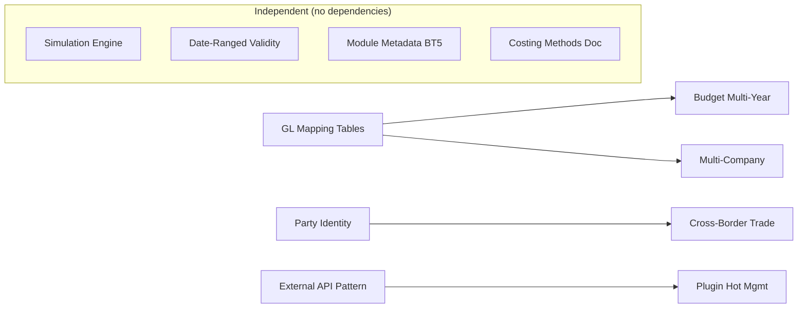

# Deepening Roadmap — Domain Enhancement & Architecture Hardening

> **最后更新**: 2026-07-20
> **来源**: `docs/analysis/erp-survey/2026-07-20-post-survey-strategic-gaps.md` — 对比 OFBiz/Wimoor/ERP5/NocoBase 后识别的应用层增强项
> **前置条件**: `core-business-roadmap.md` ✅ done, `extended-roadmap.md` ✅ done

## 1. 目的

本路线图覆盖 4 份对比报告（OFBiz/Wimoor/ERP5/NocoBase）识别出的**应用层深化与架构硬化**工作项，是对已完成的 CRUD + 核心业务 + 扩展业务 + 业财一体 + UI 完整性的后继增强。

核心原则：**不改变平台核心**。部分工作项涉及应用层 ORM 模型变更（新增实体/字段），已获人工授权，由 mission driver 在实施时自动拟制计划。

## 2. Work Item Status

| State | Count |
|-------|-------|
| todo | 8 |
| ready | 0 |
| done | 3 |

## 3. 框架/平台复用

以下能力由 Nop Platform 提供，不在本路线图范围内：

| 能力 | 提供方式 |
|------|----------|
| 事件队列/跨域编排 | `NopSysEvent` topic + partition + lease + `IMessageService` + I\*Biz + xbiz delta + Processor |
| 运行时字段扩展 | `JsonOrmComponent` / ext 字段模式 |
| 可视化工作流 | XWF 引擎 + XML 配置 |
| SaaS 多租户 | `tenant-model.md` `useTenant="true"` |
| 多数据源 | ORM driver 层 + GraphQL driver |
| 运行时字典管理 | `nop-dict` API 运行时覆盖/补充 |

## 4. 当前基线

| 域 | 已实现 | 待深化 |
|----|--------|--------|
| Finance | 3 层过账引擎、多账套、坏账 Allowance、汇兑损益、期间管理、预算基础 | GL 映射规则表（P1）、预算多年度/承付款（P2）、多公司运营深度（P2） |
| Manufacturing | MRP 单次确定性计算、APS 排程、SPC、NCR/CAPA | MRP/DRP 多场景仿真引擎（P1） |
| Master Data | Partner/Employee/Organization 分离实体 | 统一 Party 身份查询（P1）、跨境贸易字段（P2）、日期范围有效性模式（P2） |
| Cross-cutting | integration-pattern.md webhooks | 外部 API 集成参考模式（P1）✅、业务模块元数据 BT5 风格（P2）✅ |
| Inventory | 3 层模型 + 加权移动平均/FIFO/标准成本 | 成本计算子计算器注入模式文档化（P1） ✅ D3 done |
| Platform | Maven 模块编译期依赖 | 插件热管理可行性研究（P3） |

## 5. Milestones

### Milestone A: Finance Hardening

| Work Item | Status | Owner Doc | Dependencies | Platform Reuse |
|-----------|--------|-----------|--------------|----------------|
| A1: GL Mapping Rule Tables | done | `docs/design/finance/gl-mapping-rules.md` (**NEW**) | `posting.md` §科目映射 概念已定 | NopSysEvent? 可选作为规则变更事件 | **需要 `ErpFinGlMappingRule` 实体 ORM 变更** |
| A2: Budget Multi-Year / Carry-Forward | done | `docs/design/finance/budget.md` (**EXPAND**) | A1 (budget control uses GL) | existing budget.md foundation | **可能需要新 budget 实体/字段 ORM 变更** |
| A3: Multi-Company Operational Depth | done | `docs/architecture/multi-company.md` (**EXPAND**) | `intercompany-consolidation.md` | nop tenant-model, orgId dimension | **可能需要跨公司交易/合并实体 ORM 变更** |

### Milestone B: Manufacturing Intelligence

| Work Item | Status | Owner Doc | Dependencies | Platform Reuse |
|-----------|--------|-----------|--------------|----------------|
| B1: MRP/DRP Simulation Engine | todo | `docs/design/manufacturing/simulation-engine.md` (**NEW**) | `mrp.md` single-run computation | NopSysEvent for scenario eventing | **需要仿真场景/参数实体 ORM 变更** |

### Milestone C: Master Data & Identity

| Work Item | Status | Owner Doc | Dependencies | Platform Reuse |
|-----------|--------|-----------|--------------|----------------|
| C1: Unified Party Identity Query | done | `docs/design/master-data/unified-party-identity.md` (**NEW**) | `master-data/README.md` | 仅查询层，无需 ORM 变更 |
| C2: Cross-Border Trade Extensions | done | `docs/design/master-data/cross-border-trade.md` (**NEW**) | C1 (party identity) | **需要 ErpMdMaterial 加字段 + 新建 ErpMdMaterialCustoms 实体 ORM 变更** |
| C3: Date-Ranged Validity Pattern | done | `docs/design/date-ranged-validity-pattern.md` (**NEW**) | | Convention used in 6+ entities | 仅为模式文档，实施时可能涉及 ORM 字段追加 |

### Milestone D: Integration & Architecture

| Work Item | Status | Owner Doc | Dependencies | Platform Reuse |
|-----------|--------|-----------|--------------|----------------|
| D1: External API Integration Reference Pattern | done | `docs/architecture/external-api-integration-pattern.md` (**NEW**) | | GraphQL driver, xpl, IoC |
| D2: Business Module Metadata (BT5-style) | done | `docs/architecture/business-module-metadata.md` (**NEW**) | | module-meta.json generation pipeline |
| D3: Cost Calculation Sub-Calculator Injection | done | `docs/design/finance/costing-methods.md` (**EXPAND**) | | existing CostingStrategy hierarchy |
| D4: Plugin Hot Management Research | todo | `docs/analysis/plugin-hot-management-research.md` (**NEW**) | | P3 feasibility study |

## 6. Work Item Details

| Work Item | Deliverables | ORM 变更 |
|-----------|-------------|----------|
| A1 | `ErpFinGlMappingRule` entity schema, matching priority chain (exact→wildcard→default), operator UI concept, runtime evaluation engine | **是** — 新建 `ErpFinGlMappingRule` 实体 |
| A2 | Multi-year budget scenarios, carry-forward rules, commitment accounting (postingType=COMMITMENT), rolling budget auto-generation | **可能** — 可能需要扩展 budget 实体 |
| A3 | Cross-org transaction lifecycle, automated intercompany matching, transfer pricing (cost-plus/market/negotiated), consolidated reporting workflow | **可能** — 可能需要跨公司交易实体 |
| B1 | Scenario entity, parameter variation model (lead time/lot size/safety stock), result comparison views, DRP scenario counterpart | **是** — 需要仿真场景/版本实体 |
| C1 | Abstract Party concept, reverse-index or materialized view for cross-entity search, `IErpPartyBiz` query interface | 否 — 仅查询/视图层 |
| C2 | Extension fields on `ErpMdMaterial` (vatRate, drawbackRate, customsHS, countryOfOrigin), new `ErpMdMaterialCustoms` entity | **是** — `ErpMdMaterial` 加字段 + 新建 `ErpMdMaterialCustoms` |
| C3 | Canonical field names convention, query helpers (overlap/contains/effective-on-date), overlap validation rules | 实施时可能涉及 |
| D1 | Auth pattern reference (OAuth2/API Key/LWA), rate limiting strategy, API client lifecycle, reference implementation plan | 否 — 仅为参考文档 |
| D2 | module-meta.json convention with version + dependency list + optional features, runtime metadata reader | 否 — module-meta.json 变更 |
| D3 | Document the existing sub-calculator injection pattern (IProfitService-style) used in cost calculation | 否 — 仅为文档扩展 |
| D4 | Feasibility study: OSGi-style vs Maven module isolation vs NocoBase-style plugin manager on Nop Platform | 否 — 可行性研究 |

## 7. Dependencies

## 8. Cross-cutting Concerns

- **ORM 变更已授权**: 涉及 ORM 变更的工作项（A1/A2/A3/B1/C2），由 mission driver 在实施时自动拟制 ORM 变更计划并执行
- **Platform-first**: Every item must check if Nop Platform already provides the capability before designing
- **Delta-compatible**: New implementation code must follow existing patterns (xbiz delta, I\*Biz, Processor)

## 8.1 A1 落地证据（2026-07-21）

A1（GL Mapping Rule Tables）已落地，状态 `todo → done`：

- **Plan**：`docs/plans/2026-07-21-0827-1-finance-gl-mapping-rule-tables.md`（4 Phase 全 done，含 3 轮独立草案审查 + 1 轮执行验证）
- **Owner Doc**：`docs/design/finance/gl-mapping-rules.md`（7 节完整：目的与范围 / 实体字段表 / 优先级链算法 / 缓存策略 / Provider opt-in 集成契约 / Operator UI 交互 / 反模式自检表）
- **实体 + 字典**：`module-finance/model/app-erp-finance.orm.xml` 新增 `ErpFinGlMappingRule` 实体（22 字段 + UK + idx + tagSet audit）+ `erp-fin/account-key` 字典（22 键含试点 3 键 + BankReconAdj 4 字面量 + Template 4 字面量 + 11 扩展键）
- **解析引擎**：`IErpFinGlMappingResolver` 接口（erp-fin-dao）+ `ErpFinGlMappingResolver` 实现（erp-fin-service，进程内缓存 + 主动失效 + 维度扩展）
- **过账钩子**：`ErpFinPostingProcessor.resolveSubjects` 开头覆盖钩子 + `ERR_GL_MAPPING_NOT_FOUND` 错误码（strict-mode 配置门控）
- **试点 Provider**：`PurAcctDocProvider × AP_INVOICE × 3 键`（PURCHASE/INPUT_VAT/ACCOUNTS_PAYABLE）接入 + 既有 SUBJECT_* 保留 fallback
- **测试基线**：
  - `TestErpFinGlMappingResolver`（**NEW**）8 场景全绿（exact/partial/default/empty-null/specific-schema/priority-tie/material-expand/cache-invalidate）
  - `TestErpPurInvoicePosting`（既有扩展）3 测试全绿（2 既有行为不变 + 1 default 规则覆盖生效）
  - finance service 全 218 测试 + purchase service 全 113 测试全绿
  - 全 workspace `mvn install -DskipTests` BUILD SUCCESS（154 模块）
  - visual smoke `gl-mapping-rule.visual.spec.ts`（**NEW**）2 测试全绿（refresh-cache 按钮可见 + page metadata 可达）
- **Deferred successor**：其余 Provider 批量接入 + 多节点分布式缓存一致性 + GL Distribution + 模板驱动路径统一 + A2 预算多年度 + A3 多公司运营深度

## 8.2 C1 落地证据（2026-07-21）

C1（Unified Party Identity Query）已落地，状态 `todo → done`：

- **Plan**：`docs/plans/2026-07-21-0827-2-master-data-unified-party-identity-query.md`（3 Phase 全 done + 含 3 轮独立草案审查）
- **Owner Doc**：`docs/design/master-data/unified-party-identity.md`（**NEW**，8 节完整：目的与范围 / Party 抽象边界 / 查询策略 / IErpPartyBiz 接口契约 + 非实体 BizModel 接口暴露约定 / 联合 picker 范式 / 试点场景实施记录 / 性能与扩展 / 反模式自检表）
- **接口 + DTO + enum**（dao 模块，跨工程消费者经 erp-md-dao 依赖即可）：
  - `IErpPartyBiz`（`module-master-data/erp-md-dao/src/main/java/app/erp/md/biz/`，与 23 个 `IErpMd*Biz.java` 同包）— 3 方法 `findParties`/`getParty`/`findReferences`
  - `PartyRef` DTO（`app.erp.md.dao.dto` 包）— 9 字段（partyType/partyId/code/name/phone/email/status/displayName/extension Map）
  - `ErpPartyType` enum（同包）— 3 值 PARTNER/EMPLOYEE/ORGANIZATION
- **SPI 端口扩展**（Path A 严格同构既有 `IErpMdPartnerReferenceChecker`）：
  - `IErpMdEmployeeReferenceChecker`（**NEW**）— `Map<String, Long> countReferences(Long)` 无 IServiceContext
  - `IErpMdOrganizationReferenceChecker`（**NEW**）— 同上
- **BizModel 实现**：`ErpPartyBizModel`（service 模块，非实体 + `IErpPartyBiz` 接口实现）— IOrmTemplate + `IDaoProvider` 3 实体查询 + Java merge + 字段投影 + Organization phone/email=null 容忍 + `@Inject(required=false)` 3 SPI 单实例 nullable + `@BizQuery` GraphQL 暴露
- **错误码**：`ERP_MD_PARTY_NOT_FOUND`（`ErpMdErrors.java` 追加）
- **Bean 注册**：`app-service.beans.xml` 追加 `app.erp.md.service.party.ErpPartyBizModel` 注册（非实体 BizModel 必须显式注册，与 Dashboard 同模式）
- **联合 picker**（首例手写 picker.page.yaml）：`module-master-data/erp-md-web/src/main/resources/_vfs/erp/md/pages/party-search/main.picker.page.yaml` —— 与 `dashboard/main.page.yaml` 既有手写非实体 page.yaml 同构，AMIS `crud` + filterForm + onSelect 回填
- **F7 兼容路径**：`ErpMdPartnerBizModel.countReferences` 既有签名 + view.xml 不变；`IErpPartyBiz.findReferences(PARTNER, ...)` 新增扩展入口经同一 SPI 端口
- **测试基线**：
  - `TestErpPartyBiz`（**NEW**）8 场景全绿（跨 3 实体检索 / partyType 过滤 / keyword < 2 字符返回空 / limit 截断 / getParty 三类型 / PartyRef 字段投影 + Organization phone/email=null 容忍 / findReferences Partner 路径经 partnerCheckers 收集 + Employee/Organization SPI 未注册返回空 Map 不抛异常 / 空数据集返回空）
  - master-data service 全 60 测试全绿
  - 全 workspace `mvn clean install -DskipTests` BUILD SUCCESS（154 模块）
  - visual smoke `party-search-picker.visual.spec.ts`（**NEW**）3 测试全绿（findParties action 注册 + getParty null 容忍 + findReferences 空 Map）
- **Deferred successor**：Employee/Organization 引用扫描下游域 SPI 实现 + ErpMdUserAccount 接入统一 Party + 物化视图/反向索引 + Party 合并去重 + 全文索引 + C2 跨境贸易字段扩展 + 业务单据 FK 通用化

## 8.3 C2 落地证据（2026-07-21）

C2（Cross-Border Trade Extensions）已落地，状态 `todo → done`：

- **Plan**：`docs/plans/2026-07-21-1206-1-master-data-cross-border-trade-extensions.md`（4 Phase 全 done）
- **Owner Doc**：`docs/design/master-data/cross-border-trade.md`（**NEW**，8 节完整：目的与范围 / 物料层跨境字段表 / ErpMdMaterialCustoms 实体设计 / 报关场景工作流 / FTA 判定流程 / 与既有 owner doc 关系 / 反模式自检表 / 落地证据）
- **ORM 变更**：`module-master-data/model/app-erp-master-data.orm.xml`
  - `ErpMdMaterial` 增 9 字段（propId 26-34）：`vatRate` DECIMAL(6,4) / `drawbackRate` DECIMAL(6,4) / `customsHS` VARCHAR(12) / `countryOfOrigin` VARCHAR(2) ISO 3166-1 alpha-2 / `preferenceCode` VARCHAR(20) + 字典 / `customsNameCn` VARCHAR(200) / `customsNameEn` VARCHAR(200) / `declarationUnit` VARCHAR(20) / `supervisionCondition` VARCHAR(10)。全部 `mandatory="false"` + 默认 null，向后兼容
  - 新建 `ErpMdMaterialCustoms` 实体（24 字段 + UK declarationNo + 4 idx + 3 relations to-one）
  - 字典扩展：`erp-md/partner-type` 增 `CUSTOMS_BROKER`；新字典 `erp-md/customs-preference-code`（12 FTA 协定代码：ASEAN/CKFTA/CHAFTA/CCFTA/CNZFTA/CPFTA/COSTA_RICA/CIFTA/CHFTA/RCEP/GSP/OTHER）
- **Codegen 产物**：`_ErpMdMaterial.java` 含 9 新字段 + `_ErpMdMaterialCustoms.java` 全套（Entity + DAO + IBiz + BizModel + xmeta + xbiz + view.xml + page.yaml + i18n 中英文 + dict yaml + DaoConstants `PARTNER_TYPE_CUSTOMS_BROKER`）
- **view.xml 定制**：
  - `ErpMdMaterial.view.xml` form（view/edit）增「跨境贸易」F3 分组（9 字段）+ grid list 增 vatRate/drawbackRate/customsHS/countryOfOrigin 列
  - `ErpMdMaterialCustoms.view.xml` list grid bounded-merge 精选 16 列 + form F3 四段分组（baseInfo/crossBorderAmounts/sourceBill/audit）
  - `erp-md.action-auth.xml` 新增 `md-trade`（跨境贸易）分组 orderNo=750，含 `ErpMdMaterialCustoms-main` 菜单
- **BizModel 扩展**：`ErpMdMaterialCustomsBizModel` delta 文件（`@BizModel("ErpMdMaterialCustoms")`），3 个 `defaultPrepareSave`/`defaultPrepareUpdate` 钩子前置友好校验：
  - declarationNo 唯一性（DB UK 前置友好，避免 stack trace 暴露）—— 使用 `dao().findAllByQuery(query)` 绕过 objMeta filter `ne` 限制
  - partnerId Partner 类型校验（必须 `CUSTOMS_BROKER`，否则抛 `ERR_PARTNER_NOT_CUSTOMS_BROKER`）
  - sourceBillType/sourceBillCode 业务回链必填校验
- **错误码**（`ErpMdErrors.java`）：`ERP_MD_PARTNER_NOT_CUSTOMS_BROKER` / `ERP_MD_CUSTOMS_DECLARATION_NO_DUPLICATE` / `ERP_MD_CUSTOMS_SOURCE_BILL_REQUIRED`
- **owner doc 回链**：
  - `docs/architecture/tax-framework.md` 增「物料层跨境税快查（C2 跨境贸易扩展）」段（vatRate/drawbackRate 双轨设计 + 风险缓解 + 与 ErpMdMaterialCustoms.dutyAmount/vatAmount 关系）
  - `docs/architecture/l10n-strategy.md` 增「原产地与 FTA（C2 跨境贸易扩展）」段（countryOfOrigin + preferenceCode + FTA 判定流程概要 + 多账套/多公司隔离决策）
  - `docs/design/master-data/README.md` §核心业务对象 增 ErpMdMaterialCustoms 行 + §跨境贸易扩展段 + 本域文档表增 cross-border-trade.md
- **测试基线**：
  - `TestErpMdMaterialCustoms`（**NEW**）4 场景全绿（CRUD 生命周期 / partnerType=CUSTOMER 拒绝 / sourceBill 均空拒绝 / declarationNo 重复拒绝）
  - master-data service 全 64 测试全绿（60 既有 + 4 新增）
  - 全 workspace `mvn clean install -DskipTests` BUILD SUCCESS（154 模块）
  - visual smoke `material-customs.visual.spec.ts`（**NEW**）2 测试落地（ErpMdMaterial xmeta 9 跨境字段可达 + ErpMdMaterialCustoms findPage action 注册）；运行需启动 app
- **Deferred successor**：finance 关税/退税 Provider 接入（触发：跨境业务量 > 100 单/月 或 财务 owner doc 授权）/ b2b 海关 EDI 报文接入（触发：业务客户 EDI 报关需求）/ HS 编码字典全集（触发：业务方明确需求 + 第三方服务集成）/ ErpMdMaterialSku 跨境字段扩展（触发：同物料多 SKU 差异需求）/ 海关申报完整业务流程编排（触发：业务流程需求 + 跨域 owner doc 授权）/ 跨境报表实施（触发：业务客户报表需求 + report successor）/ 关税计算引擎（触发：含反倾销税/报复性关税的复杂税率计算需求）

## 8.4 A2 落地证据（2026-07-21）

A2（Budget Multi-Year / Carry-Forward / Commitment Accounting）已落地，状态 `todo → done`：

- **Plan**：`docs/plans/2026-07-21-1206-2-finance-budget-multi-year-carryforward.md`（4 Phase 全 done：Phase 0 Explore + Owner Doc EXPAND / Phase 1 ORM + 字典 + codegen / Phase 2 滚动复制 + 结转 + 承付 + SPI + 测试 / Phase 3 view.xml + owner doc 回链 + roadmap 同步）
- **Owner Doc**：`docs/design/finance/budget.md`（既有 109 行 → EXPAND 至 ~280 行，新增 6 段：§多年度视图（候选 C 裁决 + budgetGroupCode 字段语义 + 与 parentScenarioId 边界）/ §滚动预算自动复制引擎（3 策略算法 + periodId 重映射 + parentScenarioId 链关系）/ §结转规则引擎（4 规则算法 + 凭证落地 + status=CLOSED 状态扩展 + commitment 与结转）/ §承付会计（COMMITMENT Provider + 3 接入点 + reject release-receive-complete 理由 + SPI 契约）/ §承付占用/释放 SPI（commit/release 签名 + 与 check 协同）/ §版本审计链（RollforwardLog/CarryForwardLog 实体 + 多年度版本树语义）/ §反模式自检表扩展）
- **ORM 变更**：`module-finance/model/app-erp-finance.orm.xml`
  - `ErpFinBudgetScenario` 增 4 字段（propId 26-29）：`budgetGroupCode` VARCHAR(50) / `carryForwardRule` 字典 / `rollForwardStrategy` 字典 / `closedAt` TIMESTAMP。全部 `mandatory="false"` + 默认 null，向后兼容；新增 `IDX_FIN_BUDGET_SCENARIO_BUDGET_GROUP_CODE` 索引
  - 新建 `ErpFinBudgetRollforwardLog` 实体（18 字段 + 4 relations + 2 idx）
  - 新建 `ErpFinBudgetCarryForwardLog` 实体（18 字段 + 4 relations + 2 idx）
  - 字典扩展：`erp-fin/budget-status` 增 `CLOSED`；新字典 `erp-fin/budget-carry-forward-rule`（4 键：REMAINING_FULL/REMAINING_RATIO/USED_FULL/NONE）+ `erp-fin/budget-rollforward-strategy`（3 键：FIXED_PERCENTAGE/ZERO_BASED/INCREMENTAL）
- **Codegen 产物**：`_ErpFinBudgetScenario.java` 含 4 新字段 + `_ErpFinBudgetRollforwardLog.java` + `_ErpFinBudgetCarryForwardLog.java` 全套（Entity + DAO + IBiz + BizModel + xmeta + xbiz + view.xml + page.yaml + i18n 中英文 + dict yaml + DaoConstants）
- **承付（COMMITMENT）实际过账**（3 接入点严格对齐 budget.md:78）：
  - **commit hook**：`ErpPurOrderProcessor.approve` 后置 → `IErpFinBudgetCommitmentBiz.commit` → `CommitmentVoucherGenerator.generateCommitment` 生成 postingType=COMMITMENT 凭证
  - **release-on-cancel hook**：`ErpPurOrderProcessor.reverseApprove` / `cancel` → `IErpFinBudgetCommitmentBiz.release` → `CommitmentVoucherGenerator.reverseCommitment` 红冲
  - **release-on-invoice-approve hook**：`ErpPurInvoiceProcessor.approve` → 经 invoiceLine.receiveLineId → receive.orderId → order.code 反查 → `release` 红冲（reject release-receive-complete：ErpPurReceive 入库不产生 AP ACTUAL）
  - `CommitmentAcctDocProvider`（实现 `IErpFinAcctDocProvider`，与 BUDGET 同型不走 Provider 路由，文档化承付科目解析约定）
  - config-gated（`erp-fin.budget-commitment-enabled` 默认 false，保护既有 113 purchase 测试不触发承付凭证）
- **承付占用/释放 SPI**：`IErpFinBudgetCommitmentBiz`（finance-dao 跨层契约面）+ `ErpFinBudgetCommitmentBizModel`（finance-service 实现，与既有 `IErpFinBudgetControlBiz.check()` 同 SYNC 强一致范式）
- **滚动预算 + 结转引擎**：`ErpFinBudgetScenarioBizModel` delta 扩展（rollForward / carryForward mutations 委托 `ErpFinBudgetScenarioProcessor`），config-gated（`erp-fin.budget-roll-forward-enabled` / `erp-fin.budget-carry-forward-enabled` 默认 false）
- **错误码**（`ErpFinErrors.java`）：`ERP_FIN_BUDGET_SCENARIO_NOT_APPROVED` / `ERP_FIN_BUDGET_PERIOD_MISMATCH` / `ERP_FIN_BUDGET_COMMITMENT_ALREADY_RELEASED` / `ERP_FIN_BUDGET_CARRY_FORWARD_RULE_INVALID` / `ERP_FIN_BUDGET_COMMITMENT_SUBJECT_NOT_CONFIGURED`
- **owner doc 回链**：
  - `docs/design/finance/posting.md` 增「承付（COMMITMENT）实际过账（A2）」段（3 接入点表 + reject release-receive-complete 理由 + 与既有 IErpFinBudgetControlBiz 协同 + config-gated + CommitmentAcctDocProvider 定位 + 错误码）
  - `docs/design/finance/period-close.md` 增「预算结转与期间状态机（A2）」段（结转前置 CLOSED + status=CLOSED 终态 + 跨年度期间状态机协调 + commitment 不结转）
- **view.xml 定制**：
  - `ErpFinBudgetScenario.view.xml` form（view/edit）增「多年度/结转信息(A2)」F3 分组（4 字段：budgetGroupCode/closedAt/carryForwardRule/rollForwardStrategy）+ grid list 增 budgetGroupCode 列 + query form 增 budgetGroupCode 筛选
  - 2 mutation 按钮（rollForward 滚动复制 / carryForward 结转）+ 2 dialog（rollForwardDialog 收集 newFiscalYear + strategy / carryForwardDialog 收集 targetScenarioId + rule）
  - `erp-fin.action-auth.xml` 新增 `budget-rollforward-log` + `budget-carry-forward-log` 菜单到 `fin-budget` 分组（orderNo 10030/10040）
- **测试基线**：
  - `TestErpFinBudgetRollForward`（**NEW**）3 策略场景全绿（FIXED_PERCENTAGE 100% 复制 / ZERO_BASED 仅结构 / INCREMENTAL 5% 上调）
  - `TestErpFinBudgetCarryForward`（**NEW**）4 规则场景全绿（REMAINING_FULL=600 / REMAINING_RATIO 50%=300 / USED_FULL=400 / NONE=0）
  - `TestErpFinBudgetCommitment`（**NEW**）4 场景全绿（commit 生成 COMMITMENT 凭证 / release-on-cancel 红冲 / release-on-invoice-approve 红冲 / 重复 release 守卫）
  - `TestErpPurOrderCommitment`（**NEW**）3 集成场景全绿（approve 触发 commit / reverseApprove 触发 release / cancel 触发 release）
  - finance service 全 229 测试全绿（218 既有 + 11 新增）
  - purchase service 全 116 测试全绿（113 既有 + 3 新增）
  - 全 workspace `mvn clean install -DskipTests` BUILD SUCCESS（154 模块）
- **Deferred successor**：A3 多公司运营深度（跨公司预算结转/合并预算）/ A1 GL Mapping Rule 接入 BUDGET/COMMITMENT 多维规则 / 承付款业务场景全集（销售订单/付款单等其他场景）/ 预算物化快照表 / commitment 一并结转 / 预算对比报表多年度维度实施 / 跨币种预算结转汇率差异处理 / 预算冻结/解冻多级控制 / 预算编制工作流

## 8.5 D1 落地证据（2026-07-21）

D1（External API Integration Reference Pattern）已落地，状态 `todo → done`：

- **Plan**：`docs/plans/2026-07-21-1206-3-external-api-integration-reference-pattern.md`（3 Phase 全 done：Phase 0 Explore + Owner Doc NEW / Phase 1 参考实现 + 测试 / Phase 2 owner doc 回链 + roadmap 同步）
- **Owner Doc**：`docs/architecture/external-api-integration-pattern.md`（**NEW** ~300 行，11 大段：§1 目的与范围 / §2 平台能力边界（决策树 + 9 项平台能力清单 + 反模式表）/ §3 Auth Pattern 参考模式（OAuth2/API Key/LWA + `IErpExternalApiAuthProvider` 参考接口，非强制 SPI）/ §4 Rate Limiting（候选 4 方案权衡 + Nop `IRateLimiter` 默认裁决 + per-tenant/key 约定）/ §5 Endpoint 配置范式（候选 C 裁决：yaml + 运行时 dict）/ §6 API Client Lifecycle（4 阶段 + 重试幂等 + 事务边界引用 + 文档/代码漂移记录）/ §7 参考实现案例（logistics + b2b + master-data 三案例对比 + 范式选择矩阵）/ §8 Wimoor ApiBuildService 对照（可借鉴 vs 不借鉴）/ §9 反模式自检表 12 项 / §10 EXPAND-vs-NEW Decision 记录 / §11 与既有集成文档关系）
- **既有 owner doc 回链**（5 处段落新增）：
  - `docs/architecture/integration-pattern.md` 末尾增「通用外部 API 集成参考模式」交叉引用段 + 「文档/代码漂移记录」段（webhook 表 `ErpSysWebhookConfig`/`ErpSysWebhookLog` 未实体化如实记录）
  - `docs/architecture/b2b-integration.md` 末尾增「通用 API 集成参考（D1）」段（EDI Format 作为案例 B + 与 logistics 范式异构性说明）
  - `docs/architecture/integration-and-transaction-patterns.md` 增「API client 事务边界（D1）」段（本地优先 + afterCommit + 不阻塞 + 引用 external-api-integration-pattern.md §6）
  - `docs/architecture/idempotency-pattern.md` 增「API client 重试与幂等（D1）」段（可重试条件 + 指数退避 + 幂等键约定 + 缓存幂等）
  - `docs/design/master-data/exchange-rate-management.md` 增「自动汇率刷新（API 客户端，D1）」段（接入入口 + 5 配置项 + 行为约定 + 与 logistics/b2b 范式异构 + Deferred successor）
  - `docs/architecture/README.md` Initial Owner Docs 段追加 `external-api-integration-pattern.md` 介绍行
- **EXPAND-vs-NEW Decision**：选 **NEW**（与 roadmap §D1 line 73 + post-survey-strategic-gaps.md line 467/491 两份源文档标注一致）。理由：roadmap 显式标注 NEW；既有 integration-pattern.md 范围明确（webhook-only 43 行）EXPAND 会破坏主题边界；NEW 文档聚焦通用外部 API 集成独立主题；既有 integration-pattern.md 末尾增交叉引用段避免引用断链。**此 Decision 取代 plan 早期版本的 EXPAND 假设**。
- **参考实现（D1 §7.3 案例 C，无 ORM 变更）**：
  - SPI：`IErpMdExchangeRateApiClient`（dao 模块）— `Map<String, BigDecimal> fetchRates(base, targets, asOf)`，3 错误码（API_UNAVAILABLE / RATE_LIMITED / RESPONSE_INVALID）
  - Mock 实现：`MockExchangeRateApiClient`（service 模块）— 固定汇率表（USD/CNY/EUR 三基准）+ 测试钩子 stubRates
  - Factory：`ErpMdExchangeRateApiClientFactory`（service 模块）— config-gated + `IRateLimiter`（Nop 令牌桶）+ TTL 缓存（ConcurrentHashMap）+ provider 派发
  - BizModel：`ErpMdCurrencyBizModel.refreshRatesFromApi` `@BizMutation` 入口 + `IErpMdCurrencyBiz` 接口扩展
  - **关键修正**：(i) `@BizMutation` 注解需同时在 IBiz + BizModel 实现（仅 IBiz 注解不生效，BizObjectImpl.requireAction 报 object-not-support-action）；(ii) 同域不同实体写入经父类 `daoProvider().daoFor(...)` 方法（非自声 @Inject 字段，避免字段 shadowing 注入失败）
  - 配置：5 项 config-gated 默认关（`erp-md.exchange-rate-api-enabled/provider/key/rate-limit-rps/cache-ttl-secs`）
- **rate limiting 裁决修订**：从 plan 早期 Guava RateLimiter 建议改为 **Nop Platform `IRateLimiter`/`DefaultRateLimiter`**（platform-first 规则；grep 实测 `nop-commons` 已提供令牌桶限流器，无需引入 Guava 依赖；既有项目 0 rate limiting 使用，平台能力即可满足）。多节点 Redis-based 触发条件：生产部署多节点 + 限流不一致。
- **测试基线**：
  - `TestErpMdExchangeRateApiClient`（**NEW**）5 场景全绿（Mock 确定性数据 / rate limiting RATE_LIMITED 错误 / 缓存 TTL 复用 / refreshRatesFromApi 端到端写入 / config-gated 默认 false 抛 UNAVAILABLE）
  - master-data service 全 69 测试全绿（64 既有 + 5 新增）
- **D4 Plugin Hot Management Research 解锁说明**：D1 是 D4 的前置（per §7 mermaid edge `D1 --> D4`）；D1 完成后 D4 可启动（D4 是独立 P3 可行性研究项 — OSGi-style vs Maven module isolation vs NocoBase-style plugin manager）。D1 提供的 master-data 汇率查询 API 客户端 + logistics Carrier Gateway + b2b EDI Format 三案例作为 D4 插件边界评估的参考输入。
- **Deferred successor**：`ErpSysExternalSystem` 实体化（触发：多 API 配置场景 + ORM 授权）/ notify 域 Webhook 表实体化（触发：notify 域 webhook 业务需求）/ D4 Plugin Hot Management Research（触发：D1 完成 + 业务客户插件热管理需求）/ 多节点 Redis-based rate limiting（触发：生产部署多节点 + 限流不一致）/ OAuth2 完整通用实现 + `IErpExternalApiAuthProvider` 标准 SPI（触发：业务客户 OAuth2 接入 + 跨域统一 auth 需求）/ 第三方 API SDK 自动生成（触发：业务客户明确需求 + 工具链选型）/ API gateway 反向代理集成（触发：生产部署架构演进）/ API 监控/可观测性完整方案（触发：生产监控需求）/ API 安全审计（触发：合规审计需求 + security owner doc 授权）/ 跨境数据合规（触发：跨国集团业务 + 数据合规审计）/ 真实 provider 接入（exchangerate.host / 銀企直连）（触发：业务客户接入需求）。

## 8.6 C3 落地证据（2026-07-21）

C3（Date-Ranged Validity Pattern）已落地，状态 `todo → done`：

- **Plan**：`docs/plans/2026-07-21-2225-1-date-ranged-validity-pattern.md`（4 Phase 全 done：Phase 1 Explore + Owner Doc NEW + 4 Decisions / Phase 2 helper + 校验器 + 单测 / Phase 3 3 试点接入 + 集成测试 + owner doc 回链 / Phase 4 roadmap 同步 + 全仓库验证）
- **Owner Doc**：`docs/design/date-ranged-validity-pattern.md`（**NEW** ~260 行，10 节完整：目的与范围 / Decision A 规范字段命名 + Decision B 迁移策略 / 区间查询语义（边界含否约定 + 4 原语定义）/ Decision C 重叠策略分类矩阵 / Decision D helper 实现位置契约 / 重叠校验规则 + 错误码约定 / 试点实施记录 / 反模式自检表 10 项 / 与既有 owner doc 关系 / Follow-up 17 实体清单）
- **4 Decisions 裁决**：
  - **Decision A**：`validFrom/validTo` 为规范（4 核心域 12 实体已用，数量占优 + 与 `active-status` 字典同义链）；新实体强制采用，历史 `effectiveFrom/effectiveTo` 不重命名
  - **Decision B**：不重命名既有非规范字段（高风险数据迁移 ≈ 0 业务价值）；helper 内部归一化历史命名
  - **Decision C**：3 类语义分类 — MUTEX（同维度至多 1 条有效）/ PRIORITY（允许重叠按 priority 取首）/ STACKABLE（多条并行叠加）；3 试点均属 MUTEX
  - **Decision D**：helper 位于 `erp-md-service/daterange/`（跨域经 `app-erp-master-data-service` 依赖可达）；纯 Java 静态工具类（无 IoC 依赖，跨域 service 已传递依赖）
- **可复用组件**（无 ORM 变更，纯 Java 新增）：
  - `IDateRange` 接口（`erp-md-dao/daterange/`，与 ORM 实体同层以便直接 implements）— 2 getter 归一化 `validFrom/validTo` 与 `effectiveFrom/effectiveTo` 历史变体
  - `ErpDateRanges` 纯函数工具类（`erp-md-service/daterange/`）— 4 原语：`contains(range, date)` 含 `java.util.Date` 重载适配 TIMESTAMP 变体 / `overlaps(r1, r2)` / `effectiveOn(ranges, date)` / `longestOverlap(ranges)`（sweep line 算法）
  - `ErpDateRangeOverlapValidator` 互斥校验器（同包）— `enforceMutex(candidate, existing, errorCode, selfId)` 含 selfId 排除 + 永久无区间跳过
- **错误码**：`ERR_MD_DATE_RANGE_OVERLAP`（`erp.err.md.date-range.overlap`，参数 `entityName/validFrom/validTo/conflictId`，ARG_* 常量集中于 Validator 跨域复用）
- **3 试点实体接入**（均在 master-data 域，无跨域 service 测试扩散）：
  - `ErpMdExchangeRate`（维度 = fromCurrencyId + toCurrencyId + rateType）— `ErpMdExchangeRateBizModel` 增 `defaultPrepareSave/Update` 钩子 + `enforceNoOverlap` 方法
  - `ErpMdTaxRate`（维度 = taxType）— `ErpMdTaxRateBizModel` 同范式
  - `ErpMdSupplierApproval`（维度 = partnerId，status != REJECTED 时）— `ErpMdSupplierApprovalBizModel` 同范式 + 内存过滤 REJECTED 记录
  - 3 实体均原生使用规范字段 `validFrom/validTo`，直接 `implements IDateRange`，无 ORM 字段追加（Decision B 规避授权门控）
  - **关键发现**：`CrudBizModel.updateEntity()` 不触发 `defaultPrepareUpdate`（仅 GraphQL `__save`/`__update` Map 入口走 EntityData 管道才触发）；故 `ErpMdSupplierApprovalBizModel` 6 态状态机内部 `updateEntity` 调用不受 overlap 钩子干扰，仅用户经标准 CRUD API 创建/更新时校验
- **owner doc 回链**：
  - `docs/design/master-data/README.md` 增「日期范围有效性（C3）」段（规范字段命名 + 3 试点 MUTEX 策略 + helper 路径 + 错误码 + follow-up 引用）+ 本域文档表增 `../date-ranged-validity-pattern.md` 行
  - `docs/design/master-data/exchange-rate-management.md` 增「区间互斥（C3）」行为约定条
  - `docs/design/human-resource/README.md` 增「日期范围有效性（C3 交叉引用）」段（hr 历史 `effectiveFrom/effectiveTo` 命名变体不重命名 + 接入触发条件）
- **测试基线**：
  - `TestErpDateRanges`（**NEW**，纯函数单测）29 场景全绿（contains 闭区间/开放侧/双 null/util.Date 重载 + overlaps 相同端点/相邻日/完全包含/部分交叉/NULL 无穷 + effectiveOn 过滤/空集合 + longestOverlap 单条/三段不重叠/三重叠/相邻日/同日）
  - `TestErpMdDateRangePilots`（**NEW**，集成测试经 GraphQL RPC）10 场景全绿（3 试点 × 正路径不重叠通过 + 负路径重叠拒绝 + 边界相邻日通过 + ErpMdExchangeRate 不同 rateType 通过 + ErpMdExchangeRate 更新自身排除 + ErpMdSupplierApproval REJECTED 不占区间 + ErpMdTaxRate 不同 taxType 通过）
  - master-data service 全 108 测试全绿（98 既有 + 10 新增 pilot 集成测试）
  - 全 workspace `mvn clean install -DskipTests` BUILD SUCCESS（154 模块）
  - 下游依赖模块（purchase/sales/finance service）`mvn test` 全绿无回归
- **Deferred successor**：全量实体应用（17 个 follow-up 实体清单见 owner doc §10）/ PRIORITY 策略运行时取值 helper（`pickHighestPriority`，触发：sales `ErpSalPriceList` 接入）/ STACKABLE 策略叠加计算 helper（触发：sales `ErpSalPricingRule` 接入）/ 物化视图/反向索引按日期查询（触发：单实体有效记录数 > 10K 且 effectiveOn 查询 P95 > 200ms）/ helper 下沉到独立 `erp-common-dao` 模块（触发：跨域接入数 > 3，aps 域当前不依赖 md-service）

## 8.7 D3 落地证据（2026-07-21）

D3（Cost Calculation Sub-Calculator Injection）已落地，状态 `todo → done`：

- **Plan**：`docs/plans/2026-07-21-2225-2-costing-sub-calculator-injection-doc.md`（2 Phase 全 done：Phase 1 代码核对 + 章节骨架 + Decision E 同型分类裁决；Phase 2 7 小节正文 + roadmap 同步）。含 2 轮独立草案审查（iteration 1 needs-revision → iteration 2 acceptable-as-is）
- **Owner Doc**：`docs/design/finance/costing-methods.md`（**EXPAND**，既有 566 行 → 追加 §子计算器注入模式（D3）新章节，7 小节完整：模式定义 / 结构组成 / 何时使用此模式 / 如何新增一个策略 / 同型与异型分类裁决（Decision E）/ 反模式自检表 / 落地证据）。既有 8 节正文与各 plan 实现注记不动，仅追加新章节保持向后兼容
- **Decision E 同型分类裁决**（Phase 1 落盘，含代码行号证据）：
  - **同型实例（2 个）**：`CostingStrategy`（inventory）+ `IErpFinAcctDocProvider`（finance）—— 相同形状不同分派键（String `costMethod` vs enum Set `businessType`），均满足「接口 + 多实现 + 自描述键 + registry + O(1) 分派」五要素
  - **反模式实例（1 个）**：`CostAdjustmentService`（inventory，320 行）—— 内联 `if/Objects.equals` 链分派（`:108`/`:132`/`:189`/`:301`），应重构为 Strategy+registry。触发条件：业务方新增第 3 种 adjustType
  - **非分派 helper（1 个）**：`CostRollupService`（manufacturing，379 行）—— 单一递归 BOM 聚合服务，无分派键、无接口/多实现拆分；`if/equals`（`:219`/`:222`）仅是 overhead mode 内部选择，**不是**分派模式。文档化目的：防止后续维护者误分类
- **反模式自检表**（6 项，超过 plan 退出条件 ≥5 项）：AP-01 禁止手写 if/switch 分派（含 `CostAdjustmentService` 反例）/ AP-02 禁止策略内直接写库 / AP-03 禁止绕过 resolver / AP-04 漏改 isSupported 静默失败 / AP-05 必补单测 / AP-06 勿把聚合 helper 误分类为分派模式（含 `CostRollupService` 反例）
- **新增策略步骤清单**（7 步）：实现接口 → 声明常量 → 字典扩码值 → Bean 注册 + 注入器 `@Inject`+`initRegistry` → resolver `isSupported` 识别 → 测试范式（7 类 costMethod 各一）→ 跨域解析验证（如适用）
- **代码核对基线**（Phase 1 完成，Phase 2 复核一致）：
  - 接口签名：`CostingStrategy.java:18`（38 行，3 方法）
  - 策略清单：7 类 costMethod（常量值见 `ErpInvConstants.java:59-65`；7 独立测试类见 §4 表）
  - 注入器/分派器：`StockMoveBookkeeper.java:56-128`（`@Inject` 7 策略 + CostMethodResolver + `Map<String, CostingStrategy> strategyByMethod` registry）
  - Resolver 解析链：`CostMethodResolver.java:22-85`（3 级解析 + 7 码值白名单 + costing-enabled 总开关兜底）
  - Context：`BookingContext.java:20-52`（6 方法，由 `StockMoveBookkeeper implements`）
- **纯文档无测试基线**：D3 不引入新代码（roadmap §6 明确 `D3 ORM 变更 = 否`），无新单测/E2E/visual smoke。Phase 1/2 验证 = `mvn clean install -DskipTests` BUILD SUCCESS（154 模块）保证既有代码无回归
- **Deferred successor**：未完工策略实现（BATCH full / INDIVIDUAL full / LIFO full / WEIGHTED_AVERAGE full 月末结账，本节 §4 提供新增路径）/ `CostAdjustmentService` 反模式重构（触发：业务方新增第 3 种 adjustType）/ 同型模式推广到其他「多算法 + 数据驱动 + 统一输出」场景（触发：≥3 算法 + config 选择的具体需求）

## 9. Rules

1. Follow `00-roadmap-authoring-guide.md` for status tracking
2. Each work item requires an independent closure audit before `todo → done`
3. Work items that discover new platform capabilities should update the Platform Reuse section
4. 涉及 ORM 变更的工作项，mission driver 在实施时自动起草含 ORM 变更的计划并执行

## 8.8 D2 落地证据（2026-07-22）

D2（Business Module Metadata BT5-style）已落地，状态 `todo → done`：

- **Plan**：`docs/plans/2026-07-21-2225-3-business-module-metadata-bt5.md`（3 Phase 全 done：Phase 1 owner doc NEW + 4 Decisions / Phase 2 gen-meta.xgen 扩展 + 运行时读取器 + 单测 + purchase 试点 / Phase 3 全 19 域应用 + owner doc 回链 + roadmap 同步）。含 2 轮独立草案审查（iteration 1 needs-revision → iteration 2 acceptable-as-is）
- **Owner Doc**：`docs/architecture/business-module-metadata.md`（**NEW** ~200 行，8 节完整：目的与范围 + Maven POM/平台 module-meta.json 边界 / Schema 字段表（Decision A）+ 版本号约定（Decision B）/ 生成管线扩展（Decision C，meta 模块 `precompile/module-meta.yaml` 手写源 + `gen-meta.xgen` overlay 不触 ORM）/ 运行时读取器契约（Decision D，app-erp-all 归属）/ ERP5 BT5 对照 / D4 关系（信息输入非硬依赖，D4 仅由 D1 解锁）/ 反模式自检表 8 项 / 落地证据）
- **4 Decisions 裁决**：
  - **A schema 字段集** = 候选 (a) 三 optional 字段（version + businessDependencies + optionalFeatures），否决 minPlatformVersion（Maven 已表达）与更粗二字段（config-gated 特性散布需统一清单）
  - **B 版本号约定** = 候选 (a) SemVer 独立于 `ext:mavenVersion`，技术版本与业务版本解耦，不触碰既有 13 个 ext: 属性
  - **C 生成管线扩展点** = 候选 (a) meta 模块手写 `module-meta.yaml`，否决 ORM 根 ext: 新属性（D2 不在 §8 ORM 授权清单 + AGENTS.md 硬停止 + roadmap「仅 module-meta.json 变更」），残留风险 = yaml moduleId 一致性由 gen-meta.xgen 校验
  - **D 读取器归属** = 候选 (a) `app-erp-all`，否决新建 module-sys（增构建复杂度）与平台层（应用数据不下沉）
- **生成管线扩展**：全 19 个 `erp-*-meta/precompile/gen-meta.xgen` 在 `renderModel` 后叠加 overlay 段（`JsonTool.parseYaml` 解析手写 yaml → moduleId 一致性校验 `IllegalArgumentException` → 合并 3 字段回写）。**不触 ORM 源模型**。向后兼容验证：yaml 缺失模块生成结果与现状一致（仅 4 既有字段）
- **运行时读取器**（`app-erp-all` 新增模块 `app/all`）：
  - `ModuleMetaReader`（POJO，经 `ModuleManager` + `VirtualFileSystem` 扫描）：`listModules`/`getModule`/`checkDependencyIntegrity`（存在性 + 精确版本匹配，不做 SemVer 范围求解）/`listOptionalFeatures`
  - `ErpModuleMetaBizModel`（`@BizQuery` 诊断端点）+ `ErpModuleMetaErrors`（`erp.err.module-meta.dependency-missing` / `version-mismatch`，供硬失败场景）
  - `ModuleMetaBean`/`DependencyIntegrityResult` DTO
- **19 yaml 源应用**：全 19 域 `precompile/module-meta.yaml` 手写源（version=1.0.0 + businessDependencies 按真实跨域 Maven 依赖 + optionalFeatures 从 `Erp*Constants.java` `*_ENABLED` 镜像）。省略 businessDependencies：master-data（DAG 根）、notify（跨域基础设施）。省略 optionalFeatures：aps/logistics/b2b（无 config-gated 特性）
- **测试基线**：
  - `TestModuleMetaReader`（**NEW**，7 场景全绿）：多模块扫描（19 erp 域 + version 全声明）/ 依赖完整性正路径 / 缺失依赖负路径 / 版本不匹配负路径 / 特性清单查询 / 向后兼容（DAG 根省略 businessDependencies）/ 跨域依赖矩阵抽样（finance/manufacturing/maintenance 与 §4.1 DAG 一致）
  - 全 workspace `mvn clean install -DskipTests` BUILD SUCCESS（codegen 管线扩展 + 19 yaml 源 + app-erp-all 新模块不破坏既有 154 模块基线）
  - 19 个 `_module-meta.json` 全 well-formed（`python -m json.tool` 校验）且含 version 字段
- **Deferred successor**：版本范围求解器（SemVer range resolution，触发：模块业务版本数 > 3 + 不兼容升级场景）/ SaaS 多租户版本管理编排（触发：SaaS 多租户部署 + tenant-model 集成授权）/ D4 插件热管理研究（D2 提供元数据信息输入；D4 仅由 D1 解锁，见 §7 mermaid `D1 --> D4`）

## 8.9 A3 落地证据（2026-07-22）

A3（Multi-Company Operational Depth）已落地，状态 `todo → done`：

- **Plan**：`docs/plans/2026-07-22-1000-1-finance-multi-company-operational-depth.md`（5 Phase 全 done：Phase 0 Explore + Owner Doc EXPAND + 4 Decisions / Phase 1 ORM 实体 + 字典 + codegen / Phase 2 转移定价引擎 + 跨公司凭证生成 / Phase 3 公司间配对 + 合并抵消候选识别 / Phase 4 view.xml + owner doc 回链 + roadmap 同步）
- **Owner Doc**：`docs/architecture/multi-company.md`（既有 52 行 → EXPAND 至 ~200 行，含 6 可执行语义段：跨公司交易生命周期状态机 / 转移定价规则模型 / 公司间自动配对算法 / 合并抵消范围与 successor / 与 Posting+GL Mapping 关系 / 反模式自检表 7 项 + 4 Decision 记录 + EXPAND subsumes intercompany-consolidation.md 说明）
- **ORM 变更**：`module-finance/model/app-erp-finance.orm.xml`
  - 新建 `ErpFinIntercompanyTransferPrice` 实体（22 字段 + 5 to-one relation + 2 idx）：转移定价规则表（fromOrgId/toOrgId/materialId/materialCategoryId + pricingMethod 三策略 + markupRate/fixedPrice/marketRefSource + validFrom/validTo C3 MUTEX 语义）
  - 新建 `ErpFinIntercompanyMatch` 实体（20 字段 + 7 relation + 2 idx）：公司间配对记录（pairKey + arSideVoucherId/arOrgId + apSideVoucherId/apOrgId + matchedAmount/diffAmount + status）
  - 新建 `ErpFinConsolidationElimination` 实体（19 字段 + 6 relation + 2 idx）：合并抵消候选（eliminationType 3 类 + periodId/pairKey/matchId + eliminationAmount + draftVoucherId + status 3 态）
  - 字典扩展：`erp-fin/account-key` 增 4 INTERCOMPANY_* 键；新字典 `erp-fin/transfer-pricing-method`（3 键）+ `erp-fin/intercompany-match-status`（3 键）+ `erp-fin/elimination-type`（3 键）+ `erp-fin/elimination-status`（3 键）
- **转移定价引擎**：`IErpFinTransferPriceResolver` 接口（erp-fin-dao）+ `ErpFinTransferPriceResolver` 实现（erp-fin-service，3 策略 COST_PLUS/MARKET/NEGOTIATED + 精确→materialCategoryId 回落→全通配 default 优先级链 + 进程内缓存 + 主动失效）
- **跨公司凭证生成**（对齐 A2 CommitmentVoucherGenerator 同型，不走 Provider 路由）：
  - `IErpFinIntercompanyTransferBiz` SPI（finance-dao 跨域契约面）+ `ErpFinIntercompanyTransferBizModel` 实现（finance-service）
  - 跨法人判定 = warehouse.orgId 沿 parentId 链向上找首个 orgType=COMPANY（带环检测）
  - `IntercompanyVoucherGenerator` 生成配对凭证（AR 侧 INTERCOMPANY_SALE + AP 侧 INTERCOMPANY_PURCHASE，各 2 行 Dr/Cr）
  - `IntercompanyAcctDocProvider` 文档化约定（getSupportedBusinessTypes 返回空集，与 BUDGET/COMMITMENT 同型）
  - config-gated（`erp-fin.intercompany-posting-enabled` 默认 false，保护既有 inventory 测试零回归）
- **调拨触发钩子**：`ErpInvTransferOrderBizModel.confirm` 后置 try-catch 调 finance SPI（不阻塞库存确认，凭证失败兜底）
- **GL Mapping intercompany 维度**：`GlMappingDimensions` DTO 增 fromOrgId/toOrgId 2 维（expandDimensions 透传）；4 INTERCOMPANY_* accountKey 经 A1 GlMappingResolver 解析科目（解除 A1 Deferred「intercompany 维度规则」）
- **公司间自动配对**：`IErpFinIntercompanyMatchBiz` + `ErpFinIntercompanyMatchBizModel`：`runMatching(periodId)` 经 ErpFinVoucherBillR.billCode 配对 SALE/PURCHASE 凭证 → MATCHED/DIFF；`checkDualSideConsistency` 复用 DualSideDiffReport 结构
- **合并抵消候选识别**：`IErpFinConsolidationEliminationBiz` + BizModel：`generateEliminationCandidates(periodId)` 扫描 3 类（AR_AP + REVENUE_COST 常态 + INVENTORY_PROFIT config-gated 试点）→ CANDIDATE；`postElimination(candidateId)` 生成 DRAFT_VOUCHER 草稿凭证（人工审核后过账）
- **错误码**（`ErpFinErrors.java`）：`ERP_FIN_TRANSFER_PRICE_NOT_FOUND` / `ERP_FIN_INTERCOMPANY_SAME_LEGAL_ENTITY` / `ERP_FIN_TRANSFER_PRICE_PERIOD_INVALID` / `ERP_FIN_INTERCOMPANY_MATCH_PERIOD_CLOSED` / `ERP_FIN_ELIMINATION_ALREADY_POSTED` / `ERP_FIN_ELIMINATION_NO_CANDIDATES`
- **view.xml 定制**：3 新实体 list grid bounded-merge 精选列 + form 分组；`erp-fin.action-auth.xml` 新增 `fin-intercompany`（公司间）菜单分组 orderNo=550，含 3 实体菜单
- **owner doc 回链**：
  - `docs/design/finance/posting.md` 增「跨法人内部交易凭证（A3）」段（凭证生成路径表 + config-gated + IntercompanyAcctDocProvider 定位）
  - `docs/design/finance/gl-mapping-rules.md` 增「intercompany 维度接入（A3）」段（GlMappingDimensions 扩展 + 4 accountKey 表 + 消费路径）
  - `docs/architecture/integration-and-transaction-patterns.md` 增「跨公司事务边界（A3）」段（config-gated + 不阻塞库存 + SYNC 同事务 + 抵消草稿不过账）
  - `docs/design/master-data/README.md` 增「组织类型与集团语义（A3）」段（orgType GROUP/COMPANY + 法人根判定）
- **测试基线**：
  - `TestErpFinTransferPriceResolver`（**NEW**）7 场景全绿（COST_PLUS 110 / NEGOTIATED 250 / MARKET 300 / wildcard default 180 / no-match null / cache invalidate / validity period 过滤）
  - `TestErpFinIntercompanyTransfer`（**NEW**）2 场景全绿（跨法人产 2 配对凭证 + 同法人零凭证）
  - `TestErpFinIntercompanyMatchingAndElimination`（**NEW**）5 场景全绿（MATCHED 配对 / DIFF=200 差额 / checkDualSideConsistency 非空报告 / AR_AP+REVENUE_COST 两类候选 / postElimination DRAFT 凭证 + 状态翻转 DRAFT_VOUCHER）
  - finance service 全 243 测试全绿（229 既有 + 14 新增，无回归）
  - inventory service 全 114 测试全绿（ErpInvTransferOrderBizModel.confirm 钩子 config-gated 默认 false 保护既有测试）
- **Deferred successor**：实时合并报表渲染（触发：业务客户合并报表需求 + report successor）/ 跨币种合并折算（触发：跨国集团多币种合并 + treasury owner doc）/ 集团预算合并/跨公司预算结转（A2 Deferred successor）/ 内部存货利润抵消自动化（触发：内部存货周转频次高 + 未实现利润核算需求）/ MARKET 策略真实市场价接入（触发：市场价数据源集成需求）/ 多账套精确解析（当前默认账套=1，触发：多账套 intercompany 科目差异化需求）/ 抵消科目经 GlMappingResolver 精确解析（当前默认编码兜底，触发：多维抵消科目差异化需求）/ 跨公司交易完整生命周期状态机（当前仅 confirm 触发，触发：跨公司采购/销售单据直接交易需求）
