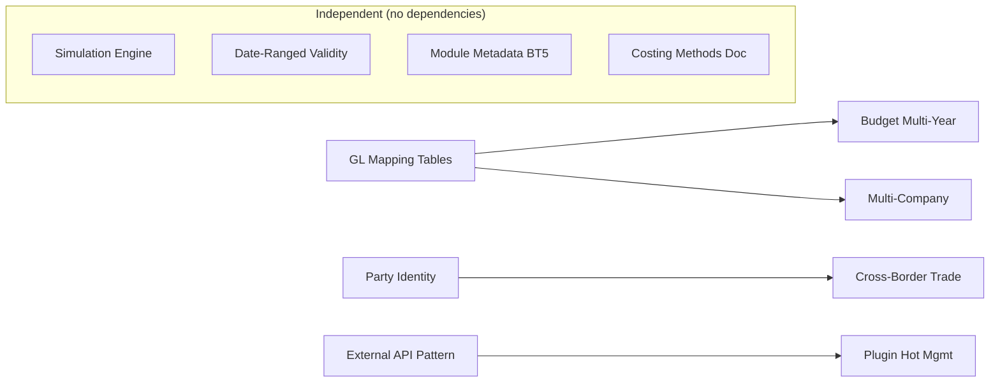

# Deepening Roadmap — Domain Enhancement & Architecture Hardening

> **最后更新**: 2026-07-20
> **来源**: `docs/analysis/erp-survey/2026-07-20-post-survey-strategic-gaps.md` — 对比 OFBiz/Wimoor/ERP5/NocoBase 后识别的应用层增强项
> **前置条件**: `core-business-roadmap.md` ✅ done, `extended-roadmap.md` ✅ done

## 1. 目的

本路线图覆盖 4 份对比报告（OFBiz/Wimoor/ERP5/NocoBase）识别出的**应用层深化与架构硬化**工作项，是对已完成的 CRUD + 核心业务 + 扩展业务 + 业财一体 + UI 完整性的后继增强。

核心原则：**不改变平台核心**。部分工作项涉及应用层 ORM 模型变更（新增实体/字段），已获人工授权，由 mission driver 在实施时自动拟制计划。

## 2. Work Item Status

| State | Count |
|-------|-------|
| todo | 11 |
| ready | 0 |
| done | 0 |

## 3. 框架/平台复用

以下能力由 Nop Platform 提供，不在本路线图范围内：

| 能力 | 提供方式 |
|------|----------|
| 事件队列/跨域编排 | `NopSysEvent` topic + partition + lease + `IMessageService` + I\*Biz + xbiz delta + Processor |
| 运行时字段扩展 | `JsonOrmComponent` / ext 字段模式 |
| 可视化工作流 | XWF 引擎 + XML 配置 |
| SaaS 多租户 | `tenant-model.md` `useTenant="true"` |
| 多数据源 | ORM driver 层 + GraphQL driver |
| 运行时字典管理 | `nop-dict` API 运行时覆盖/补充 |

## 4. 当前基线

| 域 | 已实现 | 待深化 |
|----|--------|--------|
| Finance | 3 层过账引擎、多账套、坏账 Allowance、汇兑损益、期间管理、预算基础 | GL 映射规则表（P1）、预算多年度/承付款（P2）、多公司运营深度（P2） |
| Manufacturing | MRP 单次确定性计算、APS 排程、SPC、NCR/CAPA | MRP/DRP 多场景仿真引擎（P1） |
| Master Data | Partner/Employee/Organization 分离实体 | 统一 Party 身份查询（P1）、跨境贸易字段（P2）、日期范围有效性模式（P2） |
| Cross-cutting | integration-pattern.md webhooks | 外部 API 集成参考模式（P1）、业务模块元数据 BT5 风格（P2） |
| Inventory | 3 层模型 + 加权移动平均/FIFO/标准成本 | 成本计算子计算器注入模式文档化（P1） |
| Platform | Maven 模块编译期依赖 | 插件热管理可行性研究（P3） |

## 5. Milestones

### Milestone A: Finance Hardening

| Work Item | Status | Owner Doc | Dependencies | Platform Reuse |
|-----------|--------|-----------|--------------|----------------|
| A1: GL Mapping Rule Tables | done | `docs/design/finance/gl-mapping-rules.md` (**NEW**) | `posting.md` §科目映射 概念已定 | NopSysEvent? 可选作为规则变更事件 | **需要 `ErpFinGlMappingRule` 实体 ORM 变更** |
| A2: Budget Multi-Year / Carry-Forward | todo | `docs/design/finance/budget.md` (**EXPAND**) | A1 (budget control uses GL) | existing budget.md foundation | **可能需要新 budget 实体/字段 ORM 变更** |
| A3: Multi-Company Operational Depth | todo | `docs/architecture/multi-company.md` (**EXPAND**) | `intercompany-consolidation.md` | nop tenant-model, orgId dimension | **可能需要跨公司交易/合并实体 ORM 变更** |

### Milestone B: Manufacturing Intelligence

| Work Item | Status | Owner Doc | Dependencies | Platform Reuse |
|-----------|--------|-----------|--------------|----------------|
| B1: MRP/DRP Simulation Engine | todo | `docs/design/manufacturing/simulation-engine.md` (**NEW**) | `mrp.md` single-run computation | NopSysEvent for scenario eventing | **需要仿真场景/参数实体 ORM 变更** |

### Milestone C: Master Data & Identity

| Work Item | Status | Owner Doc | Dependencies | Platform Reuse |
|-----------|--------|-----------|--------------|----------------|
| C1: Unified Party Identity Query | done | `docs/design/master-data/unified-party-identity.md` (**NEW**) | `master-data/README.md` | 仅查询层，无需 ORM 变更 |
| C2: Cross-Border Trade Extensions | todo | `docs/design/master-data/cross-border-trade.md` (**NEW**) | C1 (party identity) | **需要 ErpMdMaterial 加字段 + 新建 ErpMdMaterialCustoms 实体 ORM 变更** |
| C3: Date-Ranged Validity Pattern | todo | `docs/design/date-ranged-validity-pattern.md` (**NEW**) | | Convention used in 6+ entities | 仅为模式文档，实施时可能涉及 ORM 字段追加 |

### Milestone D: Integration & Architecture

| Work Item | Status | Owner Doc | Dependencies | Platform Reuse |
|-----------|--------|-----------|--------------|----------------|
| D1: External API Integration Reference Pattern | todo | `docs/architecture/external-api-integration-pattern.md` (**NEW**) | | GraphQL driver, xpl, IoC |
| D2: Business Module Metadata (BT5-style) | todo | `docs/architecture/business-module-metadata.md` (**NEW**) | | module-meta.json generation pipeline |
| D3: Cost Calculation Sub-Calculator Injection | todo | `docs/design/finance/costing-methods.md` (**EXPAND**) | | existing CostingStrategy hierarchy |
| D4: Plugin Hot Management Research | todo | `docs/analysis/plugin-hot-management-research.md` (**NEW**) | | P3 feasibility study |

## 6. Work Item Details

| Work Item | Deliverables | ORM 变更 |
|-----------|-------------|----------|
| A1 | `ErpFinGlMappingRule` entity schema, matching priority chain (exact→wildcard→default), operator UI concept, runtime evaluation engine | **是** — 新建 `ErpFinGlMappingRule` 实体 |
| A2 | Multi-year budget scenarios, carry-forward rules, commitment accounting (postingType=COMMITMENT), rolling budget auto-generation | **可能** — 可能需要扩展 budget 实体 |
| A3 | Cross-org transaction lifecycle, automated intercompany matching, transfer pricing (cost-plus/market/negotiated), consolidated reporting workflow | **可能** — 可能需要跨公司交易实体 |
| B1 | Scenario entity, parameter variation model (lead time/lot size/safety stock), result comparison views, DRP scenario counterpart | **是** — 需要仿真场景/版本实体 |
| C1 | Abstract Party concept, reverse-index or materialized view for cross-entity search, `IErpPartyBiz` query interface | 否 — 仅查询/视图层 |
| C2 | Extension fields on `ErpMdMaterial` (vatRate, drawbackRate, customsHS, countryOfOrigin), new `ErpMdMaterialCustoms` entity | **是** — `ErpMdMaterial` 加字段 + 新建 `ErpMdMaterialCustoms` |
| C3 | Canonical field names convention, query helpers (overlap/contains/effective-on-date), overlap validation rules | 实施时可能涉及 |
| D1 | Auth pattern reference (OAuth2/API Key/LWA), rate limiting strategy, API client lifecycle, reference implementation plan | 否 — 仅为参考文档 |
| D2 | module-meta.json convention with version + dependency list + optional features, runtime metadata reader | 否 — module-meta.json 变更 |
| D3 | Document the existing sub-calculator injection pattern (IProfitService-style) used in cost calculation | 否 — 仅为文档扩展 |
| D4 | Feasibility study: OSGi-style vs Maven module isolation vs NocoBase-style plugin manager on Nop Platform | 否 — 可行性研究 |

## 7. Dependencies

## 8. Cross-cutting Concerns

- **ORM 变更已授权**: 涉及 ORM 变更的工作项（A1/A2/A3/B1/C2），由 mission driver 在实施时自动拟制 ORM 变更计划并执行
- **Platform-first**: Every item must check if Nop Platform already provides the capability before designing
- **Delta-compatible**: New implementation code must follow existing patterns (xbiz delta, I\*Biz, Processor)

## 8.1 A1 落地证据（2026-07-21）

A1（GL Mapping Rule Tables）已落地，状态 `todo → done`：

- **Plan**：`docs/plans/2026-07-21-0827-1-finance-gl-mapping-rule-tables.md`（4 Phase 全 done，含 3 轮独立草案审查 + 1 轮执行验证）
- **Owner Doc**：`docs/design/finance/gl-mapping-rules.md`（7 节完整：目的与范围 / 实体字段表 / 优先级链算法 / 缓存策略 / Provider opt-in 集成契约 / Operator UI 交互 / 反模式自检表）
- **实体 + 字典**：`module-finance/model/app-erp-finance.orm.xml` 新增 `ErpFinGlMappingRule` 实体（22 字段 + UK + idx + tagSet audit）+ `erp-fin/account-key` 字典（22 键含试点 3 键 + BankReconAdj 4 字面量 + Template 4 字面量 + 11 扩展键）
- **解析引擎**：`IErpFinGlMappingResolver` 接口（erp-fin-dao）+ `ErpFinGlMappingResolver` 实现（erp-fin-service，进程内缓存 + 主动失效 + 维度扩展）
- **过账钩子**：`ErpFinPostingProcessor.resolveSubjects` 开头覆盖钩子 + `ERR_GL_MAPPING_NOT_FOUND` 错误码（strict-mode 配置门控）
- **试点 Provider**：`PurAcctDocProvider × AP_INVOICE × 3 键`（PURCHASE/INPUT_VAT/ACCOUNTS_PAYABLE）接入 + 既有 SUBJECT_* 保留 fallback
- **测试基线**：
  - `TestErpFinGlMappingResolver`（**NEW**）8 场景全绿（exact/partial/default/empty-null/specific-schema/priority-tie/material-expand/cache-invalidate）
  - `TestErpPurInvoicePosting`（既有扩展）3 测试全绿（2 既有行为不变 + 1 default 规则覆盖生效）
  - finance service 全 218 测试 + purchase service 全 113 测试全绿
  - 全 workspace `mvn install -DskipTests` BUILD SUCCESS（154 模块）
  - visual smoke `gl-mapping-rule.visual.spec.ts`（**NEW**）2 测试全绿（refresh-cache 按钮可见 + page metadata 可达）
- **Deferred successor**：其余 Provider 批量接入 + 多节点分布式缓存一致性 + GL Distribution + 模板驱动路径统一 + A2 预算多年度 + A3 多公司运营深度

## 8.2 C1 落地证据（2026-07-21）

C1（Unified Party Identity Query）已落地，状态 `todo → done`：

- **Plan**：`docs/plans/2026-07-21-0827-2-master-data-unified-party-identity-query.md`（3 Phase 全 done + 含 3 轮独立草案审查）
- **Owner Doc**：`docs/design/master-data/unified-party-identity.md`（**NEW**，8 节完整：目的与范围 / Party 抽象边界 / 查询策略 / IErpPartyBiz 接口契约 + 非实体 BizModel 接口暴露约定 / 联合 picker 范式 / 试点场景实施记录 / 性能与扩展 / 反模式自检表）
- **接口 + DTO + enum**（dao 模块，跨工程消费者经 erp-md-dao 依赖即可）：
  - `IErpPartyBiz`（`module-master-data/erp-md-dao/src/main/java/app/erp/md/biz/`，与 23 个 `IErpMd*Biz.java` 同包）— 3 方法 `findParties`/`getParty`/`findReferences`
  - `PartyRef` DTO（`app.erp.md.dao.dto` 包）— 9 字段（partyType/partyId/code/name/phone/email/status/displayName/extension Map）
  - `ErpPartyType` enum（同包）— 3 值 PARTNER/EMPLOYEE/ORGANIZATION
- **SPI 端口扩展**（Path A 严格同构既有 `IErpMdPartnerReferenceChecker`）：
  - `IErpMdEmployeeReferenceChecker`（**NEW**）— `Map<String, Long> countReferences(Long)` 无 IServiceContext
  - `IErpMdOrganizationReferenceChecker`（**NEW**）— 同上
- **BizModel 实现**：`ErpPartyBizModel`（service 模块，非实体 + `IErpPartyBiz` 接口实现）— IOrmTemplate + `IDaoProvider` 3 实体查询 + Java merge + 字段投影 + Organization phone/email=null 容忍 + `@Inject(required=false)` 3 SPI 单实例 nullable + `@BizQuery` GraphQL 暴露
- **错误码**：`ERP_MD_PARTY_NOT_FOUND`（`ErpMdErrors.java` 追加）
- **Bean 注册**：`app-service.beans.xml` 追加 `app.erp.md.service.party.ErpPartyBizModel` 注册（非实体 BizModel 必须显式注册，与 Dashboard 同模式）
- **联合 picker**（首例手写 picker.page.yaml）：`module-master-data/erp-md-web/src/main/resources/_vfs/erp/md/pages/party-search/main.picker.page.yaml` —— 与 `dashboard/main.page.yaml` 既有手写非实体 page.yaml 同构，AMIS `crud` + filterForm + onSelect 回填
- **F7 兼容路径**：`ErpMdPartnerBizModel.countReferences` 既有签名 + view.xml 不变；`IErpPartyBiz.findReferences(PARTNER, ...)` 新增扩展入口经同一 SPI 端口
- **测试基线**：
  - `TestErpPartyBiz`（**NEW**）8 场景全绿（跨 3 实体检索 / partyType 过滤 / keyword < 2 字符返回空 / limit 截断 / getParty 三类型 / PartyRef 字段投影 + Organization phone/email=null 容忍 / findReferences Partner 路径经 partnerCheckers 收集 + Employee/Organization SPI 未注册返回空 Map 不抛异常 / 空数据集返回空）
  - master-data service 全 60 测试全绿
  - 全 workspace `mvn clean install -DskipTests` BUILD SUCCESS（154 模块）
  - visual smoke `party-search-picker.visual.spec.ts`（**NEW**）3 测试全绿（findParties action 注册 + getParty null 容忍 + findReferences 空 Map）
- **Deferred successor**：Employee/Organization 引用扫描下游域 SPI 实现 + ErpMdUserAccount 接入统一 Party + 物化视图/反向索引 + Party 合并去重 + 全文索引 + C2 跨境贸易字段扩展 + 业务单据 FK 通用化

## 9. Rules

1. Follow `00-roadmap-authoring-guide.md` for status tracking
2. Each work item requires an independent closure audit before `todo → done`
3. Work items that discover new platform capabilities should update the Platform Reuse section
4. 涉及 ORM 变更的工作项，mission driver 在实施时自动起草含 ORM 变更的计划并执行
