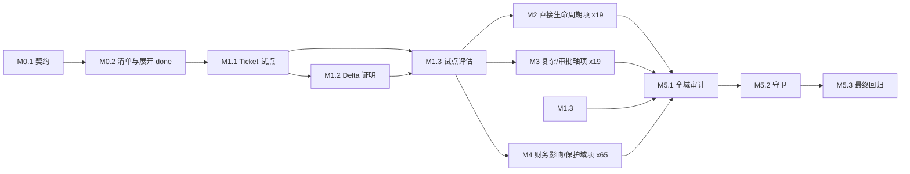

# 实体级状态机 Bean 迁移路线图

> 最后更新：2026-08-12（M1.3 完成：客服试点四方对照审计 PASS + go 裁定 + 批量迁移模板裁定落地至 `docs/architecture/entity-state-machine-bean.md §11`；M2/M3 Deps 门控解除，各迁移项可启动独立 plan。M0.2 展开：M2=19 + M3=19 + M4=65 = 103 纳入轴）
> 来源：`docs/analysis/2026-08-06-1000-erp-state-machine-extension-strategy.md`；用户决策：每种业务状态机采用对应的可注入、可 Delta 覆盖 `ErpXxxStateMachine` Bean，以集中迁移逻辑并支持完备性分析。
> 规范：`docs/backlog/00-roadmap-authoring-guide.md`
> 审查记录：4 轮独立子代理审查后收敛；见文末 `Draft Review Record`。

## 目的

本路线图将当前分散在 BizModel、per-mutation Processor 和 facade helper 中的**命名业务动作的固定状态迁移语义**，渐进迁移为实体级 `ErpXxxStateMachine` Bean。每个 Bean 只拥有一个实体的一条状态轴的迁移矩阵、状态分类和机器可读元数据；Processor 继续拥有实体读写、动态业务守卫、权限、审计、事务和跨域副作用。

路线图的完成结果是：每条纳入范围的状态轴都有命名业务动作的唯一迁移矩阵、对应域设计文档/ORM dict/全部写路径的可追溯证据、矩阵级完备性测试，以及可运行的 Delta 同名 Bean 覆盖证明。通用 CRUD 对状态字段的写入是否应禁止、限制或明确排除，必须由 M0.1 裁定后才能宣称更强的运行时唯一性。

## Non-Goals

- 不引入覆盖全部实体的反射型或泛型全局 `IStateMachine` 运行时调度器。
- 不把 `docStatus`、`approveStatus`、`posted` 合并成笛卡尔积大状态机；三轴单独裁定。
- 不将 `posted` 迁移为 `ErpXxxStateMachine` 状态轴；它继续是业财过账、红冲和物理锁定契约。M4 只迁移触发/逆转过账的业务状态轴。
- 不将 DAO、`I*Biz`、`IServiceContext`、事务或副作用下沉到 StateMachine Bean。
- 不借迁移改变既有业务状态、动作名、错误码、权限、过账时序或审批语义；发现现存行为/owner-doc 冲突时按独立 Fix plan 裁定。
- 不迁移无独立业务生命周期的普通 `ACTIVE/INACTIVE` 标志、技术处理状态或 notify 子系统中不含业务迁移矩阵的记录。
- 不在本路线图中修改 `model/*.orm.xml`；若某个迁移计划需要模型/API 变化，按保护区域规则单独 ask-first。

## Work Item Status

> 唯一动态状态块。状态：`todo` / `ready` / `done`。M0.1 与 M0.2 审查通过前，任何代码迁移项不得转为 `ready`。

### Milestone M0 — 迁移契约与完整清单

| # | Work Item | Status | Owner Doc | Deps | Skill |
|---|---|---|---|---|---|
| M0.1 | 实体级 StateMachine Bean 契约、CRUD 写入边界、Bean/Delta 注册和测试策略定稿 | done | `processor-extension-pattern.md`、`customization-capabilities.md`、`entity-state-machine-bean.md`（新契约 owner doc）、状态机分析报告 | — | `state-machine-business-review-prompt.md`（计划 Task Route 覆盖为 Skill:none，见计划） |
| M0.2 | 全域状态轴清单与迁移批次展开器：逐实体对照 owner doc、ORM dict、actions、writer、测试和保护区；向本路线图追加 M2-M4 的原子迁移项 | done | 17 个域 `state-machine.md`、相关 ORM 模型 | M0.1 | `state-machine-business-review-prompt.md` |

### Milestone M1 — 非保护域试点

| # | Work Item | Status | Owner Doc | Deps | Skill |
|---|---|---|---|---|---|
| M1.1 | 客服 `ErpCsTicket.status` 试点：矩阵 Bean、Processor/BizModel 接线、矩阵完备性和既有动作回归 | done | `customer-service/state-machine.md` | M0.1 + M0.2 + data-deletion 人工批准（2026-08-06 记录） | `nop-backend-dev` + `nop-testing` |
| M1.2 | 客服试点 Delta 同名 Bean 覆盖证明：替换一条允许边或分类语义，并证明基线/Delta 两种加载结果 | done | `customization-capabilities.md`、M0.1 产物 | M1.1 | `nop-backend-dev` + `nop-testing` |
| M1.3 | 试点评估：审计 StateMachine 元数据与客服 owner doc/dict/writer 的一致性，裁定批量迁移模板 | done | `customer-service/state-machine.md`、M0.1 产物 | M1.1 + M1.2 | `state-machine-business-review-prompt.md` |

### Milestone M2 — 非保护域直接生命周期迁移

> M0.2 必须在本节追加每个已分类的非保护、无财务影响状态轴的独立工作项。每项只迁移一个实体的一条状态轴；不得以“某域全部状态机”作为单项范围。

| # | Work Item | Status | Owner Doc | Deps | Skill |
|---|---|---|---|---|---|
| M2.1 | ErpMdSupplierApproval.status SupplierApproval 生命周期 Bean | todo | `master-data/README.md` §供应商准入 | M1.3 | `nop-backend-dev` + `nop-testing` |
| M2.2 | ErpCrmEvent.status Event 生命周期 Bean | todo | `crm/state-machine.md` §Event | M1.3 | `nop-backend-dev` + `nop-testing` |
| M2.3 | ErpPrjTask.status Task 生命周期 Bean | todo | `projects/state-machine.md` §Task | M1.3 | `nop-backend-dev` + `nop-testing` |
| M2.4 | ErpPrjProject.status Project 生命周期 Bean | todo | `projects/state-machine.md` §Project | M1.3 | `nop-backend-dev` + `nop-testing` |
| M2.5 | ErpPurQuotation.docStatus 最小生命周期 Bean | done | `purchase/state-machine.md` | M1.3 | `nop-backend-dev` + `nop-testing` |
| M2.6 | ErpPurRfq.docStatus 最小生命周期 Bean | done | `purchase/state-machine.md` | M1.3 | `nop-backend-dev` + `nop-testing` |
| M2.7 | ErpPurRequisition.docStatus 最小生命周期 Bean | done | `purchase/state-machine.md` | M1.3 | `nop-backend-dev` + `nop-testing` |
| M2.8 | ErpPurOrder.docStatus 最小生命周期 Bean | done | `purchase/state-machine.md` | M1.3 | `nop-backend-dev` + `nop-testing` |
| M2.9 | ErpSalQuotation.docStatus 最小生命周期 Bean | done | `sales/state-machine.md` | M1.3 | `nop-backend-dev` + `nop-testing` |
| M2.10 | ErpSalOrder.docStatus 最小生命周期 Bean | done | `sales/state-machine.md` | M1.3 | `nop-backend-dev` + `nop-testing` |
| M2.11 | ErpHrLeaveRequest.status LeaveRequest 生命周期 Bean | todo | `human-resource/state-machine.md` §LeaveRequest | M1.3 | `nop-backend-dev` + `nop-testing` |
| M2.12 | ErpHrEmploymentContract.status Contract 生命周期 Bean | todo | `human-resource/state-machine.md` §Contract | M1.3 | `nop-backend-dev` + `nop-testing` |
| M2.13 | ErpApsOperationOrder.status OperationOrder 生命周期 Bean | todo | `aps/state-machine.md` | M1.3 | `nop-backend-dev` + `nop-testing` |
| M2.14 | ErpDrpPlan.status DrpPlan 生命周期 Bean | todo | `drp/state-machine.md` §Plan | M1.3 | `nop-backend-dev` + `nop-testing` |
| M2.15 | ErpDrpLine.status DrpLine 生命周期 Bean | todo | `drp/state-machine.md` §Line | M1.3 | `nop-backend-dev` + `nop-testing` |
| M2.16 | ErpB2bAsn.status Asn 生命周期 Bean | todo | `b2b/state-machine.md` §Asn | M1.3 | `nop-backend-dev` + `nop-testing` |
| M2.17 | ErpB2bEdiDoc.state EdiDoc 生命周期 Bean | todo | `b2b/state-machine.md` §EdiDoc | M1.3 | `nop-backend-dev` + `nop-testing` |
| M2.18 | ErpCtContract.status Contract 生命周期 Bean | done | `contract/state-machine.md` | M1.3 | `nop-backend-dev` + `nop-testing` |
| M2.19 | ErpMfgForecast.status Forecast 生命周期 Bean | todo | `manufacturing/state-machine.md` §Forecast | M1.3 | `nop-backend-dev` + `nop-testing` |

> M0.2 必须在本节追加每个已分类的无财务影响复杂业务或审批状态轴的独立工作项。审批轴和业务生命周期轴分开迁移；有跨域副作用的 action 仅替换固定来源/目标状态判断。

| # | Work Item | Status | Owner Doc | Deps | Skill |
|---|---|---|---|---|---|
| M3.1 | ErpCrmLead.docStatus Lead 业务生命周期 Bean | todo | `crm/state-machine.md` §Lead | M1.3 | `nop-backend-dev` + `nop-testing` |
| M3.2 | ErpPurQuotation.approveStatus 审批轴 Bean | todo | `purchase/state-machine.md` §审批轴 | M1.3 + M2.5 | `nop-backend-dev` + `nop-testing` |
| M3.3 | ErpPurRfq.approveStatus 审批轴 Bean | todo | `purchase/state-machine.md` §审批轴 | M1.3 + M2.6 | `nop-backend-dev` + `nop-testing` |
| M3.4 | ErpPurRequisition.approveStatus 审批轴 Bean | todo | `purchase/state-machine.md` §审批轴 | M1.3 + M2.7 | `nop-backend-dev` + `nop-testing` |
| M3.5 | ErpPurOrder.approveStatus 审批轴 Bean | todo | `purchase/state-machine.md` §审批轴 | M1.3 + M2.8 | `nop-backend-dev` + `nop-testing` |
| M3.6 | ErpSalQuotation.approveStatus 审批轴 Bean | todo | `sales/state-machine.md` §审批轴 | M1.3 + M2.9 | `nop-backend-dev` + `nop-testing` |
| M3.7 | ErpSalOrder.approveStatus 审批轴 Bean | todo | `sales/state-machine.md` §审批轴 | M1.3 + M2.10 | `nop-backend-dev` + `nop-testing` |
| M3.8 | ErpHrEmployee.employmentStatus 雇佣生命周期 Bean | todo | `human-resource/state-machine.md` §Employee | M1.3 | `nop-backend-dev` + `nop-testing` |
| M3.9 | ErpHrTimesheet.status Timesheet 审批生命周期 Bean | todo | `human-resource/state-machine.md` §Timesheet | M1.3 | `nop-backend-dev` + `nop-testing` |
| M3.10 | ErpPrjTimesheet.status Timesheet 审批轴 Bean | todo | `projects/state-machine.md` | M1.3 | `nop-backend-dev` + `nop-testing` |
| M3.11 | ErpPrjProjectSettlement.docStatus 结算单据生命周期 Bean | todo | `projects/state-machine.md` | M1.3 | `nop-backend-dev` + `nop-testing` |
| M3.12 | ErpPrjProjectSettlement.approveStatus 结算审批轴 Bean | todo | `projects/state-machine.md` | M1.3 + M3.11 | `nop-backend-dev` + `nop-testing` |
| M3.13 | ErpMfgJobCard.status JobCard 生命周期 Bean | todo | `manufacturing/state-machine.md` §JobCard | M1.3 | `nop-backend-dev` + `nop-testing` |
| M3.14 | ErpMfgMrpPlan.status MrpPlan 生命周期 Bean | todo | `manufacturing/state-machine.md` §MRP | M1.3 | `nop-backend-dev` + `nop-testing` |
| M3.15 | ErpAstMovement.docStatus 资产移动单据生命周期 Bean | todo | `assets/state-machine.md` §Movement | M1.3 | `nop-backend-dev` + `nop-testing` |
| M3.16 | ErpAstMovement.approveStatus 资产移动审批轴 Bean | todo | `assets/state-machine.md` §Movement | M1.3 + M3.15 | `nop-backend-dev` + `nop-testing` |
| M3.17 | ErpMntRequest.status Request 生命周期 Bean | todo | `maintenance/state-machine.md` §Request | M1.3 | `nop-backend-dev` + `nop-testing` |
| M3.18 | ErpCtContractVersion.status 版本生命周期 Bean | todo | `contract/state-machine.md` §Version | M1.3 + M2.18 | `nop-backend-dev` + `nop-testing` |
| M3.19 | ErpCtRebateAgreement.status 返利协议生命周期 Bean | todo | `contract/state-machine.md` | M1.3 | `nop-backend-dev` + `nop-testing` |

> M0.2 必须单独列出 finance 各状态轴，以及任何域中会触发、冲销、补偿或回写库存/会计过账的 action 所在状态轴。每项均为 `plan-first`；如迁移暴露过账、结账、红冲或模型语义变化，暂停并取得 owner doc 与所需人工批准，不得以纯重构名义继续。每一项的行级依赖在 M0.2 展开时定义，不以整个 M2/M3 里程碑完成作为前置。

| # | Work Item | Status | Owner Doc | Deps | Skill |
|---|---|---|---|---|---|
| M4.1 | ErpFinVoucher.docStatus 凭证过账生命周期 Bean（plan-first） | todo | `finance/state-machine.md` §Voucher | M1.3 | `nop-backend-dev` + `nop-testing` |
| M4.2 | ErpFinAccountingPeriod.status 会计期间生命周期 Bean（plan-first） | todo | `finance/state-machine.md` §Period | M1.3 | `nop-backend-dev` + `nop-testing` |
| M4.3 | ErpFinReconciliation.docStatus 对账单生命周期 Bean（plan-first） | todo | `finance/state-machine.md` | M1.3 | `nop-backend-dev` + `nop-testing` |
| M4.4 | ErpFinExpenseClaim.docStatus 报销单生命周期 Bean（plan-first） | todo | `finance/state-machine.md` | M1.3 | `nop-backend-dev` + `nop-testing` |
| M4.5 | ErpFinExpenseClaim.approveStatus 报销审批轴 Bean（plan-first） | todo | `finance/state-machine.md` | M1.3 + M4.4 | `nop-backend-dev` + `nop-testing` |
| M4.6 | ErpFinEmployeeAdvance.docStatus 预付款生命周期 Bean（plan-first） | todo | `finance/state-machine.md` | M1.3 | `nop-backend-dev` + `nop-testing` |
| M4.7 | ErpFinEmployeeAdvance.approveStatus 预付款审批轴 Bean（plan-first） | todo | `finance/state-machine.md` | M1.3 + M4.6 | `nop-backend-dev` + `nop-testing` |
| M4.8 | ErpFinNotesReceivable.status 应收票据生命周期 Bean（plan-first） | todo | `finance/state-machine.md` | M1.3 | `nop-backend-dev` + `nop-testing` |
| M4.9 | ErpFinNotesPayable.status 应付票据生命周期 Bean（plan-first） | todo | `finance/state-machine.md` | M1.3 | `nop-backend-dev` + `nop-testing` |
| M4.10 | ErpFinBadDebt.approveStatus 坏账审批轴 Bean（plan-first） | todo | `finance/state-machine.md` | M1.3 | `nop-backend-dev` + `nop-testing` |
| M4.11 | ErpFinBudgetScenario.docStatus 预算方案生命周期 Bean（plan-first） | todo | `finance/state-machine.md` | M1.3 | `nop-backend-dev` + `nop-testing` |
| M4.12 | ErpFinBudgetScenario.approveStatus 预算审批轴 Bean（plan-first） | todo | `finance/state-machine.md` | M1.3 + M4.11 | `nop-backend-dev` + `nop-testing` |
| M4.13 | ErpPurReceive.docStatus 入库单生命周期 Bean（plan-first） | todo | `purchase/state-machine.md` | M1.3 | `nop-backend-dev` + `nop-testing` |
| M4.14 | ErpPurReceive.approveStatus 入库审批轴 Bean（plan-first） | todo | `purchase/state-machine.md` | M1.3 + M4.13 | `nop-backend-dev` + `nop-testing` |
| M4.15 | ErpPurInvoice.docStatus 采购发票生命周期 Bean（plan-first） | todo | `purchase/state-machine.md` | M1.3 | `nop-backend-dev` + `nop-testing` |
| M4.16 | ErpPurInvoice.approveStatus 采购发票审批轴 Bean（plan-first） | todo | `purchase/state-machine.md` | M1.3 + M4.15 | `nop-backend-dev` + `nop-testing` |
| M4.17 | ErpPurPayment.docStatus 付款单生命周期 Bean（plan-first） | todo | `purchase/state-machine.md` | M1.3 | `nop-backend-dev` + `nop-testing` |
| M4.18 | ErpPurPayment.approveStatus 付款审批轴 Bean（plan-first） | todo | `purchase/state-machine.md` | M1.3 + M4.17 | `nop-backend-dev` + `nop-testing` |
| M4.19 | ErpPurReturn.docStatus 退货单生命周期 Bean（plan-first） | todo | `purchase/state-machine.md` | M1.3 | `nop-backend-dev` + `nop-testing` |
| M4.20 | ErpPurReturn.approveStatus 退货审批轴 Bean（plan-first） | todo | `purchase/state-machine.md` | M1.3 + M4.19 | `nop-backend-dev` + `nop-testing` |
| M4.21 | ErpSalDelivery.docStatus 出库单生命周期 Bean（plan-first） | todo | `sales/state-machine.md` | M1.3 | `nop-backend-dev` + `nop-testing` |
| M4.22 | ErpSalDelivery.approveStatus 出库审批轴 Bean（plan-first） | todo | `sales/state-machine.md` | M1.3 + M4.21 | `nop-backend-dev` + `nop-testing` |
| M4.23 | ErpSalInvoice.docStatus 销售发票生命周期 Bean（plan-first） | todo | `sales/state-machine.md` | M1.3 | `nop-backend-dev` + `nop-testing` |
| M4.24 | ErpSalInvoice.approveStatus 销售发票审批轴 Bean（plan-first） | todo | `sales/state-machine.md` | M1.3 + M4.23 | `nop-backend-dev` + `nop-testing` |
| M4.25 | ErpSalReceipt.docStatus 收款单生命周期 Bean（plan-first） | todo | `sales/state-machine.md` | M1.3 | `nop-backend-dev` + `nop-testing` |
| M4.26 | ErpSalReceipt.approveStatus 收款审批轴 Bean（plan-first） | todo | `sales/state-machine.md` | M1.3 + M4.25 | `nop-backend-dev` + `nop-testing` |
| M4.27 | ErpSalReturn.docStatus 销退单生命周期 Bean（plan-first） | todo | `sales/state-machine.md` | M1.3 | `nop-backend-dev` + `nop-testing` |
| M4.28 | ErpSalReturn.approveStatus 销退审批轴 Bean（plan-first） | todo | `sales/state-machine.md` | M1.3 + M4.27 | `nop-backend-dev` + `nop-testing` |
| M4.29 | ErpInvStockMove.docStatus 库存移动生命周期 Bean（plan-first） | todo | `inventory/state-machine.md` §StockMove | M1.3 | `nop-backend-dev` + `nop-testing` |
| M4.30 | ErpInvStockTake.docStatus 盘点单生命周期 Bean（plan-first） | todo | `inventory/state-machine.md` §StockTake | M1.3 | `nop-backend-dev` + `nop-testing` |
| M4.31 | ErpInvTransferOrder.docStatus 调拨单生命周期 Bean（plan-first） | todo | `inventory/state-machine.md` | M1.3 | `nop-backend-dev` + `nop-testing` |
| M4.32 | ErpInvOwnershipTransfer.docStatus 所有权转移生命周期 Bean（plan-first） | todo | `inventory/state-machine.md` | M1.3 | `nop-backend-dev` + `nop-testing` |
| M4.33 | ErpInvCostAdjust.docStatus 成本调整生命周期 Bean（plan-first） | todo | `inventory/state-machine.md` | M1.3 | `nop-backend-dev` + `nop-testing` |
| M4.34 | ErpInvLandedCost.docStatus 到岸成本生命周期 Bean（plan-first） | todo | `inventory/state-machine.md` | M1.3 | `nop-backend-dev` + `nop-testing` |
| M4.35 | ErpMfgWorkOrder.docStatus 工单生命周期 Bean（plan-first） | todo | `manufacturing/state-machine.md` §WorkOrder | M1.3 | `nop-backend-dev` + `nop-testing` |
| M4.36 | ErpMfgWorkOrder.approveStatus 工单审批轴 Bean（plan-first） | todo | `manufacturing/state-machine.md` §WorkOrder | M1.3 + M4.35 | `nop-backend-dev` + `nop-testing` |
| M4.37 | ErpMfgSubcontractOrder.docStatus 委外单生命周期 Bean（plan-first） | todo | `manufacturing/state-machine.md` §Subcontract | M1.3 | `nop-backend-dev` + `nop-testing` |
| M4.38 | ErpMfgSubcontractOrder.approveStatus 委外审批轴 Bean（plan-first） | todo | `manufacturing/state-machine.md` §Subcontract | M1.3 + M4.37 | `nop-backend-dev` + `nop-testing` |
| M4.39 | ErpMfgMaterialIssue.docStatus 领料单生命周期 Bean（plan-first） | todo | `manufacturing/state-machine.md` | M1.3 | `nop-backend-dev` + `nop-testing` |
| M4.40 | ErpAstAsset.status 资产卡片生命周期 Bean（plan-first） | todo | `assets/state-machine.md` §Asset | M1.3 | `nop-backend-dev` + `nop-testing` |
| M4.41 | ErpAstDepreciationSchedule.status 折旧计划生命周期 Bean（plan-first） | todo | `assets/state-machine.md` | M1.3 | `nop-backend-dev` + `nop-testing` |
| M4.42 | ErpAstValueAdjustment.docStatus 减值/增值单据生命周期 Bean（plan-first） | todo | `assets/state-machine.md` | M1.3 | `nop-backend-dev` + `nop-testing` |
| M4.43 | ErpAstValueAdjustment.approveStatus 减值/增值审批轴 Bean（plan-first） | todo | `assets/state-machine.md` | M1.3 + M4.42 | `nop-backend-dev` + `nop-testing` |
| M4.44 | ErpAstDisposal.docStatus 处置单据生命周期 Bean（plan-first） | todo | `assets/state-machine.md` §Disposal | M1.3 | `nop-backend-dev` + `nop-testing` |
| M4.45 | ErpAstDisposal.approveStatus 处置审批轴 Bean（plan-first） | todo | `assets/state-machine.md` §Disposal | M1.3 + M4.44 | `nop-backend-dev` + `nop-testing` |
| M4.46 | ErpAstAssetCapitalization.docStatus 资本化单据生命周期 Bean（plan-first） | todo | `assets/state-machine.md` | M1.3 | `nop-backend-dev` + `nop-testing` |
| M4.47 | ErpAstAssetCapitalization.approveStatus 资本化审批轴 Bean（plan-first） | todo | `assets/state-machine.md` | M1.3 + M4.46 | `nop-backend-dev` + `nop-testing` |
| M4.48 | ErpAstSplit.docStatus 拆分单据生命周期 Bean（plan-first） | todo | `assets/state-machine.md` | M1.3 | `nop-backend-dev` + `nop-testing` |
| M4.49 | ErpAstSplit.approveStatus 拆分审批轴 Bean（plan-first） | todo | `assets/state-machine.md` | M1.3 + M4.48 | `nop-backend-dev` + `nop-testing` |
| M4.50 | ErpAstMerge.docStatus 合并单据生命周期 Bean（plan-first） | todo | `assets/state-machine.md` | M1.3 | `nop-backend-dev` + `nop-testing` |
| M4.51 | ErpAstMerge.approveStatus 合并审批轴 Bean（plan-first） | todo | `assets/state-machine.md` | M1.3 + M4.50 | `nop-backend-dev` + `nop-testing` |
| M4.52 | ErpAstInventory.status 资产盘点生命周期 Bean（plan-first） | todo | `assets/state-machine.md` | M1.3 | `nop-backend-dev` + `nop-testing` |
| M4.53 | ErpAstMaintenance.status 资产维护生命周期 Bean（plan-first） | todo | `assets/state-machine.md` | M1.3 | `nop-backend-dev` + `nop-testing` |
| M4.54 | ErpMntVisit.status 维护访问生命周期 Bean（plan-first） | todo | `maintenance/state-machine.md` §Visit | M1.3 | `nop-backend-dev` + `nop-testing` |
| M4.55 | ErpMntSparePartUsage.docStatus 备件消耗单据生命周期 Bean（plan-first） | todo | `maintenance/state-machine.md` | M1.3 | `nop-backend-dev` + `nop-testing` |
| M4.56 | ErpMntSparePartUsage.approveStatus 备件审批轴 Bean（plan-first） | todo | `maintenance/state-machine.md` | M1.3 + M4.55 | `nop-backend-dev` + `nop-testing` |
| M4.57 | ErpLogShipment.status 发运单生命周期 Bean（plan-first） | todo | `logistics/state-machine.md` §Shipment | M1.3 | `nop-backend-dev` + `nop-testing` |
| M4.58 | ErpQaInspection.docStatus 质检单生命周期 Bean（plan-first） | todo | `quality/state-machine.md` §Inspection | M1.3 | `nop-backend-dev` + `nop-testing` |
| M4.59 | ErpQaInspection.approveStatus 质检审批轴 Bean（plan-first） | todo | `quality/state-machine.md` §Inspection | M1.3 + M4.58 | `nop-backend-dev` + `nop-testing` |
| M4.60 | ErpQaNonConformance.status NCR 生命周期 Bean（plan-first） | todo | `quality/state-machine.md` §NCR | M1.3 | `nop-backend-dev` + `nop-testing` |
| M4.61 | ErpQaRecall.status 召回生命周期 Bean（plan-first） | todo | `quality/state-machine.md` §Recall | M1.3 | `nop-backend-dev` + `nop-testing` |
| M4.62 | ErpQaRecall.approveStatus 召回审批轴 Bean（plan-first） | todo | `quality/state-machine.md` §Recall | M1.3 + M4.61 | `nop-backend-dev` + `nop-testing` |
| M4.63 | ErpHrSalary.paymentStatus 薪酬发放生命周期 Bean（plan-first） | todo | `human-resource/state-machine.md` §Salary | M1.3 | `nop-backend-dev` + `nop-testing` |
| M4.64 | ErpHrSalary.approveStatus 薪酬审批轴 Bean（plan-first） | todo | `human-resource/state-machine.md` §Salary | M1.3 + M4.63 | `nop-backend-dev` + `nop-testing` |
| M4.65 | ErpCtRebateSettlement.status 返利结算生命周期 Bean（plan-first） | todo | `contract/state-machine.md` | M1.3 | `nop-backend-dev` + `nop-testing` |

| # | Work Item | Status | Owner Doc | Deps | Skill |
|---|---|---|---|---|---|
| M5.1 | 全域矩阵审计：状态可达性、终态出边、重复/冲突边、dict 与全部 writer 对照 | todo | 各域状态机 owner doc、所有相关 ORM | M1.3 + M2 + M3 + M4 的全部展开项 done | `state-machine-business-review-prompt.md` |
| M5.2 | 可重复运行的状态机一致性检查与 CI/本地验证接线；明确误报裁决和新增状态的维护义务 | todo | M0.1 产物、`docs/audits/`、`docs/testing/` | M5.1 | `nop-testing` |
| M5.3 | 最终跨域回归、Delta 覆盖回归、owner doc 对齐及独立 closure audit | todo | 本路线图所有 owner docs | M5.2 | `nop-testing` + `state-machine-business-review-prompt.md` |

## 框架与既有复用

- Nop IoC：非生成 `app-service.beans.xml` 显式 Bean 注册；客户层通过 Delta 同名 Bean 覆盖。
- per-mutation Processor：已有 149 个历史 S-mutation 拆分文件；固定迁移判断改调 StateMachine，动态守卫和副作用保留在 Processor。
- Nop Delta：基线/客户差量合并机制。M1.2 必须提供本项目业务级实证，不将平台层证据当作替代。
- Nop Workflow：人机审批任务状态归 nop-wf；业务实体 Bean 只管理业务侧审批结果轴。
- 现有 JUnit、GraphQL 与浏览器业务动作测试：矩阵测试验证语义，既有动作测试验证接线与副作用。
- `docs/skills/state-machine-business-review-prompt.md`：状态定义、可达性、异常路径、角色和 dict writer 对照的审计方法。

## 当前基线

- 17 个业务域已有独立 `docs/design/<domain>/state-machine.md`；master-data 的状态语义由 `docs/design/master-data/README.md` 等专题文档维护，notify 的通知/模板生命周期由 `docs/design/notify/README.md` 维护。M0.2 必须以这些真实 owner docs 评估两域是否存在应纳入的独立业务状态轴。
- Job 模块的 `JobFireStateMachine` / `JobTaskStateMachine` / `JobScheduleStateMachine` 已集中无客户化技术状态语义，但 ERP 服务模块当前不存在 `ErpXxxStateMachine` Bean。
- ERP 状态判断广泛散布在 BizModel、Processor 和 facade helper。客服 Ticket 的 assign/start/close/cancel 在 `ErpCsTicketBizModel`，resolve/reopen 在独立 Processor，是低耦合且有完整 owner doc 的试点。
- 各域 service 的非生成 `app-service.beans.xml` 已显式注册 Processor Bean；当前 ID 通常使用类的全限定名，StateMachine Bean 的规范 ID、注入类型和 Delta replace 语义尚未裁定，必须由 M0.1 固化后才能实施。
- 现有架构已规定：流程拓扑稳定时 Processor protected hook 可覆盖；拓扑可变时使用 `task.xml` + Delta。StateMachine Bean 只集中固定迁移边，不替代这两种扩展机制。149 是既有 S-mutation per-mutation 文件的历史拆分统计，不是当前状态写入路径的完整清单；M0.2 必须从实际 writer 扫描重新建立范围。
- 已知风险是 dict 死状态：字典、owner doc 迁移图与生产 `setStatus` writer 可能漂移。迁移完成判据必须同时覆盖三者。

## Work Item Details

### M0.1 实体级 StateMachine 契约

- 先形成经独立审查的稳定技术 owner doc，再启动任何迁移 plan。该文档定义 Bean 颗粒度、状态轴边界、迁移元数据、异常映射责任、Processor 接线、Delta 覆盖和测试义务。
- 文档必须裁定通用 CRUD/API 对业务状态字段的边界、Bean/Delta 覆盖方式、错误兼容责任和后续迁移测试层，并以最小运行时探针证明其可行性。
- 对比静态辅助类、实体级 Bean、Processor hook、Policy/SPI 和 task.xml，记录选择边界与不适用场景。
- 该项的实施计划必须先更新相关 architecture owner docs；架构文档只记录稳定模式，不引用本路线图。

### M0.2 清单与展开纪律

- 穷举所有候选实体状态字段，按“独立业务状态轴 / 普通标志 / 技术状态 / 工作流状态”分类。
- 按 M0.1 定义的完整扫描方法盘点所有状态类写路径，并区分生产 writer、框架入口和测试 fixture。
- 每个纳入轴记录迁移语义、关联 owner docs/字典/写路径/测试、保护区域、财务影响和跨域副作用。
- 根据复杂度、财务影响和保护区域向 M2/M3/M4 追加一个原子工作项；每项有确定 owner doc、行级依赖和验证路径。未纳入项必须记录理由与重开触发条件；Deferred/死状态不得静默排除。
- 展开完成前，不得假设 17 个 state-machine.md 下的每一个字典字段都应生成 Bean。

### M1 试点纪律

- M0.2 必须在 M1.1 之前完成 Ticket SLA 起算语义的 drift 分类与 owner-doc 对齐；未有明确裁决不得让试点矩阵固化任一解释。**已完成（2026-08-12）**：M0.2 裁定为 `intentional legacy behavior`（`startDateTime = 首次 IN_PROGRESS`），owner-doc 已补注（`customer-service/state-machine.md` §实现约定 + 清单 `docs/analysis/2026-08-12-entity-state-axis-inventory.md §4`）。M1.1 必须保持此行为。
- Ticket `reopen` 会删除未答问卷，因此 M1.1 属于 data-deletion ask-first 试点。用户已于 2026-08-06 明确批准 M1.1 迁移并指示记录于本路线图；批准范围限于**保留既有 reopen 删除未答问卷行为**前提下的状态机迁移，不扩展到其他数据删除或行为变化，也不授予 ORM、API、财务过账或外部集成自主权。
- M1.1 必须保持经裁决确认的 Ticket 外部行为、审计、SLA/CSAT、副作用和错误语义；具体断言矩阵由实施计划定义。
- M1.2 必须证明真实应用容器中的基线与 Delta 覆盖行为；仅编译派生类或静态检查 bean XML 不构成证明。
- M1.3 只在独立审计确认无行为回归、元数据可审计、Delta 生效后，才能批准 M2/M3 的迁移模板。**已完成（2026-08-12）**：M1.3 四方对照审计裁决 `Verdict: pass`（详见 `docs/plans/2026-08-12-0738-2-cs-ticket-state-machine-pilot-evaluation.md` Phase 1 + Closure）；go 裁定落地，批量迁移模板固化于 `docs/architecture/entity-state-machine-bean.md §11`。M2/M3 各迁移项 Deps（M1.3）门控解除，可启动独立 plan。

### M2-M4 批量纪律

- 每个展开项都创建独立完整 plan，并在该 plan 的 Draft Review Record 中引用本路线图和对应 M0.2 清单行。
- 只迁移固定迁移矩阵；任何不一致、死状态、非法状态边或业务规则变化必须作为 Fix 或独立 Decision，不能静默折叠进重构。
- 跨域副作用、审批工作流、库存和过账仍经既有 Processor/`I*Biz` 路径执行。会触发、冲销、补偿或回写库存/会计过账的 action 一律归 M4，不因所属域不是 finance 而降级；`posted` 本身不作为 StateMachine 迁移轴。
- M4 的任何项，按 `ai-autonomy-policy.md` 走 plan-first；触及受保护行为时不因 StateMachine Bean 抽象而免除人工/owner-doc 门控。

### M5 闭环纪律

- M5.1 以 M0.2 的清单为全集，不抽样；对每个纳入轴形成可追溯审计结论。
- M5.2 的检查必须有确定性输出和维护入口，不能仅靠人工阅读 Java 类；新增状态/动作时应能指出需要同步的矩阵、dict、owner doc 和测试。
- M5.3 在完整构建、相关测试和至少一个客户 Delta 覆盖回归通过后，进行独立 closure audit。每个迁移项仍须在自身独立 closure audit 后立即转为 `done`；M5.3 只关闭自身，路线图完成由全部工作项均为 `done` 推导。

## 依赖图

## 横切关注点

- **真相源**：业务迁移语义以各域 `state-machine.md` 为设计 owner；状态字段/dict 以 ORM 为真相；现存代码与文档冲突先分类为 implementation drift、doc drift 或 intentional legacy behavior。
- **最小抽象**：每个 Bean 对应一个明确实体/轴。未出现可证明复用前，不新增通用运行时接口或 Policy 层。
- **并发与幂等**：矩阵合法不等于动作安全；每个迁移 plan 保留原有乐观锁、重复调用、外部回调和补偿测试。
- **错误语义**：StateMachine 可报告非法边，但域 Processor 保留领域 ErrorCode、实体编号和上下文参数，避免 common 层错误码抹平领域语义。
- **文档与架构边界**：执行中更新稳定 owner docs；架构文档不得引用本路线图。执行排程引用限于 `docs/backlog/` 中未完成路线图和 backlog 索引，不向稳定 owner docs 扩散。
- **工作项扩展**：仅 M0.2 可在本路线图预声明的 M2/M3/M4 表中追加迁移项；它必须基于盘点结果，不得自行发明范围。新增行初始为 `todo`。

## 规则

1. 遵循 `00-roadmap-authoring-guide.md`：状态只属于工作项，独立 plan audit 后 `todo -> ready`，独立 closure audit 后 `ready -> done`。
2. M0.1 与 M0.2 是本路线图的硬门控；不得先批量创建迁移计划。
3. 每个代码迁移项均是跨模块/可定制行为变更，必须有完整 plan、独立草案审查和独立结束审计。
4. 仅 M0.2 可在 M2/M3/M4 标题下追加原子工作项；M0.2 的 `done` 表示所有候选均已分类并已明确记录纳入/不纳入裁决。M2/M3/M4 在展开前不含占位工作项。
5. 任何发现的 dict 死状态、文档-代码迁移漂移或非法行为边必须按 Fix/Decision 处理，不得作为“既有状态”忽略。
6. 在 M1.2 成功证明前，不得声称业务级 Delta StateMachine 覆盖已验证。
7. 本路线图不授予 ORM、API、财务过账、数据删除或外部集成的自主权；更严格的保护区域规则优先。

## Draft Review Record

- Independent roadmap review iteration 1: `needs revision` (`ses_02a2691eaffecDCIYzdZXszJft`) — 治理审查发现非法占位状态、M0.2 展开范围不一致、M4 表/图依赖冲突、每项 closure 状态规则错误、master-data/notify owner-doc 输入遗漏、149 Processor 统计误用和引用边界过宽。v2 已删除占位项、统一 M0.2 仅展开 M2-M4、改为行级 M4 依赖、澄清每项独立 done、补 owner-doc 输入与真实 writer 盘点、订正统计并收紧引用规则。
- Independent roadmap review iteration 1: `needs revision` (`ses_02a268e45ffeOM1CCJyhY902Jx`) — 技术审查发现财务影响动作未隔离、通用 CRUD 可绕过“唯一矩阵”、Delta 证明和 Bean replace 语义不具体、错误/终态兼容与 Ticket 副作用保护不足、writer 扫描边界不完整。v2 已将财务影响 action 统一归 M4，要求 M0.1 先裁定 CRUD 边界、Bean/Delta 契约和拒绝元数据，并将 Ticket 试点、Delta 运行时证据和全 writer 盘点列为硬验收。
- Independent roadmap review iteration 2: `needs revision` (`ses_02a1cc012ffeB4HSB6wX2UiuXI`) — 复核发现 M0.2 仍误称展开 M1-M4、M2-M4 缺预声明空表、M5.1 未直接依赖试点、Ticket SLA owner-doc 漂移未作为试点前置，以及 roadmap 混入过多实现规范。v3 已统一展开范围为 M2-M4、补空表和 M5.1 对 M1.3 的依赖、将 Ticket drift 对齐设为 M1 前置，并把实现细节下沉为 M0.1 owner-doc 交付要求。
- Independent roadmap review iteration 2: `needs revision` (`ses_02a1cb6baffegWwPgiqoVPQK1d`) — 复核要求明确排除 `posted`、在 M0.1 作出可执行 CRUD 控制裁决、以真实 VFS Delta layer 证明覆盖、把 writer 扫描变为可复核证据，并在试点前裁决 Ticket SLA 漂移。v3 已逐项纳入 M0/M1 的阻断交付要求。
- Independent roadmap review iteration 3: `needs revision` (`ses_02a1040daffeDwAO0O6nCRwYzb`) — 无 blocker，仍有一个 major：路线图过度规定扫描/试点的实现细节。v4 已将具体机制和断言矩阵下沉为 M0.1 owner doc 与后续计划的交付，不再作为路线图规格。
- Independent roadmap review iteration 3: `needs revision` (`ses_02a1040a6ffeoxgvbbkqXjqWtI`) — Ticket `reopen` 删除未答问卷，试点触及 data deletion 保护区。v4 已将 M1.1 标为 ask-first，并把人工批准记录设为实施前置。
- Independent roadmap review iteration 4: `needs revision` (`ses_02a0a45a7ffep6UubXyC31a3o0`) — data-deletion 批准错误地放在实施前，而政策要求在规划前。v4.1 已将批准记录前置为 M1.1 计划起草、审查和实施的共同前置。
- Independent roadmap review iteration 5: `passes draft review` (`ses_02a060484ffeeMprvphkYlu0p2`) — 确认 data-deletion ask-first 门控已与自主政策一致；无 blocker 或 major。路线图保持 `draft`，等待用户对 M1.1 data-deletion 批准及后续逐项计划审查。
- Human approval (2026-08-06): 用户明确指示在路线图中记录 **M1.1 迁移已获批准**。批准覆盖 M1.1 计划起草、审查与实施（data-deletion ask-first 门控已满足）；范围限于保留既有 reopen 删除未答问卷行为的状态机迁移，不重开其他保护区域。v4.2 已将该批准记录写入 M1.1 行依赖与 M1 试点纪律。
