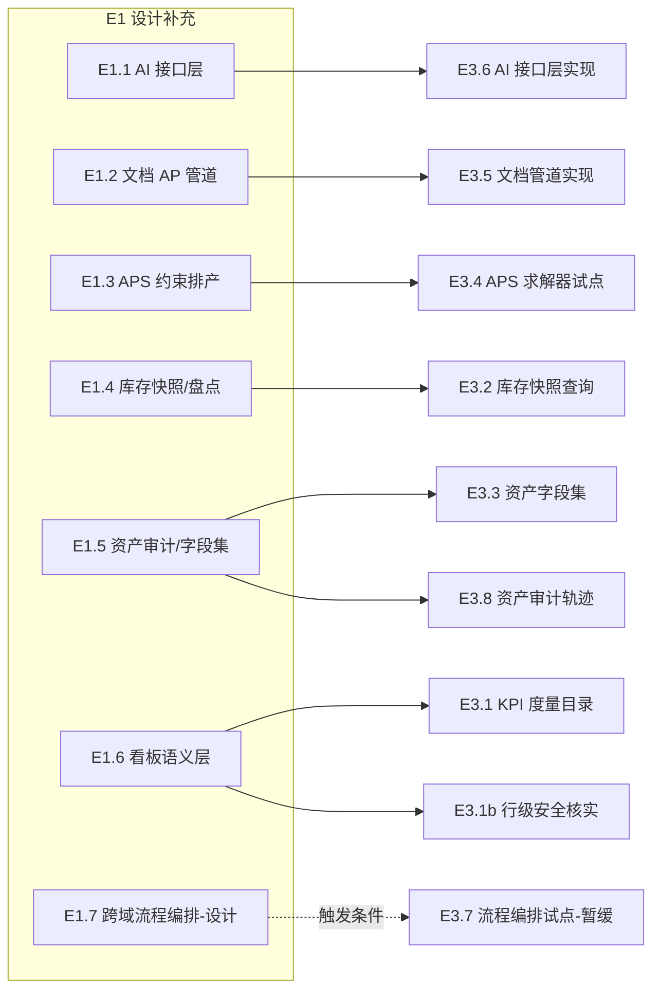

# ERP 增强路线图（ERP Enhancement Roadmap）

> **最后更新**: 2026-08-12
> **来源**: `docs/analysis/erp-survey/2026-08-12-0000-innovation-trends.md`（创新趋势总览）+ 同批次 14 份项目调研报告（erpclaw/twenty/frappe/baserow/frepple/openboxes/fleetbase/inventree/beancount/paperless-ngx/n8n/superset/snipe-it/medusa）
> **前置条件**: `deepening-roadmap.md` ✅ done（11/11，07-20 批次缺口已闭环）；`core-business-roadmap.md` ✅ done；`extended-roadmap.md` ✅ done

## 1. 目的

本路线图覆盖 2026-08-12 erp-survey 批次（14 项目 + 创新趋势）识别的**整个 ERP 的补充设计 + 实现**工作项——涵盖 AI 原生接口、APS 约束排产深化、文档驱动 AP 自动化、库存审计快照/周期盘点、资产审计轨迹/自定义字段集、看板 KPI 语义层、跨域流程编排。

核心原则（用户 2026-08-12 方向澄清）：

- **设计先行**：先补充设计文档（本批次已产出，Milestone E1），再逐项评估实现（E3 门控）。
- **流程编排暂不编码**：跨域流程编排（`cross-domain-flow-orchestration.md`）只保留分析 + 设计文档，不进入编码状态，实现触发条件驱动。
- **不改变平台核心**：所有工作项均为应用层设计与实现。
- **ORM 变更已获批准（2026-08-12）**：本 roadmap E3 工作项涉及的 ORM 变更已获人工授权，授权记录见 §8.1；实施时不再逐项人工确认（双独立子 agent 批准），在整体计划中显式列出即可。
- **平台优先**：n8n/Superset 与平台功能重复（nop-wf/nop-report/nop-datav/nop-ai），仅作设计参考不作为能力缺口。

## 2. Work Item Status

| State | Count |
|-------|-------|
| todo | 12 |
| ready | 0 |
| done | 7 |

## 3. 框架/平台复用

| 能力 | 提供方式 |
|------|----------|
| AI 接入 | `nop-ai`（LLM 接入）+ **nop-datav ChatBI**（`feat-nop-datav` 分支：NL→查询/看板/大屏生成，master 未合入；平台能力，应用层只做业务面 AI 消费/暴露设计） |
| BI 语义层/元数据 | **nop-metadata**（master 已合入：`NopMetaTableMeasure/Dimension/Join/Filter` + queryAggregation + 血缘/质量/对账/联邦查询，平台文档 `03-modules/nop-metadata.md`） |
| 可视化平台 | **nop-datav**（`feat-nop-datav` 分支完整链：看板/大屏/面板/分享/导出/定时报告/告警/DataAuth；master 当前仅 `nop-datav-chart` 单模块） |
| 工作流/审批 | `nop-wf`（含人工节点/human-approval 门） |
| 报表/看板 | `nop-report` + 各域 `getDashboardKpi`（AMIS 渲染） |
| 扩展字段 | `JsonOrmComponent` / ext 字段模式（资产自定义字段集首选） |
| 排产引擎 | 既有 `ErpApsSchedulingEngine`（贪心）+ `CrpLoadCalculator`（负荷率派生链） |
| 文档存储 | `nop-file` 模块（文档摄取管道载体） |
| 定时/队列 | `nop-job` + `NopSysEvent`（管道异步步骤） |
| 限流 | `IRateLimiter`（D1 已落地，AI 频控复用） |

## 4. 当前基线

| 域/主题 | 已实现 | 本批次补充设计 |
|---------|--------|----------------|
| AI 接口层 | action 层即 API（BizModel/GraphQL 自动暴露）；enforcement 栈；nop-ai；**平台 ChatBI（nop-datav feat 分支）** | `ai-native-interface.md`（GraphQL 类型定义即 API + REST/GraphQL 双通道 + AI 护栏 + human-approval 门 + 原语化裁决；**否决 MCP**；ChatBI 平台归属） |
| aps 排产 | 贪心前/后向排产 + MAINTENANCE 单约束 | `aps/constraint-based-planning.md`（求解器分离/TOC 瓶颈/多约束/预测衔接/KPI） |
| finance 文档入口 | b2b EDI/MFT；AP 三单匹配 | `finance/document-driven-ap-automation.md`（OCR→分类→草稿→三单匹配管道） |
| inventory | 3 层模型 + 一次性 StockTake + 批次追溯 | `inventory/audit-snapshot-cycle-count.md`（快照语义/周期盘点/对账整合） |
| assets | 折旧/CIP/维护/盘点/价值调整 + 会计日志 | `assets/audit-trail-and-custom-fieldsets.md`（Actionlog 轨迹/型号级字段集/SCIM 触发） |
| 看板 | 10 域 KPI + 24 报表 + AMIS + value-spec；**平台语义层 nop-metadata（master）+ 平台可视化 nop-datav（feat 分支）** | `dashboard-semantic-layer.md`（KPI 度量目录对齐平台语义层/嵌入式 API-first/行级安全核实；**否决 MCP**） |
| 跨域流程编排 | Processor 链 + 事件链 + 审批 wf 链 | `cross-domain-flow-orchestration.md`（必要性分析 + 补充 wf 关联形态，**暂不编码**） |
| 记账内核 | 3 层过账 + 红字冲销 + 平衡校验 | Beancount/ERPClaw 对照确认（E2.1，零代码） |
| 低代码/扩展机制 | Delta + SPI + D4 研究 | Frappe/Baserow/InvenTree/Fleetbase 对照确认（E2.2/E2.3，零代码） |

### 4.1 对照确认与不立项声明（08-12 批次其余借鉴点显式归类）

以下报告借鉴点经核实**已由既有架构覆盖或不属于本期**，显式声明去向（不新增工作项）：

| 借鉴点 | 报告来源 | 归类 |
|--------|---------|------|
| 对象以代码定义/模型版本化 | twenty | 对照确认：nop orm.xml 模型驱动更彻底（`domain-design-guidelines.md`），不立项 |
| GraphQL-first 统一 API | twenty | 对照确认：Nop `IGraphQLEngine` 自动暴露已具备，不立项 |
| 乐观更新 SPA 体验 | twenty | 对照确认：AMIS/flux 渲染交互范式（`frontend-ui-roadmap.md`），不立项 |
| 元数据驱动/自动 REST API/Report Builder | frappe | 对照确认：Nop codegen + nop-report 已具备，不立项 |
| 公式语言（BaserowFormula ANTLR） | baserow | 对照确认：Nop XLang 已覆盖表达式需求；Excel 风格公式字段触发条件=明确需求（E3 之外，不立项） |
| 插件注册/生命周期 | inventree | 对照确认：D4 已裁决 Delta+SPI（`plugin-hot-management-research.md`），不立项 |
| 机器学习集成（模型注册/推理） | inventree | 按用途分派：**ML 分类**并入 E3.5 文档管道分类引擎 SPI（Phase 2）；**ML 需求预测**并入 E1.3 APS 预测衔接（§4）；**ML 通用推理框架**触发条件=预测/识别业务需求（不立项） |
| 报告模板化生成（标签/表单） | inventree | 对照确认：nop-report 打印/标签能力已具备，不立项 |
| 部件参数体系（part 参数/替代件） | inventree | 触发条件驱动：替代料/多参数主数据需求出现时评估（与 C1 Party 抽象/C2 跨境扩展同类主数据扩展，ORM 授权范围外须单独授权），不立项 |
| 扩展索引器/订单规则自动化引擎 | fleetbase | 对照确认：Delta 定制 + 规则设计已覆盖；自动化配置层触发条件=复杂物流自动化需求 |
| 查询引擎（类 SQL 账本查询） | beancount | 对照确认：Nop EQL/BizQuery 已具备，不立项 |
| 标签打印/导入工具 | snipe-it | 对照确认：nop-report 打印能力，不立项 |
| 模块注册表/ed25519 签名 | erpclaw | 对照确认：Maven 模块制 + `module-meta.json`（D2）已覆盖；签名机制触发条件=插件分发需求 |
| AI 工具注册/可观测性 | n8n | 并入 E1.1（AI 接口层）与既有运行监控（`posting-log.md`），不立项 |
| AI 建表/建页面助手（Kuma 形态） | baserow | 触发条件驱动：AI 生成元数据/页面需求出现时评估（E1.1 只管业务面 AI 消费/暴露，元数据生成不在本期范围），不立项 |
| MCP 服务（ERPClaw mcp/tool_router、Superset mcp_service） | erpclaw / superset | **否决采用**（用户 2026-08-12 裁决：应用与平台均不使用 MCP）——API 由 GraphQL 类型定义描述，经 REST + GraphQL 双通道调用 |
| 轻量语义层（指标/维度规范化） | superset | **对照确认（平台已实现）**：nop-metadata（master 已合入）提供 `NopMetaTableMeasure/Dimension/Join/Filter` + queryAggregation——语义层运行时已有，应用层度量目录为口径对齐映射（`dashboard-semantic-layer.md` §0/§1），不立项 |
| 嵌入式 SDK / ChatBI / 定时报告 / 告警 | superset / n8n | **对照确认（平台已实现，feat 分支在途）**：nop-datav 平台提供嵌入式看板、ChatBI（NL→查询/看板/大屏）、定时报告、轻量告警、DataAuth——master 仅合入 chart 单模块，完整链在 `feat-nop-datav`；应用层不重复实现，平台合入 master 后评估挂载（`dashboard-semantic-layer.md` §0） |
| 事件总线（redis/local） | medusa | 对照确认：`NopSysEvent` 主题路由已具备，不立项 |
| 30+ 模块微服务化拆分 | medusa | 对照确认：18 域 DAG 独立部署路线（`domain-module-split-analysis.md`），不立项 |
| 物流核心对象/ledger 同仓 | fleetbase | 对照确认：nop logistics 域状态机 + 独立 finance 域更彻底，不立项 |
| 批次/序列全链路 | openboxes | 对照确认：`trace-chain.md` 已覆盖，不立项 |
| WMS 特征服务（补货/拣货/上架闭环） | openboxes | 对照确认（部分具备）：预留量 + DRP 建议已覆盖补货面；拣货/上架为 WMS 特征非本期（`audit-snapshot-cycle-count.md` 对照表已声明） |
| 跨系统计划同步 SPI（erpconnection 形态） | frepple | 触发条件驱动：跨系统计划同步需求出现时评估（`constraint-based-planning.md` §对照表差距行），并入 E3.4 深化清单候选 |
| 工具链对照（bench vs build.sh/nop-cli） | frappe | 对照确认：E2.2 交付物补「工具链对照」注记 |

## 5. Milestones

### Milestone E1 — 设计补充（2026-08-12 erp-survey 批次，文档已产出）

| Work Item | 状态 | Owner Doc | 依赖 | 复用 |
|-----------|------|-----------|------|------|
| E1.1: AI 原生接口层设计 | done | `docs/design/ai-native-interface.md` (**NEW**) | innovation-trends §1.1 | nop-ai / enforcement 栈 |
| E1.2: 文档驱动 AP 自动化管道设计 | done | `docs/design/finance/document-driven-ap-automation.md` (**NEW**) | paperless-ngx 报告 | nop-file / nop-job / 三单匹配 |
| E1.3: APS 约束排产深化设计 | done | `docs/design/aps/constraint-based-planning.md` (**NEW**) | frepple 报告 | ErpApsSchedulingEngine / CrpLoadCalculator |
| E1.4: 库存审计快照与周期盘点设计 | done | `docs/design/inventory/audit-snapshot-cycle-count.md` (**NEW**) | openboxes 报告 | 3 层模型 / StockTake 链 |
| E1.5: 资产审计轨迹与自定义字段集设计 | done | `docs/design/assets/audit-trail-and-custom-fieldsets.md` (**NEW**) | snipe-it 报告 | JsonOrmComponent / 会计日志 |
| E1.6: 看板 KPI 语义层设计 | done | `docs/design/dashboard-semantic-layer.md` (**NEW**) | superset 报告 | nop-report / dashboards.md |
| E1.7: 跨域流程编排设计（分析+设计，暂不编码） | done | `docs/architecture/cross-domain-flow-orchestration.md` (**NEW**) | medusa/n8n 报告 + 用户澄清 | nop-wf / 三层桥接 |

### Milestone E2 — 对照确认与边界声明（零代码）

| Work Item | 状态 | Owner Doc | 依赖 | 复用 |
|-----------|------|-----------|------|------|
| E2.1: 记账内核审计性对照确认（Beancount 平衡校验清单 vs 既有凭证引擎） | todo | `docs/design/finance/posting.md`（补对照段） | E1 批次报告 | 既有凭证引擎 |
| E2.2: 低代码平台边界对照（Frappe/Baserow vs Nop 模型驱动；含工具链对照 bench vs build.sh/nop-cli） | todo | `docs/analysis/erp-survey/`（对照注记） | E1 批次报告 | — |
| E2.3: 扩展机制三方对照（InvenTree/Fleetbase vs NocoBase vs Delta+SPI） | todo | `docs/analysis/plugin-hot-management-research.md`（补对照段） | D4 研究 | — |

### Milestone E3 — 实现（单一整体计划实施，plan-first）

| Work Item | 状态 | Owner Doc | 依赖 | 复用 |
|-----------|------|-----------|------|------|
| E3.1: 看板 KPI 度量目录登记（dashboards.md 章节，口径对齐 nop-metadata 语义层，零代码） | todo | `dashboard-semantic-layer.md` §1 | E1.6 | nop-metadata（语义层映射输入） |
| E3.1b: 看板/报表行级安全核实（数据权限覆盖核实 + nop-datav DataAuth 边界 + 缺口登记） | todo | `dashboard-semantic-layer.md` §4 | E1.6 | enforcement 栈 / nop-datav DataAuth |
| E3.2: 库存审计快照查询 `getInventorySnapshot` + 对账校验项 | todo | `inventory/audit-snapshot-cycle-count.md` §1 | E1.4 | 3 层模型派生 |
| E3.3: 资产型号级 ext 字段集管理界面（零 ORM；前置核实平台 JsonOrmComponent 用法） | todo | `assets/audit-trail-and-custom-fieldsets.md` §2 | E1.5 | JsonOrmComponent |
| E3.4: APS 求解器分离 + 瓶颈识别试点（默认贪心保持） | todo | `aps/constraint-based-planning.md` §1-2 | E1.3 | IApsSchedulingSolver |
| E3.5: 文档摄取管道（前置 OCR/nop-file 调研；ORM 已授权） | todo | `finance/document-driven-ap-automation.md` | E1.2 | nop-file / nop-job |
| E3.6: AI 接口层（前置 GraphQL schema 工具发现可用性调研；ORM 已授权） | todo | `ai-native-interface.md` | E1.1 | nop-ai / IGraphQLEngine |
| E3.7: 跨域流程编排试点（**暂缓**，触发条件驱动） | todo | `cross-domain-flow-orchestration.md` | E1.7 + 触发条件 | nop-wf |
| E3.8: 资产操作审计轨迹实现（`getAssetAuditTrail`；ORM 已授权） | todo | `assets/audit-trail-and-custom-fieldsets.md` §1 | E1.5 | 会计日志 |

## 6. Work Item Details

| Work Item | Deliverables |
|-----------|-------------|
| E1.1 | `ai-native-interface.md`（AI 工具暴露形态裁决 + 安全护栏表 + human-approval 门 + 原语化裁决）✅ 已产出 |
| E1.2 | `document-driven-ap-automation.md`（摄取管道图 + 分类引擎两阶段 + 邮件摄取 + 审计追溯）✅ 已产出 |
| E1.3 | `constraint-based-planning.md`（求解器分离接口 + TOC 瓶颈识别 + 多约束扩展 + 预测衔接 SPI + KPI）✅ 已产出 |
| E1.4 | `audit-snapshot-cycle-count.md`（快照=派生视图 + 周期盘点任务 + 对账整合）✅ 已产出 |
| E1.5 | `audit-trail-and-custom-fieldsets.md`（Actionlog 式审计事件类型 + 型号级字段集 + SCIM 触发）✅ 已产出 |
| E1.6 | `dashboard-semantic-layer.md`（KPI 度量目录 + 嵌入式 API-first + 行级安全核实项）✅ 已产出 |
| E1.7 | `cross-domain-flow-orchestration.md`（必要性判定矩阵 N1-N6 + 补充 wf 关联形态 + 全局协调器 + 反模式）✅ 已产出 |
| E2.1 | posting.md 补「记账内核审计性对照」段（平衡校验约束清单核对 + 结论登记） |
| E2.2 | erp-survey 对照注记（Frappe/Baserow 与 Nop 模型驱动路径差异结论，引用既有报告） |
| E2.3 | plugin-hot-management-research.md 补三方对照段（InvenTree registry / Fleetbase extensions 与既有裁决） |
| E3.1 | dashboards.md 增 KPI 度量目录章节（10 域 KPI 口径/数据来源/单位登记，口径=数据驱动数值断言覆盖域）；目录作为未来 nop-metadata 语义层（Measure/Dimension）映射输入 |
| E3.1b | 核实 enforcement 数据权限（role-row-filter）对 `getDashboardKpi`/报表查询的覆盖 + nop-datav DataAuth/RbacAuth 边界（feat 分支），缺口登记（实施属 enforcement 栈扩展） |
| E3.2 | `getInventorySnapshot` BizQuery + 期末对账一致性校验项（零 ORM） |
| E3.3 | 型号级 ext 字段键声明 + 管理界面（view.xml 定制，零 ORM） |
| E3.4 | `IApsSchedulingSolver` 接口 + 贪心默认实现保留 + `scheduleToc` 瓶颈识别试点 |
| E3.5 | OCR 引擎选型调研 → 管道实现（文档 → 解析 → 草稿发票 → 三单匹配）；分类引擎 Phase 1 规则优先 + Phase 2 ML 经 SPI 注入（`IErpFinAcctDocProvider` 注入范式）；ORM 变更（文档引用/解析字段）已授权 |
| E3.6 | GraphQL schema 对 AI 工具发现的可用性调研（introspection/类型描述）→ AI 工具消费约定 + 护栏（ORM actorType 字段已授权）。**不采用 MCP**（用户 2026-08-12 裁决：GraphQL 类型定义即 API，REST/GraphQL 双通道） |
| E3.7 | **暂缓**：触发条件 = 真实 nop-wf 跨域编排需求（人工门控/超时/整链追溯）出现后按 E1.7 设计实现 |
| E3.8 | 资产状态/归属变化审计记录 + `getAssetAuditTrail` 时间轴查询（优先复用会计日志；独立审计实体 ORM 已授权） |

## 7. 依赖图

## 8. 横切关注点

- **设计先行纪律**：E1 全部为设计文档（已产出，独立审查后保持 done）；E2 为零代码对照确认；E3 以**单一整体计划**实施（§9 规则 2），**不允许直接从设计文档跳到编码**。
- **流程编排暂缓**：E3.7 不进入编码状态（用户 2026-08-12 指示）；触发条件未满足前保持 todo。
- **ORM 授权**：E3.5（文档引用/解析字段）、E3.6（actorType 字段）、E3.2（如物化快照表）、E3.8（独立审计实体）涉及的 ORM 变更**已获人工批准**（§8.1 授权记录），实施时在整体计划中显式列出变更清单，按 dual-agent-approval 规则执行（双独立子 agent 批准）；E3.3 首选 ext 字段规避 ORM。
- **平台优先**：任何实现项先核实 Nop 平台能力（nop-ai/nop-wf/nop-file/nop-job/nop-metadata/nop-datav），不重建。
- **平台能力跟踪（2026-08-13 核对）**：nop-metadata（BI 语义层/元数据中心）**master 已合入**——应用层语义层需求复用平台（E3.1 度量目录=口径对齐映射）；nop-datav（可视化平台含 ChatBI/DataAuth）完整链在 **`feat-nop-datav` 分支、master 仅 chart 单模块**——应用层不得依赖分支 API，平台合入 master 后评估挂载（`dashboard-semantic-layer.md` §0/AP-8）。
- **AI 接口裁决（用户 2026-08-12）**：应用系统提供给 AI 的接口**不通过 MCP**，整个 Nop 平台均不使用 MCP；API 由 GraphQL 类型定义描述，经 REST 与 GraphQL 两种方式调用。所有 E1/E3 设计与实现项遵守此裁决。
- **业务逻辑单一真相**：AI/管道/协调器只编排，不复制业务规则（对齐 processor-per-mutation 契约）。
- **与既有 roadmap 边界**：deepening-roadmap（07-20 批次）已 done 不重复；frontend-ui-roadmap 保持独立；本 roadmap 只登记 08-12 批次识别项。

### 8.1 ORM 变更授权记录（2026-08-12 人工批准）

| 涉及工作项 | 授权范围 | 说明 |
|-----------|---------|------|
| E3.5 | 文档摄取管道相关字段/实体（文档引用、解析结果字段、文档处理日志） | 实施时在整体计划中列出具体 schema |
| E3.6 | AI 操作审计标识字段（`actorType=AI`） | 仅当需区分 AI 发起的操作时 |
| E3.8 | 资产审计实体 `ErpAstAssetActionLog`（如复用会计日志不满足时） | 首选零变更路径 |
| E3.2 | 库存快照物化表（如触发条件满足时） | 默认派生视图零 ORM |
| E3.7 | 业务实体 `flowInstanceId` 引用（如触发条件满足时） | **暂缓**，解除暂缓后生效 |
| E1.4（周期盘点） | CycleCountTask 实体化或 StockTake 扩展（如触发条件满足时） | 触发条件驱动 |

> **授权约束**：变更仍须遵守「ORM 源模型唯一真相 → codegen 增量重新生成（`mvn clean install -DskipTests`）」纪律；不手改生成代码；schema 细节在整体计划 Phase 1 Explore 中定稿并显式列出。

## 9. Rules

1. 遵循 `00-roadmap-authoring-guide.md` 状态跟踪；状态只存在于工作项。
2. **E3 以单一整体计划实施**（覆盖 E3.1-E3.8 的全部非暂缓项）：一份 `docs/plans/` 计划，含独立草案审查与独立结束审计；E3.7 触发条件满足后并入或另立计划。**不逐项起草独立计划**（用户 2026-08-12 指示）。
3. 涉及 ORM 变更的字段/实体在整体计划中显式列出（授权见 §8.1），按 dual-agent-approval 规则执行（双独立子 agent 批准）。
4. 发现新的平台能力复用机会时更新 §3。
5. 不将 roadmap 编写为实施规格；细节在计划与 owner doc 中定义。
6. 流程编排（E1.7/E3.7）的编码须等待用户显式解除暂缓。
