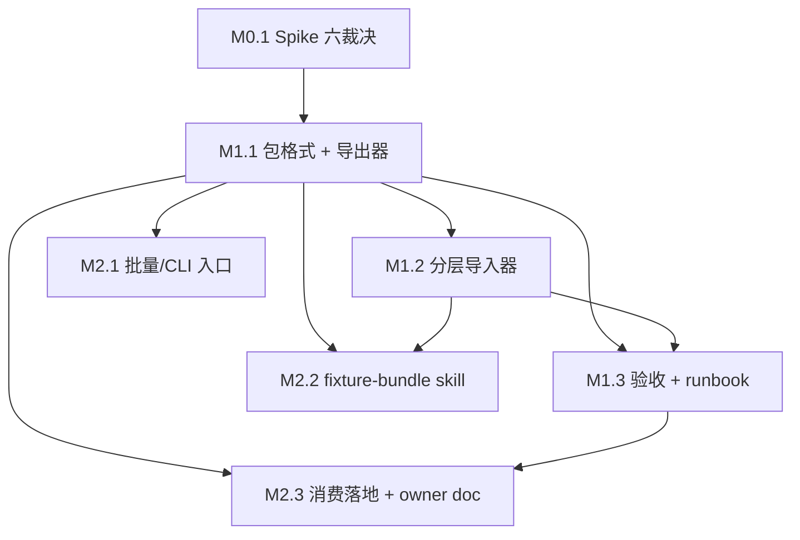

---
---

# 测试夹具可移植导出/导入框架路线图（Fixture Bundle：构造→导出→异库回放 + 批量入口 + skill）

> 最后更新：2026-10-02（iteration 2 审查收敛 7 项转 ready + **M0.1/M1.1/M1.2/M1.3/M2.1 done**；剩余 M2.2/M2.3 两项 `ready`）
> 来源：用户请求「准备测试数据的 AI 工具/skill」；2026-09-30 deep-interview 5 轮裁定（最终模糊度 15%）
> 触发条件：出现「测试夹具跨类/跨环境复用」或「夹具化 E2E 环境」需求（用户 2026-09-30 请求「准备测试数据的 AI 工具/skill」；既有 `_cases` 30k+ CSV 全为每方法私有、跨类共享夹具模块为空骨架）
> 规范：`docs/backlog/00-roadmap-authoring-guide.md`
> 执行：mission driver（`./tools/mission-driver.sh run fixture-bundle`，mission 文件 `missions/fixture-bundle.json`）；roadmap 状态块为唯一动态状态真相源
> 跨仓路径说明：文中 `../nop-entropy/...` 为**仓库根相对**（本文件位于 `docs/backlog/`，字面相对解析不成立）
> 审查记录：见文末 §审查记录

## 目的

本路线图定义一个**通用的测试夹具可移植导出/导入框架**（fixture bundle）：核心产物是**脱离 TestClass 归属、可跨环境搬运的自包含夹具包**，支持从构造会话导出、在任意目标环境导入回放，供任意 Nop 应用的测试装载（app init 装载场景按 §Non-Goals「内存库 + init 配置测试应用」门控）。「异库」口径 = 另一数据库实例（当前交付 = H2→H2 实例间搬运；跨数据库方言回放见 §Non-Goals）。框架落在 nop-entropy 平台层（扩展 `nop-autotest`），nop-app-erp 是第一个消费者。

引用 `docs/backlog/00-roadmap-authoring-guide.md` 作为规范。

### deep-interview 裁定（决定本路线图边界）

| 分叉 | 裁定 |
|------|------|
| 落地形态 | 中框架：**扩展 nop-autotest**（nop-entropy 平台层），非 nop-app-erp 专用工具 |
| 真增量 | **跨环境可移植夹具包**（独立导出入口），非再造 CHECKING 模式回放（现有 `_cases` 已覆盖「构造→录制→新库回放」） |
| 引用语义 | **D：base/payload 分层**（base 按业务键对账不覆盖）+ **导入时 ID 重映射** |
| 导出机制分叉 | **观测式录制为主路径**（构造会话内、零额外 SQL、复用既有 hook），**查询式 dao 导出为补充并推迟**（见 §Non-Goals）；不选「纯 dao 全表备份」为主路径，因其与构造会话末态不自洽；作为主路径失败后的机制备选，复活入口见 M0.1 失败出路情景 A |
| 首验收 | 场景 A 先行（构造→导出→异库回放）；B（按用户闭包导出）、C（内存库测试应用）列为触发条件门控的 Non-Goals |
| 消费者 | 框架通用；nop-app-erp 侧持有 bundle 配置 + 消费示例 + skill |

### 与相邻路线图的边界（单一状态源规则）

- `comprehensive-test-data-and-visual-coverage-roadmap.md` 管**部署 seed CSV 内容覆盖**与视觉断言扩面；本路线图只管夹具**框架**，不携带 seed 覆盖类工作项。
- `integration-test-roadmap.md` 管**集成用例设计与执行**（含 `docs/testing/e2e-runbook.md` 的集成测试段）；本路线图是其**可选数据供给层**，重叠时只允许一侧携带工作项状态。
- `docs/plans/2026-07-08-1234-1-demo-seed-data-init.md` 的 `app-erp-test-data` Deferred 裁决不变；M2.3 消费落地与其触发条件衔接，不改变该计划登记。

## Work Item Status

> 唯一的动态状态块。状态：`todo` / `ready` / `done`。独立草案审查通过转 `ready`；独立结束审计通过转 `done`。AI 不自行重排优先级或发明工作项。
> 状态：2026-10-02 M0.1/M1.1/M1.2/M1.3/M2.1 `done`、其余 2 项 `ready`（done 项均经独立结束审计 ACCEPT；执行授权 = 用户 2026-10-01 goal 指令「执行 fixture-bundle-test-data-roadmap 直到整个 roadmap 完成，每工作项按 plan guide 拟计划、每计划完成后自动提交一次」）。

### Milestone M0 — 前置风险验证（1 项）

| # | Work Item | Status | Owner Doc | Deps | Guard | Skill |
|---|-----------|--------|-----------|------|-------|-------|
| M0.1 | Spike 六裁决（录制会话复用 / 并发隔离 / 导入 ID 策略 / 全行导出选型 / 拓扑序与引用完整性边界 / 载体位置与打包可见性） | `done`（2026-10-01，plan `2026-10-01-1853-1`：六 Decision 全正向裁决[录制会话可行/JVM 独占+对称注销/remap 主策略+取号无冲突断言口径三件套/ORM+CsvHelper 自写导出/直插不触发 validateRefValue·悬空引用须导入器自带完整性断言/test-scope 载体 runner.jar 不可见]，原型 A/B 4/4 绿 + 既有测试 5/5 零回归，dual-agent-approval 双批准 + pom test-scope nop-ioc 增量批准，独立结束审计 ACCEPT 0B/0M/3m 已整改；原型 7 文件保留为 M1.1 参考实现，M0.1 提交足迹零 nop-entropy 文件） | `../nop-entropy/docs-for-ai/02-core-guides/testing.md` | — | dual-agent-approval（跨仓读 + 原型） | `nop-testing` |

### Milestone M1 — 框架核心（3 项）

| # | Work Item | Status | Owner Doc | Deps | Guard | Skill |
|---|-----------|--------|-----------|------|-------|-------|
| M1.1 | 包格式 + manifest schema + 观测式全行导出器（导出侧闭环） | `done`（2026-10-01，plan `2026-10-01-2049-1`：`io.nop.autotest.bundle` 新包 10 文件[manifest @DataBean JSON 模式/RecordingSession tryLock+ErrorCode/Exporter fresh-session 全行重载+分层 CSV+masked 占位+SHA-256+manifest 合并/Validator 四轴+可扩展敏感规则]；Decisions A-D 回填[11 强制字段全承载+术语桥 snapshots/=payload 层+manifest 唯一序源+原型 7 文件+pom 行随 M1.1 入库]；验收 `TestFixtureBundleExport` 5/5 绿+全模块 14/14 零回归[批准条件 A③]；dual-agent-approval 双批准[A 5 条件+B 2 条件 4 附注全履行]；runbook `../nop-entropy/docs-for-ai/03-runbooks/fixture-bundle.md` 新建+INDEX 路由；独立结束审计 ACCEPT[0B/0M/5m 非阻塞]后转 done；nop-entropy 侧产物按审计关闭义务显式路径 staging 提交入库） | `../nop-entropy/docs-for-ai/03-runbooks/fixture-bundle.md`（新建） | M0.1 | dual-agent-approval | `nop-testing` |
| M1.2 | 分层导入器（base 业务键对账 + payload 剥 PK 重映射 + 引用重写 + requires 校验） | `done`（2026-10-01，plan `2026-10-01-2142-1`：`FixtureBundleImporter`[requires 具名校验/漂移指纹 fail-fast-tolerant/base 业务键对账不覆盖/payload 剥 PK 重映射+to-one 重写+悬空引用拒绝+nop_sys_* 拒绝+version·delVersion 置初值+loadOrder 装载序/同实例幂等]+`FixtureBundleImportErrors` 7 具名码+`FixtureBundleImportResult`+同源指纹方法；manifest 扩 columnFingerprint/includeLogicalDeleted[导出器扩面写生产者，Manifest.read 已知键过滤前向兼容]；**执行期发现**：同包重复业务键被逐行对账静默合并→显式拒绝 + NopException.getErrorCode() 返回 String + @DataBean parse 严格拒未知属性；验收 `TestFixtureBundleImport` 7/7+全模块 21/21 零回归；dual-agent-approval 双批准[A 4 条件+B 4 条件附注全履行]；runbook 导入节定稿；结束审计通过后转 done） | 同上 runbook「导入」节 | M1.1 | dual-agent-approval；若包内含 `erp_fin_*` 表则叠加 plan-first | `nop-testing` |
| M1.3 | 三条验收用例（干净库回放 / 脏环境 base 不覆盖 / requires 缺失报错）+ 平台 runbook 定稿 | `done`（2026-10-01，plan `2026-10-01-2255-1`：验收①③晋升 nop-autotest-core + 验收②新增消费者侧 TestErpFixtureBundleDirtyImport 本仓 app-erp-all；机制沿革 v1 运行时换装被快照证伪→v2 bean 覆盖被装载链证伪[spike beans 自 M0.1 静默 no-op 实锤]→**v4 终局**[启动期显式 nop.ioc.app-beans.files 点分键+xmlns:ioc+allow-override+正向判别断言]双批准三轮收敛[A round2+B round3 APPROVE]；验收① (i)(ii)(iii) 三件套齐+验收②双分支+验收③具名码；**执行期发现两项转化为 M1.2 交付缺陷修复**[Exporter 系统表静默跳过/normalizeRow 列型转换+base 趟统一]；验证：nop-autotest-core 22/22+app-erp-all 77/0/0 零回归；runbook 定稿+INDEX 全链刷新；独立结束审计 ACCEPT[agent_a5ceea51，0B/1MAJOR 闭包簿记类[状态块引注已修正]+4 MINOR 已整改]后转 done） | 同上 runbook | M1.1 + M1.2 | dual-agent-approval | `nop-testing` |

### Milestone M2 — 入口与消费（3 项）

| # | Work Item | Status | Owner Doc | Deps | Guard | Skill |
|---|-----------|--------|-----------|------|-------|-------|
| M2.1 | 批量/CLI 导出导入入口（形态裁定 + 可调度调用测试） | `ready` | `docs/architecture/job-scheduling.md` | M1.1 | dual-agent-approval | `nop-backend-dev` |
| M2.2 | `nop-fixture-bundle` skill（配置推断 → 构造脚本编排 → 导出 → manifest 校验 → 喂测试〔app 装载场景按 §Non-Goals 门控〕） | `ready` | `docs/skills/README.md` | M1.1 + M1.2 | none（文档 + 工具 skill） | `nop-testing` |
| M2.3 | nop-app-erp 消费落地 + owner doc 对齐（bundle 配置 + ≥2 测试类复用示例 + 资产边界表扩列） | `ready` | `docs/architecture/testing-strategy.md` + `docs/architecture/seed-data.md` | M1.1 + M1.3 | plan-first（seed 联动义务） | `nop-testing` |

## 框架/平台复用

已存在的能力（禁止重复造轮子）：

| 既有能力 | 位置 | 本路线图用途 | 里程碑 |
|----------|------|--------------|--------|
| `AutoTestOrmHook`（`IOrmDaoListener` + `IOrmInterceptor`） | `../nop-entropy/nop-autotest/nop-autotest-core/.../execute/AutoTestOrmHook.java` | 观测式导出的行收集基础 | M0.1 / M1.1 |
| `EntityRow`（行级 load/changed 数据容器） | 同上 `.../execute/EntityRow.java` | 全行导出数据源（注意 `initData` 仅含已初始化列） | M1.1 |
| `AutoTestCaseDataSaver`（CSV 落盘 + 判定逻辑） | 同上 `.../execute/AutoTestCaseDataSaver.java` | 导出落盘参考实现 | M1.1 |
| `AutoTestCaseDataBaseInitializer`（public、单事务 CSV 装载器；只为 case 自身 CSV 建表） | 同上 `.../execute/AutoTestCaseDataBaseInitializer.java` | 导入路径参考实现；「缺列 → 平台生成主键」机制依据 | M1.2 |
| `OrmModel.sortEntityModelInTopoOrder(Collection)` | `../nop-entropy/nop-persistence/nop-orm-model/.../OrmModel.java` | **bundle 表子集**拓扑排序（无参 `getEntityModelsInTopoOrder()` 只返回全模型，不可用于子集） | M1.2 |
| `CsvHelper.readCsv/writeCsv` | `../nop-entropy/nop-kernel/nop-core/.../resource/record/csv/CsvHelper.java` | 包内 CSV 读写 | M1.1 |
| `DataInitInitializer`（`nop.orm.init-database-data(-location)`，拓扑序装载 `/_init-data/`；CSV 装载**不在单事务内**且直插不经 BizModel 校验） | `../nop-entropy/nop-persistence/nop-orm/.../initialize/DataInitInitializer.java` | app 侧 init 装载范式与配置项依据 | Non-Goals（内存库测试应用） |
| `SysSequenceGenerator` + `NopSysSequence` CRUD（`afterEntityChange` → `removeCache`） | `../nop-entropy/nop-sys/nop-sys-dao/.../seq/SysSequenceGenerator.java`、`nop-sys-service/.../NopSysSequenceBizModel.java` | 序列对齐唯一现成手段（无 `syncCurrentSeq` / `NOP_SEQ` API） | M1.2 |
| `UuidSequenceGenerator`（nop-dao 内建，随机长整型/UUID） | `../nop-entropy/nop-persistence/nop-dao/.../seq/UuidSequenceGenerator.java` | 无 nop-sys 依赖环境（纯框架测试）的序列生成覆盖（测试 bean 覆盖先例：nop-datav `auth-test.beans.xml`）；非单调，取号无冲突断言用经验口径 | M1.2 / M1.3 |
| `ExportDbTool` / `CliExportDbCommand`（CLI `export-db`，表 + filter → CSV；**自建 DataSource，不走 ORM**） | `../nop-entropy/nop-batch/nop-batch-exp/.../ExportDbTool.java`、`nop-runner/nop-cli-core/.../CliExportDbCommand.java` | 全行导出的候选实现之一；本仓当前 0 依赖该模块（依赖方向由 M0.1 裁决） | M0.1 |
| `IBizEntityExporter.exportByQuery`（**已实现**，返回 `CompletionStage<WebContentBean>`） | `../nop-entropy/nop-batch/nop-batch-biz/.../importexport/DefaultBizEntityExporter.java` | 查询式导出候选之一 | M0.1 |
| nop-batch-dsl `.batch.xml`（12 个）+ `.job.yaml`（35 个，2026-10-01 实测）+ `IBatchTaskRunner.execute` 测试范式 | `module-*/…/nop/batch-task/*.batch.xml`、`app-erp-all/.../nop/job/conf/*.job.yaml`、`module-crm/.../TestErpCrmLeadScoringRecalcJob.java` | 批量入口形态 | M2.1 |
| `app-erp-test-data/` + `load-order.txt`（test-scope 夹具骨架，**仓库中无任何 loader 消费它**） | `app-erp-test-data/src/main/resources/_vfs/test-data/` | 与 bundle manifest 序源的关系由 M1.1 Decision 裁定 | M1.1 |
| 既有 E2E/集成启动链（H2 文件库 + 8011 runner.jar + `scripts/start-app.sh` + Playwright `webServer`；`ErpIntegrationTestCase.initBeans` 已演示显式触发 `DataInitInitializer`） | `playwright.config.ts`、`docs/testing/e2e-runbook.md` | bundle 装载挂接点（**不新建 HTTP 起停能力**） | M2.3 / Non-Goals |

**明确不复用**：`nop-batch-biz` 的 `IBizEntityImporter` —— 平台缺省占位实现，`importFile` 调用即抛 `UnsupportedOperationException`。

## 当前基线

**nop-app-erp 侧**

- 测试数据 100% 是**每方法私有快照**：`_cases/` 下 git-tracked 的 `input/tables/*.csv` 共 **15,177** 个，覆盖 **476** 个测试类目录 / **2,479** 个方法级 case 目录（口径 = `git ls-files "*_cases*" | grep -c "/input/tables/.*\.csv$"` 等三条命令，2026-10-01 实测；git-tracked 全量含 `output/tables` 为 30,964 个 CSV）；`src/test/resources` 无 CSV（`find` 结果为 0）。
- 跨类共享夹具模块 `app-erp-test-data/` 是**空骨架**（README 占位 + `load-order.txt` 全注释、零 loader 消费），被 `2026-07-08-1234-1` 记为 Deferred。
- 本仓**无任何数据导出机制**；无导出类任务定义（`*.task.xml` / `IBizTask` 零使用；`.xbiz` 服务定义文件不在此列）；nop-batch-dsl 已落地（`orm-reader→processor` 模式成熟）。
- 部署 seed：`app-erp-all/.../_init-data/*.csv`（372 个）由 `DataInitInitializer` 装载；权威文档 `docs/architecture/seed-data.md`；`_init-data/zz-sequence-advance.sql` 已把 default 序列推到 `NEXT_VALUE=100000`。

**nop-autotest 侧**

- `AutoTestOrmHook` 以 `new AutoTestOrmHook()`（hook 实例本身非 IoC bean）注册到经 `BeanContainer.tryGetBean("nopOrmSessionFactory")` 取得的 **IoC 容器级共享** `IOrmSessionFactory`：其 interceptor 列表是全局可变状态（**非 session 级、非 ThreadLocal**，并发测试互相污染）；`AutoTestCase.complete()` 走 `removeInterceptor` 注销；**不存在关闭收集的配置项** → 独立于测试类的录制会话技术上可行，但无现成入口，且必须自行 try/finally 兜底注销。
- `AutoTestCase.initDao()` 有硬耦合点：`caseData == null` 时 NPE（`useSnapshot=false` 时 `initCaseDataDir()` 直接 return）；`initBeans()` 每方法 `container.restart()` 使已注入引用失效 → 复用须先解决这两点。
- 落盘粒度：`input/tables` = 会话中**被组装为 ORM 实体且此前未变更的行、且仅已初始化列**（不含 JDBC/标量/聚合读路径）；`output/tables` = 仅**被改过的行**（带 `_chgType`）；**两者都不是全表全量导出** → 包导出需自写全行导出。
- 加载：单事务、**纯文件名字母序**（`AutoTestCaseData.getFiles` 末尾 `Collections.sort`）、只为 case 自身 CSV 涉及的表建表。
- **平台 DDL 在任何方言下都不生成外键约束**（`ddl*.xlib` 全 9 个方言零 `foreign`/`references` 命中；`module-*/deploy/sql/**` 与 `_init-data/**` 全仓零 `FOREIGN KEY`）。`seed-data.md:366` 明写 Nop ORM `<to-one>` 是**逻辑 join 非 DB 物理外键**，引用完整性由应用层（`ObjMetaBasedValidator.validateRefValue`，见 `testing-strategy.md §关键约束 3`）保障。**因此 autotest 与真实环境在 FK 维度无差异**，插入序不是 DB 约束问题。
- `@var:` 是**期望侧/请求侧**变量引用机制（也用于 `input/init_vars.json5` 与 `request.json5`）；input **tables CSV** 从不写入也从不解析 `@var` → 包的可移植性由**导入时 ID 重映射**承担（与 `@var` 无关）。
- ID/序列：`tagSet="seq"` 无 seq 行时走 UUID/随机长整型；**手工插入自定义 ID 不消耗也不推进 `nop_sys_sequence`**；不存在 `syncCurrentSeq` / `NOP_SEQ` API；序列修正唯一手段 = `NopSysSequence` CRUD。本仓 default 序列已被推到 100000 → **手工 ID 与后续取号冲突是真实风险**，「后续取号无冲突」必须先定死断言口径。
- 测试基类**无 HTTP server 起停能力**；E2E 走 8011 runner.jar + Playwright。

**M0.1 spike 结论增补（2026-10-01，plan `2026-10-01-1853-1`，原型实测 + 源码实证）**

- **独立录制会话可行**：非测试类复刻 bootstrap（`beginTest` → ALL_LAZY / H2 内存库 / `nop.orm.init-database-schema=true` 测试配置 → `CoreInitialization.initialize()` → `container.restart()` → `tryGetBean("nopOrmSessionFactory")`）+ hook 注册/收集/注销全链实测通过（nop-autotest-core 测试 4/4 绿）；前置条件 = 模块测试 classpath 须含 IoC 实现（`nop-ioc`，由 nop-autotest-junit 传递获得——IocCoreInitializer priority=4900，纯 core 消费者不补依赖则初始化止于 level 2900 且 `BeanContainer.instance()` 抛 bean-container-not-initialized）。
- **收集粒度事实**：onSave 行数据落 `EntityRow.changedData`（onLoad 才落 `initData`）→ 全行导出必须在导出前按收集 ID 重载（onSave 仅含已设列，重载后 `orm_forEachInitedProp` 覆盖全部映射列）。
- **直插不触发 `validateRefValue`**（源码主证据：validator 仅由 `CrudToolProvider.newValidator` 构造、仅被 `CrudBizModel.java:709/:987` 写入口使用；行为佐证：悬空 to-one 直插成功且可回读）→ 拓扑序收益定位为业务前置态可读性 + 确定性装载序（非 DB 约束需要）；**悬空引用直插静默成功 = 导入器必须自带引用完整性断言，不能依赖平台兜底**。
- **ID 策略冲突面实测确认**：`seq-default` 回落 default 序列单调取号；纯 `seq` 缺行 fail-fast（`ERR_SYS_NO_SEQ`）；`isUuid`/snowflake 非单调。preserve 策略冲突面不可调和（导入 ID 落在目标序列未来取号区间即冲突，且手工 ID 不推进序列）→ remap（剥 PK + oldId→newId）为主策略；「后续取号无冲突」断言口径三件套已定死（新 ID ∉ oldId 集 / 单调序列 `NEXT_VALUE > max(新 ID)` / 再取一号 ∉ 已导入集），见 plan `## Decisions` ③。
- **VFS 打包可见性**：test-scope 资源 JUnit/集成测试可见（`_vfs/main/orm/app.orm.xml` 被 `OrmModelLoader` 主合并点发现实证）、runner.jar E2E 不可见 → bundle 载体 = 消费方 test-scope classpath（与「生产环境夹具装载」Non-Goal 自洽）。

**主要差距**：无可移植夹具包格式、无独立导出入口、无分层 ID 重映射导入器、无批量导出入口、无夹具编排 skill、owner docs 未定义该资产类别、bundle 载体位置与打包可见性未定。

## Milestones

| 里程碑 | 目标 | 工作项 | 前置 |
|--------|------|--------|------|
| **M0** 前置风险验证 | 用 spike 解除六个架构级不确定项（录制会话复用 / 并发隔离 / ID 策略 / 导出选型 / 序与引用完整性边界 / 载体位置），每项都有可验证完成判据与失败出路 | M0.1 | — |
| **M1** 框架核心 | 交付可移植夹具包的可运行闭环：导出侧（M1.1）→ 导入侧（M1.2）→ 验收与文档（M1.3） | M1.1 / M1.2 / M1.3 | M0.1（M1.2 依赖 M1.1；M1.3 依赖 M1.1+M1.2） |
| **M2** 入口与消费 | 让框架可被批量调度、被 AI 编排、被本仓真实消费（入口 + skill + 消费示例 + owner doc 对齐） | M2.1 / M2.2 / M2.3 | M1.1（M2.2 另需 M1.2 导入器；M2.3 另需 M1.3 验收通过——以 Work Item Status 表 Deps 列为权威） |

## Work Item Details

> 简短交付范围，无复选框。执行细节与字段级 schema 在各工作项自己的 plan 中定义。

### M0.1 — Spike 六裁决

- **① 独立录制会话复用**：在非测试类中复刻 hook 注册/注销，跑构造并提取收集结果；解决 `caseData` 非空前置、`container.restart()` 引用失效、注销 try/finally 三个耦合点。
- **② 并发隔离与注销保证**：hook 数据结构是实例字段而注册目标是容器级全局 interceptor 列表 → 裁决导出独占/排队口径与注销保证。
- **③ 导入 ID 策略**：对比 (a) 剥 PK 交平台生成 + `oldId→newId` 映射 与 (b) preserve 原 ID；在 default 序列 NEXT_VALUE=100000 前提下实测冲突面。
- **④ 全行导出选型**：ORM + `CsvHelper` 自写 / `ExportDbTool` / `IBizEntityExporter.exportByQuery` 三选一，裁决 nop-autotest 的依赖方向代价。
- **⑤ 拓扑序与引用完整性边界**：平台 DDL 无 FK 已成事实；裁决直插是否触发 `ObjMetaBasedValidator.validateRefValue`、序的收益是引用完整性还是业务前置态可读性、以及子集排序 API。
- **⑥ 载体位置与打包可见性**：裁决 bundle canonical 位置与发现规则，并产出可见性矩阵（JUnit ✓ / runner.jar E2E ✓/✗）。
- **必需交付物**：6 条 Decision 各自落盘（含选择 / 替代方案 / 残留风险）+ roadmap §当前基线 与 §框架/平台复用 的事实增补（仅增补结论与证据，不得增删或重排工作项）+ §审查记录 一行 + 独立结束审计通过。原型代码可丢弃，上述文档改动为必需交付物。
- **失败出路（预先登记，避免闭环停滞）**：

  | 情景 | 触发判据 | 收口动作 |
  |------|---------|---------|
  | A. 观测式导出不可行 | 录制会话无法与容器/并行测试隔离，**或** `initDao` 耦合点不可解（单项失败即触发；部分失败时未失败子项的结论仍作为 Decision 证据保留） | M0.1 → `done`；**M1.1 重定义为「查询式导出」**：数据源改为「构造脚本末态按 bundle 表清单 + 业务键过滤的 ORM 查询」；manifest / base-payload / requires 三件套与验收①③保留，验收②改为业务键对账断言。标记结构变更供人工审查 |
  | A′. 查询式导出亦不可行 | 查询方案在目标库不可用（权限 / 事务 / 性能阻断） | M1.x / M2.x 移出 Work Item Status（结构变更，标记供人工审查删除），登记理由与重开触发条件；§审查记录 登记「fixture bundle 形态在 nop-entropy 不可行」，并向 `comprehensive-test-data-and-visual-coverage-roadmap.md` 登记替代方向（`_init-data` + 显式 loader） |
  | B. ID 重映射不可行 | 剥 PK 生成与 `seq-default` / 业务码 / 审计列 / 逻辑删除列语义冲突不可调和 | 降级 preserve 策略：manifest 增 `idStrategy: preserve \| remap`；导入器只做 base 对账，payload 保留原 ID，冲突即失败不静默覆盖；验收①改为「ID 与 to-one 原样保持 + 无静默覆盖」 |
  | C. 本仓跨类消费不可行 | ≥2 个测试类复用同一 bundle 因 `_cases` 目录归属 / VFS 依赖 / per-method restart 而不可行 | M2.3 缩减为「1 个 bundle 配置 + 1 个测试类复用 + owner doc 扩列」，跨类共享降级为文档层声明并记残留风险 |

  > 裁决 ⑤⑥ 的负结果不触发工作项级失败，按对应 Decision 的「残留风险」字段收口。

### M1.1 — 包格式 + 观测式导出器

- **包格式与 manifest schema**：版本、requires、表清单、层归属、业务键声明、加载序、行数、来源标记、校验和、列级 masked 敏感标记（字段级 schema 在本工作项 plan 内定稿）。
- **bundle 库目录与快照选择契约**：支持「一份 base + 多个业务快照」并存（原始需求「在共享基础数据基础上保存多个业务数据快照」）；消费方以参数声明本次消费哪个快照。术语边界：快照（snapshot）= manifest 内声明的命名 payload 集，消费参数选择其一；variant = 同一逻辑 bundle 的替代内容形态（属 §Non-Goals，不在本框架）。
- **观测式全行导出器**：独立录制会话 + 全行导出（区别于 `output/tables` 仅变更行、且 `initData` 仅含已初始化列）；按业务键分层落 `base/` 与 `payload/`。
- **Decision（新增）**：manifest 加载序字段与 `app-erp-test-data/_vfs/test-data/load-order.txt` 的关系裁定（建议 manifest 为唯一序源，`load-order.txt` 标 deprecated，M2.3 owner-doc 扩列时登记退役）。
- **导出侧验收**：导出包可被独立校验（manifest 自校验 + 校验和用途限定为「检测 CSV 手改/截断」+ 脱离 `_cases/<TestClass>/<method>/` 目录结构 + `captureGaps` 声明行数与实际一致）。
- **范围口径**：「全行导出」= 构造会话触及行的完整行内容，**非**「相关表的全表全量」。

### M1.2 — 分层导入器

- **base 层导入**：按业务键对账，目标已存在则登记映射不覆盖；不存在则由平台生成主键。
- **payload 层导入**：剥离原主键由平台生成并登记 `oldId→newId`；按子集拓扑序装载并重写 to-one 引用列；系统表与序列表不随包导入；`version` / `delVersion` 由导入器置初值不随包携带。
- **requires 与漂移校验**：requires 缺失抛 `NopException` + 具名 `ErrorCode`；manifest 记 per-table 列指纹，导入前比对目标 `EntityModel`，不一致按 `fail-fast`（默认）/ `tolerant` 策略处理。
- **原子性与幂等**：导入前做目标环境残留检测；base 趟与 payload 趟各自事务边界明确，payload 趟失败整体回滚；payload 行携带包内稳定标识以支持幂等跳过；业务键 UK 冲突转 `NopException` + `ErrorCode` 而非底层 SQL 异常。
- **逻辑删除口径**：manifest 显式声明是否包含 `delVersion>0` 的行（默认不含）。

### M1.3 — 验收用例与平台文档定稿

- **三条验收用例及其落位**：① 干净库回放 → `../nop-entropy/nop-autotest/nop-autotest-core` 新增测试（H2 + 自带 to-one 模型，断言 payload 行 ID ≠ 源 ID、to-one 列已重写、随后取号无冲突——**断言口径须先由 M0.1 ③ 定死**）；② 脏环境 base 不覆盖 → 本仓 `app-erp-all` `ErpIntegrationTestCase`（文件 H2 + 全量 seed 天然脏环境，断言 base 行数与业务键值不变、payload 行数按 manifest 落地）；③ requires 缺失 → 断言 `NopException` + 具名 ErrorCode（非 message contains）。
- **平台文档定稿**：manifest schema 与导出/导入 API 形状写入 `../nop-entropy/docs-for-ai/03-runbooks/fixture-bundle.md`，并在 `../nop-entropy/docs-for-ai/INDEX.md` 登记路由。

### M2.1 — 批量/CLI 导出导入入口

- Decision：入口形态裁定（nop-batch-dsl `batch.xml` processor 调导出/导入 bean vs 独立 CLI 子命令）。**成本提示**：CLI 路径将改动 `../nop-entropy/nop-runner/nop-cli-core`（外部仓库 + 更重保护面）。
- 约束：**不得依赖 `IBizEntityImporter` 占位实现**；E2E 侧 `playwright.config.ts` 的 runner.jar 启动契约（50+ 个 `-D` 开关，以文件当前为准 + fresh-DB `rm -f db/erp.mv.db`）列为该 Decision 的输入。
- 交付可被调度调用的入口 + 一个调用测试（沿 `IBatchTaskRunner.execute` 范式或 CLI 测试范式）。

### M2.2 — `nop-fixture-bundle` skill

- 编排流程：bundle 配置推断（据 ORM 模型建议 base 表与业务键）→ **构造脚本编排（JSON 请求序列落盘，构造必走 `@BizMutation` / GraphQL 业务逻辑入口，结构正确性由业务逻辑而非直插保证）** → 导出 → manifest 校验 → 喂测试/应用。
- 含触发词、反模式表、必读文档路由；在 `docs/skills/README.md` 登记与 `docs/skills/` 的互补关系。

### M2.3 — nop-app-erp 消费落地 + owner doc 对齐

- 一个真实 bundle 配置（含敏感列声明，列级 masked）+ **≥2 个不同测试类复用同一 bundle** 的示例测试（证明「脱离 TestClass 归属、跨类共享」的真增量；示例必须经 M1.2 装载路径消费同一 bundle，各测试类零 `_cases` CSV 副本）。
- `docs/architecture/testing-strategy.md` §四类测试资产边界表扩为含夹具包资产类别（若 M0.1 情景 C 触发则按缩减范围登记）。
- `docs/architecture/seed-data.md` 记录 bundle base 层与部署 seed 的关系（requires 依赖而非复制，避免双份漂移）+ `load-order.txt` 退役登记（若 M1.1 Decision 采纳）。
- 记录一次实测基线：base=全量主数据 + 1 payload 的导入耗时与内存占用，作为后续拆分/增量化判据。

## Non-Goals

以下能力**不在本路线图**，且**不预注册工作项**（不占 `todo` 队列）。触发条件满足时由人工按 `00-roadmap-authoring-guide.md` 追加为独立工作项（初始 `todo`），追加须走结构变更审查。

- **查询式 FK 闭包导出器（按用户导出）**：触发条件 = 出现「需从既有环境按用户/按场景导出完整业务记录」的真实需求（可判定信号，①或②任一满足：① `integration-test-roadmap.md` 出现 ≥2 个以「从既有环境取真实业务数据做回归」为交付手段的工作项；② 出现具名请求要求从 dev/测试环境导出指定用户数据）。注：作为观测式主路径失败后的机制备选，其复活入口见 M0.1 失败出路情景 A，不受本条触发条件门控。届时依赖 M1.1 + M2.1，「完整」的边界需先定义软引用矩阵（本仓存在 `relatedBillType`+`relatedBillCode` 语义链与约 15 个 Long 操作人列等非 FK 引用），缺声明时须报悬空引用而非静默成功。
- **内存库 + init 配置测试应用**：触发条件 = 夹具化 E2E / 手动测试环境需求出现（可判定信号：① E2E/像素快照工作项因数据不确定性失败 ≥2 次并登记 bug note；② 现有 fresh-DB 策略实测成为迭代瓶颈）。届时挂接既有 E2E/集成启动链（`scripts/start-app.sh` + `playwright.config.ts` webServer + `ErpIntegrationTestCase`），**不新建 HTTP 起停能力**；起步须先裁决「完整应用能否在内存 H2 起（含 flux 渲染 + 19 域装配 + HTTP）」与 `reuseExistingServer` 下跨 spec 状态隔离。
- **跨数据库方言回放**：当前交付口径 = H2→H2 实例间搬运；非 H2 目标库（MySQL/PG 等生产类方言）导入回放不在本框架（平台列型/DDL 方言敏感，`ddl*.xlib` 九方言各自生成）。触发条件 = 出现具名请求要求向非 H2 目标环境导入 bundle；届时先裁决列指纹跨方言映射策略。
- **构造 DSL / 构造器**：本框架不提供构造能力；构造由 M2.2 skill 编排既有 `@BizMutation` / GraphQL 调用完成（原始需求第 2 条由该路径承载）。
- **全库备份 / 恢复 round-trip（无过滤全量）**：触发条件 = 出现环境迁移或灾备需求。临时手段为既有 `nop-batch-exp` 的 `export-db` CLI 与 `import-db.xdef`。
- **既有 `_cases/` 快照的重录或格式迁移**：30k+ CSV 与 `_cases/<TestClass>/<method>/` 布局零改动；bundle 走旁路新增资产（触发条件：出现「同一夹具被两个方法共享且漂移维护成本 > 全量重录成本」的实证）。
- **`@var:` 占位机制扩展**：input tables CSV 不解析 `@var` 是既有平台语义，不改造（触发条件：平台侧决定让 input 侧支持 `@var`）。
- **bundle 的 variant 化**：只支持默认 variant（触发条件：出现单 bundle 多 variant 需求）。
- **部署 seed 内容扩面**：属 `comprehensive-test-data-and-visual-coverage-roadmap.md`；bundle base 层与部署 seed 是 requires 依赖关系而非复制（见 M2.3）。
- **集成用例设计与执行**：属 `integration-test-roadmap.md`；本路线图只提供可选数据供给层，重叠时只允许一侧携带工作项状态。
- **`app-erp-test-data/` test-scope 模块填充**：维持 `docs/plans/2026-07-08-1234-1-demo-seed-data-init.md` 的 Deferred 裁决不变（触发条件：Java 测试夹具需跨类共享且要求 test-scope 打包语义）。
- **生产环境夹具装载**：bundle 导入仅面向测试/演示环境。

## 依赖图

> 表格 Deps 列为权威；本图仅为关键边示意（每工作项完整 Deps 以表格为准），冲突时以表格为准并在同一轮修订中修正图。

## 横切关注点

1. **保护区域**：nop-entropy 是外部仓库，其代码改动适用 `auto + dual-agent-approval`，批准记录须落盘于对应 plan；本仓 `module-*/model/*.orm.xml`（ORM 保护区域）**零触碰**；包内若含 `erp_fin_*`（凭证 / 余额 / 辅助账）则叠加 `accounting/finance postings` = `plan-first` + owner doc + tests。各工作项 Guard 列已标注。
2. **禁依赖占位实现**：`nop-batch-biz` 的 `IBizEntityImporter` 调用即抛异常，任何工作项不得依赖。
3. **真增量守则**：M1.x 的产物必须脱离 `_cases/<TestClass>/<method>/` 目录结构；若最终只能喂 `_cases`，该框架不成立（裁定依据：现有 CHECKING 模式已覆盖方法私有快照回放）。
4. **导出会话独占**：hook 注册在容器级全局 interceptor 列表上（无 ThreadLocal 隔离），导出期间禁止同 JVM 内其他测试会话运行；M0.1 ② 裁决排队/禁用口径。
5. **敏感数据纪律**：bundle 配置支持列级 `masked` 标记，导出时以占位符落盘（复用本仓 `MASKED-CREDENTIAL-SEED` 口径）；bundle 入 git 前须过门控（门控载体在首个触碰 bundle 入库的 plan 内定稿：扩展 compliance checker 站点或门禁测试常量表，二者本仓均有先例）：禁止出现 `nop_auth_user` 的 PASSWORD/SALT、`partner_credential` 类密钥列明文。查询式导出（非目标工作项）掩码默认开启。
6. **seed 联动义务**：任何工作项若新增/修改 `app-erp-all/src/main/resources/_vfs/_init-data/**`（含让 bundle base 层指向 seed CSV 的实现方式），即触发 `seed-data.md §快照重录义务（强制）` 双面重录 + E2E 数值断言评估 + `TestErpSeedDataIntegrity` 全绿，并在提交说明登记重录范围。挂 bundle 装载器**不得**改 `_init-data` 内容（只改装载来源）。
7. **外部缺陷修复义务**：`AutoTestCaseDataSaver.removeInputTable` 缺 variant 保护的误删路径（`../nop-entropy/ai-dev/audits/check/nop-autotest.md` P1 条目）为既有未修缺陷。工作项若触碰该路径必须同轮修复；若未触碰，按「不适用」在对应 plan 的 Closure 段记录一次，不作为 roadmap 工作项。
8. **验证纪律**：本仓命令取自 `docs/context/project-context.md §验证命令`（`mvn clean install -DskipTests` / `mvn test` / `mvn compile`）。**跨仓命令**（nop-entropy 侧，project-context.md 未收录，就地固化以免每次 plan 重推）：定向 `cd ../nop-entropy && ./mvnw test -pl nop-autotest/nop-autotest-core -am`；涉及 `nop-batch-exp` 时 `./mvnw test -pl nop-batch/nop-batch-exp -am`；本仓消费侧 `mvn test -pl app-erp-all`（`-pl` 形式实测出处：`docs/design/integration-testing.md`，project-context.md 仅列全量 `mvn test`）与 `mvn test -pl module-<domain>/erp-<short>-service -Dtest=<TestClass>`。长输出按 `docs/context/conventions.md` 落盘 `_tmp/<plan-id>-<purpose>.log` 后再摘要。
9. **owner-doc 义务为计划级**：每个工作项完成时回写其 Owner Doc 列出的文档；roadmap 自身不重述 owner-doc 内容。

## 规则

1. 遵循 `docs/backlog/00-roadmap-authoring-guide.md`：**里程碑无状态、状态只在工作项**；不生成第二处带状态的动态块。
2. AI 按既定顺序取第一个 `todo` 工作项执行，不重排优先级、不发明工作项；需结构变更（增删/重排）时标记供人工审查。**§Non-Goals 中的能力不进入自动取件队列**，其启动只能由人工按触发条件追加工作项。
3. 工作项过大即拆（判据：单工作项跨越 >1 个交付面——导出面 / 导入面 / 入口面 / 验收面 / 文档面 / 消费面——即视为过大；验收用例归入被验工作项的交付面，消费面工作项的配套 owner-doc 回写不计跨面）。
4. 若一次实施完成却没有任何工作项状态变化，说明该工作项过大，必须拆分——闭环停滞即为违规。
5. 依赖以表格 Deps 列为权威，依赖图仅为关键边示意；两者冲突时以表格为准，并在同一轮修订中修正图。
6. 保持状态与基线计数准确：任何工作项状态流转、既有框架能力增减、§当前基线 计数变化，必须在同一轮修订中同步更新本文件相关段落、文首「最后更新」行与 backlog README 行；过时状态/计数比没有更糟。
7. 独立草案审查通过后 `todo` → `ready`；独立结束审计通过后 `ready` → `done`（结束审计不得由执行者自审）。
8. 每个 `ready` 工作项执行时**起草自己的 plan**（`docs/plans/00-plan-authoring-and-execution-guide.md`），plan 自身须过独立草案审查后方可实施；M0.1 只能增补 §当前基线 / §框架/平台复用 的事实结论并在 §审查记录 追加一行，**不得增删或重排工作项**。
9. Update Triggers：(a) 独立草案审查通过 → 该工作项 `todo` → `ready`；(b) 独立结束审计通过 → `ready` → `done`，同步 owner docs 与日志；(c) 结束审计揭示新的框架/平台复用机会 → 更新 §框架/平台复用 与该工作项 Details；(d) 新增或调整 owner doc → 修订受影响工作项的 Details 与 Owner Doc 列；(e) 拆分或合并工作项 → 同步 §Work Item Status、§Milestones、§依赖图 三处。
10. 本 roadmap 由 mission driver 驱动（`missions/fixture-bundle.json`）；起草 plan 时必须逐行检查 Deps 列，仅 draft 全部 Deps 已 `done` 的工作项。
11. 不将 roadmap 编写为实施规格（无复选框、无关闭标准）；不重述 owner-doc 内容；不重复现有框架能力。

## 审查记录

- **Independent draft review iteration 1**（2026-09-30，独立子代理 3 路并行：`ses_f09646857ffeUpufKgqnmb5NSF` 规范合规 / `ses_f09646848ffea3i6IMQ44jX9Ke` 覆盖面 / `ses_f0964683effeL141trwQ0AZxAU` 可执行性）→ **NEEDS REVISION**。
  - 计数：规范合规 2 BLOCKER / 2 MAJOR / 8 MINOR；覆盖面 1 BLOCKER / 11 MAJOR / 6 MINOR + 12 条未言明假设；可执行性 3 BLOCKER / 7 MAJOR / 5 MINOR。
  - **已落实修正**：① M1.1 按交付面拆为 M1.1/M1.2/M1.3（导出面/导入面/验收文档面）；② M3 能力移出 Work Item Status 改为 §Non-Goals + 可判定触发信号（消除「`todo` 却被自动取件」的机制冲突）；③ **事实纠错——平台 DDL 全方言零 FK 约束**（`ddl*.xlib` 零命中 + 部署 SQL 零 `FOREIGN KEY` + `seed-data.md:366` 逻辑 join 裁决），删除原「真实 schema 有 FK」错误断言，序的作用重述为引用完整性/业务前置态，子集排序 API 改用 `sortEntityModelInTopoOrder(Collection)`；④ **事实纠错——`IBizEntityExporter.exportByQuery` 已实现**（仅 `IBizEntityImporter` 为占位），前者列为 M0.1 ④ 候选；⑤ M0.1 补齐完成判据 + 四情景失败出路表（消除闭环死锁）；⑥ 跨仓验证命令就地固化（`./mvnw test -pl nop-autotest/nop-autotest-core -am` 等）；⑦ 基线计数加口径命令与日期戳（15,177 input CSV / 476 类 / 2,479 方法级目录 / 35 job.yaml / 12 batch.xml）；⑧ 新增横切关注点 seed 联动义务、敏感数据纪律、导出会话独占、外部缺陷修复义务；⑨ 新增 Guard 列标注各工作项保护区域；⑩ Work Item Status 表增加 Decision/幂等/漂移/逻辑删除等被遗漏的交付面并落 Details；⑪ 补 §规则 5/6/9（表格为准、状态准确、Update Triggers）；⑫ 登记 mission（`missions/fixture-bundle.json`）+ 文首执行行 + §规则 10；⑬ 新增原始需求第 4 条（多快照）承载：M1.1「bundle 库目录与快照选择契约」；⑭ 原始需求第 2 条（JSON+API 构造）落到 M2.2 构造脚本编排 + §Non-Goals 构造 DSL 条目；⑮ 原始需求第 3 条备选路径（dao 导出）补裁定表行 + 全量备份落 Non-Goals；⑯ Work Item Details 全面降级为交付范围（删除实现步骤与条件性修复指令，后者移入横切关注点 7）；⑰ M2.2 Skill 列改 `nop-testing` + `customize-opencode` 并点名 `docs/skills/README.md` 登记；⑱ 删除文首 `状态` 字段（避免第二类状态陈述）。
- **Independent draft review iteration 2**（2026-10-01，独立子代理 3 路并行 fresh session：规范合规 / 覆盖面 / 可执行性）→ 规范合规 **NEEDS REVISION**（2 MAJOR + 3 MINOR）/ 覆盖面 **NEEDS REVISION**（6 MAJOR + 6 MINOR）/ 可执行性 **RESOLVED**（6 MINOR）。
  - **已落实修正（Major）**：① M2.3 Deps `M1.1` → `M1.1 + M1.3`，消除 Status 表/依赖图/Milestones 三处矛盾（两路审查同报，表格为机器门控权威）；② 失败出路 A′ 的规范外状态值 `cancelled` 改为「移出 Work Item Status（结构变更标记人工审查）」；③ 目的段「init 加载」承诺收紧为「测试装载 + app init 场景按 Non-Goals 门控」，M2.2「喂测试/应用」同步收紧；④ 「异库回放」口径定死为 H2→H2 实例间搬运 + 新增 Non-Goal「跨数据库方言回放」（触发条件门控）；⑤ M1.1 manifest 字段清单补「列级 masked 敏感标记」+ M2.3 bundle 配置补敏感列声明（消除横切 5 无承载缺口）；⑥ 情景 A 触发判据「且」→「或」+ 部分失败注记（消除组合空档无收口）；⑦ M2.3 粒度按规则 3 例外条款处理：规则 3 补「验收面」枚举 + 「消费面工作项配套 owner-doc 回写不计跨面」例外（消费落地与文档回写为同一切片的验收性登记，拆分将造成空转交付）。
  - **已落实修正（Minor）**：⑧ 最后更新日期对齐基线实测戳（2026-10-01）；⑨ 复用表 job.yaml/batch.xml 计数补实测日期戳；⑩ Non-Goal 查询式条目「①或②任一满足」+ 机制备选复活入口互指情景 A；⑪ snapshot/variant 术语边界定义（M1.1）；⑫ 失败出路表补 ⑤⑥ 负结果收口注记；⑬ M2.3 真增量口径明写「经 M1.2 装载路径消费、零 `_cases` CSV 副本」；⑭ `customize-opencode` 幻影技能名删除（技能注册表实无此名），M2.2 Skill 列改 `nop-testing`；⑮ playwright `-D` 开关计数 41 → 「50+，以文件当前为准」（实测 54）；⑯ 30,964 口径标签改「git-tracked 全量」；⑰ `.xbiz.xml` 字面双扩展名改述为「无导出类任务定义（`.xbiz` 服务定义文件不在此列）」；⑱ 横切 8 `mvn test -pl app-erp-all` 补真实出处（integration-testing.md）；⑲ 横切 5 门控载体预登记（compliance checker 站点或门禁常量表）；⑳ M2.2 Deps 补 M1.2（「喂测试」环节依赖导入器）+ 依赖图补 `M12 --> M22` 边 + Milestones M2 行同步。
  - 可执行性视角全量实核通过：复用表 12 行路径/签名逐一命中、基线数字（15,177 / 476 / 2,479 / 372 / 12 / 35）复算精确一致、M0.1 三耦合点（`caseData` NPE / `container.restart()` / hook 全局注册无关闭项）源码级证实、跨仓命令与 owner doc 锚点全实存。
  - 裁决：三路收敛（无未修复 BLOCKER/MAJOR），7 工作项转 `ready`；执行授权见状态块注记。
- **M0.1 完成**（2026-10-01，plan `docs/plans/2026-10-01-1853-1-m01-fixture-bundle-spike-six-decisions.md`：六 Decision 落盘 + 原型 A/B 实测 4/4 绿 + 既有测试 5/5 零回归 + dual-agent-approval 双批准（含 pom test-scope `nop-ioc` 单行增量批准）+ §当前基线/§框架/平台复用 事实增补如上；原型保留为 M1.1 参考实现，M0.1 提交足迹零 nop-entropy 文件；独立结束审计 ACCEPT（agent_9821fb53，0B/0M/3m 已整改：证据日志入仓 `_tmp/`、pom 措辞精确化、checker 复跑登记）后 M0.1 转 `done`）。
- **M1.1 完成**（2026-10-01，plan `docs/plans/2026-10-01-2049-1-m11-fixture-bundle-format-exporter.md`：导出侧闭环——包格式/manifest schema/观测式全行导出器/独立校验器/验收测试 5/5+全模块 14/14 零回归；dual-agent-approval 双批准条件全履行[显式路径 staging/写入面冻结/全模块复验/敏感门控移交留痕登记于 plan Closure/不预设后继]；runbook + INDEX 路由落地；独立结束审计 ACCEPT（agent_e0b4ef03，0B/0M/5m 非阻塞：证据日志缺汇总行/状态断言追溯为真/提交态收敛义务已履行/第 5 测试加向增量/Item Types 标注 nit）后 M1.1 转 `done`）。
- **M1.2 完成**（2026-10-01，plan `docs/plans/2026-10-01-2142-1-m12-fixture-bundle-importer.md`：分层导入器——base 对账/payload 重映射/引用重写/requires/漂移/幂等/系统表拒绝/版本置初值全承载；manifest 扩列指纹与逻辑删除声明[导出器扩面写生产者]；执行期发现三项[同包重复业务键静默合并→显式拒绝/getErrorCode 返 String/@DataBean 严格 parse→已知键过滤前向兼容]；验收 7/7+全模块 21/21 零回归；runbook 导入节定稿；独立结束审计两轮收敛[round1 NEEDS REVISION：MAJOR-1 Decision G 复合 PK 条款与活码相反零记录→「记录裁决」路径关闭（两趟同拒与 roadmap 一致+重开触发具名）+MINOR-2/3/4/6 整改；round2 ACCEPT：审计方独立复跑 21/21 exit 0×2+plan-gates PASS+五处状态核对]后转 done）。
- **M1.3 完成**（2026-10-01，plan `docs/plans/2026-10-01-2255-1-m13-fixture-bundle-acceptance-runbook.md`：三条验收用例落位——①③晋升 nop-autotest-core[单调序列 bean 机制 v4：启动期显式 nop.ioc.app-beans.files 点分键+xmlns:ioc+allow-override+正向判别断言，双批准三轮收敛 A round2/B round3 APPROVE，(i)(ii)(iii) 三件套齐]②新增消费者侧 TestErpFixtureBundleDirtyImport[base 对账不覆盖+payload 双分支+seed 不变断言]；执行期发现两项转化为 M1.2 交付缺陷修复[Exporter 系统表静默跳过/normalizeRow 列型转换+base 趟统一]；nop-autotest-core 22/22+app-erp-all 77/0/0 零回归；runbook 定稿[§3 补两字段+执行期增补]+INDEX 全链刷新；独立结束审计 ACCEPT（agent_a5ceea51，0 BLOCKER/1 MAJOR 闭包簿记类+4 MINOR 已整改：状态块引注修正/Phase 1 证据日志补产/appfull 汇总行/范围修订措辞订正）后 M1.3 转 `done`）。
- **M2.1 完成**（2026-10-02，plan `docs/plans/2026-10-02-0026-1-m21-fixture-bundle-batch-entry.md`：route (a) test-scope batch-dsl 入口[Decision I 双批准一致确认]+调用测试[真实调度面 round-trip]+job-scheduling.md 资产段[不进生产调度目录——N1]；独立结束审计 ACCEPT[0B/0M/3 MINOR：M1.3 遗留验收②测试类从未入库实锤[83a29758b 提交信息失实]→M2.1 闭包收编/证据日志 M2.1 条目补写/回读断言判别力弱化登记]后 M2.1 转 `done`）。