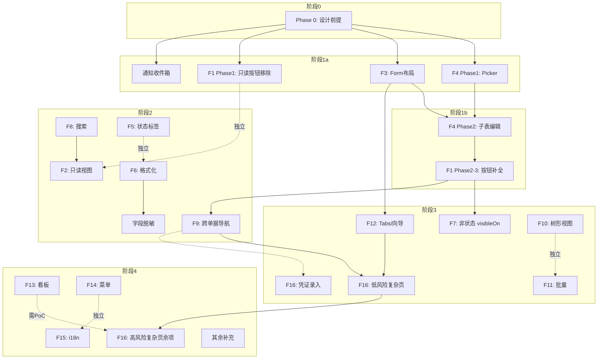

# Frontend UI Completeness Roadmap

> 最后更新：2026-07-19（v3 — 经全面审计 + 独立子代理审查：18+1 域 ui-patterns + Nop docs-for-ai + 架构文档 + 按钮审计 + 后端就绪度验证。详见 `docs/analysis/2026-07-19-frontend-ui-design-completeness-and-quality-analysis.md`。）
> 本路线图覆盖 view.xml 手写层的前端完整性。后端 3 个路线图（crud + core-business + extended）已全部 done。
> **实施阶段采用跨 F 集成阶段（Phase 0/1a/1b/2/3/4），而非 F 内独立阶段。**

## 背景

所有后端路线图已完成（154 模块 BUILD SUCCESS，E2E 测试全绿），但 view.xml 前端层存在大量缺口。

根因：路线图跟踪的是后端 BizModel/状态机/过账引擎，不跟踪 view.xml 定制。codegen 只生成 CRUD 骨架：
- 按钮：仅 add/edit/delete/view，域专用状态按钮需手写
- 表单：codegen 默认平铺字段，域专用分组需手写
- 列表：codegen 默认显示全部字段，域专用裁剪需手写
- 子表编辑、状态标签、跨单据导航、字段格式化等完全不生成

E2E 测试直接调 GraphQL mutation 绕过前端，全绿不反映前端缺口。

## 审计数据

| 维度 | 覆盖范围 | 结果来源 |
|------|---------|---------|
| 按钮 action | 23 域 394 实体 | 25 blocker（6.4%）、12 major（3.1%） |
| grid 列定制 | 18 域 | ~20% 实体有 bounded-merge，~80% codegen 默认 |
| form 布局分组 | 18 域 | ~12%（39/338 实体）有分隔线分组，其余 codegen 默认 |
| 子表编辑 child-table-editor | ~50+ 头行实体对 | 全部缺失 —— 最大缺口 |
| 状态标签着色 | ~150+ 业务实体 | 全部缺失 —— codegen 纯文本 |
| 字段格式化 | 全部实体 | 仅 `ui:number="true"`，无千分位/货币/精度 |
| visibleOn 条件 | 25 blocker 实体 | 未审计 —— 按钮可能缺可见性条件 |
| 关联 picker 定制 | ~200+ 外键字段 | codegen 默认，无领域专用选择器 |
| 搜索/过滤条件 | ~80+ 实体列表页 | codegen 默认 3-4 字段，ui-patterns 要求多维筛选 |
| 只读实体视图 | ~13+ 实体 | 全部缺失 —— 不应有编辑能力 |
| 复杂手写页面 | 16 页面（见 F16） | 全部缺失 —— 非标准 CRUD 结构 |

## 路线图

> 优先级：P0=业务流程阻断 → P1=用户可用性 → P2=完整性 → P3=润色
> 所有工作项完成后需通过回归测试验证（见下文「测试策略」）。

### F1 — 域专用状态迁移按钮补全（P0）

Status: `planned`（已有 `docs/plans/2026-07-19-1122-1-view-button-gap-fix.md`。执行阶段见分析报告 §10：跨 F 集成阶段 Phase 1a + 1b。）

25 blocker + 12 major 实体。

Cancel 按钮（DONE 前普通作废）在 10 个 blocker 实体中缺失，另有多处 major 级别缺漏。

- [ ] 实施见分析报告 §10 Phase 1a（只读实体按钮移除）+ Phase 1b（核心域 blocker 按钮补全）

**验收标准**：每新增按钮必须同时添加 `visibleOn` 条件（状态驱动）；回归测试 `*.action.spec.ts` 通过。

---

### F2 — 只读实体视图结构（P1）

Status: `todo`

约 13+ 只读实体（库存流水/余额/批次/序列号、GL 余额/试算平衡表、调拨日志等），需要：

1. **移除 CRUD 按钮**（F1 Phase 1 覆盖 10 实体；本项覆盖全部 13+，含额外只读实体）
2. **添加专用搜索/过滤区**（多维筛选，详见 F8 要求）
3. **移除编辑/新增表单**（`edit`/`add` form 移除或 `x:abstract="true"` 禁用）
4. **行点击展开详情 drawer**（如 `StockBalance` 行点击弹出流水明细）
5. **金额/数量列使用方向颜色**（正+负- 颜色区分）

受影响域：inventory、finance、aps 等。

**验收标准**：每只读实体 view.xml 实现「搜索 → 行点击 → 详情 drawer」模式；用户不可执行任何编辑/删除/新增操作。

---

### F3 — Form 布局分组（P0-P3 按域）

Status: `todo`

每域主实体 + 子实体，按 `ui-patterns.md` 设计分组。

布局模式（`layout x:override="replace"`）：
```
==========>baseInfo[基本信息]======
 field1 field2
==========>details[明细信息]======
 field3 field4 field5
==========>^audit[审计信息]=========
 field6 field7
```

实际分组以各域 `ui-patterns.md` 为准。

| 优先级 | 域 | 说明 |
|--------|----|------|
| P0 | core: purchase, sales, inventory, finance | 最常用，业务分组需求明确 |
| P1 | mfg: assets, manufacturing, projects, quality, maintenance | 状态复杂，分组设计已存在 |
| P2 | ext: crm, cs, hr, aps, logistics, b2b, contract, drp | 部分已定制，多数仍 codegen 默认 |
| P3 | master-data | 字典类实体，简单 layout 即可 |

**验收标准**：主表单 layout 包含分组标题（`====>` 格式），字段按业务语义而非 alphabet 排列。

---

### F4 — 子表行内编辑 + 关联 Picker（P0）

**合并 F9（Picker）为 F4 Phase 1，因为 Picker 是子表编辑的前置依赖。**

Status: `todo`

**覆盖范围**：所有头行实体对（~50+）。这是 view.xml 手写层**最大缺口**。

Phase 1 — 关联 Picker 定制：

| 选择器 | 定制内容 |
|--------|---------|
| 物料选择器 | 编码+名称+规格型号+库存单位+参考采购价+库存可用量 |
| 供应商选择器 | 编码+名称+税号+等级+状态 |
| 客户选择器 | 编码+名称+信用额度+应收余额 |
| 员工选择器 | 工号+姓名+部门+职位 |
| 资产选择器 | 编码+名称+类别+净值+状态 |
| 币种选择器 | 编码+名称+汇率 |
| 会计科目选择器 | 编码+名称+余额方向+科目类型 |

Phase 2 — 子表行内编辑：

每头行实体添加：
1. **child-table-editor / sub-form**：行内编辑表格，支持新增/删除行
2. **物料选择器 M2M**：弹窗选择（依赖 Phase 1）
3. **自动推算**：选择物料后自动填入名称/规格/单位/单价；数量变更后重算金额
4. **行校验**：数量>0、单价>0、金额=数量×单价
5. **子表 CRUD**：`add-line`、`delete-line`、`copy-line-from-order`

| Phase 2 优先级 | 域 | 头行实体 |
|--------|----|---------|
| P0 | purchase/sales | 8 对 |
| P1 | inventory/finance | 3 对 |
| P2 | mfg/assets/prj | 3 对 |
| P3 | ext 8 域 | 对应头行实体 |

> 注：P0 8 对 + P1 3 对 + P2 3 对 ≈ 14 对已分配，剩余 ~36+ 对（P3 ext 8 域）待具体确认。建议在实施 P0/P1 后再细化 P2/P3 的逐域映射。

---

### F5 — 状态标签与状态可视化（P1）

Status: `todo`

所有业务实体列表页的状态列（`docStatus`、`approveStatus`、`status`）需要：

1. **着色标签**：统一颜色映射（DRAFT=灰、SUBMITTED=蓝、APPROVED=绿、REJECTED=红、CANCELLED=灰删除线）
2. **状态栏/进度条**：详情页顶部显示当前状态 + 可选状态流转（如「已入库 X/Y 行」）
3. **组合状态概览**：如 `ErpPurOrder` 组合 `docStatus` + `approveStatus` 显示

推荐在 xmeta 层配置（`format`/`ui:mask`/`ui:statusLabel`），统一 18 域风格。

**受影响**：18 域，~150+ 业务实体

---

### F6 — 字段格式化（P1）

Status: `todo`

所有金额/数量/日期列的显示格式修复：

| 字段类型 | 格式要求 |
|---------|---------|
| 金额 | `#,##0.00` 千分位 + 右对齐 |
| 数量 | `#,##0.###` 千分位 + 右对齐 |
| 单价 | `#,##0.0000` 千分位 + 右对齐 |
| 日期 | `YYYY-MM-DD` 统一格式 |
| 百分比 | `0.00%` |
| 税率 | `0.0000` |

推荐在 xmeta 层配置（`format` 属性），避免逐 view.xml 定制。

**受影响**：~50+ 实体 × 5-15 金额/数量列

---

### F7 — 非状态驱动的 visibleOn 条件（P1）

Status: `todo`

F1 验收标准已覆盖状态驱动（`docStatus`/`approveStatus`）的 `visibleOn`。本项覆盖其他场景：

1. **字段值驱动的条件显示**：根据表单内其他字段值动态显隐（如库存移动单按作业类型显示/隐藏字段、财务凭证借方金额/贷方金额交替显示）
2. **配置门控的 UI 指示**：当功能依赖后端 `-Derp-*` 配置标志时，按钮/区域应在配置关闭时显示禁用/隐藏状态（通过 `@BizQuery` 返回配置状态而非域状态机）
3. **主数据特有交互模式**：
   - 编码唯一性前置校验（用户输入时异步检查）
   - 删除前引用预览（弹出 N 张单据引用确认）
   - 启用/停用 Switch 控件，带停用提示（主数据状态变更的快捷操作）

---

### F8 — 搜索/过滤条件增强（P1）

Status: `todo`

每域列表页的 query form 从 codegen 默认 3-4 字段扩展到域专用多维筛选。

| 域 | 示例筛选条件 |
|----|-------------|
| inventory: StockLedger | 物料 + 仓库 + 库位 + 批次 + 日期范围 + 业务类型 |
| inventory: StockBalance | 物料 + 仓库 + 库位 + 批次 + 含零库存勾选 |
| purchase: PurOrder | 供应商 + 物料 + 日期范围 + 状态 + 审批状态 |
| sales: SalOrder | 客户 + 物料 + 日期范围 + 状态 + 审批状态 |
| finance: Voucher | 凭证字 + 日期范围 + 会计期间 + 状态 |

各域具体筛选字段以 `ui-patterns.md` 为准。只读实体的搜索条件见 F2 §2。

---

### F9 — 跨单据导航与关联回链（P1）

Status: `todo`

详情页底部添加关联单据区：

1. **向上游导航**：来源单据链接（可点击跳转）
2. **向下游导航**：目标单据链接（可点击跳转）
3. **关联单据抽屉/弹窗**：点击单据号弹出快速查看
4. **一键跳转**：如采购订单页 → 创建入库单（携带订单上下文）

| 域 | 典型导航链 |
|----|-----------|
| purchase | RFQ → Quotation → PO → Receive → Invoice → Payment → Voucher |
| sales | Quotation → SO → Delivery → Invoice → Receipt → Voucher |
| inventory | StockMove → Source/Dest Bills → Related Moves → Ledger |
| manufacturing | WorkOrder → Material Issue → JobCard → Completion → Voucher |

---

### F10 — 树形实体视图（P2）

Status: `todo`

树形实体使用 AMIS `tree` / `tree-select` 组件：

| 实体 | 类型 |
|------|------|
| ErpMdMaterialCategory | 物料分类树 |
| ErpMdSubject | 会计科目树 |
| ErpAstCategory | 资产分类树 |
| ErpMfgBom | BOM 结构树 |
| ErpHrDepartment | 组织架构树 |
| ErpCsServiceCatalogItem | 服务目录树 |

标准 `<crud>` 不适用于树形结构，需要独立 `<form>` + `<tree>` 页面布局。需调用 `__findList` 获取树形数据（非 `__findPage`，分页不适用于树）。各树实体 BizModel 需确认已暴露 `findList`。

---

### F11 — 批量操作（P2）

Status: `todo`

列表页 toolbar 添加批量操作：

| 操作 | 适用域 |
|------|--------|
| 批量审批 | purchase/sales/quality |
| 从订单导入行 | purchase/sales Receive/Delivery |
| 自动核销 | finance Payment/Receipt |
| 批量导入 | master-data Partner/Material |
| 批量重新排程 | aps/manufacturing |

每个批量操作需要对应 `@BizMutation` 后端支持（已由后端路线图完成或待确认）。

---

### F12 — 页面结构增强（P2）

Status: `todo`

需要 tabs/向导/工作台页面的域（共 16 页面，与分析报告 §7.12 一致）：

| 域/实体 | 预期结构 |
|---------|---------|
| purchase: ErpPurOrder | 头+行 tabs |
| sales: ErpSalOrder | 头+行 tabs |
| inventory: ErpInvStockMove | 头+行+流水 tabs |
| finance: ErpFinVoucher | 头+行+凭证源 tabs |
| finance: ErpFinAccountingPeriod | 期末结账向导（5步：成本转结 → 汇兑损益 → 损益结转 → 凭证复审 → 结账） |
| manufacturing: ErpMfgWorkOrder | 头+行+工序+成本 tabs |
| projects: ErpPrjProject | 任务+预算+成本 tabs |
| projects/hr: Timesheet | 周网格录入（项目/任务为行，工作日为列，0.5h 步进，自动计算工时成本） |
| quality: ErpQaInspection | 行评测+结果+NCR tabs |
| assets: ErpAstAsset | 资产详情仪表板（双列：基本信息+财务信息，含折旧时间线、相关凭证列表） |
| maintenance: ErpMntVisit | 任务+备件+停机 tabs |
| maintenance: ErpMntEquipment | 设备详情仪表板（状态色块、维护时间线、到期预警、备件消耗） |
| crm: ErpCrmLead | 活动+时间线+报价 tabs |
| cs: ErpCsTicket | 活动+SLA+调查 tabs |
| hr: ErpHrEmployee | 基本信息+合同+薪酬+考勤+休假+工时 tabs |
| contract: ErpCtContract | 基本信息+合同行+版本历史+开票计划+消耗记录+附件 tabs |

（注意：drawer 弹窗已是 codegen 默认；本项聚焦 tabs、向导和工作台页面。）

---

### F13 — 非标准视图模式：Kanban/时间线/日历/看板（P2）

Status: `todo`

覆盖所有域的非标准列表视图——这些是业务实体视图，不同于经营看板（Non-Goal）。实现方式为 AMIS `crud` 之外的独立页面结构。

**看板类：**
1. **CRM 商机看板**：线索详情页 Kanban，支持拖拽阶段切换（isWonStage 列禁止拖出，丢失列只读）。阶段列从 ErpCrmStage 动态读取
2. **CS 工单看板**：按状态字典动态列，SLA 超时卡片含 🔴 标记。待分派列闪烁高亮，拖拽变更状态
3. **Project 任务看板**：4 列（TODO/IN_PROGRESS/DONE/BLOCKED），优先级颜色，BLOCKED 卡片必填阻塞原因

**时间线/日历类：**
4. **CRM 活动时间线**：时间倒序纵向时间线，类型图标 + 时间 + 标题 + 摘要
5. **CRM 活动日历**：日/周/月视图，活动数量标记，点击创建/编辑浮层
6. **CS 活动日志**：纵向操作时间线，操作人 + 时间 + from→to 状态变迁
7. **HR 团队休假日历**：月矩阵（行=员工，列=日期），休假类型颜色编码块，冲突检测

---

### F14 — Menu action-auth 对账（P3）

Status: `todo`

检查 18 域 `action-auth.xml`：

1. 所有业务实体页面菜单可达
2. 菜单 `orderNo` 按业务流程排列（非 codegen 字母序）
3. 菜单分组命名一致

看板/报表菜单已由既有计划覆盖。本项聚焦 CRUD 业务页面菜单。

---

### F15 — i18n 国际化标签补充（P3）

Status: `todo`

codegen 生成文件包含 `i18n-en:title`。手写层使用中文 `label` 或 `layout[标签]` 时应补充 `i18n-en` 覆盖。建议工具扫描手写层的 `label`，生成 i18n 补充条目。

---

### F16 — 核心复杂手写页面（P1-P2）

Status: `todo`

以下页面被 `docs/architecture/view-and-page-strategy.md` 及多域 `ui-patterns.md` 列为「复杂手写页面」，非标准 CRUD，需独立 view.xml 或 AMIS 定制。这些页面 F1-F15 无法覆盖。

| 域 | 页面 | 复杂度 | 核心交互 | 优先级 |
|----|------|--------|---------|--------|
| finance | 会计凭证录入 | ★★★ | 借贷平衡实时校验、科目树弹窗选取、辅助核算维度、自动平衡按钮、快捷模板 | P0 |
| finance | 凭证模板配置 | ★★★ | 按 businessType 分组、科目来源/金额占位符映射、预览测试生成凭证 | P1 |
| purchase | 三单匹配 | ★★★ | 采购订单/入库单/发票三表联查，数量/单价差异高亮，容差可视化 | P1 |
| inventory | 库存移动确认（PDA） | ★★★ | PDA 扫码、批次/序列号选取、库位树、操作用来驱动动态字段显隐 | P1 |
| aps | 排产甘特图 | ★★★ | Y=工作中心 X=时间线、拖拽调整、颜色编码、缩放（天/周/月）、约束叠加 | P1 |
| manufacturing | BOM 树浏览 | ★★★ | 多级展开/折叠、phantom 节点图标、工艺路线水平流向图 | P1 |
| manufacturing | 工单进度仪表板 | ★★★ | 4 阶段进度条（plan/pick/report/complete）、工时比颜色高亮、物料移动/JobCard 列表 | P1 |
| hr | 薪酬核算审批 | ★★★ | 汇总表（人数/应发/社保/个税/实发）、审批级联、导出 | P2 |
| hr | 组织架构图 | ★★★ | 树形组织图（节点含员工嵌入）、搜索高亮、点击跳转 | P2 |
| logistics | 发运追踪时间线 | ★★★ | 追踪时间线地图、包裹卡片、网关交互日志、预计送达超期警告 | P2 |
| b2b | EDI 事务详情 | ★★★ | 状态时间线、双栏报文查看（请求/响应）、语法高亮、交互日志 | P2 |
| b2b | ASN 五阶段流程条 | ★★☆ | ①已接收→②已匹配→③已校验→④待入库→⑤已入库，含明细行匹配状态 | P2 |
| contract | 合同版本对比 | ★★★ | 双栏 diff（新增=绿/删除=红/修改=黄）、数值差值箭头、仅差异行过滤 | P2 |
| drp | 净需求计算报表 | ★★★ | 按物料分组折叠、每列来源标注（Σ 公式可视化）、建议补货量可编辑 | P2 |
| quality | NCR 详情页 | ★★★ | 不合格信息 + 处理决定单选 + CAPA 内嵌表格 + 效果验证 | P1 |
| maintenance | 维护访问 4 步向导 | ★★★ | 步骤1:确认 → 2:备件消耗 → 3:执行结果 → 4:完成确认；备件实时库存量 | P1 |

---

## 测试策略

每个 F 项的实现必须附带对应测试更新，不可纯手工浏览验证。

| F# | 测试类型 | 现有基础设施 | 更新要求 | 缺口（分析报告 §14） |
|----|---------|-------------|---------|---------------------|
| F1 | `*.action.spec.ts`（业务动作） | `tests/e2e/business-actions/` | 每新增按钮至少 1 用例（点击→状态翻转断言） | — |
| F2 | `*.value.spec.ts` / `*.visual.spec.ts` | `tests/e2e/visual/` | 只读页面无 add/update/delete 按钮 | — |
| F3 | `*.visual.spec.ts` | `tests/e2e/visual/` | layout 变更后拍照/结构断言 | — |
| F4 | `*.write.spec.ts`（写路径） | `tests/e2e/crud/` + `_helper.ts` | 每头行对 1 用例（子表增删行+保存） | 🟡 自动推算/行校验/"从订单导入"未覆盖 |
| F5 | `*.visual.spec.ts` | `tests/e2e/visual/` | 状态标签颜色 token 断言 | — |
| F6 | `*.value.spec.ts` | `tests/e2e/visual/` | 千分位格式 token 断言 | — |
| F7 | `*.action.spec.ts` | `tests/e2e/business-actions/` | visibleOn 守卫用例（按钮在非法状态下不可见） | 🟡 visibleOn 引用的后端字段变更后，前端条件的回归测试 |
| F8-F15 | 组合 `*.visual.spec.ts` + `*.action.spec.ts` | 同上 | 如有新的交互路径 | |
| F9 | `*.visual.spec.ts` + `*.action.spec.ts` | 同上 | 每导航链路 1 用例 | 🟡 跳转后页面状态（参数传递是否正确）未覆盖；建议补充 E2E：点击链接→断言目标页 URL + 已选中记录 |
| F10 | `*.visual.spec.ts` | 同上 | 树展开折叠断言 | — |
| F11 | `*.action.spec.ts` | `tests/e2e/business-actions/` | 批量操作结果状态变更断言 | 🟡 批量操作结果（如批量审批后状态）未验证 |
| F12 | `*.visual.spec.ts` | `tests/e2e/visual/` | tab 切换后内容断言 | — |
| F13 | `*.visual.spec.ts` + 截图对比 | 待定 | 看板拖拽/日历日期变更 | ❌ 无自动测试策略；拖拽交互无法用标准 E2E 覆盖；建议：视觉效果用截图对比，拖拽用 Playwright `dragTo`（需 PoC） |
| F14 | 手动审计 | — | — | — |
| F15 | 手动 + CI check | — | — | 🟡 无自动化 i18n 条目验证；建议添加 CI check：扫描 `i18n-en:` key 是否都有对应值 |
| F16 | `*.visual.spec.ts` + `*.action.spec.ts` | `tests/e2e/visual/` | 每复杂页面至少 1 用例（核心交互路径断言） | ❌ 甘特图（拖拽/缩放）和版本对比（diff 渲染）无现成测试方案。自定义 AMIS 组件在 AMIS 升级后可能渲染失败。建议：自定义组件做快照测试 + 版本升级时回归验证全部自定义组件。 |

退出标准项 "回归测试通过" 指 `npx playwright test` 全绿。

---

## 依赖关系

本依赖图对应分析报告 §11 的跨 F 依赖分析：



F1-F3 可部分并行（阶段 1a）。F4 Phase1（Picker）是 Phase 2（子表编辑）的前置且依赖 F3 form 布局。F7 依赖 F1 完成。F9 依赖 F1 按钮 visibleOn。F12 为多数 F16 复杂页面提供 tabs/向导容器。F6 是字段脱敏的前置基础设施。

各阶段详细时间估计见分析报告 §10。

---

## 参考域方法

不设独立 F 项。按 F1-F15 推进时，选 **purchase/sales/inventory/finance** 4 个核心域作为首域（与分析报告 §10 Phase 1a 一致）。第一个完整核心域的前端实现自动成为其他域的参考模板。完成后在 `docs/` 记录其 view.xml 定制模式（参考 `docs/design/purchase/ui-patterns.md` 中的现有设计优先）。

选择理由：头行实体最多、状态机最完整、上下游链接最丰富。4 域并行可最大化模式复用（form 分组结构、子表编辑、审批按钮组等通用模式先完成设计模板）。

## 跨域建议

### 通用 UI 模式

1. **xmeta 层统一格式化**：金额千分位、精度、货币符号、日期格式在 `*.xmeta` 中配置一次，全域生效，避免逐 view.xml 定制。
2. **状态标签颜色映射**：统一在 `control.xlib` 或 xmeta `transformer` 中定义，确保 18 域风格一致。
3. **visibleOn 模式库**：收集常用 `visibleOn` 表达式（如 `docStatus != 'CANCELLED'`、`approveStatus == 'APPROVED'`），形成可复用片段。

### 跨切面 UI 模式（现有 F 项未覆盖）

以下为跨域共有的前端模式，需在实现过程中统一纳入：

4. **敏感字段脱敏**（cross-cutting）：hr 员工详情页的证件号、手机号、银行账户需脱敏显示（`**************`、`138****0000`、`工行****1234`）。logistics 承运商配置的 API Key/Secret 需默认脱敏（`sk****89ab`），查看需二次验证。建议在 xmeta 层或 view.xml 定制字段渲染，而非逐域硬编码。
5. **通知收件箱**（notify 域）：所有用户需要通知列表页面，支持未读/已读切换、批量标记已读、按类型筛选。当前通知仅有后端基础设施，无前端 UI。建议作为独立页面或全局侧边栏面板实现。（提示：notify 域实体使用 `ErpSys*` 前缀，属于 `module-notify`，非 `docs/design/notify`。暂无 `ui-patterns.md`。）
6. **删除/停用引用预览**（master-data + 全域）：主数据实体删除或停用前，前端需查询并展示引用该实体的未完成单据数，用户确认后才可执行。已部分在 F7 §3 提及，需统一实现模式。
7. **编码唯一性前置校验**（master-data）：物料编码、往来单位编码、科目编码等在用户输入时异步检查唯一性（`@BizQuery`），输入框旁实时显示 ✓/✗。已部分在 F7 §3 提及。
8. **Timesheet 周网格共享组件**（hr + projects）：行=任务/项目、列=星期、0.5h 步进、<40h 警告。当前两个域各自设计（`hr/ui-patterns.md` + `projects/ui-patterns.md`），建议合并为共享组件。P3。
9. **Barcode/PDA 扫描交互**（inventory + master-data）：扫描输入框的焦点管理、批量扫描缓冲、扫描成功/失败即时反馈。当前设计零散分布在 `inventory/ui-patterns.md` 和 `master-data/ui-patterns.md`。P3。
10. **敏感操作确认流程**（全域）：删除前置引用预览、反审核冲销预览、停用主数据业务影响预览。`domain-design-guidelines.md` §9 定义了删除策略但无统一前端确认流程设计。P3。

## Non-Goals

- 权限颗粒度（action-auth.xml 除菜单外）— 独立审计项
- 像素级视觉回归 — 独立测试计划
- 移动端/响应式适配 — 项目 2.x（AMIS 响应式支持存在但不在本项目范围）
- 键盘导航与无障碍深度优化 — Tab 顺序/快捷键为 AMIS 默认，不专项定制
- 加载状态与骨架屏统一设计 — AMIS `loadingConfig` 存在但不在本路线图覆盖
- 错误边界与异常 UI 全局兜底 — GraphQL 错误默认显示红色 Alert，不专项定制友好降级
- 主题/品牌定制 — 非产品需求
- 主题/品牌定制 — 非产品需求
- 后端 BizModel 方法 — 已有 3 个独立 roadmap（crud/core-business/extended）全 done
- 报表 AMIS 页面 — 已有 24 种子报表（nop-report）全落地
- 经营看板 AMIS 页面 — 已有 10 域看板后端+前端（独立计划覆盖）
- 平台 NopAuth 页面（用户/角色/菜单管理）— 非业务域
- EDI 网关配置（b2b 域后台连接器配置）— 基础设施
- PDA/条码扫描硬件集成 — 项目 2.x
- 智能预测/SPC 图表 — 专项功能

## 退出标准

- [ ] F1: 18 域主实体 view.xml 按钮完整（0 blocker, 0 major），每按钮含状态驱动 `visibleOn`（F7 覆盖非状态驱动场景）
- [ ] F2: ~13+ 只读实体实现「搜索 → 行点击 → 详情 drawer」模式，无编辑/删除入口
- [ ] F3: 18 域主实体 form layout 按 `ui-patterns.md` 分组
- [ ] F4 Phase1: 高频 picker（物料/供应商/客户/员工/资产/币种/科目）定制完成
- [ ] F4 Phase2: ~50+ 头行实体对的 child-table-editor 配置完成（含 M2M picker、自动推算、行校验）
- [ ] F5: 所有业务实体（~150+）状态列使用着色标签
- [ ] F6: 所有金额/数量/日期列使用千分位格式（xmeta 层统一配置）
- [ ] F7: 非状态驱动的 `visibleOn` 条件覆盖；主数据删除引用预览/启用停用 Switch 模式落地
- [ ] F8: 每域列表页查询条件从 3-4 字段扩展到域专用多维筛选
- [ ] F9: 核心域（purchase/sales/inventory/manufacturing）跨单据导航链接实现
- [ ] F10: 6 个树形实体使用 AMIS tree 组件页面
- [ ] F11: 核心域列表页批量操作（批量审批/导入/重新排程）实现
- [ ] F12: ~16 个 tabs/向导/仪表板页面结构实现（含 finance 结账向导、hr 员工详情 tabs、contract 多标签页、timesheet 周网格、assets 资产仪表板、maintenance 设备仪表板）
- [ ] F13: CRM 商机看板 + CS 工单看板 + Project 任务看板 + CRM 活动时间线/日历 + CS 活动日志 + HR 休假日历实现
- [ ] F14: 18 域 action-auth 菜单完整可达，排序按业务流程
- [ ] F15: i18n 中文 label 手写层全部补充 `i18n-en` 属性
- [ ] F16: 16 个复杂手写页面核心交互实现（凭证录入平衡校验、甘特图拖拽、三单匹配差异高亮、版本对比 diff、EDI 语法高亮等）
- [ ] 通知收件箱页面实现（未读/已读切换、批量标记已读、按类型筛选）
- [ ] 敏感字段脱敏覆盖（hr 证件号/手机/银行账户、logistics API Key/Secret）
- [ ] Timesheet 周网格共享组件实现（hr 考勤 + projects 工时录入合并）
- [ ] Barcode/PDA 扫描交互模式落地（inventory 移动确认 + master-data 条码录入）
- [ ] 敏感操作确认流程落地（删除引用预览、反审核冲销预览、停用业务影响预览）
- [ ] 回归测试：`npx playwright test` 全绿（每 F 项对应测试用例更新通过）
