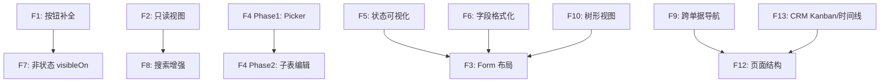

# Frontend UI Completeness Roadmap

> 最后更新：2026-07-19
> 本路线图覆盖 view.xml 手写层的前端完整性。后端 3 个路线图（crud + core-business + extended）已全部 done。

## 背景

所有后端路线图已完成（154 模块 BUILD SUCCESS，E2E 测试全绿），但 view.xml 前端层存在大量缺口。

根因：路线图跟踪的是后端 BizModel/状态机/过账引擎，不跟踪 view.xml 定制。codegen 只生成 CRUD 骨架：
- 按钮：仅 add/edit/delete/view，域专用状态按钮需手写
- 表单：codegen 默认平铺字段，域专用分组需手写
- 列表：codegen 默认显示全部字段，域专用裁剪需手写
- 子表编辑、状态标签、跨单据导航、字段格式化等完全不生成

E2E 测试直接调 GraphQL mutation 绕过前端，全绿不反映前端缺口。

## 审计数据

| 维度 | 覆盖范围 | 结果来源 |
|------|---------|---------|
| 按钮 action | 23 域 394 实体 | 25 blocker（6.4%）、12 major（3.1%） |
| grid 列定制 | 18 域 | ~20% 实体有 bounded-merge，~80% codegen 默认 |
| form 布局分组 | 18 域 | 部分有 `====>` 分组，多数无 |
| 子表编辑 child-table-editor | ~50+ 头行实体对 | 全部缺失 —— 最大缺口 |
| 状态标签着色 | ~150+ 业务实体 | 全部缺失 —— codegen 纯文本 |
| 字段格式化 | 全部实体 | 仅 `ui:number="true"`，无千分位/货币/精度 |
| visibleOn 条件 | 25 blocker 实体 | 未审计 —— 按钮可能缺可见性条件 |
| 关联 picker 定制 | ~200+ 外键字段 | codegen 默认，无领域专用选择器 |
| 搜索/过滤条件 | ~80+ 实体列表页 | codegen 默认 3-4 字段，ui-patterns 要求多维筛选 |
| 只读实体视图 | ~13+ 实体 | 全部缺失 —— 不应有编辑能力 |

## 路线图

> 优先级：P0=业务流程阻断 → P1=用户可用性 → P2=完整性 → P3=润色
> 所有工作项完成后需通过回归测试验证（见下文「测试策略」）。

### F1 — 域专用状态迁移按钮补全（P0）

Status: `planned`（已有 `docs/plans/2026-07-19-1122-1-view-button-gap-fix.md`）

25 blocker + 12 major 实体。

- [ ] Phase 0: 工具修复（已完成）
- [ ] Phase 1: 只读实体 CRUD 按钮移除（10 实体）
- [ ] Phase 2: 核心域 blocker 补全（inventory/finance/assets/manufacturing/purchase）
- [ ] Phase 3: 扩展域 blocker 补全（11 域）
- [ ] Phase 4: Cancel 按钮系统性补齐（7 域 17 实体）
- [ ] Phase 5: Major 残项补全

**验收标准**：每新增按钮必须同时添加 `visibleOn` 条件（状态驱动）；回归测试 `*.action.spec.ts` 通过。

---

### F2 — 只读实体视图结构（P1）

Status: `todo`

约 13+ 只读实体（库存流水/余额/批次/序列号、GL 余额/试算平衡表、调拨日志等），需要：

1. **移除 CRUD 按钮**（F1 Phase 1 覆盖 10 实体；本项覆盖全部 13+，含额外只读实体）
2. **添加专用搜索/过滤区**（多维筛选，详见 F8 要求）
3. **移除编辑/新增表单**（`edit`/`add` form 移除或 `x:abstract="true"` 禁用）
4. **行点击展开详情 drawer**（如 `StockBalance` 行点击弹出流水明细）
5. **金额/数量列使用方向颜色**（正+负- 颜色区分）

受影响域：inventory、finance、aps 等。

**验收标准**：每只读实体 view.xml 实现「搜索 → 行点击 → 详情 drawer」模式；用户不可执行任何编辑/删除/新增操作。

---

### F3 — Form 布局分组（P0-P3 按域）

Status: `todo`

每域主实体 + 子实体，按 `ui-patterns.md` 设计分组。

布局模式（`layout x:override="replace"`）：
```
==========>baseInfo[基本信息]======
 field1 field2
==========>details[明细信息]======
 field3 field4 field5
==========>^audit[审计信息]=========
 field6 field7
```

实际分组以各域 `ui-patterns.md` 为准。

| 优先级 | 域 | 说明 |
|--------|----|------|
| P0 | core: purchase, sales, inventory, finance | 最常用，业务分组需求明确 |
| P1 | mfg: assets, manufacturing, projects, quality, maintenance | 状态复杂，分组设计已存在 |
| P2 | ext: crm, cs, hr, aps, logistics, b2b, contract, drp | 部分已定制，多数仍 codegen 默认 |
| P3 | master-data | 字典类实体，简单 layout 即可 |

**验收标准**：主表单 layout 包含分组标题（`====>` 格式），字段按业务语义而非 alphabet 排列。

---

### F4 — 子表行内编辑 + 关联 Picker（P0）

**合并 F9（Picker）为 F4 Phase 1，因为 Picker 是子表编辑的前置依赖。**

Status: `todo`

**覆盖范围**：所有头行实体对（~50+）。这是 view.xml 手写层**最大缺口**。

Phase 1 — 关联 Picker 定制：

| 选择器 | 定制内容 |
|--------|---------|
| 物料选择器 | 编码+名称+规格型号+库存单位+参考采购价+库存可用量 |
| 供应商选择器 | 编码+名称+税号+等级+状态 |
| 客户选择器 | 编码+名称+信用额度+应收余额 |
| 员工选择器 | 工号+姓名+部门+职位 |
| 资产选择器 | 编码+名称+类别+净值+状态 |
| 币种选择器 | 编码+名称+汇率 |
| 会计科目选择器 | 编码+名称+余额方向+科目类型 |

Phase 2 — 子表行内编辑：

每头行实体添加：
1. **child-table-editor / sub-form**：行内编辑表格，支持新增/删除行
2. **物料选择器 M2M**：弹窗选择（依赖 Phase 1）
3. **自动推算**：选择物料后自动填入名称/规格/单位/单价；数量变更后重算金额
4. **行校验**：数量>0、单价>0、金额=数量×单价
5. **子表 CRUD**：`add-line`、`delete-line`、`copy-line-from-order`

| Phase 2 优先级 | 域 | 头行实体 |
|--------|----|---------|
| P0 | purchase/sales | 8 对 |
| P1 | inventory/finance | 3 对 |
| P2 | mfg/assets/prj | 3 对 |
| P3 | ext 8 域 | 对应头行实体 |

---

### F5 — 状态标签与状态可视化（P1）

Status: `todo`

所有业务实体列表页的状态列（`docStatus`、`approveStatus`、`status`）需要：

1. **着色标签**：统一颜色映射（DRAFT=灰、SUBMITTED=蓝、APPROVED=绿、REJECTED=红、CANCELLED=灰删除线）
2. **状态栏/进度条**：详情页顶部显示当前状态 + 可选状态流转（如「已入库 X/Y 行」）
3. **组合状态概览**：如 `ErpPurOrder` 组合 `docStatus` + `approveStatus` 显示

推荐在 xmeta 层配置（`format`/`ui:mask`/`ui:statusLabel`），统一 18 域风格。

**受影响**：18 域，~150+ 业务实体

---

### F6 — 字段格式化（P1）

Status: `todo`

所有金额/数量/日期列的显示格式修复：

| 字段类型 | 格式要求 |
|---------|---------|
| 金额 | `#,##0.00` 千分位 + 右对齐 |
| 数量 | `#,##0.###` 千分位 + 右对齐 |
| 单价 | `#,##0.0000` 千分位 + 右对齐 |
| 日期 | `YYYY-MM-DD` 统一格式 |
| 百分比 | `0.00%` |
| 税率 | `0.0000` |

推荐在 xmeta 层配置（`format` 属性），避免逐 view.xml 定制。

**受影响**：~50+ 实体 × 5-15 金额/数量列

---

### F7 — 非状态驱动的 visibleOn 条件（P1）

Status: `todo`

F1 验收标准已覆盖状态驱动（`docStatus`/`approveStatus`）的 `visibleOn`。本项覆盖其他场景：

1. **字段值驱动的条件显示**：根据表单内其他字段值动态显隐（如库存移动单按作业类型显示/隐藏字段、财务凭证借方金额/贷方金额交替显示）
2. **配置门控的 UI 指示**：当功能依赖后端 `-Derp-*` 配置标志时，按钮/区域应在配置关闭时显示禁用/隐藏状态（通过 `@BizQuery` 返回配置状态而非域状态机）
3. **主数据特有交互模式**：
   - 编码唯一性前置校验（用户输入时异步检查）
   - 删除前引用预览（弹出 N 张单据引用确认）
   - 启用/停用 Switch 控件，带停用提示

---

### F8 — 搜索/过滤条件增强（P1）

Status: `todo`

每域列表页的 query form 从 codegen 默认 3-4 字段扩展到域专用多维筛选。

| 域 | 示例筛选条件 |
|----|-------------|
| inventory: StockLedger | 物料 + 仓库 + 库位 + 批次 + 日期范围 + 业务类型 |
| inventory: StockBalance | 物料 + 仓库 + 库位 + 批次 + 含零库存勾选 |
| purchase: PurOrder | 供应商 + 物料 + 日期范围 + 状态 + 审批状态 |
| sales: SalOrder | 客户 + 物料 + 日期范围 + 状态 + 审批状态 |
| finance: Voucher | 凭证字 + 日期范围 + 会计期间 + 状态 |

各域具体筛选字段以 `ui-patterns.md` 为准。只读实体的搜索条件见 F2 §2。

---

### F9 — 跨单据导航与关联回链（P1）

Status: `todo`

详情页底部添加关联单据区：

1. **向上游导航**：来源单据链接（可点击跳转）
2. **向下游导航**：目标单据链接（可点击跳转）
3. **关联单据抽屉/弹窗**：点击单据号弹出快速查看
4. **一键跳转**：如采购订单页 → 创建入库单（携带订单上下文）

| 域 | 典型导航链 |
|----|-----------|
| purchase | RFQ → Quotation → PO → Receive → Invoice → Payment → Voucher |
| sales | Quotation → SO → Delivery → Invoice → Receipt → Voucher |
| inventory | StockMove → Source/Dest Bills → Related Moves → Ledger |
| manufacturing | WorkOrder → Material Issue → JobCard → Completion → Voucher |

---

### F10 — 树形实体视图（P2）

Status: `todo`

树形实体使用 AMIS `tree` / `tree-select` 组件：

| 实体 | 类型 |
|------|------|
| ErpMdMaterialCategory | 物料分类树 |
| ErpMdSubject | 会计科目树 |
| ErpAstCategory | 资产分类树 |
| ErpMfgBom | BOM 结构树 |
| ErpHrDepartment | 组织架构树 |
| ErpCsServiceCatalogItem | 服务目录树 |

标准 `<crud>` 不适用于树形结构，需要独立 `<form>` + `<tree>` 页面布局。

---

### F11 — 批量操作（P2）

Status: `todo`

列表页 toolbar 添加批量操作：

| 操作 | 适用域 |
|------|--------|
| 批量审批 | purchase/sales/quality |
| 从订单导入行 | purchase/sales Receive/Delivery |
| 自动核销 | finance Payment/Receipt |
| 批量导入 | master-data Partner/Material |
| 批量重新排程 | aps/manufacturing |

每个批量操作需要对应 `@BizMutation` 后端支持（已由后端路线图完成或待确认）。

---

### F12 — 页面结构增强（P2）

Status: `todo`

需要 tabs/向导/工作台页面的域：

| 域/实体 | 预期结构 |
|---------|---------|
| purchase: ErpPurOrder | 头+行 tabs |
| sales: ErpSalOrder | 头+行 tabs |
| inventory: ErpInvStockMove | 头+行+流水 tabs |
| finance: ErpFinVoucher | 头+行+凭证源 tabs |
| manufacturing: ErpMfgWorkOrder | 头+行+工序+成本 tabs |
| projects: ErpPrjProject | 任务+预算+成本 tabs |
| quality: ErpQaInspection | 行评测+结果+NCR tabs |
| maintenance: ErpMntVisit | 任务+备件+停机 tabs |
| crm: ErpCrmLead | 活动+时间线+报价 tabs |
| cs: ErpCsTicket | 活动+SLA+调查 tabs |

（注意：drawer 弹窗已是 codegen 默认；本项聚焦 tabs 和工作台页面。）

---

### F13 — 非标准视图模式：Kanban/时间线/日历（P2）

Status: `todo`

CRM `ui-patterns.md` 定义的非标准列表视图：

1. **商机看板**：线索详情页 Kanban 视图，支持拖拽阶段切换
2. **活动时间线**：纵向时间线组件展示所有关联活动
3. **活动日历**：日历视图展示 CRM 事件

这些是业务实体视图，不同于经营看板（Non-Goal）。实现方式为 AMIS `crud` 之外的独立页面结构，对应 CRM 域 `ui-patterns.md` 要求。

---

### F14 — Menu action-auth 对账（P3）

Status: `todo`

检查 18 域 `action-auth.xml`：

1. 所有业务实体页面菜单可达
2. 菜单 `orderNo` 按业务流程排列（非 codegen 字母序）
3. 菜单分组命名一致

看板/报表菜单已由既有计划覆盖。本项聚焦 CRUD 业务页面菜单。

---

### F15 — i18n 国际化标签补充（P3）

Status: `todo`

codegen 生成文件包含 `i18n-en:title`。手写层使用中文 `label` 或 `layout[标签]` 时应补充 `i18n-en` 覆盖。建议工具扫描手写层的 `label`，生成 i18n 补充条目。

---

## 测试策略

每个 F 项的实现必须附带对应测试更新，不可纯手工浏览验证。

| F# | 测试类型 | 现有基础设施 | 更新要求 |
|----|---------|-------------|---------|
| F1 | `*.action.spec.ts`（业务动作） | `tests/e2e/business-actions/` | 每新增按钮至少 1 用例（点击→状态翻转断言） |
| F2 | `*.value.spec.ts` / `*.visual.spec.ts` | `tests/e2e/visual/` | 只读页面无 add/update/delete 按钮 |
| F3 | `*.visual.spec.ts` | `tests/e2e/visual/` | layout 变更后拍照/结构断言 |
| F4 | `*.write.spec.ts`（写路径） | `tests/e2e/crud/` + `_helper.ts` | 每头行对 1 用例（子表增删行+保存） |
| F5 | `*.visual.spec.ts` | `tests/e2e/visual/` | 状态标签颜色 token 断言 |
| F6 | `*.value.spec.ts` | `tests/e2e/visual/` | 千分位格式 token 断言 |
| F7 | `*.action.spec.ts` | `tests/e2e/business-actions/` | visibleOn 守卫用例（按钮在非法状态下不可见） |
| F8-F15 | 组合 `*.visual.spec.ts` + `*.action.spec.ts` | 同上 | 如有新的交互路径 |

退出标准项 "回归测试通过" 指 `npx playwright test` 全绿。

---

## 依赖关系



F1-F3 无依赖可并行。F4 Phase1（Picker）是 Phase 2（子表编辑）的前置。F7 涵盖 F1 验收标准之外的非状态 visibleOn。

---

## 参考域方法

不设独立 F 项。按 F1-F15 推进时，选 **purchase** 作为首域。第一个完整采购域的前端实现自动成为其他域的参考模板。完成后在 `docs/` 记录其 view.xml 定制模式（参考 `docs/design/purchase/ui-patterns.md` 中的现有设计）。

选择理由：头行实体最多、状态机最完整、上下游链接最丰富。

## 跨域建议

1. **xmeta 层统一格式化**：金额千分位、精度、货币符号、日期格式在 `*.xmeta` 中配置一次，全域生效，避免逐 view.xml 定制。
2. **状态标签颜色映射**：统一在 `control.xlib` 或 xmeta `transformer` 中定义，确保 18 域风格一致。
3. **visibleOn 模式库**：收集常用 `visibleOn` 表达式（如 `docStatus != 'CANCELLED'`、`approveStatus == 'APPROVED'`），形成可复用片段。

## Non-Goals

- 权限颗粒度（action-auth.xml 除菜单外）
- 像素级视觉回归
- 移动端/响应式适配
- 主题/品牌定制
- 后端 BizModel 方法（已有独立 roadmap）
- 报表/看板 AMIS 页面（已有独立计划覆盖）

## 退出标准

- [ ] F1: 18 域主实体 view.xml 按钮完整（0 blocker, 0 major），每按钮含状态驱动 `visibleOn`（F7 覆盖非状态驱动场景）
- [ ] F2: ~13+ 只读实体实现「搜索 → 行点击 → 详情 drawer」模式，无编辑/删除入口
- [ ] F3: 18 域主实体 form layout 按 `ui-patterns.md` 分组
- [ ] F4 Phase1: 高频 picker（物料/供应商/客户/员工/资产/币种/科目）定制完成
- [ ] F4 Phase2: ~50+ 头行实体对的 child-table-editor 配置完成（含 M2M picker、自动推算、行校验）
- [ ] F5: 所有业务实体（~150+）状态列使用着色标签
- [ ] F6: 所有金额/数量/日期列使用千分位格式（xmeta 层统一配置）
- [ ] F7: 非状态驱动的 `visibleOn` 条件覆盖；主数据删除引用预览/启用停用 Switch 模式落地
- [ ] F8: 每域列表页查询条件从 3-4 字段扩展到域专用多维筛选
- [ ] F9: 核心域（purchase/sales/inventory/manufacturing）跨单据导航链接实现
- [ ] F10: 6 个树形实体使用 AMIS tree 组件页面
- [ ] F11: 核心域列表页批量操作（批量审批/导入/重新排程）实现
- [ ] F12: ~10 个 tabs/向导页面结构实现
- [ ] F13: CRM 商机看板/活动时间线/活动日历实现
- [ ] F14: 18 域 action-auth 菜单完整可达，排序按业务流程
- [ ] F15: i18n 中文 label 手写层全部补充 `i18n-en` 属性
- [ ] 回归测试：`npx playwright test` 全绿（每 F 项对应测试用例更新通过）
