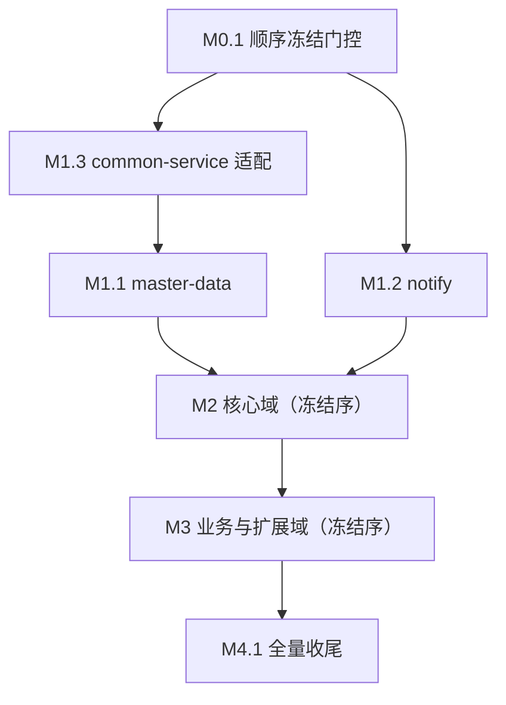

# 主键/外键 stdDataType string 化迁移路线图（BIGINT PK/FK → String）

> 最后更新：2026-08-16（M0 创建 + 3 轮独立子代理审查修订 + 用户裁决「快照每域重录、不依赖 Number 宽容」+「Java 层全覆盖确认」。全工作项 `todo`，M0 完成后按冻结顺序展开 M1-M3 域迁移，M4 收尾）
> 来源：用户请求（「将主键和外键的数据类型全部改成 string」）+ `nop-entropy/docs-for-ai/02-core-guides/orm-model-design.md` §主键设计强制规则
> 现状：`tools/check-bigint-id-types.mjs` 已建成（scan/dry-run/apply 三模式）；scan + dry-run 已通过（19 文件、1605 列、零残留、幂等），副本在 `_tmp/bigint-id-string-fix/`（**未回写任何源文件**）。详见 `docs/logs/2026/08-13.md` 首条。

## 目的

本路线图覆盖 nop-app-erp 全部 19 个 `model/*.orm.xml` 的 **PK（463）/ FK（1142）共 1605 列 `stdDataType="long"→"string"` 集中改造**（DB 列保持 BIGINT、`tagSet="seq-default"` 不变，仅 Java 属性/GraphQL 类型/前端值变 String；规则与机制见 `orm-model-design.md` §主键设计方案 B）。引用 `docs/backlog/00-roadmap-authoring-guide.md` 作为规范。

**完成态 Java 层全覆盖确认（2026-08-16 用户裁决）**：mission 完成后，全部 19 个域的所有主键与外键在 **Java 层均为 `String`**：
- PK 463 列：全部为 `id` 命名 + BIGINT（无复合主键、无其他类型），1605 列改造全覆盖 → String；
- FK 1182 列：BIGINT 1142 列（含 `orgId` 226 列、`calibratedBy` 等非 `*Id` 命名 join 外键）经改造 → String；**非 BIGINT 外键 40 列实测全部为 VARCHAR 且（除 1 处缺省）显式 `stdDataType="string"`——Java 层本来就是 String，不需改动**（dry-run 副本已核查零误改）。
- **数据库层面零改动**：`stdSqlType` 全保持原值（BIGINT 保持 BIGINT、VARCHAR 保持 VARCHAR），DDL 不变，CSV 种子/序列号引擎不受影响。
- 边界说明：未分类 BIGINT 列 368（delVersion/fileSize/durationMs/孤儿操作人列等）**非主键非外键**，不在本 mission 范围、保持 `long`（孤儿操作人列建模问题已登记 follow-up，另案裁决）。

**这不是一次性全局 apply + 全量修复**，而是**逐域增量迁移**：每域一个原子工作项（orm 变更 → 增量重生成 → 编译器驱动修复手写代码 → 域级 build/test verify），按 **M0 冻结的模块级依赖拓扑序**推进。中间态仓库全量构建失败属**设计使然**（未迁移域源码引用已迁移域的 String API），因此**每个域 plan 的 build verify 限定域级 `-am` 构建**，全量构建/全量测试/E2E 修复只发生在 M4 收尾 plan。

## Work Item Status

> 唯一动态状态块。状态：`todo` / `ready` / `done`。M0 冻结依赖序之前，任何域迁移工作项不得转为 `ready`。

### Milestone M0 — 准备与 Proof（顺序冻结门控）

| Work Item | 描述 | 状态 | 依赖 |
| --- | --- | --- | --- |
| M0.1 | 工具 scope 化 + 依赖序冻结 + 跨域 id 调用点审计 + Proofs（seq-string 行为 / 快照兼容 / E2E 影响） | `todo` | — |

### Milestone M1 — 根域 + 跨域基础设施迁移（先迁移，被全部业务域 R 引用）

| Work Item | 描述 | 状态 | 依赖 |
| --- | --- | --- | --- |
| M1.3 | common-service 组织隔离适配（`ErpOrgContext`/`ErpOrgIsolationOrmInterceptor`/`QueryTransformer` 的 orgId Long 语义，走反射 API 编译器不报错；**master-data orm.xml 含 6 个 orgId FK 列，必须先于 M1.1 完成**） | `todo` | M0.1 |
| M1.1 | master-data 域迁移（根域，~120 处被引用，先导试点） | `todo` | M0.1 + M1.3 |
| M1.2 | notify 域迁移（跨域通知派发子系统，唯一无 orgId 域） | `todo` | M0.1 |

### Milestone M2 — 核心域迁移（冻结序占位，M0.1 写回后重排）

> **表内顺序为占位参考（实测可行前缀），非最终序**：M0.1 冻结后按冻结序重排本表与依赖链。实测 compile 级模块图无环，finance 先行可解开全部域级合并环。

| Work Item | 描述 | 状态 | 依赖 |
| --- | --- | --- | --- |
| M2.1 | finance 域迁移（被 6 域 S 写 + 12 域 service compile 依赖；实测 compile 依赖 inv/ast/pur/sal/prj/notify dao） | `todo` | M0.1 + 冻结序全部前置项 done |
| M2.2 | inventory 域迁移（被 purchase/sales/mfg/mnt/qa/crm/aps/drp/log/fin 等 11 域 service compile 依赖） | `todo` | M0.1 + 冻结序全部前置项 done |
| M2.3 | quality 域迁移 | `todo` | M0.1 + 冻结序全部前置项 done |
| M2.4 | assets 域迁移（被 finance ORM 引用；ast-service 依赖 fin-service） | `todo` | M0.1 + 冻结序全部前置项 done |
| M2.5 | purchase 域迁移 | `todo` | M0.1 + 冻结序全部前置项 done |
| M2.6 | sales 域迁移 | `todo` | M0.1 + 冻结序全部前置项 done |
| M2.7 | projects 域迁移（被 finance/purchase/sales/hr 引用；prj-service 实测 compile 依赖 ast-service + fin-service） | `todo` | M0.1 + 冻结序全部前置项 done |

### Milestone M3 — 业务与扩展域迁移（冻结序占位，M0.1 写回后重排）

| Work Item | 描述 | 状态 | 依赖 |
| --- | --- | --- | --- |
| M3.1 | manufacturing 域迁移 | `todo` | M0.1 + 冻结序全部前置项 done |
| M3.2 | maintenance 域迁移（依赖 md/inv/ast） | `todo` | M0.1 + 冻结序全部前置项 done |
| M3.3 | hr 域迁移（依赖 md/prj） | `todo` | M0.1 + 冻结序全部前置项 done |
| M3.4 | crm 域迁移 | `todo` | M0.1 + 冻结序全部前置项 done |
| M3.5 | cs 域迁移 | `todo` | M0.1 + 冻结序全部前置项 done |
| M3.6 | contract 域迁移 | `todo` | M0.1 + 冻结序全部前置项 done |
| M3.7 | drp 域迁移 | `todo` | M0.1 + 冻结序全部前置项 done |
| M3.8 | b2b 域迁移 | `todo` | M0.1 + 冻结序全部前置项 done |
| M3.9 | aps 域迁移 | `todo` | M0.1 + 冻结序全部前置项 done |
| M3.10 | logistics 域迁移 | `todo` | M0.1 + 冻结序全部前置项 done |

### Milestone M4 — 收尾（全量恢复）

| Work Item | 描述 | 状态 | 依赖 |
| --- | --- | --- | --- |
| M4.1 | 全量构建恢复 + 全量测试 + E2E 套件修复 + compliance + baseline + 文档 | `todo` | 全部 M1-M3 |

## 框架/平台复用

- **ORM 生成机制**：codegen 由 `model/*.orm.xml` 驱动，`stdDataType` 变更后 `mvn clean install -pl <域> -am -DskipTests` 增量重生成 `_gen/` 实体、I\*Biz 接口、xmeta、view、api 契约，**不需要手改生成件**。
- **ID 生成**：`tagSet="seq-default"` + BIGINT 列 → `OrmEntityIdGenerator.genSeq` 按 DB 类型走 `generateLong` 序列号引擎，Entity setter 自动 `ConvertHelper.toString` 转 String（`orm-model-design.md` §主键设计已明确）。CSV 种子显式 id 存活（`seq` 保留显式非空值，`2026-08-09-2107-1` 计划已实证小整数 userId 存活）。
- **测试兼容（用户裁决 2026-08-16）**：快照测试**不依赖 `JsonMatchHelper` Number 宽容**——每域 plan 在编译错误修复完成后执行 RECORDING→CHECKING **每域重录**（标准 Nop 流程，id 从数字变字符串后的快照以新形态落盘），重录为 M1-M3 标准结构 Phase 3 的固定步骤。
- **工具**：`tools/check-bigint-id-types.mjs` dry-run 产物即逐文件修正副本，可 per-domain 复制回写；scan 支持交叉校验残留。

## 当前基线

- 19 个 orm.xml，PK 463（全 BIGINT）+ FK 1182（BIGINT 1142 + 非 BIGINT 40，n/a），PK+FK 双角色 0，实际修改 1605 列 = BIGINT PK 463 + BIGINT FK 1142；`delVersion` 等非 PK/FK BIGINT 列保持 long 不动（工具 scan 未分类 BIGINT 共 368，构成分解以工具输出为准：351 delVersion + 12 fileSize/durationMs + ~5 孤儿操作人列，均不在改造范围）。
- `stdSqlType` 全保持 BIGINT（工具仅改 `stdDataType`），DB DDL 零变化；CSV 种子、`NOP_SYS_SEQUENCE`（E2E `zz-sequence-advance.sql`）不受影响。
- 手写代码冲击面（实测）：`.getId()` 调用 1026 处（`rg -c "\.getId\(\)" module-*/erp-*-service/src/main/java`）；`Long xxxId` 声明口径差异大（声明 ~2020，含类型/变量/方法签名合计 ~2680 occurrence，按域分布见 M0.1 复核）；测试代码（request.json5、断言）与 E2E spec（`Number(lnk.voucherId)` 实测 11 处、`eqFilter('id', ...)`）需要同步修复。复核命令：`rg -c "\.getId\(\)|Long [a-zA-Z]*Id" module-*/erp-*-service/src/main/java`。
- **`module-common-service` 组织隔离代码（新增基线）**：`ErpOrgContext.currentOrgId` 返回 `Long`（org/ErpOrgContext.java:30,44）、`ErpOrgIsolationOrmInterceptor.stampOrgId` 做 `orgId.equals(current)` 后写值（:50,:53）、`ErpOrgIsolationQueryTransformer` 构造 `FilterBeans.eq(orgId)`（:60-61）。orgId 是 226 列的真实 FK（工具 scan 标记 `NEEDS FIX`；orm.xml 中 `name="orgId"` 出现 404 次含 178 处 `<index>` 内索引成员引用，扣除后 = 226），迁移后 `Long.equals(String)` 恒 false → 隔离开启时每次 save 重复 stamp、QueryTransformer 过滤值类型错。这些代码走反射 API **不产生编译错误**，属 §3 语义陷阱类别，由 M1.3 工作项显式覆盖（**归属已指派，不再落入空白区**）。
- **已核零存在面**：仓内无 sql-lib.xml / 手写 xbiz.xml / task.xml（xbiz 仅 `app-erp-all/_dump/` 运行时产物）；api 模块 19 个全部 codegen 生成件、零手写。**dao 模块惰性假设待审**：dao 模块手写跨域 import 极少——实体跨域 import 仅 crm-dao 3 处（`IErpCrmLeadBiz`/`IErpCrmConversionBiz`/`IErpCrmProductConfiguratorBiz` 引入 md/sal 实体，类型级用法非 `.getId()` 赋 Long）+ 非实体跨域 import 4 行（pur/sal-dao 引入 `app.erp.md.biz.SettlementAllocation`、`app.erp.md.dao.daterange.IDateRange`，md 为最先迁移域非 id 类型耦合），交叉引用主体在 `_gen`——「惰性可编译」成立性由 M0.1 审计 ③ 逐域证实（枚举全部跨域 import），证伪则该域并入前置域 plan。
- 模块级依赖 DAG 无环（Maven 156 模块可构建）；**域级合并依赖存在环**（如 assets↔finance：ast-dao→fin-dao 与 fin-service→ast-dao 交叉；purchase↔finance：pur-service→fin-service 与 fin-service→pur-dao；projects→finance：prj-service→ast-service→fin-service 与 fin-service→prj-dao）——**环全部是"合并域级"的 dao/service 交叉，编译级模块图无真环**（实测：compile 边 prj-service→ast-service 见 prj pom:52-57；sal→qa、mfg→qa 为 test-scope 边，qa 侧用 `test-mock-sales.beans.xml` 桩避免反向 test 依赖），由 M0.1 跨域审计裁决。

## Milestones

### M0 — 准备与 Proof

M0 是唯一包含顺序冻结门控的里程碑。M0.1 完成后，将冻结的**精确域迁移顺序**、**跨域 id 调用点清单**、**Proof 结论**写回本路线图（M2/M3 占位表按冻结顺序重排 + 依赖链 + **核验 M1 内部序（common-service 先于首个含 orgId 域）**，工作项保持原子可标记）。

### M1-M3 — 逐域迁移

每域一个原子工作项，标准结构（写入各 plan）：
- **Phase 1**：从 `_tmp/bigint-id-string-fix/<module>/model/*.orm.xml` 复制该域修正副本回写源文件（仅该域），`git diff` 审核仅 `stdDataType` 变化。
- **Phase 2**：增量重生成 + 主代码编译修复：`mvn clean install -pl <域模块> -am -DskipTests`（编译器错误即清单，逐条修复；`-Dmaven.test.skip=true` 先行隔离测试编译）。
- **Phase 3**：测试代码修复 + **快照每域重录**（RECORDING→CHECKING，用户裁决——不依赖 Number 宽容）+ 域级测试：`mvn test -pl <域 service> -am`。
- **Phase 4**：语义陷阱 grep 门控（见横切关注点 §3）+ owner doc 注记 + 日志。
- **verify**：域级 `mvn clean install -pl <域模块> -am -DskipTests` 全绿 + `mvn test -pl <域 service> -am` 全绿。**不跑全量构建**（中间态设计使然）。

**预期技能**（写入各 plan 的 `Skill:` 行）：M0.1 → `orm-model-audit-prompt` + `cross-module-dependency-audit-prompt`；域迁移 plan → `nop-backend-dev` + `nop-testing`；M4.1 → `nop-testing` + `compliance-baseline-drift-adjudication-prompt`。

### M4 — 收尾

全量恢复 plan：`mvn clean install -DskipTests`（156 模块）→ 全量 `mvn test` → E2E 套件 id 断言修复（`Number()`→字符串/`eqFilter` 调整）→ `nop-compliance-checker.sh` → baseline 更新 → `domain-design-guidelines.md` §16A 已知偏离表（13 个 `Long id` 实体行 → 全部完成）→ 快照重录全量复查（每域重录后的 `_cases/` 与 Java String id 一致性）→ daily log。

## Work Item Details

- **M0.1**：① 工具支持 per-domain scope（或 plan 直接复制 `_tmp/` 单文件，M0 裁定）；② 依赖序冻结——脚本解析全部 pom（dao/service/meta/web/api 层，**compile 闭包与 test 闭包分开建模**：`mvn test -am` 会拉 test-scope 依赖入 reactor，如 sal→qa-service、mfg→qa-service test 边，须先实测本机 Maven 对 `-am` 含 test-scope 的真实行为）构造模块级 DAG + 域级闭包，迭代选出可行迁移序列。**判据（精确表述）**：「域 D 可行 ⟺ closure(D) ∩ 未迁移域 = 仅含经审计 ③ 证实的惰性 dao 模块 ∪ 自身」——dao 模块无手写跨域实体 import（已核仅 crm-dao 3 处类型级用法 + pur/sal-dao 4 行非实体 import，待逐域证实）故可先行/惰性共存；若某域 dao 模块经审计 ③ 证伪（存在手写跨域 id 类型耦合），该域并入其前置域 plan 或延后。compile 级模块图实测无真环，环全部是域级合并的 dao/service 交叉，finance 先行可解开；③ 跨域实体引用与 id 用法审计（`daoFor(Erp*)`/`I*Biz` 调用点中 `getId()`/`setXxxId(Long)` 用法 + **common-service 三文件 orgId 语义**，判定「把对方实体 id 当 Long 用」的耦合点清单，逐域证实「惰性 dao 假设」）；④ Proofs——seq-string 行为（域内 entity 无显式 id 保存 → id 为 String 非空）、E2E 影响面（`Number(lnk.voucherId)` 实测 11 处、`Number(` 全 e2e 计数以复测为准 ~800+）。**快照重录为每域 plan 固定步骤（用户裁决），不再需要快照兼容 Proof**；⑤ 顺序冻结写回本路线图（重排 M2/M3 占位表 + 依赖链 + 核验 M1 内部序 common-service 先于首个含 orgId 域）。
- **M1.1 master-data**：全仓根域先导。覆盖 ~120 处被引用 + 全域手写代码 511 处 id 引用；验证「根域迁移后其 -am 闭包仍全绿」作为后续域顺序的 Proof 先例。
- **M1.2 notify**：无业务域依赖的第二个根域。
- **M1.3 common-service 组织隔离适配**：`ErpOrgContext`/`ErpOrgIsolationOrmInterceptor`/`ErpOrgIsolationQueryTransformer` 三文件的 orgId 处理改 String 语义（`Long.equals(String)` 恒 false、QueryTransformer 过滤值类型错——反射 API 无编译错误，须显式适配 + grep 门控 `orgId.equals|FilterBeans.eq\([^,]*PROP_ORG_ID`）；orgId 列迁移（226 处真实 FK 列）随各域 orm 变更，**本项须先于 M1.1 master-data 完成**（master-data orm 含 6 个 orgId FK 列）。
- **M2.x / M3.x**：按冻结顺序执行，内容同标准结构；规模参考 M0.1 基线统计。
- **M4.1**：全量恢复 + E2E + compliance + baseline + 文档（含 `domain-design-guidelines.md` §16A「存量 Long id 实体不强制改」登记行清理、`orm-model-design.md` 规则落地注记）。

## 依赖图

域间编译依赖（**实测 compile 级模块图，M0 冻结精确序；此处为参考**）：master-data/notify/common（根）→ finance（compile 依赖 inv/ast/pur/sal/prj/notify dao）→ {inventory, quality, assets, purchase, sales 任意拓扑序} → projects（prj-service compile 依赖 ast-service + fin-service，故靠后）→ manufacturing/maintenance/hr/crm/cs/contract/drp/b2b/aps/logistics。**域级合并存在 dao/service 交叉边**（assets↔finance、purchase↔finance、projects↔finance），编译级模块图无真环，精确顺序以 M0.1 审计结果为准。

## 横切关注点

1. **中间态全量构建失败是设计使然**：M1-M3 期间 `mvn clean install`（无 `-pl`）预期失败（未迁移域源码调用已迁移域 String API 编译错误）。所有中间验证只允许域级 `-pl ... -am`。这是「如何避免修改后无法编译且通过测试」的核心答案：**每个 plan 的 verify 范围 = 目标域 + 其 -am 闭包**。闭包构成（实测）：已迁移域（全绿）+ 未迁移域的**惰性 dao 模块**（无手写跨域实体 import，Long 自洽可编译）——M0.1 审计 ③ 逐域证实该假设，证伪则调整顺序；**不包含未迁移下游域的 service 模块**（-am 只向上游构建）。顺序冻结保证闭包内不存在「未迁移 service 引用已迁移域类型」的组合。
2. **编译器驱动修复**：类型迁移类错误（`Long id` 参数、`.getId()` 赋 Long、`setXxxId(Long)`）由编译器强制报告，遗漏必被编译阻断（对齐 `2026-07-03-2108-1` dict int→string 先例的风险 (a)）。
3. **语义陷阱 grep 门控**（编译器不报错的隐蔽 bug，对齐 dict 先例风险 (b)）：`Long` 装箱 `==`/`!=` 比较、`.longValue()`/`Long.parseLong()`、`Map<Long,...>` 键、`String.format("%d")`、E2E `Number(id)`；`sql-lib.xml` 的 `:id` 参数条目保留但已核仓内零存在（执行时注明即可）。每域 plan Phase 4 用 grep 清单清零。**common-service 的反射路径 orgId 语义（`orgId.equals`、`FilterBeans.eq(orgId)`）单独归 M1.3，不依赖各域 plan**。
4. **快照与 E2E**：JUnit 快照（`_cases/`）**每域 plan 固定重录**（RECORDING→CHECKING，用户裁决——不依赖 `JsonMatchHelper` Number 宽容；实测 35/291 输出快照含数字实体 id，重录后全部以 String 形态落盘）；Playwright E2E 套件统一在 M4.1 修复（`Number(lnk.voucherId)` 11 处等），中途不跑 E2E。
5. **保护区域**：`model/*.orm.xml` 变更属保护区域 → 每个域 plan 需独立 plan-audit + 双独立子 agent 批准（`ai-autonomy-policy.md` 保护区域表 `auto + dual-agent-approval`），批准记录落盘计划文件。**design 证据输入**（policy 表要求 design doc + plan audit + 双 agent）：`orm-model-design.md` §方案 B + `domain-design-guidelines.md` §16A + M0.1 审计结论。
6. **全量测试与 compliance 漂移**：域迁移不改 DAO 引用面/import 面形状，R2c 等计数预期不变；M4.1 统一复跑 checker 并核对 baseline。
7. **`_gen/` 与生成契约零手改**：实体/xmeta/view/api 全部经 codegen 重生成（手写 view.xml 按字段名引用、类型随 xmeta 重生成，预期零改动——dict 先例已实证），手写代码（BizModel/Processor/Dispatcher/Provider/Engine/测试）才是修复对象。

## 规则

1. 工作项状态只存在于本表；M0.1 通过独立草案审查 + 双独立子 agent 批准后转 `ready`，其余工作项仅在其依赖顺序前置项 `done` 后转 `ready`。
2. 每域 plan 执行前必须已有独立 plan-audit（保护区域要求）+ 结束审计；审计证据保留在 plan 文件。
3. 每域 plan 的 build verify 严格执行「域级 `-am`」口径，**不得**以全量构建作为中间 gate；全量构建仅存在于 M4.1 的 Closure Gates。
4. 只修改目标域的 `orm.xml`；`delVersion` 等非 PK/FK BIGINT 列保持 `long` 不动（工具已防御性限定）。
5. 禁止手动编辑任何生成件（`_gen/`、`_` 前缀、`*DaoConstants` 等）；类型修复全部落在手写代码。
6. 顺序由 M0.1 冻结；执行中发现冻结顺序不可行（某域 -am 闭包出现未迁移域引用已迁移域类型的编译错误）时**停止该 plan**，回报 M0 裁决（调整顺序或合并域 plan），不自行重排。
7. 语义陷阱 grep 门控（§3 清单）在每域 plan Phase 4 清零后才可声明完成。
8. 每个完成的工作项更新 `docs/logs/{year}/{month}-{day}.md`；M4.1 更新 `domain-design-guidelines.md` §16A 已知偏离表与 `known-good-baselines.md`。

## Draft Review Record

- **2026-08-16 第 1 轮独立草案审查（两个独立子代理，fresh session）**：
  - 审查者 A（技术/执行契约视角，ses_ff8120249ffei5weQaLfh7sVOx）：`needs revision` — 4 MAJOR：① M0.1 冻结判据公式（「-am 闭包 ⊆ 已迁移 ∪ 自身」）与实测可构建性矛盾（任何域的 -am 闭包都含未迁移域的 dao 模块，dao 模块实测惰性可编译）→ 判据改写为「closure ∩ 未迁移域 = 仅含惰性 dao 模块 ∪ 自身」；② M2 占位顺序与实测 compile DAG 矛盾（projects 闭包含 ast-service + fin-service，实测 prj pom:52-57，不能先行）→ M2 重排为 finance 先行；③ common-service 组织隔离代码（orgId Long 语义，反射 API 编译不报错）无归属 → 新增 M1.3；④ M2/M3 dep 列仅写 M0.1 与依赖图冲突 → 改「冻结序全部前置项 done」。另有 5 MINOR（Proof② 防空证加 coercion 用例 / test-scope 闭包分开建模 / sql-lib 零存在注明 / 计数附 grep 命令 / view.xml 零手改注明）。
  - 审查者 B（治理/规范视角，ses_ff811e11cffeOOAbak517x3UQo）：`passes draft review` — 0 BLOCKER / 0 MAJOR / 6 MINOR：① M2/M3 依赖单元格占位标注；② mission description 补保护区域协议 + M0 门控声明；③ 保护区域证据清单补 design doc 元素；④ 补 Skill 指引；⑤ 补 Draft Review Record 段；⑥ mission commands.build 全量命令在中间态必然失败的说明。
  - **修订（已落地）**：全部 4 MAJOR + 11 MINOR 已处理——M0.1 判据改写 + test 闭包建模、M2 占位序重排（finance 先行 + projects 靠后）、新增 M1.3 common-service 工作项、dep 列改「M0.1 + 冻结序全部前置项 done」、mission description 补保护区域/M0 门控、横切 §5 补 design 证据、Skill 指引、Draft Review Record 段、Proof② 防空证、sql-lib 零存在注明、计数复核命令、view.xml 零手改注明。
- **2026-08-16 第 2 轮独立复审（两个独立子代理，fresh session）**：
  - 复审者 A（技术/执行视角，ses_ff80483f1ffeDZo47R47YagROG）：`needs revision` — 0 BLOCKER / 2 MAJOR：① 快照兼容「实测已全部为字符串」被证伪——实测 35 个输出快照含数字实体 id（约 12%），「兼容概率高」陈述失实 → 改为如实陈述（M0.1 Proof ④ 实证裁定 Number 宽容或重录）；② dao 模块「已核：手写跨域实体 import 为零」被证伪——crm-dao `IErpCrmLeadBiz`/`IErpCrmConversionBiz`/`IErpCrmProductConfiguratorBiz` 3 处手写跨域 import（md/sal 实体，类型级用法）→ 降级为「3 处待审计③逐域证实」。另有 7 MINOR（orgId 计数 404→226 真实 FK 列、未分类 BIGINT 368 口径、Long 计数口径、E2E Number( 计数 519→801、M2.2 inventory 描述、M1.3 时序约束入依赖模型、行号引注微差）。
  - 复审者 B（治理/规范视角，ses_ff8046f9fffeyYTzdXiq5AarhK）：`passes draft review` — 1 MAJOR：M1.3 前置约束未进入 Work Item Status 表与依赖图（master-data orm 含 6 个 orgId FK 列，M1.1 必须先于 M1.3 是错的——实际 M1.3 必须先于 M1.1；表序 M1.1→M1.3 违反约束）→ M1.3 表序前移 + M1.1 依赖列改「M0.1 + M1.3」+ 依赖图补边。另有 4 MINOR（orgId 计数、未分类 BIGINT 口径、冲击面计数、M2.1「DAG 顶」措辞）。
  - **修订（已落地）**：全部 2+1 MAJOR + 11 MINOR 已处理——快照陈述改如实（35/291 数字 id，M0.1 实证裁定）、dao 惰性假设降级为「3 处类型级用法待逐域证实」、orgId 计数改 226 真实 FK 列（404 为 XML 出现次数含 178 index 引用）、未分类 BIGINT 改 368 口径、M1 表序重排（M1.3 → M1.1 → M1.2）+ 依赖图补 M1_3→M1_1 边 + M1.1 dep 列改「M0.1 + M1.3」、M2.1/M2.2 描述措辞修正（finance「被 12 域 service compile 依赖」、inventory「被 12 域 service compile 依赖」）、E2E Number( 计数改 801、计数口径注明复核命令。
- **2026-08-16 第 3 轮独立复审（两个独立子代理，fresh session）**：
  - 复审者 A（技术/执行视角，ses_ff7f8300cffe5Jiz5TAgsDnbm4）：`passes draft review` — 0 BLOCKER / 0 MAJOR / 5 MINOR：① E2E `Number(` 801 计数口径不可复现（实测 865/822 口径差异）→ 改「以复测为准 ~800+」；② 368 构成分解与工具口径不符（12 fileSize/durationMs 实测 3、~5 孤儿实测 16）→ 改「构成分解以工具输出为准」；③ M2.2「等 12 域」实测 11 域 → 改 11；④ dao 跨域 import 面描述偏窄（另有 4 行非实体跨域 import：pur/sal-dao SettlementAllocation、IDateRange）→ 已补全枚举；⑤ 行号/术语微差（QueryTransformer eq 在 :61、「index/relation 内非列引用」→「<index> 内索引成员引用」）。
  - 复审者 B（治理/规范视角，ses_ff7f81cc9ffedA8Lx2i6dPasGo）：`passes draft review` — 0 BLOCKER / 0 MAJOR / 4 MINOR：① 日志条目残留旧口径（orgId 404 vs 226）→ 已同步修正日志；② 快照分母混用（298 vs 291）→ 统一「35/291」；③ M0 里程碑小结遗漏 M1 内部序核验 → 已补；④ 行号引注 :60→:60-61。
  - **修订（已落地）**：全部 9 MINOR 已处理——E2E 计数口径、368 构成措辞、M2.2 11 域、dao 跨域 import 全枚举、行号/术语、日志口径同步、快照分母 35/291、M0 小结补 M1 内部序核验。
- **共识达成（2026-08-16）**：连续第 2、3 轮均为 `passes draft review`（0 BLOCKER / 0 MAJOR），第 3 轮仅文书级 MINOR 已全部清理。**roadmap 与 mission 达成共识，可放行 M0.1 计划起草。**
- **2026-08-16 用户裁决修订（共识后变更）**：① **快照策略改为每域固定重录**——编译错误修复完成后每域执行 RECORDING→CHECKING 重录（标准 Nop 流程），**不依赖 `JsonMatchHelper` Number 宽容**；同步更新：框架/平台复用「测试兼容」、M1-M3 标准结构 Phase 3、横切 §4、M0.1 Proof ④（删除快照兼容 Proof，快照重录不再需要 Proof 前置）、mission description。② **完成态 Java 层全覆盖确认**——全部 PK/FK 在 Java 层均为 String：PK 463 全为 id 命名 BIGINT 全覆盖；FK 1182 = BIGINT 1142（含 orgId 226 列）改造 + 非 BIGINT 40 列实测全 VARCHAR 本就 string 零误改；**数据库层面零改动**（stdSqlType 不变）；未分类 BIGINT 368 列非 PK/FK 不在范围。已在「目的」节新增「完成态 Java 层全覆盖确认」段落。
