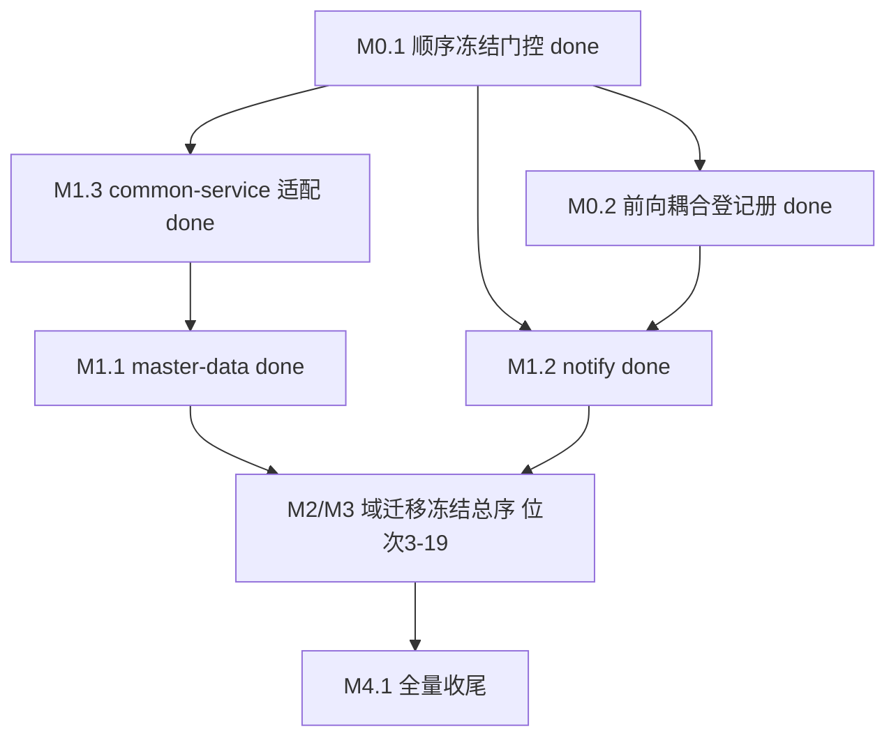

# 主键/外键 stdDataType string 化迁移路线图（BIGINT PK/FK → String）

> 最后更新：2026-08-22（**M3.5 done**：cs 域迁移四 Phase 完成，plan `2026-08-22-0002-3`，见 M2/M3 表位次 8 行证据摘要；冻结序位次 9（hr）解锁。本域要点：page.yaml `:Long` 12 处本批最重页面修复面 + A3 test 桥接 7 条退役（含 Phase 1 FQN 复扫补登 135/136）+ 81 方法目录超录快照按「断言式 + 空 autotest.yaml」已提交范式回退（消除月度序列名漂移地雷）。此前同日：M2.4 done（assets，plan `2026-08-22-0002-2`，**mission 首例晚域退役早域桥接点落地**（B 义务：ast 翻转 → fin 侧 bridge-main-061/063/065 退役）；FQN 盲区复扫补登 bridge-test-134）；M2.1 done（finance，plan `2026-08-22-0002-1`，IoC delta 缺 `x:extends="super"` 潜伏缺陷发现（bug `docs/bugs/2026-08-22-ioc-delta-missing-extends-super.md`））。更早：2026-08-21 M3.6/M3.8/M3.9/M1.2/M0.2/M1.1/M0.1/M1.3 done）
> 来源：用户请求（「将主键和外键的数据类型全部改成 string」）+ `nop-entropy/docs-for-ai/02-core-guides/orm-model-design.md` §主键设计强制规则
> 现状：`tools/check-bigint-id-types.mjs` scan/dry-run 可用（19 文件、1662 列、零残留、幂等，08-21 权威口径）；`apply` 模式经实测**不回写源文件**，回写一律走「时点 dry-run + 新鲜度门控」机制（见 §框架/平台复用）。副本在 `_tmp/bigint-id-string-fix/`（08-21 全量刷新，**未回写任何源文件**）。M0.1 产出：冻结序脚本 + 审计工件 + seq-string Proof（module-common-test 4/4 绿）。详见 `docs/audits/2026-08-21-1045-id-migration-m0-freeze-audit.md`。

## 目的

本路线图覆盖 nop-app-erp 全部 19 个 `model/*.orm.xml` 的 **PK（477）/ BIGINT FK（1185）共 1662 列 `stdDataType="long"→"string"` 集中改造**（08-21 实况权威口径；DB 列保持 BIGINT、`tagSet="seq-default"` 不变，仅 Java 属性/GraphQL 类型/前端值变 String；规则与机制见 `orm-model-design.md` §主键设计方案 B）。引用 `docs/backlog/00-roadmap-authoring-guide.md` 作为规范。

**完成态 Java 层全覆盖确认（2026-08-16 用户裁决）**：mission 完成后，全部 19 个域的所有主键与外键在 **Java 层均为 `String`**：
- PK 477 列：全部为 `id` 命名 + BIGINT（无复合主键、无其他类型），1662 列改造全覆盖 → String；
- FK 列（08-21 口径 1227，其中 BIGINT 1185 列，含 `orgId` 等非 `*Id` 命名 join 外键）经改造 → String；**非 BIGINT 外键 42 列实测全部为 VARCHAR 且显式 `stdDataType="string"`——Java 层本来就是 String，不需改动**（dry-run 副本已核查零误改）。
- **数据库层面零改动**：`stdSqlType` 全保持原值（BIGINT 保持 BIGINT、VARCHAR 保持 VARCHAR），DDL 不变，CSV 种子/序列号引擎不受影响。
- 边界说明：未分类 BIGINT 列 368（delVersion/fileSize/durationMs/孤儿操作人列等）**非主键非外键**，不在本 mission 范围、保持 `long`（孤儿操作人列建模问题已登记 follow-up，另案裁决）。

**这不是一次性全局 apply + 全量修复**，而是**逐域增量迁移**：每域一个原子工作项（orm 变更 → 增量重生成 → 编译器驱动修复手写代码 → 域级 build/test verify），按 **M0 冻结的模块级依赖拓扑序**推进。中间态仓库全量构建失败属**设计使然**（未迁移域源码引用已迁移域的 String API），因此**每个域 plan 的 build verify 限定域级 `-am` 构建**，全量构建/全量测试/E2E 修复只发生在 M4 收尾 plan。

## Work Item Status

> 唯一动态状态块。状态：`todo` / `ready` / `done`。M0 冻结依赖序之前，任何域迁移工作项不得转为 `ready`。

### Milestone M0 — 准备与 Proof（顺序冻结门控）

| Work Item | 描述 | 状态 | 依赖 |
| --- | --- | --- | --- |
| M0.1 | 工具 scope 化 + 依赖序冻结 + 跨域 id 调用点审计 + Proofs（seq-string 行为 / E2E 影响） | `done`（2026-08-21：plan `docs/plans/2026-08-21-1045-1-bigint-id-m0-order-freeze-audit-proofs.md` 四 Phase 完成 + 独立结束审计 `passes closure audit`，ses_fdd7d3f54ffeuesGsgCqk2so5J） | — |
| M0.2 | 前向耦合登记册（**M0 裁决 D5(d) 新增，M1.2 之前执行**）：19 orm refEntityName 跨域图 × 冻结序系统扫描（orm 级已双审清 = fin→prj 6 列 + hr→prj 2 列恰 2 簇）+ M0 审计附录 A 205 文件 service 耦合 id 流向全量复核 + `check-bigint-id-types.mjs` 豁免机制实现（登记册延后列 `残留 ⊆ 登记册` scan 门控例外），产出每域登记册（含 disposition：orm 级列延后 / service 级临时桥接），后续每个域 plan 起草强制消费 | `done`（2026-08-21，plan `docs/plans/2026-08-21-1657-1-bigint-id-m02-forward-coupling-registry.md` 三 Phase 完成 + 独立结束审计 `passes closure audit`（ses_fdb9a38d7ffeV343h80hI006iM，证据见 plan Closure 节）：orm 图 640 边机器化复扫 = 恰 2 前向簇（fin→prj 6 + hr→prj 2，行号逐行吻合 M0 裁决 §10.1）；service 前向清册 94 main 编译级 + 30 test 文件；登记册 254 active 条目（含后向指针 122 强制登记）；两工具豁免机制 + fail-closed + 负面测试 4 项全过（scan = 1586 NEEDS FIX + 8 DEFERRED + md 0）；M1.2 notify 消费走查可直读。产出指针见下） | M0.1 ✅ |

**M0.1 产出指针**：冻结序脚本 `tools/freeze-id-migration-order.mjs`（compile/test 闭包分开建模，`--edges`/`--why`/`--format json`）；回写新鲜度门控 `tools/verify-id-fix-copy-diff.mjs`；跨域耦合扫描器 `tools/scan-cross-domain-id-coupling.mjs`（各域 plan Phase 2/4 grep 门控复用）；审计工件 `docs/audits/2026-08-21-1045-id-migration-m0-freeze-audit.md`（冻结序/闭包构成/惰性 dao 结论/`-am` 实测/Proof/裁定）+ 附录 `docs/audits/2026-08-21-1045-id-migration-m0-cross-domain-coupling-appendix.md`（205 耦合文件 file:line / dao 语义 FK 清单 / orgId 调用点 / 计数复测 / E2E 影响面清单附录 F）；seq-string Proof = `module-common-test` 的 `TestSeqStringIdProof`（4/4 绿，方案 B 三断言迁移前实证）。

**M0.2 产出指针（前向耦合登记册 + 消费协议，各域 plan 强制）**：机器可读权威 `tools/id-migration-registry.json5`（254 active 条目 = orm-column-deferral 8 + service-bridge main 94/test 30 + backward-pointer main 60/test 62；退役后转手工维护权威）；人类可读逐域汇编 `docs/audits/2026-08-21-1657-id-m02-forward-coupling-registry.md`（§1 消费协议 + §2 总览矩阵 + §6 逐域 A 前向义务/B 退役义务/C 消费集）；扫描器 `tools/scan-id-coupling-directions.mjs`（`--registry-out` 对账复核用，勿覆盖登记册）+ 证据 JSON（orm 图 640 边 / coupling-directions main 300 对 + test 434 文件）。**消费协议**：① 各域 plan 起草与 Phase 1 强制消费本域条目全集（A1 列延后保持 long——dry-run 已豁免不翻转；A2 main 桥接 = 早域 plan 加 String→Long 桥 + grep 例外；A3 test 桥接 = 早域 plan Phase 3 测试适配；C 后向指针 = 编译器驱动修复/测试适配定位面）；② 退役：M2.7 翻转 prj orm 时同批翻转 fin 6 列 + hr 2 列并退役 orm-deferral-001..008，main 桥接由晚域 plan 翻转 IBiz 参数时退役（test 桥接由早域自身 plan 退役）；③ 工具门控（scan/dry-run/新鲜度门控）仅消费 active orm-column-deferral 条目，登记册缺失/不可解析 fail-closed 非零退出；④ 规则 6 联动（D4 修订）：登记册内预登记的自身链破坏不触发停止，未登记破坏仍触发。

### Milestone M1 — 根域 + 跨域基础设施迁移（先迁移，被全部业务域 R 引用）

> M1 内部序核验（M0.1 实测）：master-data orm 含 **6 个 orgId FK 列**（552/872/972/1135/1185/1238 行，另 1 处为 `<index>` 成员引用非列定义）——**M1.3 必须先于 M1.1**（md 迁移后 orgId 为 String，common-service 的 `Long.equals(String)` 恒 false 会误 stamp）。冻结序前两位 = master-data、notify（两根域无硬前置）。

| Work Item | 描述 | 状态 | 依赖 |
| --- | --- | --- | --- |
| M1.3 | common-service 组织隔离适配（`ErpOrgContext`/`ErpOrgIsolationOrmInterceptor`/`QueryTransformer` 的 orgId Long 语义，走反射 API 编译器不报错） | `done`（2026-08-21，plan `docs/plans/2026-08-21-1045-2-*.md`：三文件 String 语义 + `TestErpOrgContext` 12 单测 + grep 门控零残留；`TestErpOrgIsolation` 编译破坏按中间态登记，successor M2.1） | M0.1 ✅ |
| M1.1 | master-data 域迁移（根域，~120 处被引用，先导试点） | `done`（2026-08-21，plan `docs/plans/2026-08-21-1045-3-*.md` 四 Phase 完成：68 列落源 + 7 模块链 no-am main 绿 + 测试修复（24 类，含 5 TestStub* 桩）+ 快照重录（93 标记修改 = 44 内容 diff + 49 CRLF 行尾；11 方法新增落盘，String 形态零数字 id 残留）+ `mvn test -pl erp-md-service,erp-md-web` 155/155 绿 + grep 门控零残留；**先导试点结论（D6 判据）成立**：自身模块链全绿 + 闭包破坏仅限已登记耦合点（prj-dao 27/fin-dao 97 错 100% `_gen`，successor M2.7/M2.1 + M4.1 兜底，冻结总序维持）。偏差登记：`ErpMdWebPagesTest` 按已提交治理决策（plan 2026-07-24-0930-1 `@Tag("full-app")` + surefire excludedGroups）模块级排除，实证依赖全量 classpath（`/erp/xlib/control.xlib` 模块级缺失），页面校验 successor = M4.1 app-erp-all `ErpAllWebPagesTest`。平台 IoC 回归 test-scope delta 修复 + bug 登记 `docs/bugs/2026-08-21-nop-sequence-generator-ioc-self-wait-*.md`） | M0.1 + M1.3 |
| M1.2 | notify 域迁移（跨域通知派发子系统，唯一无 orgId 域） | `done`（2026-08-21，plan `docs/plans/2026-08-21-1657-2-bigint-id-m12-notify-migration.md` 四 Phase 完成：7 列落源（PK 3 + FK 4，新鲜度门控 + git diff + 工具重扫三重证明，登记册消费零前向义务）+ 7 模块链 no-am main 绿（dao 1 文件 + service 5 文件 Long 签名/泛型修复）+ 测试修复（2 编译错 + 6 文件 seed helper `String.valueOf`）+ 快照重录 RECORDING→CHECKING（18 既有方法 CSV 字节同一 + 5 方法新增 input/output 落盘，`TestErpSysNotificationRecipientResolverRuntime` 全量）+ `mvn test -pl erp-notify-service,erp-notify-web` 23/23 绿（web 0 tests 治理排除，successor M4.1）+ grep 门控零残留 + 手写 view 零改动；平台 IoC 回归 `nopSequenceGenerator` self-wait 复现，按 md 先例 test-scope VFS delta 修复（successor 平台修复后移除）；下游登记：main 侧 `notify(String,Map,ctx)` 签名不变零破坏 + `markRead` 外部调用 0，test 侧 14 域 28 文件 successor = 各域 plan Phase 3 + M4.1 兜底） | M0.1 + M0.2 ✅ |

### Milestones M2/M3 — 域迁移（冻结总序，M0.1 冻结写回）

> **冻结总序权威**（19 域，`tools/freeze-id-migration-order.mjs` 判据迭代产出，两次运行一致）：`master-data → notify → aps → b2b → contract → finance → assets → cs → hr → inventory → maintenance → projects → quality → manufacturing → purchase → sales → crm → drp → logistics`。下表为冻结序位次 3-19 的完整执行清单（原 M2/M3 工作项编号保持不变，两里程碑合并为一张序表；M2=核心域、M3=业务与扩展域仅是编号来源，不再是执行分组——如 aps(M3.9)/b2b(M3.8)/contract(M3.6) 先于 finance(M2.1) 执行）。依赖列为**精确前置**（= 本域 service 锚点闭包内的外域 service 模块，经 test 边传递闭包；闭包内其余外域模块为 dao/codegen/meta/api/web 惰性层，经 M0.1 审计逐域证实不构成前置）。**finance 为唯一全域构建纠缠域**：fin-app→ast-web→ast-service、fin-app→prj-web→prj-service，故 M2.1 的 web/app 层重生成延后至 M2.7 projects 完成后补做（service 锚点闭包不受影响，M2.1 本体先行）。

| 位次 | Work Item | 域 | 状态 | 依赖（精确前置） |
| --- | --- | --- | --- | --- |
| 3 | M3.9 | aps | `done`（2026-08-21，plan `docs/plans/2026-08-21-2025-1-bigint-id-m39-aps-migration.md` 四 Phase 完成：26 列落源（自有 25 = PK 7 + FK 18 + notGenCode md stub 1，新鲜度门控 + git diff + 工具重扫三重证明）+ 7 模块链 no-am main 绿（dao 7 文件 IBiz/值对象 + service 12 文件 Long 语义修复；`_gen` md org 关系胶水自 M1.1 登记中间态自愈）+ A2 前向桥接 15 条落桥（inv 4/mfg 11，ConvertHelper 双向转换 + 代码内 bridge 注释，退役 owner M2.2/M3.1）+ A3 test 桥接 4 条退役（bridge-test-103..106）+ C1/C2 后向兑付（notify String API 零编译破坏核证 + 2 测试文件适配）+ 测试修复 10 文件 + 快照重录 RECORDING→CHECKING（32 内容 diff = json5 id 引号 String 形态 + CSV R1.87 四列刷新 + CRLF；103 新增 table 快照落盘；1 处墙钟 payload 单元格 `*` 通配确定性修正）+ `mvn test -pl erp-aps-service,erp-aps-web` 76/76 绿 ×2（web 0 tests 治理排除，successor M4.1）+ grep 门控零残留（A2 桥接为登记例外）；平台 IoC 回归 self-wait 复现，test-scope VFS delta 修复（successor 平台修复后移除）+ DeltaOverride 测试 delta-layer 补 default 层集） | M1.1 + M1.2 |
| 4 | M3.8 | b2b | `done`（2026-08-21，plan `docs/plans/2026-08-21-2025-2-bigint-id-m38-b2b-migration.md` 四 Phase 完成：40 列落源（自有 37 = PK 13 + FK 24 + notGenCode md stub 3，新鲜度门控 + git diff 归一化逐行 + 工具重扫三重证明）+ 7 模块链 no-am main 绿（dao 3 文件 IBiz 签名 + service 12 文件 Long 语义修复；`_gen` md org/partner/material 关系胶水自 M1.1 登记中间态自愈）+ A2 前向桥接 7 条落桥（pur 6 编译级：实转换点 3 处 ConvertHelper 桥（setMaterialId/setUoMId/findMatchingPoLine ×2）+ 3 条类型级核对零转换点；sal 1 语义级核验 = **零 id 传递**（UblInvoiceEdiProvider 仅按 code 过滤 + 存在性检查 + invoiceDate 排序），退役 owner M2.5/M2.6）+ **A3' FQN 级 test 桥接补登与兑付**（登记册扫描器 import 口径盲区：`TestErpB2bAsnInventoryIntegration` FQN 引用 pur 实体 20 行/22 token；补登 bridge-test-133 + 6 处转换点（ConvertHelper.toLong ×3 + String.valueOf ×3）+ §6.4 盲区追注）+ C1/C2 后向兑付（md String 零适配面 + notify `notify(String,Map,ctx)` 签名不变零破坏核证 + `TestErpB2bPartnerOnboarding` 双指向适配含 `orm_propValueByName("id", String)`）+ 测试修复 6 文件 + 快照重录 RECORDING→CHECKING（19 内容 diff = CSV 列集刷新（CT_CONTRACT_LINE_ID 等后续 R-item 列）+ json5 字段序 + CRLF；43 新增 table 快照落盘；id String 形态实证 `"id": "1"`/`"asnId": "1"`）+ `mvn test -pl erp-b2b-service,erp-b2b-web` 80/80 绿 ×2（web 0 tests 治理排除，successor M4.1）+ grep 门控零残留（A2/A3' 桥接为登记例外）；平台 IoC 回归 self-wait 复现，test-scope VFS delta 修复 + DeltaOverride 测试 delta-layer 补 default 层集（aps 先例）） | M1.1 + M1.2 |
| 5 | M3.6 | contract | `done`（2026-08-21，plan `docs/plans/2026-08-21-2025-3-bigint-id-m36-contract-migration.md` 四 Phase 完成：47 列落源（自有 43 = PK 15 + FK 28 + notGenCode md stub 4，新鲜度门控 + git diff 归一化 47/47 字节一致 + 工具重扫三重证明）+ 7 模块链 no-am main 绿（dao 12 文件 IBiz/值对象 + service 29 文件 Long 语义修复（三轮编译器驱动 82→13→0）；`_gen` md org/partner/currency/material 关系胶水自 M1.1 登记中间态自愈）+ A2 前向桥接 20 条落桥（pur 10/sal 10，跨 6 文件：ConvertHelper.toLong setter 桥 ×24 转换点 + **语义级过滤值桥**（RunAccrual/RebateAgreement `eq("supplierId/customerId", toLong(partnerId))` ×4——eq 过滤 Long 列传 String 会静默空匹配，主动识别）+ resolve* Long 返回桥，退役 owner M2.5/M2.6）+ A3 test 桥接 5 条退役（bridge-test-108..112：Rebate/SettlementEnd ConvertHelper.toLong ×4 落桥 + BillingFamily/ExpiryJob/Posting 读路径核验零 id 穿越）+ C1/C2 后向兑付（md 直传适配 + notify `notify(String,Map,ctx)` 零破坏核证 + md 13/notify 5 测试文件 String 字面量/seed 适配）+ **id 序语义修复**（ApprovalWorkflowEngine `record.getId() > latest.getId()` 改 `idOrder`（Long.compare(toLong)）+ 测试侧 latestRecord comparingLong 同型——String 后字典序 "9">"10" 陷阱）+ 测试修复 14 文件（199→13→0 编译错 + 3 gated-pattern 文件主动翻转；`== c15` 字典序比较陷阱改 equals）+ 快照重录 RECORDING→CHECKING（17 类 168 方法，136 预期 snapshot-finished 零真实失败；29 内容 diff = 9 json5 String id 实证（`"id": "2"`）+ 字段序 + 20 csv；**1118 新增 table 快照落盘**（540→1658）；5 处 nanoTime 派生编码非确定性单元格 `*` 通配修正（aps 先例））+ `mvn test -pl erp-ct-service,erp-ct-web` 168/168 绿 ×2（web 0 tests 治理排除，successor M4.1）+ grep 门控零残留（A2/A3 桥接为登记例外）；平台 IoC 回归 self-wait 复现（17 类/119 处），test-scope VFS delta 修复 + DeltaOverride delta-layer 补 default 层集（四域先例） | M1.1 + M1.2 |
| 6 | M2.1 | finance（service 锚点闭包仅依赖 md/notify service；被 12 域 service compile 依赖；web/app 重生成延后至位次 12 后） | `done`（2026-08-22，plan `docs/plans/2026-08-22-0002-1-bigint-id-m21-finance-migration.md` 四 Phase 完成：**208 列落源**（自有 187 = PK 36 + BIGINT FK 151，36 实体 + notGenCode md stub 18/ast stub 1/prj stub 2 随 Decision A 翻转；新鲜度门控 + git diff + 工具重扫三重证明；6 条 A1 延后列保持 long）+ **no-am 5 模块链**（codegen,dao,meta,service,api——web/app 延后冻结裁决）main 绿（约 60 手写文件 Long→String；`_gen` md 关系胶水 97 处中间态自愈）+ A2 前向桥接 10 条落位（ast 3/inv 5/pur 1/sal 1：bridge-main-064 语义级 toLong + 9 条类型级核证零转换点 + billData id 桥 asId ×5 归一 Number→String；语义级过滤值桥主动识别零风险点）+ A3 bridge-test-118 退役（seed 侧 Long.valueOf 局部桥）+ C1/C2 后向兑付（notify 4 文件签名不变零破坏实证）+ **测试修复 93 类全 String 化**（含 TestErpOrgIsolation M1.3 编译破坏兑付 + 5 批并行子代理）+ **快照重录 RECORDING→CHECKING**（2961→4108 文件 = 554 内容 diff + 1147 新增落盘，mission 最大单域；零非确定性单元格）+ `mvn test -pl erp-fin-service` **497/497 绿 ×2** + grep 门控清零（asId 桥 5 处 = 登记例外；epoch 日期 parse/projectId 延后列合法非 id）+ page.yaml `:Long` 7 处就地 String 化（YAML 良构校验过，运行时验证 successor M2.7/M4.1）+ 手写 view 零改动；**id 序语义修复**：findLatestUnreversedCashRepayLink 改按 billCode 时间戳序（contract idOrder 同型）+ findPostedVouchers/report 排序改 nullsLast/nullsFirst naturalOrder；平台 IoC 回归 self-wait 六域连续复现，test-scope VFS delta 修复 + **发现并修正先例 delta 缺陷**（缺 `x:extends="super"` 整文件替换平台 beans → audit 拦截器静默丢失，bug 登记 `docs/bugs/2026-08-22-ioc-delta-missing-extends-super.md`，五域先例文件待回收）；**web/app 延后补做义务显式移交 M2.7 后续做载体（fin web/app 重生成 + 6+2 延后列同批翻转 + page.yaml 运行时验证；若 M2.7 plan 未覆盖则 M4.1 兜底）**） | M1.1 + M1.2 |
| 7 | M2.4 | assets（ast-service compile 依赖 fin-service） | `done`（2026-08-22，plan `docs/plans/2026-08-22-0002-2-bigint-id-m24-assets-migration.md` 四 Phase 完成：**110 列落源**（自有 98 = PK 18 + FK 80 + notGenCode md stub 12（PK 6 + FK 6）；弱引用列 `ErpAstCip.projectId` 随域翻转（无关系边零耦合）；新鲜度门控 + git diff 110/110 stdDataType-only + 工具重扫 110 ok/0 NEEDS FIX 三重证明）+ 7 模块链 no-am main 绿（首轮 198 编译错/28 文件编译器驱动清零：posting 族 10 文件（**backward-134 盲区兑付**——fin import 20 文件面 posting Dispatcher ×9 + AcctDocProvider ×9 + Executor + DepreciationScheduleProcessor 的 PostingEvent/AcctDocContext String id 值流转适配）+ processor/report/dashboard 15 文件 + **dao 手写 IBiz 8 文件翻转**（fin 先例对齐，37 处实体 id 参数 Long→String 含 `List<Long> costItemIds`→`List<String>`）+ 8 BizModel @Override + ~30 Processor 调用点 + 自域临时桥 7 处移除；`_gen` md 关系胶水自 M1.1 登记中间态自愈）+ **FQN 盲区复扫补登 bridge-test-134**（`TestErpAstDisposalEquipmentLinkage:59` FQN 字段 + `test-mock-mnt.beans.xml:9` ioc:type——A3' b2b 同型，登记册 §6.7 追注 + service-bridge:test 31→32）+ A2 前向桥接 2 条落桥（bridge-main-024/025：`ErpAstDisposalProcessor:266/:274` ConvertHelper.toLong(ast String→mnt Long)，退役 owner M3.2；eq/filter 语义值桥清扫零 mnt 实体查询）+ **B 退役义务兑付（mission 首例晚域退役早域桥接点）**：bridge-main-061/063/065 → retired（fin 侧 3 点核查 = 类型级/直传兼容形态无显式转换代码，fin 5 模块链重建绿 + **fin-service 测试复跑 497/497 全绿** + fin grep 复核仅剩 inv 064 桥）+ 测试修复 17 文件（200 错 4 轮 javac recovery 级联清零；`==` id 比较 2 处改 `.equals()`）+ A3 bridge-test-107/134 双退役（mnt mock 保持 Long 桩 = 适配形态 + 断言 ConvertHelper.toLong 桥）+ C2 后向兑付（fin 12/md 3 全覆盖 + notify 1 零穿越核验）+ 快照重录 RECORDING→CHECKING（**1464→1749 = 321 内容 diff（CSV 列集刷新 + CRLF + json5 String id `"id": "22"` 实证）+ 285 新增落盘 + 0 删除**；零非确定性单元格）+ `mvn test -pl erp-ast-service,erp-ast-web` **320/320 绿 ×2**（web 0 tests 治理排除，successor M4.1）+ grep 门控清零（`Long.parseLong` ×2 = epoch 日期 parse 合法非 id；残留 Long id 声明 6 处 vestigial = 3 翻 String + 3 删死代码；sql-lib 零存在）+ page.yaml `:Long` 1 处就地 String 化（disposal-wizard:74 `$aid:String` + YAML 良构 + ast-web 重建绿）+ 手写 view 零改动；平台 IoC 回归 self-wait 七域连续复现，fin 修正版先例 delta 落位（x:extends="super"）；后置构建验证（08-22）：并发用例 testConcurrentFirstDepreciationNoDuplicate 重录基线不可比（赢家 schedule id 56/57 随机）→ `@EnableSnapshot(checkOutput=false)` + 方法内确定性断言增强 + 删不可比基线（`_cases` 1749→1739），隔离 10/10 + 全量 320/320 绿 ×2 复验 | M2.1 + M1.1 + M1.2 |
| 8 | M3.5 | cs | `done`（2026-08-22，plan `docs/plans/2026-08-22-0002-3-bigint-id-m35-cs-migration.md` 四 Phase 完成：**68 列落源**（自有 66 = PK 18 + FK 48 + notGenCode md stub 2，18 实体；新鲜度门控（68 行 stdDataType-only）+ git diff 68/68 + 工具重扫三重证明）+ 7 模块链 no-am main 绿（dao 9 IBiz（82 处 @Name id 参数 Long→String + matchForCustomer）+ service 18 文件（entity 5/matcher 2/processor 11/job 3/report 1/dashboard 1）；`_gen` md 关系胶水自 M1.1 登记中间态自愈；D2 0 哨兵随 agentId String 化退役）+ A2 前向桥接 8 条落桥（crm 4 = bridge-main-053..056（055/056 核证零 id 穿越——eq("code") VARCHAR 过滤 + crm 域内自洽值对）+ qa 4 = 057..060（059 实值转换桥 ×2 ConvertHelper.toLong(materialId/supplierId)），退役 owner M3.4/M2.3；PENDING 载荷 JSON id String 形态落盘）+ **A3 test 桥接 7 条退役**（bridge-test-113..117 + Phase 1 FQN 复扫补登 135/136：crm seed/qa 断言局部桥 + mock 桩保持 Long 签名（与未迁移 jar 一致））+ C1/C2 后向兑付（md 7 main String 直传 + notify 8 签名不变零破坏；md 8/notify 6 测试 String 适配）+ 测试修复 26 类全 String 化（种子常量/helper 签名/`orm_propValueByName("id","…")` 形态 + 数值接续常量独立化）+ 快照重录 RECORDING→CHECKING（80 内容 diff + 7 新增 input 种子表落盘；**81 方法目录超录回退**——前次运行误录「断言式 + 空 autotest.yaml」范式测试（类注释自述录制表快照随日期漂移翻红），含月度序列名 `cs_ticket_code_seq_202608` 漂移地雷与尾随空格 CSV 回读裁剪 7 处失败，按已提交范式回退保绿）+ `mvn test -pl erp-cs-service,erp-cs-web` **185/185 绿**（web 0 tests 治理排除，successor M4.1）+ grep 门控清零（`longValue()` ×1 = 聚合数值结果转换合法非 id；装箱 == 全为 null 检查；sql-lib 零存在）+ **page.yaml `:Long` 12 处就地 String 化**（kanban ×11：`$id` ×5 mutation + `$c` ×6 filter_customerId；timeline ×1：`$tid`；`|| null` 兜底合法保留，cs-web 重建绿）+ 手写 view 零被动变更（20 文件 = 18 `_gen` + 2 page.yaml 主动 Fix）+ owner doc 3 处 Long/BIGINT 陈述就地注记（time-tracking/sla ×2）；平台 IoC 回归未复现（前次运行先例 delta 已在位，全绿证实有效）） | M2.1 + M1.1 + M1.2 |
| 9 | M3.3 | hr | `todo` | M2.1 + M1.1 + M1.2 |
| 10 | M2.2 | inventory（inv-service compile 依赖 fin-service） | `todo` | M2.1 + M1.1 + M1.2 |
| 11 | M3.2 | maintenance | `todo` | M2.2 + M2.1 + M1.1 + M1.2 |
| 12 | M2.7 | projects（prj-service compile 依赖 ast-service + fin-service） | `todo` | M2.4 + M2.1 + M1.1 + M1.2 |
| 13 | M2.3 | quality | `todo` | M2.2 + M2.1 + M1.1 + M1.2 |
| 14 | M3.1 | manufacturing | `todo` | M3.2 + M2.3 + M2.2 + M2.1 + M1.1 + M1.2 |
| 15 | M2.5 | purchase | `todo` | M2.7 + M2.3 + M2.2 + M2.1 + M2.4 + M1.1 + M1.2 + M3.6 |
| 16 | M2.6 | sales | `todo` | M2.3 + M2.2 + M2.1 + M1.1 + M1.2 + M3.6 |
| 17 | M3.4 | crm | `todo` | M2.6 + M2.3 + M2.2 + M2.1 + M1.1 + M1.2 + M3.6 |
| 18 | M3.7 | drp | `todo` | M2.5 + M2.6 + M2.7 + M2.3 + M2.2 + M2.1 + M2.4 + M1.1 + M1.2 + M3.6 |
| 19 | M3.10 | logistics | `todo` | M2.6 + M2.3 + M2.2 + M2.1 + M1.1 + M1.2 + M3.6 |

### Milestone M3 — 业务与扩展域迁移

> 已并入上表冻结总序（M3.x 工作项编号保留：M3.1 manufacturing、M3.2 maintenance、M3.3 hr、M3.4 crm、M3.5 cs、M3.6 contract、M3.7 drp、M3.8 b2b、M3.9 aps、M3.10 logistics——按上表「位次」列执行）。

### Milestone M4 — 收尾（全量恢复）

| Work Item | 描述 | 状态 | 依赖 |
| --- | --- | --- | --- |
| M4.1 | 全量构建恢复 + 全量测试 + E2E 套件修复 + compliance + baseline + 文档 + mission 级手写 page.yaml raw-GraphQL `:Long` 变量全量清扫（M3.6 结束审计发现的模式盲区：notify inbox.page.yaml:177 / aps schedule-gantt:59 / b2b edi-detail:45、asn-flow:79 存量实例；contract version-diff 已于 M3.6 就地 Fix） | `todo` | 全部 M1-M3（含 M2.1 延后的 finance web/app 重生成补做核验） |

## 框架/平台复用

- **ORM 生成机制**：codegen 由 `model/*.orm.xml` 驱动，`stdDataType` 变更后 `mvn clean install -pl <域> -am -DskipTests` 增量重生成 `_gen/` 实体、I\*Biz 接口、xmeta、view、api 契约，**不需要手改生成件**。
- **ID 生成**：`tagSet="seq-default"` + BIGINT 列 → `OrmEntityIdGenerator.genSeq` 按 DB 类型走 `generateLong` 序列号引擎，Entity setter 自动 `ConvertHelper.toString` 转 String（`orm-model-design.md` §主键设计已明确）。CSV 种子显式 id 存活（`seq` 保留显式非空值，`2026-08-09-2107-1` 计划已实证小整数 userId 存活）。
- **测试兼容（用户裁决 2026-08-16）**：快照测试**不依赖 `JsonMatchHelper` Number 宽容**——每域 plan 在编译错误修复完成后执行 RECORDING→CHECKING **每域重录**（标准 Nop 流程，id 从数字变字符串后的快照以新形态落盘），重录为 M1-M3 标准结构 Phase 3 的固定步骤。
- **工具与回写机制（M0.1 裁定，2026-08-21）**：各域 plan 落源一律走「**时点 dry-run + 新鲜度门控**」三步——① `node tools/check-bigint-id-types.mjs dry-run`（全量幂等刷新副本，结构性绑定回写时点实况源）；② `node tools/verify-id-fix-copy-diff.mjs module-<domain>` 新鲜度门控（diff 实况源 vs 时点副本**零非 stdDataType 行**才放行，防回滚 RC 增量）；③ 门控通过后单文件落源 + `git diff` 逐行审核。**禁止盲 cp 静态副本**；`apply` 模式经实测**不回写源文件**（仅重推导写入 `_tmp`，且跳过校验、不清理陈旧副本），不得用作回写。scan 支持交叉校验残留；`tools/scan-cross-domain-id-coupling.mjs` 供各域 plan Phase 2/4 耦合 grep 门控复用。

## 当前基线（08-21 实况，M0.1 刷新登记；08-16 旧口径已废止）

- 19 个 orm.xml，**PK 477（全 BIGINT）+ BIGINT FK 1185 = 实际修改 1662 列**；主/外键列合计 1704（PK 477 + FK 1227 + PK+FK 双角色 0）；非 BIGINT 主/外键 42 列不改（实测全 VARCHAR 显式 string）；`delVersion` 等非 PK/FK BIGINT 列保持 long 不动（工具 scan 未分类 BIGINT 共 380，构成分解以工具输出为准，均不在改造范围）。计数增量来自 requirement-compliance mission 08-18→08-20 落地的 R1.70-R1.88（mnt 任务模板/状态日志、cs fulfillment-step、md SKU status、contract/aps/drp/logistics 增量）。
- `stdSqlType` 全保持 BIGINT（工具仅改 `stdDataType`），DB DDL 零变化；CSV 种子、`NOP_SYS_SEQUENCE`（E2E `zz-sequence-advance.sql`）不受影响。**seq-string 行为已迁移前实证**（M0.1 Proof：`module-common-test` `TestSeqStringIdProof` 4/4 绿——无显式 id 保存 → String 非空；显式 `5L`/`"5"` → 存活且 String；BIGINT+string FK 形态列值 String 往返）。
- 手写代码冲击面（08-21 复测）：`.getId()` 调用 **1176** 处/352 文件（`rg -c "\.getId\(\)" module-*/erp-*-service/src/main/java`）；`Long xxxId` 声明 **2586 行/2896 occurrence**；合计行口径 3740。跨域耦合面 205 文件/289 跨域边（清单见审计工件附录 A）。测试代码（request.json5、断言）与 E2E spec（`Number(lnk.voucherId)` 11 处、`Number(` 全量 **874**/105 文件、`eqFilter('id'` 36 处）需要同步修复——E2E 影响面清单见审计工件附录 F。
- **`module-common-service` 组织隔离代码（新增基线）**：`ErpOrgContext.currentOrgId` 返回 `Long`（org/ErpOrgContext.java:30,44）、`ErpOrgIsolationOrmInterceptor.stampOrgId` 做 `orgId.equals(current)` 后写值（:50,:53）、`ErpOrgIsolationQueryTransformer` 构造 `FilterBeans.eq(orgId)`（:60-61）。orgId 是 226 列的真实 FK（工具 scan 标记 `NEEDS FIX`；orm.xml 中 `name="orgId"` 出现 404 次含 178 处 `<index>` 内索引成员引用，扣除后 = 226），迁移后 `Long.equals(String)` 恒 false → 隔离开启时每次 save 重复 stamp、QueryTransformer 过滤值类型错。这些代码走反射 API **不产生编译错误**，属 §3 语义陷阱类别，由 M1.3 工作项显式覆盖（**归属已指派，不再落入空白区**）。
- **已核零存在面**：仓内无 sql-lib.xml / 手写 xbiz.xml / task.xml（xbiz 仅 `app-erp-all/_dump/` 运行时产物）；api 模块 19 个全部 codegen 生成件、零手写。**dao 模块惰性：手写层成立（M0.1 逐域证实）、生成件层已证伪（M1.1 执行，2026-08-21 M0 裁决修正）**：dao 手写跨域 import 全量枚举——实体跨域 import 仅 crm-dao 3 文件（`IErpCrmLeadBiz`/`IErpCrmConversionBiz`/`IErpCrmProductConfiguratorBiz` 引入 md/sal 实体，类型级用法非 `.getId()` 赋 Long）+ 非实体跨域 import 4 行（pur/sal-dao 引入 `app.erp.md.biz.SettlementAllocation`、`app.erp.md.dao.daterange.IDateRange`），其余 16 域为零；**但 `_gen/` 实体 to-one 关系胶水（`internalSetRefEntity(..., () -> setXxxId(refEntity.getId()))`）构成编译级跨域 id 耦合**——javac 权威计数 prj-dao 27 错/15 文件、fin-dao 97 错/32 文件（100% `_gen`，与 orm md 关系数 1:1），处置 = D3 已登记中间态 + D4 前向耦合登记册（M0.2）+ M4.1 兜底；另 dao 层存在本域签名声明 Long 但语义指向他域实体的 FK 参数/字段 82 处/11 域（编译自洽，本域迁移时按语义陷阱门控显式翻转，清单见审计工件附录 C）。
- 模块级依赖 DAG 无环（Maven 156 模块可构建）；**域级合并依赖存在环**（如 assets↔finance：ast-dao→fin-dao 与 fin-service→ast-dao 交叉；purchase↔finance：pur-service→fin-service 与 fin-service→pur-dao；projects→finance：prj-service→ast-service→fin-service 与 fin-service→prj-dao）——**环全部是"合并域级"的 dao/service 交叉，编译级模块图无真环**（实测：compile 边 prj-service→ast-service 见 prj pom:52-57；sal→qa、mfg→qa 为 test-scope 边，qa 侧用 `test-mock-sales.beans.xml` 桩避免反向 test 依赖），由 M0.1 跨域审计裁决。

## Milestones

### M0 — 准备与 Proof

M0 是唯一包含顺序冻结门控的里程碑。M0.1 **已完成（2026-08-21）**：冻结的**精确域迁移顺序**、**跨域 id 调用点清单**、**Proof 结论**已写回本路线图（M2/M3 表按冻结总序重排 + 精确依赖链 + **M1 内部序已核验：common-service 先于首个含 orgId 域（master-data，6 个 orgId FK 列）**，工作项保持原子可标记）。

### M1-M3 — 逐域迁移

每域一个原子工作项，标准结构（写入各 plan）：
- **Phase 1**：回写 orm（M0.1 裁定机制三步）——① `node tools/check-bigint-id-types.mjs dry-run` 时点刷新；② `node tools/verify-id-fix-copy-diff.mjs module-<domain>` 新鲜度门控（零非 stdDataType 行）；③ 单文件落源 + `git diff` 审核仅 `stdDataType` 变化。**禁止盲 cp 静态副本、禁止用 apply 模式回写**。**M0.2 登记册强制消费**：起草与 Phase 1 消费本域条目全集（A1 延后列不翻转——工具已按登记册豁免；A2/A3 桥接 disposition 写入本 plan；见「M0.2 产出指针」）。
- **Phase 2**：增量重生成 + 主代码编译修复：`mvn clean install -pl <域>/erp-<short>-codegen,<域>/erp-<short>-dao,<域>/erp-<short>-meta,<域>/erp-<short>-service,<域>/erp-<short>-web,<域>/erp-<short>-app,<域>/erp-<short>-api -Dmaven.test.skip=true`（**D3 修订：自身模块链 7 模块显式列表、不带 `-am`**，上游经本地 Maven 仓库解析——硬前置 = 最后全绿基线 commit 的全量 install + 每个已完成域链 install；编译器错误即清单，逐条修复；`-Dmaven.test.skip=true` 先行隔离测试编译。原 `-pl <域>/erp-<short>-api,<域>/erp-<short>-app -am` 聚合锚点口径经 M1.1 rule-6 证伪废止：`-am` reactor 经 optional/test 边拉入未迁移域 dao，`_gen` 关系胶水对称耦合破坏）。
- **Phase 3**：测试代码修复 + **快照每域重录**（RECORDING→CHECKING，用户裁决——不依赖 Number 宽容）+ 域级测试：`mvn test -pl <域>/erp-<short>-service,<域>/erp-<short>-web`（**D3 修订：不带 `-am`**；web 页面测试须显式并入，M1.1 实测）。
- **Phase 4**：语义陷阱 grep 门控（见横切关注点 §3 + 审计工件附录 C 的本域语义 FK Long 参数清单）+ owner doc 注记 + 日志。
- **verify**：域级 `mvn clean install -pl <域 7 模块显式列表> -DskipTests` 全绿 + `mvn test -pl <域 service>,<域 web>` 全绿（**D3 修订：均不带 `-am`**）。**不跑全量构建**（中间态设计使然）。

**预期技能**（写入各 plan 的 `Skill:` 行）：M0.1 → `orm-model-audit-prompt` + `cross-module-dependency-audit-prompt`；域迁移 plan → `nop-backend-dev` + `nop-testing`；M4.1 → `nop-testing` + `compliance-baseline-drift-adjudication-prompt`。

### M4 — 收尾

全量恢复 plan：`mvn clean install -DskipTests`（156 模块）→ 全量 `mvn test` → E2E 套件 id 断言修复（`Number()`→字符串/`eqFilter` 调整）→ `nop-compliance-checker.sh` → baseline 更新 → `domain-design-guidelines.md` §16A 已知偏离表（13 个 `Long id` 实体行 → 全部完成）→ 快照重录全量复查（每域重录后的 `_cases/` 与 Java String id 一致性）→ daily log。

## Work Item Details

- **M0.1**（已完成，2026-08-21）：① 工具裁定——per-domain 复制改为「时点 dry-run + 新鲜度门控」机制（`verify-id-fix-copy-diff.mjs`），apply 实测不回写源文件被否；② 依赖序冻结——`tools/freeze-id-migration-order.mjs` 解析全部 pom（compile/test 闭包分开建模；实测 Maven 3.9.12 `-am` reactor 含 test 闭包且遍历中间模块 test 边：sal-service `-am` = 49 模块），按判据「closure(D) ∩ 未迁移域 ⊆ 惰性模块 ∪ {自身}」迭代产出冻结总序（惰性层经实测扩展为 dao/codegen/meta/api/web：codegen/main 零手写、meta 零手写、api 全生成件、web 手写仅本域页面测试）；③ 跨域 id 调用点审计——19/19 惰性 dao **手写层**证实零证伪（跨域 import 仅 crm 3 文件类型级 + pur/sal 4 行非实体）、205 耦合文件/289 跨域边清单、dao 层语义 FK Long 参数 82 处/11 域（随域迁移翻转）、orgId 语义调用点全量清单（ErpOrgContext 外部调用唯一 = TestErpOrgIsolation:72）——**【M0 裁决修正，2026-08-21】③ 的惰性结论在生成件层被 M1.1 执行证伪（prj-dao/fin-dao `_gen` 关系胶水 27+97 编译错误），修正与处置见 audit §10（Decision C 修正注 + §10.1）**；④ Proofs——seq-string 行为实证（`module-common-test` `TestSeqStringIdProof` 4/4 绿）、E2E 影响面清单（`Number(` 874/105 文件、`Number(lnk.voucherId)` 11、`eqFilter('id'` 36）；⑤ 冻结序写回本路线图 + M1 内部序核验（md orm 6 个 orgId FK 列实证，M1.3 先于 M1.1 维持）。全部证据：`docs/audits/2026-08-21-1045-id-migration-m0-freeze-audit.md` + 附录。
- **M1.1 master-data**：全仓根域先导。覆盖 ~120 处被引用 + 全域手写代码 511 处 id 引用；验证「根域迁移后其 -am 闭包仍全绿」作为后续域顺序的 Proof 先例。
- **M1.2 notify**：无业务域依赖的第二个根域。
- **M1.3 common-service 组织隔离适配**（已完成，2026-08-21）：`ErpOrgContext`/`ErpOrgIsolationOrmInterceptor`/`ErpOrgIsolationQueryTransformer` 三文件的 orgId 处理改 String 语义（`currentOrgId`/`setCurrentOrgId` String 签名 + 过渡期宽容归一 `toStringValue`、stamp 前 String 归一比较、eq 过滤值 String）；grep 门控 `orgId.equals|FilterBeans.eq\([^,]*PROP_ORG_ID` 2 命中逐条核对 String 语义 + `Long` 零代码残留（2 处 Javadoc 历史注记例外）；新增 `TestErpOrgContext` 12 单测（转换矩阵 + config-gate），module 级 `mvn clean install -pl module-common-service -am -DskipTests` + `mvn test -pl module-common-service` 22/22 全绿。`TestErpOrgIsolation`（fin-service test）`setCurrentOrgId(ctx, 2L)` 编译破坏按中间态登记（successor = M2.1，M0.1 审计 §6 已标注）。证据：plan `docs/plans/2026-08-21-1045-2-bigint-id-m13-common-service-orgid-string.md`。
- **M2.x / M3.x**：按冻结顺序执行，内容同标准结构；规模参考 M0.1 基线统计。
- **M4.1**：全量恢复 + E2E + compliance + baseline + 文档（含 `domain-design-guidelines.md` §16A「存量 Long id 实体不强制改」登记行清理、`orm-model-design.md` 规则落地注记）。

## 依赖图

域间编译依赖（M0.1 冻结序权威，见 M2/M3 表；此处为结构摘要）：两根域 master-data/notify 无硬前置；aps/b2b 仅依赖 notify；contract/finance 依赖 md+notify；assets/cs/hr/inventory 依赖 fin；maintenance 依赖 fin+inv；projects 依赖 fin+ast；quality 依赖 fin+inv；manufacturing 依赖 fin+inv+mnt+qa；purchase 依赖 fin+inv+ast+prj+qa+ct；sales 依赖 fin+inv+qa+ct；crm 再加 sal；drp 最广（10 前置）；logistics 依赖 fin+inv+qa+ct+sal。**域级合并的 service/web/app 交叉边**（fin-app→ast-web→ast-service、fin-app→prj-web→prj-service）使 finance 成为唯一全域构建纠缠域（web/app 重生成延后，见 M2.1 注记）；compile 级模块图无真环；test 闭包经 Maven `-am` 实测全量入 reactor（判据按 test 闭包口径，保守正确）。

## 横切关注点

1. **中间态全量构建失败是设计使然**：M1-M3 期间 `mvn clean install`（无 `-pl`）预期失败（未迁移域源码调用已迁移域 String API 编译错误）。所有中间验证只允许**域级自身模块链**口径。这是「如何避免修改后无法编译且通过测试」的核心答案：**每个 plan 的 verify 范围 = 目标域自身模块链（显式列表、不带 `-am`，上游经本地 Maven 仓库解析）**（**D3 修订，2026-08-21 M0 裁决**；原「目标域 + 其 -am 闭包」口径经 M1.1 执行证伪后废止——`-am` reactor 会经 optional/test 边拉入未迁移域 dao 模块，其 `_gen` 生成件 to-one 关系胶水存在**对称**编译级 id 耦合，任一端先行迁移都破坏、重生成无法修复、唯两端同时 String 才自愈，详见 audit §10）。进入 `-am` reactor 的未迁移域模块破坏为**已登记中间态**（登记义务：破坏模块清单 + successor 指针 + 逐模块 javac 错误点清单证明 100% 位于 `_gen` 或已登记手写前向边；前向耦合清册归 M0.2 登记册），由 successor 域 plan 愈合，M4.1 兜底全量恢复；**不包含未迁移下游域的 service 模块**。已知登记中间态：陈旧 jar 二进制不兼容（本地仓未迁移 dao jar 引用旧 `getId()` 签名，跨迁移边关系遍历运行路径在 M4.1 前可能 NoSuchMethodError，域级测试按设计不跨这些边界）；no-am 测试 classpath 的 VFS 模块集变化（失去 optional fin/notify orm 模型，回退方案 = seq-proof-yaml 模块禁用模式）。
2. **编译器驱动修复**：类型迁移类错误（`Long id` 参数、`.getId()` 赋 Long、`setXxxId(Long)`）由编译器强制报告，遗漏必被编译阻断（对齐 `2026-07-03-2108-1` dict int→string 先例的风险 (a)）。
3. **语义陷阱 grep 门控**（编译器不报错的隐蔽 bug，对齐 dict 先例风险 (b)）：`Long` 装箱 `==`/`!=` 比较、`.longValue()`/`Long.parseLong()`、`Map<Long,...>` 键、`String.format("%d")`、E2E `Number(id)`；`sql-lib.xml` 的 `:id` 参数条目保留但已核仓内零存在（执行时注明即可）。每域 plan Phase 4 用 grep 清单清零。**common-service 的反射路径 orgId 语义（`orgId.equals`、`FilterBeans.eq(orgId)`）单独归 M1.3，不依赖各域 plan**。
4. **快照与 E2E**：JUnit 快照（`_cases/`）**每域 plan 固定重录**（RECORDING→CHECKING，用户裁决——不依赖 `JsonMatchHelper` Number 宽容；实测 35/291 输出快照含数字实体 id，重录后全部以 String 形态落盘）；Playwright E2E 套件统一在 M4.1 修复（`Number(lnk.voucherId)` 11 处等），中途不跑 E2E。
5. **保护区域**：`model/*.orm.xml` 变更属保护区域 → 每个域 plan 需独立 plan-audit + 双独立子 agent 批准（`ai-autonomy-policy.md` 保护区域表 `auto + dual-agent-approval`），批准记录落盘计划文件。**design 证据输入**（policy 表要求 design doc + plan audit + 双 agent）：`orm-model-design.md` §方案 B + `domain-design-guidelines.md` §16A + M0.1 审计结论。
6. **全量测试与 compliance 漂移**：域迁移不改 DAO 引用面/import 面形状，R2c 等计数预期不变；M4.1 统一复跑 checker 并核对 baseline。
7. **`_gen/` 与生成契约零手改**：实体/xmeta/view/api 全部经 codegen 重生成（手写 view.xml 按字段名引用、类型随 xmeta 重生成，预期零改动——dict 先例已实证），手写代码（BizModel/Processor/Dispatcher/Provider/Engine/测试）才是修复对象。

## 规则

1. 工作项状态只存在于本表；M0.1 通过独立草案审查 + 双独立子 agent 批准后转 `ready`，其余工作项仅在其依赖顺序前置项 `done` 后转 `ready`。
2. 每域 plan 执行前必须已有独立 plan-audit（保护区域要求）+ 结束审计；审计证据保留在 plan 文件。
3. 每域 plan 的 build/test verify 严格执行**域级自身模块链**口径（**D3 修订，2026-08-21 M0 裁决**：`-pl <域 7 模块显式列表>` 不带 `-am`，上游经本地 Maven 仓库解析——硬前置 = 最后全绿基线 commit 的全量 install + 每个已完成域链 install；迁移中途 fresh clone 须锚定最后全绿基线 commit 而非 HEAD），**不得**以全量构建作为中间 gate；全量构建仅存在于 M4.1 的 Closure Gates。进入 `-am` reactor 的未迁移域模块（经 optional test 边或直接编译依赖）其编译破坏为已登记中间态：每域 plan 登记 (i) 破坏模块清单 + successor 指针 + (ii) 逐模块 javac 错误点清单证明 100% 位于 `_gen` 或已登记手写前向边，由 successor 愈合、M4.1 兜底。
4. 只修改目标域的 `orm.xml`；`delVersion` 等非 PK/FK BIGINT 列保持 `long` 不动（工具已防御性限定）。
5. 禁止手动编辑任何生成件（`_gen/`、`_` 前缀、`*DaoConstants` 等）；类型修复全部落在手写代码。
6. 顺序由 M0.1 冻结（**冻结总序经 M0 裁决 D6 维持不变**）；执行中发现冻结顺序不可行（未迁移域引用已迁移域类型的编译错误且超出登记范围）时**停止该 plan**，回报 M0 裁决（调整顺序或合并域 plan），不自行重排。**D4 修订（2026-08-21 M0 裁决）**：登记册（M0.2 产出，各域 plan 登记）内预先登记的自身链破坏**不触发** rule-6 停止（已登记中间态，successor 愈合 + M4.1 兜底）；未登记破坏仍触发。
7. 语义陷阱 grep 门控（§3 清单）在每域 plan Phase 4 清零后才可声明完成。
8. 每个完成的工作项更新 `docs/logs/{year}/{month}-{day}.md`；M4.1 更新 `domain-design-guidelines.md` §16A 已知偏离表与 `known-good-baselines.md`。

## Draft Review Record

- **2026-08-16 第 1 轮独立草案审查（两个独立子代理，fresh session）**：
  - 审查者 A（技术/执行契约视角，ses_ff8120249ffei5weQaLfh7sVOx）：`needs revision` — 4 MAJOR：① M0.1 冻结判据公式（「-am 闭包 ⊆ 已迁移 ∪ 自身」）与实测可构建性矛盾（任何域的 -am 闭包都含未迁移域的 dao 模块，dao 模块实测惰性可编译）→ 判据改写为「closure ∩ 未迁移域 = 仅含惰性 dao 模块 ∪ 自身」；② M2 占位顺序与实测 compile DAG 矛盾（projects 闭包含 ast-service + fin-service，实测 prj pom:52-57，不能先行）→ M2 重排为 finance 先行；③ common-service 组织隔离代码（orgId Long 语义，反射 API 编译不报错）无归属 → 新增 M1.3；④ M2/M3 dep 列仅写 M0.1 与依赖图冲突 → 改「冻结序全部前置项 done」。另有 5 MINOR（Proof② 防空证加 coercion 用例 / test-scope 闭包分开建模 / sql-lib 零存在注明 / 计数附 grep 命令 / view.xml 零手改注明）。
  - 审查者 B（治理/规范视角，ses_ff811e11cffeOOAbak517x3UQo）：`passes draft review` — 0 BLOCKER / 0 MAJOR / 6 MINOR：① M2/M3 依赖单元格占位标注；② mission description 补保护区域协议 + M0 门控声明；③ 保护区域证据清单补 design doc 元素；④ 补 Skill 指引；⑤ 补 Draft Review Record 段；⑥ mission commands.build 全量命令在中间态必然失败的说明。
  - **修订（已落地）**：全部 4 MAJOR + 11 MINOR 已处理——M0.1 判据改写 + test 闭包建模、M2 占位序重排（finance 先行 + projects 靠后）、新增 M1.3 common-service 工作项、dep 列改「M0.1 + 冻结序全部前置项 done」、mission description 补保护区域/M0 门控、横切 §5 补 design 证据、Skill 指引、Draft Review Record 段、Proof② 防空证、sql-lib 零存在注明、计数复核命令、view.xml 零手改注明。
- **2026-08-16 第 2 轮独立复审（两个独立子代理，fresh session）**：
  - 复审者 A（技术/执行视角，ses_ff80483f1ffeDZo47R47YagROG）：`needs revision` — 0 BLOCKER / 2 MAJOR：① 快照兼容「实测已全部为字符串」被证伪——实测 35 个输出快照含数字实体 id（约 12%），「兼容概率高」陈述失实 → 改为如实陈述（M0.1 Proof ④ 实证裁定 Number 宽容或重录）；② dao 模块「已核：手写跨域实体 import 为零」被证伪——crm-dao `IErpCrmLeadBiz`/`IErpCrmConversionBiz`/`IErpCrmProductConfiguratorBiz` 3 处手写跨域 import（md/sal 实体，类型级用法）→ 降级为「3 处待审计③逐域证实」。另有 7 MINOR（orgId 计数 404→226 真实 FK 列、未分类 BIGINT 368 口径、Long 计数口径、E2E Number( 计数 519→801、M2.2 inventory 描述、M1.3 时序约束入依赖模型、行号引注微差）。
  - 复审者 B（治理/规范视角，ses_ff8046f9fffeyYTzdXiq5AarhK）：`passes draft review` — 1 MAJOR：M1.3 前置约束未进入 Work Item Status 表与依赖图（master-data orm 含 6 个 orgId FK 列，M1.1 必须先于 M1.3 是错的——实际 M1.3 必须先于 M1.1；表序 M1.1→M1.3 违反约束）→ M1.3 表序前移 + M1.1 依赖列改「M0.1 + M1.3」+ 依赖图补边。另有 4 MINOR（orgId 计数、未分类 BIGINT 口径、冲击面计数、M2.1「DAG 顶」措辞）。
  - **修订（已落地）**：全部 2+1 MAJOR + 11 MINOR 已处理——快照陈述改如实（35/291 数字 id，M0.1 实证裁定）、dao 惰性假设降级为「3 处类型级用法待逐域证实」、orgId 计数改 226 真实 FK 列（404 为 XML 出现次数含 178 index 引用）、未分类 BIGINT 改 368 口径、M1 表序重排（M1.3 → M1.1 → M1.2）+ 依赖图补 M1_3→M1_1 边 + M1.1 dep 列改「M0.1 + M1.3」、M2.1/M2.2 描述措辞修正（finance「被 12 域 service compile 依赖」、inventory「被 12 域 service compile 依赖」）、E2E Number( 计数改 801、计数口径注明复核命令。
- **2026-08-16 第 3 轮独立复审（两个独立子代理，fresh session）**：
  - 复审者 A（技术/执行视角，ses_ff7f8300cffe5Jiz5TAgsDnbm4）：`passes draft review` — 0 BLOCKER / 0 MAJOR / 5 MINOR：① E2E `Number(` 801 计数口径不可复现（实测 865/822 口径差异）→ 改「以复测为准 ~800+」；② 368 构成分解与工具口径不符（12 fileSize/durationMs 实测 3、~5 孤儿实测 16）→ 改「构成分解以工具输出为准」；③ M2.2「等 12 域」实测 11 域 → 改 11；④ dao 跨域 import 面描述偏窄（另有 4 行非实体跨域 import：pur/sal-dao SettlementAllocation、IDateRange）→ 已补全枚举；⑤ 行号/术语微差（QueryTransformer eq 在 :61、「index/relation 内非列引用」→「<index> 内索引成员引用」）。
  - 复审者 B（治理/规范视角，ses_ff7f81cc9ffedA8Lx2i6dPasGo）：`passes draft review` — 0 BLOCKER / 0 MAJOR / 4 MINOR：① 日志条目残留旧口径（orgId 404 vs 226）→ 已同步修正日志；② 快照分母混用（298 vs 291）→ 统一「35/291」；③ M0 里程碑小结遗漏 M1 内部序核验 → 已补；④ 行号引注 :60→:60-61。
  - **修订（已落地）**：全部 9 MINOR 已处理——E2E 计数口径、368 构成措辞、M2.2 11 域、dao 跨域 import 全枚举、行号/术语、日志口径同步、快照分母 35/291、M0 小结补 M1 内部序核验。
- **共识达成（2026-08-16）**：**第 3 轮双审查者 0 BLOCKER / 0 MAJOR 达成共识**（第 2 轮技术侧为 `needs revision`、治理侧 pass——第 2 轮明细见上；原「连续第 2、3 轮均为 passes」表述与第 2 轮明细矛盾，系登记笔误，M0.1 执行时修正），第 3 轮仅文书级 MINOR 已全部清理。**roadmap 与 mission 达成共识，可放行 M0.1 计划起草。**
- **2026-08-16 用户裁决修订（共识后变更）**：① **快照策略改为每域固定重录**——编译错误修复完成后每域执行 RECORDING→CHECKING 重录（标准 Nop 流程），**不依赖 `JsonMatchHelper` Number 宽容**；同步更新：框架/平台复用「测试兼容」、M1-M3 标准结构 Phase 3、横切 §4、M0.1 Proof ④（删除快照兼容 Proof，快照重录不再需要 Proof 前置）、mission description。② **完成态 Java 层全覆盖确认**——全部 PK/FK 在 Java 层均为 String：PK 463 全为 id 命名 BIGINT 全覆盖；FK 1182 = BIGINT 1142（含 orgId 226 列）改造 + 非 BIGINT 40 列实测全 VARCHAR 本就 string 零误改；**数据库层面零改动**（stdSqlType 不变）；未分类 BIGINT 368 列非 PK/FK 不在范围。已在「目的」节新增「完成态 Java 层全覆盖确认」段落。
