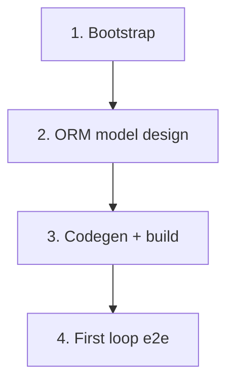

# Implementation Roadmap

> Last Updated: 2026-06-22
> Source: `docs/requirements/product-scope.md`, `docs/design/app-overview.md`, `docs/architecture/system-baseline.md`

## Purpose

This file is the global status index from design to implementation. After reading it, an AI or maintainer knows what is not started, planned, or completed without re-walking every doc and the codebase.

It contains no implementation detail. Each `planned` phase is owned by its execution plan.

> This roadmap is optional. See `docs/backlog/00-roadmap-authoring-guide.md` for authoring and update rules. Small projects can delete this file and rely on the backlog table alone.

## Phase Status

> **This is the only dynamic status block. Update status here only.**
> The roadmap is a human–AI alignment artifact: humans set the work items and their order; AI takes the first `todo` item in order, drafts/executes the plan automatically (humans do not review individual plans), and writes the item back to `done` on closure audit. See `docs/backlog/00-roadmap-authoring-guide.md` (Roadmap Role, Phase Granularity, Closed Loop).

- 1. Bootstrap (AGE init + ORM skeleton): `done`
- 2. ERP domain selection + ORM model design: `todo`
- 3. Multi-module codegen + first build: `todo`
- 4. First ERP business loop end-to-end: `todo`

## Status Values

| Status | Meaning |
| --- | --- |
| `todo` | Not started, no plan |
| `planned` | Has an execution plan |
| `done` | Completed and passed closure audit |

## Framework / Platform Reuse

Capabilities already provided by the stack, so the project does not rebuild them:

| Capability | Provided by | Notes |
| --- | --- | --- |
| Auth / users / roles | `nop-auth` (+ `app-erp-delta`) | already-introduced via Nop platform |
| ORM + codegen | `nop-orm`, `nop-cli` | already-introduced |
| AMIS pages + site-map | `nop-web`, `nop-web-amis-editor` | already-introduced |
| File storage | `nop-biz-file-core` | already-introduced |
| ERP business domain logic | — | not-introduced (next milestone) |

## Current Baseline

**Already implemented:**

- AGE documentation structure applied and customized for `nop-app-erp`
- `model/app-erp.orm.xml` skeleton with maven coordinates, empty dicts/domains/entities

**Main gaps:**

- specific ERP business domains not yet chosen (human decision)
- no entities in ORM model yet
- no generated Maven modules; project does not build yet

---

## Phases

| # | Phase | Owner Doc | Dependencies | Reuse |
| --- | --- | --- | --- | --- |
| 1 | Bootstrap (AGE init + ORM skeleton) | `docs/architecture/system-baseline.md` | — | nop platform modules |
| 2 | ERP domain selection + ORM model design | `docs/design/app-overview.md` | phase 1 | nop-orm, nop-cli |
| 3 | Multi-module codegen + first build | `docs/architecture/system-baseline.md` | phase 2 | nop-cli templates |
| 4 | First ERP business loop end-to-end | `docs/design/app-overview.md` | phase 3 | nop-auth, nop-web |

---

## Phase Details

### 1. Bootstrap (AGE init + ORM skeleton)

> Status: see Phase Status above (done)

**Goal:** initialize `nop-app-erp` with AGE documentation structure and an empty ORM model skeleton ready for ERP domain design.

**Delivery scope:**

- AGE docs tree copied and customized
- `model/app-erp.orm.xml` skeleton with maven coordinates
- root files (AGENTS.md, README, .gitignore, build scripts)
- backlog, roadmap, context docs reflect real bootstrap state

**Out of scope:** Java modules, entity design, build verification (all deferred).

**Modules / areas:** `docs/`, `model/`.

### 2. ERP domain selection + ORM model design

> Status: see Phase Status above (todo)

**Goal:** decide which ERP business domains are in scope and design the first entities in `model/app-erp.orm.xml`.

**Delivery scope:**

- requirement doc for the chosen domain(s)
- entities, dicts, domains in `model/app-erp.orm.xml`

**Out of scope:** Java generation (phase 3).

**Modules / areas:** `model/`, `docs/requirements/`, `docs/design/`.

### 3. Multi-module codegen + first build

> Status: see Phase Status above (todo)

**Goal:** generate the Maven multi-module project and confirm it builds.

**Delivery scope:**

- run `nop-cli gen` to produce api/codegen/dao/service/web/app/delta/meta modules
- real verification commands in `docs/context/project-context.md`
- `mvn clean package -DskipTests` passes
- first known-good baseline row in `docs/testing/known-good-baselines.md`

### 4. First ERP business loop end-to-end

> Status: see Phase Status above (todo)

**Goal:** implement and test the first complete ERP business loop.

**Delivery scope:**

- BizModel logic, AMIS pages, auth for the first domain
- end-to-end manual + automated test

---

## Dependency Graph

## Cross-Cutting

| Concern | Notes |
| --- | --- |
| Error handling | business exceptions extend `NopException` + `ErrorCode` |
| Permissions | nop-auth defaults + delta overrides in `app-erp-delta` |
| Testing | JUnit 5 + nop-autotest (after codegen) |
| Owner-doc sync | update design/architecture when a phase closes |
| Dev log | update `docs/logs/` after each implementation |

## Rule

- This file is a status index and coarse-grained split, not an execution plan.
- Each `planned` phase is owned by its execution plan.
- Phase status changes update the Phase Status block at the top of this file only.
