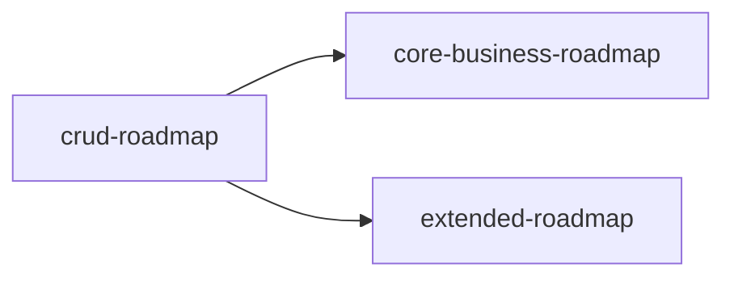

# 实施路线图总览

> 最后更新：2026-06-30

三个子路线图，由 mission driver 按顺序逐项推进：

| 路线图 | 覆盖范围 | 前置条件 | 状态 |
|--------|----------|----------|------|
| `crud-roadmap.md` | 全部 18 域 CRUD（codegen + 页面 + 菜单） | 无 | Phase 1-2 完成，Phase 3 待实施 |
| `core-business-roadmap.md` | 进销存+财务 5 域业务逻辑 + 业财一体端到端 | `crud-roadmap.md` 对应域完成 | `todo` |
| `extended-roadmap.md` | 其余 13 域业务逻辑 | `crud-roadmap.md` 对应域完成 | `todo` |

## 依赖关系

CRUD 是全部业务逻辑的前置条件。core 和 extended 无相互依赖，可并行。
