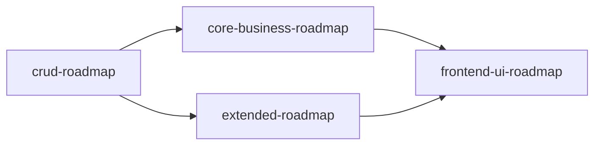

# Implementation Roadmap Overview

> 最后更新：2026-07-19

四个子路线图，由 mission driver 按顺序逐项推进：

| 路线图 | 覆盖范围 | 前置条件 | 状态 |
|--------|----------|----------|------|
| `crud-roadmap.md` | 全部 18 域 CRUD（codegen + 页面 + 菜单） | 无 | 18 域全 `done`（含冒烟测试） |
| `core-business-roadmap.md` | 进销存+财务+主数据业务逻辑 + 业财一体端到端 | `crud-roadmap.md` 对应域完成 | M1/M4/M5 全 `done`（含 1.1/1.2，经状态对账关闭：审批经 use-approval 迁移、触发经 1132-1/2、过账经 1.5/1.6/1.7、信用控制 AR 段经 1838-1） |
| `extended-roadmap.md` | 其余 13 域业务逻辑 | `crud-roadmap.md` 对应域完成 | M2/M3 全 `done`（含 2.4b/2.5b~d/2.6b~c） |
| `frontend-ui-roadmap.md` | 前端 UI 完整性（按钮/grid/form/page 结构/menu/复杂页面，F1-F16） | 以上三个路线图全部 done | `planned`（F1 已有实施计划） |

## Dependencies

CRUD 是全部业务逻辑的前置条件。core 和 extended 无相互依赖，可并行。
