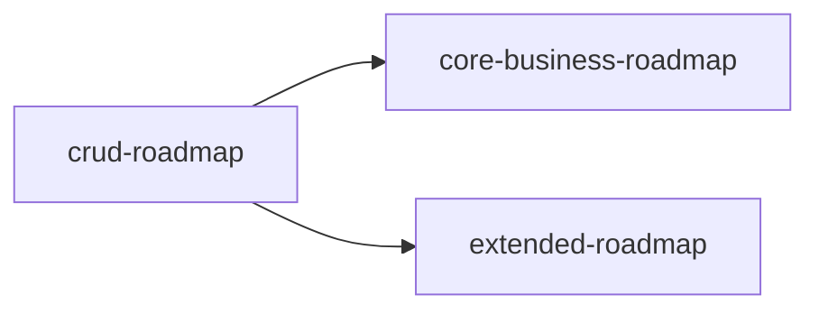

# Implementation Roadmap Overview

> 最后更新：2026-07-06

三个子路线图，由 mission driver 按顺序逐项推进：

| 路线图 | 覆盖范围 | 前置条件 | 状态 |
|--------|----------|----------|------|
| `crud-roadmap.md` | 全部 18 域 CRUD（codegen + 页面 + 菜单） | 无 | 18 域全 `done`（含冒烟测试） |
| `core-business-roadmap.md` | 进销存+财务+主数据业务逻辑 + 业财一体端到端 | `crud-roadmap.md` 对应域完成 | 多数工作项 `done`（M1 部分 `partial`，M1.12 `todo`）；M4/M5 全 `done` |
| `extended-roadmap.md` | 其余 13 域业务逻辑 | `crud-roadmap.md` 对应域完成 | M2 多数 `done`（2.2/2.5 `partial`，2.4b~2.6c `todo`）；M3 全 `done` |

## Dependencies

CRUD 是全部业务逻辑的前置条件。core 和 extended 无相互依赖，可并行。
