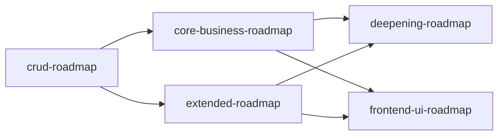

# Implementation Roadmap Overview

> 最后更新：2026-07-20

五个子路线图，由 mission driver 按顺序逐项推进：

| 路线图 | 覆盖范围 | 前置条件 | 状态 |
|--------|----------|----------|------|
| `crud-roadmap.md` | 全部 18 域 CRUD（codegen + 页面 + 菜单） | 无 | 18 域全 `done` |
| `core-business-roadmap.md` | 进销存+财务+主数据业务逻辑 + 业财一体端到端 | `crud-roadmap.md` 对应域完成 | M1/M4/M5 全 `done` |
| `extended-roadmap.md` | 其余 13 域业务逻辑 | `crud-roadmap.md` 对应域完成 | M2/M3 全 `done` |
| `deepening-roadmap.md` | 应用层深化与架构硬化（GL 映射、仿真引擎、跨境、API 参考模式等 11 项） | `core-business-roadmap.md` + `extended-roadmap.md` done | `todo`（11 项全部未开始） |
| `frontend-ui-roadmap.md` | 前端 UI 完整性（按钮/grid/form/page 结构/menu/复杂页面，F1-F16） | 以上四个路线图全部 done（前序不影响 UI 独立推进） | `planned` |

## Dependencies

CRUD 是全部业务逻辑的前置条件。deepening 依赖 core + extended 完成后启动。frontend-ui 可独立推进（依赖仅用于语义完成度）。
