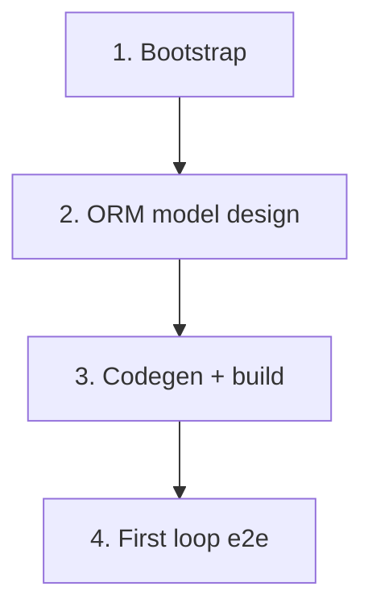

# 实施路线图

> 最后更新：2026-06-22
> 来源：`docs/requirements/product-scope.md`、`docs/design/app-overview.md`、`docs/architecture/system-baseline.md`

## 目的

本文件是从设计到实施的全局状态索引。阅读后，AI 或维护者无需重新浏览每个文档和代码库即可知道哪些未开始、已计划或已完成。

不包含实施细节。每个 `planned` 阶段由其执行计划拥有。

> 此路线图是可选的。有关编写和更新规则，请参阅 `docs/backlog/00-roadmap-authoring-guide.md`。小型项目可以删除此文件并仅依赖待办事项表。

## 阶段状态

> **这是唯一的动态状态块。仅在此处更新状态。**
> 路线图是人机对齐工件：人类设置工作项及其顺序；AI 按顺序获取第一个 `todo` 项，自动起草/执行计划（人类不审查单个计划），并在结束审计时将该项写回 `done`。请参阅 `docs/backlog/00-roadmap-authoring-guide.md`（路线图角色、阶段粒度、闭环）。

- 1. Bootstrap（AGE 初始化 + ORM 骨架）：`done`
- 2. ERP 域选择 + ORM 模型设计：`done`（10 域 145 实体已设计完成）
- 3. 多模块代码生成 + 首次构建：`done`（1096 Java 文件，82 模块 `mvn clean install -DskipTests` 全绿）
- 4. 第一个 ERP 业务循环端到端：`todo`

## 状态值

| 状态 | 含义 |
| --- | --- |
| `todo` | 未开始，无计划 |
| `planned` | 有执行计划 |
| `done` | 已完成并通过结束审计 |

## 框架/平台复用

堆栈已提供的能力，项目不再重建：

| 能力 | 提供者 | 备注 |
| --- | --- | --- |
| 认证 / 用户 / 角色 | `nop-auth`（+ `app-erp-delta`） | 通过 Nop 平台已引入 |
| ORM + 代码生成 | `nop-orm`、`nop-cli` | 已引入 |
| AMIS 页面 + 站点地图 | `nop-web`、`nop-web-amis-editor` | 已引入 |
| 文件存储 | `nop-biz-file-core` | 已引入 |
| ERP 业务域逻辑 | — | 未引入（下一个里程碑） |

## 当前基线

**已实现：**

- 为 `nop-app-erp` 应用并定制的 AGE 文档结构
- `module-<domain>/model/app-erp-<domain>.orm.xml` 骨架，包含 Maven 坐标、空字典/域/实体
- 10 域 ORM 模型（145 实体）设计完成并审计通过
- 全域 codegen 骨架已生成（1096 Java 文件：实体/DAO/I*Biz/BizModel 空壳/XMeta/view.xml）
- `app-erp-all` 聚合 app 构建通过（82 模块）

**主要差距：**

- BizModel 业务逻辑待深化（codegen 产物是标准 CRUD 空壳 `CrudBizModel<T>`）
- ErrorCode 待补齐
- 页面定制与端到端验证待开展

---

## 阶段

| # | 阶段 | Owner Doc | 依赖 | 复用 |
| --- | --- | --- | --- | --- |
| 1 | Bootstrap（AGE 初始化 + ORM 骨架） | `docs/architecture/system-baseline.md` | — | nop 平台模块 |
| 2 | ERP 域选择 + ORM 模型设计 | `docs/design/app-overview.md` | 阶段 1 | nop-orm, nop-cli |
| 3 | 多模块代码生成 + 首次构建 | `docs/architecture/system-baseline.md` | 阶段 2 | nop-cli 模板 |
| 4 | 第一个 ERP 业务循环端到端 | `docs/design/app-overview.md` | 阶段 3 | nop-auth, nop-web |

---

## 阶段详情

### 1. Bootstrap（AGE 初始化 + ORM 骨架）

> 状态：见上方阶段状态（done）

**目标：** 使用 AGE 文档结构初始化 `nop-app-erp`，并准备好空的 ORM 模型骨架供 ERP 域设计。

**交付范围：**

- AGE 文档树已复制并定制
- 各域 ORM 模型骨架已就位
- 根文件（AGENTS.md、README、.gitignore、构建脚本）
- 待办事项、路线图、上下文文档反映真实的 bootstrap 状态

**范围外：** Java 模块、实体设计、构建验证（均延迟）。

**模块/区域：** `docs/`、`model/`。

### 2. ERP 域选择 + ORM 模型设计

> 状态：见上方阶段状态（todo）

**目标：** 10 个业务域已确定，在各 `module-<domain>/model/` 中设计实体。

**交付范围：**

- 所选域的需求文档
- 各域 ORM 模型中的实体、字典、域

**范围外：** Java 生成（阶段 3）。

**模块/区域：** `model/`、`docs/requirements/`、`docs/design/`。

### 3. 多模块代码生成 + 首次构建

> 状态：见上方阶段状态（todo）

**目标：** 生成 Maven 多模块项目并确认它可以构建。

**交付范围：**

- 运行 `nop-cli gen` 生成 api/codegen/dao/service/web/app/delta/meta 模块
- `docs/context/project-context.md` 中的真实验证命令
- `mvn clean package -DskipTests` 通过
- `docs/testing/known-good-baselines.md` 中的第一个已知良好基线行

### 4. 第一个 ERP 业务循环端到端

> 状态：见上方阶段状态（todo）

**目标：** 实现并测试第一个完整的 ERP 业务循环。

**交付范围：**

- 第一个域的 BizModel 逻辑、AMIS 页面、认证
- 端到端手动 + 自动化测试

---

## 依赖图

## 横切关注点

| 关注点 | 备注 |
| --- | --- |
| 错误处理 | 业务异常扩展 `NopException` + `ErrorCode` |
| 权限 | nop-auth 默认值 + `app-erp-delta` 中的 delta 覆盖 |
| 测试 | JUnit 5 + nop-autotest（代码生成后） |
| Owner-doc 同步 | 阶段关闭时更新 design/architecture |
| 开发日志 | 每次实施后更新 `docs/logs/` |

## 高级场景扩展（可选，延迟到客户需求触发）

> 以下为 P1 独立扩展模块与 P2 场景，不纳入 10 域基线（`product-scope.md:49-52` 延迟范围）。设计已就位（骨架 + SPI 契约），实施延迟到客户需求触发。

### P1 独立扩展模块（设计骨架已就位，见计划 03）

| 模块 | Owner Doc | 触发条件 |
|---|---|---|
| CRM | `docs/design/crm/README.md` | 客户需要内建线索/商机管理（非仅从报价单起） |
| 运输/TMS | `docs/design/logistics/README.md` | 客户需要承运商网关对接（顺丰/DHL 等电子面单） |
| B2B/EDI/ASN | `docs/architecture/b2b-integration.md` | 客户需要与供应商/客户的 EDI 自动交换（X12/EDIFACT/UBL） |

### P2 场景（明确不纳入核心，按需独立扩展）

| 场景 | 触发条件 |
|---|---|
| DRP（分销需求计划） | 客户含大型多级分销网络（>5 分仓） |
| HRMS/薪酬/考勤 | 客户明确需要内建薪酬，或第三方 HR 集成不满足 |
| POS/门店零售/多渠道电商 | 目标客户群体转向 B2C/零售 |
| 售后服务/保修/客服工单 | 客户需要独立客服工单系统 |
| 库存 ABC 分类 | 盘点策略/成本控制需要 ABC 分级 |

详见 `docs/plans/03-advanced-scenario-design-gap-fill.md` 的 Deferred But Adjudicated 节。

## 规则

- 本文件是状态索引和粗粒度拆分，而非执行计划。
- 每个 `planned` 阶段由其执行计划拥有。
- 阶段状态更改仅更新此文件顶部的阶段状态块。