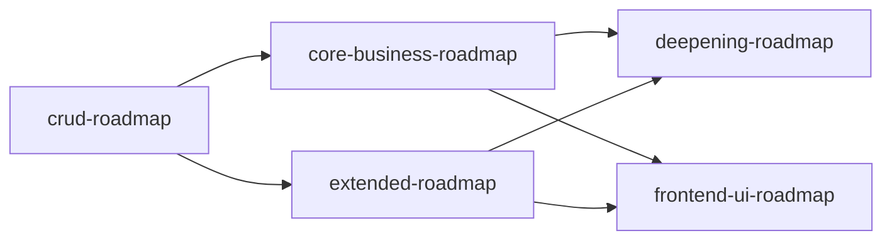

# Implementation Roadmap Overview

> 最后更新：2026-07-20

五个子路线图，由 mission driver 按顺序逐项推进：

| 路线图 | 覆盖范围 | 前置条件 | 状态 |
|--------|----------|----------|------|
| `crud-roadmap.md` | 全部 18 域 CRUD（codegen + 页面 + 菜单） | 无 | 18 域全 `done` |
| `core-business-roadmap.md` | 进销存+财务+主数据业务逻辑 + 业财一体端到端 | `crud-roadmap.md` 对应域完成 | M1/M4/M5 全 `done` |
| `extended-roadmap.md` | 其余 13 域业务逻辑 | `crud-roadmap.md` 对应域完成 | M2/M3 全 `done` |
| `deepening-roadmap.md` | 应用层深化与架构硬化（GL 映射、仿真引擎、跨境、API 参考模式等 11 项） | `core-business-roadmap.md` + `extended-roadmap.md` done | `done`（11/11 全 done） |
| `frontend-ui-roadmap.md` | 前端 UI 完整性（按钮/grid/form/page 结构/menu/复杂页面，F1-F16） | 以上四个路线图全部 done（前序不影响 UI 独立推进） | `done`（plan `2026-07-23-1408-3` 全 3 phase 完成：Phase 1 F1/F6 对账确认 + Phase 2 全量回归门控发现 19 失败 + Phase 3 全部修复闭环——制造完工回归 `reverseIfExists` posted 前置检查 / notify-inbox 裸变量 data / AMIS ErpMdPartner 非法 GraphQL + adapt typo / inventory.write input-table tabs / test-code 2 + config 1。残留 5 项 test-isolation 污染为已知非回归环境问题，1 项 master-data.write.amis selectOption↔switch 交互为 test-infra 已知项） |
| `audit-remediation-roadmap.md` | 全面审计与 P0/P1 彻底修复（串行+P0即时止血；基于复杂度分析的精细化工作项拆分；ORM 变更已授权） | 无（M0 自含基线建立） | `active` — M0 进行中（0.1/0.2 文件已产出待 closure audit，0.3 待执行）；MA1-MA7 审计 65 工作项 + MR1-MR3 修复 + MV 验证 + MG 沉淀待执行 |

## Dependencies

```mermaid
graph LR
    CRUD[crud-roadmap] --> Core[core-business-roadmap]
    CRUD --> Ext[extended-roadmap]
    Core --> Deep[deepening-roadmap]
    Ext --> Deep
    Core --> Frontend[frontend-ui-roadmap]
    Ext --> Frontend
```

CRUD 是全部业务逻辑的前置条件。deepening 依赖 core + extended 完成后启动。frontend-ui 可独立推进（依赖仅用于语义完成度）。
