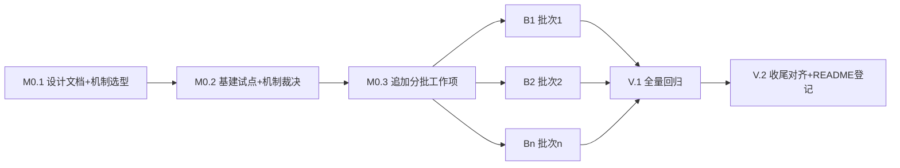

# 集成测试路线图（系统级黄金路径回归套件）

> 最后更新：2026-08-24（**B8 done——plan `docs/plans/2026-08-24-0749-1-b8-c15-c16-c17-crm-cs-hr.md` 四 Phase 完成**：C15 `TestErpC15CrmLeadForecast`（CRM 线索转化与销售预测：自包含线索 `ErpCrmLead__save` → qualify（入漏斗 QUALIFIED + 默认 stage STAGE-001/probability 30）→ moveStage（STAGE-001→STAGE-002 stageId 翻转）→ **convertToOpportunity 原地升格**（实施期勘误：实仓无 ErpCrmOpportunity 独立实体，设计文档旧动作名 `ErpCrmOpportunity__save` 漂移）→ 自包含赢单阶段（seed 无 isWonStage 行）+ moveStage 前移 → **convertToQuotation**（裁决：弃 CPQ generateQuote 路径，TestErpCrmLeadConversion 先例；弱指针 SALES_QUOTATION + CONVERTED）→ `ErpSalOrder__save`（**quotationId 回链**）+ 行 → submit/approve [DIRECT] → `ErpCrmReport__renderHtml("forecast-accuracy")`（token 50,000.00/45,000.00/80,000.00/**63,000.00 = forecast_line 行加权合计**——实施期裁决：63000 口径 = lineWeightedRevenue 15000+48000，报表 numberFormat #,##0.00））+ C16 `TestErpC16CsSlaNotification`（CS 工单 SLA 与通知派发：自包含 SLA 策略（类型精确 8h 日历模式）+ 宏响应 → `ErpCsTicket__save`（**save 后置自动挂载 SLA**：slaPolicyId+deadline 断言）→ 显式 matchAndAttachSla 幂等重挂 → 六态 assign/start/resolve/close（**无 respond——B2 C04 裁决复认**；resolve 置 isSlaCompleted = resolvedAt≤deadline 冻结时钟达标 true + **自动创建调研** token DB 反查）→ applyCannedResponse（usageCount 0→1 + {ticket_id} 渲染）→ close 终态 → `ErpCsSurvey__submitSurvey`（CSAT 5/NPS 9 与 seed 同值保持均值稳定——实施期勘误：旧动作名 ErpCsSurvey__save 漂移）→ `ErpCsReport__renderHtml("ticket-sla-csat-summary")`（投诉桶 5.00/9.00）→ 通知（**实施期勘误：工单链 notify 均静默降级不落库 → C09 自包含模板先例** notify→markRead→countUnread 归零））+ C17 `TestErpC17HrSalaryPayment`（HR 薪酬发放闭环：自包含核算环境（2026 税档 + emp1/emp2 合同 15000/8000 + 深圳社保/公积金配置 + 6601.01/6601.02）→ `ErpHrSalary__calculateSalary`（gross 15000/社保 EE 1200/公积金 EE 1800/个税 210/**net 11790** TestErpHrPayrollEngine 口径）→ `runPayroll`（全员批量：emp1 幂等跳过 + emp2 新建）→ submitForApproval（salary-approval xwf nopFlowId）→ **xwf 三级 agree + cc-hr confirm**（IWorkflowManager 后端驱动 setUserId("0")，B1/B2 复核先例首次全链实操于 app-erp-all）→ APPROVED + **计提链 270（Dr 6601/Cr 2211=15000）/290（6601.01/2211=2250）/300（6601.02/2211=1800）+ posted=true** → markPaid（PAID + **280 = Dr 2211/Cr 1002 = 净额 11790——实施期勘误：设计原文「Dr 费用/Cr 2211 = 薪资合计」为 270 口径误植；员工往来 ar_ap_item 断言不成立（纯 GL 无辅助账）；发放自动通知未实现 → C09 先例**）+ @NopTestProperty erp-hr.default-payroll-subject-id=2211（缺省空零凭证））三用例 RECORDING→CHECKING 往返全绿（**联合复跑 3/0/0 连跑六次稳定**）；冻结时钟 C15C16C17FrozenClockExtension（2026-07-17，C13C14 先例）；执行期处置：响应快照跨 run 实钟毫秒 @var 共享漂移（approvedAt/duration/sentAt 族）→ `*` 通配（B4-B7 先例，全 createTime/updateTime/sentAt 族统一通配）；**app-erp-all 47/0/0/1**（44 基线 + 3，含 3 新用例类）+ 全量 XML 聚合 **3827/0/30/1/636**（对照 B7 3824/0/0/1/633 差量 **+3 tests/+3 报告文件全额归因 B8**；**30 errors 非归因 B8——并发会话未提交 xwf starter 改造（payment/receipt/salary/asset-disposal approval 四文件 08:23 落盘）致 ast(5 类 9)/pur(TestErpPurProcureToPayEnd 4)/sal(3 类 7)/hr(3 类 10) 共 15 类 nop_wf_step_instance ACTOR_MODEL_ID 快照漂移，同一签名全量归因并发改造**；app-erp-all 侧 C01/C03/C17 同签名 3 处以 ACTOR_MODEL_ID 列 `*` 通配修复双态兼容）+ `mvn clean install -DskipTests` **156 模块 BUILD SUCCESS**；surefire 证据拷贝 `_tmp/b8-surefire-evidence/`（31 XML）；日志 + 基线差量登记 + 设计文档 §6 C15/C16/C17 勘误登记。下一步 B9（C18/C19，contract+b2b））。**B8 VERIFY 复核（同日，full-green verification）**：并发 xwf starter 快照迁移收尾（ast 5/pur 1/sal 3/hr 3 类 force-save 重录 + hr 2 处 PAYLOAD_JSON `*` 掩码保持）+ 本地 .m2 nop-batch WIP 构件污染修复（并发工作树安装的 cachedThreadPool 化 BatchTask 破坏冻结时钟 → master 源重装）后，全量单轮 `mvn test` **3827/0/0/1/636 全绿**（30 errors 终局归零；证据 `_tmp/b8-verify-surefire-evidence/`），详见当日日志 B8 VERIFY 节
> 2026-08-24（**B7 done——plan `docs/plans/2026-08-24-0541-2-b7-c13-c14-finance.md` 三 Phase 完成**：C13 `TestErpC13FinPeriodCloseReverse`（期末结账全链与反结账：自包含 USD 应收项（IT-C13-FX-001 100USD/openFunctional 1000）→ `ErpFinAccountingPeriod__preCheck`（未核销列表 = seed ARAP-EA-001/ARAP-EC-001 + 自包含外币项 + seed 折旧计划悬挂键 depreciation:2#2026-07）→ closePeriod（CLOSED + 五模块 CLOSED + **FX-REVAL-2026-07 凭证 Dr 6603 150/Cr 1122 150 + PERIOD-CLOSE-2026-07 凭证 Dr 5001 1130/Cr 4103 1130——实施期勘误：同事务 FX 凭证未 flush 致损益结转不含 FX 腿**）→ finalizePeriod（CLOSED_FINAL）→ reverseClose（OPEN + 模块回开 + 期末凭证红冲 isReversed=true）→ 重新结账（新凭证链接 ≥2 金额一致））+ C14 `TestErpC14FinBankReconBadDebt`（银行对账与坏账计提回收：自包含资金账户（1002 银行存款 1000）→ 对账单导入（3 行 CREDIT 未达 600，ending 1600）→ generate（恒等式平衡 DRAFT）→ post（BANK_RECON_ADJ Dr 1002 600/Cr 2240OTHER 600）→ reverse（CANCELLED 红冲闭环）→ 自包含 OPEN AR 1000（61-90 账龄档）→ 坏账 writeOff→submit→approve [DIRECT]（WRITTEN_OFF + Dr 1231/Cr 1122 1000）→ recover→submit→approve（回退 OPEN + Dr 1122/Cr 1231 1000）→ runBadDebtProvision（**必需 55 = seed EA 1000×0.005 + 自包含 1000×0.05，RESERVE Dr 6701/Cr 1231 55**））两用例 RECORDING→CHECKING 往返全绿（联合复跑 2/0/0 连跑两次稳定）；执行期裁决：C13 期间/凭证断言口径（preCheck 报告仅属性 getter 序列化、FX 腿未结转勘误、重结账幂等 = 新凭证、9 键科目 config @NopTestProperty——auto-post-on-close=true / bad-debt-allowance-gate-enabled=false / reverse-close-approval-required=false 三键必配）、冻结时钟采用 C13C14FrozenClockExtension（C07/C11/C12 先例）；C14 科目/计提口径（未达对方科目缺省键 2240OTHER、坏账三键 @NopTestProperty、计提金额 = 实仓 Calculator 口径、数据自包含建数未触发 seed 修正授权）；**执行期处置：C13/C14 响应快照跨 run 时间戳 @var 索引/millis 合并不稳定 → `*` 通配（B4/B5/B6 先例；tables 变更行 @var 索引保持——C13 双跑实证稳定）**；全量回归 **3824/0/0/1/633**（对照 B6 3822/0/0/1/631 差量 +2 tests / +2 报告文件全额归因 B7 两用例类，零新增失败；surefire 证据拷贝 `_tmp/b7-surefire-evidence/`）+ app-erp-all **44/0/0/1**（42 基线 + 2）+ `mvn clean install -DskipTests` 156 模块 BUILD SUCCESS；日志 + 基线差量登记 + 设计文档 §6 C13/C14 勘误登记。下一步 B8（C15/C16/C17，crm+cs+hr））
> 2026-08-24（**B4 done——plan `docs/plans/2026-08-24-0159-1-b4-c07-c08-c21-mfg-aps.md` 四 Phase 完成**：C07/C08/C21 三用例 RECORDING→CHECKING 往返全绿，全量回归 3818/0/0/1（+3 全额归因 B4），app-erp-all 38/0/0/1，clean install BUILD SUCCESS；执行期裁决：C07 完工驱动=reportCompletion、C08 释放=行级 release*，设计文档 §6 C07/C08 勘误登记。下一步 B5（C09/C10，quality+maintenance））
> 2026-08-23（**B3 done——plan `docs/plans/2026-08-23-2133-3-b3-c05-c06-inventory-cost.md` 三 Phase 完成**：C05 `TestErpC05InvLandedCost`（库存到岸成本分摊过账：自包含 FIFO 物料→PO→Receive approve posted（内建入库移动 + 原成本层 10@5=50）→自包含承运商/发运单（`ErpLogCarrier__save`+`ErpLogShipment__save`/get 来源核对 freightAmount=15）→LandedCost save+FREIGHT 行→**approve-only**（实仓无 submitForApproval，设计文档 §6 C05 动作名漂移勘误登记）→LANDED_COST 凭证 1401借15/2202贷15 + FIFO delta 调整层 unitCost=Δ=1.5/15 + Σ cost_layer=65 + stock_balance 10/65 联动）+ C06 `TestErpC06InvCostFlowCogs`（库存成本流转与 COGS：FIFO 物料→QA 来料检验（REJECTED 负路径阻断 `erp.err.pur.receive-inspection-blocked` + 保持 SUBMITTED + 无移动单；ACCEPTED 正路径放行）→Receive approve 内建 DONE 入库移动 + cost_layer 10@8.5=85（无显式 generateMove/confirm）→销售订单/出库审批→SALES_OUTPUT 凭证 6401借51/1401贷51（FIFO 6×8.5=51）+ ledger.totalCost=-51 + 出库后余额 4/34）RECORDING→CHECKING 往返全绿；**执行期修正：门控配置值 = ERP_PUR_RECEIVE（实仓常量，非计划原文 PUR_RECEIPT，设计文档 §6 C06 勘误登记）**；全量回归 **3815/0/0/1**（+2 全额归因 B3，零新增失败）+ app-erp-all **35/0/0/1** + `mvn clean install -DskipTests` 156 模块 BUILD SUCCESS；执行期处置：aps `TestErpApsAutoDispatch` 预存时间窗 flake（enabledHours 硬编码 01:00-02:00 于 01:22 运行误命中 → 动态窗外窗口 + ENABLED_HOURS 快照 `*` 通配，非 B3 引入）；roadmap B3 → done。下一步 B4 分批执行（C07/C08/C21，主导域 manufacturing + aps，按 roadmap 既有行））
> 来源：用户需求（2026-08-15）+ 需求澄清（两轮 question 全部裁决）+ 3 路独立子 agent 审查记录（2026-08-15 v1→v2）
> 规范：`docs/backlog/00-roadmap-authoring-guide.md`
> 执行：mission driver（`./tools/mission-driver.sh run integration-test`）；roadmap 状态块为唯一动态状态真相源

## 目的

本路线图在 **app-erp-all 单模块**统一装配一套**系统级黄金路径集成测试**：覆盖全 19 子系统（18 业务域 + notify 跨域通知）的关键业务路径，每用例跨 3+ 域、涉及审批/过账/状态机等复杂关键路径，通过它们确保核心业务畅通无阻。测试基于 **IGraphQLEngine + nop-autotest 录制回放**（三层全比对），JUnit 代码只检查关键性返回数据满足模式要求（成功/失败、关键状态、金额正确性等）。

**核心工作流**（用户指定）：① 先设计测试用例（M0.1 产出设计文档）→ ② 根据测试用例补充本路线图的分批工作项（M0.3）→ ③ 执行 roadmap 直至所有测试用例通过（B1-Bn + MV）。

## Work Item Status

> 唯一的动态状态块。状态：`todo` / `ready` / `done`。初始全 `todo`。M0.1 通过独立草案审查前，任何用例执行工作项不得转为 `ready`。
> **M1-Bn 里程碑不预注册工作项**（对齐 entity-state-machine 范本纪律）：M0.3 依设计文档向 M1-Bn 表追加实体工作项（初始 `todo`），追加前该表仅含注记无行。

### Milestone M0 — 测试用例设计与基建试点

| # | Work Item | Status | Owner Doc | Deps | Skill |
|---|---|---|---|---|---|
| M0.1 | 集成测试用例设计文档（`docs/design/integration-testing.md`）：15-25 用例全量设计（每用例含业务目标/前置 seed/关键路径步骤/三层断言/主导域/涉及域），覆盖全 19 子系统每域至少 1 次；**含用例覆盖矩阵（每域出现次数，目标每域 ≥2 次）验收表**；**含测试机制选型论证与可行性判据（见下方 M0.1 规格）**；独立子代理审查收敛 | done（2026-08-23：plan `docs/plans/2026-08-23-1835-1-m01-integration-test-case-design.md` 三 Phase 完成——设计文档 22 用例/19 域 ≥2 次/机制选型 (c) 选定 + 四风险判定方法/粒度约定 + 耗时模型/xwf 规避清单，两轮独立子代理审查收敛（0 BLOCKER 全程，末轮 0 MAJOR），设计文档 §10 持久化审查记录；roadmap 头「最后更新」注记；独立结束审计证据见该计划 Closure 段） | `docs/design/integration-testing.md` | — | `nop-testing` |
| M0.2 | 基建试点与**机制裁决**：app-erp-all 集成测试脚手架 + 1 个试点用例证明三层全比对机制可行（录制→校验往返）；**逐项实证 M0.1 选型机制的待证风险清单并记录结论**；试点失败时按回退路线降级（见下方 M0.2 规格） | done（2026-08-23：plan `docs/plans/2026-08-23-1835-2-m02-infra-pilot-mechanism-adjudication.md` 四 Phase 完成——surefire 串行化落地（app-erp-all 模块级 forkCount=1/parallel=none，覆盖父 POM 并行竞态）+ 基类 `ErpIntegrationTestCase`（机制 (c) 文件 H2 双模）+ 试点用例 `TestErpP2pPilot`（P2P 简化链 RECORDING→CHECKING 往返全绿，三层全比对验证）；**机制 (c) 成立无回退**，5 项待证风险全部实证（结论落盘设计文档 §3.4：NopJunitExtension 共存成立/CHECKING 态 = 部署 seed 结构性降级/restart × 文件 H2 成立/快照变更行 252K 量级/单用例 6s 低于模型）；共享 step helper 集（基类 10 helper）+ e2e-runbook「集成测试」注记；串行化暴露的 4 个既有宿主模式测试跨类污染已最小修复（ALL_LAZY 泄漏 + ConfigStarter 残留 VFS）；全量验证 156 模块 BUILD SUCCESS + 3809/0/0/1（+1 试点用例，零新增失败）） | `docs/design/integration-testing.md` | M0.1 | `nop-testing` |
| M0.3 | 依 M0.1 设计文档向 M1-Bn 里程碑追加 B1-Bn 分批工作项（按主导域分组 8-12 批，每批 1 工作项 2-3 用例，优先 18-22 用例校准），行内含用例编号/涉及域/Skill | done（2026-08-23：plan `docs/plans/2026-08-23-1835-3-m03-batch-work-item-expansion.md` 完成——依设计文档 §8 分批建议追加 B1-B10 共 10 批 22 用例（每批 2-3 用例，主导域分组，行含用例编号集/涉及域/依赖/Skill `nop-testing`），用例编号集 = 设计文档用例全集（C01-C21 含 C20a/C20b）一一对应零遗漏；分批核对通过（10 批 ∈ 8-12、每批 2-3、覆盖矩阵 19/19 域 ≥2 次 Σ88 分批后无回落）；独立子代理审查收敛（8/8 核验 PASS）；roadmap 头「最后更新」注记 + 日志；独立结束审计证据见该计划 Closure 段） | `docs/design/integration-testing.md` | M0.1 + M0.2 | none |

### Milestone M1-Bn — 分批用例执行（M0.3 依设计文档展开，不预注册）

> 追加行初始 `todo`，每批一个 plan：独立 plan-audit → 执行 → 独立 closure audit → 写回 `done`。
> M0.3 已依 `docs/design/integration-testing.md` §8 追加 B1-B10 行（2026-08-23，10 批 22 用例，与设计文档用例全集一一对应，无发明无遗漏）。

| # | Work Item | Status | Owner Doc | Deps | Skill |
|---|---|---|---|---|---|
| B1 | C01, C02（P2P 采购到付款黄金路径 / 采购退货与退款闭环；主导域 purchase；涉及 pur, inv, fin, md, ct） | done（2026-08-23：plan `docs/plans/2026-08-23-2133-1-b1-c01-c02-purchase-p2p-return.md` 三 Phase 完成——C01 `TestErpC01P2pGoldenPath`（PO 2 行物料→Receive→Invoice→**Payment 全链（xwf setUserId("0") 复核成立，app-erp-all 装配实证）→ `ErpPurPayment__settle` 域级核销 → `ErpFinReconciliation` 辅助账核销**，AP 项 SETTLED openAmount=0 + GL 应付余额 VoucherLine 聚合双裁决（正式应付口径 AP_INVOICE/PAYMENT credit−debit 净额，gl_balance 表不作断言源）+ 19 步 input/20 response 快照 + 26 表变更行）+ C02 `TestErpC02PurReturnRefund`（自包含合同 ErpCtContract__save+get 退货条款前置核对（Phase 2 合同数据来源裁决 = 自包含建数，未触发 seed 修正授权）→ 自包含已过账链 → 退货红字凭证 2202借/1401贷 + 反向 OUTGOING 移动 + PUR_RETURN 负项 −20 + 余额回减 36.5 + findOpenItemsByPartner 反查 + 18 步快照 + 19 表变更行）两用例 RECORDING→CHECKING 往返全绿；全量回归 3811/0/0/1（对照 3809/0/0/1 差量 +2 tests 全额归因 B1 两用例类，零新增失败）+ `mvn test -pl app-erp-all` 31/0/0/1（29 基线 + 2）+ `mvn clean install -DskipTests` BUILD SUCCESS；日志 `docs/logs/2026/08-23.md` + 基线差量登记 known-good-baselines.md） | `docs/design/integration-testing.md` §6 | M0.1 + M0.2 | `nop-testing` |
| B2 | C03, C04（O2C 销售到收款黄金路径 / 销售退货与客服联动；主导域 sales；涉及 sal, inv, fin, md, b2b, crm, cs） | done（2026-08-23：plan `docs/plans/2026-08-23-2133-2-b2-c03-c04-sales-o2c-return.md` 三 Phase 完成——C03 `TestErpC03O2cGoldenPath`（B2B EDI 自包含接收 `ErpB2bEdiDoc__createInbound`（SALES_ORDER，state=RECEIVED）→ CRM 商机自包含建数（以当前实现为准：无独立 ErpCrmOpportunity 实体，商机=ErpCrmLead leadType=OPPORTUNITY）+ 转化来源核对 → Order 10×100（1000/130/1130）submit/approve → Delivery submit/approve（SALES_OUTPUT 凭证 6401 借 1200/1401 贷 1200 = MOVING_AVERAGE 80@120 出库成本 + 库存移动 + 订单 DELIVERED）→ Invoice submit/approve（AR_INVOICE 凭证 1131 借 1130/6001 贷 1000/2221 贷 130 + AR 项 OPEN 1130）→ **Receipt xwf setUserId("0") 复核成立**（app-erp-all 装配实证，approveStatus=APPROVED+posted+nopFlowId 非空——B1 Payment 复核结论复用 + 本批独立实证 Receipt 同机制）→ `ErpSalReceipt__settle` 域级核销（发票 RECEIVED/收款 RECEIVED）→ `ErpFinReconciliation` 财务核销（AR 项 SETTLED openAmount=0，对齐 B1 实施期发现）→ **GL 应收余额 = 1131 VoucherLine 聚合**（businessType ∈ {AR_INVOICE,RECEIPT} debit−credit；seed 应收凭证行科目 1122 不混入）与 AR 总额两处一致（1130=1130、0=0））+ C04 `TestErpC04SalReturnWithCs`（CS 工单 save→assign→start→resolve→close 六态状态机（以当前实现为准：无 respond 动作）+ config off 隔离自动分派 → 自包含已过账销售链（SALES_OUTPUT 1200 + AR 项 OPEN 113）→ 退货 submit/approve（反向 INCOMING 入库移动 + SALES_RETURN 红字凭证 1401 借 480/6401 贷 480（config `erp-sal.return-cost-method=current` 当前 avgCost 120 口径——original 行价 10 致 AVG_COST 8440/74 除不尽快照精度漂移，实施期发现修正）+ 负 AR 项 −45.2 含税口径 + 余额回减 67.8 + `findOpenItemsByPartner` 反查）两用例 RECORDING→CHECKING 往返全绿（联合复跑 2/0/0）；全量回归 **3813/0/0/1**（对照 3811/0/0/1 差量 +2 tests / +2 报告文件全额归因 B2 两用例类，零新增失败）+ `mvn test -pl app-erp-all` **33/0/0/1**（31 基线 + 2）+ `mvn clean install -DskipTests` 156 模块 BUILD SUCCESS；执行期处置：drp `TestErpDrpWiringRegression` 2 方法与 logistics `TestErpLogDeliveryBooking` 9 方法日期漂移快照 `*` 通配（08-24 日历翻转暴露的预存快照漂移，M4.1 fin/qa 通配先例，非 B2 引入）；日志 `docs/logs/2026/08-23.md` + 基线差量登记 known-good-baselines.md + 设计文档 §6 C04 前置勘误登记） | `docs/design/integration-testing.md` §6 | M0.1 + M0.2 | `nop-testing` |
| B3 | C05, C06（库存到岸成本分摊过账 / 库存成本流转与 COGS 核算；主导域 inventory；涉及 inv, pur, fin, log, sal, mfg, qa） | done（2026-08-23：plan `docs/plans/2026-08-23-2133-3-b3-c05-c06-inventory-cost.md` 三 Phase 完成——C05 `TestErpC05InvLandedCost`（自包含 FIFO 物料→PO→Receive approve posted（内建入库移动 + 原成本层 10@5=50）→自包含承运商/发运单（ErpLogCarrier__save + ErpLogShipment__save/get 来源核对 freightAmount=15）→LandedCost save + FREIGHT 行 15→**approve-only**（实仓 ErpInvLandedCostBizModel 无 submitForApproval，设计文档 §6 C05 动作名漂移勘误登记）→LANDED_COST 凭证 1401借15/2202贷15 + FIFO delta 调整层（unitCost=Δ=1.5/15，incomingMoveId 负哨兵）+ Σ cost_layer=65 + stock_balance.totalCost=65 联动，BY_AMOUNT 分摊基数 = 收货行 amount（缺省 0 抛 NO_LINES——实施期发现登记））+ C06 `TestErpC06InvCostFlowCogs`（FIFO 物料→QA 来料检验（**门控配置值 = ERP_PUR_RECEIVE 实仓常量，非计划原文 PUR_RECEIPT——设计文档 §6 C06 勘误登记**；REJECTED 负路径阻断 `erp.err.pur.receive-inspection-blocked` + 保持 SUBMITTED + 无移动单；ACCEPTED 正路径放行）→Receive approve 内建 DONE 入库移动 + cost_layer 10@8.5=85 + stock_balance 10/85（**无显式 generateMove/confirm**）→销售订单/出库审批（PARTIAL 6/10）→SALES_OUTPUT 凭证 6401借51/1401贷51（FIFO 6×8.5=51，ledger.totalCost=-51）→出库后余额 4/34）两用例 RECORDING→CHECKING 往返全绿（联合复跑 2/0/0）；全量回归 **3815/0/0/1**（对照 3813/0/0/1 差量 +2 tests / +2 报告文件全额归因 B3 两用例类，零新增失败）+ `mvn test -pl app-erp-all` **35/0/0/1**（33 基线 + 2）+ `mvn clean install -DskipTests` 156 模块 BUILD SUCCESS；执行期处置：aps `TestErpApsAutoDispatch.testRuleSkipsDisabledHoldUntilAndOutsideHours` 预存时间窗 flake（enabledHours 硬编码 01:00-02:00，08-24 01:22 全量回归运行落入窗口致派工误判——非 B3 引入）→ 动态窗外窗口 now+2h~now+3h + ENABLED_HOURS 快照 `*` 通配（B2 drp/logistics 日期漂移通配先例）；日志 `docs/logs/2026/08-23.md` + 基线差量登记 known-good-baselines.md + 设计文档 §6 C05/C06 实施期勘误登记） | `docs/design/integration-testing.md` §6 | M0.1 + M0.2 | `nop-testing` |
| B4 | C07, C08, C21（制造工单全生命周期与完工过账 / MRP→APS→工单释放 / APS 排程发布与产能负荷；主导域 manufacturing + aps；涉及 mfg, aps, inv, pur, fin） | done（2026-08-24：plan `docs/plans/2026-08-24-0159-1-b4-c07-c08-c21-mfg-aps.md` 四 Phase 完成——C07 `TestErpC07MfgWorkOrderLifecycle`（自包含 FIFO 产成品 P + MOVING_AVERAGE 原料 M1 → BOM 1P=2M1 → M1 入库 10@5 → 工单 planned=1 DIRECT 审批 → checkAvailability→start → 领料 confirm 2×M1=10 → FIRMED 标准成本 8/unit → reportCompletion(1) → 完工入库 MANUFACTURE + MANUFACTURING_RECEIPT 10 + PRODUCTION_VARIANCE 2 + MATERIAL_USAGE +2=actual−standard；**完工驱动动作裁决：reportCompletion 非 close，设计文档 §6 C07 勘误登记**）+ C08 `TestErpC08MrpApsRelease`（自包含 P/M1 + BOM 1:1 + M1 onHand=4 → MRP 计划 + 手工需求 → runSimulation→promoteToFormalPlan → 行级释放 WO-MRP-xxx/PO-MRP-xxx → 净需求 10=10−0−0/6=10−4−0 → APS 排程 PUBLISHED + 工序订单 DRAFT→PLANNED→IN_PROGRESS→FINISHED；**释放动作名裁决：行级 release* 非 ErpMfgMrpPlan__release，设计文档 §6 C08 勘误登记**）+ C21 `TestErpC21ApsCapacityLoad`（自包含工序订单 → 排程 publish（PUBLISHED）→ crp-load-report HTML token WC-001/8.00/0.50 + 静态行不被重算覆盖）三用例 RECORDING→CHECKING 往返全绿；全量回归 **3818/0/0/1**（对照 3815/0/0/1 差量 +3 tests / +3 报告文件全额归因 B4，零新增失败）+ `mvn test -pl app-erp-all` **38/0/0/1**（35 基线 + 3）+ `mvn clean install -DskipTests` 156 模块 BUILD SUCCESS；执行期处置：响应快照时间戳 @var 索引跨 run 不稳定 → `*` 通配（B2 drp/logistics 先例）；日志 `docs/logs/2026/08-24.md` + 基线差量登记 + 设计文档 §6 C07/C08 实施期勘误登记） | `docs/design/integration-testing.md` §6 | M0.1 + M0.2 | `nop-testing` |
| B5 | C09, C10（质检门控与 NCR/CAPA/SCRAP 闭环 / 维护工单与备件消耗过账；主导域 quality + maintenance；涉及 qa, mnt, mfg, inv, fin, notify, ast） | done（2026-08-24：plan `docs/plans/2026-08-24-0159-2-b5-c09-c10-quality-maintenance.md` 三 Phase 完成——C09 `TestErpC09QaNcrCapaScrap`（自包含产成品 P MOVING_AVERAGE + BOM inspectionRequired=true → P 入库 10@5 → 工单 DIRECT 审批 → start → reportCompletion(1) 被完工门控阻断 `erp.err.mfg.work-order.inspection-required`（BOM 门控：config `erp-mfg.inspection-gate-enabled` + BOM inspectionRequired；close 结案放行证明阻断点 = reportCompletion 非 close）→ 质检单 recordResult REJECTED（实测 5 < 规格下限 10；自动生成 NCR sourceType=INSPECTION quantity=lotQuantity=2；`isInspectionCleared`=false）→ NCR submitReview（IN_REVIEW）→ resolve 门控双侧（无 CAPA 缺 noCapaReason 拒 `erp.err.qa.ncr.resolve-no-capa`；CAPA PENDING/COMPLETED 未验证拒 `erp.err.qa.ncr.resolve-capa-not-completed`）→ CAPA 三步 startAction/completeAction/verifyAction → RESOLVED → 置 dispositionType=SCRAP → postNcr（NCR_SCRAP 凭证 Dr 6711 营业外支出/Cr 1401 存货 = 2×5=10，posted=true）→ notify 域可达断言路径（自包含模板 `qa.ncr.resolved` + `ErpSysNotification__notify` → 站内通知落库 → markRead → countUnread 归零））+ C10 `TestErpC10MntRequestSparePart`（自包含维护请求 save（OPEN，设备 EQ-2026-001）→ 非法迁移守卫（OPEN startRepair 拒 `erp.err.mnt.request-illegal-status-transition`）→ accept（DRAFT RESPONSIVE Visit 生成 + requestId 回填 + visitDate=冻结日）→ startRepair（IN_PROGRESS）→ complete（六态终态 COMPLETED）→ visit schedule/start/complete（设备 UNDER_MAINTENANCE↔RUNNING 联动；关联请求终态 D6 写回 no-op）→ 自包含备件物料 M（MOVING_AVERAGE）+ 入库 10@5 → 消耗单 + 行 ×2 → confirm（`erp-mnt.spare-part-posting-enabled` 门控 @NopTestProperty 开启 → OUTGOING 出库移动 + MAINTENANCE_ISSUE 凭证 Dr 6602/Cr 1403 = 2×5=10 posted + 余额 10→8）→ `ErpAstAsset__get`（AST-2026-002 code/name/status 核对））两用例 RECORDING→CHECKING 往返全绿（联合复跑 2/0/0）；全量回归 **3820/0/0/1**（对照 3818/0/0/1 差量 +2 tests / +2 报告文件全额归因 B5，零新增失败）+ `mvn test -pl app-erp-all` **40/0/0/1**（38 基线 + 2）+ `mvn clean install -DskipTests` 156 模块 BUILD SUCCESS；执行期裁决：C09 完工门控阻断点 = reportCompletion（非 close）、NCR→notification 实仓无自动触发机制（notify 域既有机制作可达断言路径 + 设计文档 §6 C09 步骤 4 勘误）、SCRAP 过账不扣物理库存（凭证贷方 1401 表达，断言替换为借贷平衡 + quantity×avgCost）；C10 状态机六态（设计文档 §6 C10「5 态」勘误）、visit_task 仅 PLANNED 访问（RESPONSIVE 无任务，勘误）、备件库存自包含建数（seed MAT-003 余额无 location 与出库路径不匹配，B4 C07 同型裁决）；执行期处置：响应快照跨 run 时间戳 @var 索引/millis 合并不稳定 → `*` 通配（B4 drp/logistics 先例）；日志 `docs/logs/2026/08-24.md` + 基线差量登记 + 设计文档 §6 C09/C10 实施期勘误登记） | `docs/design/integration-testing.md` §6 | M0.1 + M0.2 | `nop-testing` |
| B6 | C11, C12（项目成本归集→CIP→资产资本化→维护设备 / 项目工时过账与结算损益；主导域 projects + assets；涉及 prj, ast, fin, md, mnt, hr） | done（2026-08-24：plan `docs/plans/2026-08-24-0541-1-b6-c11-c12-projects-assets.md` 三 Phase 完成——C11 `TestErpC11PrjCipCapitalizeMnt`（自包含成本归集单→CIP save→startConstruction→addCostItem 20000→**transferToAsset 内部资本化审批链建卡 + CAPITALIZATION 凭证 Dr 1601/Cr 1603**→资产卡 IN_SERVICE 原值=20000 + 折旧计划→设备卡 assetId 跨域引用）7 步链 + C12 `TestErpC12PrjTimesheetSettlement`（自包含项目/任务→工时单 8×500=4000→submit→approve（@NopTestProperty 开启 payroll 科目 2211→PROJECT_COST_COLLECTION 凭证 Dr 5101/Cr 2211）→结算 CLOSE createSettlement→submit→approve（转固建卡 + PROJECT_SETTLEMENT 凭证 Dr 1601/Cr 1603=30000）→损益结转 = FINAL 结算 approve（Dr 5101/Dr 4103/Cr 6001；seed PNL 行零改写断言））12 步链两用例 RECORDING→CHECKING 往返全绿（2/0/0）；**执行期裁决：C11 CIP 转固 = transferToAsset 内建资本化链（设计文档 §6 C11 步骤 2/3 动作面漂移勘误登记）；C12 工时借记科目 = 项目类型 defaultSubjectId（seed 项目类型缺失→自包含项目，未触发 seed 修正授权）+ 员工引用 = md 域 EMP-001（设计文档旧式码/动作面勘误登记）+ 结算 = createSettlement/submit/approve + 损益结转 = FINAL 结算 approve + seed PNL 行零交互**；执行期处置：C09/C11/C12 响应快照跨 run 时间戳 @var 合并不稳定 `*` 通配 78 处（C09 为 B5 预存 flake 本次复现修复）；全量回归 **3822/0/0/1/631**（对照 B5 3820/0/0/1/629 差量 +2 tests / +2 报告文件全额归因 B6，零新增失败）+ app-erp-all **42/0/0/1**（40 基线 + 2）+ `mvn clean install -DskipTests` 156 模块 BUILD SUCCESS；surefire 证据 `_tmp/b6-surefire-evidence/`；日志 + 基线差量登记 + 设计文档 §6 C11/C12 勘误登记） | `docs/design/integration-testing.md` §6 | M0.1 + M0.2 | `nop-testing` |
| B7 | C13, C14（期末结账全链与反结账 / 银行对账与坏账计提回收；主导域 finance；涉及 fin, sal, pur, inv, ast, prj, md） | done（2026-08-24：plan `docs/plans/2026-08-24-0541-2-b7-c13-c14-finance.md` 三 Phase 完成——C13 `TestErpC13FinPeriodCloseReverse`（自包含 USD 应收项驱动汇兑重估 → `ErpFinAccountingPeriod__preCheck`（未核销列表 = seed ARAP-EA-001/ARAP-EC-001 + 自包含项 + seed 折旧计划悬挂键）→ closePeriod（CLOSED + 五模块 CLOSED + FX-REVAL-2026-07 Dr 6603 150/Cr 1122 150 + PERIOD-CLOSE-2026-07 Dr 5001 1130/Cr 4103 1130）→ finalizePeriod（CLOSED_FINAL）→ reverseClose（OPEN + 模块回开 + 期末凭证红冲 isReversed）→ 重新结账（新凭证链接 ≥2））+ C14 `TestErpC14FinBankReconBadDebt`（自包含资金账户 1002 + 对账单 3 行未达 600 → generate 平衡 DRAFT → post（BANK_RECON_ADJ Dr 1002 600/Cr 2240OTHER 600）→ reverse（CANCELLED + 原凭证红冲）→ 自包含 OPEN AR 1000 → 坏账 writeOff→submit→approve [DIRECT]（WRITTEN_OFF + Dr 1231/Cr 1122 1000）→ recover→submit→approve（回退 OPEN + Dr 1122/Cr 1231 1000）→ runBadDebtProvision（必需 55 = seed EA 1000×0.005 + 自包含 1000×0.05 → RESERVE Dr 6701/Cr 1231 55））两用例 RECORDING→CHECKING 往返全绿（联合复跑 2/0/0 连跑两次稳定）；**执行期裁决：C13 期间/凭证口径——preCheck 报告属性 getter 序列化、closePeriod 同事务 FX 凭证未 flush 致 PERIOD_CLOSE 不含 FX 腿（1130 非 1280）、重结账幂等 = 新凭证、9 键科目 config @NopTestProperty（auto-post-on-close/gate 关闭/reverse-close-approval-required=false 三键必配）；C14 科目/计提口径——未达对方科目缺省 2240OTHER、坏账三键 @NopTestProperty、计提 = 实仓 Calculator（dueDate 账龄 + 期间 endDate asOf + 全应收无 org 过滤）、数据自包含建数**；执行期处置：C13/C14 响应快照跨 run 时间戳 @var 索引/millis 不稳定 → `*` 通配（B4/B5/B6 先例，tables 变更行 @var 索引保持已实证稳定）；全量回归 **3824/0/0/1/633**（对照 B6 3822/0/0/1/631 差量 +2 tests / +2 报告文件全额归因 B7 两用例类，零新增失败；surefire 证据拷贝 `_tmp/b7-surefire-evidence/`）+ app-erp-all **44/0/0/1**（42 基线 + 2）+ `mvn clean install -DskipTests` 156 模块 BUILD SUCCESS；日志 + 基线差量登记 + 设计文档 §6 C13/C14 勘误登记。下一步 B8（C15/C16/C17，crm+cs+hr，plan...） | `docs/design/integration-testing.md` §6 | M0.1 + M0.2 | `nop-testing` |
| B8 | C15, C16, C17（CRM 线索转化与销售预测 / CS 工单 SLA 与通知派发 / HR 薪酬发放闭环；主导域 crm + cs + hr；涉及 crm, cs, hr, sal, md, fin, notify） | done（2026-08-24：plan `docs/plans/2026-08-24-0749-1-b8-c15-c16-c17-crm-cs-hr.md` 四 Phase 完成——C15 `TestErpC15CrmLeadForecast`（save→qualify→moveStage 翻转→convertToOpportunity 原地升格→自包含赢单阶段→convertToQuotation 弱指针→ErpSalOrder quotationId 回链→DIRECT approve→forecast-accuracy token 50,000.00/45,000.00/80,000.00/63,000.00）+ C16 `TestErpC16CsSlaNotification`（save 自动挂载 SLA→matchAndAttachSla 幂等→assign/start/applyCannedResponse(usageCount+1)/resolve(isSlaCompleted=true+自动调研)/close→submitSurvey CSAT5/NPS9→ticket-sla-csat-summary 投诉桶 5.00/9.00→自包含通知 markRead/countUnread 归零）+ C17 `TestErpC17HrSalaryPayment`（自包含核算环境→calculateSalary net 11790→runPayroll 全员批量→submitForApproval→xwf 三级 agree+cc-hr confirm（IWorkflowManager 后端驱动）→APPROVED+270/290/300 计提链 posted=true→markPaid PAID+280 Dr 2211/Cr 1002=净额→自包含通知）三用例 RECORDING→CHECKING 往返全绿（联合复跑 3/0/0 六连稳定）；冻结时钟 C15C16C17FrozenClockExtension；**执行期裁决：C15 机会转化锚 convertToOpportunity（无独立实体）+ 报价走 convertToQuotation + 63000=行加权合计口径；C16 无 respond + SLA 达标=resolve 时点比较 + 通知静默降级改 C09 先例；C17 280=Dr 2211/Cr 1002 净额口径（270 误植勘误）+ ar_ap_item 断言删除（纯 GL）+ payroll 科目 @NopTestProperty 2211**；app-erp-all 47/0/0/1（44+3）；全量 XML 聚合 3827/0/30/1/636（**+3/+3 全额归因 B8；30 errors = 并发会话未提交 xwf starter 改造致 ast/pur/sal/hr 15 类 nop_wf 快照漂移，非归因 B8**，app-erp-all 侧 C01/C03/C17 同签名以 ACTOR_MODEL_ID 列 `*` 通配修复）；clean install 156 模块 BUILD SUCCESS；证据 `_tmp/b8-surefire-evidence/`；日志/基线差量/设计文档 §6 C15/C16/C17 勘误登记。下一步 B9（C18/C19） | `docs/design/integration-testing.md` §6 | M0.1 + M0.2 | `nop-testing` |
| B9 | C18, C19（合同生命周期与返利计提结算 / B2B ASN 自动收货与物流到岸成本；主导域 contract + b2b；涉及 ct, b2b, sal, fin, pur, inv, log） | todo | `docs/design/integration-testing.md` §6 | M0.1 + M0.2 | `nop-testing` |
| B10 | C20a, C20b（DRP 净需求与补货释放 / DRP 仿真与正式计划提升；主导域 drp；涉及 drp, pur, inv） | todo | `docs/design/integration-testing.md` §6 | M0.1 + M0.2 | `nop-testing` |

### Milestone MV — 全量验证与收尾

| # | Work Item | Status | Owner Doc | Deps | Skill |
|---|---|---|---|---|---|
| V.1 | 全量回归：全部集成测试用例三层全比对全绿 + 全量 reactor `mvn test`（含既有单测）+ `mvn clean install -DskipTests` BUILD SUCCESS；**零回归边界定义**（JUnit 层零新增失败——与 known-good-baselines 已登记预存失败口径一致项数不增；E2E 层零**意外**回归——seed 修正引起的既有 value spec/JUnit 快照更新视为已裁决变更逐条登记）；全绿基线登记 `known-good-baselines.md` | todo | `docs/testing/known-good-baselines.md` | 全部 Bn done | `nop-testing` |
| V.2 | 收尾对齐：快照重录义务双面登记 `docs/architecture/seed-data.md`（既有各域测试快照 + 新集成用例快照，seed CSV 变更须同步重录）；`docs/testing/e2e-runbook.md` 增「集成测试」段（运行方式/基线/fresh-DB 纪律/与 E2E server 互斥）；**`docs/backlog/README.md` 登记本路线图行**；日志更新 | todo | `docs/architecture/seed-data.md` + `docs/testing/e2e-runbook.md` + `docs/backlog/README.md` | V.1 | none |

## 框架/平台复用

- **nop-autotest 录制回放**：`JunitAutoTestCase` + `_cases/` 快照（input/tables CSV 加载 + output/response + output/tables 比对），既有 391 测试类先例
- **IGraphQLEngine**：GraphQL RPC 驱动业务动作（`executeRpc` + `request("xxx.json5", Map.class)` 范式），既有 224 测试类先例
- **部署期 seed**：`app-erp-all/src/main/resources/_vfs/_init-data/` **94 CSV + 1 SQL**（zz-sequence-advance.sql），`DataInitInitializer` 拓扑序加载（`nop.orm.init-database-data=true` 门控）
- **宿主模式**：`TestAuthSeedLoadingProof`（BaseTestCase + 手动 CoreInitialization + 文件型 H2 fresh-DB 清理 + daoProvider 全量加载）——**注意：与 JunitAutoTestCase 的 NopJunitExtension 继承冲突为待证风险（见 M0.2 规格），不得默认假设二者可组合**
- **各域既有 EndToEnd 测试**（`TestErpFinPeriodCloseEndToEnd`/`TestErpMfgMrpEndToEnd`/`TestErpPurReturnRefundEndToEnd` 等 12 个）作为单用例步骤与断言的业务参照，不重复实现其内部细节
- **Playwright E2E 260+ spec**：页面层验证（浏览器渲染/按钮/表单）由既有套件覆盖，本套件聚焦服务端跨域黄金路径三层比对，**不重复页面层验证**（分工边界）

## 当前基线

- **缺口**：app-erp-all 模块 11 个测试全部为 auth/web/meta 基建类，**零业务集成测试**；全仓 554 测试分散在各域 service 模块，无单模块统一装配的跨域黄金路径回归套件
- **既有资产**：94 seed CSV 全系统覆盖、554 测试（391 录制回放）、Playwright E2E 260+ spec（浏览器层，独立于本套件）
- **已知约束（可执行性实证）**：
  1. **surefire 并行竞态（BLOCKER 级，M0.2 必须解决）**：父 POM `nop-entropy/pom.xml` 配置 `forkCount=1C + reuseForks=true + parallel=classes`，app-erp-all 无模块级覆盖；多个文件型 H2（`db/erp.mv.db`）测试类并行 fork 下共享同一文件 → 删除/初始化/写库竞态。M0.2 基建必须在 app-erp-all 的 surefire 配置显式串行化（模块级 `forkCount=1`/`parallel=none` 或独立 surefire execution 隔离），并在 V.1 验证该配置生效
  2. **机制矛盾待证**：`JunitAutoTestCase` 硬编码 `@ExtendWith(NopJunitExtension)` 且缺 `@NopTestConfig` 抛异常；而 TestAuthSeedLoadingProof 手动初始化模式存在目的正是绕过 NopJunitExtension 的 ALL_LAZY schema 时序问题——两者在类继承层面的共存无既有证据（M0.2 待证风险 ①）
  3. **CHECKING 态 DB 组成**：`JunitAutoTestCase` CHECKING 分支硬编码 `setLocalDb(true)`，`AutoTestCaseDataBaseInitializer.createTables()` 只建 input/output 文件涉及的表——回放态 DB ≠「全量 94 seed」（M0.2 待证风险 ②）
  4. **快照规模澄清**：`output/tables` 只写**变更行**（非全库），`input/tables` 只写 ORM 装载行——「三层全比对快照巨大」担忧不成立，快照规模受用例触碰数据量约束（M0.2 实测确认）
  5. **运行时资源互斥**：集成测试与 Playwright E2E live server 共用 `db/erp.mv.db`（application.yaml `jdbc:h2:./db/erp`）——运行时互斥纪律登记 e2e-runbook（V.2）
- **已知执行边界**：文件型 H2 fresh-DB 重建（每用例/测试类隔离机制）；审批流用例须规避已知 xwf 参与者限制（Payment/Receipt 的 submitForApproval 被 wf 步骤参与者 user:$0 拒绝——既有实证，M0.1 设计应以当前实现为准选定已验证可执行的审批流）

## Milestones

- **M0** — 测试用例设计与基建试点（设计文档含机制选型 + 脚手架试点 + 追加分批工作项）
- **M1-Bn** — 分批用例实施（按主导域 8-12 批，每批 1 工作项，每批 2-3 用例；B1-Bn 由 M0.3 依设计文档追加，不预注册）
- **MV** — 全量验证与收尾（全回归 + 基线登记 + 快照维护义务 + README 登记）

## Work Item Details

- **M0.1**：编写 `docs/design/integration-testing.md`——15-25 用例全量设计。每用例规格：业务目标（对应核心业务闭环）、前置（依赖的 seed 数据/自包含数据）、关键路径步骤（GraphQL 动作序列）、三层断言（response 快照模式 + DB 状态快照 + JUnit 关键断言：成功/失败、状态翻转、金额/余额正确性）、主导域（批次归属）、涉及域（跨域清单，保证每域至少出现 1 次、原则上多用例出现）、复杂度判据（跨 3+ 域 + 审批/过账/状态机关键路径至少其一）。**用例覆盖矩阵**（每域出现次数，目标每域 ≥2 次）作为验收表。**测试机制选型论证**：(a) 标准 input/tables 范式（94 seed 仅录制期富集，回放态=input/tables 快照）vs (b) 自研基类（手动初始化 + AutoTestOrmHook 级 DB 采集 + 自实现三层比对）vs (c) 抑制 tableInit 的文件 H2 双模方案——选定并给出可行性判据（含与 NopJunitExtension 共存、CHECKING 态 DB 组成、per-method `container.restart()` × 文件 H2、seed 变更敏感性四风险的判定方法）。经独立子代理审查收敛（≥2 轮）。
- **M0.2**：app-erp-all 集成测试基建 + 机制裁决——(1) surefire 串行化配置落地；(2) 1 个试点用例（如 P2P 简化链）执行 RECORDING→CHECKING 往返；(3) **逐项实证 M0.1 选型机制的待证风险清单**（NopJunitExtension 共存 / CHECKING 态 DB 组成 / per-method restart × 文件 H2 / 快照构成与体积 / 单用例耗时），记录结论；(4) **试点失败回退路线**：若选型机制证伪，降级至标准范式 (a) 并调整用户裁决口径（须人工裁决登记）；(5) 共享 step helper 集（跨域链步骤/过账断言 helper，对标 Playwright `_helper.ts` 先例）供 B1-Bn 复用；(6) `e2e-runbook.md` 增集成测试运行注记。**用例粒度约定：1 用例 = 1 测试类 1 测试方法**（@BeforeAll 类级初始化，fresh-DB 每类 1 次；15-25 类 × ~12s 启动 ≈ 3-6 分钟纯启动 + 各用例执行，V.1 实测登记预期总耗时）。
- **M0.3**：依设计文档向 M1-Bn 里程碑追加实体工作项（B1-Bn，按主导域分组 8-12 批，优先 18-22 用例校准），每行含：用例编号集、涉及域、依赖、Skill（`nop-testing`）。追加行初始 `todo`。
- **B1-Bn**：每批一个 plan，实施该批 2-3 用例（测试类 + 快照录制 + JUnit 关键断言），独立 plan-audit → 执行 → 独立 closure audit → 写回 `done`。用例实现遵循设计文档规格；复用 M0.2 共享 step helper；新数据需求以自包含追加方式满足（不修改既有 seed 行，除非经 seed 修正授权流程）。
- **V.1**：全量 reactor `mvn test`（含全部集成测试 + 既有单测）+ `mvn clean install -DskipTests` + surefire 串行化生效确认。**零回归边界定义**：JUnit 层零**新增**失败——与 `known-good-baselines.md` 已登记预存失败（`ErpAllFluxPagesTest`/`ErpAllWebPagesTest` mfg cell-not-prop + `TestAuthSeedLoadingProof` NPE，修复依赖 nop-entropy 外部仓库/E4.1 successor）口径一致（项数不增）；seed 修正引起的既有 JUnit 快照重录（横切关注点 1/3 授权）与 E2E 侧同口径逐条登记为已裁决变更；E2E 层零**意外**回归。全绿后 `known-good-baselines.md` 登记基线。
- **V.2**：`seed-data.md` 登记快照重录义务**双面**（既有各域测试快照 + 新集成用例快照，任何 seed CSV 变更须同步重录，含变更 PR 说明）；`e2e-runbook.md` 增「集成测试」段（运行方式/基线/fresh-DB 纪律/**与 E2E server 互斥纪律**）；`docs/backlog/README.md` 登记本路线图行（优先级/工作项/路线图/状态 todo/自主权 plan-first）；日志更新。

## 依赖图

## 横切关注点

1. **快照重录义务**：三层全比对下任何 seed CSV 变更（含未来计划追加种子）都会破坏既有快照（既有各域测试快照 + 新集成用例快照双面）——变更方必须同步重录受影响快照；V.2 将此义务登记为 `seed-data.md` 强制规则。
2. **数据隔离**：每用例/测试类 fresh-DB 重建（文件型 H2 清理 + 全量 seed 重灌，经 M0.2 串行化保证无竞态），用例间零污染；用例内新增数据走自包含追加。
3. **seed 修正授权（用户裁决 2026-08-15）**：测试过程中发现 seed 数据**缺失或不正确**时，**直接修改/添加 seed CSV 修复**，确保测试实际有效并访问到关键数据。**两类资产区分**：裁决 3 授权的是**部署期 seed 资产**（`_vfs/_init-data/` 94 CSV，E2E/TestAuthSeedLoadingProof 消费）；`_cases/` 快照种子（input/tables）仍严格适用「种子只能追加」纪律（改既有快照行 = 重录该用例）。每处修正同步执行快照重录义务（横切关注点 1）+ **评估对既有 E2E 数值断言/期望值基线的影响并同步**（先例：SPC 追加 NCR 行曾联动更新 `quality.value.spec.ts` 的 openNcrCount）。
4. **产品缺陷修复路径（可执行性 M3）**：集成测试是系统级黄金路径，可能发现真实产品缺陷（过账/审批等）——**测试中发现的产品缺陷必须按保护区域表走既有门禁**（`accounting/finance postings` = plan-first + owner doc + tests；ORM/API/数据删除/外部仓库 = auto + dual-agent-approval，两个独立子 agent 分别批准），**不得在测试计划内直接改生产代码**；与「以当前实现为准」区分两类处理：缺陷修复（走门禁修复）+ 未实现功能（登记 Deferred But Adjudicated）。
5. **保护区域**：本路线图自身零 ORM/会计核心路径/数据删除变更（纯测试 + 文档，例外见横切关注点 4）。
6. **以当前实现为准**：不依赖 requirement-compliance 未落地越界项（RC-R1.44+，仍须独立 fix plan + 双独立子 agent 批准 checkbox）与 entity-state-machine M5；用例设计覆盖范围 = 当前已实现行为。
7. **CI 不接入**：本地全绿 + 基线登记（对齐既有 seed 测试范式）；CI 接线归 successor。

## 规则

1. 状态只属于工作项；里程碑无状态。
2. `todo` → `ready` 须独立草案审查；`ready` → `done` 须独立结束审计（mission driver 或人工按既定顺序推进）。
3. 工作项扩展仅限 M0.3 向 M1-Bn 追加行；追加行初始 `todo`，基于设计文档，不得自行发明范围。M1-Bn 在追加前**不含占位工作项行**。
4. 每工作项结束审计时更新设计文档/runbook/基线 + 日志。
5. 用例覆盖矩阵（每域出现次数，目标每域 ≥2 次）在 M0.1 设计文档中作为验收表格维护，V.1 核验。
6. **seed 修正纪律（用户裁决 2026-08-15）**：用例实施中发现的 seed 缺失/不正确必须直接修正（添加或修改部署期 CSV），不得绕过或用测试数据掩盖；每处修正记录理由 + 同步重录受影响快照（既有+新双面，横切关注点 1）+ 同步评估既有 E2E 数值断言期望值影响（横切关注点 3）。

## Draft Review Record

- Independent draft review iteration 1（3 路并行独立子 agent，2026-08-15，v1 → v2）：结论 = needs revision。发现 **1 BLOCKER + 5 MAJOR + 12 MINOR**，全部采纳修订：
  - **规范合规审查**（ses_ffa987147ffe92yP8iJh7caHqS）：MAJOR ① M1-Bn 占位行带 `todo` 状态与「不预注册」自相矛盾（→ 删除占位行，仅留注记，对齐 entity-state-machine 范本纪律）；MAJOR ② 新 roadmap 未登记 README（→ README P8 行 + V.2 义务）。MINOR 4 项：来源行引用不存在文档（→ 改为「需求澄清 + 审查记录」）、RC-R1.43+ 过时（→ RC-R1.44+，实仓核验 R1.43 已 done）、M0.2/V.1 details 偏实施规格（→ 下沉机制细节至设计文档/plan）、Milestones 段未列工作项（→ 保留摘要式，Work Item Status 为全量表格）。信息性 I1：mission-driver `roadmap-check.mjs` 对项目三列状态表全局解析为 0 工作项（→ 登记 Deferred But Adjudicated，模板层修复归外部工具链）。
  - **可执行性审查**（ses_ffa98574affeCJJjvuggG91zDw）：BLOCKER B1 父 POM `forkCount=1C+parallel=classes` × 共享文件型 H2 竞态（→ 已知约束 1 + M0.2 串行化落地 + V.1 生效确认）。MAJOR ① JunitAutoTestCase 硬编码 NopJunitExtension 与手动初始化模式继承矛盾 + CHECKING 态 DB 组成 ≠ 全量 seed + 快照规模澄清（output/tables 只写变更行）（→ M0.1 机制选型论证 + M0.2 待证风险清单 5 项 + 失败回退路线）；MAJOR ② V.1「抽样」未定义且 seed 修改必然破坏 E2E 数值断言（→ 全量 reactor mvn test + 零回归边界 + E2E 联动义务）；MAJOR ③ 用例实施中发现产品缺陷的修复路径缺失（→ 横切关注点 4 按保护区域表定义）。MINOR 6 项：用例粒度未定义（→ 1 用例 = 1 测试类 1 方法）、两类资产区分（部署 seed vs _cases 快照）、it 命令补充、与 E2E server 文件锁互斥、共享 step helper、xwf 参与者限制规避——全部落盘。
  - **覆盖面审查**（ses_ffa983e01ffeMpXPLegGWWb0KH）：MAJOR ① README 登记缺失（与规范审查同项合并解决）。MINOR 10 项：RC-R1.43+ 过时、seed 计数 94 CSV + 1 SQL、e2e-runbook 引用修正、V.1 状态块与 details 口径统一、E2E 数值断言基线联动、快照重录双面、规模边界（优先 18-22 用例）、覆盖矩阵目标每域 ≥2 次、与 E2E 分工边界声明、index.md 核查（可选采纳为 V.2 核查）——全部落盘。
- Independent draft review iteration 2（独立复审子 agent，2026-08-15，v2 后）：结论 = needs revision（1 残留 MAJOR + 4 MINOR，无 BLOCKER）。残留 MAJOR-1 V.1「JUnit 层零回归」未锚定已知预存失败（→ 改「零新增失败 + 与 known-good-baselines 预存失败口径一致 + JUnit 快照重录同口径逐条登记」）；MINOR-1 审查记录未持久化（→ 本节）；MINOR-2 mission description 未含机制待证风险 hedge（→ mission json 补 hedge 措辞）；MINOR-3 计数漂移 EndToEnd 13+→12（→ 已核实 12 个 `*EndToEnd.java`，修正为 12+）。修订后收敛，v3 定稿。

## Deferred But Adjudicated

- **CI 自动接线**：Classification: `out-of-scope improvement`。Why Not Blocking Closure: 用户裁决本地全绿 + 基线登记即可，不接 CI（对齐既有 seed 测试范式）。Successor Required: `yes`（触发条件：集成套件连续通过 + CI 已有 fresh-DB seed 装载机制）。
- **覆盖未实现功能的用例**：Classification: `out-of-scope improvement`。Why Not Blocking Closure: 以当前实现为准（用户裁决），用例设计不含未实现功能；若 Explore 中发现关键路径依赖未实现功能，改登记 successor 或调整用例。Successor Required: `yes`。
- **mission-driver monitor 进度解析限制**：Classification: `watch-only residual`。mission-driver 的 `roadmap-check.mjs` 对项目统一的三列状态表（`| # | Work Item | Status |`）解析为 0 工作项（模板层全局问题，非本 roadmap 特有），执行流程由 LLM 读 roadmap 全文驱动不受影响，monitor 进度 API 恒 0 属已知限制。Why Not Blocking Closure: 与既有全部 roadmap 行为一致，无新增回归，模板层修复归外部工具链。Successor Required: `yes`（触发条件：mission-driver 模板升级支持三列状态表时）。
