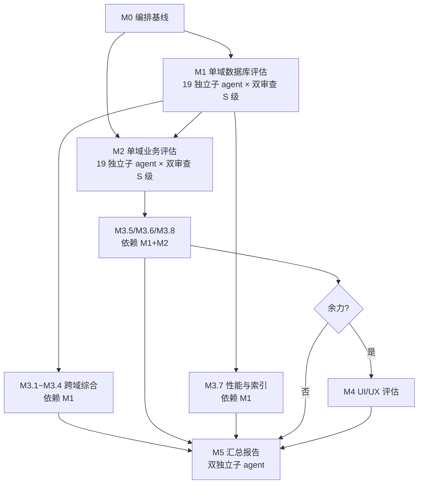

# 数据库与业务设计优化评估 Roadmap（深度调研版）

> 最后更新：2026-09-12（v3.3 收敛轮 — 修复 roadmap 结构残骸；统一以 methodology 为单一参数源；审查机制改为抽查式；优化机会表改为 8 必填+8 选填；跨域 grep 6 类；将幻影文件类型 xbiz/sql-lib 降级为"若存在"；补 XMeta/xpt.xml/i18n 资源；定义维度编码；独特洞察差异化；修正跨子 agent 关联矛盾）
> 状态：roadmap ready，所有工作项 `ready` 排队等待独立子 agent 执行
> 真相源：`docs/analysis/optimize/00-methodology.md`（调研方法 + 产出清单 + 反空话门槛 + 深度门槛）
> 验证标准：`docs/analysis/optimize/00-checklist.md`
> 输出索引：`docs/analysis/optimize/README.md`
> 来源：用户直接请求（"每个子报告都需要一个独立子 agent 去深度调研对应文档和代码，仔细分析代码中用到的业务模型，深入思考是否需要改进。这要求工作非常细致。彻底的审查"）
> 关联路线图：`audit-remediation-roadmap.md`（P0/P1 修复）/ `requirement-compliance-roadmap.md`（需求符合性）/ `entity-state-machine-migration-roadmap.md`（状态机 Bean）

## 目的

本路线图是**「每个子报告都由独立子 agent 做深度调研 + 彻底审查」**的评估任务规划。

与既有审计的根本区别：

| 既有审计 | 本路线图 |
|----------|----------|
| 找 bug 并修复（"哪里坏了"） | 评估设计是否最优（"哪里别扭 + 怎么改"） |
| 大批量并发调研（多域一次扫描） | **每域一个独立子 agent 单点深度调研** |
| 修复导向（实施变更） | **审查导向（产出可执行改进建议文档）** |
| 模板化扫描 | **每个工作项有专属调研清单 + 产出清单** |

## 核心约束（**强制执行**，缺一不可）

### 约束 1：每个工作项 = 一个独立子 agent 任务

> **每个 M1/M2/M3/M4 工作项必须由一个全新的、独立的子 agent 执行**。
>
> - 子 agent **必须在 fresh session 中启动**（不与执行者共享上下文）
> - 子 agent **不得参考其他域的评估输出**（避免交叉污染）
> - 子 agent **必须按本 roadmap 的"调研清单"和"产出清单"执行**
> - 子 agent 的执行结果 = 一个完整的 `domain-NN-*.md` / `biz-NN-*.md` / `cross-NN-*.md` / `ui-NN-*.md` 文件

### 约束 2：调研深度门槛（可验证）

每个工作项有明确的"深度门槛"，子 agent 必须达到才算完成。

> **参数真相源**：文件类型数/有效代码行数/核心流程数/优化建议数/反空话门槛的**具体数值与定义全部见 `00-methodology.md §4-§5`**。本文档不复述，避免漂移。

### 约束 3：独立审查机制（v3.3 抽查式）

#### 3.1 普通工作项（M1.A/B/C、M2.A/B/C、M4）

- 单独立子 agent 执行
- 子 agent 完成后，由执行者验证产出是否达到深度门槛
- 未达门槛的工作项必须返工

#### 3.2 关键工作项（M1.S + M2.S + M3 跨域综合 + M5 汇总）

- **双独立子 agent 审查**：
  - 第一独立子 agent：执行深度调研 + 产出评估文档
  - 第二独立子 agent（fresh session）：**抽查式审查**——不重复调研，按 P0 全查 + 随机补足至 8 处 file:line 实读核验（详见 `00-methodology.md §7.2`）
  - 审查者计算两个指标：A=引用准确率，B=P0 项实质分歧数
  - 执行者按 `00-methodology.md §7.2 Step 3` 的**单一有序判定**裁决（A≥0.8 且 B=0 → done）
- **适用范围**（v3.1 统一）：
  - M1.S（4 个 S 级域）
  - M2.S（4 个 S 级域）—— v3.1 统一口径
  - M3（全部 8 个跨域维度）
  - M5（汇总报告）
- **审查报告输出位置**：独立成 `*-review.md` 文件
- **返工条件**：A < 0.5 或 B ≥ 2（详见 `00-methodology.md §7.2 Step 3`）——不再使用旧"≥3 个 P0/P1 差异"口径
- **三方僵局**：引入第三独立子 agent

#### 3.3 跨域综合（M3）的特殊依赖

- M3.1~M3.4 依赖 M1 全部 done（且**基于 19 orm.xml 直接对比**，不只依赖 M1 输出）
- M3.5/M3.6 依赖 M1 + M2 全部 done
- M3.7 依赖 M1 全部 done
- M3.8 依赖 M2 全部 done
- M5 依赖 M1 + M2 + M3 全部 done（+ M4 条件）

#### 3.4 M4 触发条件（v3.1 二元化）

> M4 启动须满足**全部**以下条件：
> - M1+M2+M3 done
> - 剩余预算 ≥ 10 工作日
> - M1+M2+M3 输出中 UI 相关优化机会 ≥ 5 条（"UI 相关" = 触动 view.xml / page.yaml / UX 一致性的建议）

否则 M4 整体降级为 Deferred successor。

## 工作项调研清单（每个子 agent 必读文件 + 必产出内容）

> **重要（v3.3 单一参数源）**：调研清单、产出清单、深度门槛、优化机会字段、审查机制等**全部参数的真相源在 `docs/analysis/optimize/00-methodology.md`**。本文档只做 WBS 引用，**不复述任何参数值**。若本文档与 methodology 冲突，**以 methodology 为准**。
>
> 子 agent 执行 M1/M2/M3/M4 任一工作项前，必读：
> - `00-methodology.md §1` — 调研清单（含必读文件类型 + 6 类跨域 grep）
> - `00-methodology.md §2` — 产出清单（含 mermaid 流程图 + 8 必填+8 选填优化机会表）
> - `00-methodology.md §3` — 12 类别扭模式清单（含非常规检查方法）
> - `00-methodology.md §5` — 深度门槛（4 维度量化 + 有效代码定义）
> - `00-methodology.md §7` — 审查机制（抽查式）
> - `00-methodology.md §8` — 优化机会清单（8 必填 + 8 选填 + auditRef 默认 NEW）
> - `00-methodology.md §11` — 四大量表（契合度/状态机/UI/维度编码）

### A 类：单域数据库设计评估（M1.*）

- **调研清单**：详见 `00-methodology.md §1.1`
- **产出清单**：详见 `00-methodology.md §2.1`（含调研足迹/实体分析/mermaid 流程图/跨域调用图/状态机分析/索引分析/数据量估算/别扭模式/优化机会/独特洞察/总结 11 节）

### B 类：单域业务逻辑评估（M2.*）

- **调研清单**：详见 `00-methodology.md §1.2`
- **产出清单**：详见 `00-methodology.md §2.2`

### C 类：跨域综合（M3.*）

- **调研清单**：详见 `00-methodology.md §1.3`
- **产出清单**：详见 `00-methodology.md §2.3`

### D 类：UI/UX 评估（M4.*，条件触发）

- **调研清单**：详见 `00-methodology.md §1.4`
- **产出清单**：详见 `00-methodology.md §2.4`

## Work Item Status

> 状态：`todo` / `ready` / `done`。M0 done，M1-M4 全 `ready` 等待独立子 agent。

### Milestone M0 — 编排基线

| # | Work Item | Status | 调研深度 | 工作量（独立子 agent 工作日） |
|---|-----------|--------|----------|------------------------------|
| 0.1 | 创建评估输出目录结构 + README | done | — | < 0.5d |
| 0.2 | 撰写方法论（含调研清单 + 产出清单 + 反空话门槛） | done | — | 0.5d |
| 0.3 | 撰写 checklist（含可验证深度门槛） | done | — | 0.5d |
| 0.4 | 本 roadmap v3 编写（独立子 agent 任务约束） | done | — | 0.5d |

### Milestone M1 — 单域数据库设计评估（19 域，每域一个独立子 agent）

#### M1.S — S 级核心域（**双独立子 agent 审查**，深度门槛最高）

| # | Work Item | Status | 必读文件类型数（≥） | 必读代码行数（≥） | 工作量（独立子 agent） |
|---|-----------|--------|----------------------|---------------------|------------------------|
| 1.s1 | finance 深度调研 | ready | 12 类 | 8000（有效代码 ≥ 70%） | 3-4d（调研）+ 0.5-1d（抽查审查） |
| 1.s2 | manufacturing 深度调研 | ready | 12 类 | 8000（有效代码 ≥ 70%） | 3-4d（调研）+ 0.5-1d（抽查审查） |
| 1.s3 | hr 深度调研 | ready | 12 类 | 8000（有效代码 ≥ 70%） | 3-4d（调研）+ 0.5-1d（抽查审查） |
| 1.s4 | crm 深度调研 | ready | 12 类 | 8000（有效代码 ≥ 70%） | 3-4d（调研）+ 0.5-1d（抽查审查） |

**子 agent 必读重点**：
- finance：51 实体 × 完整流程 + 13 notGenCode 外部实体 + 跨域过账 Provider 全景
- manufacturing：BOM/工艺/工单/MRP/CRP/成本滚算六联动
- hr：员工/合同/薪酬/个税/社保/排班全生命周期
- crm：线索-商机-活动-评分-预测-区域六组件

#### M1.A — A 级核心域（**单独立子 agent**，深度门槛中等）

| # | Work Item | Status | 必读文件类型数（≥） | 必读代码行数（≥） | 工作量 |
|---|-----------|--------|----------------------|---------------------|--------|
| 1.a1 | purchase 深度调研 | ready | 10 类 | 4000 | 1-2d |
| 1.a2 | sales 深度调研 | ready | 10 类 | 4000 | 1-2d |
| 1.a3 | inventory 深度调研 | ready | 10 类 | 4000 | 1-2d |
| 1.a4 | assets 深度调研 | ready | 10 类 | 4000 | 1-2d |
| 1.a5 | maintenance 深度调研 | ready | 10 类 | 4000 | 1-2d |
| 1.a6 | projects 深度调研 | ready | 10 类 | 4000 | 1-2d |
| 1.a7 | quality 深度调研 | ready | 10 类 | 4000 | 1-2d |
| 1.a8 | cs 深度调研 | ready | 10 类 | 4000 | 1-2d |
| 1.a9 | master-data 深度调研（DAG 根域） | ready | 10 类 | 4000 | 1-2d |

#### M1.B — B 级扩展域（单独立子 agent，深度门槛较低）

| # | Work Item | Status | 必读文件类型数（≥） | 必读代码行数（≥） | 工作量 |
|---|-----------|--------|----------------------|---------------------|--------|
| 1.b1 | contract 深度调研 | ready | 8 类 | 3000 | 0.5-1d |
| 1.b2 | b2b 深度调研 | ready | 8 类 | 3000 | 0.5-1d |
| 1.b3 | drp 深度调研 | ready | 8 类 | 3000 | 0.5-1d |

#### M1.C — C 级小型域（单独立子 agent，简要调研）

| # | Work Item | Status | 必读文件类型数（≥） | 必读代码行数（≥） | 工作量 |
|---|-----------|--------|----------------------|---------------------|--------|
| 1.c1 | aps 深度调研 | ready | 5 类 | 1000 | 1d |
| 1.c2 | logistics 深度调研 | ready | 5 类 | 1000 | 1d |
| 1.c3 | notify 深度调研（跨域通知派发子系统） | ready | 5 类 | 1000 | 1d |

### Milestone M2 — 单域业务逻辑评估（19 域，每域一个独立子 agent）

> M2 与 M1 同样按 S/A/B/C 分级，同样按双独立/单独立子 agent 配置。

#### M2.S — S 级核心域（**双独立子 agent 审查**——v3.1 统一口径）

| # | Work Item | Status | 工作量 |
|---|-----------|--------|--------|
| 2.s1 | finance 业务逻辑深度调研（业财过账 + 多币种 + AR-AP + 期间 + 预算） | ready | 3-4d + 0.5-1d 抽查 |
| 2.s2 | manufacturing 业务逻辑深度调研（BOM/工艺/工单/MRP/CRP/成本/委外） | ready | 3-4d + 0.5-1d 抽查 |
| 2.s3 | hr 业务逻辑深度调研（员工 + 合同 + 薪酬 + 个税 + 社保 + 排班） | ready | 3-4d + 0.5-1d 抽查 |
| 2.s4 | crm 业务逻辑深度调研（线索-商机-活动-评分-预测-区域） | ready | 3-4d + 0.5-1d 抽查 |

#### M2.A — A 级核心域（**单独立子 agent**）

| # | Work Item | Status | 工作量 |
|---|-----------|--------|--------|
| 2.a1 | purchase 业务逻辑深度调研 | ready | 1-2d |
| 2.a2 | sales 业务逻辑深度调研 | ready | 1-2d |
| 2.a3 | inventory 业务逻辑深度调研 | ready | 1-2d |
| 2.a4 | assets 业务逻辑深度调研 | ready | 1-2d |
| 2.a5 | maintenance 业务逻辑深度调研 | ready | 1-2d |
| 2.a6 | projects 业务逻辑深度调研 | ready | 1-2d |
| 2.a7 | quality 业务逻辑深度调研 | ready | 1-2d |
| 2.a8 | cs 业务逻辑深度调研 | ready | 1-2d |
| 2.a9 | master-data 业务逻辑深度调研 | ready | 1-2d |

#### M2.B/C — B/C 级域（单独立子 agent）

| # | Work Item | Status | 工作量 |
|---|-----------|--------|--------|
| 2.b1 | contract 业务逻辑深度调研 | ready | 0.5-1d |
| 2.b2 | b2b 业务逻辑深度调研 | ready | 0.5-1d |
| 2.b3 | drp 业务逻辑深度调研 | ready | 0.5-1d |
| 2.c1 | aps 业务逻辑深度调研 | ready | 1d |
| 2.c2 | logistics 业务逻辑深度调研 | ready | 1d |
| 2.c3 | notify 业务逻辑深度调研 | ready | 1d |

### Milestone M3 — 跨域综合（**全部双独立子 agent 审查**）

> 跨域综合对全项目一致性影响大，必须双独立子 agent。

| # | Work Item | Status | 工作量 |
|---|-----------|--------|--------|
| 3.1 | 跨域同名/同义实体对比 | ready | 2-3d + 0.5-1d 审查 |
| 3.2 | 跨域命名规范评估 | ready | 1-2d + 0.5d 审查 |
| 3.3 | 跨域字段标准评估（金额/日期/比率/精度） | ready | 2-3d + 0.5-1d 审查 |
| 3.4 | 跨域字典复用与冲突 | ready | 1-2d + 0.5d 审查 |
| 3.5 | 跨域依赖与数据流（"别扭"路径识别） | ready | 2-3d + 0.5-1d 审查 |
| 3.6 | 跨域冗余与可优化结构 | ready | 2-3d + 0.5-1d 审查 |
| 3.7 | 跨域性能与索引（百万/千万级表） | ready | 2-3d + 0.5-1d 审查 |
| 3.8 | 跨域业务规则一致性（多币种/税额/汇率） | ready | 2-3d + 0.5-1d 审查 |

### Milestone M4 — UI/UX 一致性评估（**单独立子 agent**，条件触发）

> **触发条件**（二元化）：M1+M2+M3 done 后剩余预算 ≥ 10 工作日 AND M1+M2+M3 输出中 UI 相关优化机会 ≥ 5 条（"UI 相关" = 触动 view.xml / page.yaml / UX 一致性的建议）。
> 详见 §约束 3.4。

| # | Work Item | Status | 工作量 |
|---|-----------|--------|--------|
| 4.1 | 菜单结构与权限呈现 | ready（条件触发） | 1d |
| 4.2 | 列表页一致性 + 大数据量表性能 | ready（条件触发） | 1-2d |
| 4.3 | 表单页一致性 + 业务需求表达 | ready（条件触发） | 1-2d |
| 4.4 | 按钮与交互一致性 + 业务动作覆盖度 | ready（条件触发） | 1d |
| 4.5 | 看板与报表一致性 + 跨域数据流可视化 | ready（条件触发） | 1-2d |

### Milestone M5 — 汇总报告（**双独立子 agent 审查**）

| # | Work Item | Status | 工作量 |
|---|-----------|--------|--------|
| 5.1 | 优化机会清单聚合（M1+M2+M3 全部发现） | ready | 1-2d |
| 5.2 | 汇总报告（执行摘要 + 主要发现 + 优先级矩阵 + 实施路径 + 后续 roadmap 草案） | ready | 2-3d + 1d 审查 |
| 5.3 | backlog README 登记 | ready | <0.5d |

## 总工作量估算

| 类别 | 工作项数 | 单项工作量 | 总工作量 |
|------|----------|------------|----------|
| **M1.S**（调研+抽查） | 4 | 3.5-5d | 14-20d |
| **M1.A** | 9 | 1-2d | 9-18d |
| **M1.B** | 3 | 0.5-1d | 1.5-3d |
| **M1.C** | 3 | 1d | 3d |
| **M2.S**（调研+抽查） | 4 | 3.5-5d | 14-20d |
| **M2.A** | 9 | 1-2d | 9-18d |
| **M2.B/C** | 6 | 0.5-1d | 3-6d |
| **M3**（调研+抽查） | 8 | 2-4d | 16-32d |
| **M4**（条件触发） | 5 | 1-2d | 5-10d |
| **M5**（调研+抽查） | 2 | 2-4d | 4-8d |
| **总计（独立子 agent 工作日）** | | | **约 79-144d** |

> **并行优化**：跨域独立子 agent 之间可并行；M1 全部完成后 M3 才启动；M1+M2 全部完成后 M3.5/M3.6/M3.8 才启动。
>
> **保守日历时间估算**（假设 2-3 个并行子 agent + 串行依赖）：
> - M1 阶段：~15-25 日历天
> - M2 阶段：~15-25 日历天
> - M3 阶段：~10-15 日历天
> - M4+M5：~5-10 日历天
> - **总计：~45-75 日历天**（约 2-3 个月）

## "别扭"模式识别清单（每个子 agent 必查）

> **v3.2 物理去重**：12 类别扭模式清单的**真相源在 `00-methodology.md §3`**，本文档不再复述。
>
> 简介：来自既有分析（`docs/analysis/2026-07-16-ddd-implementation-gap-analysis.md` 等）+ 本路线图新增。
> 命中门槛：≥ 3 类 + ≥ 5 实例（S 级）/ ≥ 3 实例（A 级）/ ≥ 2 实例（B/C 级）

## 输出文件结构

```
docs/analysis/optimize/
├── README.md                          # 总览 + 评估背景 + 文件索引
├── 00-methodology.md                  # 真相源：调研清单 + 产出清单 + 反空话门槛 + 深度门槛
├── 00-checklist.md                    # 验证标准
├── 00-summary-findings.md             # 优化机会清单（M5.1）
├── 00-summary-report.md               # 汇总报告（M5.2）
│
├── domain-{01-19}-{slug}.md           # M1 单域数据库设计评估（19 域）
├── biz-{01-19}-{slug}.md              # M2 单域业务逻辑评估（19 域）
├── cross-{01-08}-{slug}.md            # M3 跨域综合分析（8 维度）
└── ui-{01-05}-{slug}.md               # M4 UI/UX 一致性评估（5 维度，条件触发）
```

**每个文件必含结构**：

> **v3.2 物理去重**：详见 `00-methodology.md §2.1/§2.2/§2.3/§2.4`（M1/M2/M3/M4 各自的产出清单模板）。本文档不再复述。

**文件大小**：见 `00-methodology.md §5（文件大小约束）`——单文件 1500-2500 行，超出则拆分 sub-文件并更新 README 索引。

## 评估硬约束

1. **不引入代码/配置/ORM/契约变更**——所有"建议"为文档级输出
2. **不重复既有审计/分析**——仅识别"非缺陷但可优雅化"的设计层问题
3. **每个子 agent 必须达到深度门槛**——未达门槛必须返工
4. **关键工作项必须双独立子 agent 审查**——未通过审查必须重新调研
5. **保护区域建议须标注**——任何触及 ORM/api.xml/auth/permissions/accounting/finance postings 的建议，归 `plan-first` 或 ask-first

## 依赖图



## 横切关注点

1. **独立子 agent 隔离**：每个 M1/M2 子 agent 在 fresh session 启动，不与执行者共享上下文，不读其他域的评估产出（避免交叉污染）。**注意**：M3/M5 例外——M3/M5 子 agent 必须读全部 M1/M2 产出（这正是"跨子 agent 关联洞察"的来源）。M1/M2 子 agent 只做"基于本域代码的跨域关联观察"（推测），不读他域产出。

2. **ORM ask-first 边界**：本路线图不修改 ORM 模型——所有"建议"为文档级。若后续实施触动 ORM，必须走 ORM ask-first 双独立子代理批准流程。

3. **保护区域边界**：所有"建议"涉及 accounting/finance postings 或 auth/permissions 的，归 `plan-first`；触动 ORM 模型归 `auto + dual-agent-approval`。

4. **深度门槛验证**：执行者验证每个子 agent 产出是否达到调研深度门槛（必读文件数 + 必读代码行数 + 产出清单完整度 + 反空话自检）。未达门槛必须返工。

5. **独立审查机制**：M1.S + M2.S + M3 + M5 必须双独立子 agent 审查（详见约束 3）。

6. **不引入代码变更**：本路线图是评估任务，所有输出均为分析/建议文档。

## 规则

1. **每个工作项必须有独立子 agent 执行**——禁止批量扫描代替深度调研。
2. **每个工作项有明确调研深度门槛**——未达门槛不得标记 done。
3. **关键工作项必须有独立审查**——禁止自我审查。
4. **保持粗粒度**——Work Item Details 是简短列表，不是实现步骤。
5. **里程碑无状态**——只在工作项上跟踪状态。
6. **不重述 owner-doc 内容**——评估文档聚焦"是否最优"。
7. **里程碑完成判据**：
   - M1/M2 完成 = 所有域评估文件 done + 调研足迹完整 + 12 类别扭模式覆盖
   - M3 完成 = 所有跨域综合文件 done + 双独立子 agent 审查通过
   - M5 完成 = 汇总报告 + 优化机会清单 + backlog 登记

## 反模式（避免）

1. **批量扫描代替深度调研**——禁止一个子 agent 做多域评估
2. **简单列问题清单**——禁止"建议优化索引"等空话（违反反空话门槛）
3. **不读代码就下结论**——禁止只读 ORM XML 就写评估文档
4. **不验证深度门槛**——禁止"看起来差不多就过了"
5. **跳过独立审查**——禁止"我自己验证就够"
6. **重复 owner-doc 内容**——禁止重述"什么是 P2P"，应评估"P2P 在当前模型下是否最优"
7. **混淆"缺陷"与"别扭"**——本路线图评估的是"别扭"（非缺陷但可优雅化），不是 P0/P1 bug

## 更新触发

| 事件 | 更新 | 前置条件 |
|------|------|----------|
| 域评估子文件 done | 工作项 `ready` → `done` + README 索引更新 | 子文件已写完 + **调研深度门槛达到** + 双审查（如适用）通过 |
| 跨域综合子文件 done | 工作项 `ready` → `done` + README 索引更新 | 同上 |
| M5 汇总报告 done | backlog README.md 新增 roadmap 行 | M1+M2+M3 done（+ M4 条件触发） |
| M4 触发或降级 | 路线图 M4 状态更新 | M1+M2+M3 done 后的余力判断 |
