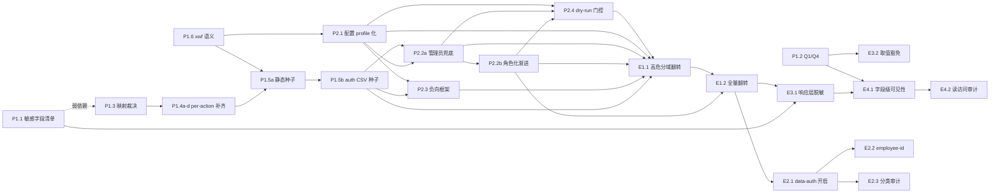

# 权限 enforcement 开启（测试环境）路线图

> 最后更新：2026-08-09
> 触发条件：RBAC 精细化 / 合规审计需求（`roles-and-permissions.md` §角色→权限点映射）+ 人工批准（2026-08-05，测试环境开启 enforcement；2026-08-06，启动执行并委托全部实施决策）
> 来源：`docs/backlog/README.md` + `docs/discussions/2026-08-05-1800-ai-mfg-rd-bom-and-procurement-confidentiality.md` §讨论点四 + `docs/design/roles-and-permissions.md`
> 执行：mission driver（`./tools/mission-driver.sh run permissions-enforcement`）；roadmap 状态块为唯一动态状态真相源
> 规范：`docs/backlog/00-roadmap-authoring-guide.md`
> 审查记录：独立子代理 3 路（规范合规 / 覆盖面 / 可执行性）review iteration 1 → 需修订（2 blocker / 10 major / 20 minor），本版合并修订；iteration 2 复核 → 需修订（0 blocker / 1 major / 13 minor），已并入本版；iteration 3 复核 → 需修订（0 blocker / 1 major / 6 minor），已并入本版；iteration 4 终审 → 通过（0 blocker / 0 major / 3 minor，信息性）；见文末「审查记录」。

## 目的

本路线图覆盖 nop-app-erp 权限系统从**声明层**（已落地）推进到**强制执行层**（运行时拦截）的全部工作，范围限定 **测试环境**（E2E/dev profile 配置），验证标准 = enforcement 开启后全 E2E 套件 + 新增负向隔离测试全绿。生产环境翻转不在范围（见 Non-Goals）。

> **人工批准（2026-08-05）**：enforcement 可在测试环境开启，并启动相关准备工作。
> - **范围限定**：本批准仅覆盖测试环境验证。生产环境（`application.yaml` 默认/真实部署）翻转为 successor，触发条件 = 测试环境全绿验收 + 生产灰度计划人工批准。
> - **结构要求**：先做**全部准备工作**（P1–P2），再执行**全部后续内容**（E1–E4）。
> - **非阻塞推进**：P1.2（Q1/Q4 裁决）若未决，仅阻塞 E3.2/E4.x，不阻塞 P 其余项与 E1/E2/E3.1 推进（E1/E2 与 E4 无依赖）。
>
> **执行授权（2026-08-06）**：人工授权启动执行，**全部实施决策按最合适方式自主作出**（含 P1.2 Q1/Q4 裁决的推荐决议，须经独立计划审计）；后续由 mission driver 直接执行本 roadmap。保护区域不变：auth/permissions 为 plan-first（每项须 owner doc + tests + 独立 plan-audit）；E2.2 ORM 扩展为 ask-first 可选路径（默认等效方案不触 ORM），触发时暂停等待人工确认；生产翻转不在授权范围。

## Work Item Status

> 唯一的动态状态块。状态：`todo` / `ready` / `done`。初始全 `todo`；2026-08-06 执行授权后首波 P1.1/P1.2/P1.3 转 `ready`（门控满足，可被 DRAFT_PLANS 选取），其余保持 `todo` 直至 Deps 满足。

### Milestone P1 — 准备：权限矩阵与种子

| # | Work Item | Status | Owner Doc | Deps | Skill |
|---|-----------|--------|-----------|------|-------|
| P1.1 | 敏感字段与保密范围清单（五面：薪酬/合同/EDI/供应商价格/成本分解 + **F7 既有 PII 字段集确认**） | done | `field-formatting-patterns.md` §9（F7）+ §9.4（后端脱敏 successor）+ `roles-and-permissions.md` | — | none |
| P1.2 | 采购保密 Q1/Q4 裁决 + Q2/Q3 归属判定（Q2/Q3 属 AI 研发轨道，仅判归属域不实施） | done | 讨论文档 §未解决问题 + §裁决记录 | — | none |
| P1.3 | 细粒度权限映射裁决（收敛粒度：角色×SUBM + 敏感动作 per-action FNPT；含 **B 类扩展域 enforcement 行为裁决**） | done | `roles-and-permissions.md` §角色→权限点映射 | P1.1（弱依赖，可并行） | none |
| P1.4a | per-action FNPT 声明补齐——purchase/sales 审批集 | done | `roles-and-permissions.md` §action-level 声明层 | P1.3 | `nop-backend-dev` |
| P1.4b | per-action FNPT 声明补齐——mfg approve subcontract + assets 处置 | done | 同上 | P1.3 | `nop-backend-dev` |
| P1.4c | per-action FNPT 声明补齐——b2b EDI 全生命周期 | done | 同上 + `edi-formats.md` | P1.3 | `nop-backend-dev` |
| P1.4d | per-action FNPT 声明补齐——扩展域敏感子集（contract 电子签 / hr 薪酬审核 等） | done | 同上 + `roles-and-permissions.md` §第二批扩展域 A | P1.3 | `nop-backend-dev` |
| P1.5a | 静态 role-resource 种子补全（核心 15 角色 + HR/Contract/B2B 敏感角色 × 已声明权限点，按域集群核验权限点 ID） | done | `roles-and-permissions.md` §action-level 声明层 | P1.4a-d + P1.6 | `nop-backend-dev` |
| P1.5b | auth 表 CSV 种子（角色记录 + 用户角色绑定 + 测试账号，含 **nop→平台 admin 角色**绑定；密码/salt 方案先行验证） | done | `_vfs/_init-data/` 种子范式 | P1.5a | `nop-testing` |
| P1.6 | xwf 4 实体（Payment/Receipt/Disposal/Salary）enforcement 语义裁决（权限点绑定 + DIRECT 三轴浏览器层策略） | done | `roles-and-permissions.md` §xwf 已知限制 | — | none |

### Milestone P2 — 准备：测试与验证基建

| # | Work Item | Status | Owner Doc | Deps | Skill |
|---|-----------|--------|-----------|------|-------|
| P2.1 | enforcement 配置 profile 化（dev/test profile 预置三开关 config 变量默认 OFF；翻启节奏：action-auth 随 P2.4、data-auth+row-filter 随 E2.1；prod 保持 OFF；灰度粒度 config 变量） | done | `roles-and-permissions.md` §运行基线 | P1.6 | `nop-testing` |
| P2.2a | **管理员兜底先行**（E2E fixture 切平台 admin + `skip-check` 生效验证 + 全 E2E 绿——E1.1/E1.2 硬前置） | todo | `tests/e2e/auth.ts` + `e2e-runbook.md` | P1.5b + P2.1 | `nop-testing` |
| P2.2b | 角色化渐进（按负向测试需要的角色逐域补账号，fixture 支持角色参数化） | todo | `e2e-runbook.md` | P1.5b + P2.2a | `nop-testing` |
| P2.3 | 负向隔离测试框架（未授权动作拒绝 + 越权数据过滤断言的原语/脚手架；验收实测随 E 段，但账号依赖 P1.5b 种子） | todo | `e2e-runbook.md` | P2.1 + P1.5b | `nop-testing` |
| P2.4 | **dry-run 中间门控**（先仅翻 `enable-action-auth`，admin 跑通全 E2E 做回归基线 + 非 admin 受限账号（P2.2b）跑子集统计真实 403 影响面并登记清单，作为 E1 进入门；data-auth 留待 E2.1 独立开启） | todo | `e2e-runbook.md` + `known-good-baselines.md` | P2.1 + P2.2a + P2.2b | `nop-testing` |

### Milestone E1 — 执行：action 级强制

| # | Work Item | Status | Owner Doc | Deps | Skill |
|---|-----------|--------|-----------|------|-------|
| E1.1 | 高危动作分域翻转 + 负向测试（finance reverseClose/writeOff / b2b handleInboundWebhook / mfg start-close-cancel / inventory confirm-approve / hr salary approve；负向主体 = P2.2b 非 admin 账号），每域先 admin 跑绿再翻；翻转次序按 P2.4 dry-run 影响面清单分批确定 | todo | `roles-and-permissions.md` §action-level 声明层 | P1.4a-d + P1.5a + P1.5b + P2.1 + P2.2a + P2.2b + P2.3 + P2.4 | `nop-backend-dev` + `nop-testing` |
| E1.2 | 全量 19 域 action 翻转 + 菜单过滤 + 全 E2E 绿（含 notify 跨域子系统 SUBM 纳入验证；`sys-*` 平台菜单按 admin-only 说明） | todo | `roles-and-permissions.md` §运行基线 | E1.1 + P2.2b + P2.4 | `nop-testing` |

### Milestone E2 — 执行：data 级强制

| # | Work Item | Status | Owner Doc | Deps | Skill |
|---|-----------|--------|-----------|------|-------|
| E2.1 | role-row-filter 灰度开启（`enable-data-auth=true` + `role-row-filter-enabled=true`）+ 单组织基线回归（注：开启会连带激活 orgId 维行级规则，覆盖边界=单组织基线；多组织验证归 Non-Goal「多公司 orgId 隔离」） | todo | `roles-and-permissions.md` §数据权限 | E1.2 | `nop-testing` |
| E2.2 | employee-id 列行级规则（默认等效方案：**专用小整数 userId 账号**（P2.2b 参数化，非默认 nop UUID）对齐 `user.id`==`employee.id`，规则直比 `inspectorId == ${userContext.userId}`；ORM `ErpMdEmployee.userId` 扩展为可选 ask-first successor） | todo | `roles-and-permissions.md` §数据权限 | E2.1 | `nop-backend-dev` |
| E2.3 | 行级规则按列域分类审计 + 缺口补齐 + 越权不可见负向测试（userId 域列 / employee-id 域列 / 无列；负向断言用 E2.2 同款机制整数 userId 账号（可复用/自建）；finance 空 `<objs/>` 保持设计决定；dept 树归 successor） | todo | `roles-and-permissions.md` §数据权限 | E2.1 | `nop-testing` |

### Milestone E3 — 执行：后端响应层脱敏

| # | Work Item | Status | Owner Doc | Deps | Skill |
|---|-----------|--------|-----------|------|-------|
| E3.1 | `@BizLoader` 后端响应层脱敏控制点（薪酬/合同/EDI/供应商价格/成本分解 → 按角色视图脱敏，替代 F7 前端层——范围以 P1.1 清单核对，含 F7 PII 集） | todo | `field-formatting-patterns.md` §9.4 + 讨论文档 §讨论点二 | P1.1 + E1.2 | `nop-backend-dev` |
| E3.2 | 内部计算服务跨域取值与可见性边界裁决（`CostRollupService` 读 purchasePrice 的服务端计算豁免 + 聚合值代理视图；触及成本区域时须 plan-first 证据） | todo | `finance/costing-methods.md` + 讨论文档 Q4 | P1.2 | `nop-backend-dev` |

### Milestone E4 — 执行：采购保密字段级

| # | Work Item | Status | Owner Doc | Deps | Skill |
|---|-----------|--------|-----------|------|-------|
| E4.1 | 采购保密字段级可见性（双层分工：meta `published=false`/`queryable=false` 全局隐藏原始保密字段 + 授权角色视图经 E3.x 代理加载器；实施前按 P1.1 枚举受影响契约面/页面/报表/看板聚合 API） | todo | 讨论文档 §讨论点二 + `roles-and-permissions.md` | P1.2 + E3.1 | `nop-backend-dev` |
| E4.2 | 保密字段读访问审计（app 侧业务拦截器写审计记录；若需改平台 `NopSysChangeLog` 捕获路径 = ask-first 备选） | todo | `roles-and-permissions.md` §审批与审计要求 | E4.1 | `nop-backend-dev` |

## 框架/平台复用

- **Nop 原生 RBAC**：用户→角色→资源模型（`nop-auth`）；`*.action-auth.xml` 的 TOPM/SUBM/FNPT 权限点已由 codegen 产出（`_erp-*.action-auth.xml` 为真相源），无需自建权限点。
- **静态 role-resource 种子**：`<resource ... roles="...">` 属性（Nop 原生静态映射，并入 `permissionToRoles`，等价 `nop_auth_role_resource` 静态种子）——无需新增 role-resource 实体表。
- **数据权限机制**：`nopDataAuthChecker` / `DefaultDataAuthChecker` / config-gated `ErpRoleDataAuthChecker`（bean `nopDataAuthChecker`）已就绪，仅需翻开关。
- **管理员兜底**：`nop.auth.skip-check-for-admin`：平台 IConfigReference 默认 `false`（DR-1e，`NopAuthConfigs.java:77` 单一来源）；app `%dev`/`%test` profile 显式 `true`（admin 兜底可生效，plan 2026-08-09-0751-3 / P2.1），`%prod` 继承平台默认 `false`（安全姿态，prod 翻转 successor 裁决）。兜底只认**平台内置角色**（字面 `admin`/`nop-admin`），与业务角色「管理员」分属两套命名空间（见横切关注点 2）。
- **测试种子范式**：`_vfs/_init-data/` CSV + DataInitInitializer（既有部署期种子基建）。
- **声明层定制**：delta `x:extends` 非生成文件（`erp-*.action-auth.xml` / `erp-*.data-auth.xml`）已落地，无需新建机制。

## 当前基线

- **声明层已全部落地**：19 域 `erp-*.data-auth.xml` + `_erp-*.action-auth.xml`（TOPM/SUBM/FNPT codegen 产出）+ 5 域 delta per-action FNPT 声明 + 静态 role-resource 种子（finance/b2b/mfg/inventory/hr 高危动作）。
- **强制执行层默认关闭**：`application.yaml` 未显式设置开关 → 平台默认 `enable-action-auth=false` / `enable-data-auth=false`；任何登录用户全通。
- **测试账号现状**：E2E 全套件单一账号 `nop/123`（dev profile `allow-create-default-user=true`），无角色绑定——enforcement 开启后无授权会大面积 403。
- **xwf 4 实体**（Payment/Receipt/Disposal/Salary）浏览器层审批轴不可达（2330-1 权威裁决），DIRECT 三轴审批路径浏览器层可达。
- **已裁决的边界**：finance 空 `<objs/>`（全见）为设计决定；data-auth 规则用业务角色名；action-auth admin 跳过只认平台角色名。
- **缺口**：测试角色账号/种子缺失；负向隔离测试缺失；per-action FNPT 声明未全覆盖（pur/sal 审批集/mfg 委外/assets 处置/EDI 生命周期/扩展域敏感子集）；B 类扩展域（CRM/CS/APS/Logistics/DRP）无角色映射；后端响应层脱敏未落地；采购保密字段级未裁决（Q1/Q4）。

## Work Item Details

- **P1.1 敏感字段清单**：枚举五面（薪酬/合同/EDI/供应商价格/成本分解）涉及的实体、字段、现脱敏方式 + F7 既有 PII 集（hr `ErpHrEmployee` idCardNo/mobilePhone/bankAccountId/socialSecurityNo + logistics `ErpLogCarrierConfig` apiKey/apiSecret）确认，输出字段级清单（含是否影响 GraphQL schema）。
- **P1.2 Q1/Q4 裁决 + Q2/Q3 归属**：Q1（成本聚合可见粒度）/Q4（成本滚算取值与可见性共存）为本路线图硬前置；Q2/Q3（候选 BOM 建模位置/provenance 字段集）属 AI 研发轨道，仅判归属域（预计 manufacturing 域 successor），不在此实施。
- **P1.3 映射裁决**：产出收敛粒度映射（角色×SUBM Menu + 敏感动作 per-action FNPT + 兜底策略）**+ B 类扩展域 enforcement 行为裁决**（新建角色 vs 测试环境 admin-only 既定行为），并回写 `roles-and-permissions.md` B 类节。
- **P1.4a-d per-action 声明补齐**：按域集群对照生成文件 `_erp-*.action-auth.xml` 真源核验权限点 ID，delta 非生成文件声明；每集群独立交付 + 独立回归。
- **P1.5a 静态种子补全**：role-resource 种子覆盖核心 15 角色 + HR/Contract/B2B 敏感角色 × 已声明权限点，按域集群分批核验权限点 ID。
- **P1.5b auth CSV 种子**：角色记录 + 用户角色绑定 + 测试账号（含 nop→平台 admin 角色）；**测试账号须显式指定小整数 userId**（避免平台 seq/UUID 默认，支撑 E2.2 等效方案）；密码/salt 编码方案先在 plan 层验证。
- **P1.6 xwf 4 实体语义**：裁决 4 实体的权限点绑定与测试策略（DIRECT 三轴可测，xwf 轴保持后端单测覆盖）。
- **P2.1 配置 profile 化**：dev/test profile 提供三开关独立 config 变量（默认 OFF）；翻启时刻：action-auth 随 P2.4、data-auth/row-filter 随 E2.1；prod 默认保持 OFF；灰度粒度 config 变量。
- **P2.2a 管理员兜底先行**：nop 绑定平台 admin 角色 → fixture 切 admin → 翻开关后全 E2E 绿。E1 硬前置。
- **P2.2b 角色化渐进**：按负向测试需要逐域补角色账号，fixture 角色参数化（覆盖登录 userId 可指定）；账号池复用（P2.4 子集回归与 E1.x 负向共用），账号须显式整数 userId 种子（同 P1.5b）。
- **P2.3 负向框架**：断言未授权动作被拒绝与越权数据被过滤的原语 + 脚手架；退出标准 = 原语交付 + 冒烟 demo（1 例负向断言可运行）；骨架交付不依赖账号，验收实测随 E 段，但账号依赖 P1.5b 种子（deps 已含 P1.5b）。
- **P2.4 dry-run 门控**：仅翻 `enable-action-auth`（data-auth 的开启由 E2.1 独立承担，避免重复）+ admin 账号跑通全 E2E 建立回归基线 + 非 admin 受限账号（P2.2b）跑子集统计真实 403 影响面；子集 = per-action 声明已补齐域，随 P1.4a-d 逐域扩展登记；产出 403 影响面清单，落盘 plan 证据/`docs/testing/`，作为 E1 进入门并经 E1.1 按清单分批消费。
- **E1.1 高危分域翻转**：finance/b2b/mfg/inventory/hr 高危动作 enforcement + 负向测试证明真拒绝（负向主体 = P2.2b 角色化非 admin 账号，admin 账号仅做正向基线）；每域翻转前先 admin 跑绿，翻转次序按 P2.4 影响面清单分批确定。
- **E1.2 全量翻转**：19 域全部 SUBM/FNPT enforcement + 菜单按角色过滤 + 全 E2E 绿（notify 纳入，`sys-*` admin-only 说明）。
- **E2.1 data-auth 开启**：行级过滤双开关 + 单组织基线零回归；注意连带激活 orgId 维规则，覆盖边界锁定单组织（多组织验证归 Non-Goal）。
- **E2.2 employee-id 规则**：默认等效方案（P2.2b 专用小整数 userId 账号——默认 nop 的 userId 为 UUID 不满足相等比较——对齐 user/employee id + 规则直比）；ORM 扩展为可选 ask-first。
- **E2.3 分类审计**：按列域分类核对规则覆盖（userId/employee-id/无列）+ 缺口补齐 + 越权不可见负向测试（负向断言用户用 E2.2 同款机制整数 userId 账号，可复用/自建）；dept 树归 successor。
- **E3.1 响应层脱敏**：`@BizLoader` 后端脱敏控制点，角色视图替代 F7 前端层脱敏（含 F7 PII 集）。
- **E3.2 取值豁免裁决**：`CostRollupService` 等内部计算跨域读值豁免 + 聚合值代理；触及成本区域 plan-first。
- **E4.1 字段级可见性**：全局隐藏原始保密字段（schema 级）+ E3.x 代理角色视图双层分工；按 P1.1 枚举受影响契约面。
- **E4.2 读访问审计**：app 侧拦截器写审计记录；平台捕获路径改造为 ask-first 备选。

## 依赖图

> 表格为权威；图为关键边示意（每工作项完整 Deps 以表格为准）。

## 横切关注点

1. **保护区域**：`ErpMdEmployee.userId` 等 ORM 扩展须 ask-first 人工批准后实施（E2.2 见 E2 里程碑）；财务/成本代码区域（E3.2 触及 `CostRollupService` 等）只做取值豁免/脱敏，不改业务逻辑，且须 plan-first 证据（owner doc + tests）；生成文件（`_gen/`/`_` 前缀/`_app.orm.xml`）永不手写。
2. **admin 兜底双命名空间**：`skip-check-for-admin` 只认平台内置角色（字面 `admin`/`nop-admin`）；data-auth 规则与 action-auth `<resource roles>` 种子用业务角色名（「管理员/财务员/生产主管」等）。两套命名空间各自绑定，**不可互换充当兜底**——P1.5b/P2.2a 必须显式绑定平台 admin 角色（B2 修复项）。注：`roles-and-permissions.md` §角色体系「管理员=平台 superuser」表述与两命名空间分离主张存在语义张力，P1.5b/P2.2a 计划落地时在该 owner doc 补一句语义分离注记（roadmap 自身措辞已正确）。
3. **灰度纪律**：每域 enforcement 翻转遵循「admin 跑绿 → 翻该域 → 负向测试证明真拒绝 → 再推进下一域」；E1.2 全量翻转前确保 E1.1 分域验证闭环 + P2.4 dry-run 影响面清账。
4. **测试语义保持不变**：P2.2a/b 账号适配只改鉴权层 fixture，不改既有业务断言；回归以全 E2E 套件绿为标准。
5. **契约变更门控**：E4.1 改变 GraphQL schema（meta published/queryable），实施前须独立 plan-audit + 契约面核对（P1.1 清单），并按 plan 规则记录。
6. **Q1/Q4 未决仅挂 E3.2/E4.x**：P1.2 未决前 E3.2/E4.1/E4.2 保持 todo；P 其余项与 E1/E2/E3.1 不受阻（见目的节非阻塞声明）。
7. **compliance 复跑**：enforcement 配置/新增控制点不预期影响 checker 反模式基线，但每工作项 closure 前复跑 `bash docs/audits/nop-compliance-checker.sh` 并对照 `docs/testing/known-good-baselines.md` 核验零漂移。

## 规则

1. 遵循 `docs/backlog/00-roadmap-authoring-guide.md`。状态只存在于工作项；里程碑不携带状态。
2. 每个工作项在实施前须形成 `docs/plans/` 下的独立计划并通过独立 plan-audit；涉及保护区域（E2.2 ORM）的须 ask-first。
3. 工作项 `todo`→`ready` 需独立草案审查；`ready`→`done` 需独立结束审计（mission-driver 或人工按既定顺序推进）。
4. 每工作项结束审计时更新 `roles-and-permissions.md` / `field-formatting-patterns.md` 等 owner doc 实现注记 + 日志。
5. Q1/Q4（P1.2）为 E4 里程碑硬前置；**E1 硬前置 = P2.2a（admin 兜底就绪）+ P2.4（dry-run 门控通过）**。
6. 生产环境翻转不在本 roadmap；验收标准 = 测试环境全 E2E 绿 + 负向隔离测试证明 enforcement 真拒绝。

## 执行机制

本路线图由 mission driver（`./tools/mission-driver.sh run permissions-enforcement`）自主驱动，逐项闭环：

1. **逐项执行**：每个工作项由 mission driver DRAFT_PLANS → 独立草案审查（fresh-session 子代理，反复至共识）→ EXECUTE → 独立结束审计 → 写回 `done`。计划落盘 `docs/plans/`，命名遵循计划指南。
2. **Deps 检查义务**：DRAFT_PLANS agent 必须逐行检查 Deps 列，仅 draft 其全部 Deps 已 `done` 的 `todo`/`ready` 工作项（Deps 与依赖图冲突时以表格为准）。
3. **状态流转**：独立草案审查通过后 `todo`/`ready` → 计划 `active`；独立结束审计通过后工作项 `ready` → `done`。`ready` 仅表示门控满足可被 draft，不预置计划。
4. **保护区域暂停协议**：触及 ORM（E2.2 可选路径）或财务/成本代码区域（E3.2 取值豁免）的工作项，plan 必须含显式 `ask-first 人工确认` checkbox；mission driver 执行到触及行时**暂停该行**等待人工批准记录（登记于 plan 文件），非触及行继续执行。auth/permissions 整体为 plan-first 区域，每项实施前须 owner doc + tests 证据 + 独立 plan-audit。
5. **执行门控（已满足）**：人工批准（2026-08-05 测试环境 + 2026-08-06 启动执行）+ 触发条件满足 + 首波 P1.1/P1.2/P1.3 已转 `ready`，mission driver 可启动。**E1 硬前置 = P2.2a（admin 兜底就绪）+ P2.4（dry-run 门控通过）**；E1.x 依赖未满足前，DRAFT_PLANS 不得 draft E1-E4 工作项。
6. **验证收口**：每工作项 closure 前分域 `mvn test` + compliance checker 对比 `known-good-baselines.md`；E1–E4 全 done 后全量 build/test 全绿 + 独立 closure audit，全绿基线记入 git commit message。

## Non-Goals

- **生产环境 enforcement 翻转**：属 successor，触发条件 = 本 roadmap 全绿验收 + 生产灰度计划人工批准。
- **细粒度 15×674 逐点全矩阵**：若 P1.3 采纳收敛粒度（角色×SUBM + 敏感动作 per-action），则逐点映射排除（触发条件：RBAC 精细化到单据字段级需求出现）。
- **外部 portal 身份**（客户/供应商自助）：见 `roles-and-permissions.md` §外部主体，future extension。
- **AI 上下文隔离**（保密五层第 4 层）：属 AI 驱动研发能力项（讨论文档 §讨论点一，无当前切片），触发条件 = AI 候选 BOM 管道落地。
- **dept 树行级过滤**（R3.4 successor，dept 树项）：触发条件 = 部门级数据可见需求出现。
- **扩展域 approve 路径 SoD 全域铺开**（R3.3 successor）：独立于 action-level RBAC 的程序级守卫，不并入本 roadmap。
- **安全专项治理**（OWASP/依赖扫描/渗透）：已有独立质量深化轨道，不并入本 roadmap。
- **多公司 orgId 隔离深化**（跨法人数据隔离实施）：见 `docs/architecture/multi-company.md`，独立轨道。
- **xwf 4 实体浏览器层审批轴可达性修复**：2330-1 裁决 NOT FEASIBLE，DIRECT 三轴为浏览器层验证路径，xwf 轴保持后端单测覆盖（详见 P1.6）。

## 审查记录

- Independent review iteration 1（3 路子代理并行）→ **需修订**：
  - 规范合规（规范合规角度）：通过（0 blocker / 0 major / 7 minor）——人工批准节位置、Milestones 索引重复、依赖图缺 P21→E11 边、依赖图缺 E4.2 节点、「四/五保密面」计数、§5.2 悬空引用、Q2/Q3 混入裁决范围。
  - 覆盖面（覆盖面角度）：需修订（0 blocker / 3 major / 6 minor）——M1 AI 上下文隔离未裁决未排；M2 dept 树静默排除；M3 B 类扩展域无角色种子×E1.2 翻转矛盾；m1 F7 PII 集遗漏；m2 §5.2；m3 Q1-Q4 未分阻塞面；m4 E3.2 触及成本区域；m5 SoD 扩展域铺开未排；m6 图缺 E4.2。
  - 可执行性（可执行性角度）：需修订（**2 blocker** / 7 major / 7 minor）——B1 E1.1 缺 admin 兜底硬前置；B2 admin 兜底平台/业务角色双命名空间混淆 → 兜底机制可能整体失效；M1 P1.4 过大拆域；M2 P1.5 混两类机制拆分；M3 P2.2「或」路径不可判定拆分；M4 E2.3 范围模糊收敛分类审计；M5 E2.2 ask-first 阻塞给等效方案；M6 E4.1 published/queryable 无法表达角色绑定→双层分工；M7 E4.2 落点不明→app 侧；m1-m7 图/笔误/弱依赖/验收口径/低风险项/compliance 锚点/计数边界；里程碑结构性风险→P2.4 dry-run 门控。
- 合并修订（iteration 1 → v2）：管理 B1/B2（P2.2a 硬前置 + 双命名空间注记横切 2）、拆分 P1.4a-d/P1.5a-b/P2.2a-b、新增 P2.4 dry-run 门控、E2.2 等效方案、E4.1 双层分工、E4.2 app 侧定位、Non-Goals 补三项、F7 PII 集、§9.4 引用、Q1/Q4 阻塞面区分、依赖图补边（P21→E11 / E41→E42）。
- Independent review iteration 2（3 路子代理并行复审核验 iteration 1 修订）→ **需修订**（0 blocker / **1 major** / 13 minor）：
  - 规范合规（复审）：需修订（0/0/3）——图仍缺 P21→E11 直接边；文首审查记录摘要 blocker 计数（0）与文末明细（2）不一致；iteration-2 修订说明中出现"F 系列节点"表述不可证。
  - 覆盖面（复审）：**通过**（0/0/4）——M1-M3 + m1-m6 全部已修；新 4 minor：图缺 P21→E11、dept 树 Non-Goal 引文「第 4 项」无据、E2 行级层 orgId 维落位未显式化、P2.4 清单未点名落盘位置。
  - 可执行性（复审）：需修订（0/**1 major**/6）——MA1 E1.1 负向测试缺非 admin 主体来源（P2.2b 未入 deps）；M-2 P2.4 dry-run 方法空洞（admin 兜底 + user catch-all 下 403 恒 0，翻 data-auth 与 E2.1 重复）；M-3 P2.3 验收口径依赖未入 deps；M-4 E2.2 等效方案缺账号前置；M-5 roles-and-permissions「管理员=superuser」与分离主张的语义张力；E2.2 等效性结论=小整数种子可行，但默认 nop 的 userId 为 UUID 需专用账号。
- 合并修订（iteration 2 → v3）：E1.1 deps 增 P2.2b（负向主体）+ 按 dry-run 清单分批确定次序；P2.4 改为仅翻 action-auth + admin 基线 + 非 admin 受限账号测真实 403 + 清单落盘 `docs/testing/`；P2.3 deps 增 P1.5b；E2.1 增 orgId 维覆盖边界注记；E2.2/E2.3 增专用整数 userId 账号前置；Non-Goal dept 树引文去编号；横切 2 增 owner doc 语义张力注记；依赖图补 P21→E11 / P22b→E11 / P22b→P24 / P15b→P23；文首计数统一为 2 blocker / 10 major / 20 minor。
- Independent review iteration 3（3 路子代理并行复审 v3）→ **需修订**（0 blocker / **1 major** / 6 minor）：
  - 可执行性（第三轮）：需修订（0/1/4）——iteration-2 全部闭环且无回归；MAJOR-1 P2.1「翻三开关」与 P2.4「仅翻 action-auth」/E2.1「独立开启」字面矛盾；MINOR-1 P2.4「按域子集」未限定为声明已补齐域；MINOR-2 P1.5b/P2.2b 未显式要求测试账号整数 userId 显式种子；MINOR-3 P2.3 退出标准缺行为锚点；MINOR-4 账号池复用未注明（可选）。
  - 规范/一致性（第三轮）：需修订（0/1/2）——M1 同上「三开关」残留于 P2.1 表格+Details；m1 E1.1 表格未点名负向主体；m2 E2.3「E2.2 同款账号」deps 两可。图/表一致性、审查计数、P2.4 自洽、P2.2a-b 分工、日期引用全部通过。
  - 覆盖面：第三轮未跑（第二轮已通过，本轮修订未触及覆盖面内容）。
- 合并修订（iteration 3 → v4）：P2.1 改「预置三开关变量默认 OFF + 翻启节奏：action-auth 随 P2.4、data-auth/row-filter 随 E2.1」；E1.1 表格点名负向主体 = P2.2b 非 admin 账号；E2.3 改「同款机制账号可复用/自建」；P2.4 子集限定为声明已补齐域；P1.5b/P2.2b 增显式整数 userId 种子要求 + 账号池复用注记；P2.3 增冒烟自检锚点。
- Independent review iteration 4（终审）→ **通过**（0 blocker / 0 major / 3 minor，全部信息性）：v4 六项修订全部正确落位、无新矛盾；header 摘要缺 iteration 3 一行；iteration 1 规范合规 7 minor 明细仅列 6 项；依赖图未画 P1.4a-d→E1.1 / P1.5a→E1.1（图首免责声明已覆盖，可不修）。前两项已在 v4 后补齐。**三路共识达成，roadmap 全 todo 待人工确认进入首项计划（P1.3/P1.1）。**