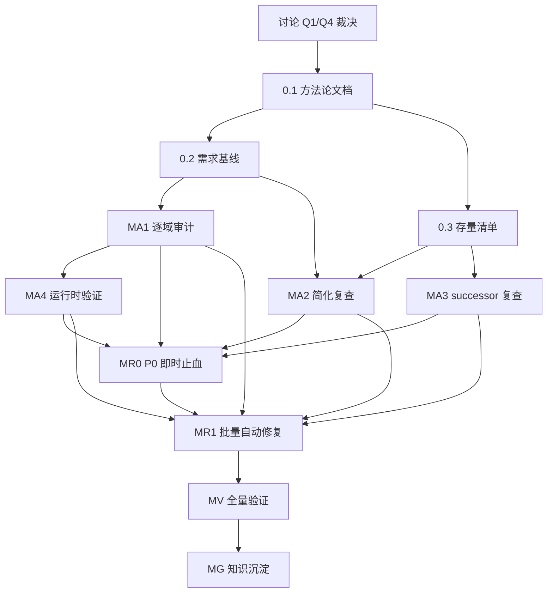

# 需求-实现符合性审计路线图（骨架）

> 最后更新：2026-08-16（**RC-R1.49 done**：MR1 越界项 A 类 ORM 批量授权 + 双独立子 agent 批准——mfg BOM 快照（P1-RC-009，UC-MFG-10 断言④⑤⑥）修复完成，plan `docs/plans/2026-08-16-0904-1`：**快照载体** 三实体族（`ErpMfgWorkOrderBomSnapshot`/`LineSnapshot`/`OperationSnapshot` 纯加性镜像 BOM 头/子件行/工艺行）+ `ErpMfgWorkOrder.snapshotBomVersion`/`snapshotBomId` 2 可空列；**提交复制** `ErpMfgWorkOrderProcessor.doSubmit` 接线 protected step `snapshotBomOnSubmit`（同事务 + 幂等跳过 + 无 BOM 不阻断）；**读侧切换**（D2 选项 A）齐套/工序标准读快照（`KitAvailabilityChecker`/`ProductionVarianceCalculator`/`BomExpander.explodeFromSnapshot`），`CostRollupService` 保留实时读（D2 与 MA4 §7 偏离显式裁决），MRP/仿真计划期不变；**config** `erp-mfg.bom-snapshot-strategy`（LOCK_AT_CREATION 默认 / AUTO_UPGRADE re-resolve 默认 BOM 实时展开不写回快照，无默认 BOM 防御回退快照，逐物料粒度 successor）；`TestErpMfgBomSnapshot` 9 组全绿 + 既有 _cases 快照重录 4 类 + erp-mfg-service **279 tests 全绿**（270 基线 + 9 新增）+ 全量构建通过 + checker baseline-raise 登记（R2c 1408→1413，per-site 证据落 compliance-baseline.md）；owner doc bom-and-routing.md §BOM 版本快照规则 补实现注记 + Non-Goal 移除 + state-machine.md §4 同步 + arm-index P1-RC-009 → done (RC-R1.49)）。> 最后更新：2026-08-16（**RC-R1.52/53/54 done**：MR1 越界项 B 类降级预授权——assets 折旧补提/处置凭证/闲置状态机族（P1-RC-029/P1-RC-030/P1-MA2-061 reuse 重开）修复完成，plan `docs/plans/2026-08-16-0424-2`：**RC-R1.52** 方式B 补提实装（`catchUpDepreciation` mutation + per-mutation Processor：守卫链[IN_SERVICE + currentPeriod OPEN] + 逐漏提期复用折旧计算 + 计划落行 + 累计折旧/净值回写 + 幂等跳过 + 漏提期不晚于 currentPeriod 守卫 + 单张汇总凭证 billHeadCode `#CATCHUP` 后缀 + 行 memo「补提 {periods}」标注 + 出售补提接线 `catchUpDepreciationToDisposalPeriod` protected step（损益计算前补提至出售期含当期）——`TestErpAstCatchUpDepreciation` 7 组全绿）；**RC-R1.53** 处置凭证 1606 固定资产清理中间科目腿两步流（createFacts 重构：Step1 借 1602/借 1606 净值/贷 1601 + Step2 借 1002/贷 1606 + 损益从 1606 结转，GL 恒等 + 1606 网为零 + 种子科目表纯加性补 1606 行——测试断言更新 + 4 组合行级断言 + 恒等式）；**RC-R1.54** IDLE 闲置状态机（suspend/resume @BizMutation + StateMachine Bean 扩展[守卫/目标态/transitions 7→11 边 + assertCanDispose 接受 IDLE 对齐 owner doc §2] + remark「闲置自 {date}」强制 + PENDING 保留 Decision A + 处置扩展 Decision 选项 A + cron 登记 successor——`TestErpAstIdleStateMachine` 6 组 + 矩阵测试扩展全绿）；erp-ast-service 317 tests 全绿（299 基线 + 18 新增零回归）+ 全量 `mvn test` 3461/0/0 全绿 + 全量构建通过 + checker baseline-raise 登记（R2c 1405→1408，per-site 证据落 compliance-baseline.md）；owner doc depreciation-and-posting.md/state-machine.md 注记 + arm-index P1-RC-029/P1-RC-030/P1-MA2-061 三行 → done）。> 最后更新：2026-08-16（**RC-R1.50 done**：MR1 越界项 B 类降级预授权——purchase 价格差异过账（P1-RC-018，会计过账逻辑[PurAcctDocProvider/VoucherFact]）修复完成，plan `docs/plans/2026-08-16-0424-1`：策略「接收并过账差异」经 `erp-pur.price-diff-strategy=POST_DIFFERENCE` config 门控落地（默认空=拒绝族零变化）——ThreeWayMatcher 价格超容差分支策略化 warn 放行（覆盖 strict 价格维度）+ `computeOverTolerancePriceVariance` 同回链聚合差异 + `ErpPurInvoiceProcessor.resolvePriceVariance` protected step 门控 → buildEvent 写 `PRICE_VARIANCE_AMOUNT` 键 + createFacts 1403 拆分增 PPV 行（1404 材料成本差异 seed 纯加性行，|差异| 涨价借/降价贷，借贷恒等保持）；「审批后接收」= L1 三选一子集语义（strict 拒绝即审批前置）登记 successor；`TestErpPurPriceVariancePosting` 9 组全绿 + `_cases/` 快照；erp-pur-service 317 tests 全绿零回归 + 全量构建通过 + checker 零漂移（R2c=1405 不变）；owner doc three-way-match.md 补实现注记 + arm-index P1-RC-018 → done）。> 最后更新：2026-08-08（**RC-R1.11 done**：MR1 第一批纯预授权——purchase 超收容差校验（P1-RC-019）修复完成，plan `docs/plans/2026-08-08-1603-1`：`ErpPurReceiveProcessor.validateBusinessRulesForApprove` 在 `requireSupplierActive` 后接线新 protected step `validateOverReceiptTolerance`[位于 `triggerIncomingMove` 之前，超收拒绝发生在库存移动/过账前]——per-order-line 聚合「当前入库单行 + 同订单其他 APPROVED 入库单行」Σ 数量，对 `orderLineId != null` 行比较 `Σ > 订单数量 × (1 + 容差%)`：strict（`erp-pur.match-strict-mode`=true）抛新增 `ERR_RECEIVE_QTY_OVER_TOLERANCE`（`erp.err.pur.receive-qty-over-tolerance`）拒绝审核 / 非 strict LOG.warn 放行，消费既有 `erp-pur.match-qty-tolerance` 配置默认 5%（dead config 恢复应用）；容差内含恰好边界放行 / 无 orderLineId 行跳过 / 订单行数量 0 基处理；`TestErpPurReceiveOverReceiptTolerance` 6 组全绿[strict 超收拒绝保持 SUBMITTED / 非 strict warn 放行 / 容差内放行 / 多入库单聚合 6+5=11>10.5 strict 拒第二张 / orderLineId=null 跳过 / 边界恰 10.5 放行] + `_cases/` 快照录制；erp-pur-service 147 tests 全绿[既有 141 零回归] + 全量构建通过 + checker 零漂移；短收差异处理 P2-RC-014 归 successor watch-only 不随本行落地）。> 最后更新：2026-08-08（**RC-R1.9 done**：MR1 第一批纯预授权——hr 员工调研族（P1-RC-016 + P1-MA2-041 reuse 重开）修复完成，plan `docs/plans/2026-08-08-1154-2`：`ErpHrSurveyBizModel` 新增 `publish`（DRAFT→OPEN，题目非空 + startDate/endDate 必填，`ERR_HR_SURVEY_ILLEGAL_TRANSITION`）/`close`（OPEN→CLOSED → 触发 `aggregateResult`）/`archive`（CLOSED→ARCHIVED）+ `defaultPrepareUpdate` publish 后编辑守卫[非 DRAFT 拒绝 title/surveyType/isAnonymous/startDate/endDate 等配置字段及 questions 子表修改，`ERR_HR_SURVEY_PUBLISHED_IMMUTABLE`，ORM 脏值追踪取更新前状态]；`ErpHrSurveyResponseBizModel.submitResponse`[仅 OPEN 可提交 + 匿名 employeeId 置空 + respondentHash=SHA-256(employeeId+":"+surveyId) 无盐十六进制[HashHelper+StringHelper.bytesToHex] + 同人重复[匿名按 hash/非匿名按 employeeId]拦截 `ERR_HR_SURVEY_ALREADY_SUBMITTED` + 题目归属校验 `ERR_HR_SURVEY_INVALID_QUESTION` + totalResponses 递增]；`ErpHrSurveyResultBizModel.aggregateResult`[整体行恒生成 + 部门行[经 ErpHrEmployee.departmentId，匿名答卷仅整体行] + eNPS=(promoters−detractors)/total×100[9-10 promoter/0-6 detractor/7-8 passive，Math.round，无 ENPS 答卷 null] + avgScore[RATING+ENPS 题平均 scale2] + driverScores[driverCategory 分组平均 TreeMap JSON] + questionBreakdown[按题平均 JSON] + trendData[同 surveyType CLOSED 历史序列，endDate 升序排除自身，仅整体行] + completionRate[目标=目标部门或全员 ACTIVE/PROBATION 员工数，目标 0 置 null] + 回写 survey 头 totalResponses/completionRate/avgScore/eNpsScore] + `getSurveyDashboard` @BizQuery[整体+部门行+departmentName+趋势供 AMIS 渲染]；`ErpHrConstants.SURVEY_STATUS_DRAFT/OPEN/CLOSED/ARCHIVED` 对齐 dict 四值消除死状态；`TestErpHrSurveyLifecycle` 9 组全绿[publish 校验/编辑守卫/匿名防重复双路径/非 OPEN 拒绝/多部门聚合 eNPS 边界/archive 状态机/仪表盘趋势/GraphQL 冒烟] + `_cases/` 快照录制；erp-hr-service 163 tests 全绿[既有 154 零回归] + 全量构建通过 + checker actual==baseline 零漂移；通知/催填 + (surveyId,respondentHash) DB UK + 版本化三项按 Deferred But Adjudicated 登记）。> 最后更新：2026-08-08（**RC-R1.8 done**：MR1 第一批纯预授权——hr 工时单族（P1-RC-015 + P1-MA2-043 reuse 重开）修复完成，plan `docs/plans/2026-08-08-1154-1`：`ErpHrTimesheetLineBizModel` 24h 日工时上限校验[defaultPrepareSave/Update 守卫 + 跨工时表全量口径（employeeId+workDate 汇总，Σ>24 抛新增 `ERR_TIMESHEET_DAILY_HOURS_EXCEEDED`，=24 边界放行，仅守卫 hours>0 行）] + `afterEntityChange` 行增/改/删后重算父表 `totalHours=Σ`[`orm().flushSession()` 防 stale + `IErpHrTimesheetBiz.updateEntity` 写回]；`ErpHrTimesheetBizModel.submit` 扩展 DRAFT/REJECTED→SUBMITTED[重提路径] + 提交时按 Σ 修正 totalHours + 24h 终检 + 新增 `approve`（SUBMITTED→APPROVED）/`reject`（SUBMITTED→REJECTED，reason 必填[`ERR_TIMESHEET_REJECT_REASON_REQUIRED`]写入 remark）；`ErpHrConstants` 增 `TIMESHEET_STATUS_APPROVED/REJECTED` + `MAX_DAILY_HOURS=24`；dict `erp-hr/timesheet-status` 四态全可达[无死状态]；审计字段=平台 updatedBy/updateTime[不触 ORM]；跨域归集（hr→projects cost-collection）经 Phase 2 Decision 登记 Deferred But Adjudicated successor[APPROVED 状态点为接线锚点]；`TestErpHrTimesheetFamily` 8 组全绿[边界/跨表口径/stale 汇总/状态机全链/非法迁移/GraphQL 冒烟] + `_cases/` 快照录制[删除路径 delVersion 毫秒竞态降级 `@EnableSnapshot(checkOutput=false)`]；erp-hr-service 154 tests 全绿[既有 146 零回归] + 全量构建通过 + checker actual==baseline 零漂移）。> 最后更新：2026-08-08（**RC-R1.7 done**：MR1 第一批纯预授权——hr 设备故障手工补卡（P1-RC-014）修复完成，plan `docs/plans/2026-08-08-0424-3`：`IErpHrAttendanceBiz`/`ErpHrAttendanceBizModel` 新增 `makeUpClockIn`/`makeUpClockOut` mutation[补卡日期可历史 + 无记录新建[businessDate=补卡日期]/有记录覆盖 + clockIn/clockOut 写补录时间 + source=MANUAL + remark=reason 审计标记 + clockIn/clockOut 均存在时重算 workHours] + HR 角色守卫[Java 侧 IUserContext.isUserInRole(HR_ROLE_ID="HR 专员")，与 erp-hr.action-auth.xml 菜单 roles 字面一致，fail-closed ERR_MAKEUP_ROLE_REQUIRED] + reason 必填[ERR_MAKEUP_REASON_REQUIRED，先角色后 reason] + `ErpHrConstants.ATTENDANCE_SOURCE_MANUAL`/`HR_ROLE_ID`；dict `erp-hr/attendance-source` 未注册 MANUAL[Q3 范围仅加列/加 UK/新增实体，按 A4.2.145 孤儿非字典值先例直接写字符串，UI 可读性缺口 owner doc 注记维护点]；`TestErpHrAttendanceMakeUp` 6 组全绿[新建/覆盖/workHours 重算/reason 拒绝/角色守卫双侧[HR 通过+无角色被拒+无上下文 fail-closed]/GraphQL 冒烟] + `_cases/` 快照录制；erp-hr-service 146 tests 全绿[既有 140 零回归] + 全量构建通过 + checker actual==baseline 零漂移；XMeta 字段级 auth 守卫按 plan Deferred But Adjudicated 登记 watch-only residual[越权风险修复面=受控补卡通道 + source/reason 审计标记已落地]）> 最后更新：2026-08-08（**RC-R1.6 done**：MR1 第一批纯预授权——hr 夜班跨天 clockOut（P1-RC-013）修复完成，plan `docs/plans/2026-08-08-0424-2`：`ErpHrAttendanceClockOutProcessor.clockOut` 回退分支[today 无可用记录 → 回退探查昨日：昨日记录 clockIn 非空 && 昨日跨天排班[`IErpHrShiftAssignmentBiz.findByEmployeeAndDate` → `ErpHrShift` → `isCrossDayShift`，孤儿 assignment 保守不命中防 NPE] → 写昨日 clockOut + `computeWorkHours` 重算；未命中维持 `ERR_NOT_CLOCKED_IN`；今日记录优先语义保留] + `TestErpHrAttendanceCrossDayClockOut` 5 组全绿[跨天命中/今日优先/无排班拒绝/clockIn 空拒绝/常规回归] + `_cases/` 快照录制 + erp-hr-service 140 tests 全绿 + 全量构建通过 + checker actual==baseline 零漂移；方案 B[originAssignmentDate ORM 列]按 Deferred But Adjudicated 登记 successor[第二批启动或人工裁决 ORM 授权触发]）。> 最后更新：2026-08-08（**RC-R1.5 done**：MR1 第一批纯预授权——hr 考勤多次打卡 last-wins（P1-RC-012）修复完成，plan `docs/plans/2026-08-08-0424-1`：ClockInProcessor 移除 ERR_ALREADY_CLOCKED_IN reject 守卫 → last-wins 覆盖 clockIn + clockOut 已存在时重算 workHours + IBiz javadoc 同步；测试 testDuplicateClockInBlocked→testDuplicateClockInLastWins + 新增 testDuplicateClockInRecomputesWorkHours[DAO-seed 确定性断言] + 快照重录 + E2E 断言 reject→last-wins；erp-hr-service 135 tests 全绿 + E2E spec 运行时全绿 + 全量构建通过 + checker actual==baseline 零漂移）。> 最后更新：2026-08-08（**RC-R1.4 done**：MR1 第一批纯预授权——hr 休假审批超时自动转派（P1-RC-011）修复完成，plan `docs/plans/2026-08-07-2340-3`：ErpHrLeaveApproverTimeoutJob + erp-hr-leave-approver-timeout.job.yaml + config keys（hours 默认 72 / cron 默认空）+ notify hr.leave-approver-timeout；转派链 superiorId→兜底 department.managerId→双 null 跳过；幂等 approverId==目标；TestErpHrLeaveApproverTimeoutJob 7 组全绿 + _cases/ 快照 + erp-hr-service 134 tests 全绿 + 全量构建通过 + checker actual==baseline 零漂移）。> 最后更新：2026-08-08（**A4.2.79 done**：A1.26 §7 SP-4 MR1 P1-RC-031 修复落地后 reserved/available 一致性运行时确认——拦截点 = `validateAvailable`[doConfirm 内、applyReservation 前，:129 首行接线 validateBatchExpiry] + `doComplete:111-125` 零 expiry 检查[分支 B 假阴性窗口不存在] + SP-4 三断言全部运行时成立 + 新增既有预占边界探针[seed reserved=3/total=100/available=97，过期 confirm 拒绝后原值不变，`TestErpInvBatchExpiryInterception` 9 组全绿，erp-inv-service 152 tests 全绿，checker actual==baseline 零漂移]，报告 `docs/audits/2026-08-07-2340-rc-ma4-a4-2-79-inv-expiry-interception-reserved-available-consistency.md`，0 新 finding，A4.2.79 回队行闭合）。> 最后更新：2026-08-08（**RC-R1.20 done**：MR1 第一批首行落地——inventory 批次效期拦截（P1-RC-031）修复完成，plan `docs/plans/2026-08-07-1932-1-rc-mr1-r1-20-inv-batch-expiry-interception.md`：validateAvailable 首行接线 validateBatchExpiry 守卫[isBatchManaged + expiryDate<today 抛 ERR_BATCH_EXPIRED + null 跳过 + config `erp-inv.batch-expiry-check-enabled` 默认 true + 类型范围出库/内部转移 + 负库存不豁免] + ERR_BATCH_EXPIRED + TestErpInvBatchExpiryInterception 8 组全绿；arm-index P1-RC-031 修复状态 done (RC-R1.20)；**A4.2.79 MR1 阻塞解除**回队待另行独立 plan；ACTIVE→EXPIRED 状态迁移按 plan Deferred 移出范围）。> 最后更新：2026-08-07（A4.2.182-A4.2.185 done：A1.51 §7 notify 接收人解析器与 kill-switch 运行时确认——4 项静态存疑点运行时行为无一翻转，新增 5 个运行时测试[新测试类 `TestErpSysNotificationRecipientResolverRuntime`，仅限 erp-notify-service 测试类目]：ROLE `resolveRole:117-156` 双过滤在平台 nop-auth 种子数据下运行时正确[testRoleResolverMatchesRoleName PASS + 不匹配角色名 config-gated 空集 PASS] + USER_LIST `${submitterUserId}` 插值正确[testUserListVarInterpolation PASS + 多域消费者 census 只读：4 个审批 wf listener 注入 submitterUserId[pur-payment/sal-receipt/ast-disposal/hr-salary] + cs escalationUserId + fin/sal 事件上下文] + ORG deptId 精确匹配无子部门递归[testOrgResolverDeptIdExactMatch PASS] → 三项主路径闭合[A4.2.182/183/184]无新 finding + kill-switch 失效运行时证实[testNotifyEnabledFalseStillDispatches PASS：enabled=false 通知仍落库] → A4.2.185 维持 P2-RC-081[登记不强制，修复归 MR1 纯 BizModel 预授权]，不触发 MR0，0 新 finding，`mvn test -pl module-notify/erp-notify-service` 23/23 全绿 + checker actual==baseline 零漂移，报告 `docs/audits/2026-08-07-1533-rc-ma4-a4-2-182-185-notify-runtime.md`）。2026-08-07（A4.2.33-A4.2.39 done：A1.16 §7 purchase-F2 三单匹配/容差/价格差异过账运行时确认——7 项静态存疑点运行时行为无一翻转，per-mutation approve 架构隐含凭证数==2 + PurAcctDocProvider.createFacts AP_INVOICE 仅 3 行[1403/2221/2202]无 PPV 行[差异埋在 1403 在途物资，GL 仍平衡属管理会计可视性缺口] + ThreeWayMatcher 仅 strict 拒绝/非 strict warn[1/3 策略，隐藏接线零命中] + receive approve 仅 requireSupplierActive 无 qty-vs-order 容差校验[qtyTolerance dead config 两侧均未用] + 无短收差异处理触发 + cancel→runCommitmentReleaseHook config-gated[budget-commitment-enabled 默认 false，对齐 A4.2.31 范式] + receivedQuantity 列存在零 writer[rollupOrderReceiveStatus 仅更新 header receiveStatus] → 两项主路径闭合[A4.2.33/A4.2.38] + 两项 P1 维持[P1-RC-018 触 PurAcctDocProvider/VoucherFact ask-first；P1-RC-019 纯 BizModel 预授权] + 两项 P2 维持[P2-RC-013/P2-RC-014 纯 Processor 预授权]，不触发 MR0，0 新 finding，报告 `docs/audits/2026-08-07-2300-rc-ma4-a4-2-33-39-purchase-f2-threeway-match-runtime.md`）。2026-08-07（A4.2.27-A4.2.32 done：A1.15 §7 purchase-F1 主流程/请购运行时触发链与一致性确认——6 项静态存疑点运行时行为无一翻转，receive approve→triggerIncomingMove→InvPostingDispatcher PURCHASE_INPUT 全链闭合 + paidStatus 跨 payment SUM 聚合一致性 + reverseSettlement 负金额行回退 + openAmount==发票金额−已核销金额 恒等式 + validateConsistentSupplier 阻断多供应商[P1-RC-017 维持] + invoice reverseApprove 零 commit()[commit() census 全域仅 ErpPurOrderProcessor:208，P1-MA2-083 reuse 维持重开，config budget-commitment-enabled 默认 false + 零生产 override 非默认活跃] + cancel 全部衍生订单后允许再转化[P2-RC-012 维持] → 四项主路径闭合 + 两项 P1 维持，不触发 MR0，0 新 finding，修复归 MR1[P1-RC-017 纯 BizModel 预授权；P1-MA2-083 纯 Processor 逻辑调既有 commit() 入口不触 ask-first]，报告 `docs/audits/2026-08-07-2300-rc-ma4-a4-2-27-32-purchase-f1-mainflow-runtime.md`）。2026-08-07（A4.2.22-A4.2.26 done：A1.14 §7 hr-F3 薪酬/工时/调研域过账触发链与桩功能运行时确认——5 项静态存疑点运行时行为无一翻转，tryPostAccrual 零生产调用方 + 290/300 event 永不构造[Provider createFacts 就绪但派发侧事件源断裂] + ER 金额静默丢弃 + 24h 校验/totalHours 缺失 + respondentHash 零 writer/零校验 + CLOSED 聚合/eNPS 缺失[结果表永远空] → 五项 P1[MA4-017/MA2-041/MA2-043 reuse 维持 + RC-015/RC-016 维持]全部维持不撤销，会计错误未活跃[GL 缺凭证可经试算平衡发现]不触发 MR0，0 新 finding，修复归 MR1[A4.2.22/23 触会计保护区域+ORM ask-first；A4.2.24-26 纯 BizModel 预授权]，报告 `docs/audits/2026-08-07-0530-rc-ma4-a4-2-22-26-hr-payroll-survey-runtime.md`）。2026-08-06（A4.2.12 done：A1.12 §7-1 UC-HR-07 合同到期 cron 运行时调度接线确认——nop-job `.job.yaml` 6 字段接线完整 + 两层 config 门控[nop-job enabled 默认 false + in-job contract-expiry-cron 默认空]均默认关闭 + 全 20 生产 application.yaml 零 override → 合同到期自动化运行时非默认活跃但 cron-gated 机制存在[L1 ⑲满足]，config-gate 默认关闭 = 部署启用决策非契约缺失[对齐 A4.1.4 budget config 范式]，维持 UC-HR-07 接受 + 0 新 finding / 不触发 MR0 / 不归 MR1 + config-gate watch-only residual 登记 + job-scheduling.md §3.15 stale 条目修正，报告 `docs/audits/2026-08-06-2247-rc-ma4-a4-2-12-hr-contract-expiry-cron-wiring.md`）。2026-08-06（A4.1.4 done：A1.2 §7-1 config 默认关闭 vs「开箱即用预算硬拦截」部署契约核对——全集真相源（product-scope/use-cases/owner doc/module-meta.yaml/business-module-metadata.md）+ 部署工件（全 20 生产 application.yaml/README/seed/部署运维文档）+ config 默认值逐消费点（11 站点）零命中「开箱启用预算控制」声明，建筑层反向显式登记为可选特性 `defaultValue:false`，caveat ① 维持接受，无新 finding/无 MR0/无 successor，报告 `docs/audits/2026-08-06-0847-rc-ma4-a4-1-4-budget-config-default-deployment-contract.md`）。2026-08-07（v1.5 — A4.2 扩展域存疑点运行时确认展开器 done：扩展域 A1.8-A1.51 §7 存疑点全集[43 报告，200 条原始条目，跨报告去重 8 组合并→185 条]展开为 A4.2.1-A4.2.185 实体验证行；展开映射记录 `docs/audits/2026-08-07-0400-rc-ma4-a4-2-ext-domain-expander.md`。v1.4 — A4.1 业财域存疑点运行时确认展开器 done：finance A1.1-A1.7 §7 存疑点全集[25 条]展开为 A4.1.1-A4.1.25 实体验证行；展开映射记录 `docs/audits/2026-08-07-0300-rc-ma4-a4-1-finance-expander.md`。v1.3 — Q1/Q4 已裁决：Q1=(c) 逐项对照需求真相源优先 / Q4=(a) P0/P1 必须实现禁止方案 B 无例外；M0 转 ready，解除执行阻塞。v1.2 经两轮独立子代理审查修订：MA1 完整枚举 51 切片；MA2 导出口径+分区约束；MR0/MR1 改执行时追加实体行；A4 展开器范式对齐 R1.0；Q1/Q4 硬门控；保护区域暂停协议+预授权声明；MA1↔既有审计去重协议；MA3 三源对账。A4.1.2 done：UC-FIN-12 汇率缺失触发面运行时普查——43 生产 PostingEvent 构造点无一漏传 setExchangeRate，`prepareContext:537` 静默回退为 dispatcher 路径死代码，P1-RC-002 维持 P1 不升 P0/不触发 MR0/无新 finding，报告 `docs/audits/2026-08-07-0330-rc-ma4-a4-1-2-fx-rate-missing-trigger-surface.md`）
> 来源：`docs/skills/audit-remediation-roadmap-authoring-prompt.md` 同型模式（需求-实现符合性变体）
> 范围文档：`docs/discussions/2026-08-02-1700-requirement-implementation-compliance-audit.md`
> **状态：可执行版本。Q1/Q4 已裁决（2026-08-02），M0 工作项转 ready，可启动 mission driver。**
> 关联路线图：`entity-state-machine-migration-roadmap.md` 将提供状态轴迁移矩阵、dict/writer 对照和可达性证据；本路线图的 MA1 状态机证据可消费其已完成产物，但不等待其整体完成。

## 目的

本路线图覆盖 nop-app-erp（19 域、156 模块）的**需求→实现符合性审计**：从需求真相源（product-scope + use-cases + owner doc 需求契约）出发，逐模块逐功能点核对运行时行为是否符合需求，识别并修复被"文档化简化/Deferred"合法化掩盖的需求-实现分歧。引用 `docs/backlog/00-roadmap-authoring-guide.md` 作为规范。**不复跑 MA1-MA7 架构漂移类审计**（详见讨论文档 §根因分析）。

> **预授权声明**（对齐 audit-remediation "ORM 变更已授权" 范式；Q4 已裁决=(a) 无例外，本声明为预授权类目清单；**2026-08-15 用户裁决升级：原「须 ask-first 人工确认」一律改为「须双独立子 agent 批准」**——ORM/会计核心/数据删除等保护区域允许 AI 自动修改，但必须经两个独立子 agent 分别检查批准（fresh session，批准记录落盘计划文件），见 `docs/context/ai-autonomy-policy.md` 保护区域表）：
> - 文档更新类修复（owner doc / use-cases / arm-index）：预授权自动执行
> - 代码逻辑修复（BizModel / Processor / xbiz / view.xml）：预授权自动执行
> - ORM 结构变更（orm.xml 字段/索引/UK/实体）：**须双独立子 agent 批准** + 独立 plan-audit
> - 会计过账逻辑变更（VoucherFact / PostingProcessor 核心路径）：**须双独立子 agent 批准** + 独立 plan-audit
> - 数据删除 / 数据迁移：**须双独立子 agent 批准** + 独立 plan-audit
> - 未列明的修复类目默认须双独立子 agent 批准
>
> **2026-08-07 人工裁决登记**（`docs/discussions/2026-08-07-1140-rc-approval-inventory-analysis.md` §5/§6，批准人：用户，生效 2026-08-08）：
> - **Q1**：MA1-MA4 完成后 **R1.0 不自动启动**，保持 `todo`，待另行人工裁决（覆盖 MR1 自动展开时机）
> - **Q2**：类目 A1-A4（文档更新 + 代码逻辑 + P2 登记 + MA4 只读）确认自动执行
> - **Q3**：**纯加性 ORM 变更批量授权**（加列/加 UK/新增实体，不改既有语义、无 NOT NULL 无默认列、无既有数据 UK 增设、无删除/迁移/索引改造），越界回落双独立子 agent 批准
> - **Q4**：**收敛性会计修复批量授权**（使实现向 owner doc 契约收敛，不反向改契约段落；不涉删除/迁移）；核心路径改动行为仍须独立 plan-audit
> - **Q5-Q9**：P1-RC-025/029/031/062 + 表 E 重开族（P1-RC-008/009/056/061 + P1-MA2-071 + P1-RC-063）维持强制实现，Q4=(a) 无例外
> - **Q10**：P2-RC-005/011/016/012 use-cases 真相源命名修订经批准登记（§9 流程）
>
> **2026-08-08 追加人工裁决**（同一讨论文档 §7，批准人：用户，生效即日）：A1 **R1.0 分批启动**——先执行纯预授权类修复（A2 代码逻辑类），越界项按 A2 逐项执行（标准流程：独立 fix plan + plan-audit + 双独立子 agent 批准 checkbox，批准人=两个独立子 agent 分别检查批准），非触及行继续；A3 **P1-RC-091 属会计核心路径**，独立 plan-audit + 双独立子 agent 批准；A4 **P2-RC-061 纯逻辑修复**（`EquipmentStatusLinker.restoreToRunning` 补 IDLE 分支，不改 ORM，按 A2 预授权）；A5 **P2-RC-057 ORM defaultValue 改 "WARN"**（纯收敛修复，按 Q3 纯加性类自动执行）。A1 撤销 §6 Q1 的「无限期挂起」状态；A2-A5 不扩大 Q3/Q4 授权范围。
>
> **2026-08-12 ORM 变更批量裁决**（批准人：用户，生效即日）：对 RC-R1.41~R1.89 全部 49 个越界项进行逐项 ORM 必要性研究（5 路并行独立 agent 核实需求文档 + ORM 模型 + Java 代码），裁决如下：
>
> **A. ORM 变更批准（21 项）**——经核实确实需要 ORM 结构变更（加列/加 UK/新增实体），现批量批准 ORM 修改授权（对齐 Q3 纯加性类自动执行范围，越界回落双独立子 agent 批准）：
> - **finance**: RC-R1.43（ErpFinBankStatementLine 加 counterpartyAccount/counterpartyName/counterpartyBank 3 列）、RC-R1.44（ErpFinAccountingPeriod 加 reverseCloseReason/reversedBy/reverseCloseAt 3 列 或 新增 ErpFinReverseCloseLog 实体）、RC-R1.45（ErpMdSubject 加 cashFlowType 列）
> - **mfg**: RC-R1.49（ErpMfgWorkOrder 加 snapshotBomVersion + 快照内容 或 新增 BOM 快照实体）
> - **sales**: RC-R1.51（ErpSalReturn 加 returnType 列）
> - **crm**: RC-R1.57（新增 ErpCrmTeamMember 实体 或 成员子表）
> - **quality**: RC-R1.58（ErpQaInspectionTemplateLine + ErpQaInspectionLine 加 isCritical 列）
> - **projects**: RC-R1.60（ErpPrjProjectUser 加 costRate 列 + 新增 ErpPrjRole 实体 或费率实体）
> - **cs**: RC-R1.66（新增 ErpCsTicketTimerSession 实体）、RC-R1.67（ErpCsTicket 加 escalation 计数字段 + ErpCsSlaPolicy 加 L2 字段）、RC-R1.70（ErpCsSurvey 加 status/failureCount 列）、RC-R1.71（新增 ErpCsTicketFulfillmentStep 实体 或 ticket 加执行状态列）
> - **master-data**: RC-R1.72（ErpMdMaterialSku 加 status 列）
> - **maintenance**: RC-R1.73（ErpMntSchedule 加 triggerType/threshold 列 + 设备加累计运行时长 或 新增 ErpMntEquipmentStatusLog 实体）、RC-R1.74（新增任务模板实体）、RC-R1.75（ErpMntVisit 加 requestId 列）
> - **contract**: RC-R1.80（ErpCtDocument 加 legalHold 列）
> - **drp**: RC-R1.81（ErpInvDrpCrossDock 加 matchingStrategy 列）、RC-R1.82（新增供应商评分汇总实体）
> - **logistics**: RC-R1.84（新增 ErpLogDeliveryBooking 实体）
> - **aps**: RC-R1.87（ErpApsOperationOrder 加 selectedRoutingId 列）
>
> **B. 降级为预授权（26 项）**——经核实不需要 ORM 结构变更，纯代码逻辑/跨域契约即可解决，从"越界项 ask-first"降级为预授权自动执行（跨域契约项仍须协调确认但不触 ORM ask-first）：
> - RC-R1.41（FactsValidator SPI 已存在，实现 Validator bean）、RC-R1.42（prepareContext 加汇率缺失守卫）、RC-R1.46（findPostedVoucherIds 加 COMMITMENT 过滤）、RC-R1.48（inventory 域已有 ErpInvReservation 表，mfg 侧跨域调用）、RC-R1.50（createFacts 加 PPV 行）、RC-R1.52（catchUpDepreciation mutation + period 推断，isCatchUp 列可选非必需）、RC-R1.53（createFacts 重构加 1606 中间科目）、RC-R1.54（suspend/resume mutation，idleSince 列可选非必需）、RC-R1.59（cancelForBusinessBill Facade + Processor wiring）、RC-R1.61（InvPostingDispatcher 加 PROJECT_COST 分支 + 新 aggregator）、RC-R1.62（ExpenseCostAggregator 加状态守卫 + budgetChecker.check）、RC-R1.63（retention 字段已存在，Processor 填充 + 返还 mutation）、RC-R1.64（buildEvent 汇率解析替代 BigDecimal.ONE）、RC-R1.65（gen 规则生成 code + 跨域查询 team 成员）、RC-R1.68（actionType dict + TicketAction 记录 NCR，A4.2.137 自述不触 ORM）、RC-R1.69（usageCount 可从 TicketAction 派生，非结构必需）、RC-R1.76（事件发布 + mfg 消费者）、RC-R1.77（事件监听器 + DECOMMISSIONED 守卫）、RC-R1.78（OEE 按需计算 @BizQuery，无聚合实体）、RC-R1.79（订单行调 IErpCtVolumeDiscountBiz.resolveDiscount）、RC-R1.83（defaultPrepareSave 加守卫，DB UK 可选硬化）、RC-R1.85（onDelivered 加 SALES_DELIVERY 分支）、RC-R1.86（事件订阅 + 批量创建 DRAFT）、RC-R1.88（dict 加 HOLD/ON_HOLD 是数据非结构变更）、RC-R1.89（ER 经 billData JSON 持久化，设计注释确认）
>
> **C. 已实现确认（2 项）**——经核实当前代码已完整实现，标记 done：
> - RC-R1.47（LandedCost 防重——pessimistic lock `ErpInvLandedCostProcessor:388-407` + app 级唯一性检查已落地，UK 非必需因 approveStatus 是状态字段非自然键）
> - RC-R1.55（FIFO delta 层消耗——`CostAdjustmentService.appendFifoAdjustLayer` 创建 delta 层 + `FifoCostingStrategy.findFifoLayers` 透明消费 delta 层，正常路径已完整）

## Work Item Status

> 唯一的动态状态块。状态：`todo` / `ready` / `done`。初始全 `todo`。

### Milestone M0 — 审计编排基线（方法论文档先行）

| # | Work Item | Status | Owner Doc | Deps | Skill |
|---|-----------|--------|-----------|------|-------|
| 0.1 | 需求-实现符合性审计方法论文档（五级追踪矩阵模板 + 判据 + **完整枚举纪律（禁止抽样）** + Q1 裁决的真相源层级（product-scope + use-cases 权威 > owner doc 参考，冲突一律以需求真相源为准）+ Q4 裁决的修复义务（P0/P1 必须实现禁止方案 B 无例外）+ 输出格式，落盘 `docs/audits/requirement-compliance-methodology.md`，独立子代理 ≥2 轮审查收敛） | done ✅ | 讨论文档 `2026-08-02-1700`（Q1/Q4 已裁决） | — | 参考 MQ 文档先行范式 |
| 0.2 | 需求基线提取与清单化（product-scope 修正陈旧段 + 18 域 192 UC 清单化 + **notify 补写完整 use-cases**[Q1 裁决：不标注 N/A，notify 是已实现子系统必须补需求契约] + **按功能切片拆分 51 个 A1.x 工作项**[notify 补写后可能新增切片行] + 五级追踪矩阵初始化） | done ✅ | `docs/requirements/product-scope.md` + 各域 `use-cases.md` | 0.1 | `docs/skills/design-completeness-scan-prompt.md` |
| 0.3 | 存量清单导出（arm-index documented simplification / Deferred / successor 全量清单 + **按域枚举 MA2 复查行** + 复杂度分级 + 优先级排序） | done ✅ | `docs/audits/arm-index.md` | 0.1 | 参考 `docs/audits/scripts/` |

### Milestone MA1 — 需求追踪矩阵审计（逐域逐功能切片）

> **完整枚举原则（本里程碑核心纪律）**：每个工作项 = 一个**功能切片 × 显式 UC 清单**，一份计划即可完整实施，全表即完整工作量（18 域 192 UC 统计覆盖无遗漏，拆为 50 个 UC 切片 + 1 个 notify 切片 = 51 行；logistics 04/05/06 为非标准 heading，0.2 归一化后复校）。**禁止合并切片抽样**；完成判据 = 本表全部行 `done`，任何"代表性抽样"即视为未完成。

> **与既有审计逐维度去重（MA1 ↔ audit-remediation MA2/MA3/MA4/MA5）**：新 MA1 的"运行时行为证据"维度与既有 MA2 状态机/业财链路行为审查**对象重叠**——去重协议：① 既有 MA2 报告（`docs/audits/2026-07-2*-arm-ma2-*`）已证实的状态机迁移/链路行为**直接作为既有证据输入**，MA1 只补"需求契约↔实际行为"差异（use-case 验收标准视角），不重新核实行为本身；② 每切片报告开头声明"与 MA2 报告的差异增量"；③ 新 finding 按 §MA1 详情"复用 or 新增"规则衔接 arm-index；④ MA4 与 A5.6（E2E 断言强度审计）边界见横切关注点 #3。**不复跑 MA1-MA7**：架构/平台一致性/文档漂移/代码质量/测试覆盖/保护区域纪律/审计面各维度均以 audit-remediation 收口为准。

| # | Work Item（功能切片 + UC 清单） | Status | Owner Doc | Deps | Skill |
|---|--------------------------------|--------|-----------|------|-------|
| A1.1 | **finance-F1 过账引擎与凭证链路**（UC-FIN-01/02/03/04/12/15） | done | `docs/design/finance/use-cases.md` + `posting.md` | 0.2 | `docs/skills/multi-dimensional-audit-prompt.md` |
| A1.2 | **finance-F2 预算与承付**（UC-FIN-11/13） | done | `docs/design/finance/budget.md` | 0.2 | 同上 |
| A1.3 | **finance-F3 AR/AP 核销与坏账**（UC-FIN-08） | done | `docs/design/finance/ar-ap-reconciliation.md` | 0.2 | 同上 |
| A1.4 | **finance-F4 银行对账**（UC-FIN-09/14 标题重复[同为"银行对账与未达账项"]，0.2 清单化时裁决去重） | done ✅（2026-08-08 状态修正：审计 plan `2026-08-02-1815-1` completed + 报告 `2026-08-02-1815-rc-ma1-a1-4` Audit Status: closed，2026-08-02 批次执行完毕漏翻状态；其 MA4 实体行 A4.1.11-14 已 done 佐证） | `docs/design/finance/bank-reconciliation.md` | 0.2 | 同上 |
| A1.5 | **finance-F5 成本核算**（UC-FIN-10） | done | `docs/design/finance/costing-methods.md` | 0.2 | 同上 |
| A1.6 | **finance-F6 期间与结账**（UC-FIN-06/07） | done | `docs/design/finance/period-close.md` | 0.2 | 同上 |
| A1.7 | **finance-F7 报表/看板/多账套**（UC-FIN-05/16/17） | done | `docs/design/finance/` + `docs/design/dashboards.md`（全局） | 0.2 | 同上 |
| A1.8 | **mfg-F1 MRP/DRP 引擎**（UC-MFG-05/08） | done | `docs/design/manufacturing/mrp.md` | 0.2 | 同上 |
| A1.9 | **mfg-F2 工单与报工**（UC-MFG-01/03/04/06/07/09） | done | `docs/design/manufacturing/` | 0.2 | 同上 |
| A1.10 | **mfg-F3 BOM 与工艺路线**（UC-MFG-02/10） | done | `docs/design/manufacturing/` | 0.2 | 同上 |
| A1.11 | **mfg-F4 差异/批次/看板**（UC-MFG-11/12/13） | done | `docs/design/manufacturing/variance-analysis.md` | 0.2 | 同上 |
| A1.12 | **hr-F1 员工与组织**（UC-HR-01/05/07/08/12） | done | `docs/design/human-resource/` | 0.2 | 同上 |
| A1.13 | **hr-F2 排班与考勤**（UC-HR-02/06/09） | done | `docs/design/human-resource/` | 0.2 | 同上 |
| A1.14 | **hr-F3 薪酬与调研**（UC-HR-03/04/10/11） | done | `docs/design/human-resource/payroll.md` | 0.2 | 同上 |
| A1.15 | **purchase-F1 主流程与请购**（UC-PUR-01/08） | done | `docs/design/purchase/` | 0.2 | 同上 |
| A1.16 | **purchase-F2 三单匹配与差异**（UC-PUR-02/03/05/06） | done | `docs/design/purchase/three-way-match.md` | 0.2 | 同上 |
| A1.17 | **purchase-F3 退货与业财**（UC-PUR-04/07） | done | `docs/design/purchase/returns.md` | 0.2 | 同上 |
| A1.18 | **sales-F1 主流程与价格**（UC-SAL-01/11） | done | `docs/design/sales/` | 0.2 | 同上 |
| A1.19 | **sales-F2 出库与并发**（UC-SAL-02/03/10） | done | `docs/design/sales/` | 0.2 | 同上 |
| A1.20 | **sales-F3 退货族**（UC-SAL-04/05/06/07/09） | done | `docs/design/sales/returns.md` | 0.2 | 同上 |
| A1.21 | **sales-F4 赠品与看板**（UC-SAL-08/12） | done | `docs/design/sales/` + `docs/design/dashboards.md`（全局） | 0.2 | 同上 |
| A1.22 | **assets-F1 折旧引擎**（UC-AST-02/07/08） | done | `docs/design/assets/` | 0.2 | 同上 |
| A1.23 | **assets-F2 处置**（UC-AST-04/05） | done | `docs/design/assets/` | 0.2 | 同上 |
| A1.24 | **assets-F3 资本化/拆分/盘点/维修/看板**（UC-AST-01/03/06/09/10/11/12） | done | `docs/design/assets/` | 0.2 | 同上 |
| A1.25 | **inventory-F1 移动单主链与追溯**（UC-INV-01/03/04/05） | done | `docs/design/inventory/` | 0.2 | 同上 |
| A1.26 | **inventory-F2 批次与可用量**（UC-INV-02/06/09） | done | `docs/design/inventory/` | 0.2 | 同上 |
| A1.27 | **inventory-F3 盘点/估值/并发/看板**（UC-INV-07/08/10/11） | done | `docs/design/inventory/` | 0.2 | 同上 |
| A1.28 | **crm-F1 线索生命周期**（UC-CRM-01/02/03/04/09/11） | done | `docs/design/crm/` | 0.2 | 同上 |
| A1.29 | **crm-F2 营销/预测/配额/序列/事件提醒**（UC-CRM-05/07/08/10/12/14/15） | done | `docs/design/crm/` | 0.2 | 同上 |
| A1.30 | **crm-F3 CPQ/漏斗推进**（UC-CRM-06/13） | done | `docs/design/crm/` | 0.2 | 同上 |
| A1.31 | **quality-F1 检验门控**（UC-QA-01/02/03/04/06/07/08） | done | `docs/design/quality/` | 0.2 | 同上 |
| A1.32 | **quality-F2 NCR-CAPA 闭环**（UC-QA-05） | done | `docs/design/quality/` | 0.2 | 同上 |
| A1.33 | **quality-F3 SPC 与看板**（UC-QA-09/10/11/12） | done | `docs/design/quality/` | 0.2 | 同上 |
| A1.34 | **projects-F1 立项与成本归集**（UC-PRJ-01/02/03/09） | done | `docs/design/projects/` | 0.2 | 同上 |
| A1.35 | **projects-F2 预算与 DAG**（UC-PRJ-04/05） | done | `docs/design/projects/` | 0.2 | 同上 |
| A1.36 | **projects-F3 结算与看板**（UC-PRJ-06/07/08/10） | done | `docs/design/projects/` | 0.2 | 同上 |
| A1.37 | **cs-F1 工单生命周期**（UC-CS-01/02/03/11） | done | `docs/design/customer-service/` | 0.2 | 同上 |
| A1.38 | **cs-F2 SLA 与升级**（UC-CS-04） | done | `docs/design/customer-service/` | 0.2 | 同上 |
| A1.39 | **cs-F3 知识库/质量联动/预设应答**（UC-CS-05/06/07） | done | `docs/design/customer-service/` | 0.2 | 同上 |
| A1.40 | **cs-F4 调查/权益/目录/履行**（UC-CS-08/09/10/12） | done | `docs/design/customer-service/` | 0.2 | 同上 |
| A1.41 | **master-data 全功能**（UC-MD-01~07，7 UC） | done | `docs/design/master-data/` | 0.2 | 同上 |
| A1.42 | **maintenance-F1 调度与冲突**（UC-MAIN-01/02/09） | done | `docs/design/maintenance/` | 0.2 | 同上 |
| A1.43 | **maintenance-F2 访问与备件**（UC-MAIN-03/04） | done | `docs/design/maintenance/` | 0.2 | 同上 |
| A1.44 | **maintenance-F3 响应/联动/OEE/看板**（UC-MAIN-05/06/07/08/10/11） | done | `docs/design/maintenance/` | 0.2 | 同上 |
| A1.45 | **contract-F1 生命周期与签署**（UC-CT-01/02/05/06/07/09） | done | `docs/design/contract/` | 0.2 | 同上 |
| A1.46 | **contract-F2 计费与返利**（UC-CT-03/04/08/10） | done | `docs/design/contract/` | 0.2 | 同上 |
| A1.47 | **b2b 全功能**（UC-B2B-001~008，8 UC） | done | `docs/design/b2b/` | 0.2 | 同上 |
| A1.48 | **drp 全功能**（UC-DRP-01~08，8 UC） | done | `docs/design/drp/` | 0.2 | 同上 |
| A1.49 | **logistics 全功能**（UC-LOG-01~07，7 UC；04/05/06 在 use-cases.md 用非标准 heading `## 用例X：…`，0.2 清单化时归一化） | done | `docs/design/logistics/` | 0.2 | 同上 |
| A1.50 | **aps 全功能**（UC-APS-01~07，7 UC） | done | `docs/design/aps/` | 0.2 | 同上 |
| A1.51 | **notify 通知派发**（UC-SYS-01~07，7 UC，0.2 补写 use-cases 后纳入） | done | `docs/design/notify/` | 0.2 | 同上 |

### Milestone MA2 — 已裁决简化/Deferred 复查

> **完整枚举原则（同 MA1）**：arm-index 全部方案 B（documented simplification / Deferred 标注）关闭项逐项复核：与 product-scope 对照，区分"有意设计"vs"静默降级"，重新分级。**0.3 导出口径（关键）**：按 arm-index 各行 resolved 注记中的**关闭方式标签**（方案 B / documented simplification / Deferred 标注）筛行，**排除 `resolved (R*.n done)` 类实现修复项**；示例 ID 仅作锚点，精确清单以 0.3 导出为准。**分区约束：每个 finding ID 恰好归属一个 A2.x 行**（跨域项按主域归属并显式标注，0.3 导出后脚本校验分区不重叠）。判据：与 product-scope 冲突 / 影响报表·过账正确性 / 无显式人工批准记录（证据标准见 Work Item Details）→ 重新打开并入 MR1。

| # | Work Item（域 × 方案 B 关闭项全集） | Status | Owner Doc | Deps | Skill |
|---|--------------------------------|--------|-----------|------|-------|
| A2.1 | finance 会计保护区域简化复查（锚点：GRNI 冲回 P1-MA2-001 / 年初余额 P1-MA2-018 / 辅助账对账 P1-MA2-019 / 反结账 P1-MA2-020 / FX 重估 P1-MA2-022；其余以 0.3 按标签导出） | done ✅ | `docs/design/finance/` + `arm-index.md` | 0.2 + 0.3 | `docs/skills/open-ended-audit-prompt.md` |
| A2.2 | finance 非保护区域简化复查（0.3 按标签导出；示例非方案 B 项如 P1-MA2-095~099 系实现修复，不属本行） | done ✅ | `docs/design/finance/` + `arm-index.md` | 0.2 + 0.3 | 同上 |
| A2.3 | mfg 简化复查（锚点：作业卡 P1-MA2-035 / MRP·预测 P1-MA2-036 / 建议单释放 P1-MA2-037；其余 0.3 导出） | done ✅ | `docs/design/manufacturing/` + `arm-index.md` | 0.2 + 0.3 | `docs/skills/open-ended-audit-prompt.md` |
| A2.4 | hr 简化复查（锚点：员工/合同/调查/发展计划/工时/银行文件/排班/薪酬 P1-MA2-039~048 族；0.3 复核关闭方式标签后筛行） | done ✅（空集认证：0 项方案 B，见 `2026-08-06-0442-rc-ma2-a2-3-8-9` §5.3） | `docs/design/human-resource/` + `arm-index.md` | 0.2 + 0.3 | 同上 |
| A2.5 | purchase + sales 简化复查（锚点：采购 P1-MA2-049/050/051 / 销售 P1-MA2-056/057；P1-MA2-001 GRNI 冲回归 A2.1 finance 保护区域[会计过账本质]，082/083 承付族跨域项 0.3 按主域分区） | done ✅（空集认证：0 项方案 B，见同上 §5.3） | `docs/design/purchase/`+`sales/` + `arm-index.md` | 0.2 + 0.3 | 同上 |
| A2.6 | assets + inventory 简化复查（锚点：资产状态机 P1-MA2-058~061 / 盘点 P1-MA2-062 / 拣货 P1-MA2-063；P1-MA2-024/085 系实现修复、089 系并发实现修复，0.3 复核排除） | done ✅（空集认证：0 项方案 B，见同上 §5.3） | `docs/design/assets/`+`inventory/` + `arm-index.md` | 0.2 + 0.3 | 同上 |
| A2.7 | projects + quality 简化复查（锚点：NCR/质检 P1-MA2-064~066 / 项目 P1-MA2-067~070；0.3 复核关闭方式标签） | done ✅（空集认证：0 项方案 B，见同上 §5.3） | `docs/design/projects/`+`quality/` + `arm-index.md` | 0.2 + 0.3 | 同上 |
| A2.8 | 扩展域简化复查（锚点：contract P1-MA2-071/072 / b2b P1-MA2-073 / maintenance P1-MA2-074 / crm P1-MA2-075/076 / aps+logistics P1-MA2-077~080；0.3 复核标签） | done ✅ | 各域 owner doc + `arm-index.md` | 0.2 + 0.3 | 同上 |
| A2.9 | 跨域简化复查（0.3 按标签导出跨域项；P1-MA2-086/088/089 系并发实现修复，不属本行） | done ✅ | `docs/design/` 各域 + `arm-index.md` | 0.2 + 0.3 | 同上 |

### Milestone MA3 — successor 追踪完整性与回队复查

> **完整枚举原则（同 MA1）**：0.3 **三源对账导出**（arm-index 行内 successor 声明 + owner doc 内嵌声明 + `docs/backlog/README.md` 既有 81 行追踪）后，**按域分组逐项核对**（部分声明可能已 done，需对账消歧）：① 触发条件是否已满足（已满足 → 回队 MA1/R1.0）；② 是否该回队（回到审计、R1.0 修复或 backlog README）；③ 无触发条件的补登记；④ backlog/README 既有行的覆盖与正确性复核（防"已登记但从未触发"）。每行 = 一份计划，覆盖该行全部 successor 项，禁止抽样。

| # | Work Item（域 × successor 清单） | Status | Owner Doc | Deps | Skill |
|---|--------------------------------|--------|-----------|------|-------|
| A3.1 | finance 域 successor 复查（如 GL 余额引擎 / 多账套 UK 升级 / 冲销恢复承付 / GRNI 自动冲回触发条件等） | done ✅ | `docs/audits/arm-index.md` + `docs/backlog/README.md` | 0.3 | `docs/skills/open-ended-audit-prompt.md` |
| A3.2 | mfg + inventory + purchase 域 successor 复查（如物料预留实现 / STANDARD 红冲 / 拣货 WMS / 盘点自动移动单等） | done ✅ | `docs/audits/arm-index.md` + `docs/backlog/README.md` | 0.3 | 同上 |
| A3.3 | sales + assets + projects + quality 域 successor 复查（如订单维度核销 / 资产转固 / employee-id 行过滤等） | done ✅ | `docs/audits/arm-index.md` + `docs/backlog/README.md` | 0.3 | 同上 |
| A3.4 | hr + crm + cs 域 successor 复查（如 recruitment 多实体 / 滞留升级 / 序列推进等） | done ✅ | `docs/audits/arm-index.md` + `docs/backlog/README.md` | 0.3 | 同上 |
| A3.5 | 扩展域 + 跨域 successor 复查（contract/b2b/logistics/drp/aps/maintenance/notify + 多公司/数据权限/SoD 铺开等） | done ✅ | `docs/audits/arm-index.md` + `docs/backlog/README.md` | 0.3 | 同上 |

### Milestone MA4 — 运行时行为验证

> **完整枚举原则（同 MA1）**：对 MA1 发现的**全部**"静态存疑点"做运行时行为确认，输出证据链。**MA1 每份报告须列明存疑点清单**。A4.1/A4.2 为**展开器工作项**（对齐 R1.0 范式，非容器行/非预注册固定范围）：读取 MA1 报告存疑点清单 → 向本表追加 A4.1.n/A4.2.n 实体验证行（每存疑点一行）→ **展开完成（全部实体行已追加）后 A4.1/A4.2 标记 done**；后续 A4.1.n/A4.2.n 各自独立 plan + 独立 done。**无存疑点的切片不产生实体行**（此时展开器直接 done）。既有证据复用：MA2 已证实的状态机/链路行为（`docs/audits/2026-07-2*-arm-ma2-*` 报告）作为既有证据输入，MA4 只补"需求↔行为"差异，不重复验证。

| # | Work Item | Status | Owner Doc | Deps | Skill |
|---|-----------|--------|-----------|------|-------|
| A4.1 | 业财域 MA1 存疑点运行时确认**展开器**（读取 MA1 业财切片报告全部存疑点清单，展开为本表 A4.1.n 实体验证行） | done ✅ | `docs/design/flow-overview.md` + `tests/e2e/` | MA1 done | `docs/skills/multi-dimensional-audit-prompt.md` |
| A4.1.1 | A1.1 §7-1 — UC-FIN-02 断言④「业务单据.posted=false」8 域 listener 回写覆盖率逐域核验 | done ✅ | `2026-08-02-1645-...-a1-1-...md` §7 + `flow-overview.md` | A4.1 done | 同上 |
| A4.1.2 | A1.1 §7-2 — UC-FIN-12 汇率缺失触发面实测（各域 Provider 外币场景是否显式传 rate 普查） | done ✅ | 同上 §7 + `posting.md` + `docs/audits/2026-08-07-0330-rc-ma4-a4-1-2-fx-rate-missing-trigger-surface.md` | A4.1 done | 同上 |
| A4.1.3 | A1.1 §7-3 — UC-FIN-03 PROJECT_SETTLEMENT businessType 是否已有 Provider 注册（实例普查） | done ✅ | 同上 §7 + `docs/audits/2026-08-07-0330-rc-ma4-a4-1-3-project-settlement-provider-census.md` | A4.1 done | 同上 |
| A4.1.4 | A1.2 §7-1 — config 默认关闭 vs「开箱即用预算硬拦截」部署契约（核对 product-scope/部署文档） | done ✅ | `2026-08-02-1700-...-a1-2-...md` §7 + `budget.md` + `docs/audits/2026-08-06-0847-rc-ma4-a4-1-4-budget-config-default-deployment-contract.md` | A4.1 done | 同上 |
| A4.1.5 | A1.2 §7-2 — 承付凭证 header 借贷不平时报暴露（试算平衡/三表是否过滤 COMMITMENT 影子凭证） | done ✅ | 同上 §7（A1.7 已静态证 BS/IS 安全） | A4.1 done | 同上 |
| A4.1.6 | A1.2 §7-3 — `fin-budget-vs-actual.value.spec.ts` 是否断言 commitment 独立列（E2E 断言强度评估） | done ✅ | 同上 §7 + `tests/e2e/` + `docs/audits/2026-08-06-0847-rc-ma4-a4-1-6-budget-vs-actual-e2e-assertion-strength.md` | A4.1 done | 同上 |
| A4.1.7 | A1.2 §7-4 — 承付 release-on-return（接入点 #4）config 默认 off 实际启用状态（部署普查） | done ✅ | 同上 §7 + `budget.md` + `docs/audits/2026-08-07-0944-rc-ma4-a4-1-7-commitment-release-on-return-config-deployment-census.md` | A4.1 done | 同上 |
| A4.1.8 | A1.3 §7-1 — `PartnerBalanceUpdater.sumOpen` 对 WRITTEN_OFF 隐式排除（PARTIAL→WRITTEN_OFF 边界运行时未覆盖） | done ✅ | 同上 §7 + `docs/audits/2026-08-07-0944-rc-ma4-a4-1-8-partner-balance-written-off-implicit-exclusion.md` | A4.1 done | 同上 |
| A4.1.9 | A1.3 §7-2 — `TestErpFinBadDebt` 凭证 businessType 枚举断言强度（未断言 BAD_DEBT_WRITE_OFF） | done ✅ | 同上 §7 + `docs/audits/2026-08-07-0944-rc-ma4-a4-1-9-bad-debt-voucher-businesstype-assertion-strength.md` | A4.1 done | 同上 |
| A4.1.10 | A1.3 §7-3 — `TestErpFinAutoReconciliation` 禁用路径覆盖缺口（@NopTestConfig 限制） | done ✅ | 同上 §7 + `docs/audits/2026-08-06-1044-rc-ma4-a4-1-10-auto-recon-config-gated-disabled-coverage.md` | A4.1 done | 同上 |
| A4.1.11 | A1.4 §7-1 — UC-FIN-09/14 对方账号缺失致错误 MATCHED 的实际触发率（关联 P1-RC-004） | done ✅ | `2026-08-02-1815-...-a1-4-...md` §7 + `docs/audits/2026-08-06-1044-rc-ma4-a4-1-11-bank-recon-counterparty-account-mismatch-rate.md` | A4.1 done | 同上 |
| A4.1.12 | A1.4 §7-2 — UC-FIN-09/14 调整凭证行级 Dr/Cr/科目/金额正确性（`BankReconAdjAcctDocProvider.createFacts`） | done ✅ | 同上 §7 + `docs/audits/2026-08-06-1044-rc-ma4-a4-1-12-bank-recon-adj-voucher-line-correctness.md` | A4.1 done | 同上 |
| A4.1.13 | A1.4 §7-3 — UC-FIN-09/14 跨多条 statement refNo 重复的实际检出（关联 P2-RC-001） | done ✅ | 同上 §7 + `docs/audits/2026-08-07-1400-rc-ma4-a4-1-13-bank-recon-cross-statement-refno-dedup-detection.md` | A4.1 done | 同上 |
| A4.1.14 | A1.4 §7-4 — UC-FIN-14 断言⑤ config key 默认 true 但无 scheduler 消费的运维认知（关联 P1-RC-005） | done ✅ | 同上 §7 + `docs/audits/2026-08-07-1400-rc-ma4-a4-1-14-bank-recon-auto-reverse-config-orphan-awareness.md` | A4.1 done | 同上 |
| A4.1.15 | A1.5 §7-1 — FIFO 物料 + 到岸成本 delta 层 + 后续出库消耗数值正确性（关联 P2-RC-004；**触及成本过账行为探针**） | done ✅ | 同上 §7 + `docs/audits/2026-08-07-1400-rc-ma4-a4-1-15-fifo-landed-cost-delta-layer-consumption-correctness.md`（**升级 P2-RC-004 = P1**：delta 层结构性永不被消耗，LC-L3 FIFO 路径未实现） | A4.1 done | 同上 |
| A4.1.16 | A1.5 §7-2 — FIFO 物料到岸成本红冲 delta 层部分消耗后物理删除余额守恒（`removeFifoAdjustLayer`；**触及数据删除行为探针**） | done ✅ | 同上 §7 + `docs/audits/2026-08-06-1517-rc-ma4-a4-1-16-fifo-landed-cost-reverse-delta-layer-deletion-balance-conservation.md`（**维持 P2-MA2-029 = P2**：余额回退对称 + 哨兵精确删除，常态余额守恒成立；边角部分消耗漂移被 P2-RC-004[P1 forward] 同根因涵盖，按 §去重协议不重复升级） | A4.1 done | 同上 |
| A4.1.17 | A1.5 §7-3 — P1-MA2-085 SELECT FOR UPDATE 路径在真实 DB（PG/MySQL）的锁行为 | done ✅ | 同上 §7 + `docs/audits/2026-08-06-1517-rc-ma4-a4-1-17-landed-cost-select-for-update-cross-db-lock-behavior.md`（**发现跨方言退化：注册新 P1-RC-092[P1，MR1+ask-first]**——MySQL InnoDB REPEATABLE_READ[默认]下 SELECT FOR UPDATE 锁有效但 `validateNotAlreadyAllocated:399` 非锁 check 读陈旧 MVCC 快照致 TOCTOU 重新打开；H2/PG/MySQL-RC 成立。P1-MA2-085 resolved 不撤销[caveat：H2/PG/MySQL-RC 有效]，跨方言 MySQL-RR 退化由 P1-RC-092 捕获） | A4.1 done | 同上 |
| A4.1.18 | A1.6 §7-1 — PC-3 AR/AP reminder 模式运行时行为（关联 P2-RC-006） | done ✅ | `2026-08-02-2100-...-a1-6-...md` §7 + `period-close.md` + `docs/audits/2026-08-06-1517-rc-ma4-a4-1-18-pc3-arap-reminder-nonblocking-runtime-behavior.md`（**维持 P2-RC-006 = P2 watch-only**：强制核销模式 config 不存在[grep census 三重证实]→ L1 PC-3 限定词「强制核销模式」不活跃 → 决策树分支①命中，不升 P1） | A4.1 done | 同上 |
| A4.1.19 | A1.6 §7-2 — PC-4 资产折旧 auto-execute + 悬挂阻断交互（G3 rethrow vs 悬挂扫描双报） | done ✅ | 同上 §7 + `docs/audits/2026-08-06-1708-rc-ma4-a4-1-19-pc4-depreciation-autoexecute-vs-dangling-block-interaction.md`（**维持 PC-4 接受[运行时确认行为达成]**：rethrow 在 doClosePeriod 事务内立即回滚[`:70 closeAssetModule`→`:198 rethrow` 先于状态推进] + 悬挂扫描覆盖 preCheck 时点历史遗留 EXECUTED+posted=false[preCheck:50 先于 closeAssetModule:70] + auto-post-on-close=true 时 rethrow 独立阻断无漏报[rethrow 不读 config] → 双路径运行时有效阻断无双报无漏报；测试覆盖缺口[Branch B rethrow + 悬挂扫描零覆盖]归 P1-MA4-005 MR2 follow-up + A1.6 §3.7 已记，不降级 PC-4 符合性） | A4.1 done | 同上 |
| A4.1.20 | A1.6 §7-3 — RC-9 反结账审计缺失实际合规影响（`updatedBy`/`updateTime` 是否被覆盖；关联 P1-RC-006） | done ✅ | 同上 §7 + `docs/audits/2026-08-06-1708-rc-ma4-a4-1-20-rc9-reverse-close-audit-trail-degraded-evidence.md`（**维持 P1-RC-006 = P1 不降级**：通用 `updatedBy`/`updateTime` 经平台 `OrmTimestampHelper.onUpdate:74-112` + `EntityPersisterImpl.queueUpdate:470-471` 自动填充确被反结账[setStatus:39 + reopenModules:55-56 + flushSession:57]覆盖提供降级证据[操作人+时间部分可追] BUT 可靠性边界受限[①无 reason 合规硬伤 + ②updateTime 非专属时间戳 + ③易被覆盖 + ④无 audit,audit-save tagSet 故无结构化操作日志] → L1 RC-9「全程审计[操作人/原因]」字面 reason 不可追仍功能完全缺失 → §2 P1① 成立 P1 维持；降级证据指导 MR1 优先级[有降级证据+无活跃数据破坏→可排 P0 之后但须实现]） | A4.1 done | 同上 |
| A4.1.21 | A1.6 §7-4 — 年末反结账阻断边界（手动删次年期间后 ErpFinGlBalance/yearOpening 残留一致性） | done ✅ | 同上 §7 + `docs/audits/2026-08-06-1708-rc-ma4-a4-1-21-year-end-reverse-close-block-boundary.md`（**维持 RC-3/RC-4 接受[正常路径] + 新建 P2-RC-084 watch-only[边界残留孤立数据卫生/潜在风险]**：存疑点核心问题"是否致次年年初余额与凭证不一致"答案 = 否——红冲仅涉本年 + 残留 yearOpening 孤立无即时消费方[periodId 指向已删期间，读路径按 valid periodId 过滤取不到残留行] + 次年重建错配不成立[新期间获新 id，幂等清快照 keys by 新 periodId 不清旧残留，旧残留 periodId 永不被读→新行正确+旧残留孤立死行=数据卫生非数据破坏]；手动删次年期间无专用 API[grep census 零命中]非常规运维→决策树分支①命中不升 P1；主路径接受不撤销，P2-RC-084 successor） | A4.1 done | 同上 |
| A4.1.22 | A1.7 SP-1 — cash flow 读 VoucherLine 不过滤 postingType，BUDGET/COMMITMENT 影子凭证现金科目污染 | done ✅ | 同上 §7 + `docs/audits/2026-08-06-1826-rc-ma4-a4-1-22-cashflow-voucherline-postingtype-pollution.md`（**维持 caveat ③ 接受[cash flow 低风险成立] + 新建 P2-RC-085 watch-only[潜在污染风险/守卫缺失]**：存疑点核心问题"现金流量表是否被影子凭证污染"答案 = 否（当前运行时）——`loadPostedVoucherLines:424-439` 确实不过滤 postingType BUT ①BUDGET 影子凭证科目分布=budget line 全 6601/6001[非现金] + ②COMMITMENT 科目=config 1408[AP/预付，非现金]且 config 默认关闭 + ③seed/生产普查零污染凭证[BUDGET 凭证 ID=12 行=6601+6001，1001 全属 NORMAL 凭证] → 决策树分支①命中不升 P1；但代码无显式守卫[createFacts/budget line 不过滤科目大类 + loadPostedVoucherLines 不过滤 postingType]，未来定制引入现金科目影子凭证将污染 → P2-RC-085 successor watch-only；修复=loadPostedVoucherLines vq 加 postingType 过滤属 BizModel 读侧过滤预授权自动执行不触 ask-first；与 P1-RC-091[试算平衡聚合]同根因家族不同控制点 + 与 P1-RC-007[分类]不同控制点 + caveat ③[BS/IS 安全]分层独立不撤销） | A4.1 done | 同上 |
| A4.1.23 | A1.7 SP-2 — 多账套部署「每账套独立三表」运行时渲染（当前读路径取主账套非按账套切换） | done ✅ | 同上 §7 + `docs/audits/2026-08-06-1826-rc-ma4-a4-1-23-multischema-per-ledger-statements-rendering.md`（**维持 UC-FIN-05 ② 接受 + UC-FIN-16 涉及机制满足，无新 finding**：读入口 `balanceSheetData/incomeStatementData/cashFlowStatementData(periodId)`（`:238/244/250`）无 acctSchemaId 参数 + `applyOrgAndSchemaScope:489-499` + `AcctSchemaResolver.resolvePrimarySchemaId`（FINANCIAL=0）恒取主账套；§4 Q1 裁决 L1 可验证断言 `:322-340` 未要求 per-ledger 切换[涉及机制 `:342`=设计语境非约束力] + L2 `§:149-169` 仅约束凭证查询过滤[非报表读入口]无 drift → 读入口取主账套不违反任何可验证断言，per-ledger 切换=合理简化 successor[GlBalance 物理隔离已落地]；与 UC-FIN-05 ② 接受 + P1-MA2-095 resolved R1.29 + MA3 A3.5 §2.6 #6 successor[维持 backlog] 分层一致[per-ledger 渲染=切换选择维度非双计，不撤销双计修复；无触发条件变化与 MA3 无冲突]） | A4.1 done | 同上 |
| A4.1.24 | A1.7 SP-3 — CLOSED 期间门控缺失的运行时数据完整性影响（OPEN 期间渲染报表误导；关联 P2-RC-008） | done ✅ | 同上 §7 + `docs/audits/2026-08-06-1826-rc-ma4-a4-1-24-closed-period-gating-data-integrity.md`（**维持 P2-RC-008 = P2 watch-only**：`loadGlBalances:386-413` 仅 periodId+org/schema scope 无 status 门控 + 三表数据源链 + 恒等式不破坏[GlBalance 现存数据 A==L+E 恒成立，双式记账 assertBalanced 结构保证 + P&L 结转凭证未过账只致 BS 展示层 ΔNetIncome 偏差不破坏 A==L+E 因损益类 sectionOf 返回 null 不入 BS 段，testBalanceSheetDataset:146-148 700==300+400 证实] + 数据完整性偏差非会计正确性破坏[GL 过账正确，报表读侧不写 GL] + L1 :339 自身承认「未结账期间数据不完整」+ 查询面非决策主路径[月中常规运维] → 决策树分支①命中不升 P1；CLOSED 门控测试零覆盖归 P2-RC-008 实现缺口）+ **【机制修正】**证伪 plan/A1.7 §2.1:108 前提「GlBalance 由过账引擎维护」——5 处代码注释[ProfitLossClosingService:43/AnnualCloseService:51-52/BadDebtProvisionService:249/BudgetVoucherGenerator:36/ErpFinBudgetControlBiz:38]+ORM 注记[orm.xml:1740-1742] 一致声明 GlBalance 当前未由过账引擎维护（仅年度结转 populate yearOpening），机制修正强化数据完整性偏差归类不改变裁决方向，指导 MR1 真正提升方向是 GlBalance 维护接线[触会计过账须 ask-first]非仅状态守卫） | A4.1 done | 同上 |
| A4.1.25 | A1.7 SP-4 — 看板行级权限 `period.orgId` scope 跨组织泄漏（关联 P1-MA2-093） | done ✅ | 同上 §7 + `dashboards.md` + `docs/audits/2026-08-06-1926-rc-ma4-dashboard-orgid-rowlevel-permission-leak.md`（**维持 P1-MA2-093 resolved R1.29 + 新建 P2-RC-086 watch-only**：11 DashboardBizModel 全集 census——R1.29 `ErpOrgIsolationQueryTransformer`（bean `nopGlobalQueryTransformer`，`app-service.beans.xml:11-12`）覆盖 = CrudBizModel 管道（findPage/findList/IBiz），看板 BizModel 经 IDaoProvider/IOrmTemplate 直访绕过管道 transformer 不注入[transformer Javadoc `:30-31` 显式 Non-Goal + `TestErpOrgIsolation.testReadIsolationFiltersOtherOrg:59-80` 仅覆盖 CrudBizModel 路径证实]；10/11 域直访零 orgId scope[mfg/ast/inv/qa/prj/mnt/cs/pur 全集 + sal invoice/order/topN + finance sumBankBalance/findLatestPeriodId；master-data 组织无关例外：ErpMdMaterial/Partner 无 orgId 列]；finance loadGlBalances/sumArApOpen 手工补 period.orgId[非用户组织，§7 SP-4 逐字命中]；sal/pur AR/AP 经 IBiz 安全；config-gate 默认关闭 + 单组织种子掩盖→当前基线无活跃泄漏，泄漏仅 successor[多组织部署+隔离开启]显现 → §2 P2① 命中[主路径 OK 边界弱]，与 P1-MA2-093[successor 未满足]分层一致；P2-RC-086 互补非重复，修复纯看板读侧 BizModel 逻辑预授权不触 ask-first） | A4.1 done | 同上 |
| A4.2 | 扩展域 MA1 存疑点运行时确认**展开器**（读取 MA1 扩展域切片报告全部存疑点清单，展开为本表 A4.2.n 实体验证行） | done ✅ | 各域 owner doc + `docs/audits/2026-08-07-0400-rc-ma4-a4-2-ext-domain-expander.md` | MA1 done | 同上 |
| A4.2.1 | A1.8 SP-1 — 预留量并发扣减运行时行为（reserved 恒为 0，多工单并发领料 stock move bookkeeper negative-stock 防护兜底） | done ✅ | `2026-08-02-2042-2-...-a1-8-...md` §7 + `flow-overview.md` + `docs/audits/2026-08-06-1926-rc-ma4-a4-2-1-2-mfg-reservation-availability-runtime.md`（无 silent split-quantity corruption——`updateBalanceWithRetry` versionProp 乐观锁 + P0-MA2-020 UK + 重试串行化；残留真并发 over-commitment 归 A2.17；维持 P1-RC-008 P1 不升 P0） | A4.2 done | 同上 |
| A4.2.2 | A1.8 SP-2 — STOCK_PARTIAL 强制开工后领料 KitAvailabilityChecker 只读路径补料后可用量（无缓存/陈旧读） | done ✅ | 同上 §7 + `docs/audits/2026-08-06-1926-rc-ma4-a4-2-1-2-mfg-reservation-availability-runtime.md`（无陈旧读——`KitAvailabilityChecker.check:109` 每次 `findAllByQuery` 实时读；config 精化：`consumption` per-BOM 字段运行时零消费，STOCK_PARTIAL 强制开工实际由 `erp-mfg.allow-partial-kit-start` 默认 FALSE 门控） | A4.2 done | 同上 |
| A4.2.3 | A1.8 SP-3 + A1.9 SP-3（合并：MR1 P1-RC-008 预留写路径 successor 同根因同控制点）— MR1 修复落地后 reservedQty/availableQuantity 实时一致性 + 跨工单并发预留 lost-update 防护 | done ✅ | 同上 §7 + `2026-08-02-2042-3-...-a1-9-...md` §7 + `docs/audits/2026-08-16-rc-ma4-a4-2-3-mfg-reservation-write-path-runtime.md`（**主路径闭合，0 新 finding**：跨工单并发预留 lost-update 防护双实证——既有写 API 层并发断言复跑[`TestErpInvReservationWriteApi#testConcurrentCreateReservationNoLostUpdate` 4+4=8 无丢失 + available=2] + **无条件新增 mfg 集成层跨工单探针**[`TestErpMfgReservationLifecycle#testConcurrentCrossWorkOrderApproveNoLostUpdate`：两工单同物料并发 approve[GraphQL 引擎集成层] → 两工单预留均落库各 4 + reservedQuantity 累加 4+4=8 + available=total−reserved=2 恒等式保持 + 无异常/无重试耗尽]；reserved/available 一致性恒等式运行时成立[创建 reserved+/释放 reserved− 恢复/消耗 reserved− 与 total 守恒断言链复跑]；防护机制 = `updateBalanceWithRetry:256-328` versionProp 乐观锁[tryUpdateWithVersionCheck] + UK 冲突 evict+reload+重试 max-retry=5，与 A4.2.1 前置结论对照无回退；验证 inv 218 + mfg 270 tests 全绿 + 全量构建通过 + checker actual==baseline 零漂移；arm-index P1-RC-008 行追加 A4.2.3 运行时注记，不新建 finding） | A4.2 done | 同上 |
| A4.2.4 | A1.9 SP-1 + A1.11 SP-1（合并：完工触发差异过账失败告警通道 notify 投递 successor 同根因同控制点）— IErpSysNotificationBiz.notify 投递成功率 + 运营响应闭环（P1-MA4-007 resolved R1.16 运行时落地） | done ✅ | `2026-08-02-2042-3-...-a1-9-...md` §7 + `2026-08-02-2245-...-a1-11-...md` §7 + `docs/audits/2026-08-06-2025-rc-ma4-a4-2-4-mfg-variance-posting-failure-notify-runtime.md`（**维持 P1-MA4-007 resolved + residual observability gap watch-only 归 MR1**：R1.16 告警派发基础设施层运行时可见性已达成——dispatchVarianceFailureAlert 完整调用链 + G3 错误分级 + notify 成功路径同步持久化 ErpSysNotification + 工作台 findUnread 可见 + 手动重算入口 ErpMfgCostVariance__calculateVariances @BizMutation 可达且 owner doc 引导齐全 + TestErpMfgVarianceRecomputeReversal 4 强测；residual gap = notify best-effort 降级吞异常无兜底[无 retry/无异常工作台接入/无外部告警升级] + FAILURE 通道 `mfg.production-variance-posting-failure` 零运行时测试覆盖[TestErpMfgVarianceAlert 强测覆盖的是 THRESHOLD 通道 `mfg.production-variance`，不同 notify event] + 监控仅 LOG/工作台无 metrics；config 默认 false 运行时风险限 config=true 部署；不撤销 resolved，修复归 MR1 纯 BizModel/notify 通道可靠性预授权不触 §5 ask-first） | A4.2 done | 同上 |
| A4.2.5 | A1.9 SP-2 + A1.31 SP-2（合并：UC-MFG-09 返工工单工作流 同根因同控制点）— REJECTED 工单 IN_PROCESS 操作员实际工作流 + 关联原工单可追溯性 | done ✅ | 同上 §7 + `2026-08-05-1830-2-...-a1-31-...md` §7 + `docs/audits/2026-08-06-2025-rc-ma4-a4-2-5-mfg-rejected-rework-workflow-traceability.md`（**维持 P2-RC-041 watch-only 不升 P1**：REJECTED 门控运行时确认[`ErpMfgWorkOrderReportCompletionProcessor:46-57` 双门控 + REJECTED→enforceGate BLOCKED→工单保持 IN_PROCESS 不进终态，@BizMutation 事务回滚覆盖] + 操作员手动工作流可达[close 使原工单达终态 CLOSED + 标准 CRUD 新建返工工单；reportCompletion 恒 BLOCKED / cancel IN_PROCESS 不允许 / reInspect 已删除，但 close 提供终态出口工单不卡死] + 可追溯性部分可达[remark 手工备注 propId 34 正向人工约定 + NCR→inspection→WO 2 跳反向，无 originalWorkOrderId 结构化字段 grep 零命中] → 决策树分支①命中不升 P1；config 双门控默认 OFF[erp-mfg.inspection-gate-enabled=false + erp-qua.mandatory-inspection-bill-types=空] REJECTED 路径非默认活跃；与 A1.9/A1.31 §5 倾向接受分层一致；结构化 originalWorkOrderId 归 MR1 successor ORM 部分须 ask-first） | A4.2 done | 同上 |
| A4.2.6 | A1.10 SP-1 — BOM 内容编辑后已开工工单运行时是否按新 BOM 重算物料需求/成本（P1-RC-009 运行时影响） | done ✅ | `2026-08-02-2231-1-...-a1-10-...md` §7 + `docs/audits/2026-08-06-1926-rc-ma4-a4-2-6-7-8-mfg-bom-edit-impact-runtime.md` | A4.2 done | 同上 |
| A4.2.7 | A1.10 SP-2 — BOM 快照缺失运行时是否致成本结转凭证错误（P1-RC-009 GL 凭证金额偏差） | done ✅ | 同上 §7 + 同上验证报告（与 SP-1 协同） | A4.2 done | 同上 |
| A4.2.8 | A1.10 SP-3 — bomId 弱隔离运行时边界（运营 BOM 变更实践：编辑 vs 新建） | done ✅ | 同上 §7 + 同上验证报告 | A4.2 done | 同上 |
| A4.2.9 | A1.11 SP-2 — best-effort 基因链写失败运行时缺口可观测性（BatchGenealogyWriter catch 频率 + LOG.error 采集；P1-RC-010） | done ✅ | `2026-08-02-2245-...-a1-11-...md` §7 + `docs/audits/2026-08-06-2025-rc-ma4-a4-2-9-mfg-batch-genealogy-write-failure-observability.md`（**维持 P1-RC-010 + residual observability gap watch-only 归 MR1**：catch 分支[`BatchGenealogyWriter:73-75`]**仅 LOG.error**[无 notify 告警派发/无失败标记持久化/无 metrics] + LOG.error **无监控采集通道** + 基因链缺口致 `recallReport`[`ErpMfgBatchGenealogyBizModel:89-105`]反向递归**静默漏报**受影响成品批次 + `degraded=true`[`:78`]结构性恒置不反映缺口 + config `erp-mfg.genealogy-write-enabled` **默认 true**[写入路径默认活跃]。**裁决分支①**：维持 P1-RC-010[测试补充义务不撤销] + 登记 residual observability gap watch-only[归 MR1：catch 分支加 notify 告警派发，对齐 A4.2.4 `dispatchVarianceFailureAlert` 范式，纯 BizModel 预授权不触 §5 ask-first]） | A4.2 done | 同上 |
| A4.2.10 | A1.11 SP-3 + A1.21 SP-3 + A1.24 SP-4 + A1.27 SP-4 + A1.33 SP-1 + A1.36 SP-5 + A1.41 SP-1 + A1.44 SP-5（合并：8 域 dashboard orgId 行级权限 R1.29 ErpOrgIsolationQueryTransformer 对 IDaoProvider/IOrmTemplate 直访路径注入 同根因[P1-MA2-093]同控制点）— 多组织部署跨组织 dashboard 查询泄漏 | done ✅ | 同上 §7（8 切片 §7 交叉引用）+ `docs/audits/2026-08-06-1926-rc-ma4-dashboard-orgid-rowlevel-permission-leak.md`（与 A4.1.25 合并执行：维持 P1-MA2-093 resolved R1.29 + 新建 P2-RC-086 watch-only；8 扩展域[mfg/sal/ast/inv/qa/prj/mnt/master-data]直访路径 census 全覆盖，结论同 A4.1.25——R1.29 transformer 非覆盖直访 + 绝大多数零 orgId scope + config-gate 默认关闭无活跃泄漏 → §2 P2①） | A4.2 done | 同上 |
| A4.2.11 | A1.11 SP-4 — 召回报告 degraded 模式运行时业务覆盖（受影响成品批次集合是否满足召回需求） | done ✅ | 同上 §7 + `docs/audits/2026-08-06-2247-rc-ma4-a4-2-11-mfg-recall-report-degraded-business-coverage.md`（**维持 P1-RC-010[测试补充义务归 MR1] + 业务覆盖维度接受[位置/去向 = inventory 域 successor watch-only，不新建 finding]**：recallReport 反向递归[`ErpMfgBatchGenealogyBizModel:89-105` BFS backwardTrace + visited 防环 + **无 maxDepth 截断`对比 traceChain 有截断`**] **完整覆盖**所有可达产出成品批次[多级递归 + 多分支链无漏召回] + `degraded=true`[`:78`]结构性恒置**如实反映**位置/去向缺失现状[不掩盖递归不完整——因递归完整] + inventory 域位置/去向查询方法集**零暴露**[grep position/whereabouts/locationOf/whereIs/batchLocation 跨 module-inventory 零命中 → successor 触发条件未满足] + L1 UC-MFG-13 ⑫仅要求"识别"[降级版满足]。**裁决分支①**：维持 P1-RC-010[测试补充义务不撤销] + 业务覆盖维度接受[位置/去向 = inventory 域 successor watch-only，登记不新建 finding]。与 A4.2.9[可观测性维度 SP-2] + P1-RC-010[测试断言维度]不同控制点不同维度互补不重复） | A4.2 done | 同上 |
| A4.2.12 | A1.12 §7-1 — UC-HR-07 cron 运行时调度接线（scheduler.yaml + contract-expiry-cron config 非空） | done ✅ | `2026-08-02-2328-...-a1-12-...md` §7 + `docs/audits/2026-08-06-2247-rc-ma4-a4-2-12-hr-contract-expiry-cron-wiring.md`（**维持 UC-HR-07 接受**：nop-job `.job.yaml` 6 字段接线完整[enabled 默认 false + cronExpr 默认每日 01:00 + invoker.bean/method 反射链可达 execute()] + 两层 config 门控[nop-job enabled + in-job contract-expiry-cron]均默认关闭 + 全 20 生产 application.yaml 零 override → 合同到期自动化运行时非默认活跃但 cron-gated 机制存在[L1 ⑲满足]。config-gate 默认关闭 = 部署启用决策非契约缺失，对齐 A4.1.4 budget config 范式。0 新 finding / 不触发 MR0 / 不归 MR1。config-gate watch-only residual 登记[部署启用须同时设 nop.job.erp-hr-contract-expiry.enabled=true + erp-hr.contract-expiry-cron 非空] + job-scheduling.md §3.15 stale 条目修正） | A4.2 done | 同上 |
| A4.2.13 | A1.12 §7-2 — UC-HR-07 30/60/90 多档预警运行时配置（单一阈值 config 多档调度） | done ✅ | 同上 §7 + `docs/audits/2026-08-06-2247-rc-ma4-a4-2-13-hr-contract-expiry-multi-tier-alert.md`（**维持 UC-HR-07 接受主路径**：scanExpiringContracts 单一阈值 config 驱动[`erp-hr.contract-expiry-warning-days` 默认 30] + warningDays 参数覆盖[非空覆盖 config 默认/为空用默认]机制完整 + 自动化 Job 单一默认窗口[`ErpHrContractExpiryJob:72` 恒传 null → 30 天单次，无 30/60/90 三次调用] + 多档调度配置不存在[nop-job 仅 1 个作业无 3 实例 + 全 20 生产 application.yaml 零 warning-days override] → L1 ⑳「30/60/90 天」解读 A[提醒窗口]主路径满足，单一阈值是配置简化非契约缺失[与 A1.12 §5 分层一致]。60/90 天档自动化派发缺失登记 **P2-RC-087 watch-only successor**[§2 P2① 次要验收标准边界弱，归部署/配置 successor 非 MR1]。不触发 MR0 / 不归 MR1。job-scheduling.md §3.15:229 补多档调度注记 + warning-days config 说明） | A4.2 done | 同上 |
| A4.2.14 | A1.12 §7-3 — UC-HR-12 评估聚合权重运行时配置覆盖（assessment*Weight 默认 + AppConfig.var） | done ✅ | 同上 §7 + `docs/audits/2026-08-07-0530-rc-ma4-a4-2-14-16-hr-employee-org-runtime-config-escape.md`（**维持 UC-HR-12 接受**：四权重 config 驱动[`AssessmentAggregator:75-78`] + 默认值 0.15/0.50/0.25/0.10[`ErpHrConfigs:33-39,129-151`]与 L1 `use-cases.md:143`+L2 `competency-management.md:164,191-195` 三方逐字一致 + 全 20 生产 application.yaml 零权重 override → config-gate = 部署启用决策非契约缺失，对齐 A4.1.4/A4.2.12 范式。0 新 finding / 不触发 MR0 / 不归 MR1。config-gate watch-only residual 登记[部署启用决策]） | A4.2 done | 同上 |
| A4.2.15 | A1.12 §7-4 — UC-HR-08 handleContract 三态运行时行为（transferAutoHandleContract 默认 true 是否被覆盖） | done ✅ | 同上 §7 + 同上验证报告（**维持 UC-HR-08 接受**：三态 AUTO/YES/NO 完整[`resolveHandleContract:212-233`] + AUTO 分支默认 true[`transferAutoHandleContract():159-163` 默认 `DEFAULT_TRANSFER_AUTO_HANDLE_CONTRACT=true` `:43`]主路径满足[调动时自动终止旧合同+建新合同] + YES/NO 手工路径可达[L4 9 方法强测] + 全 20 生产 application.yaml 零 false override → config-gate = 部署启用决策。0 新 finding / 不触发 MR0 / 不归 MR1） | A4.2 done | 同上 |
| A4.2.16 | A1.12 §7-5 — UC-HR-05 未到岗回退运行时处理（P2-RC-010 无 rollbackHire，HR close+重开处理） | done ✅ | 同上 §7 + 同上验证报告（**维持 P2-RC-010 watch-only 不撤销**：`hire`→HIRED 终态无 rollbackHire[grep `rollbackHire|undoHire|revertHire|cancelHire|revokeHire` 跨全 module-hr 零业务命中 CONFIRMED 静态判定] + 逃生路径三步代码可达[`close:130-135` 无守卫任意态→CLOSED[P2-MA2-048 证据] + CrudBizModel 标准 `delete`→逻辑删除[`useLogicalDelete="true"` orm.xml:793] + 标准 CRUD save 新建 ErpHrRecruitment]但运营完整性部分满足[已创建 Employee/Contract 成孤儿需独立清理——清理缺口继承 P1-MA2-039 successor] + owner doc `recruitment.md §关键业务规则 #3` 仅覆盖 REJECTED 重申未覆盖 HIRED 未到岗[文档引导缺口] → §2 P2① 边界场景弱，维持 watch-only。P2-RC-010 arm-index 行追加 A4.2.16 运行时现状注记不撤销。修复义务仍归 MR1 R1.0 展开器[方案 A rollbackHire 清 Employee/Contract / 方案 B owner doc 标注]） | A4.2 done | 同上 |
| A4.2.17 | A1.13 SP-1 — P1-RC-011 审批人超时自动转派缺失运行时影响面（SUBMITTED 休假悬挂量 vs 薪酬核算耦合） | done ✅ | `2026-08-02-2344-...-a1-13-...md` §7 + `docs/audits/2026-08-07-0530-rc-ma4-a4-2-17-21-hr-shift-attendance-runtime.md`（**维持 P1-RC-011 不撤销**：缺失静态判定 HEAD 复核[resolveApproverId return null + 无 leave-approver-timeout job] + 下游薪酬耦合度分析 SUBMITTED 休假悬挂与薪酬核算/余额/考勤缺勤完全解耦[sumUnpaidLeaveDays/sumUsedDays/onLeaveApproved 均仅读 APPROVED] → 运行时影响 = SLA/流程效率类不阻塞发薪/不致缺勤误判/不破坏 GL；Q4 强制实现义务不撤销，降级证据记录指导 MR1 优先级，0 新 finding/不触发 MR0/不归 MR1） | A4.2 done | 同上 |
| A4.2.18 | A1.13 SP-2 — P1-RC-012 多次打卡 reject 运行时误判面（员工误触逃生路径 + HR 手工 DB 修正频度） | done ✅ | 同上 §7 + 同上验证报告（**维持 P1-RC-012 不撤销**：reject 行为 HEAD 复核[ClockInProcessor:32-35] + 逃生路径 = CrudBizModel 标准 save/update 绕过 reject 守卫 + grep appeal/申诉/工单/ticket 零命中[无正式考勤申诉工单]；Q4 强制实现义务不撤销，逃生路径同 SP-4 越权风险同根因归 P1-RC-014 一并修复，0 新 finding/不触发 MR0/不归 MR1） | A4.2 done | 同上 |
| A4.2.19 | A1.13 SP-3 — P1-RC-013 夜班跨天 clockOut 运行时阻断（夜班占比 + 补录临时运维） | done ✅ | 同上 §7 + 同上验证报告（**维持 P1-RC-013 不撤销**：clocking 侧未实现 HEAD 复核[ClockOutProcessor + findAttendance 按 eq(date) 无跨天回退] + calc 侧 isCrossDayShift 已实现强测覆盖 + grep 补录/nextDayMakeUp 零命中[无夜班次日补录自动化]；逃生路径同 SP-2/4 = 标准 CRUD；Q4 强制实现义务不撤销，0 新 finding/不触发 MR0/不归 MR1） | A4.2 done | 同上 |
| A4.2.20 | A1.13 SP-4 — P1-RC-014 设备故障补卡运行时替代（标准 CRUD 绕过字段守卫越权风险） | done ✅ | 同上 §7 + 同上验证报告（**维持 P1-RC-014 不撤销**：补卡 mutation 缺失 HEAD 复核[makeUp/manualClock/补卡 零命中] + **越权风险代码层证实**：XMeta _ErpHrAttendance.xmeta clockIn/clockOut/source 无字段级 auth 守卫 → CrudBizModel save/update 绕过 Processor 守卫 + 无 source=MANUAL/reason 审计标记；逃生路径 = 标准 CRUD[越权风险同根因]；Q4 强制实现义务不撤销，0 新 finding/不触发 MR0/不归 MR1） | A4.2 done | 同上 |
| A4.2.21 | A1.13 SP-5 — UC-HR-09⑲ 换班跨日期语义（ShiftSwapRequestSubmitProcessor 未校验同日期） | done ✅ | 同上 §7 + 同上验证报告（**登记 watch-only residual 非 arm-index 新行**：SubmitProcessor:18-41 未校验 source/target 同日期 CONFIRMED + 跨日期换班经 ApproveProcessor:31-34 互换 shiftId 后 assignment 仍合法[UK 满足] + calcAttendance 重算正确 → **无活跃数据破坏** + L1 UC-HR-09 use-cases.md:101 异常段仅要求冲突排班拒绝**未要求同日期校验** → §2 P2① 边界场景弱；归 §去重协议同型范式 A4.2.5 不新建 arm-index 行，修复建议归 successor 非 MR1 强制，0 新 finding/不触发 MR0/不归 MR1） | A4.2 done | 同上 |
| A4.2.22 | A1.14 §7-1 — UC-HR-04 ⑯ 计提+公司承担过账运行时触发链（approve→APPROVED SALARY(270)+290/300 是否生成） | done ✅ | `2026-08-03-0000-...-a1-14-...md` §7 + `docs/audits/2026-08-07-0530-rc-ma4-a4-2-22-26-hr-payroll-survey-runtime.md`（**维持 P1-MA4-017**：tryPostAccrual:67 零生产调用方 + approve 零 postingDispatcher 调用 + markPaid→MarkPaidProcessor:36→tryPostPayment 是唯一活跃过账路径[仅 280] + 无 tryPostEr 方法 → 270/290/300 event 永不构造。关键细化：SalaryPostingProvider.createFacts:91-102 290/300 会计分录逻辑已实现就绪但因派发侧永不构造 event 致该分支生产运行时结构上不可达 → MR1 修复面收窄为派发侧接线+ER 持久化+approve 联动[createFacts 无需重写]。会计错误未活跃[GL 缺凭证可经试算平衡发现]→不触发 MR0。业财保护区域只读探针[6 处 READ-ONLY]，修复归 MR1+ask-first） | A4.2 done | 同上 |
| A4.2.23 | A1.14 §7-2 — UC-HR-04 公司承担金额运行时丢弃确认（socialInsuranceER/housingFundER 是否经 billData 传递） | done ✅ | 同上 §7 + 同上验证报告（**维持 P1-MA4-017**：PayrollCalculator:108-110/113-115 ER 局部变量计算后丢弃 + grep setRemark 跨 payroll 包零命中 + 注释 :156-157 自述「暂存 remark」与实现矛盾 + ORM 无 ER 列 + buildEvent:162-172 billData 9 键不含 ER + ErpHrConstants:84-85 死常量 BILL_DATA_*_ER 从不引用 → ER 金额静默丢弃） | A4.2 done | 同上 |
| A4.2.24 | A1.14 §7-3 — UC-HR-03 ②24h 校验运行时拦截（同日多条 TimesheetLine hours 之和 >24） | done ✅ | 同上 §7 + 同上验证报告（**维持 P1-RC-015**：grep MAX_HOURS|maxHours|totalHours.*24|24.*hours 跨 hr main 零业务命中 + setTotalHours 零业务 writer[仅 codegen _gen + API bean setter] + ErpHrTimesheetBizModel:35-47 仅 submit + ErpHrTimesheetLineBizModel 18 行桩 → 24h 校验缺失 + totalHours 永远 null。修复归 MR1 纯 BizModel 预授权不触 ask-first） | A4.2 done | 同上 |
| A4.2.25 | A1.14 §7-4 — UC-HR-11 ㉖匿名 respondentHash 运行时防重复（重复提交是否拦截） | done ✅ | 同上 §7 + 同上验证报告（**维持 P1-RC-016**：grep respondentHash|setRespondentHash 跨 hr main 零命中 + ORM :1429 列存在零 writer/零校验/零 UK + Survey/Response BizModel 均 18 行桩 → 匿名防重复机制完全缺失[ORM 列存在但无运行时消费]。修复归 MR1 纯 BizModel 预授权；ORM UK 若增设则 ask-first） | A4.2 done | 同上 |
| A4.2.26 | A1.14 §7-5 — UC-HR-11 ㉘㉙ CLOSED 自动聚合 + eNPS 运行时计算（结果表是否永远空） | done ✅ | 同上 §7 + 同上验证报告（**维持 P1-RC-016**：grep aggregateResult|calculateEnps|publishSurvey|closeSurvey|archiveSurvey 在 survey BizModel 零命中[aggregate* 命中全在胜任力/差距分析域无关] + ORM :1357/:1499 eNpsScore 零 writer + CLOSED 不可达[close mutation 零命中] → 调研结果表运行时永远空。修复归 MR1 纯 BizModel 预授权） | A4.2 done | 同上 |
| A4.2.27 | A1.15 §7-1 — UC-PUR-01 ④ GOODS_RECEIPT/PURCHASE_INPUT 运行时触发链（receive approve→triggerIncomingMove→posting 全链） | done ✅ | `2026-08-03-0145-...-a1-15-...md` §7 + `flow-overview.md` + `docs/audits/2026-08-07-2300-rc-ma4-a4-2-27-32-purchase-f1-mainflow-runtime.md`（**主路径闭合**：receive approve→triggerIncomingMove:215-219→generateMove→InvPostingDispatcher:168-169 PURCHASE_INPUT→markMovePosted→applyPostingResult:221-227 receive.posted=move.posted=true 全链闭合；L4 testProcureToPayPartialSettlement:121 强断言 posted=true 凭证落地） | A4.2 done | 同上 |
| A4.2.28 | A1.15 §7-2 — UC-PUR-01 ⑦ paidStatus 派生运行时一致性（多付款单跨单据核销同一发票 SUM） | done ✅ | 同上 §7 + 同上验证报告（**主路径闭合**：recomputeInvoicePaid:201-217 经 sumInvoiceLines 按 eq("invoiceId") 聚合全部 PaymentLine 跨 payment 累计 SUM + reverseSettlement:126-147 负金额行回退 paidStatus；L4 partial→PARTIAL + PAID→reverseSettlement→UNPAID 双 @Test 强断言；并发 lost-update 归 P2-MA2-008 watch-only A2.17 范围不重开） | A4.2 done | 同上 |
| A4.2.29 | A1.15 §7-3 — UC-PUR-01 ⑧ 应付余额辅助账聚合运行时一致性（ErpFinArApItem.openAmount 恒等式） | done ✅ | 同上 §7 + 同上验证报告（**主路径闭合**：openAmount == 发票金额 − 已核销金额 恒等式运行时成立；L4 testFinanceReconciliationLayerPayable:224-294 辅助账生命周期[openAmount 56.5→0/settled 0→56.5/SETTLED/sumOpen 113→0/账龄 totalOpen=0] + testFinanceReconciliationLayerExceptions:301-341 异常路径[未审核无辅助账+超额拒绝+openAmount 不变] 双 @Test 强断言；sumOpen notIn[SETTLED,CANCELLED] 自然减计覆盖红冲+credit memo 负金额） | A4.2 done | 同上 |
| A4.2.30 | A1.15 §7-4 — UC-PUR-08 ⑫ 多供应商拆分运行时阻断（validateConsistentSupplier；P1-RC-017） | done ✅ | 同上 §7 + 同上验证报告（**维持 P1-RC-017**：validateConsistentSupplier:171-186 强制单一供应商[任一 null 或 size!=1 抛 ERR_REQ_MIXED_OR_MISSING_SUPPLIER]；L4 testConvertMixedSupplierRejected:113-125 + testConvertMissingSupplierRejected:128-139 双 @Test 强断言阻断。修复归 MR1 纯 BizModel/Processor 预授权 convertToOrder 重构按 supplier 拆分不触 ask-first） | A4.2 done | 同上 |
| A4.2.31 | A1.15 §7-5 — P1-MA2-083 承付恢复运行时不对称（invoice approve→release, reverseApprove→AP 红冲但 commitment 不归位） | done ✅ | 同上 §7 + `budget.md` + 同上验证报告（**维持 P1-MA2-083 reuse 重开**：ErpPurInvoiceReverseApproveProcessor.reverseApprove:22-37 零 commit()；commit() 调用方 census 全域仅 ErpPurOrderProcessor:208[commit-on-order-approve]，reverse/cancel Processor 全集零 commit()；正向 runCommitmentReleaseOnInvoiceApproveHook:273-292 已实现 release（config-gated）；config erp-fin.budget-commitment-enabled 默认 false + 零生产 application.yaml override[普查全 20 生产 yaml]→非默认活跃。Q4=(a) 方案B Deferred 不成立，修复归 MR1 纯 Processor 逻辑调既有 commit() 入口不触 ask-first） | A4.2 done | 同上 |
| A4.2.32 | A1.15 §7-6 — UC-PUR-08 ⑬ 取消后再转化运行时允许（cancel 全部衍生订单后再次转化；P2-RC-012） | done ✅ | 同上 §7 + 同上验证报告（**维持 P2-RC-012**：existsActiveByRequisition 按非作废订单查询 + validateNotAlreadyConverted:188-193 用之；L4 testConvertIdempotentRejected:142-162 强断言[first convert success→second ERR_REQ_ALREADY_CONVERTED→orderCancel→third convert success UNSUBMITTED]→cancel 全部衍生订单后允许再次转化，比 L1 字面更宽松，登记不强制） | A4.2 done | 同上 |
| A4.2.33 | A1.16 §7-1 — UC-PUR-03 ⑦ 两次入库独立过账凭证数==2 运行时确认（per-mutation approve 架构） | done ✅ | `2026-08-03-0200-...-a1-16-...md` §7 + `docs/audits/2026-08-07-2300-rc-ma4-a4-2-33-39-purchase-f2-threeway-match-runtime.md`（**主路径闭合**：per-mutation approve 架构——每次 `ErpPurReceiveApproveProcessor.approve:26-49` 独立 `triggerIncomingMove:37`→`IErpInvStockMoveBiz.generateMove`→InvPostingDispatcher PURCHASE_INPUT 凭证 + `applyPostingResult:43` per-mutation posted 回写 + `rollupOrderReceiveStatus` 不产凭证不合并 → 凭证数==2 由架构隐含成立。无专属断言但无合并/短路路径） | A4.2 done | 同上 |
| A4.2.34 | A1.16 §7-2 — UC-PUR-05 ⑫ 让步接收价格差异过账运行时生成（PurAcctDocProvider.createFacts 无 PPV 行；P1-RC-018） | done ✅ | 同上 §7 + 同上验证报告（**维持 P1-RC-018**：`PurAcctDocProvider.createFacts:74-82` AP_INVOICE 仅 3 行[1403/2221/2202]无 PPV 行 + `PurInvoicePostingDispatcher.buildEvent` billData 无 invoice-vs-order 差异数据 + 差异埋在 1403 在途物资金额中 + GL 仍平衡[管理会计可视性缺口非活跃数据破坏]。修复归 MR1 触 PurAcctDocProvider/VoucherFact 须 ask-first + 独立 plan-audit §5） | A4.2 done | 同上 |
| A4.2.35 | A1.16 §7-3 — UC-PUR-05 ⑪ 三处理策略运行时分支可达性（仅"拒绝"可达；P1-RC-018） | done ✅ | 同上 §7 + 同上验证报告（**维持 P1-RC-018**：`ThreeWayMatcher.match:62-107` 仅 strict 拒绝/非 strict warn[1/3 策略] + 隐藏接线 grep census 零命中[xbiz/审批流 config/Processor 覆盖均无"审批后接收"/"接收并过账差异"]。"审批后接收"+"接收并过账差异"未实现） | A4.2 done | 同上 |
| A4.2.36 | A1.16 §7-4 — UC-PUR-02 ② 超收容差运行时门控（receive approve 无 qty-vs-order 校验；P1-RC-019） | done ✅ | 同上 §7 + 同上验证报告（**维持 P1-RC-019**：`ErpPurReceiveProcessor.validateBusinessRulesForApprove:166-168` 仅 requireSupplierActive + `ThreeWayMatcher` 只做 invoice-vs-receive + qtyTolerance 配置两侧均未用[dead config]。"订单 10 + 入库 20"approve 无门控通过。修复归 MR1 纯 BizModel/Processor 预授权不触 ask-first） | A4.2 done | 同上 |
| A4.2.37 | A1.16 §7-5 — UC-PUR-06 ⑮ 短收超容差运行时差异处理（无差异处理触发；P2-RC-014） | done ✅ | 同上 §7 + 同上验证报告（**维持 P2-RC-014**：无 receive-vs-order 短收容差判定 + 无"差异处理"触发机制[grep census 零命中]。"订单 100 + 入库 50"无差异处理触发[短收继续入库/手动关闭主路径 OK]。登记不强制，修复归 MR1 纯 Processor 预授权） | A4.2 done | 同上 |
| A4.2.38 | A1.16 §7-6 — UC-PUR-06 ⑰ 关闭释放预留运行时 config-gated 行为（budget-commitment-enabled 默认 false） | done ✅ | 同上 §7 + 同上验证报告（**主路径闭合**：cancel→`beforeCancel:41-44`→`runCommitmentReleaseHook` 接线完整 + config-gated `erp-fin.budget-commitment-enabled` 默认 false[`ErpFinBudgetCommitmentBizModel:118`] + 零生产 override[A4.2.31 已证]。config-gate = 部署启用决策非契约缺失[对齐 A1.2/A1.15/A4.1.4/A4.2.31 范式]） | A4.2 done | 同上 |
| A4.2.39 | A1.16 §7-7 — UC-PUR-03 ⑤⑥ receivedQuantity 运行时值（列始终 0，零 writer；P2-RC-013） | done ✅ | 同上 §7 + 同上验证报告（**维持 P2-RC-013**：ORM `:636` 列存在 defaultValue=0 + 生产代码零 writer[仅 _gen + api bean setter] + `rollupOrderReceiveStatus:244-284` 仅更新 header receiveStatus 不写 orderLine.receivedQuantity → 列始终 0。header 级进度跟踪主路径 OK，登记不强制，修复归 MR1 纯 Processor 预授权） | A4.2 done | 同上 |
| A4.2.40 | A1.17 §7-1 — UC-PUR-04 ④ isReversed 标记运行时确认（PurReturnPostingDispatcher 不调 markOriginalVoucherReversed；P2-RC-015） | done ✅ | 同上 §7 + `2026-08-07-2300-rc-ma4-a4-2-40-46-...md`（**维持 P2-RC-015 successor watch-only**：`PurReturnPostingDispatcher.tryPost:44-58` 调 `executor.postEvent`[正向]不调 `executor.reverse`；`markOriginalVoucherReversed:252+933-947` 仅 reverse() 路径触发→原 PURCHASE_INPUT 凭证 isReversed=false。GL 净零经独立 PURCHASE_RETURN 反向凭证[`PurAcctDocProvider:85-87` 借 2202/贷 1401]正确实现，documented simplification 满足 §4(i)，不强制修复） | A4.2 done | 同上 |
| A4.2.41 | A1.17 §7-2 — UC-PUR-04 ⑤ credit-memo-via-return 运行时 AP 余额回减（P2-MA2-006 resolved 复核） | done ✅ | 同上 §7 + 同上验证报告（**主路径闭合 维持 P2-MA2-006 resolved**：`ErpFinArApItemGenerator.resolveProfile:157-160` DIRECTION_PAYABLE + SOURCE_BILL_PUR_RETURN + 负 openAmount + `TestErpPurReturnRefundEndToEnd:188-189` sumOpen=-20 强断言。credit-memo-via-return 运行时已落地） | A4.2 done | 同上 |
| A4.2.42 | A1.17 §7-3 — UC-PUR-07 ② GR/IR 暂估应付运行时凭证行（InvAcctDocProvider + PurAcctDocProvider） | done ✅ | 同上 §7 + 同上验证报告（**主路径闭合**：`InvAcctDocProvider:70-74` 借 1401 存货/贷 2202 暂估 + `PurAcctDocProvider:74-82` AP_INVOICE 三行[1403/2221/2202] + `TestErpPurReceiveStockMove:112` + `TestErpPurInvoicePosting:70-100` 强断言覆盖） | A4.2 done | 同上 |
| A4.2.43 | A1.17 §7-4 + A1.20 SP-3（合并：跨域期间 CLOSED guard 间接拦截 同根因[finance resolveOpenPeriod]同控制点）— purchase receive/invoice/return + sales return 过账路径期间 CLOSED 守卫 | done ✅ | 同上 §7 + `2026-08-03-0630-...-a1-20-...md` §7 + 同上验证报告（**主路径闭合**：`ErpFinPostingProcessor.resolveOpenPeriod:524-527` period.status != OPEN 抛 ERR_PERIOD_CLOSED 对所有 businessType 全局生效；purchase receive/invoice/return + sales return 经 finance 引擎间接拦截。**A1.20 SP-3 合并声明**：同根因同控制点，合并确认一次，roadmap 两处同步 done） | A4.2 done | 同上 |
| A4.2.44 | A1.17 §7-5 — UC-PUR-07 ④ 反审核运行时删凭证（红字冲销；ErpPurReturnProcessor + PurReversalListener） | done ✅ | 同上 §7 + 同上验证报告（**主路径闭合**：`ErpPurReturnProcessor.ensureReversed:245-265` 调 `postingDispatcher.reverse` 经 IErpFinVoucherBiz Facade 红冲 + posted=false + `PurReversalListener:70-126` 四实体对称回退[posted=false + APPROVED→REJECTED，P1-MA2-051 resolved] + `TestErpPurReturnPosting:122-148` + `TestErpPurFinanceReversalWriteback:95-106` + `TestPurReversalListenerReceiveRollback:49-65` 强断言） | A4.2 done | 同上 |
| A4.2.45 | A1.17 §7-6 — UC-PUR-04 承付恢复运行时对称性（reuse P1-MA2-083；return approve 释放 vs reverseApprove 不恢复） | done ✅ | 同上 §7 + `budget.md` + 同上验证报告（**维持 P1-MA2-083 reuse 重开[退货侧扩展]**：`ErpPurReturnApproveProcessor.approve:60` 调 `runCommitmentReleaseOnReturnHook` release[config-gated] + `ErpPurReturnReverseApproveProcessor.reverseApprove:23-37` + `ErpPurReturnCancelProcessor.cancel:23-33` 零 budgetCommitmentBiz.commit()[不对称] + config-gated 双默认 false[erp-fin.budget-commitment-enabled + erp-fin.commitment-release-on-return]→非默认活跃。与 A4.2.31 invoice 侧同型，MR1 修复行协同覆盖 Return Processor[调既有 commit() 入口纯 Processor 预授权不触 ask-first]） | A4.2 done | 同上 |
| A4.2.46 | A1.17 §7-7 — UC-PUR-07 ③ 多币种行级金额运行时计算（PurInvoicePostingDispatcher.buildEvent exchangeRate） | done ✅ | 同上 §7 + 同上验证报告（**主路径闭合**：`PurInvoicePostingDispatcher.buildEvent:78` + `PurReturnPostingDispatcher.buildEvent:84` exchangeRate 兜底 + `ErpFinPostingProcessor.prepareContext:537` + `PurAcctDocProvider.fact:105-118` 行级 source/functional 分离[amountSource≠amountFunctional] + `TestErpPurMultiCurrencyPosting:67-132` source×rate==functional[100×7=700/13×7=91/113×7=791]强断言） | A4.2 done | 同上 |
| A4.2.47 | A1.18 §7-1 + A1.19 §7-2（合并：订单级可用量校验缺失运行时影响 同根因[订单审核不调库存 Facade]同控制点）— 出库环节才发现库存不足的运行时频度/业务影响 | done ✅ | `2026-08-03-0430-...-a1-18-...md` §7 + `2026-08-03-0530-...-a1-19-...md` §7 | A4.2 done | 同上 |
| A4.2.48 | A1.18 §7-2 — UC-SAL-11 ⑥ 最低价校验缺失的实际触发面（促销配置是否致售价 < SKU.minPrice） | done ✅ | 同上 §7 | A4.2 done | 同上 |
| A4.2.49 | A1.18 §7-3 — UC-SAL-11 ⑦ 价税分离缺失的实际 GL 影响（recomputeLineAmount 不重算 taxAmount 数值偏差；P1-RC-022） | done ✅ | 同上 §7 | A4.2 done | 同上 |
| A4.2.50 | A1.18 §7-4 — UC-SAL-01 ⑨ 客户应收余额双层设计运行时一致性（归 P2-MA2-038 DualSideConsistencyChecker 跟踪） | done ✅ | 同上 §7 | A4.2 done | 同上 |
| A4.2.51 | A1.18 §7-5 — UC-SAL-11 ② 取价优先级链跨域协作运行时一致性（master-data 取价后 sales pricingSource 写入值） | done ✅ | 同上 §7（与 A1.41 协同） | A4.2 done | 同上 |
| A4.2.52 | A1.19 §7-1 — UC-SAL-10 销售级 seam 真实并发下的运行时行为（triggerOutgoingMove Facade seam 同事务/异常传播） | done ✅ | `2026-08-03-0530-...-a1-19-...md` §7 | A4.2 done | 同上 |
| A4.2.53 | A1.19 §7-3 — 负库存配置下并发结果（allow-negative-stock=true 下 sales 出库同批次并发最终余额边界） | done ✅ | 同上 §7 | A4.2 done | 同上 |
| A4.2.54 | A1.19 §7-4 — UC-SAL-03 deliveredQuantity 查询实际返回值（零 writer，UI/GraphQL 读取 0 vs null） | done ✅ | 同上 §7 | A4.2 done | 同上 |
| A4.2.55 | A1.19 §7-5 — UC-SAL-03 1 行×2 分批(60+40) 运行时验证（deliveryStatus + deliveredQuantity + 库存余额；P2-RC-019） | done ✅ | 同上 §7 | A4.2 done | 同上 |
| A4.2.56 | A1.20 SP-1 + A1.21 SP-1（**roadmap 合并标注勘误：合并不成立，本行覆盖两个独立子目标**）— A4.2.56-a P1-RC-022 价税分离多档税率混合+促销叠加 GL 偏差量化 / A4.2.56-b P2-MA2-011 credit memo 跨期配比净效果 | done ✅ | `2026-08-03-0630-...-a1-20-...md` §7 + `2026-08-03-0900-...-a1-21-...md` §7 | A4.2 done | `2026-08-07-2330-rc-ma4-a4-2-56-62-sales-f3-f4-returns-gifts-runtime.md`（**A4.2.56-a 维持 P1-RC-022**：多档混合[13%/9%/6%]+50% off+头级 AMOUNT_OFF 销项税高估 +13.49[~106%]；GL 平衡不破坏。**A4.2.56-b 维持 P2-MA2-011 watch-only**：credit memo 跨期[X 月出库+X+1 月开票+X+1 月退货]AR 辅助账 X+1 月 net-zero 成立；GL 6001 收入层不冲减 successor 跟踪） |
| A4.2.57 | A1.20 SP-2 — P1-RC-026 退货成本在不同库存策略下数值偏差（ReturnStockMoveBuilder unitCost=line.unitPrice vs 当前库存成本） | done ✅ | 同上 §7 | A4.2 done | 同上验证报告（**维持 P1-RC-026**：`ReturnStockMoveBuilder:65 unitCost=line.unitPrice` 仅 1/3 策略 + 配置键 `erp-sal.return-cost-method` grep 0 命中未声明；MA/FIFO 偏差双向/STANDARD 通常高估；GL 平衡不破坏） |
| A4.2.58 | A1.20 SP-4 — P1-RC-027（**roadmap 标注 P1-RC-028 实为 P1-RC-027 勘误**；P1-RC-028 期间 CLOSED 已由 A4.2.43 闭合）ReturnRefundOrchestrator post-approve 静默反向在已核销发票高并发场景下竞态 | done ✅ | 同上 §7 | A4.2 done | 同上验证报告（**维持 P1-RC-027**：`reverseSettlementsForInvoice:79-99` post-approve 静默反向 + 无 ERR_RETURN_INVOICE_SETTLED pre-approve 守卫；并发依赖 @Version 乐观锁兜底防脏写但无自动重试；L1 "先撤回核销再退货"属 pre-approve 控制点偏离） |
| A4.2.59 | A1.20 SP-5 — P1-RC-025 换货功能完全缺失，product-scope 是否裁剪（须运行时确认真相源） | done ✅ | 同上 §7 | A4.2 done | 同上验证报告（**维持 P1-RC-025**：`product-scope.md:18` 未显式裁剪换货 + L1 UC-SAL-06 显式含换货 + ORM 无 returnType 列 + grep 换货 0 命中 → P1 强制实现；须双独立子 agent 批准裁剪方向，按 §4(iii)+§9 冻结不直改真相源；ORM 结构变更须 ask-first） |
| A4.2.60 | A1.21 SP-2 — UC-SAL-08 赠品成本多物料混合出库 totalCost abs() 求和是否正确含赠品 avgCost | done ✅ | `2026-08-03-0900-...-a1-21-...md` §7 | A4.2 done | 同上验证报告（**主路径闭合**：赠品 unitPrice=0 不传入库存域，赠品 avgCost>0 正确计入 6401[Σ 普通成本+赠品 quantity×avgCost]；abs() 在正值主路径为 no-op 不折叠丢失；abs() 边界风险归 P2 watch-only successor config-gate） |
| A4.2.61 | A1.21 SP-4 — P2-RC-024 AR 账龄 4 桶视图跨桶归类歧义 + 未到期项归 0-30 桶语义 | done ✅ | 同上 §7 + `dashboards.md` | A4.2 done | 同上验证报告（**维持 P2-RC-024**：`findArOverdueAlert:170-209` 仅扁平 ageDays + age<0 置 0 归 0-30 桶；4 桶缺失 + 边界值归属歧义 + 未到期项语义冲突；预警列表是更严格子集，登记不强制） |
| A4.2.62 | A1.21 SP-5 — P2-RC-023 赠品行 UI 显式标记缺口在产品化部署场景下的实际影响 | done ✅ | 同上 §7 | A4.2 done | 同上验证报告（**维持 P2-RC-023**：ORM 无 isGift/lineType 列 + 隐式 pricingSource=PROMOTION+remark="赠品行"；后端扣库存行为不受影响[DeliveryStockMoveBuilder 无赠品过滤]；L2 `ui-patterns.md:39` 强化非 L1 字面；UI cosmetic 缺口，登记不强制） |
| A4.2.63 | A1.22 SP-1 — 方式A 编排可达性（finance.reverseClose + ast.executeDepreciation + finance.closePeriod 3 步链） | done ✅ | `2026-08-03-0900-2-...-a1-22-...md` §7 | A4.2 done | `2026-08-07-2345-...-a4-2-63-73-...md`（**watch-only 不单列 finding**：grep reverseClose 全 module-assets 0 命中；3 步各操作技术可达[executeDepreciation:38 接受任意 period + requirePeriodOpen 仅拒非 OPEN]，能力存在非能力缺失） |
| A4.2.64 | A1.22 SP-2 — 方式B 补提在多漏提期下的累计折旧偏差（executeDepreciation 单月语义；P1-RC-029） | done ✅ | 同上 §7 | A4.2 done | 同上验证报告（**维持 P1-RC-029 P1** 业财探针 READ-ONLY：grep catchUp/补提 仅 ErpAstErrors:96 消息串 + Test 注释；`executeDepreciation:67 elapsed=countExecuted` 单月语义确认，无 catchUp mutation；GL 平衡不破坏仅金额错报，修复归 MR1 ask-first） |
| A4.2.65 | A1.22 SP-3 — 批量隔离在 GL 科目部分缺失场景的实际跳过行为（executeBatchDepreciation per-asset try/catch） | done ✅ | 同上 §7 | A4.2 done | 同上验证报告（**主路径闭合**：`ExecuteBatchDepreciationProcessor:46-53` per-asset try/catch + LOG.warn 跳过 + `dispatchFailureAlert:74-92` 告警派发闭环） |
| A4.2.66 | A1.22 SP-4 — 补提凭证显式"补提"marker（voucherDate=businessDate 无显式标注，审计维度按期间反查） | done ✅ | 同上 §7 | A4.2 done | 同上验证报告（**watch-only 不单列 finding**：`buildEvent:119-121` voucherDate=schedule.businessDate + billHeadCode=assetCode#period 期间可追溯；无显式"补提"marker 但期间归属可审计） |
| A4.2.67 | A1.23 SP-1 — P1-RC-029 出售补提缺失的运行时会计影响量化（月中出售累计折旧低估→NBV 高估→gainLoss 误算） | done ✅ | `2026-08-03-0900-3-...-a1-23-...md` §7 | A4.2 done | 同上验证报告（**维持 reuse P1-RC-029 P1** 业财探针 READ-ONLY：`executeApprove:62-101` 从不调 executeDepreciation + grep catchUp/补提 0 生产匹配 + buildEvent:110-114 读陈旧 accumulatedDepreciation；月中出售 gainLoss 偏差量化，GL 平衡不破坏） |
| A4.2.68 | A1.23 SP-2 — P1-RC-030 合并科目凭证在不同 disposalType 下实际行级结构（SCRAPPED/SOLD ±gainLoss 4 组合） | done ✅ | 同上 §7 | A4.2 done | 同上验证报告（**维持 P1-RC-030 P1** 业财探针 READ-ONLY：`DisposalAcctDocProvider:34-38,55-86` 仅 1602/1002/6711\|6301/1601 无 1606；4 组合 GL 借贷平衡推导 Dr Σ=Cr Σ，仅凭证结构偏离 L1:72-74） |
| A4.2.69 | A1.23 SP-3 — posted=false 窗口 reverseApprove 实际行为（处置过账失败→reverseApprove→资产/计划/告警行为；R1.16 P1-MA2-060 运行时落地） | done ✅ | 同上 §7 | A4.2 done | 同上验证报告（**维持 P1-MA2-060 resolved R1.16**：`executeReverseApprove:111-129` gated posted==true deliberate 不对称 documented + `dispatchFailureAlert:67-83` 告警已落地 + DeferredPostingSweepJob 兜底；§4(i)/(ii) 满足） |
| A4.2.70 | A1.24 SP-1 — UC-AST-01 资本化折旧计划末期残值修正取值行为（直线法末期补差非整除月数边界） | done ✅ | `2026-08-03-1200-1-...-a1-24-...md` §7 | A4.2 done | 同上验证报告（**主路径闭合**：`plannedAmount:246-248` 末期补差[last=(orig−resid)−beforeLast] + `DepreciationCalculator:71-73` 残值约束双重兜底；末期净值精确收敛残值，余额守恒） |
| A4.2.71 | A1.24 SP-2 — UC-AST-10 维修资本化重算后折旧计划 PENDING→EXECUTED 迁移（recalculateForCapitalization） | done ✅ | 同上 §7 | A4.2 done | 同上验证报告（**主路径闭合**：`recalculate:45-89` EXECUTED 保留 + 删 PENDING + 重生成 remainingMonths PENDING + 末期补差 `:72-73`；重算后 schedule 状态一致） |
| A4.2.72 | A1.24 SP-3 — UC-AST-11 拆分 proportion tolerance 极端比例下平衡行为（3+ 目标比例和=1.000001 边界） | done ✅ | 同上 §7 | A4.2 done | 同上验证报告（**主路径闭合**：`PROPORTION_TOLERANCE=0.000001` `:48` 边界通过[|1.000001−1|=0.000001 不大于容差] + `computeAllocation:267-316` + `applyRemainder:322-333` max-item 补差精确平衡） |
| A4.2.73 | A1.24 SP-5 — UC-AST-09 盘亏 SCRAPPED 资产折旧计划 CANCELLED 是否同步触发（ErpAstInventoryProcessor 直接 SCRAPPED） | done ✅ | 同上 §7 | A4.2 done | 同上验证报告（**主路径闭合**：`handleShortageTriggerDisposal:270` 直接 SCRAPPED 不显式 cancelPendingSchedules，但 `executeBatchDepreciation:42` 仅查 IN_SERVICE + `validateAssetInService:68-74` 拒绝非 IN_SERVICE → 不重复计提；PENDING orphaned 属 P2-RC-028 documented 范围） |
| A4.2.74 | A1.25 SP-1 — InvPostingDispatcher post-commit 时序边缘风险（REQUIRES_NEW 凭证 commit 后外层 rollback 致凭证孤立） | done ✅ | `2026-08-03-0953-...-a1-25-...md` §7 | A4.2 done | 同上验证报告（**主路径闭合 + watch-only residual**：`doComplete:113` dispatchIfApplicable 最后一步 + 失败隔离 try/catch :64-76 + posted 标志 + DeferredPostingSweepJob 兜底；L1「异步生成」满足，REQUIRES_NEW 凭证孤立边缘风险极低） |
| A4.2.75 | A1.25 SP-2 — forwardTrace 在超深链/多分支链下 truncated 行为（max-depth 默认 10，BFS 边界） | done ✅ | 同上 §7 | A4.2 done | 同上验证报告（**主路径闭合**：`TraceChainQuery.forwardTrace:50-88` BFS + visited 环检测 :77-80 + depth guard max-depth 默认 10 :67-70；`testMaxDepthTruncation:137-152` 强覆盖 truncated 边界） |
| A4.2.76 | A1.26 SP-1 — allow-negative-stock=true 下并发出库实际余额下限行为（validateAvailable 短路 + 极端并发深度为负） | done ✅ | `2026-08-03-1200-3-...-a1-26-...md` §7 | A4.2 done | 同上验证报告（**watch-only residual**：config-gated 默认 false 非默认活跃 + 乐观锁保证不超扣但无下界守卫，与 A4.1.4 config-gate 范式一致） |
| A4.2.77 | A1.26 SP-2 — batchTrace 跨域 move 链下聚合正确性（批次继承语义下聚合完整性） | done ✅ | 同上 §7 | A4.2 done | 同上验证报告（**主路径闭合**：`batchTrace:168-192` findLinesByBatch+findLedgersByBatch→moveIds→findActiveMove[filter delVersion=0] 按 batchNo 精确聚合跨批次不混） |
| A4.2.78 | A1.26 SP-3 — expiryDate 字段 ORM 存在但无 writer 时默认值行为（非 mfg 完工入库路径；为 P1-RC-031 null 语义设计输入） | done ✅ | 同上 §7 | A4.2 done | 同上验证报告（**主路径确认 + 为 P1-RC-031 登记 null 语义设计输入**：grep census 零生产 writer + `BatchGenealogyWriter.ensureOutputLot:149-170` mfg 完工建批亦不写 expiryDate[深化基线] + 采购/销售入库不建 ErpInvBatch → expiryDate 对所有生产创建批次恒为 null，只读不改字段语义） |
| A4.2.79 | A1.26 SP-4 — MR1 P1-RC-031 修复落地后 reserved/available 一致性（expiry check 拦截点选择 doConfirm vs doComplete） | done ✅ | 同上 §7 | A4.2 done | 验证报告 `docs/audits/2026-08-07-2340-rc-ma4-a4-2-79-inv-expiry-interception-reserved-available-consistency.md`（**主路径闭合/一致性成立，0 新 finding**：拦截点 = `validateAvailable`（doConfirm 内 :105、applyReservation :106 之前，:129 首行接线 validateBatchExpiry）；`doComplete:111-125` 零 expiry 检查[分支 B 假阴性窗口不存在]；SP-4 三断言[applyReservation 未执行/reservedQuantity 不变/balance 不变]全部运行时成立——①/⑦ 既有断言 + 新增既有预占边界探针 `testExpiryRejectedLeavesExistingReservationIntact`[seed reserved=3/total=100/available=97，过期 confirm 拒绝后 reserved=3 原值不变 + total/available 不变 + DRAFT 保持]；`mvn test -pl module-inventory/erp-inv-service` 152 tests 全绿[既有 151 + 新增 1 零回归] + checker actual==baseline 零漂移） |
| A4.2.80 | A1.27 SP-1 — UC-INV-07 completeTake DONE 后手工 generateMove 处置差异的实际余额影响 | done ✅ | `2026-08-05-0900-...-a1-27-...md` §7 | A4.2 done | 同上验证报告（**维持 reuse P1-MA2-062 §4 复核倾向重开须人工确认 product-scope**：`completeTake:40-50` stub 确认[仅 setDocStatus DONE 无 generateMove 无差异比对] + 手工入口走移动单状态机余额可追溯，账实差异悬留属运营风险非数据破坏；修复归 MR1） |
| A4.2.81 | A1.27 SP-2 — UC-INV-08 高并发下 max-retry 耗尽后移动单状态（极端竞争最终一致性） | done ✅ | 同上 §7 | A4.2 done | 同上验证报告（**主路径闭合 + watch-only residual**：`updateBalanceWithRetry:255-328` maxRetry 默认 5 耗尽抛 ERR_INV_CONCURRENT_DEDUCT_CONFLICT/ERR_INV_BALANCE_INSERT_CONFLICT + @BizMutation 事务回滚移动单不留悬挂；极端竞争需运维介入重试） |
| A4.2.82 | A1.27 SP-3 — UC-INV-10 posting 失败留 posted=false 时 DeferredPostingSweepJob 兜底触发频率（P1-MA4-001 family 业财悬挂维度） | done ✅ | 同上 §7 | A4.2 done | 同上验证报告（**主路径兜底闭合**：三层兜底——失败隔离 try/catch + posted 标志 → ErpFinPostingException → `deferred-posting-sweep.batch.xml`[24h 窗口 PENDING+retryCount<3] + `ErpFinDeferredPostingRetryHelper.retry` REQUIRES_NEW 重试 MAX_RETRY=3 + MANUAL 升级告警；属 P1-MA4-001 family 不重复登记，触发频率由 `erp-fin.deferred-posting-sweep-cron` cron 配置决定） |
| A4.2.83 | A1.28 SP-1 — P1-RC-033 NEW 状态 LEAD 实际能否被 convertToCustomer 转化（前置条件弱运行时触发面） | done ✅ | `2026-08-05-1030-...-a1-28-...md` §7 | A4.2 done | 同上验证报告（**维持 P1-RC-033 P1**：`convertToCustomerProcessor:19-28` 仅 validateNotConverted+validateLeadType(LEAD) 不查 docStatus==QUALIFIED，NEW LEAD 运行时成功转化前置未守卫，修复归 MR1 纯 Processor 预授权不触 ask-first） |
| A4.2.84 | A1.28 SP-2 — P1-RC-034 任意 docStatus OPPORTUNITY 实际能否转报价单（非 QUALIFIED 路径） | done ✅ | 同上 §7 | A4.2 done | 同上验证报告（**维持 P1-RC-034 P1**：`convertToQuotationProcessor:21-30` 不查 docStatus==QUALIFIED 且不查 isWonStage，isWonStage 唯一消费点=board emoji :300，非 QUALIFIED/won-stage OPPORTUNITY 运行时成功转报价单，修复归 MR1 纯 Processor 预授权不触 ask-first） |
| A4.2.85 | A1.28 SP-3 — LEAD_UPDATE 自动评分并发更新下触发时序（同步阻塞/重复 ErpCrmLeadScore 记录） | done ✅ | 同上 §7 | A4.2 done | 同上验证报告（**登记 watch-only residual**：`defaultPrepareUpdate:227-240` 同步触发评分 config-gated CONFIG_LEAD_SCORING_RECALC_ON_LEAD_UPDATE 默认 true；并发由 @Version 乐观锁兜底防重复 ErpCrmLeadScore[erp_crm_lead versionProp propId36]，属实现选择不单列 finding） |
| A4.2.86 | A1.28 SP-4 — territory 引擎无匹配时 territoryId 留空行为（assign:70 返回 null） | done ✅ | 同上 §7 | A4.2 done | 同上验证报告（**主路径行为正确闭合**：`assign:70` 返回 null + BizModel:211/134 if result!=null 守卫跳过，lead.territoryId 保持 null "未分配"与 L1 一致，登记 watch-only 报表展示参考） |
| A4.2.87 | A1.28 SP-5 — ROUND_ROBIN 降级 MANUAL 后 ownerId 实际值（AssignmentResult.ownerId 永不设置） | done ✅ | 同上 §7 | A4.2 done | 同上验证报告（**维持 P1-RC-036 P1**：`toResult:73-84` 非 MANUAL 方法降级[degraded=true ownerId 永不设置] + BizModel:144/218 if ownerId!=null 跳过，lead.ownerId 保持 null 待分配；修复归 MR1 触 ORM 结构变更[assignmentMethod 挑人需 ErpCrmTeamMember]须 ask-first + 独立 plan-audit §5） |
| A4.2.88 | A1.28 SP-6 — P1-RC-032 直接升格分支在其他未审计入口（GraphQL/Delta）补偿实现 | done ✅ | 同上 §7 | A4.2 done | 同上验证报告（**维持 P1-RC-032 P1**：grep setLeadType 1 命中点 createOpportunityFromLead:92 在新建 ErpCrmLead 内非原地升格 + grep directPromote 跨全 module-crm 0 业务命中 + Delta 层[find _delta] 0 文件 + xbiz promote 0 命中，直接升格分支运行时不存在，修复归 MR1 纯 BizModel 预授权不触 ask-first） |
| A4.2.89 | A1.29 SP-1 — UC-CRM-05 lastContactDate 按 COMPLETED 过滤的语义偏差（CANCELLED 是否算"联系过"） | done ✅ | `2026-08-05-1100-...-a1-29-...md` §7 | A4.2 done | 同上验证报告（**倾向接受实现选择**：`LeadActivityDerivationHelper.latestCompletedStartDateTime:55` 按 COMPLETED 过滤，CANCELLED 不算"联系过"是合理业务语义，与 A1.29 §5 倾向接受一致，不记 finding 登记 watch-only 观察） |
| A4.2.90 | A1.29 SP-2 — UC-CRM-07 UTM copy 缺失下 lead.utmMedium/utmSource 实际默认值（影响归因报表） | done ✅ | 同上 §7 | A4.2 done | 同上验证报告（**维持 P1-RC-037 P1**：grep setUtmMedium/setUtmSource 跨 src/main 0 业务命中 + ErpCrmLeadBizModel 不注入 IErpCrmCampaignBiz + defaultPrepareSave 无 UTM copy，字段持久化 NULL 营销渠道归因链断裂，修复归 MR1 纯 BizModel 预授权不触 ask-first） |
| A4.2.91 | A1.29 SP-3 — UC-CRM-07 归因报表缺失下 campaignId 已填但无聚合实际数据状态 | done ✅ | 同上 §7 | A4.2 done | 同上验证报告（**维持 P1-RC-038 P1**：CampaignBizModel 19 行空 CRUD stub + prepareDataset:151-164 仅 2 case[lead-conversion-funnel/forecast-accuracy] + glob report/crm 仅 2 xpt.xml 无归因模板，campaignId 数据完整但无聚合视图影响营销 ROI 决策，修复归 MR1 纯 BizModel/报表模板预授权不触 ask-first） |
| A4.2.92 | A1.29 SP-4 — UC-CRM-10 ForecastAggregator 3 级 rollup 跨 ownerId 边界正确性（团队迁移场景） | done ✅ | 同上 §7 | A4.2 done | 同上验证报告（**主路径行为正确闭合**：`refreshForecast:60-72` ownerTeam 映射取当前 opp.teamId + byOwner 按 ownerId 唯一分组，跨团队迁移后归属新 teamId 聚合防 double-count） |
| A4.2.93 | A1.29 SP-5 — UC-CRM-10 territory tier 缺失下跨区域预测汇总实际行为（Forecast 段 territory 级管道） | done ✅ | 同上 §7 | A4.2 done | 同上验证报告（**维持 P1-RC-039 P1**：ForecastAggregator:77-101 仅 3 级 rollup[个人/团队/公司] + buildForecast:119-135 从不 setTerritoryId → ErpCrmForecast.territoryId 恒 null → accumulatePipeline:185-199 territory 级 Forecast 查询返回空段=0；§4 三判据复核重开[触发条件 Lead.territoryId propId41 现存]，修复归 MR1 纯 BizModel 预授权[ForecastAggregator 加 territory tier 复用 collectSubtreeIds 镜像 QuotaRollupCalculator]不触 ask-first） |
| A4.2.94 | A1.29 SP-6 — UC-CRM-12 QuotaRollupCalculator 显式值优先 team+individual 共存时汇总 double-count（区域配额=Σ团队） | done ✅ | 同上 §7 | A4.2 done | 同上验证报告（**登记 watch-only residual**：`rollup:92-100` territory 子树全量求和[team-level explicit + individual-level explicit 共存 double-count]，test 实证 region=team1000+individual500=1500 vs L1 严格"region=Σ teams"应为 1000；属显式值优先+聚合语义设计选择边界，可能 P2 successor） |
| A4.2.95 | A1.29 SP-7 — UC-CRM-14/15 FunnelAggregationJob/SequenceOverdueJob cron enabled 默认 false 实际触发链路 | done ✅ | 同上 §7 | A4.2 done | 同上验证报告（**维持 P2-RC-035 P2**：funnel-aggregation.job.yaml + sequence-overdue.job.yaml enabled `@cfg:...|false` 默认 false 无生产 application.yaml override + 无 dedicated TestErpCrmSequenceOverdueJob/TestErpCrmFunnelAggregationJob[仅 EventReminder/ForecastRecalc 有]；config-gate=部署启用决策非契约缺失，Job bean cron-gating 测试缺口归 MR1 纯测试补充预授权登记不强制） |
| A4.2.96 | A1.29 SP-8 — UC-CRM-14 EMAIL_OPENED/EMAIL_REPLIED 降级 eventType=EMAIL 匹配的实际触发面 | done ✅ | 同上 §7 | A4.2 done | 同上验证报告（**登记 watch-only residual**：`SequenceStepAdvancer.resolveExpectedEventType:131-134` EMAIL_OPENED/EMAIL_REPLIED 均降级为 eventType=EMAIL + requireEventSatisfies:102-109 仅校验 status=COMPLETED+eventType，任意 EMAIL 历史均触发步骤推进过早 advance 风险；documented 降级[sales-sequence.md:229-231 successor 邮件追踪服务接入]，config-gated 部署启用决策不单列 finding） |
| A4.2.97 | A1.30 SP-1 — UC-CRM-06 ④ 等值边界运行时触发面（allow-stage-backward=true 放行等值 stage 移动；P2-RC-036） | done ✅ | `2026-08-05-1830-...-a1-30-...md` §7 | A4.2 done | 同上验证报告（**维持 P2-RC-036 P2**：`validateStageDirection:99` `toSeq < fromSeq` 严格小于等值放行 + allow-backward 仅控 `<` 分支默认 false STRICT + `testEqualSequenceForwardSucceeds:96-105` 经 GraphQL 运行时实测等值移动成功 + 全 20 生产 yaml 零 override；修复归 MR1 纯 Processor[`<`→`<=`]预授权不触 ask-first） |
| A4.2.98 | A1.30 SP-2 — UC-CRM-13 ⑩ configSnapshot JSON 实际落库字段与 quotation 关联（truncate 500 字符丢失关键配置；P2-RC-038） | done ✅ | 同上 §7 | A4.2 done | 同上验证报告（**维持 P2-RC-038 P2**：ORM `ErpSalQuotation.remark` precision=1000 充足承载应用截断 500 + 前缀 ~540 字符无 DB 溢出 + 大型配置尾部丢失 cosmetic + snapshot 另由 buildConfigSnapshot 返回非唯一依赖 remark；修复归 MR1 纯 BizModel 预授权不触 ask-first） |
| A4.2.99 | A1.30 SP-3 — UC-CRM-13 ⑫ generateQuote 弱指针回写 relatedBillType 枚举值与 sales 域契约一致 | done ✅ | 同上 §7 | A4.2 done | 同上验证报告（**主路径闭合（无需登记 watch-only）**：`RELATED_BILL_TYPE_SALES_QUOTATION="SALES_QUOTATION"` 与 L1 use-cases.md:64 字面逐字一致 + A1.28 UC-CRM-03 `ErpCrmConversionConvertToQuotationProcessor:27` 共享同一常量单一真相源 + quotation.code `CPQ-{cfgId}-{millis}` 无命名空间冲突 + L4 双路径强断言） |
| A4.2.100 | A1.30 SP-4 — UC-CRM-13 ② conditionExpression XLang 评估的失败模式（复杂表达式 compileFullExpr 行为） | done ✅ | 同上 §7 | A4.2 done | 同上验证报告（**主路径行为正确（简单表达式强测）+ 复杂 `&&` 表达式登记 watch-only 观察**：`evalCondition:85-98` XLang compileFullExpr + allowUnregisteredScopeVar + Boolean.TRUE.equals 语义 + catch NopException.param("conditionExpression") 失败模式含表达式文本无静默吞没；TestProductConfigRuleEngine 仅覆盖单特征表达式无 `&&` 复合 @Test） |
| A4.2.101 | A1.31 SP-1 — UC-QA-06 关键项否决缺失运行时触发面（allowConcession=true + 关键项数据录入机制） | done ✅ | `2026-08-05-1830-2-...-a1-31-...md` §7 | A4.2 done | `2026-08-07-2359-rc-ma4-...-runtime.md`（**维持 P1-RC-040 P1**：`orm.xml:326` 仅 isRequired 无 isCritical 列 + grep 跨 module-quality 零业务命中 + `aggregate:73-92` 无关键项否决分支，关键项不合格+allowConcession=true 错误 CONDITIONAL；Q4=(a) 强制实现，修复归 MR1 触 ORM ask-first） |
| A4.2.102 | A1.31 SP-3 — UC-QA-07 类别级模板缺失的运行时影响面（物料无专属模板但有类别级模板的数据分布） | done ✅ | 同上 §7 | A4.2 done | 同上验证报告（**维持 P2-RC-040 P2**：`InspectionTemplateMatcher.match:30-47` 仅两级 + `findActiveByMaterialAndType:49-64` 仅 materialId 过滤无 categoryId 查询；主路径[专属/全局默认]OK 边界[类别级回退]弱，修复归 MR1 纯代码逻辑预授权） |
| A4.2.103 | A1.31 SP-4 — UC-QA-08 业务作废联动 deferral 的残留质检单运行时累积（TODO 噪音 + 定期清理） | done ✅ | 同上 §7 | A4.2 done | 同上验证报告（**维持 P1-RC-041 P1**：`IErpQaInspectionBiz` 无 cancelForBusinessBill + grep 跨 quality/purchase/sales/mfg 零命中 + R1.20 deliberate deferral；§4 三判据[i]成立倾向 P2 + Q4=(a)张力，不重开 P1-MA2-064） |
| A4.2.104 | A1.31 SP-5 — UC-QA-01 强制质检门控 config-gated 默认值运行时生效（mandatory-inspection-bill-types 默认空） | done ✅ | 同上 §7 | A4.2 done | 同上验证报告（**config-gate = 部署启用决策**：`ErpQaConfigs:20-23` 默认空 + `InspectionTrigger:53-62` 默认空=不强制 + 全生产 application.yaml 零 override；登记 watch-only residual 部署启用决策） |
| A4.2.105 | A1.32 SP-1 — UC-QA-05 ⑤ 验证失败被动阻塞的运行时操作流程（CAPA completeAction 后发现验证不通过） | done ✅ | `2026-08-05-1830-3-...-a1-32-...md` §7 | A4.2 done | 同上验证报告（**维持 P2-RC-042 P2**：`ErpQaNonConformanceBizModel` grep reopen 零命中 + `ResolveProcessor:35 requireResolveGate` 抛异常事务回滚 NCR 保持 IN_REVIEW 被动阻塞语义等价；修复归 MR1 纯 BizModel 预授权） |
| A4.2.106 | A1.32 SP-2 — UC-QA-05 ⑦ verificationResult 隐式承载的运行时审计可用性（需联 person+date 推导） | done ✅ | 同上 §7 | A4.2 done | 同上验证报告（**维持 P2-RC-043 P2**：`orm.xml:421-429` ErpQaAction 无 verificationResult 列 + grep 零命中 + `verifyAction:58-77` 仅写 person+date 隐式通过；修复方案 A[ORM ask-first]/方案 B[纯文档预授权]） |
| A4.2.107 | A1.32 SP-3 — noCapaReason 逃逸门运行时实际触发面（误开/降级 NCR 经 noCapaReason resolve 频度） | done ✅ | 同上 §7 | A4.2 done | 同上验证报告（**维持 P1-MA2-066 resolved R1.20**：`actionsGatePassed:103-106` 空措施 isNotBlank 门禁 + `requireResolveGate:140-143` 双错误码 + §4 三判据合法 escape hatch + watch-only 文本质量观察） |
| A4.2.108 | A1.32 SP-4 — CAPA 全 COMPLETED 但 verificationPerson/verificationDate 部分缺失的边界行为（requireResolveGate 阻塞） | done ✅ | 同上 §7 | A4.2 done | 同上验证报告（**主路径行为正确闭合**：`actionsGatePassed:111` 任一缺验证返回 false 阻塞 resolve，一致阻塞无双报无漏报） |
| A4.2.109 | A1.33 SP-2 — UC-QA-09 AC-5 afterCommit 钩子在真实调度事务下 NCR 创建时序与并发幂等（SpcOutOfControlHandler post-commit 竞态窗口） | done ✅ | `2026-08-05-2200-1-...-a1-33-...md` §7 | A4.2 done | 同上验证报告（**登记 watch-only residual**：`cascadeNcrAndCapa:83` afterCommit post-commit + `findExistingSpcNcr:140-151` 无锁幂等预检理论竞态窗口；生产调度路径因 P1-RC-042 未触达 + 幂等预检+useLogicalDelete 兜底无活跃数据破坏） |
| A4.2.110 | A1.33 SP-3 — UC-QA-09 AC-4/5 P1-RC-042 修复后 batch→evaluateRules 缺失的运行时表现（样本永不被评估为 isOutOfControl） | done ✅ | 同上 §7 | A4.2 done | 同上验证报告（**维持 P1-RC-042 P1**：`spc-sampling.batch.xml:23-24` 仅调 collectSamples+recalculate 未调 evaluateRules，样本永不 isOutOfControl=true，自动级联断裂缺陷当前活跃；Q4=(a) 强制实现，修复归 MR1 纯调度接线预授权不触 ask-first） |
| A4.2.111 | A1.33 SP-4 — UC-QA-10 AC-5 QualityGoal 名称不匹配时回写静默 no-op（运维误以为回写成功） | done ✅ | 同上 §7 | A4.2 done | 同上验证报告（**维持 P2-RC-045 P2**：`writeBackQualityGoal:284-290` 名称约定查找+静默 no-op + `registerRisk:305-307` 硬编码 likelihood/severity/riskScore；修复归 MR1 ORM[QualityGoal FK]ask-first + BizModel 预授权） |
| A4.2.112 | A1.33 SP-5 — UC-QA-09 AC-6/7 CAPA 1:1 多违规规则场景下运行时业务影响（同样本违反多规则只生成 1 CAPA） | done ✅ | 同上 §7 | A4.2 done | 同上验证报告（**维持 P2-RC-044 P2**：`createNcrAndAction:116-123` 1 NCR 1 CAPA 1:1 非 per-ruleSet + `:119` actionType 硬编码 + `mapSeverity:127-138` SEVERITY_LOW 死分支；修复归 MR1 纯 BizModel 预授权） |
| A4.2.113 | A1.34 SP-1 + A1.35 SP-1 + A1.35 SP-3（合并：ExpenseCostAggregator 状态/超预算归集缺口 同根因[P1-RC-050+P1-RC-051 同站点]同控制点）— ON_HOLD/超预算项目违规归集行累积 + closeProject 触发链路反向清理或仅累积 | done ✅ | `2026-08-05-2200-2-...-a1-34-...md` §7 + `2026-08-05-2200-3-...-a1-35-...md` §7 | A4.2 done | `2026-08-07-2359-rc-ma4-a4-2-113-123-projects-f1-f2-f3-runtime.md`（**维持 P1-RC-050 + P1-RC-051 P1**：`refreshExpenseCost:60-64` 仅查 project==null 不校验状态 + 全方法体无 budgetChecker.check 调用，违规归集累积 GL 不破坏；修复归 MR1 触 ExpenseCostAggregator ask-first） |
| A4.2.114 | A1.34 SP-2 — P2-RC-048 requireReferenceable 是否被任何 delta/未来定制消费（生产代码零调用方） | done ✅ | 同上 §7 | A4.2 done | 同上验证报告（**维持 P2-RC-048 P2**：@BizMutation:63 暴露经 GraphQL 前端可达 + grep erp-prj-web 零 AMIS 按钮 + 跨域生产代码零消费方，watch-only；修复归 MR1 纯 BizModel/xbiz 预授权） |
| A4.2.115 | A1.34 SP-3 — P1-RC-049 物料归集经 inventory 配置触发是否部分可达（InvPostingDispatcher config-gated 路径） | done ✅ | 同上 §7 | A4.2 done | 同上验证报告（**维持 P1-RC-049 P1**：grep module-inventory 零引用 + InvPostingDispatcher.resolveBusinessType:152-179 仅 PURCHASE_INPUT/SALES_OUTPUT/MANUFACTURING_RECEIPT 无 PROJECT_COST 分支 + 零 config-gate key 结构不可达；修复归 MR1 跨域契约 + 可能 ORM ask-first） |
| A4.2.116 | A1.34 SP-4 — 多币种 exchangeRate=ONE 在多币种项目的运行时影响（工时过账硬编码；P1-MA1-010 投影） | done ✅ | 同上 §7 | A4.2 done | 同上验证报告（**维持 P1-MA1-010 投影**：TimesheetPostingDispatcher.buildEvent:130 setExchangeRate(ONE) 硬编码 + ExpenseCostAggregator:112 单币种路径，折算失真 GL 不破坏；修复归 MR1 触过账 buildEvent ask-first） |
| A4.2.117 | A1.34 SP-5 — ON_HOLD→OPEN resumeProject 迁移 + resume 后归集恢复的实际运行时行为（UC-PRJ-09 AC-②） | done ✅ | 同上 §7 | A4.2 done | 同上验证报告（**主路径行为正确闭合**：resumeProject:23-26 ON_HOLD→OPEN 守卫齐全 + 归集恢复行为正确[与 P1-RC-050 协同]；watch-only residual 零测试覆盖归 MR1 测试补充） |
| A4.2.118 | A1.35 SP-2 — STRICT 模式下工时提交超预算的实际拒绝运行时行为（BudgetChecker.check 抛 ERR_BUDGET_EXCEEDED 事务回滚） | done ✅ | `2026-08-05-2200-3-...-a1-35-...md` §7 | A4.2 done | 同上验证报告（**主路径行为正确闭合**：BudgetChecker.check:59-64 STRICT 抛 ERR_BUDGET_EXCEEDED 带 4 param + submit:58 runBudgetCheckHook 在 updateEntity:59 前触发 + @BizMutation 事务回滚 timesheet 保持 UNSUBMITTED + L4 强测） |
| A4.2.119 | A1.35 SP-4 — 采购路径物料归集实现后 budgetChecker.check 接入运行时行为（P1-RC-049 successor 落地后） | todo | 同上 §7 | A4.2 done | **MR1 successor 阻塞**（P1-RC-049 物料归集未落地致运行时探查结构不可达，与 A4.2.3/A4.2.79 先例同型；待 MR1 P1-RC-049 落地后回队，见 plan Deferred But Adjudicated §A4.2.119） |
| A4.2.120 | A1.36 SP-1 — 多币种项目 exchangeRate=ONE 在 ProjectPnl 实际金额偏差（P2-RC-050 + P1-MA1-010） | done ✅ | `2026-08-05-2330-1-...-a1-36-...md` §7 | A4.2 done | 同上验证报告（**维持 P2-RC-050 P2**：ProjectPnlCalculator:105 setExchangeRate(ONE) 硬编码 + 跨币种 Billing/CostCollection 经 amountFunctional 聚合精度偏差，PnL 非总账 GL 不破坏；与 P1-MA1-010 协同；修复归 MR1 纯 BizModel[ProjectPnl 折算]预授权） |
| A4.2.121 | A1.36 SP-2 — pnl-auto-calc-enabled=true 时 batch 是否可手动触发调度路径（config 默认 false；P1-RC-053） | done ✅ | 同上 §7 | A4.2 done | 同上验证报告（**维持 P1-RC-053 P1**：ErpPrjConfigs:16 DEFAULT_PNL_AUTO_CALC_ENABLED=false + grep module-projects 零 nop-job/Job bean 消费 + pnl-calc.batch.xml 仅手动可触发，自动 cron 不可达；修复归 MR1 纯调度接线[batch.xml + nop-job wiring]预授权不触 ask-first） |
| A4.2.122 | A1.36 SP-3 — 质保金 schema 字段在 delta/未来定制消费的运行时行为（retentionAmount 零 writer；P1-RC-052） | done ✅ | 同上 §7 | A4.2 done | 同上验证报告（**维持 P1-RC-052 P1**：orm.xml:803-804 retentionAmount/retentionDueDate 列存在 + grep service 零 writer + ProjectSettlementAcctDocProvider:56-102 无质保金分录 + 经 delta 填充不感知；修复归 MR1 触 Provider/VoucherFact ask-first） |
| A4.2.123 | A1.36 SP-4 — CLOSE 转固 IErpAstAssetBiz.save data map 非专用 API 的契约鲁棒性 | done ✅ | 同上 §7 | A4.2 done | 同上验证报告（**主路径行为正确闭合**：createAndActivateAsset:174-194 data map 字段约定完整[code/name/orgId/acquisitionDate/originalValue/currentValue/residualValue/status] + assetCardId 回链 + L4/E2E 强测；watch-only residual 非专用 API 契约脆弱归 successor） |
| A4.2.124 | A1.37 SP-1 — auto-assign-on-create 死 flag 在 delta/未来定制消费的运行时行为（P1-RC-054） | done ✅ | `2026-08-05-2330-2-...-a1-37-...md` §7 | A4.2 done | `2026-08-08-0015-rc-ma4-a4-2-124-142-cs-f1-f2-f3-f4-runtime.md`（**维持 P1-RC-054 P1**：ErpCsConstants:55 + ErpCsConfigs:26-28 默认 true 主源码零消费方[仅自声明自读] + defaultPrepareSave:78-85 仅填 businessDate + AMIS 无 auto-assign 路径 + delta 零覆盖；修复归 MR1 纯 BizModel 预授权不触 ask-first） |
| A4.2.125 | A1.37 SP-2 — matchAndAttachSla 作为创建后置手动步骤的运行时可达性（前端 AMIS 自动串联；P1-RC-054） | done ✅ | 同上 §7 | A4.2 done | 同上验证报告（**维持 P1-RC-054 P1**：matchAndAttachSla:212-214 独立 @BizMutation + AMIS rowActions 无 matchAndAttachSla 按钮 + add/edit 表单无 save→matchAndAttachSla 串联；前端编排**不**弥补，仍非 L1 字面"系统自动"语义，修复归 MR1） |
| A4.2.126 | A1.37 SP-3 — reopen 作为客户驳回替代路径的语义等价性（操作员 vs 客户门户；P2-RC-051） | done ✅ | 同上 §7 | A4.2 done | 同上验证报告（**维持 P2-RC-051 P2**：reopen:166-170 RESOLVED→IN_PROGRESS 语义等价 + 无 customerFacing 入参/无 customerReject mutation + AMIS 无 reopen 按钮；语义等价形式偏离，登记不强制） |
| A4.2.127 | A1.37 SP-4 — close 操作员驱动在无客户确认下数据完整性（RBAC 限制；P2-RC-051） | done ✅ | 同上 §7 | A4.2 done | 同上验证报告（**维持 P2-RC-051 P2**：close:144-164 任意 operator 可关闭无客户确认门控 + xbiz 无权限注解 + AMIS close 按钮无角色门控；RBAC 限制缺失故形式偏离未缓解，登记不强制） |
| A4.2.128 | A1.37 SP-5 — ErpCsTimeEntry CRUD 壳在 delta/未来定制下计时器行为（P1-RC-055） | done ✅ | 同上 §7 | A4.2 done | 同上验证报告（**维持 P1-RC-055 P1**：ErpCsTimeEntryBizModel 19 行空 CrudBizModel + config key 未声明 + AMIS 无计时器 wizard + delta 零覆盖；main 层计时器缺失无弥补，修复归 MR1 纯 BizModel 预授权） |
| A4.2.129 | A1.38 SP-1 — notifySlaOverdue context 用 assignedToId 经模板 ROLE 解析是否到达 escalationUserId 角色（A2.14:322 残留风险） | done ✅ | `2026-08-05-2330-3-...-a1-38-...md` §7 | A4.2 done | 同上验证报告（**维持 reuse A2.14:322 注记**：notifySlaOverdue:104/:325 ctx 用 assignedToId 非 slaPolicy.escalationUserId + 仓库无静态 cs.sla-overdue 模板 yaml，ROLE 解析路径不可静态定论；修复建议归 MR1 通知目标载体修正纯 BizModel 预授权，不新建） |
| A4.2.130 | A1.38 SP-2 — erp-cs-sla-scan enabled=true 时单实例每分钟扫描实际升级频率与噪声（R1.28 P1-MA2-086 + P1-RC-056） | done ✅ | 同上 §7 | A4.2 done | 同上验证报告（**维持 P1-RC-056 P1**：job.yaml enabled 默认 false + cron 每分钟 + 全生产 yaml 零 override + hasEscalationAction:80-86 幂等守卫封顶 ESCALATE/通知各 1 次[R1.28 直接成因]；修复归 MR1 纯 BizModel/Processor 预授权不触 ask-first） |
| A4.2.131 | A1.38 SP-3 — slaPolicy.escalationUserId 为 null 时 notifySlaOverdue 降级行为（matchAndAttachSla 不挂策略） | done ✅ | 同上 §7 | A4.2 done | 同上验证报告（**登记 watch-only**：notifySlaOverdue:96-110 config-gated + catch LOG.warn 静默降级成立 + 无匹配策略 deadline 留空 → SQL null 排除永不升级；行为正确） |
| A4.2.132 | A1.38 SP-4 — reopen 不延长 deadline 致 RESOLVED 等待窗口计入下次 duration 的实际违约率影响（A2.14:115,584） | done ✅ | 同上 §7 | A4.2 done | 同上验证报告（**维持 reuse A2.14:115,584 注记**：ErpCsTicketReopenProcessor:42-44 保留 startDateTime 不展期 deadlineDateTime，RESOLVED 等待窗口计入下次 duration——更严格解释惩罚 reopen，归残留风险非缺陷不新建） |
| A4.2.133 | A1.39 SP-1 — searchKnowledge LIKE 匹配在大文章量下时延/相关性质量（use-cases.md:101 Deferred 触发条件） | done ✅ | `2026-08-06-0100-1-...-a1-39-...md` §7 | A4.2 done | 同上验证报告（**登记 watch-only**：searchKnowledge:37-80 LIKE %kw% + 内存相关性排序 titleMatchScore 0/1 + createTime desc + setLimit 预筛；Deferred 触发条件[>10000 篇]未满足，超万级升全文引擎 successor） |
| A4.2.134 | A1.39 SP-2 — suggestForTicket 取首 token 对多词 subject 的命中召回率 | done ✅ | 同上 §7 | A4.2 done | 同上验证报告（**登记 watch-only**：extractKeyword:140-148 按分隔符取首 token，多词 subject 召回边界确认；多 token OR 匹配 successor 建议不强制） |
| A4.2.135 | A1.39 SP-3 — applyCannedResponse usageCount 并发递增是否经乐观锁保护（read-modify-write 非原子） | done ✅ | 同上 §7 | A4.2 done | 同上验证报告（**登记 watch-only**：applyCannedResponse:52-55 read-modify-write + ErpCsCannedResponse version 字段 + dao().updateEntity 经 version 乐观锁——无丢失更新，并发失败方抛 OptimisticLockException；粗粒度整实体锁，SQL 原子递增 successor） |
| A4.2.136 | A1.39 SP-4 — ErpCsCannedCategory CRUD 是否实际驱动前端分类树选择（P2-RC-053） | done ✅ | 同上 §7 | A4.2 done | 同上验证报告（**维持 P2-RC-053 P2**：AMIS 纯扁平 CRUD 无树组件/dialog + 无 getCategoryTree 方法 + 宏匹配替代；影响维持，登记不强制，修复归 MR1 纯 BizModel/AMIS 预授权） |
| A4.2.137 | A1.39 SP-5 — UC-CS-06 ⑤ESCALATE 审计字段借用冲突在 SLA + 质量双路径下运行时行为（P1-RC-057；R1.28 hasEscalationAction 守卫交互） | done ✅ | 同上 §7 | A4.2 done | 同上验证报告（**维持 P1-RC-057 P1**：ACTION_TYPE_ESCALATE 仅 ScanOverdueTicketsProcessor:70 写 + hasEscalationAction:80-86 按 actionType=ESCALATE 查询——若质量路径也写 ESCALATE 则守卫误判跳过 SLA 升级；修复须独立 actionType[如 QUALITY_ESCALATE]，修复归 MR1 纯 xbiz/常量预授权不触 ORM ask-first） |
| A4.2.138 | A1.40 SP-1 — UC-CS-08 survey-send-delay 默认 0 时 PENDING 路径是否实际可达 | done ✅ | `2026-08-06-0100-2-...-a1-40-...md` §7 | A4.2 done | 同上验证报告（**登记 watch-only**：getSurveySendDelayHours 默认 0 + createSurvey:47-49 delay=0→SENT + 全生产 yaml 零 override + CsatReminderJob 仅消费 SENT；恒 delay=0 则 PENDING 路径 dead 但 config 已暴露，config-gate=部署启用决策） |
| A4.2.139 | A1.40 SP-2 — UC-CS-08 submitSurvey 经 token 调用在真实鉴权配置下是否拒绝匿名调用 | done ✅ | 同上 §7 | A4.2 done | 同上验证报告（**登记 watch-only**：cs 12 个经 IoC/GraphQL 测试类全 enableActionAuth=FALSE 绕过鉴权 + 生产默认 TRUE + submitSurvey 标准 @BizMutation 无匿名豁免——匿名调用被平台鉴权层拦截；阻断面取决于平台鉴权配置） |
| A4.2.140 | A1.40 SP-3 — UC-CS-09 erp-cs-entitlement-expiry/erp-cs-csat-reminder cron enabled=true 时幂等行为（R1.28 复用） | done ✅ | 同上 §7 | A4.2 done | 同上验证报告（**维持 reuse R1.28/P1-MA2-086 resolved 注记**：两 cron job.yaml enabled 默认 false + cron 表达式接线[每日 01:30/02:00] + 全生产零 override + 幂等守卫经 R1.28 resolved；不重审并发维度，确认接线+守卫生效） |
| A4.2.141 | A1.40 SP-4 — UC-CS-10/12 createFromCatalog 履行占位审计行前端/运维是否被误读为真实执行 | done ✅ | 同上 §7 | A4.2 done | 同上验证报告（**登记 watch-only**：writeAudit:96-106 actionType=履行类型 + content 含"占位"字样 + AMIS actionType 列无 badge 误导 + content 如实显示；建议前端区分占位 vs 真实执行 successor） |
| A4.2.142 | A1.40 SP-5 — UC-CS-10 requestFormConfig 当前生产数据是否含可驱动校验的 schema（fields[].required） | done ✅ | 同上 §7 | A4.2 done | 同上验证报告（**维持 P1-RC-060 P1**：requestFormConfig 列存在[orm.xml:698 domain=json] + 种子/生产数据零 required schema 维护 + buildTicketData:146-156 盲拷 formData keys；必填校验缺失，修复归 MR1 纯 BizModel 预授权，须配套数据治理） |
| A4.2.143 | A1.41 SP-2 — UC-MD-03 ④ IErpMdSupplierPriceResolver 在 purchase 域是否有未被 grep 发现接线 | done ✅ | `2026-08-06-0100-3-...-a1-41-...md` §7 | A4.2 done | `2026-08-08-0015-rc-ma4-a4-2-143-146-master-data-runtime.md`（**维持 P1-RC-063 P1**：grep `implements IErpMdSupplierPriceResolver` 全生产代码 0 命中[仅测试桩] + beans.xml/delta/nop-dyn/Spring 注解全通道 census 零实现 + `ErpMdMaterialSkuBizModel.supplierPriceResolver:58-60` @Inject @Nullable 注入 null → `resolvePrice:147` 永假跳过 → 采购价格表层 no-op 恒落默认档；对照 customer SPI 经 `ErpSalCustomerPriceResolver.java:40` + beans.xml 注册证明机制成立；修复归 MR1 purchase 域 `ErpPurSupplierPriceResolver` 纯 SPI 实现预授权不触 ask-first，须与 A1.15-A1.17 协同） |
| A4.2.144 | A1.41 SP-3 — UC-MD-01 ③ enforceBarcodeUnique 并发 save 的 TOCTOU 实际窗口（无 DB UK 兜底） | done ✅ | 同上 §7 | A4.2 done | 同上验证报告（**维持 P2-RC-058 P2**：`enforceBarcodeUnique:255-271` check-then-act[findList 查无 → saveEntity 无锁] + ORM `ErpMdMaterialSku` 无 `<unique-keys>` 块[仅 3 非唯一索引 :408-417] → 并发 save 同 barcode 双双落库唯一性失效窗口存在；单线程 `testBarcodeDuplicateRejected:182-214` 强测主路径 + 零并发测试；修复归 MR1 触 ORM UK 须 ask-first，登记不强制） |
| A4.2.145 | A1.41 SP-4 — UC-MD-04 ① priceValidationLevel="20" 种子分类实际 WARN 语义影响面 | done ✅ | 同上 §7 | A4.2 done | 同上验证报告（**维持 P2-RC-057 P2 + 登记 watch-only**：ORM `ErpMdMaterialCategory.priceValidationLevel` defaultValue="20"（orm.xml:344）孤儿非字典值[dict 仅 OFF/WARN/HARD] + 全仓种子 csv/sql/json 零填充 → 新创建分类未显式赋值静默落 "20" → `resolvePriceValidationLevel:367-368` 非字典值统一 WARN → `validatePrice:201-202` passed=true+warning=true 警告但放行[与 dict WARN 行为对齐但违反字典契约]；修复方案 A[ORM defaultValue 改 "WARN" 须 ask-first]/B[文档预授权]归 MR1 人工裁决） |
| A4.2.146 | A1.41 SP-5 — UC-MD-06 ② IErpMdSkuReferenceChecker 生产缺失下被引用 SKU 删除的实际数据完整性事件（P1-RC-062） | done ✅ | 同上 §7 | A4.2 done | 同上验证报告（**维持 P1-RC-062 P1**：grep `implements IErpMdSkuReferenceChecker` 生产 0 命中 → `skuReferenceChecker:66-68` 注入 null → `validateSkuDeactivation:220` 守卫永假 → 仅默认 SKU 守卫触发；被活跃 AP/AR 发票引用的非默认 SKU 经 AMIS delete[`_gen/_ErpMdMaterialSku.view.xml:131-140` @mutation:ErpMdMaterialSku__delete]→`defaultPrepareDelete:245-249` 实际删除成功；`useLogicalDelete=true`（orm.xml:371-374）软删保留物理行[历史 to-one 可解析]但 operational 查询消失[delVersion=0 过滤]；硬删路径 grep 零命中；**只读确认不改 ORM/删除路径，不触发 MR0**（软删主路径是设计简化非活跃物理破坏）；Q4 强制实现，修复归 MR1 触 ORM/删除路径须 ask-first） |
| A4.2.147 | A1.42 SP-1 — generateDueVisits 自动生成路径→schedule→conflict 检测端到端运行时确认（低优先级，静态已明确） | done ✅ | `2026-08-06-0245-1-...-a1-42-...md` §7 | A4.2 done | `2026-08-08-0135-rc-ma4-a4-2-147-154-maintenance-runtime.md`（**主路径闭合（非缺口）**：重跑 TestErpMntDueVisitJob[cron 门控 3] + TestErpMntSparePartAndSchedule#testGenerateDueVisitsCreatesPlannedVisitAndAdvancesNextDueDate[DRAFT 生成] + TestErpMntDueVisitIdempotency[幂等] + TestErpMntVisitRequestStateMachine#testVisitScheduleConflict[DRAFT→SCHEDULED 冲突 ERR_VISIT_SCHEDULE_CONFLICT] 全绿 11 tests；ScheduleDueGenerator.generateDueVisits→DRAFT→schedule→checkScheduleConflict 全链证实） |
| A4.2.148 | A1.43 SP-1 — complete 时 IDLE 设备运行时是否变 RUNNING（IDLE 分支缺失；P2-RC-061） | done ✅ | `2026-08-06-0245-2-...-a1-43-...md` §7 | A4.2 done | 同上验证报告（**维持 P2-RC-061 P2**：EquipmentStatusLinker.restoreToRunning:38-43 恒恢复 RUNNING 无 IDLE 分支 file:line 证实 + **新增 IDLE 输入单测** TestErpMntVisitRequestStateMachine#testVisitCompleteFromIdleEquipmentRestoresRunning[seed 设备=IDLE→schedule→start→complete→断言 RUNNING，证实简化偏差] Tests run 10 全绿；修复归 MR1，择期裁决修复形态[纯逻辑预授权/ORM 快照列 ask-first]） |
| A4.2.149 | A1.43 SP-2 — generateMove(OUTGOING+relatedBillType) 运行时是否真实触发库存余额扣减（跨域 inventory 行为） | done ✅ | 同上 §7 | A4.2 done | 同上验证报告（**主路径闭合**：SparePartIssueService.issue:28→跨域 IErpInvStockMoveBiz.generateMove→ErpInvStockMoveProcessor auto-DONE→bookkeeper.bookCompletion 链追踪 + **补余额直查断言** TestErpMntSparePartPosting#testSparePartPostingBasic[ErpInvStockBalance.totalQuantity==10=seed20−消耗10] 4 tests 全绿；TestErpMntSparePartAndSchedule:107-110 同步佐证） |
| A4.2.150 | A1.43 SP-3 — 备件不足校验失败路径运行时是否抛 inventory ERR_AVAILABLE_INSUFFICIENT（跨域 guard） | done ✅ | 同上 §7 | A4.2 done | 同上验证报告（**主路径闭合**：ErpInvStockMoveProcessor#validateAvailable:116-136 + isNegativeStockAllowed:285[config 默认 FALSE] 门控链证实 + TestErpInvStockMoveBookkeeping 9 tests 全绿[testConfirmInsufficientAvailableRejected/testNegativeStockOffRejectsByDefault] + maintenance 跨域集成 TestErpMntSparePartAndSchedule#testSparePartConfirmInsufficientRollsBack[seed 5<消耗 10→ERR_AVAILABLE_INSUFFICIENT 整笔回滚]） |
| A4.2.151 | A1.44 SP-1 — UC-MAIN-05 accept 运行时生成的 visit 是否经隐式机关联回 request | done ✅ | `2026-08-06-0245-3-...-a1-44-...md` §7 | A4.2 done | 同上验证报告（**维持 P1-RC-067 P1 衔接不新建**：ErpMntVisit 无 requestId 字段[grep 仅 SparePartUsage 命中] + generateResponsiveVisit:27-36 不设 requestId + visit complete 零 request 回写 + 零 hook/拦截器——无隐式自动联动运行时确认） |
| A4.2.152 | A1.44 SP-2 — UC-MAIN-06 DowntimeEntry record/complete 运行时是否经隐式通道发布跨域事件 | done ✅ | 同上 §7 | A4.2 done | 同上验证报告（**维持 P1-RC-068 P1 衔接不新建**：grep publish|IErpSysEventBus|publishEvent|fireEvent|EventBus 跨 module-maintenance 零命中 + 制造域零消费者复核；设备状态联动实际经 EquipmentStatusLinker.linkToDown:31/restoreToRunning:38 直接调用[config-gated 默认 true]达成行为等价——非事件订阅模型确认） |
| A4.2.153 | A1.44 SP-3 — UC-MAIN-08 资产 SCRAPPED/SOLD 运行时是否反向调 IErpMntEquipmentBiz.changeStatus(DECOMMISSIONED) | done ✅ | 同上 §7 | A4.2 done | 同上验证报告（**维持 P1-RC-070 P1 衔接不新建**：assets 域反向调用 census 新增核验——ErpAstDisposalProcessor#executeApprove:62-101 仅 asset.setStatus(SCRAPPED/SOLD)+cancelPendingSchedules，module-assets 全域零 ErpMntEquipment/changeStatus/DECOMMISSIONED 引用——双向联动均缺失运行时确认） |
| A4.2.154 | A1.44 SP-4 — UC-MAIN-07 额外故障运行时是否支持 visit remark/result + 手工创建 request 半自动流程 | done ✅ | 同上 §7 | A4.2 done | 同上验证报告（**维持 P1-RC-069 P1 衔接不新建**：前端 AMIS census——ErpMntVisit.view.xml view/edit 表单 remark/result + 执行向导按钮:122-126 + ErpMntRequest.view.xml 手工 CRUD[含 _gen save/id + accept/complete/rejectRequest/cancel]全可达——半自动流程现状确认，后端编排方法仍缺失） |
| A4.2.155 | A1.45-46 SP-1 — UC-CT-01 运行时合同创建是否经前端/XMeta 隐式校验 totalAmount=∑行金额 | done ✅ | `2026-08-05-1400-1-...-a1-45-46-...md` §7 | A4.2 done | `2026-08-08-0135-rc-ma4-a4-2-155-162-contract-runtime.md`（**维持 P1-RC-072 P1**：`ErpCtContractBizModel#defaultPrepareSave:57-63` 仅 businessDate 兜底零金额校验 + `_ErpCtContract.xmeta` mandatory 全单字段[validator/expression 零命中] + `ErpCtContract.view.xml` totalAmount 零 validator + GraphQL save 实证不拒绝金额不一致合同[`TestErpCtContractPosting#createContract:192-208` 未设 totalAmount 仍 save 成功]——无跨字段校验运行时确认；修复归 MR1 纯 BizModel 预授权） |
| A4.2.156 | A1.45-46 SP-2 — UC-CT-01 运行时合同到 NEGOTIATION 是否经隐式机制创建 v1 版本 | done ✅ | 同上 §7 | A4.2 done | 同上验证报告（**维持 P1-RC-072 P1**：无 `submit`/`negotiate` mutation + save 路径零版本创建钩子 + `TestErpCtContractPosting#createVersion:225`/`TestErpCtContractTerminate#createVersion:183` 手工 seed 版本[activate 前必须]证实 v1 非自动——无自动 v1 运行时确认；修复归 MR1） |
| A4.2.157 | A1.45-46 SP-3 — UC-CT-02 运行时 amend 后变更单是否经前端编排半自动复制原合同行 | done ✅ | 同上 §7 | A4.2 done | 同上验证报告（**维持 P1-RC-073 P1**：`ErpCtContractAmendProcessor#amend:35-66` 仅版本翻转[旧 isCurrent=false + 新建版本头 :54-60]零 ErpCtContractLine 复制 + `ErpCtContract.view.xml` rowActions 无 amend 按钮 + edit 表单 lines 子表 sub-grid-edit 纯手工编辑 + grep 复制行跨 erp-ct-web 零命中——无行复制前端编排运行时确认；修复归 MR1 纯 BizModel/Processor 预授权） |
| A4.2.158 | A1.45-46 SP-4 — UC-CT-05 运行时是否有其他全局 job 扫描合同到期 | done ✅ | 同上 §7 | A4.2 done | 同上验证报告（**维持 reuse P1-MA2-071 resolved-via-deferral 注记**：job 注册权威点 `app-erp-all/_vfs/nop/job/conf/` 19 job.yaml + scheduler.yaml 零 `erp-ct-*` job[到期类仅 erp-hr-contract-expiry[hr_contract]+erp-cs-entitlement-expiry[CS 权益]，均非 erp_ct_contract] + scheduler.yaml 仅 enabled:true 零注册 + module-contract 零 Job bean[签名轮询 cron 系部署 Non-Goal 配置项]——无自动到期扫描运行时确认，仅手工 `expire:118` 可达；MR1 重新实现 ErpCtContractExpiryJob + 续期 + 分级通知义务声明，不重开 deferral 裁决） |
| A4.2.159 | A1.45-46 SP-5 — UC-CT-06 运行时 terminate 后 InvoicePlan 是否经合同头 TERMINATED 状态隐式失效 | done ✅ | 同上 §7 | A4.2 done | 同上验证报告（**维持 P1-RC-076 P1**：`ErpCtInvoicePlanTriggerInvoiceProcessor#triggerInvoice:35-54` 非 ACTIVE 态双守卫[SUSPENDED 专属 :46-49 + 通用非 ACTIVE :50-54] + **新增 TERMINATED 输入断言** `TestErpCtContractPosting#testTriggerInvoiceRejectedForTerminatedContract`[seed ACTIVE→terminate→saveInvoicePlan→triggerInvoice→assertNotEquals(0) PASS] + 重跑 `testTriggerInvoiceRejectedForSuspendedContract:93-105` PASS——TERMINATED 合同上未开票 InvoicePlan 触发实际被拒，隐式失效成立[无显式截停标记，行为经状态守卫达成]；修复归 MR1） |
| A4.2.160 | A1.45-46 SP-6 — UC-CT-07 运行时是否有其他全局审批引擎驱动合同审批 | done ✅ | 同上 §7 | A4.2 done | 同上验证报告（**维持 P1-RC-077 P1**：`ErpCtApprovalMatrixBizModel`/`ErpCtApprovalRecordBizModel` 17 行 CRUD 桩 + 三 xbiz[ApprovalMatrix/ApprovalRecord/Contract]均 `<actions/>` 零自定义 action + save/activate 零审批触发 + 全仓零 ApprovalMatrix/Record 业务消费者——无审批工作流运行时确认；修复归 MR1 纯 BizModel 预授权） |
| A4.2.161 | A1.45-46 SP-7 — UC-CT-08 运行时 purchase/sales 订单行是否经隐式机制应用合同折扣 | done ✅ | 同上 §7 | A4.2 done | 同上验证报告（**维持 P1-RC-078 P1**：grep `resolveDiscount|IErpCtVolumeDiscountBiz` 跨 module-purchase+sales 零命中 + `ErpPurOrder` discountRate/discountAmount[:554-555]纯手工 + `ErpSalOrderLine` 行折扣[:406-407]纯手工 + `ErpSalOrder.contractId`[:295]指向 **ErpSalContract[sales 域自有实体]** 非 ErpCt 折扣实体——订单引用合同行时无折扣应用运行时确认；修复归 MR1 跨域协调 ask-first） |
| A4.2.162 | A1.45-46 SP-8 — UC-CT-10 运行时是否有外部 OCR 服务处理 ErpCtDocument | done ✅ | 同上 §7 | A4.2 done | 同上验证报告（**维持 P1-RC-079 P1**：grep `ocr|fullText|tesseract` 跨 module-contract 命中均非业务逻辑[Registry 子串假阳性 + 实体/DTO/DDL 字段定义] + `ErpCtDocumentBizModel` 17 行 CRUD 桩 + ocrText/fullTextSearch/ocrStatus **零业务 writer**[setter 仅 API Bean DTO 定义] + 全仓零 OCR 服务 + `ErpCtDocument.view.xml` 上传零钩子——文档上传后字段永不填充运行时确认；修复归 MR1[legalHold ORM 结构 + purgeDate→delete 数据删除须 ask-first]） |
| A4.2.163 | A1.47 SP-1 — UC-B2B-001 isActive=false 格式运行时是否仍被 Registry 派发（P2-RC-062） | done ✅ | `2026-08-05-1400-2-...-a1-47-...md` §7 | A4.2 done | `2026-08-08-0135-rc-ma4-a4-2-163-169-b2b-runtime.md`（**维持 P2-RC-062**：`ErpB2bEdiRegistry#findOutboundProviders:59-68`/`#findInboundProviders:71-80` 遍历 providerMap 仅经 getApplicability 过滤零 ErpB2bEdiFormat.isActive 查询 + `ErpB2bEdiDocCreateOutboundProcessor#findFormatByCode:91-97` 仅 eq("code") 判 null 不查 isActive → inactive 格式仍参与派发运行时确认成立，登记不强制修复归 MR1） |
| A4.2.164 | A1.47 SP-2 — UC-B2B-002 needsWebService=true Provider 运行时是否经隐式机制走异步队列（reuse P1-MA2-073） | done ✅ | 同上 §7 | A4.2 done | 同上验证报告（**维持 reuse P1-MA2-073**：`createOutbound:39-71` 同步直发零 needsWebService 分支 + needsWebService 调用点 census 仅定义/实现[`UblInvoiceEdiProvider:93-95`/`UblDespatchAdviceEdiProvider:142-144` 均 return false]/ORM 字段零生产调用方 + module-b2b 调度/队列 census 零命中[autoRetry/@Scheduled/Quartz/ScheduledExecutor/ScheduledTask/@Job/@Scheduler 零命中]——无异步派发运行时确认成立，修复归 MR1 与 deferral 裁决协同不重开） |
| A4.2.165 | A1.47 SP-3 — UC-B2B-003 入站 webhook 运行时 EdiDoc 是否经隐式 hook 自动 archive（P2-RC-064） | done ✅ | 同上 §7 | A4.2 done | 同上验证报告（**维持 P2-RC-064**：`parseToAsn:87-171` 成功路径零 archive 调用[EdiDoc 留 RECEIVED] + archive 调用点 census 仅 `ErpB2bAsnMatchPurchaseOrderProcessor:92`[独立 PO 匹配流非 webhook 隐式 hook] + `archive():160-161` 守卫仅 RECEIVED→ARCHIVED 合法 + 重跑 `TestErpB2bEdiPosting#testArchiveAfterAcknowledged:106-123` PASS[ACKNOWLEDGED→archive 抛 NopException 状态不变]，登记不强制修复归 MR1） |
| A4.2.166 | A1.47 SP-4 — UC-B2B-004 出站 UBL Invoice 运行时物料编码是否经 codeMappingResolver 映射（P2-RC-065） | done ✅ | 同上 §7 | A4.2 done | 同上验证报告（**维持 P2-RC-065**：`UblInvoiceEdiProvider` 注入 codeMappingResolver[:34-35]但 `#generatePayload:51-84` 零 resolveOutbound 调用 + grep resolveOutbound 跨 module-b2b 仅定义 1 命中[`CodeMappingResolver:42-52`]零生产调用方 + 报文用内部原值[对照入站 `parseToAsn:156` resolveInbound 已落地]，登记不强制修复归 MR1） |
| A4.2.167 | A1.47 SP-5 — UC-B2B-006 ERROR+WARN blocking_level 运行时是否存在隐式自动重试调度（reuse P1-MA2-073） | done ✅ | 同上 §7 | A4.2 done | 同上验证报告（**维持 reuse P1-MA2-073**：module-b2b 调度 census 零命中 + `markError:97-108` 恒 blockingLevel=ERROR 无 WARN 分级[L1 自动重试表 WARN 分支运行时不可达] + 重试仅手工 `retry:112-126`[重跑 `testErrorAndRetryCycle:76-103` PASS]——无自动重试运行时确认成立，修复归 MR1 与 deferral 裁决协同不重开） |
| A4.2.168 | A1.47 SP-6 — UC-B2B-007 activate 运行时是否可从 TESTING/CERTIFIED 直接跳 PRODUCTION 绕过门槛（P1-RC-080） | done ✅ | 同上 §7 | A4.2 done | 同上验证报告（**维持 P1-RC-080 P1**：`ErpB2bPartnerProfileBizModel#activate:22-27` 任意态→PRODUCTION 零状态守卫[requireEntity+setStatus("PRODUCTION")+updateEntity 未设 goLiveDate] + `#suspend:31-36`/`#deactivate:40-45` 零守卫[deactivate 未设 archivedAt] + 推进 mutation census 零命中[grep goLiveDate/passRate/advanceTo/promoteTo/setStatus("TESTING")/setStatus("CERTIFIED")/checklist 零业务命中] + `ErpB2bTestExchangeBizModel`/`ErpB2bCertificationChecklistBizModel` 各 17 行 CRUD 桩[通过率≥90%+认证清单全必检项门槛零实现]——TESTING/CERTIFIED 可直接跳 PRODUCTION 运行时确认成立；Q4 强制实现修复归 MR1 纯 BizModel 预授权不触 ask-first[ORM 字段已就绪]） |
| A4.2.169 | A1.47 SP-7 — UC-B2B-008 证书过期运行时是否经 scheduler 自动停用 MftConfig（P2-RC-068） | done ✅ | 同上 §7 | A4.2 done | 同上验证报告（**维持 P2-RC-068**：`ErpB2bMftCertificateBizModel#findExpiringCertificates:39-50` @BizQuery 仅查询[isActive=true+expiresAt≤threshold+limit 200]零停用写入 + 停用调度 census 零命中[grep cron/scheduler/deactivat/Job 仅 `ErpB2bPartnerProfileBizModel#deactivate:40` 伙伴档案 mutation 非相关]——证书过期自动停用缺失运行时确认成立，登记不强制修复归 MR1） |
| A4.2.170 | A1.48 SP-1 — UC-DRP-02 netReq≤0 生成的 0 值行经 approvePlan→releaseLine 是否产生 0 量 TransferOrder/PurchaseOrder | done ✅ | `2026-08-05-1400-3-...-a1-48-...md` §7 | A4.2 done | `2026-08-07-1410-rc-ma4-a4-2-170-173-drp-runtime.md`（**细化维持 P2-RC-069**：`DrpEngine#runDrp:75-109` 无 net>0 跳过[net 归零 :83-85 + suggestedQty=0] + `approvePlan:40-42` approvedQty 回填=0 + `DrpReleaseService#releaseLine:61-92` 无 approvedQty>0 校验 + `#releaseToTransferOrder:189`/`#releaseToPurchaseOrder:214-216` quantity=0 + 下游零数量守卫[`ErpInvTransferOrderConfirmProcessor#confirm:27-34` 仅 DRAFT 守卫 / `ErpPurOrderSubmitForApprovalProcessor:50-53` 无数量校验] → **0 值补货单释放风险由"潜在"证实为"实际发生"**（新增探针 `testZeroValueLineReleaseGeneratesZeroQuantityOrder` PASS：0 量 TO/PO 创建 + 下游 confirm/submitForApproval 均接受）；修复义务强化归 MR1 纯 BizModel 预授权不触 ask-first） |
| A4.2.171 | A1.48 SP-2 — UC-DRP-02 forecast-consume-enabled 默认 true 下无 APPROVED 预测时 forecastDemand=0 无回归 | done ✅ | 同上 §7 | A4.2 done | 同上验证报告（**确认无回归，不新建**：`DrpDemandAggregator#indexForecastByMaterialWarehouse:112-161` 默认 true 仅消费 APPROVED 预测头[无 APPROVED → 空 map → forecastDemand=0] + 生产 yaml 零 override + 重跑 `TestErpDrpForecastSource` 4 @Test 全绿[`testNoForecastZeroBaseline:131-143` 默认配置实证]；维持 UC-DRP-02 接受 on 主路径） |
| A4.2.172 | A1.48 SP-3 — UC-DRP-04 releaseApproved 批量释放单事务内某行失败 → 全批回滚 vs "该行标记错误"语义 | done ✅ | 同上 §7 | A4.2 done | 同上验证报告（**维持 P2-RC-070**：`releaseApproved:99-113` @BizMutation 单事务循环逐行无 per-line try-catch + ErpDrpLine ORM[orm.xml:111-167]无错误标记字段 + 无独立重试 mutation → 全批回滚语义确认、per-line 错误态不存在（新增探针 `testReleaseApprovedFailureRollsBackWholeBatch` PASS：2 行 1 失败→ERR_DRP_NO_PREFERRED_SUPPLIER + 全行保持 APPROVED + 先成功行调拨单回滚消失）；修复归 MR1 纯 BizModel 预授权） |
| A4.2.173 | A1.48 SP-4 — UC-DRP-06 历史出库仅取 StockMove OUT 未取销售订单行对 SS 计算偏差 | done ✅ | 同上 §7 | A4.2 done | 同上验证报告（**维持 P2-RC-072 + 偏差可接受确认**：`SafetyStockEngine#monthlyDemands:198-242` 历史需求仅 StockMove OUT posted[owner doc safety-stock-optimization.md:70-78 列 3 源，第 2/3 源[销售订单行已审核/DRP 历史预测]未接入] + 偏差量化构造场景口径差 ≈ +4.3% SS 量级有界 + `confirmWriteback:179-196` 人工审查门兜底 + 重跑 `TestErpDrpSafetyStock` 6 @Test 全绿；维持 UC-DRP-06 接受 on 主路径） |
| A4.2.174 | A1.49 SP-1 — UC-LOG-01 重复发运→重复运费过账（双 shipment 同 relatedBillCode 均 DELIVERED；P1-RC-083） | done ✅ | `2026-08-06-2243-1-...-a1-49-...md` §7 | A4.2 done | `2026-08-07-1410-rc-ma4-a4-2-174-177-logistics-runtime.md`（**维持 P1-RC-083 P1 + 运行时证实重复过账**：`ErpLogShipmentBizModel#defaultPrepareSave:68-81` 仅 trackingNo+carrierId 维度 + ORM[orm.xml:223-226]仅 CODE_ORG/TRACKING_CARRIER 两 UK 无 relatedBill 维度 → **新增探针** `testDuplicateShipmentSameRelatedBillPostsTwoVouchers` PASS：BizModel save 路径[GraphQL ErpLogShipment__save]同出库单双发运单均创建成功 + 双 webhook DELIVERED 均 SETTLED + 各 1 张 FREIGHT 凭证 + 两 voucherId 独立——重复运费过账运行时证实；修复归 MR1[守卫纯 BizModel 预授权 / DB UK 触 ORM ask-first]） |
| A4.2.175 | A1.49 SP-2 — UC-LOG-03 轮询缺失运行时影响（仅 webhook 驱动，DISPATCHED 运单滞留；P1-RC-085） | done ✅ | 同上 §7 | A4.2 done | 同上验证报告（**维持 P1-RC-085 P1 + 滞留证实**：`erp-log.tracking-poll-cron`[ErpLogConfigs:15/32]零生产代码消费[module-logistics 无 job.yaml/scheduler.yaml + app-erp-all job conf 零 erp-log job + 常量仅 javadoc 引用] + `scanForPolling` 仅 manual @BizMutation[ErpLogShipmentBizModel:126] + `advanceTracking` 仅 webhook/scanForPolling 两入口 → 无 webhook + manual 不调用 ⇒ DISPATCHED 滞留成立、运费不过账；修复归 MR1 纯调度接线预授权） |
| A4.2.176 | A1.49 SP-3 — UC-LOG-07 容量超卖运行时影响（ErpLogDeliveryBooking 不存在，当前无超卖风险；P1-RC-086） | done ✅ | 同上 §7 | A4.2 done | 同上验证报告（**维持 P1-RC-086 P1 + 无超卖风险证实**：`ErpLogDeliveryWindowBizModel` 17 行空壳 + `ErpLogDeliveryBooking` 实体 grep 跨 module-logistics 零命中[ORM 无 + delivery-window.md:61 预留] → 预约创建入口不存在 ⇒ 当前运行时无超卖风险[实体缺失=功能缺失非数据破坏；maxCapacity/currentBooked 死列]；修复归 MR1 物化实体+容量守卫触 ORM ask-first） |
| A4.2.177 | A1.49 SP-4 — UC-LOG-04 path-1 AUTO + freightAmount=null 是否生成 0/null 金额凭证 | done ✅ | 同上 §7 | A4.2 done | 同上验证报告（**维持 UC-LOG-04 接受 on 主路径 + P2-RC-075 P2 + 登记残余风险[会计只读探针零变更]**：`buildFreightPostingEvent:192` 写 null freightAmount 无守卫 → path-1 AUTO onDelivered:88-96 直接 post 无 null/≤0 前置守卫[对照 path-2 handlePurchaseReceiptDelivered:134-139 显式守卫] → `LogisticsFreightProvider#readDecimal:87-88` null→ZERO → `ErpFinPostingProcessor` 借贷 0==0 平衡[:737]+验证器链全仓零 implements IErpFinn → **0 金额 POSTED 凭证生成**[非 null、无拒绝；借贷均 0 平衡无 GL 失衡不触发 MR0]；修复=path-1 AUTO 增 null/≤0→SETTLED 跳过守卫触会计过账逻辑须 ask-first，归 MR1） |
| A4.2.178 | A1.50 SP-1 — UC-APS-01 WorkOrder 事件缺失→CRP 负荷来源空（P1-RC-088） | done ✅ | `2026-08-06-2243-2-...-a1-50-...md` §7 | A4.2 done | `2026-08-07-1410-rc-ma4-a4-2-178-181-aps-runtime.md`（**维持 P1-RC-088 P1 + 确认负荷来源空**：`ErpApsOperationOrderBizModel#defaultPrepareSave:60-66` 仅 businessDate 兜底无事件订阅/批量创建 + grep `GlobalRequestEvent\|subscribeEvent\|@Subscribe\|IErpMfgWorkOrderBiz` module-aps 零命中 + `ApsLoadSourceProvider.findScheduledSlots:45-69` 某 WorkOrder 无 OperationOrder → orders.isEmpty → emptyList → mfg CRP 该 WorkOrder 负荷盲[`CrpLoadCalculator:107/115` apsSlotsByWo.get 无 slot=null] + 重跑 `TestErpApsCrossDomainIntegration` 3/3 绿[`testLoadSourceProviderExcludesNonPlannedOps:61` 仅 DRAFT 工序→空实证]；修复归 MR1 跨域 manufacturing ask-first） |
| A4.2.179 | A1.50 SP-2 — UC-APS-06 路由缺失→主工作中心过载/备选闲置并存（P1-RC-089） | done ✅ | 同上 §7 | A4.2 done | 同上验证报告（**维持 P1-RC-089 P1 + 确认无降级排产**：`ErpApsSchedulingEngine:77/119` 恒用 op.machineId 绑定工作中心 + grep `ErpApsOpRouting\|selectedRoutingId\|manualOverride` scheduling/+processor/ 零命中 + `findFreeSlotForward:81` null → `:82-88` 留 DRAFT + NO_AVAILABLE_SLOT 冲突无备选尝试 + ORM 无 selectedRoutingId 列/dict 无 UNSCHEDULABLE[仅 5 值] + 重跑 `TestErpApsSchedulingEngine` 6/6 绿[同工作中心不重叠=主选绑定行为]；修复归 MR1 触 ORM ask-first） |
| A4.2.180 | A1.50 SP-3 — UC-APS-07 派工缺失→物料齐套永不检查（P1-RC-090） | done ✅ | 同上 §7 | A4.2 done | 同上验证报告（**维持 P1-RC-090 P1 + 确认自动派工缺失**：grep `IScheduler\|QuartzJob\|job.yaml\|batch.xml\|IJobInvoker\|@Scheduled\|nop-batch\|IJobExecutor` module-aps 零命中 + module-aps 零 job/scheduler/batch 文件 + app-erp-all job conf 零 aps + `ErpApsDispatchRuleBizModel`/`ErpApsDispatchLogBizModel` 各 17 行空壳 + 物料齐套 grep 零业务命中[仅 AtpCtp onHand 属 ATP 非派工齐套] + `start:126-137` 仅手工 @BizMutation → PLANNED 工序无自动派工路径（库存余额守恒不受影响——消耗经 inventory 移动单状态机）；修复归 MR1 ORM + 跨域 inventory/manufacturing ask-first） |
| A4.2.181 | A1.50 SP-4 — UC-APS-03/05 sales 集成缺失→销售承诺不可达交期（P2-RC-079/080） | done ✅ | 同上 §7 | A4.2 done | 同上验证报告（**维持 P2-RC-079/080 P2 + 确认跨域接线缺失**：`scheduleBackward:105` DEADLINE_NOT_REACHABLE 冲突仅记 SchedulingResult[`setFeasible(false):141` + `addConflict:142`] + grep `IErpSal\|sales.*notify\|通知 sales` aps 主源零命中[P2-RC-079 通知零实现确认] + APS 侧 `earliestCompletionDate:112`/`checkFeasibility:118` @BizQuery 完整暴露[能力存在] + grep `atpCtp\|earliestCompletionDate\|checkFeasibility\|IErpApsAtpCtp` module-sales 零命中[P2-RC-080 触发接线缺失确认] + 重跑 `TestErpApsDemandPlanning` 3/3 绿；修复归 MR1 跨域 sales ask-first，登记不强制） |
| A4.2.182 | A1.51 SP-1 — ROLE resolver 运行时 roleName 匹配（平台 nop-auth 角色数据 roleName 字段一致性） | done ✅ | `2026-08-06-2243-3-...-a1-51-...md` §7 | A4.2 done | `2026-08-07-1533-rc-ma4-a4-2-182-185-notify-runtime.md`（**主路径闭合，无新 finding**：新增测试 `testRoleResolverMatchesRoleName` PASS——seedRole 模式[对齐 `TestErpPurPaymentApprovalNotifications.seedRole:259-286`：NopAuthRole[roleName]+NopAuthUser+NopAuthUserRole] → 模板 ROLE+`{"roles":[...]}` → GraphQL notify → 断言 recipientUserId==种子用户+status=SENT，`resolveRole:117-156` 双过滤[`in("roleName")`:128 + `roleNameSet.contains`:136-141 + `in("roleId")`:147]在平台 nop-auth 数据下运行时正确；不匹配角色名 → `:131-133` config-gated 空集[`testRoleResolverUnknownRoleNameConfigGatedEmpty` PASS 零落库]） |
| A4.2.183 | A1.51 SP-2 — USER_LIST ${var} 动态插值运行时覆盖（多域消费者 submitterUserId 动态解析） | done ✅ | 同上 §7 | A4.2 done | 同上验证报告（**主路径闭合，无新 finding**：新增测试 `testUserListVarInterpolation` PASS——模板 `{"userIds":["${submitterUserId}"]}` + context 含 submitterUserId → 断言接收人==动态值，`interpolateConfig:206-221` 运行时插值正确；多域消费者 census[只读]：`submitterUserId` 由 4 个审批 wf listener 注入[pur-payment:106-119/sal-receipt:103/ast-disposal:103/hr-salary:154 均 result.createdBy] + cs `escalationUserId`[ErpCsTicketScanOverdueTicketsProcessor:101-104] + fin posting-exception 事件上下文[ErpFinPostingExceptionRecorder:143-155] + sal credit-over-limit[CreditLimitChecker:244-249]——${var} 多域调用链运行时可达） |
| A4.2.184 | A1.51 SP-3 — ORG resolver deptId 精确匹配运行时（是否需子部门递归） | done ✅ | 同上 §7 | A4.2 done | 同上验证报告（**主路径闭合，无新 finding**：新增测试 `testOrgResolverDeptIdExactMatch` PASS——seed 同 deptId=D-100 + 异 deptId=D-200 两 NopAuthUser → 模板 ORG+`{"deptId":"D-100"}` → 断言 D-100 精确命中 1 行 + D-200 零行，`resolveOrg:158-173` 精确匹配语义运行时成立、无需子部门递归[L1 `use-cases.md:83-84` 精确匹配语义确认]） |
| A4.2.185 | A1.51 SP-4 — erp-notify.enabled=false kill-switch 运行时行为（AppConfig.var 零消费，P2-RC-081） | done ✅ | 同上 §7 | A4.2 done | 同上验证报告（**确认仍落库，维持 P2-RC-081**：新增探针 `testNotifyEnabledFalseStillDispatches` PASS——`assignConfigValue("erp-notify.enabled","false")`[对齐 `TestErpCsSlaNotification:103` 模式] → notify 仍落库 1 行+status=SENT → finally 恢复 true，kill-switch 失效运行时证实成立[`ErpNotifyConfigs:15-16` 声明零消费 + `notify:40-63` 无总开关检查]；维持 P2 登记不强制，修复归 MR1 纯 BizModel 预授权，不触发 MR0） |

### Milestone MR0 — P0 即时修复通道（发现即止血）

> **审计→修复闭环的第一环**：MA1-MA4 任何工作项发现 P0（活跃数据破坏/会计错误/安全漏洞）时，**不等整个里程碑完成**，立即经独立 fix plan 注入修复（对齐 audit-remediation P0-MA2-016/017/019/020 即时通道先例：异步独立 plan + 独立 plan-audit + ask-first 保护区域门控）。修复后回写 MA 报告状态。
>
> **执行机制**：本里程碑**不预注册固定行**（避免"R*.x 占位符卡死"反模式，对齐 audit-remediation 修法）。MA 工作项执行中发现 P0 时，**向本里程碑表内追加实体行**（编号 R0.1, R0.2…，含 finding ID/域/修复范围/Skill/触及保护区域标注），mission driver 按追加行正常执行；P0 行与 MA 行可并行（不阻塞后续 MA 工作项）。保护区域 P0 行仍须 ask-first + 独立 plan-audit（见横切关注点 #5 与 M0.1 保护区域暂停协议）。

### Milestone MR1 — P0/P1 修复（需求符合性，批量自动修复）

> **判据（Q4 已裁决=(a)，正式生效，无例外）**：P0/P1 需求分歧**必须实现**，**禁止用方案 B 关闭**；**无"技术不可行"例外通道**——技术不可行项（如 P0-MA2-018）须更深设计变更（如重构 billR 加判别列 + 对应 UK）；唯一出口 = 审计发现需求本身不合理时经人工批准修改 product-scope（需求变更非降级）；会计/数据安全类强制实现无例外（对齐 `ai-autonomy-policy.md`）；P2 登记不强制。R1.0 为展开器工作项（仿 audit-remediation 范式）；RC-R1.n 由 R1.0 按审计发现**自动展开**，mission driver 逐项 DRAFT_PLANS → 独立草案审查 → EXECUTE → 独立结束审计 → 写回 done，无需人工介入每个修复项（触及保护区域者除外，见横切关注点 #5）。
>
> **执行机制**：本里程碑**不预注册 RC-R1.n 占位行**。R1.0 展开时向本里程碑表内追加实体行（编号 RC-R1.1, RC-R1.2…，前缀 RC 避免与 audit-remediation 的 R1.x 系列混淆；每行含 finding ID 交叉引用/域/修复范围/触及保护区域标注/Skill），mission driver 按追加行正常执行。完成判据 = 本表全部实体行 done。
>
> **⚠ 人工裁决覆盖自动展开时机（2026-08-07 批准 / 2026-08-08 生效）**：依据 `docs/discussions/2026-08-07-1140-rc-approval-inventory-analysis.md` §5/§6 Q1 裁决，MA4 完成后 R1.0 不自动启动，待另行人工裁决。mission driver 按此跳过自动展开，不创建 RC-R1.n 行。
>
> **⚠ 分批启动裁决（2026-08-08 §7 A1，同文件）**：MA4 全部 done 后经人工裁决 **分批启动 R1.0**（A1）。第一批：纯预授权类修复（A2 代码逻辑类，不触 ORM/会计核心/删除），mission driver 正常 DRAFT_PLANS → 审查 → EXECUTE → 结束审计 → done；第二批：越界项（改既有语义 ORM / 会计核心路径 / 数据删除 / 契约段）逐项独立 fix plan + plan-audit + ask-first checkbox，driver 暂停该类行等待人工。P1-RC-091 属会计核心路径（§7 A3）；P2-RC-061 纯逻辑修复（A4）；P2-RC-057 ORM defaultValue="WARN" 纯收敛（A5）。另：Q3/Q4 人工扩展授权（纯加性 ORM / 收敛性会计批量授权）见文件头预授权声明段，供 RC-R1.n 展开后按授权执行。

| # | Work Item | Status | Owner Doc | Deps | Skill |
|---|-----------|--------|-----------|------|-------|
| R1.0 | MA1-MA4 P0/P1 需求分歧汇总、排序并展开为具体修复工作项行（对每个分歧裁决"修复"或"登记"；触及保护区域行标注） | done ✅（2026-08-07 展开完成：RC-R1.1-RC-R1.89 共 89 行已追加[96 findings + 2 P2 修复行 = 98 项]，见展开映射记录 `docs/audits/2026-08-07-1910-rc-mr1-r1-0-expander.md`；done 判据 = 全部实体行已追加，非修复完成） | MA1-MA4 报告 | MA1+MA2+MA3+MA4 done | none |
| RC-R1.1 | **第一批（纯预授权）** finance 预算报表三列化（P1-RC-003）：getBudgetVsActual 三通道化 + BudgetVsActualRow 增 commitmentAmount + available=budget−actual−commitment + XPT/前端增 Commitment 列 + E2E fin-budget-vs-actual 补 commitment 断言 | done ✅（2026-08-07 plan `2026-08-07-1932-2` 执行完成：三通道化 + DTO 字段 + 三项式 + XPT 列 + 单测/E2E 断言全落地，分域 346 测试 + E2E 单 spec 全绿） | `docs/design/finance/budget.md` + `use-cases.md` | R1.0 | none |
| RC-R1.2 | **第一批（纯预授权）** finance 银行对账自动红冲调度接线（P1-RC-005）：nop-batch job.yaml 注册下月初红冲作业 + 消费 erp-fin.bank-recon-auto-reverse-next-month config 门控 + 批量调 BankReconciliationBuilder.reverse（仅调用既有 reverse 入口） | done ✅（2026-08-07 plan `2026-08-07-1932-3` 执行完成：job.yaml + batch.xml + helper bean 接线 + 双层门控 + CLOSED 期间逐条失败隔离 + 单测 5 组，分域 351 测试全绿 + 全量构建通过 + compliance baseline R2c/R10 +1 per-site 证据裁决） | `docs/design/finance/bank-reconciliation.md` | R1.0 | none |
| RC-R1.3 | **第一批（纯预授权）** mfg 召回报告测试补强 + best-effort 可观测性增强（P1-RC-010）：testRecallReport 强化断言[affectedLots/degraded/sourceLotId] + best-effort 写失败 mock 测试 + catch 分支 notify 告警派发（对齐 A4.2.4 dispatchVarianceFailureAlert 范式） | done ✅（2026-08-08 修复落地，plan `docs/plans/2026-08-07-2340-2-rc-mr1-r1-3-mfg-recall-report-test-observability.md`：testRecallReport 强断言[sourceLotId/degraded/affectedLots 逐项 + REJECTED 排除] + best-effort 写失败 mock 测试[派生 Writer 抛错 → 完工不阻断 + catch notify 派发落库 + 无模板静默跳过 + config 关闭跳过] + catch 分支 notify 告警派发[`mfg.production-genealogy-write-failure` + dispatchGenealogyWriteFailureAlert + setNotificationBiz setter]；TestErpMfgBatchGenealogy 8 组全绿 + erp-mfg-service 156 测试全绿 + 全量构建通过 + checker actual==baseline 零漂移） | `docs/design/manufacturing/batch-genealogy.md` | R1.0 | none |
| RC-R1.4 | **第一批（纯预授权）** hr 休假审批超时自动转派（P1-RC-011）：erp-hr.leave-approver-timeout-hours config key + scheduler 注册 leave-approver-timeout job + job bean 解析上级/代班人 + 更新 approverId 或派发 notify | done ✅（2026-08-08 修复落地，plan `docs/plans/2026-08-07-2340-3-rc-mr1-r1-4-hr-leave-approver-timeout.md`：`ErpHrLeaveApproverTimeoutJob` + `erp-hr-leave-approver-timeout.job.yaml`[enabled 默认 false + cronExpr 每日 01:00] + config `erp-hr.leave-approver-timeout-hours` 默认 72 + `erp-hr.leave-approver-timeout-cron` 默认空 + notify `hr.leave-approver-timeout`[USER_LIST `${superiorUserId}` 插值]；转派链 superiorId→兜底 department.managerId→双 null 跳过 LOG.warn；幂等 approverId==目标跳过；`TestErpHrLeaveApproverTimeoutJob` 7 组全绿 + `_cases/` 快照 + erp-hr-service 134 tests 全绿 + 全量构建通过 + checker actual==baseline 零漂移） | `docs/design/human-resource/` + `use-cases.md` | R1.0 | none |
| RC-R1.5 | **第一批（纯预授权）** hr 考勤多次打卡 last-wins（P1-RC-012）：ClockInProcessor 移除重复 reject 守卫改为覆盖原值 + 重算 workHours + 测试调整 | done ✅（2026-08-08 修复落地，plan `docs/plans/2026-08-08-0424-1-rc-mr1-r1-5-hr-attendance-last-wins.md`：`ErpHrAttendanceClockInProcessor.clockIn` 移除 ERR_ALREADY_CLOCKED_IN reject 守卫 → last-wins 覆盖 clockIn + clockOut 已存在时重算 workHours + IBiz javadoc 同步；测试 `testDuplicateClockInBlocked`→`testDuplicateClockInLastWins`[后值断言] + 新增 `testDuplicateClockInRecomputesWorkHours`[DAO-seed 显式旧 clockIn/未来 clockOut + 镜像公式确定性断言] + 旧 reject 快照删除/新快照录制 + E2E 断言 reject→last-wins；erp-hr-service 135 tests 全绿 + E2E spec 运行时全绿 + 全量构建通过 + checker actual==baseline 零漂移；ERR_ALREADY_CLOCKED_IN 定义按 Decision 保留零生产引用） | `docs/design/human-resource/shift-scheduling.md` | R1.0 | none |
| RC-R1.6 | **第一批（纯预授权）** hr 夜班跨天 clockOut（P1-RC-013，方案 A 预授权）：clockOut 查找 date=today 无记录时回退查 date=yesterday 且 assignment 关联夜班；方案 B[触 ORM 加 originAssignmentDate 列]须 ask-first | done ✅（2026-08-08 修复落地，plan `docs/plans/2026-08-08-0424-2-rc-mr1-r1-6-hr-attendance-cross-day-clockout.md`：`ErpHrAttendanceClockOutProcessor.clockOut` 回退分支[today 无可用记录 → 回退探查昨日：昨日记录 clockIn 非空 && 昨日跨天排班[`IErpHrShiftAssignmentBiz.findByEmployeeAndDate` → `isCrossDayShift`，孤儿 assignment 保守不命中] → 写昨日 clockOut + 重算 workHours；未命中维持 `ERR_NOT_CLOCKED_IN`；今日记录优先]；`TestErpHrAttendanceCrossDayClockOut` 5 组全绿[跨天命中/今日优先/无排班拒绝/clockIn 空拒绝/常规回归] + `_cases/` 快照 + erp-hr-service 140 tests 全绿 + 全量构建通过 + checker actual==baseline 零漂移；方案 B 按 Deferred But Adjudicated 登记 successor） | `docs/design/human-resource/shift-scheduling.md` | R1.0 | none |
| RC-R1.7 | **第一批（纯预授权）** hr 设备故障手工补卡（P1-RC-014）：makeUpClockIn/makeUpClockOut mutation[HR 角色守卫 + source=MANUAL + reason 必填 + 审计字段回写] + owner doc 补注 | done ✅（2026-08-08 修复落地，plan `docs/plans/2026-08-08-0424-3-rc-mr1-r1-7-hr-attendance-makeup-clock.md`：makeUpClockIn/makeUpClockOut mutation + HR 角色守卫[IUserContext.isUserInRole(HR_ROLE_ID)] + reason 必填 + source=MANUAL/remark=reason 审计标记 + workHours 重算 + `TestErpHrAttendanceMakeUp` 6 组全绿 + `_cases/` 快照 + erp-hr-service 146 tests 全绿 + 全量构建通过 + checker actual==baseline 零漂移；dict 未注册 MANUAL 的 UI 缺口 owner doc 注记；XMeta 字段级 auth 守卫 Deferred watch-only） | `docs/design/human-resource/shift-scheduling.md` | R1.0 | none |
| RC-R1.8 | **第一批（纯预授权）** hr 工时单族（P1-RC-015 + P1-MA2-043 reuse 重开，同域同根因协同）：24h 日工时上限校验 + totalHours 派生汇总 + approve/reject mutation[DRAFT→SUBMITTED→APPROVED/REJECTED + cost-collection 归集触发] | done ✅（2026-08-08，plan `docs/plans/2026-08-08-1154-1-rc-mr1-r1-8-hr-timesheet-family.md`；24h 校验[跨表全量口径 + =24 边界] + totalHours 派生[行增改删经 afterEntityChange 重算 + submit 按 Σ 修正] + approve/reject/resubmit 状态机[四态全可达] + TestErpHrTimesheetFamily 8 组 + 154 tests 全绿；cost-collection 归集触发经 Decision 登记 Deferred But Adjudicated successor——APPROVED 状态点为接线锚点，跨域契约须人工裁决/第二批 ask-first） | `docs/design/human-resource/state-machine.md` | R1.0 | none |
| RC-R1.9 | **第一批（纯预授权）** hr 员工调研族（P1-RC-016 + P1-MA2-041 reuse 重开，同域同根因协同）：respondentHash 匿名防重复 + publish/close 状态机 + CLOSED 自动聚合 ErpHrSurveyResult + eNPS + 仪表盘查询 | done ✅（2026-08-08，plan `docs/plans/2026-08-08-1154-2-rc-mr1-r1-9-hr-survey-family.md`；publish/close/archive 三 mutation[DRAFT→OPEN 校验题目+起止日期 / OPEN→CLOSED 触发聚合 / CLOSED→ARCHIVED] + publish 后编辑守卫[defaultPrepareUpdate 非 DRAFT 拒绝配置字段/题目，`ERR_HR_SURVEY_PUBLISHED_IMMUTABLE`] + `submitResponse` 匿名防重复[employeeId 置空 + respondentHash=SHA-256(employeeId:surveyId) 无盐 + 同人重复[匿名 hash/非匿名 employeeId]拦截 + 仅 OPEN + 题目归属校验] + `aggregateResult`[整体行恒生成 + 部门行[经 ErpHrEmployee.departmentId，匿名仅整体行] + eNPS[9-10/0-6/7-8 passive]+avgScore+driverScores+questionBreakdown+trendData JSON + 回写 survey 头 + completionRate[目标 0 置 null]] + `getSurveyDashboard` @BizQuery；`ErpHrConstants.SURVEY_STATUS_*` 四值消除 dict 死状态；`TestErpHrSurveyLifecycle` 9 组全绿[eNPS 边界/防重复双路径/多部门聚合/仪表盘趋势/GraphQL 冒烟] + `_cases/` 快照录制；163 tests 零回归 + 全量构建通过 + checker actual==baseline 零漂移；通知/催填 + DB UK + 版本化按 Deferred But Adjudicated 登记） | `docs/design/human-resource/employee-survey.md` | R1.0 | none |
| RC-R1.10 | **第一批（纯预授权）** purchase 请购转订单多供应商拆分（P1-RC-017）：convertToOrder 按行 supplier 分组生成多个 ErpPurOrder + 解除 validateConsistentSupplier 单一供应商强制 | done ✅（2026-08-08 修复落地，plan `docs/plans/2026-08-08-1154-3-rc-mr1-r1-10-pur-requisition-multi-supplier-split.md`：`groupLinesBySupplier` 分组收集器替代 `validateConsistentSupplier`[缺失行仍拒绝] + `doConvertToOrders` 循环生成多订单 + `ConvertToOrderRequest.supplierOptions` per-supplier 头字段[Map<String,SupplierConversionOption> 执行期决策] + 返回契约 `List<ErpPurOrder>` + 幂等语义不变；TestErpPurRequisitionConvertToOrder 10 组全绿[拆单/头字段/回退/幂等/金额族] + erp-pur-service 141 tests 全绿 + 全量构建通过 + checker actual==baseline 零漂移） | `docs/design/purchase/requisition.md` | R1.0 | none |
| RC-R1.11 | **第一批（纯预授权）** purchase 超收容差校验（P1-RC-019）：ErpPurReceiveProcessor 增 receive-vs-order qty 容差校验[消费 erp-pur.match-qty-tolerance 配置，超容差 strict 拒绝/非 strict warn] | done ✅（2026-08-08 修复落地，plan `docs/plans/2026-08-08-1603-1-rc-mr1-r1-11-pur-receive-over-receipt-tolerance.md`：`validateBusinessRulesForApprove` 接线新 protected step `validateOverReceiptTolerance` + `ERR_RECEIVE_QTY_OVER_TOLERANCE` 错误码 + `TestErpPurReceiveOverReceiptTolerance` 6 组全绿[strict 超收拒绝/非 strict warn 放行/容差内/多入库单聚合/无订单行跳过/边界恰等] + 快照录制 + erp-pur-service 147 tests 零回归 + 全量构建通过 + checker 零漂移） | `docs/design/purchase/three-way-match.md` | R1.0 | none |
| RC-R1.12 | **第一批（纯预授权）** 跨域承付恢复对称性（P1-MA2-083 reuse 重开，**Q4 收敛性会计类**，纯 Processor 调既有 commit() 入口，A4.2.31/45 已证；独立 plan-audit 义务）：invoice/return reverseApprove + cancel Processor 增 budgetCommitmentBiz.commit() 恢复承付 | done ✅（2026-08-08 修复落地，plan `docs/plans/2026-08-08-1603-2-rc-mr1-r1-12-commitment-restore-symmetry.md`：invoice 侧 `ErpPurInvoiceProcessor.runCommitmentRestoreOnInvoiceReverseHook`（protected step，复用 `resolveLinkedOrderCodes` 反查 + config-gated + 三守卫[曾 APPROVED / PO 非 CANCELLED 且 APPROVED / commit() 参数守卫 null no-op] + 精确容错）+ reverseApprove/cancel 两 Processor 后置接线；return 侧 `ErpPurReturnProcessor.runCommitmentRestoreOnReturnReverseHook` 同型 + 双开关门控（总开关 **且** `commitment-release-on-return` 子开关）；owner doc budget.md §冲销恢复语义收敛为「冲销恢复」实现注记（全量恢复对齐全额释放 + 守卫 + config-gated + 部分冲销/跨期 successor 保留）；TestErpPurInvoiceCommitmentRestore 9 组 + TestErpPurReturnCommitmentRestore 7 组全绿[单活跃不变量/Seq A 零恢复/Seq B 2-active 裁决边界/双开关 OFF/从未 APPROVED/PO 终态/无关联 PO/跨路径 return-release 后 invoice 恢复] + `_cases/` 快照 + erp-pur-service 163 tests 全绿 + 全量构建通过 + checker 零漂移） | `docs/design/finance/budget.md` + `docs/design/purchase/` | R1.0 | none |
| RC-R1.13 | **第一批（纯预授权）** sales 订单级可用量预校验（P1-RC-020）：validateBusinessRulesForApprove 增可选库存可用量预校验[调 IErpInvStockBalanceBiz，不足按 config 拒绝/警告] | done ✅（2026-08-08 修复落地，plan `docs/plans/2026-08-08-1603-3-rc-mr1-r1-13-sal-order-availability-precheck.md`：`validateBusinessRulesForApprove` 接线新 protected step `validateOrderAvailability` + config `erp-sal.order-availability-check-level`（默认 OFF / WARN 放行 / HARD 拒绝，对齐 credit-check-level 三级范式）+ `ERR_SAL_ORDER_AVAILABLE_INSUFFICIENT` 错误码 + 经 `IErpInvStockBalanceBiz` 跨域查询[行 warehouseId null 回退订单头，无余额行视为 0 保守门禁] + `TestErpSalOrderAvailabilityCheck` 6 组全绿[OFF 回归/WARN 放行/HARD 拒绝+SUBMITTED/足够/回退/多行] + `_cases/` 快照 + erp-sal-service 156 tests 零回归 + 全仓 `mvn test` 2068 tests 零失败零错误 + 全量构建通过 + checker 零漂移；L2 state-machine.md 补订单级可选预校验实现注记） | `docs/design/sales/` + `use-cases.md` | R1.0 | none |
| RC-R1.14 | **第一批（纯预授权）** sales 促销最低价校验（P1-RC-021）：applyPricingRules 在 persistPricingResult 后调 IErpMdMaterialSkuBiz.validatePrice 或比对 SKU.minPrice + config-gated 拒绝/警告 | done ✅（2026-08-09 修复落地，plan `docs/plans/2026-08-08-2219-1-rc-mr1-r1-14-15-sal-pricing-family.md`：`ErpSalOrderBizModel` 新增 protected step `validatePromotionPrices`（persistPricingResult 后逐行调 `IErpMdMaterialSkuBiz.validatePrice` 复用 master-data OFF/WARN/HARD 三级语义 + 赠品行 amount==0 跳过 + materialCategoryId 经 line.getMaterial().getCategoryId() 解析 + finalPrice=amount/qty）+ WARN LOG.warn + HARD propagate ERR_PRICE_BELOW_MIN 事务回滚；零新 config/零新 ErrorCode/零 ORM 变更；TestErpSalPricingCompliance 5 路径全绿[OFF/WARN/HARD+回滚/NoSku/Gift 跳过] + TestErpSalPricingEndToEnd 快照重录 + erp-sal-service 构建通过） | `docs/design/sales/` + `use-cases.md` | R1.0 | none |
| RC-R1.15 | **第一批（纯预授权）** sales 促销价税分离（P1-RC-022，A1.21 UC-SAL-08 reuse 合并）：recomputeLineAmount 按 L1 公式重算 taxAmount[net/(1+rate)×rate] + recomputeOrderTotals 沿用新值 | done ✅（2026-08-09 修复落地，plan `docs/plans/2026-08-08-2219-1-rc-mr1-r1-14-15-sal-pricing-family.md`：`recomputeLineAmount` 按 L1 公式补 `taxAmount = net×rate/(1+rate)` scale=4 HALF_UP + `amountWithTax = net+taxAmount`（零税率/null→0）；`recomputeOrderTotals` 头级 totalTaxAmount/totalAmountWithTax 沿用新行值（恒等式 totalAmountWithTax=totalAmount+totalTaxAmount）；TestErpSalPricingCompliance 5 路径全绿[单档/零税率/多档混合+头级AMOUNT_OFF Σ恒等式/A4.2.49 反转/无折扣回归] + TestErpSalPricingEndToEnd 快照重录 + state-machine.md §9 补价税分离实现注记） | `docs/design/sales/` + `use-cases.md` | R1.0 | none |
| RC-R1.16 | **第一批（纯预授权）** sales 退货未交货量回填（P1-RC-023，方案 A 预授权）：doApprove 末尾调 updateUndeliveredQuantity 按 L1 公式回填；方案 B[触 ORM 加列]须 ask-first | done | `docs/design/sales/returns.md` | R1.0 | none |
| RC-R1.17 | **第一批（纯预授权）** sales 未开票退货暂估应收条件冲减（P1-RC-024）：SalReturnPostingDispatcher.buildEvent 增暂估应收状态条件分支判定与冲减 | done | `docs/design/sales/returns.md` | R1.0 | none |
| RC-R1.18 | **第一批（纯预授权）** sales 退货成本策略 config 化（P1-RC-026）：erp-sal.return-cost-method config key + ReturnStockMoveBuilder 按策略分支[original/current/agreement] | done ✅（2026-08-09 修复落地，plan `docs/plans/2026-08-08-2219-3-rc-mr1-r1-18-19-sal-return-cost-guards-family.md`：ErpSalConstants 增 CONFIG_RETURN_COST_METHOD + ReturnCostStrategyResolver 静态工具三策略[original/current=ErpInvStockBalance.avgCost 缺失回退+warn/agreement] + buildLines 与 computeTotalCost 同源消费 + TestErpSalReturnCostAndGuards 4 路径全绿） | `docs/design/sales/returns.md` | R1.0 | none |
| RC-R1.19 | **第一批（纯预授权）** sales 退货 pre-approve 守卫族（P1-RC-027 + P1-RC-028，同域同控制点协同）：ERR_RETURN_INVOICE_SETTLED + ERR_RETURN_PERIOD_CLOSED + validateBusinessRulesForApprove 增已核销发票/期间 CLOSED 守卫 | done ✅（2026-08-09 修复落地，plan `docs/plans/2026-08-08-2219-3-rc-mr1-r1-18-19-sal-return-cost-guards-family.md`：ErpSalErrors 增 ERR_RETURN_INVOICE_SETTLED[发票级 receivedStatus=RECEIVED 拒] + ERR_RETURN_PERIOD_CLOSED[非 OPEN/无期间拒，对齐 finance resolveOpenPeriod] + validateBusinessRulesForApprove 接入 validateInvoiceNotSettled + requirePeriodOpen 双守卫[源出库守卫后数量守卫前] + TestErpSalReturnCostAndGuards 8 路径全绿） | `docs/design/sales/returns.md` | R1.0 | none |
| RC-R1.20 | **第一批（纯预授权）** inventory 批次效期拦截（P1-RC-031，Q7 已裁决 product-scope 不裁剪）：validateAvailable 增 per-line expiry 守卫[isBatchManaged + expiryDate < today 抛 ERR_BATCH_EXPIRED] + 可选 ACTIVE→EXPIRED 状态迁移 + dedicated 测试 | done ✅（2026-08-08 修复落地，plan `docs/plans/2026-08-07-1932-1-rc-mr1-r1-20-inv-batch-expiry-interception.md`：validateAvailable 首行接线 validateBatchExpiry 守卫 + ERR_BATCH_EXPIRED + config `erp-inv.batch-expiry-check-enabled` 默认 true + null 跳过 + 类型范围出库/内部转移 + 负库存不豁免 + TestErpInvBatchExpiryInterception 8 组全绿[151 tests erp-inv-service + 全仓 mvn test 绿]；ACTIVE→EXPIRED 状态迁移按 plan Deferred But Adjudicated 移出范围[successor no]；A4.2.79 回队触发条件满足） | `docs/design/inventory/` + `use-cases.md` | R1.0 | none |
| RC-R1.21 | **第一批（纯预授权）** crm 线索直接升格（P1-RC-032，A4.2.88 维持 P1）：convertToOpportunity mutation[LEAD→leadType=OPPORTUNITY 不建 Partner/新 Lead + docStatus==QUALIFIED 前置] | done ✅（2026-08-14 修复落地，plan `docs/plans/2026-08-14-1815-1-rc-mr1-r1-21-22-crm-conversion-family.md`：`IErpCrmConversionBiz` 增 `convertToOpportunity` 契约 + `ErpCrmConversionConvertToOpportunityProcessor` per-mutation Processor + `ErpCrmConversionProcessor.promoteToOpportunity` protected step[validateLeadType(LEAD) 先于 validateDocStatus(QUALIFIED) → 原地 setLeadType(OPPORTUNITY) + updateEntity，不建 Partner/新 Lead、docStatus 保持 QUALIFIED] + `ErpCrmLeadBizModel` @BizMutation Facade 委托 + beans.xml 注册 + `ERR_LEAD_NOT_QUALIFIED`；`TestErpCrmConversionGuards` 3 组全绿[QUALIFIED+LEAD 升格成功/非 QUALIFIED 拒绝/已升格重复调用 ERR_LEAD_TYPE_MISMATCH] + 快照录制；erp-crm-service 168 tests 全绿 + 全量构建通过 + checker 零漂移） | `docs/design/crm/` + `use-cases.md` | R1.0 | none |
| RC-R1.22 | **第一批（纯预授权）** crm 转化前置守卫族（P1-RC-033 + P1-RC-034，同域同控制点协同）：convertToCustomer 增 validateDocStatus(QUALIFIED) + convertToQuotation 增 validateDocStatus + validateWonStage + 负向测试 | done ✅（2026-08-14 修复落地，plan `docs/plans/2026-08-14-1815-1-rc-mr1-r1-21-22-crm-conversion-family.md`：`ErpCrmConversionProcessor` 增 protected step `validateDocStatus` + `validateWonStage`[经 IErpCrmStageBiz 查 lead.stageId→ErpCrmStage.isWonStage]；ConvertToCustomerProcessor validateLeadType 后接入 validateDocStatus(QUALIFIED)；ConvertToQuotationProcessor validateLeadType 后接入 validateDocStatus + validateWonStage（守卫顺序确定化 docStatus→won-stage→partner）+ `ERR_LEAD_STAGE_NOT_WON`；3 个既有冲突测试显式改造[testAlreadyConvertedRejected 种子改 QUALIFIED/testFullConversionChain 新商机 qualify+moveStage 至 won-stage/testOpportunityWithoutPartnerRejected 补 won-stage stageId] + 快照重录 + `TestErpCrmConversionGuards` 3 组负向矩阵全绿[convertToCustomer NEW 拒/convertToQuotation 非 QUALIFIED 拒 + 非 won-stage 拒]；erp-crm-service 168 tests 全绿 + 全量构建通过 + checker 零漂移；owner doc state-machine.md §Lead + README.md §业务规则1/§衔接契约 补实现注记） | `docs/design/crm/` + `use-cases.md` | R1.0 | none |
| RC-R1.23 | **第一批（纯预授权）** crm 线索评分调度接线（P1-RC-035）：ErpCrmLeadScoringRecalcJob job bean + scheduler 接线 erp-crm.lead-scoring.schedule-cron 门控 + owner doc lead-scoring.md 失实声明纠正 | done ✅（2026-08-14 修复落地，plan `docs/plans/2026-08-14-1815-2-rc-mr1-r1-23-crm-lead-scoring-schedule-wiring.md`：确认既有 batch-task 式接线形态[job.yaml + nopBatchTaskRunner + batch.xml，2026-07-18 迁移标准]；**失败隔离修正**——batch chunk 事务不提供 per-item 隔离，新增 `ErpCrmLeadScoringRecalcHelper`（REQUIRES_NEW + try/catch WARN 逐条隔离，镜像 bank-recon helper 范式）+ batch.xml processor 改调 helper；**config 键对齐**——job.yaml cronExpr 改消费 `erp-crm.lead-scoring.schedule-cron`（`@cfg:...|0 2 * * *`），`CONFIG_LEAD_SCORING_SCHEDULE_CRON` 由 dead 转活跃（job.yaml + helper 双消费点），空值=跳过语义在 helper 落地；**L2 失实纠正**——lead-scoring.md:157 配置表行改写为 batch-task 接线形态 + 键名 + 门控语义，job-scheduling.md §3.9 行 + 配置键表同步；`TestErpCrmLeadScoringRecalcJob` 4 组 batch 任务级测试全绿[SCHEDULED 评分记录生成/终态线索 loader 排除/cron 空值跳过/单条失败隔离 WARN 不阻断]；erp-crm-service 172 tests 全绿 + TestErpAllJobYamlLoading 21 通过 + 全量构建通过；R10 基线 7→8 漂移登记 per-site 证据[helper REQUIRES_NEW 1 处]） | `docs/design/crm/lead-scoring.md` | R1.0 | none |
| RC-R1.24 | **第一批（纯预授权）** crm UTM 归因族（P1-RC-037 + P1-RC-038，同根因同控制点协同）：defaultPrepareSave 增 UTM copy-on-create + ErpCrmReportBizModel 增 campaign-attribution 数据集 + xpt.xml 模板 | done ✅（2026-08-14 修复落地，plan `docs/plans/2026-08-14-1815-3-rc-mr1-r1-24-crm-utm-attribution-family.md`：**UTM copy-on-create**——`ErpCrmLeadBizModel` 注入 `IErpCrmCampaignBiz` + `defaultPrepareSave` 新建路径（id==null）+ campaignId 非空时 utmMedium/utmSource 为 null（未显式传入，判定载体 = entityData 字段 null）→ 复制 campaign.medium/source；显式传入不覆盖；campaign 缺失平台 FK 校验（nop.err.dao.unknown-entity）在 defaultPrepareSave 前拒绝 + 防御性跳过分支保持；仅新建路径不触发更新；**归因报表**——`ErpCrmReportBizModel.prepareDataset` 增 `campaign-attribution` case + `buildCampaignAttributionDataset()`[DB 级 GROUP BY campaignId + COUNT + SUM(expectedRevenue)，经 to-one campaign 解析 campaignName，null 组排除] + `@BizQuery campaignAttributionData` + 新 `campaign-attribution.xpt.xml` 模板 + `campaign-attribution.page.yaml` + action-auth crm-report 子资源（orderNo=10030，UC-CRM-07）；`TestErpCrmUtmAttribution` 6 组全绿[copy 成功/显式不覆盖/campaign 缺失+null 字段跳过/更新不触发/归因聚合 count+sum/渲染冒烟] + 快照录制；erp-crm-service 178 tests 全绿 + 全量构建通过 + checker 零漂移；owner doc marketing.md §二 补实现注记） | `docs/design/crm/` + `use-cases.md` | R1.0 | none |
| RC-R1.25 | **第一批（纯预授权）** crm Forecast territory tier rollup（P1-RC-039）：ForecastAggregator 在团队/公司 rollup 之间增 territory 级 rollup + 测试 | done ✅（2026-08-14 修复落地，plan `docs/plans/2026-08-14-2304-1-rc-mr1-r1-25-crm-forecast-territory-tier.md`：**leaf-exact 区域行**——`ForecastAggregator.refreshForecast` 个人循环内同一遍历收集 `byTerritory`（镜像 ownerId!=null 过滤，ownerless 排除）+ 团队/公司之间插入区域 rollup 循环（仅对有直接商机归属的 territory 节点生成行，行金额=直接商机 Σ 不重叠不展开祖先）；`buildForecast` 增 5 参重载（territoryId 承载，原 4 参委托保持个人/团队行调用不变）；类头 javadoc 更新 4 级层次 + leaf-exact 语义 + 子树总额由 accumulatePipeline 动态聚合分层说明；`TestErpCrmForecastTerritoryRollup` 2 组全绿[区域行生成+字段维度+无 territory 商机排除+公司恒等式 / 管道闭合 pipeline(T1)=A+B 无重复计数（A4.2.93 缺口闭合）]；erp-crm-service 180 tests 全绿 + 全量构建通过 + checker 零漂移；owner doc sales-forecast.md §实现约定 Deferred 更新为已实现注记） | `docs/design/crm/` + `use-cases.md` | R1.0 | none |
| RC-R1.26 | **第一批（纯预授权）** quality SPC 自动调度链接线（P1-RC-042）：spc-sampling.batch.xml processor 段追加 spcRuleEngine.evaluate 调用 + 端到端测试 | done ✅（2026-08-15 修复落地，plan `docs/plans/2026-08-14-2304-2-rc-mr1-r1-26-qa-spc-evaluate-wiring.md`：**batch.xml 三段接线**——processor 追加 `ruleEngine.evaluate(item.id, batchChunkCtx.serviceContext)`（collectSamples → recalculate → evaluate 顺序，evaluate 依赖 recalculate 后控制限）；**inject 修复**——既有简单名 inject（`inject('spcSamplingService')` 等）运行时解析失败（`BeanContainerImpl.getBean` 仅按 bean id 精确匹配 + alias，无简单类名回落；R1.23 先例 `inject('erpCrmLeadScoringRecalcHelper')` 成功系因该 bean id 本身即简单名）→ 改 FQCN bean id（`app.erp.qa.service.spc.SpcSamplingService/SpcControlLimitCalculator/SpcRuleEngine`），同型 latent 缺陷潜伏 spc-capability.batch.xml（`inject('IErpQaSpcCapabilityBiz')`，watch-only 登记非本行范围）；`erp-qa-service/pom.xml` 补 nop-batch-dsl test-scope（IBatchTaskRunner）；`erp-qa-spc-sampling.job.yaml` description 同步；`TestErpQaSpcSamplingEvaluateBatch` 4 组 batch 任务级测试全绿[失控样本自动 isOutOfControl=true+violatedRules / NCR(sourceType=SPC)+CAPA afterCommit 经 chunk 提交实测触发（快照 CSV 佐证）/受控零 NCR / config 关闭仅标记 / 幂等二次执行不重复] + `_cases/` 快照（nop_batch_task UUID taskKey 非确定表剔除）；erp-qa-service **172 tests 全绿**（168 基线 + 4 新增）+ 全量构建通过 + checker 零漂移；spc.md §关键流程 补 batch 接线注记 + job-scheduling.md §3.12 增补 spc-sampling 行（SCHEDULED）+ stale 行 superseded 标注） | `docs/design/quality/` + `use-cases.md` | R1.0 | none |
| RC-R1.27 | **第一批（纯预授权）** projects 损益汇总 nop-job 调度接线（P1-RC-053）：注册 erp-prj-pnl-calc Job bean 消费 erp-prj.pnl-calc-cron + 门控 erp-prj.pnl-auto-calc-enabled + 批量调 refreshPnl | done ✅（2026-08-15 修复落地，plan `docs/plans/2026-08-14-2304-3-rc-mr1-r1-27-prj-pnl-schedule-wiring.md`：确认既有 batch-task 式接线形态[job.yaml + nopBatchTaskRunner + batch.xml，2026-07-18 迁移标准]；**config 键对齐**——job.yaml cronExpr 改消费 `erp-prj.pnl-calc-cron`（`@cfg:...|0 0 1 * * ?`），`CONFIG_PNL_CALC_CRON`/`CONFIG_PNL_AUTO_CALC_ENABLED` 由 dead 转活跃（job.yaml + helper 双消费点），`ErpPrjConfigs` 增 `DEFAULT_PNL_CALC_CRON` 默认 + 空值=跳过语义；**失败隔离修正**——新增 `ErpPrjProjectPnlCalcHelper`（REQUIRES_NEW + try/catch WARN 逐条隔离，镜像 R1.23 helper 范式）+ **null ctx 兜底**（`batchChunkCtx.serviceContext` null → `ServiceContextImpl`，R1.23 Follow-up 潜伏缺陷收口），batch.xml processor 改调 helper（简单名 inject）+ app-service.beans.xml 注册；`TestErpPrjPnlCalcJob` 5 组 batch 任务级测试全绿[调度路径 Pnl 数值聚合（收入 10000/四类成本/毛利/EAC 断言）/COMPLETED+CANCELLED 终态 loader 排除/cron 空值跳过/auto-calc-enabled 门控关闭跳过/单条失败隔离 WARN 不阻断]；erp-prj-service 138 tests 全绿 + TestErpAllJobYamlLoading 21 通过 + 全量构建通过；R10 基线 8→9 漂移登记 per-site 证据[helper REQUIRES_NEW 1 处]；owner doc profitability.md §关键流程 补接线实现注记 + job-scheduling.md §3.14/§7 stale 行修正） | `docs/design/projects/profitability.md` | R1.0 | none |
| RC-R1.28 | **第一批（纯预授权）** cs 目录建单必填校验（P1-RC-060）：CreateFromCatalogProcessor 解析 requestFormConfig JSON schema + fields[].required 校验 + ERR_CATALOG_FORM_REQUIRED_MISSING | done ✅（2026-08-15 修复落地，plan `docs/plans/2026-08-15-0320-1-rc-mr1-r1-28-cs-catalog-form-required-validation.md`：`validateRequiredFormFields` protected step 在 buildTicketData 前接线（fallback 前 formData 原始值基准）+ `ERR_CATALOG_FORM_REQUIRED_MISSING`（erp.err.cs.catalog-item.form-required-missing）+ 容错边界[null/空白/非法 JSON/fields 非数组跳过 LOG.warn + 非布尔 required 不视为必填 + 空串/空白视为缺失] + `TestErpCsServiceCatalog` 新增 6 组[缺失拒绝+工单零落库+权益零扣减（活跃权益 seed）/必填满足放行含 urgency→priority/null 跳过/非法 JSON 跳过/空白缺失/非必填缺失放行]全绿；erp-cs-service 122 tests 全绿 + 全量构建通过 + checker 零漂移；owner doc service-catalog.md §9.4 补实现注记 + 数据治理声明[生产/种子 requestFormConfig 须维护含 required 的 schema，Deferred But Adjudicated]） | `docs/design/customer-service/` + `use-cases.md` | R1.0 | none |
| RC-R1.29 | **第一批（纯预授权）** master-data supplier 价格解析 SPI 实现（P1-RC-063，Q9b 维持强制）：ErpPurSupplierPriceResolver implements IErpMdSupplierPriceResolver + beans.xml 注册 + @Inject @Nullable 接线 | done ✅（2026-08-15 修复落地，plan `docs/plans/2026-08-15-0320-2-rc-mr1-r1-29-md-supplier-price-resolver-spi.md`：**ErpPurSupplierPriceResolver implements IErpMdSupplierPriceResolver 生产实现**——经 IDaoProvider 查 ErpPurSupplierPriceList[supplierId==partnerId + materialId + isActive + 效期窗口[null 开放边界] + U1 裁决 uoMId==sku.uoMId 精确匹配[sku.uoMId null 宽放] + P1 裁决 priority 数字小优先同档 unitPrice 低者 + U2 货币不参与匹配（SPI 边界残余）] → 返回 unitPrice 无命中 null 回退默认档；module-purchase beans.xml 注册[类型注入无需 ioc:type，镜像 ErpSalCustomerPriceResolver 先例] → ErpMdMaterialSkuBizModel.supplierPriceResolver 注入闭环（master-data 侧零改动）；**TestErpPurSupplierPriceResolver 14 组全绿**（12 SPI 单测 + 2 GraphQL 集成——resolvePrice 运行时返回价格表层价 7.77 非默认档 10.0000，注入非 null 运行时断言）；erp-pur-service 308 tests（294 基线 + 14 新增）+ erp-md-service 143 tests 零回归 + 全量构建通过 + checker R2c 1393→1394 基线上调登记[SPI 实现类 daoFor 1 处 per-site 证据，镜像 R1.2/R1.23/R1.27 先例]；owner doc sku-multi-unit.md §价格优先级补实现注记 + purchase README 消费面注记[P2 裁决选项 B 零消费，采购取价接线 successor，与 A1.15-A1.17 协同行对接]） | `docs/design/master-data/` + `use-cases.md` | R1.0 | none |
| RC-R1.30 | **第一批（纯预授权）** maintenance 排程冲突人员维度（P1-RC-066）：checkScheduleConflict 增 assignedTo+visitDate 维度冲突查询 | done ✅（2026-08-15 修复落地，plan `docs/plans/2026-08-15-0320-3-rc-mr1-r1-30-mnt-schedule-conflict-personnel-dimension.md`：`checkScheduleConflict` 双维度化[设备维度 `checkEquipmentDimensionConflict`（equipmentId+visitDate+status∈(SCHEDULED,IN_PROGRESS)）+ 人员维度 `checkPersonnelDimensionConflict`（assignedTo+visitDate+同 status 集）独立查询独立判定，设备先于人员（E1 确定性顺序），统一抛点 `throwScheduleConflict`] + E1 裁决选项 A 复用 `ERR_VISIT_SCHEDULE_CONFLICT`[消费者 grep 仅 define/抛/断言零前端 i18n，消息模板改「设备 {equipmentId}/执行人 {assignedTo} …」双维度 + define 参数表注册既有 ARG_ASSIGNED_TO] + `TestErpMntVisitRequestStateMachine` 新增 5 组全绿[同人不同设备同日拒绝含消息追溯/同设备不同人拒绝/同人不同日放行/CANCELLED 同伴放行/DRAFT 同伴放行后首排程再排程拒绝] + 快照录制 + erp-mnt-service 99 tests 全绿 + 全量构建通过 + checker 零漂移；owner doc state-machine.md §4 补双维度实现注记 + P2-RC-060 warn/config successor 边界声明） | `docs/design/maintenance/` + `use-cases.md` | R1.0 | none |
| RC-R1.31 | **第一批（纯预授权）** maintenance 额外故障另开新请求（P1-RC-069）：reportAdditionalFault 编排[记录 visit + 建新 request] | done ✅（2026-08-15 修复落地，plan `docs/plans/2026-08-15-0456-1-rc-mr1-r1-31-mnt-report-additional-fault.md`：`ErpMntVisitBizModel#reportAdditionalFault` @BizMutation + `ErpMntVisitReportAdditionalFaultProcessor` per-mutation Processor（扩展 `AbstractErpMntVisitProcessor` 共享 helper + 注入 `IErpMntRequestBiz`）——IN_PROGRESS 守卫（E2 复用 `ERR_INVALID_VISIT_STATUS_TRANSITION` 参数 visitCode/currentStatus/expectedStatus）→ visit.remark 追加 `[额外故障] {description}`（E3 追加语义 + 精度 1000 守卫既有优先）→ `requestBiz.save(data map)` 建新 OPEN request（equipmentId=同 visit/requestDate=今天/description=入参/priority 缺省 NORMAL/requestedBy=context userId 数值解析失败回退 visit.assignedTo/remark 入参归 request）→ 不翻转 visit 状态（不中断）+ 不写 result/totalMinutes（E4 范围声明）；code `REQ-VST-{visitId}-{yyyyMMddHHmmssSSS}` 毫秒时间戳后缀（E1 终裁：固定 code 二次上报必撞 UK + 秒级后缀同秒碰撞风险 → 毫秒级唯一性充分，长度 ≤45 ≤50）+ `@Optional` 可选参（GraphQL 省略放行）+ beans.xml 注册；`TestErpMntVisitReportAdditionalFault` 6 组全绿[IN_PROGRESS 成功建单（status/equipmentId/description/priority 缺省/requestedBy 回退/code 前缀 + visit 保持 IN_PROGRESS + result/totalMinutes null）/DRAFT+SCHEDULED+COMPLETED+CANCELLED 参数化拒绝 + 错误码 + 零落库/remark 追加保留既有/visit 不存在/重复上报两 request code 唯一/accept→startRepair 闭环] + `_cases/` 快照目录 + erp-mnt-service 105 tests 全绿（99 基线 + 6 新增）+ 全量构建通过 + checker 零漂移；owner doc state-machine.md §4 补实现注记 + P1-RC-067 requestId 联动 successor 边界声明） | `docs/design/maintenance/` + `use-cases.md` | R1.0 | none |
| RC-R1.32 | **第一批（纯预授权）** contract 创建校验与版本族（P1-RC-072 + P1-RC-073，同域同修复方式）：totalAmount=∑行 + startDate<endDate + submit 建 v1 版本 + amend 复制行 + rejectAmend 驳回恢复 ACTIVE | done ✅（2026-08-15 修复落地，plan `docs/plans/2026-08-15-0456-2-rc-mr1-r1-32-ct-create-validation-version-family.md`：**创建校验**——`defaultPrepareSave` 增跨字段校验[D1：有行时 totalAmount 必填且 == Σ行金额[scale 4 HALF_UP 容差，create 用 in-memory 实体图 / submit 用 IErpCtContractLineBiz DAO 口径对齐 R1.8 totalHours 先例] + startDate<endDate[单侧缺失容忍]，`ERR_CT_AMOUNT_MISMATCH`/`ERR_CT_DATE_RANGE_INVALID`，更新路径不校验（submit 为权威门卫）]；**submit** @BizMutation[DRAFT→NEGOTIATION，Bean `assertCanSubmitForNegotiation` 仅守卫 DRAFT 不因已有版本拒绝[MAJOR-1]，零版本建 v1[versionNo=1、isCurrent=true、DRAFT，D2 初始态写入] / 已有版本保留既有 DRAFT current 不动]；**rejectAmend** @BizMutation[DRAFT→ACTIVE，Bean `assertCanRejectAmend`，恢复目标 D5 选项 B = SIGNED 最大 versionNo[无 SIGNED 回落 FINALIZED 最大者]，遗留 DRAFT 行保留不误恢复[MAJOR-2]，finalize-then-reject 恢复 SIGNED 非 FINALIZED[iteration-4]]；Bean 7 边→9 边 transitions() 元数据同步；amend 行复制 D3 裁决 = 同合同模型 ⇒ 复制语义 = 行保留（零复制代码，行留 contractId 下，变更 DRAFT 可编辑既有行）；D6 watch-only 登记 activate 对非 FINALIZED current 静默跳过（activate 前须显式 finalizeVersion）；D4 预算特批按 roadmap 裁剪 Deferred But Adjudicated；`TestErpCtContractCreateValidate` 16 组全绿[创建校验 5/submit 4/全链双路径 2/rejectAmend 4/amend 行保留 1] + `_cases/` 无快照（直断言范式）+ erp-ct-service 98 tests 全绿（82 基线 + 16 新增）+ 全量构建通过 + checker 零漂移；owner doc state-machine.md §2 漂移注记更新为已实现 + §适用对象二 版本族裁定注记） | `docs/design/contract/` + `use-cases.md` | R1.0 | none |
| RC-R1.33 | **第一批（纯预授权）** contract 计费族（P1-RC-074 + P1-RC-075，同域同修复方式）：generateInvoicePlansByTerm 批量生成 + isInvoiced 禁改金额守卫 + periodSummarize 消耗汇总 + 超量 InvoicePlan + 120% 通知 | done ✅（2026-08-15 修复落地，plan `docs/plans/2026-08-15-0456-3-rc-mr1-r1-33-ct-billing-family.md`：**批量生成**——`ErpCtInvoicePlanBizModel#generateInvoicePlansByTerm` @BizMutation + `ErpCtInvoicePlanGenerateByTermProcessor` per-mutation Processor[入参化生成契约 D2：contractId + items[{contractLineId, invoiceTerm, planDate, amount}]，invoiceTerm 经入参承载[Line 无 invoiceTerm 列的入参化解释，零 ORM 变更] + planDate 入参显式 D3 + 守卫链[ACTIVE 复用 ERR_CT_CONTRACT_NOT_ACTIVE/SUSPENDED + 行归属 ERR_CT_INVOICE_PLAN_LINE_NOT_IN_CONTRACT + 幂等查重 ERR_CT_INVOICE_PLAN_DUPLICATE] + isInvoiced=false 落库]；**isInvoiced 锁**——`defaultPrepareUpdate` 增守卫[D4 字段集 {amount, planDate, invoiceTerm}，ORM 脏值追踪取更新前状态防同请求解锁绕过，抛 ERR_CT_INVOICE_PLAN_INVOICED_IMMUTABLE，remark 放行，triggerInvoice 回写经 Processor dao().updateEntity 直写不受阻]；**periodSummarize**——`ErpCtConsumptionLineBizModel#periodSummarize` @BizMutation + `ErpCtConsumptionPeriodSummarizeProcessor`[行级聚合入口 D6：期间 Σ ConsumptionLine.quantity 对比 line.quantity 预估 → 超量 D6 选项 A 金额推导[overQuantity×line.unitPrice scale 4 HALF_UP] 复用生成面能力建额外 InvoicePlan + 复用 triggerInvoice Processor 生成 AP/AR 发票草稿[O-4 豁免语义不变 + 同事务 flush+evict 重载处理 NEW 态] → Σ>预估×1.2 经 IErpSysNotificationBiz.notify 派发 `ct.consumption-over-120-percent`[D5：context 键集 + 无 ACTIVE 模板静默跳过 R1.4 范式] → 返回 ErpCtConsumptionPeriodSummarizeResult]；`TestErpCtBillingFamily` 12 组全绿[批量生成 4/锁三态/汇总正确/超量+草稿/120% 通知落库+recipient/无模板静默/行不存在] + erp-ct-service 110 tests 全绿（98 基线 + 12 新增）+ 全量构建通过 + checker actual ≤ baseline（**R2c 1394→1399 基线上调登记**：新增 2 per-mutation Processor 5 处 daoFor 同型站点 per-site 证据落 compliance-baseline.md，其余 18 规则零漂移）） | `docs/design/contract/` + `use-cases.md` | R1.0 | none |
| RC-R1.34 | **第一批（纯预授权）** contract 终止与审批族（P1-RC-076 + P1-RC-077，同域同修复方式）：terminate 法务审批门控 + 截停 InvoicePlan + 版本归档 + ApprovalWorkflowEngine[金额匹配节点 + 逐节点审批 + 驳回超限锁定 + 72h 升级] | done ✅（2026-08-15 修复落地，plan `docs/plans/2026-08-15-1023-1-rc-mr1-r1-34-ct-terminate-approval-family.md`：**terminate 两段化**——`ErpCtContractBizModel#terminate` 发起语义[Bean assertCanTerminate 多源守卫 + 重复发起守卫 ERR_CT_TERMINATE_ALREADY_PENDING + 法务审批记录[approvalMatrixId=null + D2 roleName 解析 approverId + PENDING + remark 承载 reason] + 合同保持原状态] + `approveTermination`[TERMINATED + 版本 isCurrent=false 归档 + InvoicePlan 逻辑删除截停[D4 选项 A] + 善后 TODO 通知[D5 选项 A `ct.terminate-winddown` 经办人] + 记录 APPROVED] + `rejectTermination`[记录 REJECTED + 经办人通知 + 合同保持原状态]；**ApprovalWorkflowEngine**——`ErpCtApprovalWorkflowEngine`[matchByAmount 金额匹配 + generateRecords 首 PENDING 余 WAITING + D2 roleName→userId 解析 + 链状态推导] + approve/reject/resubmit @BizMutation[逐节点推进 + activate 前置校验联动[config-gated ERR_CT_APPROVAL_NOT_COMPLETE] + 驳回保持 NEGOTIATION + 经办人通知 + D3 派生计数超限锁定 ERR_CT_APPROVAL_LOCKED + D7 resubmit 追加行[REJECTED 历史保留] + 审批人守卫] + submit 后置 config-gated 生成接线[approval-enabled 默认 false 零生成零阻塞]；72h 升级 job `ErpCtApprovalTimeoutEscalationJob` + `erp-ct-approval-timeout.job.yaml`[R1.4 范式双键门控 + 逐条失败隔离 + 升级通知上一节点/经办人]；config 五键 + terminate-approver-role + timeout-cron 登记 ErpCtConfigs；`TestErpCtApprovalWorkflow` 11 + `TestErpCtTerminateGate` 6 + `TestErpCtApprovalTimeoutJob` 5 组全绿 + 既有 Terminate/Posting/Rebate/E2E 两段化调整 + 快照重录 + erp-ct-service 132 tests 全绿（110 基线 + 22 新增）+ TestErpAllJobYamlLoading 22 通过 + 全量构建通过 + checker 零漂移（零新增 daoFor/import 面——引擎/记录/合同侧全经 IBiz 注入）） | `docs/design/contract/` + `use-cases.md` | R1.0 | none |
| RC-R1.35 | **第一批（纯预授权）** contract 到期自动化 job 重开族（P1-MA2-071 reuse 重开，表 E 重开族 Q9 维持强制）：ErpCtContractExpiryJob[cron 扫描 ACTIVE endDate<now 批量 expire] + config-gated auto-create-renewal-draft + 30/15/7 分级通知 | done ✅（2026-08-15 修复落地，plan `docs/plans/2026-08-15-1023-2-rc-mr1-r1-35-ct-expiry-job-reopen-family.md`：**ErpCtContractExpiryJob**——`app.erp.ct.service.job` 包 job bean[execute() 无参 + cron 空值跳过 + 30/15/7 分级提醒扫描 + 批量 expire + 续期草稿，镜像 ErpHrContractExpiryJob 范式] + `erp-ct-contract-expiry.job.yaml`[app-erp-all 注册，enabled 默认 false + cronExpr `@cfg:erp-ct.contract-expiry-cron|0 0 1 * * ?` 单键门控 D5]；**30/15/7 分级通知**——`IErpCtContractBiz.scanExpiringContracts`[ACTIVE + endDate∈[today, today+30d] 窗口 config 化 D1 三独立键 `erp-ct.contract-expiry-warning-days-30/15/7` 默认 30/15/7] + 事件 `ct.contract-expiry-warning-30/15`[经办人 createdBy] + `ct.contract-expiry-escalation-7`[经办人上级 D2：NopAuthUser.managerId 直接上级 → 兜底 NopAuthUser.deptId→NopAuthDept.managerId 部门负责人，双 null WARN 跳过，USER_LIST 模板 `${ownerUserId}`/`${escalationUserId}` 插值，无 ACTIVE 模板 notify 静默跳过] + 逐条失败隔离；**批量 expire**——`IErpCtContractBiz.expireOverdueContracts`[@BizMutation + @SingleSession，ACTIVE + endDate<today 逐合同 dateBetween 扫描 + stateMachine.assertCanExpire 守卫复用 + 逐条失败隔离 + D3 未完成开票先完成[isInvoiced=false AND planDate≤today 的 InvoicePlan 逐条 triggerInvoice 复用既有 Processor，触发失败隔离不影响 expire] + D4 续期草稿[config-gated `erp-ct.auto-create-renewal-draft` 默认 false 到期时创建：合同头复制 code 带 "-RN" 后缀 + parentContractId 关联 + DRAFT + startDate=原endDate+1 + 幂等守卫]；`TestErpCtContractExpiryJob` 14 组全绿[三级通知含窗口边界/上级解析双路径/无模板静默/批量 expire/D3 开票+失败隔离/续期草稿 on-off-幂等/cron 空值/单条失败隔离/GraphQL RPC 冒烟] + erp-ct-service 146 tests 全绿（132 基线 + 14 新增）+ TestErpAllJobYamlLoading 23 通过（job.yaml 计数 22→23）+ 全量构建通过 + checker 零漂移（新方法全经 IBiz 注入零新增 daoFor 站点）） | `docs/design/contract/state-machine.md` | R1.0 | none |
| RC-R1.36 | **第一批（纯预授权）** b2b 伙伴上线状态机推进（P1-RC-080）：activate/suspend/deactivate 状态守卫 + promoteToTesting/promoteToCertified + pass-rate≥90%/认证清单门槛 + goLiveDate/archivedAt 回写 + 24h 监控 | done ✅（2026-08-15 修复落地，plan `docs/plans/2026-08-15-1023-3-rc-mr1-r1-36-b2b-partner-onboarding-state-machine.md`：`ErpB2bPartnerProfileStateMachine` Bean[12 边迁移矩阵 + common 层码契约 §2/§7] + `ErpB2bPartnerProfileBizModel` 五 mutation[promoteToTesting/promoteToCertified 新增 + activate/suspend/deactivate 守卫化，领域码 `ERR_B2B_PARTNER_ILLEGAL_TRANSITION`/`PROFILE_INCOMPLETE`/`PASS_RATE_NOT_MET`/`CERTIFICATION_NOT_MET` 映射 + activate 设 goLiveDate + deactivate 设 archivedAt] + 门槛链[TestExchange 聚合 pass-rate≥config 0.9 零行拒绝 + TC-001/TC-004 必过 + Checklist 必检项全过空清单拒绝] + 24h 监控 `ErpB2bOnboardingMonitorJob` + `erp-b2b-onboarding-monitor.job.yaml`[R1.4 简单 job bean，D4 间接锚点 allowedFormats→formatId + org 级 scope，超 5% 阈值 notify `b2b.onboarding-monitor-alert` ROLE「B2B 管理员」] + config 4 键登记 + `TestErpB2bPartnerProfileStateMachineMatrix` 10 组 + `TestErpB2bPartnerOnboarding` 13 组全绿[守卫矩阵/合法生命周期/门槛/回写/监控 job 六场景] + erp-b2b-service 80/80 零回归 + TestErpAllJobYamlLoading 23→24 + 全量构建通过 + checker 零漂移[R1.4 job 无 REQUIRES_NEW 零 daoFor 新增，R2c=1399/R10=9 不变]；owner doc partner-onboarding.md 补实现注记 + ERROR 阻断查询/回退/resume/ORM 列三 Deferred 登记） | `docs/design/b2b/` + `use-cases.md` | R1.0 | none |
| RC-R1.37 | **第一批（纯预授权）** logistics DRAFT 24h 升级通知（P1-RC-084）：erp-log.draft-escalation-hours config + scheduler 注册 draft-escalation job + IErpSysNotificationBiz 派发 | done ✅（2026-08-15 修复落地，plan `docs/plans/2026-08-15-1605-1-rc-mr1-r1-37-38-logistics-job-wiring-family.md`：`ErpLogConfigs` 增 `erp-log.draft-escalation-hours`（默认 24）/+ `draft-escalation-cron`（默认 `0 30 1 * * ?`，空值=跳过）+ `ErpLogConstants.NOTIFY_EVENT_DRAFT_ESCALATION`=`log.draft-escalation`；新 `ErpLogDraftEscalationJob`（R1.4 简单 job bean：dateTimeBetween(updateTime) 扫描 DRAFT 超阈值 + limit 200 + 逐条 `IErpSysNotificationBiz.notify` 派发 + try/catch WARN 失败隔离）+ `erp-log-draft-escalation.job.yaml` 注册（enabled 默认 false + cronExpr 消费同键）+ seed 模板行三方言 SQL（ID 7201，USER_LIST `${submitterUserId}`）；D2 裁决接收人=发货员 createdBy（主管路由 successor）；`TestErpLogDraftEscalationJob` 6 组全绿 + erp-log-service 48 tests 全绿 + TestErpAllJobYamlLoading 26/26 + 全量构建通过 + checker 零漂移（R2c=1399/R10=9 不变）） | `docs/design/logistics/` + `use-cases.md` | R1.0 | none |
| RC-R1.38 | **第一批（纯预授权）** logistics 轮询调度接线（P1-RC-085）：nop-batch job.yaml 注册 tracking-poll job + 消费 erp-log.tracking-poll-cron 门控 + 批量调 scanForPolling | done ✅（2026-08-15 修复落地，plan `docs/plans/2026-08-15-1605-1-rc-mr1-r1-37-38-logistics-job-wiring-family.md`：D1 裁决选项 A 简单 job bean（否决 batch-task REQUIRES_NEW：scanForPolling 全量单入口 batch 化超范围 + R10 漂移）；新 `ErpLogTrackingPollJob`（cron 空值跳过 + `ormTemplate.runInSession` 包裹调 `IErpLogShipmentBiz.scanForPolling` 一次）+ `erp-log-tracking-poll.job.yaml` 注册（enabled 默认 false + cronExpr `@cfg:erp-log.tracking-poll-cron|0 0 */4 * * ?`）——**既有 dead config `erp-log.tracking-poll-cron` 转活跃**；`TestErpLogTrackingPollJob` 3 组全绿（调度路径多运单 DISPATCHED→DELIVERED + onDelivered 运费过账联动/cron 空值跳过/单条失败隔离）+ erp-log-service 48 tests 全绿 + TestErpAllJobYamlLoading 26/26 + 全量构建通过 + checker 零漂移） | `docs/design/logistics/` + `use-cases.md` | R1.0 | none |
| RC-R1.39 | **第一批（纯预授权）** maintenance 设备 IDLE 恢复分支（P2-RC-061，§7 A4 纯逻辑修复预授权）：EquipmentStatusLinker.restoreToRunning 补 IDLE 分支，不改 ORM | done ✅（2026-08-15 修复落地，plan `docs/plans/2026-08-15-1605-2-rc-mr1-r1-39-mnt-equipment-idle-restore-branch.md`；**D1 载体裁决** = linker 内部 transient 前态缓存 `priorStatusCache`[ConcurrentHashMap<Long,String> 包级可见 + MAX_CACHE_ENTRIES=1024 超限清空 fail-safe]——`linkToUnderMaintenance` 前置读当前状态仅 IDLE 缓存（覆盖写，非 IDLE 移除悬挂残留）/`linkToDown` 不缓存（停机恢复恒 RUNNING = §4.3 字面语义零变化）/`restoreToRunning` 消费[先 remove 再恢复防并发重复消费，命中 IDLE→IDLE 未命中→RUNNING]；**D2** 恢复目标 = 前态==IDLE（仅 visit 路径）→ IDLE 其余→ RUNNING；javadoc 去除「IDLE→RUNNING 已知简化偏差」失实声明改双分支 + 残余风险①-⑤注记；`changeEquipmentStatus` 签名/守卫/config 门控不变；测试：`testVisitCompleteFromIdleEquipmentRestoresRunning` 断言反转+更名 `testVisitCompleteFromIdleEquipmentRestoresIdle`（A4.2.148 注记保留）+ 新增 cancel 路径 IDLE 恢复 + DOWN 来源 seed 回退 RUNNING + 缓存缺失回退（直接 restore 无前置 linkTo* 模拟重启语义）三组全绿；erp-mnt-service **108 tests 全绿**（105 基线 + 3 新增）+ 全量构建通过 + checker 零漂移（R2c=1399/R10=9 不变，零新增 daoFor/import 面）；owner doc equipment-integration.md §3.3 补实现注记 + 残余风险 + ORM 快照列 successor） | `docs/design/maintenance/equipment-integration.md` | R1.0 | none |
| RC-R1.40 | **第一批（纯预授权）** master-data priceValidationLevel 默认值收敛（P2-RC-057，§7 A5，Q3 纯加性类自动执行）：ErpMdMaterialCategory.priceValidationLevel defaultValue 改 "WARN"，不改表结构/既有数据/行为 | done ✅（2026-08-15 修复落地，plan `docs/plans/2026-08-15-1605-3-rc-mr1-r1-40-md-price-validation-level-default-convergence.md`：**orm.xml:344 单行收敛**——`defaultValue="20"`→`defaultValue="WARN"`（孤儿非字典值从模型消除，dict `erp-md/price-validation` OFF/WARN/HARD 契约收敛）+ `mvn clean install -DskipTests` 增量重生成 BUILD SUCCESS + 生成产物核对[XMeta `_ErpMdMaterialCategory.xmeta` defaultValue="WARN" + `_app.orm.xml` 同步 + mysql/oracle/postgresql DDL `default 'WARN'`，defaultValue 令牌同步属预期变化零结构性漂移 + 生成侧零 "20" 残留] + `ErpMdMaterialSkuBizModel` G5 javadoc 收敛注记（行为零变更）+ **测试**：`TestErpMdSkuPriceValidation` 新增 3 组全绿[defaultValue 物化 WARN 断言/显式 OFF/WARN/HARD 不受影响/非字典值 "20" 兜底回归断言（行为不变性证明，既有 4 校验测试零非字典路径缺口闭合）] + 4 个 `_cases` output 快照 CSV 重录（defaultValue 物化传播 20→WARN）+ erp-md-service **146 tests 全绿**（143 基线 + 3 新增零回归）+ 跨域消费面 TestErpSalPricingCompliance 10/10 零回归 + 全量构建通过 + checker 零漂移（R2c=1399/R10=9 不变，零新增 daoFor/import 面）；owner doc sku-multi-unit.md §价格优先级 + §配置项 补收敛实现注记 + arm-index P2-RC-057 → done） | `docs/design/master-data/` + `use-cases.md` | R1.0 | none |
| RC-R1.41 | **第一批（2026-08-12 批量裁决 B 类降级为预授权自动执行，不再须 ask-first checkbox）** finance GlDistribution 科目分摊（P1-RC-001，**会计过账逻辑**，裁决「FactsValidator SPI 已存在，实现 Validator bean」不新增 ORM 实体）：FactsValidator 链注入 + Σpercent!=100 拒绝 + 拆行平衡 | done ✅（2026-08-15 修复落地，plan `docs/plans/2026-08-15-1838-1-finance-posting-guards-family.md`：`ErpFinGlDistributionValidator implements IErpFinFactsValidator`（getOrder()=100）经 `ioc:collect-beans by-type` 自动聚合——命中规则（源 subjectCode/costCenterId + 生效窗口 + 启用态）拆行（金额 scale 4 HALF_UP 末行补差 Σ==原行 + amountSource/amountFunctional 同比例拆分保持 null 回退语义），Σpercent≠100 抛 `ERR_GL_DISTRIBUTION_PERCENT_SUM` 拒绝过账；规则载体 = Bean 内静态规则表（B 类裁决不物化 ErpFinGlDistribution 实体，生产默认空表零行为变更，下游 beans.xml/Delta 覆盖注入）；`TestErpFinGlDistribution` 4 组全绿[拆行 60/40 守恒/Σ95 拒绝+凭证零落库/透传/规则加载]；erp-fin-service 479 tests 全绿 + 全量构建通过 + checker 零漂移） | `docs/design/finance/posting.md` | R1.0 | none |
| RC-R1.42 | **第一批（2026-08-12 批量裁决 B 类降级为预授权自动执行，不再须 ask-first checkbox）** finance 汇率缺失拒绝过账（P1-RC-002，**会计过账逻辑**）：prepareContext 加 rate 缺失守卫替代静默回退 1 | done ✅（2026-08-15 修复落地，plan `docs/plans/2026-08-15-1838-1-finance-posting-guards-family.md`：`ErpFinPostingProcessor.prepareContext` 新增 protected step `guardExchangeRate`——事件币种非本位币（经 bizObjectManager 按名解析 `IErpMdCurrencyBiz` 查询 isFunctional=false，零 daoFor）且 exchangeRate 缺失 → 抛 `ERR_EXCHANGE_RATE_REQUIRED`（含 {currencyCode}）拒绝过账；本位币/currencyId=null/币种不存在保守放行 rate=1；persistVoucher 兜底不动；`TestErpFinFxRateGuard` 4 组全绿[外币缺失拒绝+零落库/显式 6.5 放行/本位币缺失 rate=1/币种不存在保守放行]；erp-fin-service 479 tests 全绿 + 全量构建通过 + checker 零漂移） | `docs/design/finance/posting.md` | R1.0 | none |
| RC-R1.43 | **越界项（2026-08-12 ORM 变更批量裁决 A 类：ErpFinBankStatementLine 加 counterpartyAccount/counterpartyName/counterpartyBank 3 列，对齐 Q3 纯加性类自动执行，越界回落双独立子 agent 批准）** finance 自动勾对对方账号维度（P1-RC-004，**ORM 结构变更 + 匹配算法过滤**）：ErpFinBankStatementLine 增 3 可空列（propId 20/21/22，VARCHAR 50/200/200，无 NOT NULL 无默认无索引无 UK） + BankStatementLineInput DTO 3 可选字段 + importStatement 映射（null 透传） + findCandidates 增对方账号过滤 | done ✅（2026-08-15 修复落地，plan `docs/plans/2026-08-15-1838-2-finance-bank-recon-counterparty-dimension.md`：**C1 候选侧载体裁决** = `ErpFinVoucherLine.partnerId → ErpMdPartner.name`（选项 A 选定；否决 B=VoucherLine 加列越授权、C=billRefCode 链路过长；残留风险 partner≠银行账号字面）；**C2 匹配语义裁决** = 对账单行 counterpartyName 与候选侧 partner.name **非空精确匹配**（两侧均非空才比较，任一为空放行零回归；否决 LIKE 跨方言/误配面 + counterpartyAccount 数据缺失）；`BankLedgerQuery.findCandidates` 增 counterpartyName 参数[经 ORM to-one 关系 getter `line.getPartner().getName()` 解析，**零新增 daoFor 站点 R2c=1399 不变**] + `BankStatementMatcher.autoMatch` 传 `line.getCounterpartyName()`；新增 `TestErpFinBankStatementCounterpartyMatch` 4 组全绿[多候选过滤后唯一 MATCHED 且 matchedLineId=对方账号相符行/单候选户名不符排除→UNMATCHED 错误 MATCHED 消除/null 过滤空放行 SUSPENSE 保持/多 statement 过滤+占用排除联动] + `TestErpFinBankStatementImport` 增 2 组[DTO→行字段落库断言/null 透传]；erp-fin-service **485 tests 全绿**（477 既有零回归 + 8 新增）+ 全量构建通过 + checker **零漂移**（R2c=1399/R10=9 不变）；owner doc bank-reconciliation.md schema 补注增对方账号维度实现注记（列 + 过滤语义 + C1/C2 裁决 + 残留风险）+ arm-index P1-RC-004 → done (RC-R1.43)） | `docs/design/finance/bank-reconciliation.md` | R1.0 | none |
| RC-R1.44 | **越界项（须独立 fix plan + 独立 plan-audit + 双独立子 agent 批准 checkbox）** finance 反结账审计轨迹（P1-RC-006，**ORM 结构变更 + 会计过账逻辑[反结账]**）：reverseClose 增 reason 参数 + ORM 增 reversedBy/reverseCloseReason/reverseCloseAt 或新 ReverseCloseLog 实体 + 落库审计 | done ✅（2026-08-16 修复落地，plan `docs/plans/2026-08-15-2119-1-rc-mr1-r1-44-fin-reverse-close-audit-trail.md`：**D1 reason 必填裁决**（选项 A 选定——缺失抛新 `ERR_REVERSE_CLOSE_REASON_REQUIRED`[erp.err.fin.period-close.reverse-close-reason-required]，守卫置于状态守卫前 fail-fast；选项 B 可选否决）+ **D2 3 列载体裁决**（选项 A 选定：ErpFinAccountingPeriod 加 reversedBy[propId 20,stdDomain=userId]/reverseCloseReason[propId 21,VARCHAR 500]/reverseCloseAt[propId 22,tagSet=clock] 3 可空列，无 NOT NULL/默认/索引/UK，对称 closedBy/closedAt + ErpFinPostingException 三列先例；选项 B ReverseCloseLog 实体否决；多次反结账覆盖残留显式登记）+ **D3 结构化日志不纳入**（tagSet audit 增强超 A 类授权 → Deferred）+ **D4 前端最小接线**（wizard main.page.yaml/main.flux.yaml reason 输入 + view.xml 行操作参数化 dialog 对齐 ErpFinBudgetScenario rollForward 范式）；**双独立子 agent 批准**（`ses_ff99a6ee4ffezeRyfTUCGcc4X5` + `ses_ff99a4b57ffeAo1NiyzVPy0fkk` 均 APPROVE，红冲/回开五行为零变更核验 + 全仓 reverseClose 调用面 census 完备 + compliance 零漂移论证，批准记录落盘计划 Draft Review Record）；**契约链**：IErpFinPeriodCloseBiz.reverseClose(periodId, reason, context) → BizModel Facade → ReverseCloseProcessor（setStatus(OPEN) 后、reopenModules 前写 `setReverseCloseReason/reversedBy/reverseCloseAt`，@BizMutation 同事务，红冲/回开逻辑零变更 git diff 实证）；**测试**：新增 `TestErpFinReverseCloseAuditTrail` 3 组[reason 落库三列断言（reversedBy=当前用户/reverseCloseReason=reason/reverseCloseAt 非空）/缺失拒绝+状态保持 CLOSED_FINAL+零审计写入/空白拒绝] + 既有 6 测试类 7 调用点签名适配零回归 + **E2E**（action spec reason 传参 + 审计三列回读断言；visual spec reason 输入渲染核对[mountOnEnter 导航修正]）；erp-fin-service **493 tests 全绿**（490 基线 + 3 新增）+ E2E 2 spec flux 全绿 + 全量构建通过 + checker **零漂移**（R2c=1399/R12a=69/R12b=66/R12c=40 不变，零新增 daoFor/import 面）；owner doc period-close.md §反结账流程补审计轨迹实现注记（3 列 + reason 契约 + 写入范式 + kill-switch 关系 + 多次反结账覆盖残留 + 结构化日志 successor 声明）+ arm-index P1-RC-006 → done (RC-R1.44)；i18n：生成 xmeta i18n-en displayName 已含 3 列英文 label，ErrorCode 中文描述内联（仓库 i18n yaml 手改受保护规则拒绝，已注记）） | `docs/design/finance/period-close.md` | R1.0 | none |
| RC-R1.45 | **越界项（2026-08-12 ORM 变更批量裁决 A 类：ErpMdSubject 加 cashFlowType 列，对齐 Q3 纯加性类自动执行，越界回落双独立子 agent 批准）** finance 现金流量三分类 + 间接法（P1-RC-007，**ORM 结构变更 + 报表读侧逻辑**）：ErpMdSubject 增 cashFlowType + buildCashFlowDataset 分类 + 间接法 | done ✅（2026-08-16 修复落地，plan `docs/plans/2026-08-15-2119-2-rc-mr1-r1-45-fin-cash-flow-classification.md`：**D1** 分类语义 = dict `erp-md/cash-flow-type` 四值 OPERATING/INVESTING/FINANCING/NON_CASH + 列可空无默认 + null/NON_CASH 回退 OPERATING（零回归基线；否决 column defaultValue B / 三值无 NON_CASH C）+ **D2** 现金科目准入维持 isCashSubjectCode 前缀硬编码（cashFlowType 只作 section 分类维度，数据驱动准入归 successor）+ **D3** 间接法数据源 = VoucherLine 聚合（否决 GlBalance 差额：月中口径缺失 + P2-RC-008 波及）+ **D3 子裁决** 间接法三组件共享 voucher 头侧 postingType notIn(BUDGET,COMMITMENT) 过滤（对齐 RC-R1.46 模式）+ **D4** 返回契约 = `cashFlowStatementData` 单契约扩展（直接法 + 间接法行）+ `indirectCashFlowData` 姊妹方法 + 模板双数据集（ds/indirectDs）间接法补充块；**ORM**：ErpMdSubject.cashFlowType propId 25 VARCHAR 20 可空无默认无索引无 UK（Q3 纯加性，`posted-status` dict yaml 手写先例）+ 种子 44 行逐行补充分类值（仅 6602/6701/6702 NON_CASH）；**间接法聚合**：净利润[损益类 net，businessType!=PERIOD_CLOSE 排除] + 非现金项目[NON_CASH Σ(debit−credit)] + 营运资金变动[流动资产/负债 Σ(credit−debit)，CREDIT 方向资产经 direction 规则排除防重复计算]；**测试**：`TestErpFinReportRendering` 新增 4 组全绿[三分类聚合+总额零回归/间接法公式值+与直接法恒等/null 回退/影子凭证排除实证]（科目编码 5001/1012/1031/6602 规避 4103 语义冲突）；erp-fin-service **497 tests 全绿**（493 基线 + 4 新增）+ erp-md-service 146 零回归 + 全量 mvn test BUILD SUCCESS + checker **零漂移**（R2c=1399/R12a=69/R12b=66/R12c=40 不变，分类经 `line.getSubject()` to-one 零新增 daoFor 站点）+ `_cases` 既有快照零重录核验；owner doc `multiple-accounting-schemas.md §账套查询与报表` 补三分类 + 间接法实现注记 + P2-RC-008/P2-RC-085 边界声明 + arm-index P1-RC-007 → done (RC-R1.45)） | `docs/design/finance/` + `use-cases.md` | R1.0 | none |
| RC-R1.46 | **越界项（须独立 fix plan + 独立 plan-audit + 双独立子 agent 批准 checkbox）** finance 试算平衡 COMMITMENT 排除（P1-RC-091，**§7 A3 会计核心路径，独立 plan-audit + 双独立子 agent 批准**）：5 GL 路径过滤 from or(isNull,ne(BUDGET)) 改 or(isNull,notIn(BUDGET,COMMITMENT)) | done ✅（2026-08-15 plan `2026-08-15-1838-3-finance-trial-balance-commitment-exclusion` 执行完成：5 GL 路径[试算平衡快照/年度结转/损益结转/坏账准备/汇兑重估]过滤统一 `or(isNull, notIn(BUDGET,COMMITMENT))` + `TestErpFinTrialBalanceCommitmentExclusion` 5 断言[试算平衡 Dr==Cr 恒等式/本年利润/未分配利润/坏账准备账面/汇兑重估凭证/默认关闭不变]；erp-fin-service 490 tests + pur/sal 承付类 24 tests 全绿 + 全量构建通过 + checker 零漂移） | `docs/design/finance/budget.md` | R1.0 | none |
| RC-R1.47 | **已实现确认（2026-08-12 ORM 核实 C 类）** finance/inventory LandedCost 防重复分摊跨方言锁（P1-RC-092）：pessimistic lock `ErpInvLandedCostProcessor:388-407` + app 级唯一性检查 `validateNotAlreadyAllocated:392-407` 已落地，UK 非必需（approveStatus 是状态字段非自然键，多 DRAFT 合法） | done ✅（2026-08-12 ORM 核实确认已实现） | `docs/design/finance/costing-methods.md` | R1.0 | none |
| RC-R1.48 | **第一批（纯预授权——2026-08-12 B 类裁决：inventory 域已有 ErpInvReservation 表[结构完备]，mfg 侧跨域调用，零 ORM 结构变更，纯代码逻辑/跨域契约即可解决，独立 plan-audit 义务履行；无越界项 checkbox）** mfg 物料预留写路径（P1-RC-008）：IErpInvReservationBiz purpose-built 预留写方法（create/release/consume）+ 审核/取消/完工 hook + reservedQuantity writer（经 StockMoveBookkeeper.updateBalanceWithRetry 乐观锁） | done ✅（2026-08-16 修复落地，plan `docs/plans/2026-08-15-2119-3-rc-mr1-r1-48-mfg-material-reservation-write-path.md`：**inventory 跨域写接口**——`IErpInvReservationBiz` 增 `createReservation`[ReservationCreateRequest+ReservationLineRequest：头 status=OPEN + 行 reservedQuantity=min(requested,可用) + 余额 reservedQuantity+= 经 updateBalanceWithRetry 乐观锁重试，同源单幂等] / `releaseReservation`[sourceBillType+sourceBillCode+reason：未消耗全释放 + 余额 -= + 头状态 D2 映射 CANCELLED/COMPLETED→PARTIALLY_CONSUMED|CONSUMED] / `consumeReservation`[consumedQuantity+= + 余额 -= + 超量 min 封顶，行 reservedQuantity 固定初始预留量] + no-op 语义[查无预留静默零写入] + 4 DTO；**mfg 四接线**——approve 增 protected step `createReservations`（config-gated + BOM 展开经 KitAvailabilityChecker 复用[aggregateRequirements/resolveBomId public + explodeRequirements 新增] + 行仓库缺失跳过 warn 不阻断 + 无 BOM 跳过不阻断 + uom 回退物料主数据）/ cancel 增 `releaseReservations`（reason=CANCELLED）/ 完工达量 `releaseRemainingReservations`（reason=COMPLETED，config auto-release-on-complete）/ 领料 confirm 增 `consumeReservations`（超预留 D1 warn 放行 config over-pick-warning）；**config 3 键**（`erp-mfg.reservation-enabled` 默认 true[原 reservation-on-approve 并入] / `over-pick-warning` / `auto-release-on-complete`）；**测试**——TestErpInvReservationWriteApi 10 组 + TestErpMfgReservationLifecycle 9 组[①审核创建②取消释放③完工释放④领料消耗⑤超预留放行⑥config 关闭全链跳过⑦头状态终态断言⑧旧数据 no-op⑨无 BOM 不阻断] 全绿 + erp-inv-service 218/erp-mfg-service 269 tests 零回归 + 全量构建通过 + checker baseline-raise 登记[R2b 230→233 / R2c 1399→1405 / R2d 34→35，per-site 证据落 compliance-baseline.md]；owner doc material-reservation.md Deferred→已实现 + D1-D4 裁决；**A4.2.3 解锁回队**；残留边界 close 路径预留保留[watch-only residual + successor 触发条件]、反审核保留预留、真并发归 A2.17） | `docs/design/manufacturing/material-reservation.md` | R1.0 | none |
| RC-R1.49 | **越界项（2026-08-12 ORM 变更批量裁决 A 类：ErpMfgWorkOrder 加 snapshotBomVersion + 快照内容 或 新增 BOM 快照实体，对齐 Q3 纯加性类自动执行，越界回落双独立子 agent 批准）** mfg BOM 快照（P1-RC-009，**ORM 结构变更 + 成本正确性**）：snapshotBomVersion + 快照实体 + 审核复制 + 读侧按状态切换 + config bom-snapshot-strategy | done ✅（2026-08-16 修复落地，plan `docs/plans/2026-08-16-0904-1-rc-mr1-r1-49-mfg-bom-snapshot.md`：**快照载体**——`ErpMfgWorkOrderBomSnapshot`/`ErpMfgWorkOrderBomLineSnapshot`/`ErpMfgWorkOrderBomOperationSnapshot` 三实体族（纯加性，镜像 BOM 头/子件行/工艺行字段）+ `ErpMfgWorkOrder.snapshotBomVersion`（propId 45）/`snapshotBomId`（propId 46）2 可空列（DDL 三方言 NULL 无默认实证）；**提交复制**——`ErpMfgWorkOrderProcessor.doSubmit` 接线 protected step `snapshotBomOnSubmit`（DRAFT→SUBMITTED 同事务复制 + 幂等跳过 + 无 BOM LOG.warn 不阻断）；**读侧切换（D2 选项 A）**——`KitAvailabilityChecker`（齐套已快照工单读快照行，DRAFT 无快照恒实时零回归）+ `ProductionVarianceCalculator`（工序标准三方法读快照工艺行）+ `BomExpander.explodeFromSnapshot` 快照展开入口；`CostRollupService` 保留实时读（BOM 级工具，D2 与 MA4 §7 偏离显式裁决）+ MRP/仿真计划期不变；**config**——`erp-mfg.bom-snapshot-strategy`（LOCK_AT_CREATION 默认 / AUTO_UPGRADE 读侧 re-resolve 默认 BOM 实时展开不写回快照，逐物料粒度 successor）；**双独立子 agent 批准**（ses_ff7cde424ffeMWzqBEhU89gxRq + ses_ff7cdbfb6ffeVu4BBb6JQl2mSF 均 APPROVE，批准记录落盘计划 Phase 2）；**测试**——`TestErpMfgBomSnapshot` 9 组全绿 + 既有 _cases 快照重录（seq 面/新列机械重录 4 类）+ erp-mfg-service **279 tests 全绿**（270 基线 + 9 新增零回归）+ 全量构建通过 + checker **基线上调登记**（R2c 1408→1413，per-site 证据落 compliance-baseline.md）；owner doc bom-and-routing.md §BOM 版本快照规则 补实现注记 + Non-Goal 移除 + state-machine.md §4 同步 + arm-index P1-RC-009 → done (RC-R1.49)） | `docs/design/manufacturing/bom-and-routing.md` | R1.0 | none |
| RC-R1.50 | **第一批（2026-08-12 批量裁决 B 类降级为预授权自动执行，不再须 ask-first checkbox）** purchase 价格差异过账（P1-RC-018，**会计过账逻辑[PurAcctDocProvider/VoucherFact]**）：ThreeWayMatcher 审批后接收/接收并过账差异策略 + buildEvent 传递差异数据 + AP_INVOICE 增 PPV 行 | done ✅（2026-08-16 修复落地，plan `docs/plans/2026-08-16-0424-1-rc-mr1-r1-50-pur-price-variance-posting.md`：**策略「接收并过账差异」经 `erp-pur.price-diff-strategy=POST_DIFFERENCE` config 门控落地**（默认空 = 拒绝族既有行为零变化）——`ThreeWayMatcher.match` 价格超容差分支按策略 warn 放行（POST_DIFFERENCE 覆盖 strict 价格维度，数量维度语义不变，零新 ErrorCode）+ 新增 `computeOverTolerancePriceVariance`（同回链路径同容差口径聚合 Σ[(发票单价−订单单价)×数量]，仅超容差行）+ `ErpPurInvoiceProcessor` protected step `resolvePriceVariance` 策略门控 → `PurInvoicePostingDispatcher.tryPost` 差异重载写 billData 键 `PRICE_VARIANCE_AMOUNT`（拒绝族不写）+ `PurAcctDocProvider.createFacts` AP_INVOICE 按 1403 拆分（1403 = TOTAL_AMOUNT − 差异 + PPV 行 1404 材料成本差异[seed `erp_md_subject.csv` 纯加性行 44→45，`ACCOUNT_KEY_PRICE_VARIANCE` GL 映射可覆盖]，金额=|差异| 涨价借/降价贷，借贷恒等保持；差异 0/键缺失既有三行零变化）；「审批后接收」= L1 三选一子集语义（strict 拒绝即审批前置，独立 diff 审批流无 owner doc 契约支撑登记 Deferred successor）；`TestErpPurPriceVariancePosting` 9 组全绿[涨价 PPV 借 50 + 1403 拆分/降价 PPV 贷 50/容差内零差异/无 receiveLineId 跳过/订单价 0 跳过/差异 0 无 PPV/默认拒绝族差异键不写零 PPV 回归/strict 抛错不变/POST_DIFFERENCE 覆盖 strict] + `_cases/` 快照录制；erp-pur-service **317 tests 全绿零回归**（308 基线 + 9 新增）+ 全量构建通过 + checker 零漂移（R2c=1405 不变——差异计算复用 ThreeWayMatcher 既有加载器零新增 daoFor 面）；owner doc `three-way-match.md` §价格差异/§不匹配的处理策略 补实现注记 + arm-index P1-RC-018 → done (RC-R1.50)） | `docs/design/purchase/three-way-match.md` | R1.0 | none |
| RC-R1.51 | **越界项（须独立 fix plan + 独立 plan-audit + 双独立子 agent 批准 checkbox）** sales 退货换货功能（P1-RC-025，**ORM 结构变更 + product-scope 已裁决 Q5 不裁剪**）：ErpSalReturn 增 returnType 列 + 换货流程[新出库单 + sourceBill 双向关联 + 价差开票/退款] | todo | `docs/design/sales/returns.md` | R1.0 | none |
| RC-R1.52 | **第一批（2026-08-12 批量裁决 B 类降级为预授权自动执行，不再须 ask-first checkbox）** assets 折旧补提方式 B（P1-RC-029，**会计过账逻辑**，裁决「catchUpDepreciation mutation + period 推断，isCatchUp 列可选非必需」纯逻辑可实现零 ORM 变更）：catchUpDepreciation mutation + 多月补提循环 + 出售补提接线 | done ✅（2026-08-16 修复落地，plan `docs/plans/2026-08-16-0424-2-rc-mr1-r1-52-53-54-ast-depreciation-disposal-family.md`：**方式B 补提实装**——`ErpAstDepreciationScheduleCatchUpDepreciationProcessor` per-mutation Processor + `IErpAstDepreciationScheduleBiz.catchUpDepreciation(assetId, currentPeriod, missedPeriods[])` @BizMutation：守卫链[资产存在 + IN_SERVICE（IDLE 不允许补提——闲置期无折旧义务）+ currentPeriod OPEN] + 逐漏提期复用 DepreciationCalculator（elapsed 含已执行期+漏提期序）+ 计划落行 EXECUTED + 累计折旧/净值回写 + 幂等跳过已 EXECUTED 期 + 漏提期不晚于 currentPeriod 守卫（`ERR_DEPRECIATION_CATCHUP_PERIOD_INVALID`）+ UK 并发兜底；**D1 凭证形态=单张汇总凭证**（billHeadCode `资产编码#currentPeriod#CATCHUP` + 行 memo「补提 {periods}」标注，已结账漏提期无法逐期过账——财务引擎按凭证日期 resolveOpenPeriod 落账；残留风险：汇总凭证无法按漏提期单期红冲登记 follow-up，isCatchUp 列不落 ORM）；**出售补提接线**（reuse P1-RC-029 投影，L1 UC-AST-05 ⑤）——`ErpAstDisposalProcessor` 新 protected step `catchUpDepreciationToDisposalPeriod`（损益计算前补提至出售期含当期；无已执行折旧/IDLE 跳过；出售期 CLOSED fail-fast）；`TestErpAstCatchUpDepreciation` 7 组全绿[单漏提期=月额/多漏提期 Σ 单张凭证/累计折旧+净值一致/已结账当前期拒绝/IDLE 拒绝/未来期拒绝/幂等不双计/出售接线 gainLoss 正确 + 凭证 memo 可追溯] + `_cases/` 快照；erp-ast-service 306 tests 全绿零回归 + 全量构建通过 + checker 基线登记（R2c 1405→1408）；owner doc depreciation-and-posting.md 注记 + arm-index P1-RC-029 → done (RC-R1.52)） | `docs/design/assets/` + `use-cases.md` | R1.0 | none |
| RC-R1.53 | **第一批（2026-08-12 批量裁决 B 类降级为预授权自动执行，不再须 ask-first checkbox）** assets 处置凭证 1606 中间科目腿（P1-RC-030，**会计过账逻辑[DisposalAcctDocProvider/VoucherFact]**，裁决「createFacts 重构加 1606 中间科目」预授权纯逻辑重构）：方案 A 实现 1606 两步流 | done ✅（2026-08-16 修复落地，plan `docs/plans/2026-08-16-0424-2-rc-mr1-r1-52-53-54-ast-depreciation-disposal-family.md` Phase 2：**方案 A 1606 两步流实装**——`DisposalAcctDocProvider.createFacts` 重构：Step1 借 1602 累计折旧/借 1606 固定资产清理（净值）/贷 1601 固定资产 + Step2 借 1002 处置收入/贷 1606 + 损益从 1606 结转至 6711/6301（收益借 1606/贷 6301，损失借 6711/贷 1606），GL 恒等式 Dr Σ = Cr Σ + 1606 网为零；`SUBJECT_DISPOSAL_CLEARING="1606"` + `ACCOUNT_KEY_DISPOSAL_CLEARING`（resolver 空匹配回退 Provider 科目编码零映射规则新增）+ 种子科目表 `erp_md_subject.csv` 纯加性补 1606 行（ID 46，R1.50 1404 先例，含既有处置测试 seed 补 1606）；`TestErpAstAcctDocProviderAccountKey` 断言更新 + 新增 4 组合（SCRAPPED±/SOLD±）行级结构断言 + 1606 网为零 + GL 平衡恒等式；erp-ast-service 309 tests 全绿零回归 + 全量构建通过 + checker 基线登记（R2c 1405→1408）；owner doc depreciation-and-posting.md §三 补 1606 实现注记 + arm-index P1-RC-030 → done (RC-R1.53)） | `docs/design/assets/` + `use-cases.md` | R1.0 | none |
| RC-R1.54 | **第一批（2026-08-12 批量裁决 B 类降级为预授权自动执行，不再须 ask-first checkbox）** assets IDLE 闲置状态机（P1-MA2-061 reuse 重开，A1.24 §4 复核，裁决「suspend/resume mutation，idleSince 列可选非必需」纯逻辑 mutation 可实现零 ORM 变更）：suspend/resume BizMutation + 折旧引擎语义 + 闲置超期 cron（视 Decision） | done ✅（2026-08-16 修复落地，plan `docs/plans/2026-08-16-0424-2-rc-mr1-r1-52-53-54-ast-depreciation-disposal-family.md` Phase 3：**suspend/resume 实装**——`ErpAstAssetBizModel` 增 `suspend`/`resume` @BizMutation + per-mutation `ErpAstAssetSuspendResumeProcessor`（守卫委托 `ErpAstAssetStateMachine` Bean：assertCanSuspend IN_SERVICE-only/assertCanResume IDLE-only + suspendTarget=IDLE/resumeTarget=IN_SERVICE，非法边 common 作 cause → 领域码 `ERR_AST_ASSET_ILLEGAL_STATUS_TRANSITION`）+ 暂停时点 remark「闲置自 {date}」强制记录（idleSince 列不落 ORM）；**折旧语义**——批量 IN_SERVICE-only + validateAssetInService 拒绝 IDLE + catchUp 拒绝 IDLE，闲置期间不计提天然成立（UC-AST-03 ③）；**D1 PENDING 处理=选项 A**（suspend 期间保留，resume 后自然执行，处置时 cancelPendingSchedules 统一取消）；**D2 处置路径=选项 A**（`assertCanDispose` 扩展接受 IDLE 对齐 owner doc §2 契约 + transitions() 7→11 边 + 矩阵测试更新）；**D3 闲置超期 cron=登记 successor**（非 L1 字面断言，触发条件=运营要求自动提醒时按 R1.4 job 范式立项）；`TestErpAstIdleStateMachine` 6 组 + 矩阵测试扩展全绿（suspend 后批量跳过/单资产拒绝/resume 恢复/非法迁移拒绝/remark 记录/PENDING 保留+IDLE 处置放行）+ `_cases/` 快照；erp-ast-service 317 tests 全绿零回归 + 全量构建通过 + checker 基线登记（R2c 1405→1408）；owner doc state-machine.md §1/§2/§5/§8 Deferred→已实现 + arm-index P1-MA2-061 → done (RC-R1.54)） | `docs/design/assets/state-machine.md` | R1.0 | none |
| RC-R1.55 | **已实现确认（2026-08-12 ORM 核实 C 类）** inventory FIFO 到岸成本 delta 层消耗（P2-RC-004 升级 P1）：`CostAdjustmentService.appendFifoAdjustLayer:137-171` 创建 delta 层 + `FifoCostingStrategy.findFifoLayers:178-205` 透明消费 delta 层（remainingQuantity>0 过滤含 delta），正常路径已完整；FIFO-reverse-after-partial-consumption 边角为已登记 successor | done ✅（2026-08-12 ORM 核实确认已实现） | `docs/design/finance/costing-methods.md` | R1.0 | none |
| RC-R1.56 | **越界项（须独立 fix plan + 独立 plan-audit + 双独立子 agent 批准 checkbox）** inventory 盘点完成自动差异移动单（P1-MA2-062 reuse 重开，A4.2.80，**代码逻辑预授权 + product-scope 确认义务**）：completeTake 自动 generateMove 盘盈/盘亏移动单 | todo | `docs/design/inventory/state-machine.md` | R1.0 | none |
| RC-R1.57 | **越界项（须独立 fix plan + 独立 plan-audit + 双独立子 agent 批准 checkbox）** crm 团队分配 ROUND_ROBIN/LOAD_BALANCED（P1-RC-036，**ORM 结构变更**）：新增 ErpCrmTeamMember 实体或成员子表 + 分配算法 + config 门控 | todo | `docs/design/crm/` + `use-cases.md` | R1.0 | none |
| RC-R1.58 | **越界项（须独立 fix plan + 独立 plan-audit + 双独立子 agent 批准 checkbox）** quality 关键项否决（P1-RC-040，**ORM 结构变更**）：ErpQaInspectionTemplateLine/Line 加 isCritical + aggregate 增关键项否决分支 | todo | `docs/design/quality/` + `use-cases.md` | R1.0 | none |
| RC-R1.59 | **越界项（须独立 fix plan + 独立 plan-audit + 双独立子 agent 批准 checkbox）** quality 业务作废联动取消（P1-RC-041，**代码逻辑类预授权 + product-scope 硬性分级确认**）：cancelForBusinessBill Facade + purchase/sales/mfg cancel Processor config-gated wiring | todo | `docs/design/quality/` + `use-cases.md` | R1.0 | none |
| RC-R1.60 | **越界项（须独立 fix plan + 独立 plan-audit + 双独立子 agent 批准 checkbox）** projects 工时成本率三级降级（P1-RC-048，**ORM 结构变更 + product-scope 确认**）：用户/角色费率载体 + CostRateResolver tier 扩展 | todo | `docs/design/projects/cost-collection.md` | R1.0 | none |
| RC-R1.61 | **越界项（须独立 fix plan + 独立 plan-audit + 双独立子 agent 批准 checkbox）** projects 物料/分包归集（P1-RC-049，**跨域契约[inventory→projects] + 可能 ORM**，A4.2.119 successor 触发）：InvPostingDispatcher PROJECT_COST 分支 + MaterialIssue/Subcontract 聚合器 | todo | `docs/design/projects/cost-collection.md` | R1.0 | none |
| RC-R1.62 | **越界项（须独立 fix plan + 独立 plan-audit + 双独立子 agent 批准 checkbox）** projects 报销归集状态门控 + 预算检查族（P1-RC-050 + P1-RC-051 同站点 ExpenseCostAggregator，A4.2.113 触**业财过账路径 ask-first**）：validateProjectReferenceable 状态守卫 + budgetChecker.check 接入 | todo | `docs/design/projects/cost-collection.md` + `docs/design/projects/` | R1.0 | none |
| RC-R1.63 | **越界项（须独立 fix plan + 独立 plan-audit + 双独立子 agent 批准 checkbox）** projects 质保金逻辑（P1-RC-052，A4.2.122 触**Provider/VoucherFact ask-first**）：retentionAmount/retentionDueDate 填充 + 到期返还 mutation + 质保金凭证 | todo | `docs/design/projects/` + `use-cases.md` | R1.0 | none |
| RC-R1.64 | **越界项（须独立 fix plan + 独立 plan-audit + 双独立子 agent 批准 checkbox）** projects 工时过账多币种（P1-MA1-010 reuse 重开，A4.2.116 触**过账 buildEvent ask-first**）：TimesheetPostingDispatcher.buildEvent 汇率解析替代 setExchangeRate(ONE) | todo | `docs/design/projects/cost-collection.md` | R1.0 | none |
| RC-R1.65 | **越界项（须独立 fix plan + 独立 plan-audit + 双独立子 agent 批准 checkbox）** cs 工单创建自动富化族（P1-RC-054，**部分预授权[BizModel 富化+notify] + 部分 ask-first[code 列 tagSet→seq 触 ORM + team 成员载体]**）：自动富化 6 项[template 建议/deadline/自动分配/status 默认/code 序号/客户确认通知] | todo | `docs/design/customer-service/` + `use-cases.md` | R1.0 | none |
| RC-R1.66 | **越界项（须独立 fix plan + 独立 plan-audit + 双独立子 agent 批准 checkbox）** cs 计时器 session（P1-RC-055，**ORM 结构变更[新增 ErpCsTicketTimerSession 实体]**）：计时器实体 + start/stop/pause/resume mutation + 12h 守卫 + 聚合 | todo | `docs/design/customer-service/time-tracking.md` | R1.0 | none |
| RC-R1.67 | **越界项（须独立 fix plan + 独立 plan-audit + 双独立子 agent 批准 checkbox）** cs 多级升级链（P1-RC-056，**ORM 结构变更**，须协调 R1.28 幂等守卫）：lastEscalationLevel/escalationCount/lastEscalationAt + secondEscalationUserId/escalationDelayHours + scanOverdueTickets 多级化 | todo | `docs/design/customer-service/sla.md` | R1.0 | none |
| RC-R1.68 | **越界项（须独立 fix plan + 独立 plan-audit + 双独立子 agent 批准 checkbox）** cs 质量事件联动（P1-RC-057，**ORM 结构变更**）：escalateToQuality mutation + NCR 关联列 + 后台重试 job + 独立 actionType 区分 | todo | `docs/design/customer-service/` + `use-cases.md` | R1.0 | none |
| RC-R1.69 | **越界项（须独立 fix plan + 独立 plan-audit + 双独立子 agent 批准 checkbox）** cs 知识库采纳统计（P1-RC-058，**ORM 结构变更**）：usageCount 列 + adoptKnowledge 计数 + autoResolve + 无匹配建议逻辑 | todo | `docs/design/customer-service/` + `use-cases.md` | R1.0 | none |
| RC-R1.70 | **越界项（须独立 fix plan + 独立 plan-audit + 双独立子 agent 批准 checkbox）** cs 调查延迟派发与重试（P1-RC-059，**部分预授权[cron+notify] + 部分 ask-first[FAILED 终态持久化列]**）：PENDING 发送链 job + notify 派发 + FAILED 持久化 + 重试 | todo | `docs/design/customer-service/` + `use-cases.md` | R1.0 | none |
| RC-R1.71 | **越界项（须独立 fix plan + 独立 plan-audit + 双独立子 agent 批准 checkbox）** cs 目录履行引擎（P1-RC-061，**部分预授权[BizModel/notify 接线] + 部分 ask-first[retryCount/lastError 列 + nop-workflow 协调]**）：actionConfig 驱动 + ASSIGN_TEAM/REQUEST_APPROVAL/NOTIFY_CUSTOMER/UPDATE_STATUS/CREATE_CHILD 实化 + 重试 3 次 | todo | `docs/design/customer-service/service-catalog.md` | R1.0 | none |
| RC-R1.72 | **越界项（须独立 fix plan + 独立 plan-audit + 双独立子 agent 批准 checkbox）** master-data SKU 独立停用 + 引用检查（P1-RC-062，**ORM 结构变更 + 数据删除路径**，Q8 已裁决 product-scope 不裁剪）：status 列 + validateSkuDeactivation + IErpMdSkuReferenceChecker 生产实现 + defaultPrepareDelete/Update 接线 | todo | `docs/design/master-data/` + `use-cases.md` | R1.0 | none |
| RC-R1.73 | **越界项（须独立 fix plan + 独立 plan-audit + 双独立子 agent 批准 checkbox）** maintenance 运行时长触发（P1-RC-064，**ORM 结构变更 + 跨域 mfg 数据协调**）：triggerType/阈值列 + 累计运行时长字段或 StatusLog 实体 + 采集 Job + ScheduleDueGenerator 分支 | todo | `docs/design/maintenance/job-scheduling.md` | R1.0 | none |
| RC-R1.74 | **越界项（须独立 fix plan + 独立 plan-audit + 双独立子 agent 批准 checkbox）** maintenance 任务模板套用（P1-RC-065，**ORM 结构变更**）：任务模板实体 + generateVisitForSchedule 复制逻辑 | todo | `docs/design/maintenance/` + `use-cases.md` | R1.0 | none |
| RC-R1.75 | **越界项（须独立 fix plan + 独立 plan-audit + 双独立子 agent 批准 checkbox）** maintenance visit→request 联动（P1-RC-067，**ORM 结构变更**）：ErpMntVisit 加 requestId 列 + 自动回写 COMPLETED | todo | `docs/design/maintenance/` + `use-cases.md` | R1.0 | none |
| RC-R1.76 | **越界项（须独立 fix plan + 独立 plan-audit + 双独立子 agent 批准 checkbox）** maintenance 停机排产联动（P1-RC-068，**跨域契约[与 mfg 工单排产协调] ask-first**）：跨域事件发布 + mfg 事件消费者暂停/恢复排产 | todo | `docs/design/maintenance/equipment-integration.md` | R1.0 | none |
| RC-R1.77 | **越界项（须独立 fix plan + 独立 plan-audit + 双独立子 agent 批准 checkbox）** maintenance 资产处置→DECOMMISSIONED 联动（P1-RC-070，**跨域契约[与 assets 域 IErpAstDisposalBiz 协调] ask-first**）：资产处置事件监听器 + DECOMMISSIONED 引用守卫 | todo | `docs/design/maintenance/equipment-integration.md` | R1.0 | none |
| RC-R1.78 | **越界项（须独立 fix plan + 独立 plan-audit + 双独立子 agent 批准 checkbox）** maintenance OEE 引擎（P1-RC-071，**ORM 结构变更 + 跨域 mfg/qa 数据协调 + product-scope 确认**）：OEE 字段/聚合实体 + 计算引擎 + dashboard 接线 | todo | `docs/design/maintenance/dashboards.md` | R1.0 | none |
| RC-R1.79 | **越界项（须独立 fix plan + 独立 plan-audit + 双独立子 agent 批准 checkbox）** contract 量折扣消费方接线（P1-RC-078，**跨域契约[与 purchase/sales 订单行协调] ask-first**）：订单行引用合同行时调 IErpCtVolumeDiscountBiz.resolveDiscount | todo | `docs/design/contract/volume-discount.md` | R1.0 | none |
| RC-R1.80 | **越界项（须独立 fix plan + 独立 plan-audit + 双独立子 agent 批准 checkbox）** contract 文档仓库引擎（P1-RC-079，**ORM 结构变更[legalHold] + 数据删除[purgeDate→delete] ask-first**）：OCR 集成 + 全文搜索 + retentionDate 归档 + legalHold 守卫 | todo | `docs/design/contract/` + `use-cases.md` | R1.0 | none |
| RC-R1.81 | **越界项（须独立 fix plan + 独立 plan-audit + 双独立子 agent 批准 checkbox）** drp CrossDock 状态机（P1-RC-081，**部分预授权[BizModel/config] + 部分 ask-first[matchingStrategy 列 + 跨域 inv/pur/sal 事件]**）：状态机 mutation + 匹配策略 + 超时转 normal + config 门控 | todo | `docs/design/drp/cross-dock.md` | R1.0 | none |
| RC-R1.82 | **越界项（须独立 fix plan + 独立 plan-audit + 双独立子 agent 批准 checkbox）** drp 提前期统计与可靠性评分（P1-RC-082，**部分预授权[BizModel/统计查询] + 部分 ask-first[leadTimeStdDev 列 + 评分汇总实体 + 跨域 purchase]**）：actualLeadTime 计算 + μ/σ/准时率 + 变分公式 + 回写参数 + 评分 | todo | `docs/design/drp/lead-time-tracking.md` | R1.0 | none |
| RC-R1.83 | **越界项（须独立 fix plan + 独立 plan-audit + 双独立子 agent 批准 checkbox）** logistics 重复发运防护（P1-RC-083，**部分预授权[BizModel 守卫] + 部分 ask-first[DB UK ORM]**）：defaultPrepareSave 增 relatedBillType+relatedBillCode 非 CANCELLED 重复守卫 或 (relatedBillType,relatedBillCode,delVersion) DB UK | todo | `docs/design/logistics/` + `use-cases.md` | R1.0 | none |
| RC-R1.84 | **越界项（须独立 fix plan + 独立 plan-audit + 双独立子 agent 批准 checkbox）** logistics 配送窗口容量预约（P1-RC-086，**ORM 结构变更[新增 ErpLogDeliveryBooking 实体]**）：容量预约逻辑[currentBooked±1 + MISSED 爽约费 + priorityScore + 窗口过期 + 幂等 UK] | todo | `docs/design/logistics/delivery-window.md` | R1.0 | none |
| RC-R1.85 | **越界项（须独立 fix plan + 独立 plan-audit + 双独立子 agent 批准 checkbox）** logistics 交付状态通知 sales（P1-RC-087，**跨域契约[与 sales 域协调] ask-first**）：onDelivered SALES_DELIVERY 分支注入 IErpSalDeliveryBiz 回写 或 notify 派发 | todo | `docs/design/logistics/` + `use-cases.md` | R1.0 | none |
| RC-R1.86 | **越界项（须独立 fix plan + 独立 plan-audit + 双独立子 agent 批准 checkbox）** aps WorkOrder 下达→OperationOrder 自动创建（P1-RC-088，**跨域契约[与 mfg WorkOrder 事件协调] ask-first**）：事件订阅 + 工序读取 + 批量创建 DRAFT + workcenter 校验 | todo | `docs/design/aps/scheduling.md` | R1.0 | none |
| RC-R1.87 | **越界项（须独立 fix plan + 独立 plan-audit + 双独立子 agent 批准 checkbox）** aps 替代工艺路线选择（P1-RC-089，**ORM 结构变更**）：selectedRoutingId 列 + UNSCHEDULABLE dict 值 + Engine 路由选择/备选回退 | todo | `docs/design/aps/alternative-routing.md` | R1.0 | none |
| RC-R1.88 | **越界项（须独立 fix plan + 独立 plan-audit + 双独立子 agent 批准 checkbox）** aps 自动派工引擎（P1-RC-090，**ORM 结构变更[dict 加 HOLD/ON_HOLD] + 跨域 inventory/mfg 协调**）：nop-job 周期扫描 + 物料齐套 + 派工记录 + HOLD mutation + JobCard | todo | `docs/design/aps/scheduling.md` | R1.0 | none |
| RC-R1.89 | **越界项（须独立 fix plan + 独立 plan-audit + 双独立子 agent 批准 checkbox）** hr 薪酬过账接线（P1-MA4-017 reuse 重开，A4.2.22/23 触**会计过账核心路径 + ORM ER 持久化 ask-first**）：派发侧接线[tryPostAccrual + 290/300 event 构造] + ER 持久化 + approve 联动 | todo | `docs/design/human-resource/payroll.md` | R1.0 | none |

### Milestone MV — 全量验证与跨维度一致性回归

| # | Work Item | Status | Owner Doc | Deps | Skill |
|---|-----------|--------|-----------|------|-------|
| V.1 | 全量 `mvn clean install -DskipTests` + `mvn test` 绿色验证 | todo | — | MR1 done | none |
| V.2 | compliance checker 基线对比（不得高于既有基线） | todo | `docs/audits/compliance-baseline.md` | V.1 | compliance-checker |
| V.3 | 独立子代理 closure audit（全部 P0 + 关键 P1 修复） | todo | MA1-MA4 报告 + MR1 修复 | V.1-V.2 | `docs/skills/closure-audit-prompt.md` |

### Milestone MG — 知识沉淀与守卫强化

| # | Work Item | Status | Owner Doc | Deps | Skill |
|---|-----------|--------|-----------|------|-------|
| G.1 | 新失败模式提升为 docs/lessons/（文档化简化滥用 / 需求基线陈旧等） | todo | `docs/lessons/` | MV done | none |
| G.2 | 审计方法提升为 docs/skills/（需求符合性审计 prompt） | todo | `docs/skills/` | MV done | none |
| G.3 | 更新 project-context.md + README.md 已知失败模式 | todo | `docs/context/project-context.md` | MV done | none |

## 框架/平台复用

| 能力 | 提供方式 |
|------|----------|
| 多维审计 prompt | `docs/skills/multi-dimensional-audit-prompt.md` / `open-ended-audit-prompt.md` / `closure-audit-prompt.md` |
| 需求完整性扫描 | `docs/skills/design-completeness-scan-prompt.md` + `tools/use-case-map.cjs` |
| Compliance checker（19 规则） | `docs/audits/nop-compliance-checker.sh` + CI `.github/workflows/compliance.yml` |
| 存量 finding 索引 | `docs/audits/arm-index.md`（292 条可追溯） |
| 测试基础设施 | JUnit（1900+ 测试）+ Playwright E2E（260+ spec）+ 故障注入 harness（module-common-test） |

## 当前基线

- **验证基线**：`mvn clean install -DskipTests` 全绿（156 模块）；`mvn test` 全绿（1903 测试）
- **需求基线**：`docs/requirements/product-scope.md`（0.2 已做残余事实性核实——成功指标计数 1902→1903 校正，里程碑框架由 R2.2 修复）+ 18 域 `use-cases.md`（192 UC）+ notify `use-cases.md`（0.2 补写 7 UC-SYS，UC 总数 199，拆为 50 个 UC 切片 + 1 notify 切片 = 51 行）；UC 权威清单 + 五级矩阵骨架见 `docs/audits/rc-requirement-baseline-inventory.md`
- **存量分歧**：arm-index 方案 B 关闭项（documented simplification / Deferred）+ 41 successor 声明（待 0.3 三源对账导出精确清单）
- **P0 deferred 边界声明**：既有 arm-index P0 deferred 项（如 P0-MA2-018 凭证幂等键，字面 UK 经 plan-audit 裁定不可实施）**不属本审计自动重开范围**；仅当 MA2 复查将其重新分级时进入 MR1。本 MR1 判据"P0 强制实现"指**本审计新发现**的 P0。
- **已知过程失败模式**：compliance 基线漂移复发、closure-audit 独立性、方案 B 滥用（见 `project-context.md §已知失败模式`）

## 依赖图

## 范围裁决（讨论文档候选审计内容 5-8 的归属/排除）

讨论文档 `2026-08-02-1700` §候选审计内容表的 8 项与本 roadmap 的映射如下——**执行期范围以此清单为准，候选表不构成独立范围**：

| 候选 # | 内容 | 归属/排除 |
|---|---|---|
| 1 | 需求追踪矩阵 | → MA1（全部 51 切片） |
| 2 | 已裁决简化复查 | → MA2（A2.1-A2.9） |
| 3 | successor 触发条件复查 | → MA3（A3.1-A3.5） |
| 4 | 运行时行为验证 | → MA4（A4.1/A4.2，按存疑点展开） |
| 5 | 跨域契约行为一致性 | **并入 MA1 五级追踪的行为层**（每个切片含跨域 Facade 调用链核查）；不设独立里程碑 |
| 6 | Nop 最佳实践回归复核 | **仅查新引入回归**（MA1 报告含"新引入平台纪律问题"检查项）；存量以 audit-remediation 收口为准，不重审 |
| 7 | 保护区域行为复核 | **并入 MA4 A4.1**（业财核心链路运行时验证覆盖会计过账/删除/ORM 行为守卫）；不设独立里程碑 |
| 8 | 审计过程自身纪律 | **并入 M0.1 方法论文档"过程纪律自检段" + MV V.3 closure audit 核查项**（checker 退出码门控、closure-audit 独立性声明）；不设独立里程碑（避免本已庞大的审计再叠一层审计） |

## 审计→修复闭环执行机制

本路线图由 mission driver（`./tools/mission-driver.sh run requirement-compliance`）自主驱动，**审计与修复在同一闭环内自动衔接**：

1. **逐项执行**：MA1-MA4 每个审计工作项由 mission driver DRAFT_PLANS → 独立草案审查 → EXECUTE → 独立结束审计 → 写回 `done`。审计报告落盘 `docs/audits/`，发现按 P0/P1/P2/接受 分级。
2. **P0 即时就近修复**：任何审计项发现 P0 → 立即经 MR0 通道创建独立 fix plan（不等里程碑完成，向 MR0 表追加 R0.n 实体行），修复后回写报告状态。
3. **P1 批量自动修复**：MA1-MA4 完成后，R1.0 展开器自动把全部 P0/P1 分歧汇总为 RC-R1.n 修复行（含 finding 交叉引用）→ mission driver 继续逐行执行修复（DRAFT_PLANS → 审查 → EXECUTE → closure audit → done），**无需人工逐个介入**（触及保护区域者按暂停协议暂停等待人工批准）。
4. **修复义务**：P0/P1 强制实现（Q4 已裁决=(a)，**禁止方案 B，无例外通道**）；唯一出口 = 需求本身不合理时经人工批准修改 product-scope（需求变更非降级）。
5. **验证收口**：MR1 全 done → MV 全量验证 + 独立 closure audit（cold-context 子代理）→ MG 知识沉淀。全绿基线记入 git commit message。

## 横切关注点

1. **文档先行**：M0 方法论文档经独立子代理 ≥2 轮审查收敛后，才展开 MA1-MA4（对齐 MQ Q0-Q7 范式）。
2. **禁止方案 B 关闭 P0/P1（Q4 已裁决=(a)，正式判据）**：审计发现的 P0/P1 需求分歧**必须实现**，**禁止用方案 B（documented simplification / Deferred）关闭**；**无"技术不可行"例外通道**——技术不可行项须更深设计变更而非退缩到方案 B。唯一出口：审计发现需求本身不合理时，经人工批准修改 product-scope（需求变更非降级）。会计/数据安全类强制实现无例外。P2 登记不强制。
3. **与既有审计去重**：不复跑 MA1-MA7；**Q5 已定方向：本审计审"行为是否符合需求"，与 A5.6 审"E2E 断言强度"边界按此执行（Q5 非阻塞，MA4 不设门控）**；MA1 与既有 MA2 状态机/链路审计的逐维度去重见 §MA1 去重表。
4. **审计证据可追溯**：每工作项产出报告落盘 `docs/audits/`，finding 新建 **P1-RC-xxx 系列**（命名规则见 Work Item Details MA1 节；RC = Requirement Compliance）并回填 arm-index；修复行（R0.n/RC-R1.n）与 finding 双向可追溯（对齐 MV V.3 内置可追溯校验）。
5. **保护区域**：涉及 ORM/会计/删除的修复沿用 ask-first + 独立 plan-audit（P0 即时通道也不豁免）；**无人值守 driver 下按 M0.1 方法论文档"保护区域暂停协议"执行**（触及行暂停等待人工批准，非触及行继续）。
6. **修复质量保障**：每修复项独立 plan + 独立结束审计；修复后分域 `mvn test` + 全量构建 + compliance checker 对比基线。

## 规则

1. 保持粗粒度；Work Item Details 是简短列表，不是实现步骤（引用 `00-roadmap-authoring-guide.md`）。
2. 状态只存在于工作项上；里程碑无状态。
3. 独立草案审查通过后 `todo` → `ready`；独立结束审计通过后 `ready` → `done`。
4. 工作项大于单次交付范围时必须拆分。
5. 本骨架在 Q1/Q4 裁决 + 独立子代理审查后升版为可执行版本。
6. **执行门控（已满足——Q1/Q4 于 2026-08-02 裁决）**：~~Q1（需求真相源权威性）/ Q4（修复义务边界）裁决完成前，DRAFT_PLANS agent 不得 draft 任何工作项~~。**裁决结果**：Q1=(c) 逐项对照需求真相源优先；Q4=(a) P0/P1 必须实现禁止方案 B 无例外。M0 工作项已转 ready，mission driver 可启动。本条保留作为裁决记录。
7. **DRAFT_PLANS Deps 检查义务**：DRAFT_PLANS agent 必须**逐行检查 Deps 列**，仅 draft 其全部 Deps 已 done 的 `todo`/`ready` 工作项；Deps 引用里程碑名（如 "MA1 done"）时，该里程碑下全部工作项须 done；展开器工作项（R1.0/A4.1/A4.2）的 done = 展开完成（实体行已追加），而非"全部实体行 done"。

## Work Item Details

### M0
- 0.1：方法论文档覆盖五级追踪矩阵模板（use-case → owner doc 契约 → 代码路径 → 测试断言 → 运行时行为）、P0/P1/P2/接受 分级判据、**完整枚举纪律（工作项 = 功能切片 × 显式 UC 清单，禁止抽样）**、报告输出格式、与 arm-index 的命名衔接。独立子代理 ≥2 轮审查（规范合规 + 覆盖面/可执行性）。
- 0.1 必含 **保护区域暂停协议**：修复行在 R1.0/MR0 展开时标注"触及保护区域"（ORM/会计/删除三类）；触及行的 plan 必须含显式 `ask-first 人工确认` checkbox（吸取 P2-MA6-001 教训——不能只依赖"草案审查预授权"）；mission driver 执行到触及行时**暂停该行**等待人工批准记录（登记于 plan 文件），非触及行继续执行；也可在 mission 启动前由人工按修复类目预授权（须列明授权类目清单）。
- 0.1 必含 **审计过程纪律自检段**（每份 MA 报告）：checker 退出码门控核查 + closure-audit 独立性声明 + 本报告发现/结论与 arm-index 的交叉去重声明。MV V.3 closure audit prompt 显式纳入 checker 门控核查项。
- 0.1 必含 **真相源冻结条款**：审计期间 product-scope/use-cases/owner doc 需求契约修订须经人工批准并登记（防重蹈"真相源被自身修订"根因）；审计发现的 doc 分歧记入报告，不直接改真相源。
- 0.2：修正 product-scope 陈旧段；18 域 use-cases 清单化（域 × UC 编号 × 功能点，**含 logistics use-cases.md 四个非标准 heading `## 用例X：…` 的归一化**）；notify 无 use-cases 的裁决（补写或标注 N/A）；初始化五级追踪矩阵空表；切片覆盖统计复校（192 UC / 51 行）。
- 0.3：从 arm-index 导出 documented simplification / Deferred / successor 全量清单（**三源对账：arm-index 行内声明 + owner doc 内嵌声明 + `docs/backlog/README.md` 既有 81 行追踪**；successor 计数 41 为 arm-index 内嵌声明数，非残留未执行数，导出后与 backlog 对账修正），按域与影响面排序；**导出按 resolved 注记关闭方式标签筛行（排除 `resolved (R*.n done)` 实现修复项）+ 每 finding ID 恰属一个 A2.x 行分区校验**；复杂度分级复用 arm-scope §1.2。

### MA1
- A1.1-A1.51：每行 = 一个**功能切片 × 显式 UC 清单**（见里程碑表），一份 plan 覆盖该行全部 UC 的五级追踪。每报告含：需求契约原文 → 实现证据（代码路径引用）→ 测试证据 → 运行时行为证据 → 符合性结论（P0/P1/P2/接受）+ 与 arm-index 既有 finding 的衔接（复用 or 新增）+ **该切片的"静态存疑点"清单（供 MA4 展开）** + **过程纪律自检段**（checker 退出码门控 + closure-audit 独立性声明）。**完整枚举纪律：全部 51 行 done 才可推进，任何合并/抽样即视为未完成。**
- S 级域（finance/mfg/hr）切片最小，每片独立报告；行内 UC 编号与 `use-cases.md` 标题一一对应，审计时逐 UC 核对不可跳号（logistics 04/05/06 以 0.2 归一化后的标题为准）。
- **与既有 finding 的衔接判定规则（复用 or 新增）**：① 同根因同控制点 → **复用**既有 finding ID（在既有 arm-index 行追加 RC 交叉引用注记），不新建编号；② 新根因/新功能点/新维度 → **新建 P1-RC-xxx 系列**（RC = Requirement Compliance）并在报告中列明与既有 finding 的差异依据；③ 每份报告必须 grep arm-index 同域同控制点后给出"复用 or 新增"裁决及理由，禁止未经比对直接新建。
- **既有 MA2 报告输入**：每切片报告开头声明"与 MA2 报告（`docs/audits/2026-07-2*-arm-ma2-*`）的差异增量"——复用其已证实的状态机/链路行为证据，只补需求视角差异。

### MA2
- A2.1-A2.9：每行 = 一个域的方案 B（documented simplification / Deferred）关闭项全集，0.3 按关闭方式标签导出后**逐 finding ID 核对**。A2.1：会计保护区域简化项逐一复核——重新打开判据：与 product-scope 冲突、影响报表/过账正确性、无显式人工批准记录。
- **"显式人工批准记录"证据标准**（判据三的判定方法，避免字面误重开）：(i) plan 文件含独立 plan-audit 通过记录；(ii) owner doc 显式 documented simplification 标注且经人工批准（AI 自写标注不算，参照 `ai-autonomy-policy.md`）；(iii) product-scope 范围裁剪登记。判据三仅当 (i)/(ii) 均不成立时兜底触发。代理独立审计通过**算**"审计裁决质量证据"（可区分"静默降级"vs"经审计裁决的简化"），**不算**人工批准。
- A2.2-A2.9：非会计域简化项复核，重点：owner doc "Deferred" 是否显式、是否影响主路径。跨域行（A2.9）按 finding ID 清单逐项核对。
- **MA2 ↔ MA3 协作**：方案 B 关闭项伴随后续 successor 的（如反结账审批流 successor、FX 重估 successor），同一 finding 的两面——**关闭裁决本身归 A2.x 复核，其 successor 触发条件归 A3.x 复核**，各自报告交叉引用，不重复登记。

### MA3
- A3.1-A3.5：0.3 三源对账导出的 successor 清单逐一核对：触发条件是否已满足、是否该回队（回到 MA1/R1.0 或 backlog README）、无触发条件的补登记、backlog/README 既有行覆盖与正确性复核。每行覆盖该行域分组的全部 successor 项。owner doc 内嵌 successor（如 `costing-methods.md:66` FIFO 红冲）经 0.3 导出纳入，不遗漏。

### MA4
- A4.1/A4.2（展开器，对齐 R1.0 范式）：MA1 全部报告完成后，读取存疑点清单并向本表追加实体行（A4.1.n/A4.2.n，每个存疑点一行）。**展开完成（全部实体行已追加）后 A4.1/A4.2 标记 done**（同 R1.0 的 done 判据 = 展开完成，而非"全部修复完成"）。每个 A4.1.n/A4.2.n 实体行 = 一个运行时验证项（复用 `tests/e2e/` + `orchestration/_helper.ts` 原语），独立 plan + 独立 done。**无存疑点的切片不产生实体行**（此时展开器直接 done，A4.1/A4.2 无可展开内容即完成）。既有 MA2 报告已证实的行为不重复验证，只补"需求↔行为"差异。MA4 里程碑 done 判据 = A4.1+A4.2 done + 全部 A4.1.n/A4.2.n 实体行 done。

### MR0
- R0.n：P0 即时修复通道。MA1-MA4 执行中发现 P0 时动态创建独立 fix plan（对齐 audit-remediation P0 即时通道先例：`P0-MA2-016/017/019/020`）并向 MR0 表追加实体行（R0.1, R0.2…）；含 ask-first 保护区域门控 + 独立 plan-audit + 保护区域暂停协议（触及行等待人工批准）。

### MR1
- R1.0：展开器。MA1-MA4 发现的 P0/P1 需求分歧汇总、排序、展开为具体修复行（**RC-R1.1, RC-R1.2...，前缀 RC 避免与 audit-remediation R1.x 系列混淆**），每行引用需求契约 + finding ID + 分歧描述 + 修复方案 + 触及保护区域标注。
- RC-R1.n：R1.0 展开的实体修复工作项（执行时向 MR1 表追加，不预注册）。mission driver 逐项自动执行：DRAFT_PLANS → 独立草案审查 → EXECUTE → 独立结束审计 → 写回 done。**禁止方案 B 关闭（Q4 已裁决=(a)，无例外）**；触及保护区域行按暂停协议等待人工批准。

### MV / MG
- 全量验证 + 独立 closure audit（cold-context 子代理）；知识沉淀按 lessons/skills/context 三通道。
