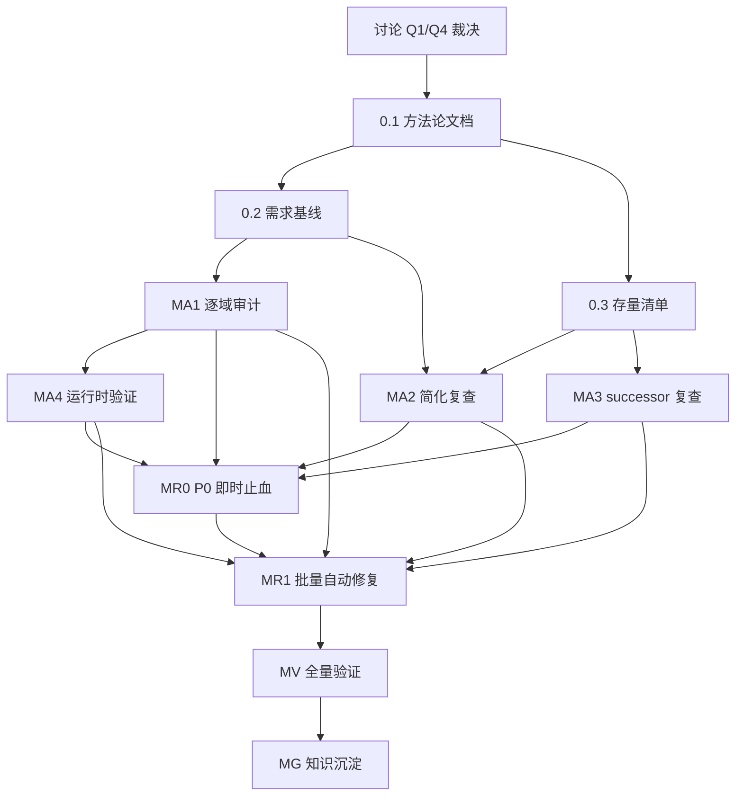

# 需求-实现符合性审计路线图（骨架）

> 最后更新：2026-08-06（A4.1.4 done：A1.2 §7-1 config 默认关闭 vs「开箱即用预算硬拦截」部署契约核对——全集真相源（product-scope/use-cases/owner doc/module-meta.yaml/business-module-metadata.md）+ 部署工件（全 20 生产 application.yaml/README/seed/部署运维文档）+ config 默认值逐消费点（11 站点）零命中「开箱启用预算控制」声明，建筑层反向显式登记为可选特性 `defaultValue:false`，caveat ① 维持接受，无新 finding/无 MR0/无 successor，报告 `docs/audits/2026-08-06-0847-rc-ma4-a4-1-4-budget-config-default-deployment-contract.md`）。2026-08-07（v1.5 — A4.2 扩展域存疑点运行时确认展开器 done：扩展域 A1.8-A1.51 §7 存疑点全集[43 报告，200 条原始条目，跨报告去重 8 组合并→185 条]展开为 A4.2.1-A4.2.185 实体验证行；展开映射记录 `docs/audits/2026-08-07-0400-rc-ma4-a4-2-ext-domain-expander.md`。v1.4 — A4.1 业财域存疑点运行时确认展开器 done：finance A1.1-A1.7 §7 存疑点全集[25 条]展开为 A4.1.1-A4.1.25 实体验证行；展开映射记录 `docs/audits/2026-08-07-0300-rc-ma4-a4-1-finance-expander.md`。v1.3 — Q1/Q4 已裁决：Q1=(c) 逐项对照需求真相源优先 / Q4=(a) P0/P1 必须实现禁止方案 B 无例外；M0 转 ready，解除执行阻塞。v1.2 经两轮独立子代理审查修订：MA1 完整枚举 51 切片；MA2 导出口径+分区约束；MR0/MR1 改执行时追加实体行；A4 展开器范式对齐 R1.0；Q1/Q4 硬门控；保护区域暂停协议+预授权声明；MA1↔既有审计去重协议；MA3 三源对账。A4.1.2 done：UC-FIN-12 汇率缺失触发面运行时普查——43 生产 PostingEvent 构造点无一漏传 setExchangeRate，`prepareContext:537` 静默回退为 dispatcher 路径死代码，P1-RC-002 维持 P1 不升 P0/不触发 MR0/无新 finding，报告 `docs/audits/2026-08-07-0330-rc-ma4-a4-1-2-fx-rate-missing-trigger-surface.md`）
> 来源：`docs/skills/audit-remediation-roadmap-authoring-prompt.md` 同型模式（需求-实现符合性变体）
> 范围文档：`docs/discussions/2026-08-02-1700-requirement-implementation-compliance-audit.md`
> **状态：可执行版本。Q1/Q4 已裁决（2026-08-02），M0 工作项转 ready，可启动 mission driver。**
> 关联路线图：`entity-state-machine-migration-roadmap.md` 将提供状态轴迁移矩阵、dict/writer 对照和可达性证据；本路线图的 MA1 状态机证据可消费其已完成产物，但不等待其整体完成。

## 目的

本路线图覆盖 nop-app-erp（19 域、156 模块）的**需求→实现符合性审计**：从需求真相源（product-scope + use-cases + owner doc 需求契约）出发，逐模块逐功能点核对运行时行为是否符合需求，识别并修复被"文档化简化/Deferred"合法化掩盖的需求-实现分歧。引用 `docs/backlog/00-roadmap-authoring-guide.md` 作为规范。**不复跑 MA1-MA7 架构漂移类审计**（详见讨论文档 §根因分析）。

> **预授权声明**（对齐 audit-remediation "ORM 变更已授权" 范式；Q4 已裁决=(a) 无例外，本声明为预授权类目清单）：
> - 文档更新类修复（owner doc / use-cases / arm-index）：预授权自动执行
> - 代码逻辑修复（BizModel / Processor / xbiz / view.xml）：预授权自动执行
> - ORM 结构变更（orm.xml 字段/索引/UK/实体）：**须 ask-first** + 独立 plan-audit
> - 会计过账逻辑变更（VoucherFact / PostingProcessor 核心路径）：**须 ask-first** + 独立 plan-audit
> - 数据删除 / 数据迁移：**须 ask-first** + 独立 plan-audit
> - 未列明的修复类目默认须 ask-first

## Work Item Status

> 唯一的动态状态块。状态：`todo` / `ready` / `done`。初始全 `todo`。

### Milestone M0 — 审计编排基线（方法论文档先行）

| # | Work Item | Status | Owner Doc | Deps | Skill |
|---|-----------|--------|-----------|------|-------|
| 0.1 | 需求-实现符合性审计方法论文档（五级追踪矩阵模板 + 判据 + **完整枚举纪律（禁止抽样）** + Q1 裁决的真相源层级（product-scope + use-cases 权威 > owner doc 参考，冲突一律以需求真相源为准）+ Q4 裁决的修复义务（P0/P1 必须实现禁止方案 B 无例外）+ 输出格式，落盘 `docs/audits/requirement-compliance-methodology.md`，独立子代理 ≥2 轮审查收敛） | done ✅ | 讨论文档 `2026-08-02-1700`（Q1/Q4 已裁决） | — | 参考 MQ 文档先行范式 |
| 0.2 | 需求基线提取与清单化（product-scope 修正陈旧段 + 18 域 192 UC 清单化 + **notify 补写完整 use-cases**[Q1 裁决：不标注 N/A，notify 是已实现子系统必须补需求契约] + **按功能切片拆分 51 个 A1.x 工作项**[notify 补写后可能新增切片行] + 五级追踪矩阵初始化） | done ✅ | `docs/requirements/product-scope.md` + 各域 `use-cases.md` | 0.1 | `docs/skills/design-completeness-scan-prompt.md` |
| 0.3 | 存量清单导出（arm-index documented simplification / Deferred / successor 全量清单 + **按域枚举 MA2 复查行** + 复杂度分级 + 优先级排序） | done ✅ | `docs/audits/arm-index.md` | 0.1 | 参考 `docs/audits/scripts/` |

### Milestone MA1 — 需求追踪矩阵审计（逐域逐功能切片）

> **完整枚举原则（本里程碑核心纪律）**：每个工作项 = 一个**功能切片 × 显式 UC 清单**，一份计划即可完整实施，全表即完整工作量（18 域 192 UC 统计覆盖无遗漏，拆为 50 个 UC 切片 + 1 个 notify 切片 = 51 行；logistics 04/05/06 为非标准 heading，0.2 归一化后复校）。**禁止合并切片抽样**；完成判据 = 本表全部行 `done`，任何"代表性抽样"即视为未完成。

> **与既有审计逐维度去重（MA1 ↔ audit-remediation MA2/MA3/MA4/MA5）**：新 MA1 的"运行时行为证据"维度与既有 MA2 状态机/业财链路行为审查**对象重叠**——去重协议：① 既有 MA2 报告（`docs/audits/2026-07-2*-arm-ma2-*`）已证实的状态机迁移/链路行为**直接作为既有证据输入**，MA1 只补"需求契约↔实际行为"差异（use-case 验收标准视角），不重新核实行为本身；② 每切片报告开头声明"与 MA2 报告的差异增量"；③ 新 finding 按 §MA1 详情"复用 or 新增"规则衔接 arm-index；④ MA4 与 A5.6（E2E 断言强度审计）边界见横切关注点 #3。**不复跑 MA1-MA7**：架构/平台一致性/文档漂移/代码质量/测试覆盖/保护区域纪律/审计面各维度均以 audit-remediation 收口为准。

| # | Work Item（功能切片 + UC 清单） | Status | Owner Doc | Deps | Skill |
|---|--------------------------------|--------|-----------|------|-------|
| A1.1 | **finance-F1 过账引擎与凭证链路**（UC-FIN-01/02/03/04/12/15） | done | `docs/design/finance/use-cases.md` + `posting.md` | 0.2 | `docs/skills/multi-dimensional-audit-prompt.md` |
| A1.2 | **finance-F2 预算与承付**（UC-FIN-11/13） | done | `docs/design/finance/budget.md` | 0.2 | 同上 |
| A1.3 | **finance-F3 AR/AP 核销与坏账**（UC-FIN-08） | done | `docs/design/finance/ar-ap-reconciliation.md` | 0.2 | 同上 |
| A1.4 | **finance-F4 银行对账**（UC-FIN-09/14 标题重复[同为"银行对账与未达账项"]，0.2 清单化时裁决去重） | todo | `docs/design/finance/bank-reconciliation.md` | 0.2 | 同上 |
| A1.5 | **finance-F5 成本核算**（UC-FIN-10） | done | `docs/design/finance/costing-methods.md` | 0.2 | 同上 |
| A1.6 | **finance-F6 期间与结账**（UC-FIN-06/07） | done | `docs/design/finance/period-close.md` | 0.2 | 同上 |
| A1.7 | **finance-F7 报表/看板/多账套**（UC-FIN-05/16/17） | done | `docs/design/finance/` + `docs/design/dashboards.md`（全局） | 0.2 | 同上 |
| A1.8 | **mfg-F1 MRP/DRP 引擎**（UC-MFG-05/08） | done | `docs/design/manufacturing/mrp.md` | 0.2 | 同上 |
| A1.9 | **mfg-F2 工单与报工**（UC-MFG-01/03/04/06/07/09） | done | `docs/design/manufacturing/` | 0.2 | 同上 |
| A1.10 | **mfg-F3 BOM 与工艺路线**（UC-MFG-02/10） | done | `docs/design/manufacturing/` | 0.2 | 同上 |
| A1.11 | **mfg-F4 差异/批次/看板**（UC-MFG-11/12/13） | done | `docs/design/manufacturing/variance-analysis.md` | 0.2 | 同上 |
| A1.12 | **hr-F1 员工与组织**（UC-HR-01/05/07/08/12） | done | `docs/design/human-resource/` | 0.2 | 同上 |
| A1.13 | **hr-F2 排班与考勤**（UC-HR-02/06/09） | done | `docs/design/human-resource/` | 0.2 | 同上 |
| A1.14 | **hr-F3 薪酬与调研**（UC-HR-03/04/10/11） | done | `docs/design/human-resource/payroll.md` | 0.2 | 同上 |
| A1.15 | **purchase-F1 主流程与请购**（UC-PUR-01/08） | done | `docs/design/purchase/` | 0.2 | 同上 |
| A1.16 | **purchase-F2 三单匹配与差异**（UC-PUR-02/03/05/06） | done | `docs/design/purchase/three-way-match.md` | 0.2 | 同上 |
| A1.17 | **purchase-F3 退货与业财**（UC-PUR-04/07） | done | `docs/design/purchase/returns.md` | 0.2 | 同上 |
| A1.18 | **sales-F1 主流程与价格**（UC-SAL-01/11） | done | `docs/design/sales/` | 0.2 | 同上 |
| A1.19 | **sales-F2 出库与并发**（UC-SAL-02/03/10） | done | `docs/design/sales/` | 0.2 | 同上 |
| A1.20 | **sales-F3 退货族**（UC-SAL-04/05/06/07/09） | done | `docs/design/sales/returns.md` | 0.2 | 同上 |
| A1.21 | **sales-F4 赠品与看板**（UC-SAL-08/12） | done | `docs/design/sales/` + `docs/design/dashboards.md`（全局） | 0.2 | 同上 |
| A1.22 | **assets-F1 折旧引擎**（UC-AST-02/07/08） | done | `docs/design/assets/` | 0.2 | 同上 |
| A1.23 | **assets-F2 处置**（UC-AST-04/05） | done | `docs/design/assets/` | 0.2 | 同上 |
| A1.24 | **assets-F3 资本化/拆分/盘点/维修/看板**（UC-AST-01/03/06/09/10/11/12） | done | `docs/design/assets/` | 0.2 | 同上 |
| A1.25 | **inventory-F1 移动单主链与追溯**（UC-INV-01/03/04/05） | done | `docs/design/inventory/` | 0.2 | 同上 |
| A1.26 | **inventory-F2 批次与可用量**（UC-INV-02/06/09） | done | `docs/design/inventory/` | 0.2 | 同上 |
| A1.27 | **inventory-F3 盘点/估值/并发/看板**（UC-INV-07/08/10/11） | done | `docs/design/inventory/` | 0.2 | 同上 |
| A1.28 | **crm-F1 线索生命周期**（UC-CRM-01/02/03/04/09/11） | done | `docs/design/crm/` | 0.2 | 同上 |
| A1.29 | **crm-F2 营销/预测/配额/序列/事件提醒**（UC-CRM-05/07/08/10/12/14/15） | done | `docs/design/crm/` | 0.2 | 同上 |
| A1.30 | **crm-F3 CPQ/漏斗推进**（UC-CRM-06/13） | done | `docs/design/crm/` | 0.2 | 同上 |
| A1.31 | **quality-F1 检验门控**（UC-QA-01/02/03/04/06/07/08） | done | `docs/design/quality/` | 0.2 | 同上 |
| A1.32 | **quality-F2 NCR-CAPA 闭环**（UC-QA-05） | done | `docs/design/quality/` | 0.2 | 同上 |
| A1.33 | **quality-F3 SPC 与看板**（UC-QA-09/10/11/12） | done | `docs/design/quality/` | 0.2 | 同上 |
| A1.34 | **projects-F1 立项与成本归集**（UC-PRJ-01/02/03/09） | done | `docs/design/projects/` | 0.2 | 同上 |
| A1.35 | **projects-F2 预算与 DAG**（UC-PRJ-04/05） | done | `docs/design/projects/` | 0.2 | 同上 |
| A1.36 | **projects-F3 结算与看板**（UC-PRJ-06/07/08/10） | done | `docs/design/projects/` | 0.2 | 同上 |
| A1.37 | **cs-F1 工单生命周期**（UC-CS-01/02/03/11） | done | `docs/design/customer-service/` | 0.2 | 同上 |
| A1.38 | **cs-F2 SLA 与升级**（UC-CS-04） | done | `docs/design/customer-service/` | 0.2 | 同上 |
| A1.39 | **cs-F3 知识库/质量联动/预设应答**（UC-CS-05/06/07） | done | `docs/design/customer-service/` | 0.2 | 同上 |
| A1.40 | **cs-F4 调查/权益/目录/履行**（UC-CS-08/09/10/12） | done | `docs/design/customer-service/` | 0.2 | 同上 |
| A1.41 | **master-data 全功能**（UC-MD-01~07，7 UC） | done | `docs/design/master-data/` | 0.2 | 同上 |
| A1.42 | **maintenance-F1 调度与冲突**（UC-MAIN-01/02/09） | done | `docs/design/maintenance/` | 0.2 | 同上 |
| A1.43 | **maintenance-F2 访问与备件**（UC-MAIN-03/04） | done | `docs/design/maintenance/` | 0.2 | 同上 |
| A1.44 | **maintenance-F3 响应/联动/OEE/看板**（UC-MAIN-05/06/07/08/10/11） | done | `docs/design/maintenance/` | 0.2 | 同上 |
| A1.45 | **contract-F1 生命周期与签署**（UC-CT-01/02/05/06/07/09） | done | `docs/design/contract/` | 0.2 | 同上 |
| A1.46 | **contract-F2 计费与返利**（UC-CT-03/04/08/10） | done | `docs/design/contract/` | 0.2 | 同上 |
| A1.47 | **b2b 全功能**（UC-B2B-001~008，8 UC） | done | `docs/design/b2b/` | 0.2 | 同上 |
| A1.48 | **drp 全功能**（UC-DRP-01~08，8 UC） | done | `docs/design/drp/` | 0.2 | 同上 |
| A1.49 | **logistics 全功能**（UC-LOG-01~07，7 UC；04/05/06 在 use-cases.md 用非标准 heading `## 用例X：…`，0.2 清单化时归一化） | done | `docs/design/logistics/` | 0.2 | 同上 |
| A1.50 | **aps 全功能**（UC-APS-01~07，7 UC） | done | `docs/design/aps/` | 0.2 | 同上 |
| A1.51 | **notify 通知派发**（UC-SYS-01~07，7 UC，0.2 补写 use-cases 后纳入） | done | `docs/design/notify/` | 0.2 | 同上 |

### Milestone MA2 — 已裁决简化/Deferred 复查

> **完整枚举原则（同 MA1）**：arm-index 全部方案 B（documented simplification / Deferred 标注）关闭项逐项复核：与 product-scope 对照，区分"有意设计"vs"静默降级"，重新分级。**0.3 导出口径（关键）**：按 arm-index 各行 resolved 注记中的**关闭方式标签**（方案 B / documented simplification / Deferred 标注）筛行，**排除 `resolved (R*.n done)` 类实现修复项**；示例 ID 仅作锚点，精确清单以 0.3 导出为准。**分区约束：每个 finding ID 恰好归属一个 A2.x 行**（跨域项按主域归属并显式标注，0.3 导出后脚本校验分区不重叠）。判据：与 product-scope 冲突 / 影响报表·过账正确性 / 无显式人工批准记录（证据标准见 Work Item Details）→ 重新打开并入 MR1。

| # | Work Item（域 × 方案 B 关闭项全集） | Status | Owner Doc | Deps | Skill |
|---|--------------------------------|--------|-----------|------|-------|
| A2.1 | finance 会计保护区域简化复查（锚点：GRNI 冲回 P1-MA2-001 / 年初余额 P1-MA2-018 / 辅助账对账 P1-MA2-019 / 反结账 P1-MA2-020 / FX 重估 P1-MA2-022；其余以 0.3 按标签导出） | done ✅ | `docs/design/finance/` + `arm-index.md` | 0.2 + 0.3 | `docs/skills/open-ended-audit-prompt.md` |
| A2.2 | finance 非保护区域简化复查（0.3 按标签导出；示例非方案 B 项如 P1-MA2-095~099 系实现修复，不属本行） | done ✅ | `docs/design/finance/` + `arm-index.md` | 0.2 + 0.3 | 同上 |
| A2.3 | mfg 简化复查（锚点：作业卡 P1-MA2-035 / MRP·预测 P1-MA2-036 / 建议单释放 P1-MA2-037；其余 0.3 导出） | done ✅ | `docs/design/manufacturing/` + `arm-index.md` | 0.2 + 0.3 | `docs/skills/open-ended-audit-prompt.md` |
| A2.4 | hr 简化复查（锚点：员工/合同/调查/发展计划/工时/银行文件/排班/薪酬 P1-MA2-039~048 族；0.3 复核关闭方式标签后筛行） | done ✅（空集认证：0 项方案 B，见 `2026-08-06-0442-rc-ma2-a2-3-8-9` §5.3） | `docs/design/human-resource/` + `arm-index.md` | 0.2 + 0.3 | 同上 |
| A2.5 | purchase + sales 简化复查（锚点：采购 P1-MA2-049/050/051 / 销售 P1-MA2-056/057；P1-MA2-001 GRNI 冲回归 A2.1 finance 保护区域[会计过账本质]，082/083 承付族跨域项 0.3 按主域分区） | done ✅（空集认证：0 项方案 B，见同上 §5.3） | `docs/design/purchase/`+`sales/` + `arm-index.md` | 0.2 + 0.3 | 同上 |
| A2.6 | assets + inventory 简化复查（锚点：资产状态机 P1-MA2-058~061 / 盘点 P1-MA2-062 / 拣货 P1-MA2-063；P1-MA2-024/085 系实现修复、089 系并发实现修复，0.3 复核排除） | done ✅（空集认证：0 项方案 B，见同上 §5.3） | `docs/design/assets/`+`inventory/` + `arm-index.md` | 0.2 + 0.3 | 同上 |
| A2.7 | projects + quality 简化复查（锚点：NCR/质检 P1-MA2-064~066 / 项目 P1-MA2-067~070；0.3 复核关闭方式标签） | done ✅（空集认证：0 项方案 B，见同上 §5.3） | `docs/design/projects/`+`quality/` + `arm-index.md` | 0.2 + 0.3 | 同上 |
| A2.8 | 扩展域简化复查（锚点：contract P1-MA2-071/072 / b2b P1-MA2-073 / maintenance P1-MA2-074 / crm P1-MA2-075/076 / aps+logistics P1-MA2-077~080；0.3 复核标签） | done ✅ | 各域 owner doc + `arm-index.md` | 0.2 + 0.3 | 同上 |
| A2.9 | 跨域简化复查（0.3 按标签导出跨域项；P1-MA2-086/088/089 系并发实现修复，不属本行） | done ✅ | `docs/design/` 各域 + `arm-index.md` | 0.2 + 0.3 | 同上 |

### Milestone MA3 — successor 追踪完整性与回队复查

> **完整枚举原则（同 MA1）**：0.3 **三源对账导出**（arm-index 行内 successor 声明 + owner doc 内嵌声明 + `docs/backlog/README.md` 既有 81 行追踪）后，**按域分组逐项核对**（部分声明可能已 done，需对账消歧）：① 触发条件是否已满足（已满足 → 回队 MA1/R1.0）；② 是否该回队（回到审计、R1.0 修复或 backlog README）；③ 无触发条件的补登记；④ backlog/README 既有行的覆盖与正确性复核（防"已登记但从未触发"）。每行 = 一份计划，覆盖该行全部 successor 项，禁止抽样。

| # | Work Item（域 × successor 清单） | Status | Owner Doc | Deps | Skill |
|---|--------------------------------|--------|-----------|------|-------|
| A3.1 | finance 域 successor 复查（如 GL 余额引擎 / 多账套 UK 升级 / 冲销恢复承付 / GRNI 自动冲回触发条件等） | done ✅ | `docs/audits/arm-index.md` + `docs/backlog/README.md` | 0.3 | `docs/skills/open-ended-audit-prompt.md` |
| A3.2 | mfg + inventory + purchase 域 successor 复查（如物料预留实现 / STANDARD 红冲 / 拣货 WMS / 盘点自动移动单等） | done ✅ | `docs/audits/arm-index.md` + `docs/backlog/README.md` | 0.3 | 同上 |
| A3.3 | sales + assets + projects + quality 域 successor 复查（如订单维度核销 / 资产转固 / employee-id 行过滤等） | done ✅ | `docs/audits/arm-index.md` + `docs/backlog/README.md` | 0.3 | 同上 |
| A3.4 | hr + crm + cs 域 successor 复查（如 recruitment 多实体 / 滞留升级 / 序列推进等） | done ✅ | `docs/audits/arm-index.md` + `docs/backlog/README.md` | 0.3 | 同上 |
| A3.5 | 扩展域 + 跨域 successor 复查（contract/b2b/logistics/drp/aps/maintenance/notify + 多公司/数据权限/SoD 铺开等） | done ✅ | `docs/audits/arm-index.md` + `docs/backlog/README.md` | 0.3 | 同上 |

### Milestone MA4 — 运行时行为验证

> **完整枚举原则（同 MA1）**：对 MA1 发现的**全部**"静态存疑点"做运行时行为确认，输出证据链。**MA1 每份报告须列明存疑点清单**。A4.1/A4.2 为**展开器工作项**（对齐 R1.0 范式，非容器行/非预注册固定范围）：读取 MA1 报告存疑点清单 → 向本表追加 A4.1.n/A4.2.n 实体验证行（每存疑点一行）→ **展开完成（全部实体行已追加）后 A4.1/A4.2 标记 done**；后续 A4.1.n/A4.2.n 各自独立 plan + 独立 done。**无存疑点的切片不产生实体行**（此时展开器直接 done）。既有证据复用：MA2 已证实的状态机/链路行为（`docs/audits/2026-07-2*-arm-ma2-*` 报告）作为既有证据输入，MA4 只补"需求↔行为"差异，不重复验证。

| # | Work Item | Status | Owner Doc | Deps | Skill |
|---|-----------|--------|-----------|------|-------|
| A4.1 | 业财域 MA1 存疑点运行时确认**展开器**（读取 MA1 业财切片报告全部存疑点清单，展开为本表 A4.1.n 实体验证行） | done ✅ | `docs/design/flow-overview.md` + `tests/e2e/` | MA1 done | `docs/skills/multi-dimensional-audit-prompt.md` |
| A4.1.1 | A1.1 §7-1 — UC-FIN-02 断言④「业务单据.posted=false」8 域 listener 回写覆盖率逐域核验 | done ✅ | `2026-08-02-1645-...-a1-1-...md` §7 + `flow-overview.md` | A4.1 done | 同上 |
| A4.1.2 | A1.1 §7-2 — UC-FIN-12 汇率缺失触发面实测（各域 Provider 外币场景是否显式传 rate 普查） | done ✅ | 同上 §7 + `posting.md` + `docs/audits/2026-08-07-0330-rc-ma4-a4-1-2-fx-rate-missing-trigger-surface.md` | A4.1 done | 同上 |
| A4.1.3 | A1.1 §7-3 — UC-FIN-03 PROJECT_SETTLEMENT businessType 是否已有 Provider 注册（实例普查） | done ✅ | 同上 §7 + `docs/audits/2026-08-07-0330-rc-ma4-a4-1-3-project-settlement-provider-census.md` | A4.1 done | 同上 |
| A4.1.4 | A1.2 §7-1 — config 默认关闭 vs「开箱即用预算硬拦截」部署契约（核对 product-scope/部署文档） | done ✅ | `2026-08-02-1700-...-a1-2-...md` §7 + `budget.md` + `docs/audits/2026-08-06-0847-rc-ma4-a4-1-4-budget-config-default-deployment-contract.md` | A4.1 done | 同上 |
| A4.1.5 | A1.2 §7-2 — 承付凭证 header 借贷不平时报暴露（试算平衡/三表是否过滤 COMMITMENT 影子凭证） | done ✅ | 同上 §7（A1.7 已静态证 BS/IS 安全） | A4.1 done | 同上 |
| A4.1.6 | A1.2 §7-3 — `fin-budget-vs-actual.value.spec.ts` 是否断言 commitment 独立列（E2E 断言强度评估） | done ✅ | 同上 §7 + `tests/e2e/` + `docs/audits/2026-08-06-0847-rc-ma4-a4-1-6-budget-vs-actual-e2e-assertion-strength.md` | A4.1 done | 同上 |
| A4.1.7 | A1.2 §7-4 — 承付 release-on-return（接入点 #4）config 默认 off 实际启用状态（部署普查） | done ✅ | 同上 §7 + `budget.md` + `docs/audits/2026-08-07-0944-rc-ma4-a4-1-7-commitment-release-on-return-config-deployment-census.md` | A4.1 done | 同上 |
| A4.1.8 | A1.3 §7-1 — `PartnerBalanceUpdater.sumOpen` 对 WRITTEN_OFF 隐式排除（PARTIAL→WRITTEN_OFF 边界运行时未覆盖） | done ✅ | 同上 §7 + `docs/audits/2026-08-07-0944-rc-ma4-a4-1-8-partner-balance-written-off-implicit-exclusion.md` | A4.1 done | 同上 |
| A4.1.9 | A1.3 §7-2 — `TestErpFinBadDebt` 凭证 businessType 枚举断言强度（未断言 BAD_DEBT_WRITE_OFF） | done ✅ | 同上 §7 + `docs/audits/2026-08-07-0944-rc-ma4-a4-1-9-bad-debt-voucher-businesstype-assertion-strength.md` | A4.1 done | 同上 |
| A4.1.10 | A1.3 §7-3 — `TestErpFinAutoReconciliation` 禁用路径覆盖缺口（@NopTestConfig 限制） | done ✅ | 同上 §7 + `docs/audits/2026-08-06-1044-rc-ma4-a4-1-10-auto-recon-config-gated-disabled-coverage.md` | A4.1 done | 同上 |
| A4.1.11 | A1.4 §7-1 — UC-FIN-09/14 对方账号缺失致错误 MATCHED 的实际触发率（关联 P1-RC-004） | done ✅ | `2026-08-02-1815-...-a1-4-...md` §7 + `docs/audits/2026-08-06-1044-rc-ma4-a4-1-11-bank-recon-counterparty-account-mismatch-rate.md` | A4.1 done | 同上 |
| A4.1.12 | A1.4 §7-2 — UC-FIN-09/14 调整凭证行级 Dr/Cr/科目/金额正确性（`BankReconAdjAcctDocProvider.createFacts`） | done ✅ | 同上 §7 + `docs/audits/2026-08-06-1044-rc-ma4-a4-1-12-bank-recon-adj-voucher-line-correctness.md` | A4.1 done | 同上 |
| A4.1.13 | A1.4 §7-3 — UC-FIN-09/14 跨多条 statement refNo 重复的实际检出（关联 P2-RC-001） | done ✅ | 同上 §7 + `docs/audits/2026-08-07-1400-rc-ma4-a4-1-13-bank-recon-cross-statement-refno-dedup-detection.md` | A4.1 done | 同上 |
| A4.1.14 | A1.4 §7-4 — UC-FIN-14 断言⑤ config key 默认 true 但无 scheduler 消费的运维认知（关联 P1-RC-005） | done ✅ | 同上 §7 + `docs/audits/2026-08-07-1400-rc-ma4-a4-1-14-bank-recon-auto-reverse-config-orphan-awareness.md` | A4.1 done | 同上 |
| A4.1.15 | A1.5 §7-1 — FIFO 物料 + 到岸成本 delta 层 + 后续出库消耗数值正确性（关联 P2-RC-004；**触及成本过账行为探针**） | done ✅ | 同上 §7 + `docs/audits/2026-08-07-1400-rc-ma4-a4-1-15-fifo-landed-cost-delta-layer-consumption-correctness.md`（**升级 P2-RC-004 = P1**：delta 层结构性永不被消耗，LC-L3 FIFO 路径未实现） | A4.1 done | 同上 |
| A4.1.16 | A1.5 §7-2 — FIFO 物料到岸成本红冲 delta 层部分消耗后物理删除余额守恒（`removeFifoAdjustLayer`；**触及数据删除行为探针**） | done ✅ | 同上 §7 + `docs/audits/2026-08-06-1517-rc-ma4-a4-1-16-fifo-landed-cost-reverse-delta-layer-deletion-balance-conservation.md`（**维持 P2-MA2-029 = P2**：余额回退对称 + 哨兵精确删除，常态余额守恒成立；边角部分消耗漂移被 P2-RC-004[P1 forward] 同根因涵盖，按 §去重协议不重复升级） | A4.1 done | 同上 |
| A4.1.17 | A1.5 §7-3 — P1-MA2-085 SELECT FOR UPDATE 路径在真实 DB（PG/MySQL）的锁行为 | done ✅ | 同上 §7 + `docs/audits/2026-08-06-1517-rc-ma4-a4-1-17-landed-cost-select-for-update-cross-db-lock-behavior.md`（**发现跨方言退化：注册新 P1-RC-092[P1，MR1+ask-first]**——MySQL InnoDB REPEATABLE_READ[默认]下 SELECT FOR UPDATE 锁有效但 `validateNotAlreadyAllocated:399` 非锁 check 读陈旧 MVCC 快照致 TOCTOU 重新打开；H2/PG/MySQL-RC 成立。P1-MA2-085 resolved 不撤销[caveat：H2/PG/MySQL-RC 有效]，跨方言 MySQL-RR 退化由 P1-RC-092 捕获） | A4.1 done | 同上 |
| A4.1.18 | A1.6 §7-1 — PC-3 AR/AP reminder 模式运行时行为（关联 P2-RC-006） | todo | `2026-08-02-2100-...-a1-6-...md` §7 + `period-close.md` | A4.1 done | 同上 |
| A4.1.19 | A1.6 §7-2 — PC-4 资产折旧 auto-execute + 悬挂阻断交互（G3 rethrow vs 悬挂扫描双报） | todo | 同上 §7 | A4.1 done | 同上 |
| A4.1.20 | A1.6 §7-3 — RC-9 反结账审计缺失实际合规影响（`updatedBy`/`updateTime` 是否被覆盖；关联 P1-RC-006） | todo | 同上 §7 | A4.1 done | 同上 |
| A4.1.21 | A1.6 §7-4 — 年末反结账阻断边界（手动删次年期间后 ErpFinGlBalance/yearOpening 残留一致性） | todo | 同上 §7 | A4.1 done | 同上 |
| A4.1.22 | A1.7 SP-1 — cash flow 读 VoucherLine 不过滤 postingType，BUDGET/COMMITMENT 影子凭证现金科目污染 | todo | `2026-08-02-2115-...-a1-7-...md` §7 | A4.1 done | 同上 |
| A4.1.23 | A1.7 SP-2 — 多账套部署「每账套独立三表」运行时渲染（当前读路径取主账套非按账套切换） | todo | 同上 §7 | A4.1 done | 同上 |
| A4.1.24 | A1.7 SP-3 — CLOSED 期间门控缺失的运行时数据完整性影响（OPEN 期间渲染报表误导；关联 P2-RC-008） | todo | 同上 §7 | A4.1 done | 同上 |
| A4.1.25 | A1.7 SP-4 — 看板行级权限 `period.orgId` scope 跨组织泄漏（关联 P1-MA2-093） | todo | 同上 §7 + `dashboards.md` | A4.1 done | 同上 |
| A4.2 | 扩展域 MA1 存疑点运行时确认**展开器**（读取 MA1 扩展域切片报告全部存疑点清单，展开为本表 A4.2.n 实体验证行） | done ✅ | 各域 owner doc + `docs/audits/2026-08-07-0400-rc-ma4-a4-2-ext-domain-expander.md` | MA1 done | 同上 |
| A4.2.1 | A1.8 SP-1 — 预留量并发扣减运行时行为（reserved 恒为 0，多工单并发领料 stock move bookkeeper negative-stock 防护兜底） | todo | `2026-08-02-2042-2-...-a1-8-...md` §7 + `flow-overview.md` | A4.2 done | 同上 |
| A4.2.2 | A1.8 SP-2 — STOCK_PARTIAL 强制开工后领料 KitAvailabilityChecker 只读路径补料后可用量（无缓存/陈旧读） | todo | 同上 §7 | A4.2 done | 同上 |
| A4.2.3 | A1.8 SP-3 + A1.9 SP-3（合并：MR1 P1-RC-008 预留写路径 successor 同根因同控制点）— MR1 修复落地后 reservedQty/availableQuantity 实时一致性 + 跨工单并发预留 lost-update 防护 | todo | 同上 §7 + `2026-08-02-2042-3-...-a1-9-...md` §7 | A4.2 done | 同上 |
| A4.2.4 | A1.9 SP-1 + A1.11 SP-1（合并：完工触发差异过账失败告警通道 notify 投递 successor 同根因同控制点）— IErpSysNotificationBiz.notify 投递成功率 + 运营响应闭环（P1-MA4-007 resolved R1.16 运行时落地） | todo | `2026-08-02-2042-3-...-a1-9-...md` §7 + `2026-08-02-2245-...-a1-11-...md` §7 | A4.2 done | 同上 |
| A4.2.5 | A1.9 SP-2 + A1.31 SP-2（合并：UC-MFG-09 返工工单工作流 同根因同控制点）— REJECTED 工单 IN_PROCESS 操作员实际工作流 + 关联原工单可追溯性 | todo | 同上 §7 + `2026-08-05-1830-2-...-a1-31-...md` §7 | A4.2 done | 同上 |
| A4.2.6 | A1.10 SP-1 — BOM 内容编辑后已开工工单运行时是否按新 BOM 重算物料需求/成本（P1-RC-009 运行时影响） | todo | `2026-08-02-2231-1-...-a1-10-...md` §7 | A4.2 done | 同上 |
| A4.2.7 | A1.10 SP-2 — BOM 快照缺失运行时是否致成本结转凭证错误（P1-RC-009 GL 凭证金额偏差） | todo | 同上 §7（与 SP-1 协同） | A4.2 done | 同上 |
| A4.2.8 | A1.10 SP-3 — bomId 弱隔离运行时边界（运营 BOM 变更实践：编辑 vs 新建） | todo | 同上 §7 | A4.2 done | 同上 |
| A4.2.9 | A1.11 SP-2 — best-effort 基因链写失败运行时缺口可观测性（BatchGenealogyWriter catch 频率 + LOG.error 采集；P1-RC-010） | todo | `2026-08-02-2245-...-a1-11-...md` §7 | A4.2 done | 同上 |
| A4.2.10 | A1.11 SP-3 + A1.21 SP-3 + A1.24 SP-4 + A1.27 SP-4 + A1.33 SP-1 + A1.36 SP-5 + A1.41 SP-1 + A1.44 SP-5（合并：8 域 dashboard orgId 行级权限 R1.29 ErpOrgIsolationQueryTransformer 对 IDaoProvider/IOrmTemplate 直访路径注入 同根因[P1-MA2-093]同控制点）— 多组织部署跨组织 dashboard 查询泄漏 | todo | 同上 §7（8 切片 §7 交叉引用） | A4.2 done | 同上 |
| A4.2.11 | A1.11 SP-4 — 召回报告 degraded 模式运行时业务覆盖（受影响成品批次集合是否满足召回需求） | todo | 同上 §7 | A4.2 done | 同上 |
| A4.2.12 | A1.12 §7-1 — UC-HR-07 cron 运行时调度接线（scheduler.yaml + contract-expiry-cron config 非空） | todo | `2026-08-02-2328-...-a1-12-...md` §7 | A4.2 done | 同上 |
| A4.2.13 | A1.12 §7-2 — UC-HR-07 30/60/90 多档预警运行时配置（单一阈值 config 多档调度） | todo | 同上 §7 | A4.2 done | 同上 |
| A4.2.14 | A1.12 §7-3 — UC-HR-12 评估聚合权重运行时配置覆盖（assessment*Weight 默认 + AppConfig.var） | todo | 同上 §7 | A4.2 done | 同上 |
| A4.2.15 | A1.12 §7-4 — UC-HR-08 handleContract 三态运行时行为（transferAutoHandleContract 默认 true 是否被覆盖） | todo | 同上 §7 | A4.2 done | 同上 |
| A4.2.16 | A1.12 §7-5 — UC-HR-05 未到岗回退运行时处理（P2-RC-010 无 rollbackHire，HR close+重开处理） | todo | 同上 §7 | A4.2 done | 同上 |
| A4.2.17 | A1.13 SP-1 — P1-RC-011 审批人超时自动转派缺失运行时影响面（SUBMITTED 休假悬挂量 vs 薪酬核算耦合） | todo | `2026-08-02-2344-...-a1-13-...md` §7 | A4.2 done | 同上 |
| A4.2.18 | A1.13 SP-2 — P1-RC-012 多次打卡 reject 运行时误判面（员工误触逃生路径 + HR 手工 DB 修正频度） | todo | 同上 §7 | A4.2 done | 同上 |
| A4.2.19 | A1.13 SP-3 — P1-RC-013 夜班跨天 clockOut 运行时阻断（夜班占比 + 补录临时运维） | todo | 同上 §7 | A4.2 done | 同上 |
| A4.2.20 | A1.13 SP-4 — P1-RC-014 设备故障补卡运行时替代（标准 CRUD 绕过字段守卫越权风险） | todo | 同上 §7 | A4.2 done | 同上 |
| A4.2.21 | A1.13 SP-5 — UC-HR-09⑲ 换班跨日期语义（ShiftSwapRequestSubmitProcessor 未校验同日期） | todo | 同上 §7 | A4.2 done | 同上 |
| A4.2.22 | A1.14 §7-1 — UC-HR-04 ⑯ 计提+公司承担过账运行时触发链（approve→APPROVED SALARY(270)+290/300 是否生成） | todo | `2026-08-03-0000-...-a1-14-...md` §7 | A4.2 done | 同上 |
| A4.2.23 | A1.14 §7-2 — UC-HR-04 公司承担金额运行时丢弃确认（socialInsuranceER/housingFundER 是否经 billData 传递） | todo | 同上 §7 | A4.2 done | 同上 |
| A4.2.24 | A1.14 §7-3 — UC-HR-03 ②24h 校验运行时拦截（同日多条 TimesheetLine hours 之和 >24） | todo | 同上 §7 | A4.2 done | 同上 |
| A4.2.25 | A1.14 §7-4 — UC-HR-11 ㉖匿名 respondentHash 运行时防重复（重复提交是否拦截） | todo | 同上 §7 | A4.2 done | 同上 |
| A4.2.26 | A1.14 §7-5 — UC-HR-11 ㉘㉙ CLOSED 自动聚合 + eNPS 运行时计算（结果表是否永远空） | todo | 同上 §7 | A4.2 done | 同上 |
| A4.2.27 | A1.15 §7-1 — UC-PUR-01 ④ GOODS_RECEIPT/PURCHASE_INPUT 运行时触发链（receive approve→triggerIncomingMove→posting 全链） | todo | `2026-08-03-0145-...-a1-15-...md` §7 + `flow-overview.md` | A4.2 done | 同上 |
| A4.2.28 | A1.15 §7-2 — UC-PUR-01 ⑦ paidStatus 派生运行时一致性（多付款单跨单据核销同一发票 SUM） | todo | 同上 §7 | A4.2 done | 同上 |
| A4.2.29 | A1.15 §7-3 — UC-PUR-01 ⑧ 应付余额辅助账聚合运行时一致性（ErpFinArApItem.openAmount 恒等式） | todo | 同上 §7 | A4.2 done | 同上 |
| A4.2.30 | A1.15 §7-4 — UC-PUR-08 ⑫ 多供应商拆分运行时阻断（validateConsistentSupplier；P1-RC-017） | todo | 同上 §7 | A4.2 done | 同上 |
| A4.2.31 | A1.15 §7-5 — P1-MA2-083 承付恢复运行时不对称（invoice approve→release, reverseApprove→AP 红冲但 commitment 不归位） | todo | 同上 §7 + `budget.md` | A4.2 done | 同上 |
| A4.2.32 | A1.15 §7-6 — UC-PUR-08 ⑬ 取消后再转化运行时允许（cancel 全部衍生订单后再次转化；P2-RC-012） | todo | 同上 §7 | A4.2 done | 同上 |
| A4.2.33 | A1.16 §7-1 — UC-PUR-03 ⑦ 两次入库独立过账凭证数==2 运行时确认（per-mutation approve 架构） | todo | `2026-08-03-0200-...-a1-16-...md` §7 | A4.2 done | 同上 |
| A4.2.34 | A1.16 §7-2 — UC-PUR-05 ⑫ 让步接收价格差异过账运行时生成（PurAcctDocProvider.createFacts 无 PPV 行；P1-RC-018） | todo | 同上 §7 | A4.2 done | 同上 |
| A4.2.35 | A1.16 §7-3 — UC-PUR-05 ⑪ 三处理策略运行时分支可达性（仅"拒绝"可达；P1-RC-018） | todo | 同上 §7 | A4.2 done | 同上 |
| A4.2.36 | A1.16 §7-4 — UC-PUR-02 ② 超收容差运行时门控（receive approve 无 qty-vs-order 校验；P1-RC-019） | todo | 同上 §7 | A4.2 done | 同上 |
| A4.2.37 | A1.16 §7-5 — UC-PUR-06 ⑮ 短收超容差运行时差异处理（无差异处理触发；P2-RC-014） | todo | 同上 §7 | A4.2 done | 同上 |
| A4.2.38 | A1.16 §7-6 — UC-PUR-06 ⑰ 关闭释放预留运行时 config-gated 行为（budget-commitment-enabled 默认 false） | todo | 同上 §7 | A4.2 done | 同上 |
| A4.2.39 | A1.16 §7-7 — UC-PUR-03 ⑤⑥ receivedQuantity 运行时值（列始终 0，零 writer；P2-RC-013） | todo | 同上 §7 | A4.2 done | 同上 |
| A4.2.40 | A1.17 §7-1 — UC-PUR-04 ④ isReversed 标记运行时确认（PurReturnPostingDispatcher 不调 markOriginalVoucherReversed；P2-RC-015） | todo | `2026-08-03-0300-...-a1-17-...md` §7 | A4.2 done | 同上 |
| A4.2.41 | A1.17 §7-2 — UC-PUR-04 ⑤ credit-memo-via-return 运行时 AP 余额回减（P2-MA2-006 resolved 复核） | todo | 同上 §7 | A4.2 done | 同上 |
| A4.2.42 | A1.17 §7-3 — UC-PUR-07 ② GR/IR 暂估应付运行时凭证行（InvAcctDocProvider + PurAcctDocProvider） | todo | 同上 §7 | A4.2 done | 同上 |
| A4.2.43 | A1.17 §7-4 + A1.20 SP-3（合并：跨域期间 CLOSED guard 间接拦截 同根因[finance resolveOpenPeriod]同控制点）— purchase receive/invoice/return + sales return 过账路径期间 CLOSED 守卫 | todo | 同上 §7 + `2026-08-03-0630-...-a1-20-...md` §7 | A4.2 done | 同上 |
| A4.2.44 | A1.17 §7-5 — UC-PUR-07 ④ 反审核运行时删凭证（红字冲销；ErpPurReturnProcessor + PurReversalListener） | todo | 同上 §7 | A4.2 done | 同上 |
| A4.2.45 | A1.17 §7-6 — UC-PUR-04 承付恢复运行时对称性（reuse P1-MA2-083；return approve 释放 vs reverseApprove 不恢复） | todo | 同上 §7 + `budget.md` | A4.2 done | 同上 |
| A4.2.46 | A1.17 §7-7 — UC-PUR-07 ③ 多币种行级金额运行时计算（PurInvoicePostingDispatcher.buildEvent exchangeRate） | todo | 同上 §7 | A4.2 done | 同上 |
| A4.2.47 | A1.18 §7-1 + A1.19 §7-2（合并：订单级可用量校验缺失运行时影响 同根因[订单审核不调库存 Facade]同控制点）— 出库环节才发现库存不足的运行时频度/业务影响 | todo | `2026-08-03-0430-...-a1-18-...md` §7 + `2026-08-03-0530-...-a1-19-...md` §7 | A4.2 done | 同上 |
| A4.2.48 | A1.18 §7-2 — UC-SAL-11 ⑥ 最低价校验缺失的实际触发面（促销配置是否致售价 < SKU.minPrice） | todo | 同上 §7 | A4.2 done | 同上 |
| A4.2.49 | A1.18 §7-3 — UC-SAL-11 ⑦ 价税分离缺失的实际 GL 影响（recomputeLineAmount 不重算 taxAmount 数值偏差；P1-RC-022） | todo | 同上 §7 | A4.2 done | 同上 |
| A4.2.50 | A1.18 §7-4 — UC-SAL-01 ⑨ 客户应收余额双层设计运行时一致性（归 P2-MA2-038 DualSideConsistencyChecker 跟踪） | todo | 同上 §7 | A4.2 done | 同上 |
| A4.2.51 | A1.18 §7-5 — UC-SAL-11 ② 取价优先级链跨域协作运行时一致性（master-data 取价后 sales pricingSource 写入值） | todo | 同上 §7（与 A1.41 协同） | A4.2 done | 同上 |
| A4.2.52 | A1.19 §7-1 — UC-SAL-10 销售级 seam 真实并发下的运行时行为（triggerOutgoingMove Facade seam 同事务/异常传播） | todo | `2026-08-03-0530-...-a1-19-...md` §7 | A4.2 done | 同上 |
| A4.2.53 | A1.19 §7-3 — 负库存配置下并发结果（allow-negative-stock=true 下 sales 出库同批次并发最终余额边界） | todo | 同上 §7 | A4.2 done | 同上 |
| A4.2.54 | A1.19 §7-4 — UC-SAL-03 deliveredQuantity 查询实际返回值（零 writer，UI/GraphQL 读取 0 vs null） | todo | 同上 §7 | A4.2 done | 同上 |
| A4.2.55 | A1.19 §7-5 — UC-SAL-03 1 行×2 分批(60+40) 运行时验证（deliveryStatus + deliveredQuantity + 库存余额；P2-RC-019） | todo | 同上 §7 | A4.2 done | 同上 |
| A4.2.56 | A1.20 SP-1 + A1.21 SP-1（合并：价税分离多档税率混合+促销叠加 GL 偏差 同根因[recomputeLineAmount/recomputeOrderTotals P1-RC-022]同控制点）— 税额偏差范围量化 | todo | `2026-08-03-0630-...-a1-20-...md` §7 + `2026-08-03-0900-...-a1-21-...md` §7 | A4.2 done | 同上 |
| A4.2.57 | A1.20 SP-2 — P1-RC-026 退货成本在不同库存策略下数值偏差（ReturnStockMoveBuilder unitCost=line.unitPrice vs 当前库存成本） | todo | 同上 §7 | A4.2 done | 同上 |
| A4.2.58 | A1.20 SP-4 — P1-RC-028 ReturnRefundOrchestrator post-approve 静默反向在已核销发票高并发场景下竞态 | todo | 同上 §7 | A4.2 done | 同上 |
| A4.2.59 | A1.20 SP-5 — P1-RC-025 换货功能完全缺失，product-scope 是否裁剪（须运行时确认真相源） | todo | 同上 §7 | A4.2 done | 同上 |
| A4.2.60 | A1.21 SP-2 — UC-SAL-08 赠品成本多物料混合出库 totalCost abs() 求和是否正确含赠品 avgCost | todo | `2026-08-03-0900-...-a1-21-...md` §7 | A4.2 done | 同上 |
| A4.2.61 | A1.21 SP-4 — P2-RC-024 AR 账龄 4 桶视图跨桶归类歧义 + 未到期项归 0-30 桶语义 | todo | 同上 §7 + `dashboards.md` | A4.2 done | 同上 |
| A4.2.62 | A1.21 SP-5 — P2-RC-023 赠品行 UI 显式标记缺口在产品化部署场景下的实际影响 | todo | 同上 §7 | A4.2 done | 同上 |
| A4.2.63 | A1.22 SP-1 — 方式A 编排可达性（finance.reverseClose + ast.executeDepreciation + finance.closePeriod 3 步链） | todo | `2026-08-03-0900-2-...-a1-22-...md` §7 | A4.2 done | 同上 |
| A4.2.64 | A1.22 SP-2 — 方式B 补提在多漏提期下的累计折旧偏差（executeDepreciation 单月语义；P1-RC-029） | todo | 同上 §7 | A4.2 done | 同上 |
| A4.2.65 | A1.22 SP-3 — 批量隔离在 GL 科目部分缺失场景的实际跳过行为（executeBatchDepreciation per-asset try/catch） | todo | 同上 §7 | A4.2 done | 同上 |
| A4.2.66 | A1.22 SP-4 — 补提凭证显式"补提"marker（voucherDate=businessDate 无显式标注，审计维度按期间反查） | todo | 同上 §7 | A4.2 done | 同上 |
| A4.2.67 | A1.23 SP-1 — P1-RC-029 出售补提缺失的运行时会计影响量化（月中出售累计折旧低估→NBV 高估→gainLoss 误算） | todo | `2026-08-03-0900-3-...-a1-23-...md` §7 | A4.2 done | 同上 |
| A4.2.68 | A1.23 SP-2 — P1-RC-030 合并科目凭证在不同 disposalType 下实际行级结构（SCRAPPED/SOLD ±gainLoss 4 组合） | todo | 同上 §7 | A4.2 done | 同上 |
| A4.2.69 | A1.23 SP-3 — posted=false 窗口 reverseApprove 实际行为（处置过账失败→reverseApprove→资产/计划/告警行为；R1.16 P1-MA2-060 运行时落地） | todo | 同上 §7 | A4.2 done | 同上 |
| A4.2.70 | A1.24 SP-1 — UC-AST-01 资本化折旧计划末期残值修正取值行为（直线法末期补差非整除月数边界） | todo | `2026-08-03-1200-1-...-a1-24-...md` §7 | A4.2 done | 同上 |
| A4.2.71 | A1.24 SP-2 — UC-AST-10 维修资本化重算后折旧计划 PENDING→EXECUTED 迁移（recalculateForCapitalization） | todo | 同上 §7 | A4.2 done | 同上 |
| A4.2.72 | A1.24 SP-3 — UC-AST-11 拆分 proportion tolerance 极端比例下平衡行为（3+ 目标比例和=1.000001 边界） | todo | 同上 §7 | A4.2 done | 同上 |
| A4.2.73 | A1.24 SP-5 — UC-AST-09 盘亏 SCRAPPED 资产折旧计划 CANCELLED 是否同步触发（ErpAstInventoryProcessor 直接 SCRAPPED） | todo | 同上 §7 | A4.2 done | 同上 |
| A4.2.74 | A1.25 SP-1 — InvPostingDispatcher post-commit 时序边缘风险（REQUIRES_NEW 凭证 commit 后外层 rollback 致凭证孤立） | todo | `2026-08-03-0953-...-a1-25-...md` §7 | A4.2 done | 同上 |
| A4.2.75 | A1.25 SP-2 — forwardTrace 在超深链/多分支链下 truncated 行为（max-depth 默认 10，BFS 边界） | todo | 同上 §7 | A4.2 done | 同上 |
| A4.2.76 | A1.26 SP-1 — allow-negative-stock=true 下并发出库实际余额下限行为（validateAvailable 短路 + 极端并发深度为负） | todo | `2026-08-03-1200-3-...-a1-26-...md` §7 | A4.2 done | 同上 |
| A4.2.77 | A1.26 SP-2 — batchTrace 跨域 move 链下聚合正确性（批次继承语义下聚合完整性） | todo | 同上 §7 | A4.2 done | 同上 |
| A4.2.78 | A1.26 SP-3 — expiryDate 字段 ORM 存在但无 writer 时默认值行为（非 mfg 完工入库路径；为 P1-RC-031 null 语义设计输入） | todo | 同上 §7 | A4.2 done | 同上 |
| A4.2.79 | A1.26 SP-4 — MR1 P1-RC-031 修复落地后 reserved/available 一致性（expiry check 拦截点选择 doConfirm vs doComplete） | todo | 同上 §7 | A4.2 done | 同上 |
| A4.2.80 | A1.27 SP-1 — UC-INV-07 completeTake DONE 后手工 generateMove 处置差异的实际余额影响 | todo | `2026-08-05-0900-...-a1-27-...md` §7 | A4.2 done | 同上 |
| A4.2.81 | A1.27 SP-2 — UC-INV-08 高并发下 max-retry 耗尽后移动单状态（极端竞争最终一致性） | todo | 同上 §7 | A4.2 done | 同上 |
| A4.2.82 | A1.27 SP-3 — UC-INV-10 posting 失败留 posted=false 时 DeferredPostingSweepJob 兜底触发频率（P1-MA4-001 family 业财悬挂维度） | todo | 同上 §7 | A4.2 done | 同上 |
| A4.2.83 | A1.28 SP-1 — P1-RC-033 NEW 状态 LEAD 实际能否被 convertToCustomer 转化（前置条件弱运行时触发面） | todo | `2026-08-05-1030-...-a1-28-...md` §7 | A4.2 done | 同上 |
| A4.2.84 | A1.28 SP-2 — P1-RC-034 任意 docStatus OPPORTUNITY 实际能否转报价单（非 QUALIFIED 路径） | todo | 同上 §7 | A4.2 done | 同上 |
| A4.2.85 | A1.28 SP-3 — LEAD_UPDATE 自动评分并发更新下触发时序（同步阻塞/重复 ErpCrmLeadScore 记录） | todo | 同上 §7 | A4.2 done | 同上 |
| A4.2.86 | A1.28 SP-4 — territory 引擎无匹配时 territoryId 留空行为（assign:70 返回 null） | todo | 同上 §7 | A4.2 done | 同上 |
| A4.2.87 | A1.28 SP-5 — ROUND_ROBIN 降级 MANUAL 后 ownerId 实际值（AssignmentResult.ownerId 永不设置） | todo | 同上 §7 | A4.2 done | 同上 |
| A4.2.88 | A1.28 SP-6 — P1-RC-032 直接升格分支在其他未审计入口（GraphQL/Delta）补偿实现 | todo | 同上 §7 | A4.2 done | 同上 |
| A4.2.89 | A1.29 SP-1 — UC-CRM-05 lastContactDate 按 COMPLETED 过滤的语义偏差（CANCELLED 是否算"联系过"） | todo | `2026-08-05-1100-...-a1-29-...md` §7 | A4.2 done | 同上 |
| A4.2.90 | A1.29 SP-2 — UC-CRM-07 UTM copy 缺失下 lead.utmMedium/utmSource 实际默认值（影响归因报表） | todo | 同上 §7 | A4.2 done | 同上 |
| A4.2.91 | A1.29 SP-3 — UC-CRM-07 归因报表缺失下 campaignId 已填但无聚合实际数据状态 | todo | 同上 §7 | A4.2 done | 同上 |
| A4.2.92 | A1.29 SP-4 — UC-CRM-10 ForecastAggregator 3 级 rollup 跨 ownerId 边界正确性（团队迁移场景） | todo | 同上 §7 | A4.2 done | 同上 |
| A4.2.93 | A1.29 SP-5 — UC-CRM-10 territory tier 缺失下跨区域预测汇总实际行为（Forecast 段 territory 级管道） | todo | 同上 §7 | A4.2 done | 同上 |
| A4.2.94 | A1.29 SP-6 — UC-CRM-12 QuotaRollupCalculator 显式值优先 team+individual 共存时汇总 double-count（区域配额=Σ团队） | todo | 同上 §7 | A4.2 done | 同上 |
| A4.2.95 | A1.29 SP-7 — UC-CRM-14/15 FunnelAggregationJob/SequenceOverdueJob cron enabled 默认 false 实际触发链路 | todo | 同上 §7 | A4.2 done | 同上 |
| A4.2.96 | A1.29 SP-8 — UC-CRM-14 EMAIL_OPENED/EMAIL_REPLIED 降级 eventType=EMAIL 匹配的实际触发面 | todo | 同上 §7 | A4.2 done | 同上 |
| A4.2.97 | A1.30 SP-1 — UC-CRM-06 ④ 等值边界运行时触发面（allow-stage-backward=true 放行等值 stage 移动；P2-RC-036） | todo | `2026-08-05-1830-...-a1-30-...md` §7 | A4.2 done | 同上 |
| A4.2.98 | A1.30 SP-2 — UC-CRM-13 ⑩ configSnapshot JSON 实际落库字段与 quotation 关联（truncate 500 字符丢失关键配置；P2-RC-038） | todo | 同上 §7 | A4.2 done | 同上 |
| A4.2.99 | A1.30 SP-3 — UC-CRM-13 ⑫ generateQuote 弱指针回写 relatedBillType 枚举值与 sales 域契约一致 | todo | 同上 §7 | A4.2 done | 同上 |
| A4.2.100 | A1.30 SP-4 — UC-CRM-13 ② conditionExpression XLang 评估的失败模式（复杂表达式 compileFullExpr 行为） | todo | 同上 §7 | A4.2 done | 同上 |
| A4.2.101 | A1.31 SP-1 — UC-QA-06 关键项否决缺失运行时触发面（allowConcession=true + 关键项数据录入机制） | todo | `2026-08-05-1830-2-...-a1-31-...md` §7 | A4.2 done | 同上 |
| A4.2.102 | A1.31 SP-3 — UC-QA-07 类别级模板缺失的运行时影响面（物料无专属模板但有类别级模板的数据分布） | todo | 同上 §7 | A4.2 done | 同上 |
| A4.2.103 | A1.31 SP-4 — UC-QA-08 业务作废联动 deferral 的残留质检单运行时累积（TODO 噪音 + 定期清理） | todo | 同上 §7 | A4.2 done | 同上 |
| A4.2.104 | A1.31 SP-5 — UC-QA-01 强制质检门控 config-gated 默认值运行时生效（mandatory-inspection-bill-types 默认空） | todo | 同上 §7 | A4.2 done | 同上 |
| A4.2.105 | A1.32 SP-1 — UC-QA-05 ⑤ 验证失败被动阻塞的运行时操作流程（CAPA completeAction 后发现验证不通过） | todo | `2026-08-05-1830-3-...-a1-32-...md` §7 | A4.2 done | 同上 |
| A4.2.106 | A1.32 SP-2 — UC-QA-05 ⑦ verificationResult 隐式承载的运行时审计可用性（需联 person+date 推导） | todo | 同上 §7 | A4.2 done | 同上 |
| A4.2.107 | A1.32 SP-3 — noCapaReason 逃逸门运行时实际触发面（误开/降级 NCR 经 noCapaReason resolve 频度） | todo | 同上 §7 | A4.2 done | 同上 |
| A4.2.108 | A1.32 SP-4 — CAPA 全 COMPLETED 但 verificationPerson/verificationDate 部分缺失的边界行为（requireResolveGate 阻塞） | todo | 同上 §7 | A4.2 done | 同上 |
| A4.2.109 | A1.33 SP-2 — UC-QA-09 AC-5 afterCommit 钩子在真实调度事务下 NCR 创建时序与并发幂等（SpcOutOfControlHandler post-commit 竞态窗口） | todo | `2026-08-05-2200-1-...-a1-33-...md` §7 | A4.2 done | 同上 |
| A4.2.110 | A1.33 SP-3 — UC-QA-09 AC-4/5 P1-RC-042 修复后 batch→evaluateRules 缺失的运行时表现（样本永不被评估为 isOutOfControl） | todo | 同上 §7 | A4.2 done | 同上 |
| A4.2.111 | A1.33 SP-4 — UC-QA-10 AC-5 QualityGoal 名称不匹配时回写静默 no-op（运维误以为回写成功） | todo | 同上 §7 | A4.2 done | 同上 |
| A4.2.112 | A1.33 SP-5 — UC-QA-09 AC-6/7 CAPA 1:1 多违规规则场景下运行时业务影响（同样本违反多规则只生成 1 CAPA） | todo | 同上 §7 | A4.2 done | 同上 |
| A4.2.113 | A1.34 SP-1 + A1.35 SP-1 + A1.35 SP-3（合并：ExpenseCostAggregator 状态/超预算归集缺口 同根因[P1-RC-050+P1-RC-051 同站点]同控制点）— ON_HOLD/超预算项目违规归集行累积 + closeProject 触发链路反向清理或仅累积 | todo | `2026-08-05-2200-2-...-a1-34-...md` §7 + `2026-08-05-2200-3-...-a1-35-...md` §7 | A4.2 done | 同上 |
| A4.2.114 | A1.34 SP-2 — P2-RC-048 requireReferenceable 是否被任何 delta/未来定制消费（生产代码零调用方） | todo | 同上 §7 | A4.2 done | 同上 |
| A4.2.115 | A1.34 SP-3 — P1-RC-049 物料归集经 inventory 配置触发是否部分可达（InvPostingDispatcher config-gated 路径） | todo | 同上 §7 | A4.2 done | 同上 |
| A4.2.116 | A1.34 SP-4 — 多币种 exchangeRate=ONE 在多币种项目的运行时影响（工时过账硬编码；P1-MA1-010 投影） | todo | 同上 §7 | A4.2 done | 同上 |
| A4.2.117 | A1.34 SP-5 — ON_HOLD→OPEN resumeProject 迁移 + resume 后归集恢复的实际运行时行为（UC-PRJ-09 AC-②） | todo | 同上 §7 | A4.2 done | 同上 |
| A4.2.118 | A1.35 SP-2 — STRICT 模式下工时提交超预算的实际拒绝运行时行为（BudgetChecker.check 抛 ERR_BUDGET_EXCEEDED 事务回滚） | todo | `2026-08-05-2200-3-...-a1-35-...md` §7 | A4.2 done | 同上 |
| A4.2.119 | A1.35 SP-4 — 采购路径物料归集实现后 budgetChecker.check 接入运行时行为（P1-RC-049 successor 落地后） | todo | 同上 §7 | A4.2 done | 同上 |
| A4.2.120 | A1.36 SP-1 — 多币种项目 exchangeRate=ONE 在 ProjectPnl 实际金额偏差（P2-RC-050 + P1-MA1-010） | todo | `2026-08-05-2330-1-...-a1-36-...md` §7 | A4.2 done | 同上 |
| A4.2.121 | A1.36 SP-2 — pnl-auto-calc-enabled=true 时 batch 是否可手动触发调度路径（config 默认 false；P1-RC-053） | todo | 同上 §7 | A4.2 done | 同上 |
| A4.2.122 | A1.36 SP-3 — 质保金 schema 字段在 delta/未来定制消费的运行时行为（retentionAmount 零 writer；P1-RC-052） | todo | 同上 §7 | A4.2 done | 同上 |
| A4.2.123 | A1.36 SP-4 — CLOSE 转固 IErpAstAssetBiz.save data map 非专用 API 的契约鲁棒性 | todo | 同上 §7 | A4.2 done | 同上 |
| A4.2.124 | A1.37 SP-1 — auto-assign-on-create 死 flag 在 delta/未来定制消费的运行时行为（P1-RC-054） | todo | `2026-08-05-2330-2-...-a1-37-...md` §7 | A4.2 done | 同上 |
| A4.2.125 | A1.37 SP-2 — matchAndAttachSla 作为创建后置手动步骤的运行时可达性（前端 AMIS 自动串联；P1-RC-054） | todo | 同上 §7 | A4.2 done | 同上 |
| A4.2.126 | A1.37 SP-3 — reopen 作为客户驳回替代路径的语义等价性（操作员 vs 客户门户；P2-RC-051） | todo | 同上 §7 | A4.2 done | 同上 |
| A4.2.127 | A1.37 SP-4 — close 操作员驱动在无客户确认下数据完整性（RBAC 限制；P2-RC-051） | todo | 同上 §7 | A4.2 done | 同上 |
| A4.2.128 | A1.37 SP-5 — ErpCsTimeEntry CRUD 壳在 delta/未来定制下计时器行为（P1-RC-055） | todo | 同上 §7 | A4.2 done | 同上 |
| A4.2.129 | A1.38 SP-1 — notifySlaOverdue context 用 assignedToId 经模板 ROLE 解析是否到达 escalationUserId 角色（A2.14:322 残留风险） | todo | `2026-08-05-2330-3-...-a1-38-...md` §7 | A4.2 done | 同上 |
| A4.2.130 | A1.38 SP-2 — erp-cs-sla-scan enabled=true 时单实例每分钟扫描实际升级频率与噪声（R1.28 P1-MA2-086 + P1-RC-056） | todo | 同上 §7 | A4.2 done | 同上 |
| A4.2.131 | A1.38 SP-3 — slaPolicy.escalationUserId 为 null 时 notifySlaOverdue 降级行为（matchAndAttachSla 不挂策略） | todo | 同上 §7 | A4.2 done | 同上 |
| A4.2.132 | A1.38 SP-4 — reopen 不延长 deadline 致 RESOLVED 等待窗口计入下次 duration 的实际违约率影响（A2.14:115,584） | todo | 同上 §7 | A4.2 done | 同上 |
| A4.2.133 | A1.39 SP-1 — searchKnowledge LIKE 匹配在大文章量下时延/相关性质量（use-cases.md:101 Deferred 触发条件） | todo | `2026-08-06-0100-1-...-a1-39-...md` §7 | A4.2 done | 同上 |
| A4.2.134 | A1.39 SP-2 — suggestForTicket 取首 token 对多词 subject 的命中召回率 | todo | 同上 §7 | A4.2 done | 同上 |
| A4.2.135 | A1.39 SP-3 — applyCannedResponse usageCount 并发递增是否经乐观锁保护（read-modify-write 非原子） | todo | 同上 §7 | A4.2 done | 同上 |
| A4.2.136 | A1.39 SP-4 — ErpCsCannedCategory CRUD 是否实际驱动前端分类树选择（P2-RC-053） | todo | 同上 §7 | A4.2 done | 同上 |
| A4.2.137 | A1.39 SP-5 — UC-CS-06 ⑤ESCALATE 审计字段借用冲突在 SLA + 质量双路径下运行时行为（P1-RC-057；R1.28 hasEscalationAction 守卫交互） | todo | 同上 §7 | A4.2 done | 同上 |
| A4.2.138 | A1.40 SP-1 — UC-CS-08 survey-send-delay 默认 0 时 PENDING 路径是否实际可达 | todo | `2026-08-06-0100-2-...-a1-40-...md` §7 | A4.2 done | 同上 |
| A4.2.139 | A1.40 SP-2 — UC-CS-08 submitSurvey 经 token 调用在真实鉴权配置下是否拒绝匿名调用 | todo | 同上 §7 | A4.2 done | 同上 |
| A4.2.140 | A1.40 SP-3 — UC-CS-09 erp-cs-entitlement-expiry/erp-cs-csat-reminder cron enabled=true 时幂等行为（R1.28 复用） | todo | 同上 §7 | A4.2 done | 同上 |
| A4.2.141 | A1.40 SP-4 — UC-CS-10/12 createFromCatalog 履行占位审计行前端/运维是否被误读为真实执行 | todo | 同上 §7 | A4.2 done | 同上 |
| A4.2.142 | A1.40 SP-5 — UC-CS-10 requestFormConfig 当前生产数据是否含可驱动校验的 schema（fields[].required） | todo | 同上 §7 | A4.2 done | 同上 |
| A4.2.143 | A1.41 SP-2 — UC-MD-03 ④ IErpMdSupplierPriceResolver 在 purchase 域是否有未被 grep 发现接线 | todo | `2026-08-06-0100-3-...-a1-41-...md` §7 | A4.2 done | 同上 |
| A4.2.144 | A1.41 SP-3 — UC-MD-01 ③ enforceBarcodeUnique 并发 save 的 TOCTOU 实际窗口（无 DB UK 兜底） | todo | 同上 §7 | A4.2 done | 同上 |
| A4.2.145 | A1.41 SP-4 — UC-MD-04 ① priceValidationLevel="20" 种子分类实际 WARN 语义影响面 | todo | 同上 §7 | A4.2 done | 同上 |
| A4.2.146 | A1.41 SP-5 — UC-MD-06 ② IErpMdSkuReferenceChecker 生产缺失下被引用 SKU 删除的实际数据完整性事件（P1-RC-062） | todo | 同上 §7 | A4.2 done | 同上 |
| A4.2.147 | A1.42 SP-1 — generateDueVisits 自动生成路径→schedule→conflict 检测端到端运行时确认（低优先级，静态已明确） | todo | `2026-08-06-0245-1-...-a1-42-...md` §7 | A4.2 done | 同上 |
| A4.2.148 | A1.43 SP-1 — complete 时 IDLE 设备运行时是否变 RUNNING（IDLE 分支缺失；P2-RC-061） | todo | `2026-08-06-0245-2-...-a1-43-...md` §7 | A4.2 done | 同上 |
| A4.2.149 | A1.43 SP-2 — generateMove(OUTGOING+relatedBillType) 运行时是否真实触发库存余额扣减（跨域 inventory 行为） | todo | 同上 §7 | A4.2 done | 同上 |
| A4.2.150 | A1.43 SP-3 — 备件不足校验失败路径运行时是否抛 inventory ERR_AVAILABLE_INSUFFICIENT（跨域 guard） | todo | 同上 §7 | A4.2 done | 同上 |
| A4.2.151 | A1.44 SP-1 — UC-MAIN-05 accept 运行时生成的 visit 是否经隐式机关联回 request | todo | `2026-08-06-0245-3-...-a1-44-...md` §7 | A4.2 done | 同上 |
| A4.2.152 | A1.44 SP-2 — UC-MAIN-06 DowntimeEntry record/complete 运行时是否经隐式通道发布跨域事件 | todo | 同上 §7 | A4.2 done | 同上 |
| A4.2.153 | A1.44 SP-3 — UC-MAIN-08 资产 SCRAPPED/SOLD 运行时是否反向调 IErpMntEquipmentBiz.changeStatus(DECOMMISSIONED) | todo | 同上 §7 | A4.2 done | 同上 |
| A4.2.154 | A1.44 SP-4 — UC-MAIN-07 额外故障运行时是否支持 visit remark/result + 手工创建 request 半自动流程 | todo | 同上 §7 | A4.2 done | 同上 |
| A4.2.155 | A1.45-46 SP-1 — UC-CT-01 运行时合同创建是否经前端/XMeta 隐式校验 totalAmount=∑行金额 | todo | `2026-08-05-1400-1-...-a1-45-46-...md` §7 | A4.2 done | 同上 |
| A4.2.156 | A1.45-46 SP-2 — UC-CT-01 运行时合同到 NEGOTIATION 是否经隐式机制创建 v1 版本 | todo | 同上 §7 | A4.2 done | 同上 |
| A4.2.157 | A1.45-46 SP-3 — UC-CT-02 运行时 amend 后变更单是否经前端编排半自动复制原合同行 | todo | 同上 §7 | A4.2 done | 同上 |
| A4.2.158 | A1.45-46 SP-4 — UC-CT-05 运行时是否有其他全局 job 扫描合同到期 | todo | 同上 §7 | A4.2 done | 同上 |
| A4.2.159 | A1.45-46 SP-5 — UC-CT-06 运行时 terminate 后 InvoicePlan 是否经合同头 TERMINATED 状态隐式失效 | todo | 同上 §7 | A4.2 done | 同上 |
| A4.2.160 | A1.45-46 SP-6 — UC-CT-07 运行时是否有其他全局审批引擎驱动合同审批 | todo | 同上 §7 | A4.2 done | 同上 |
| A4.2.161 | A1.45-46 SP-7 — UC-CT-08 运行时 purchase/sales 订单行是否经隐式机制应用合同折扣 | todo | 同上 §7 | A4.2 done | 同上 |
| A4.2.162 | A1.45-46 SP-8 — UC-CT-10 运行时是否有外部 OCR 服务处理 ErpCtDocument | todo | 同上 §7 | A4.2 done | 同上 |
| A4.2.163 | A1.47 SP-1 — UC-B2B-001 isActive=false 格式运行时是否仍被 Registry 派发（P2-RC-062） | todo | `2026-08-05-1400-2-...-a1-47-...md` §7 | A4.2 done | 同上 |
| A4.2.164 | A1.47 SP-2 — UC-B2B-002 needsWebService=true Provider 运行时是否经隐式机制走异步队列（reuse P1-MA2-073） | todo | 同上 §7 | A4.2 done | 同上 |
| A4.2.165 | A1.47 SP-3 — UC-B2B-003 入站 webhook 运行时 EdiDoc 是否经隐式 hook 自动 archive（P2-RC-064） | todo | 同上 §7 | A4.2 done | 同上 |
| A4.2.166 | A1.47 SP-4 — UC-B2B-004 出站 UBL Invoice 运行时物料编码是否经 codeMappingResolver 映射（P2-RC-065） | todo | 同上 §7 | A4.2 done | 同上 |
| A4.2.167 | A1.47 SP-5 — UC-B2B-006 ERROR+WARN blocking_level 运行时是否存在隐式自动重试调度（reuse P1-MA2-073） | todo | 同上 §7 | A4.2 done | 同上 |
| A4.2.168 | A1.47 SP-6 — UC-B2B-007 activate 运行时是否可从 TESTING/CERTIFIED 直接跳 PRODUCTION 绕过门槛（P1-RC-080） | todo | 同上 §7 | A4.2 done | 同上 |
| A4.2.169 | A1.47 SP-7 — UC-B2B-008 证书过期运行时是否经 scheduler 自动停用 MftConfig（P2-RC-068） | todo | 同上 §7 | A4.2 done | 同上 |
| A4.2.170 | A1.48 SP-1 — UC-DRP-02 netReq≤0 生成的 0 值行经 approvePlan→releaseLine 是否产生 0 量 TransferOrder/PurchaseOrder | todo | `2026-08-05-1400-3-...-a1-48-...md` §7 | A4.2 done | 同上 |
| A4.2.171 | A1.48 SP-2 — UC-DRP-02 forecast-consume-enabled 默认 true 下无 APPROVED 预测时 forecastDemand=0 无回归 | todo | 同上 §7 | A4.2 done | 同上 |
| A4.2.172 | A1.48 SP-3 — UC-DRP-04 releaseApproved 批量释放单事务内某行失败 → 全批回滚 vs "该行标记错误"语义 | todo | 同上 §7 | A4.2 done | 同上 |
| A4.2.173 | A1.48 SP-4 — UC-DRP-06 历史出库仅取 StockMove OUT 未取销售订单行对 SS 计算偏差 | todo | 同上 §7 | A4.2 done | 同上 |
| A4.2.174 | A1.49 SP-1 — UC-LOG-01 重复发运→重复运费过账（双 shipment 同 relatedBillCode 均 DELIVERED；P1-RC-083） | todo | `2026-08-06-2243-1-...-a1-49-...md` §7 | A4.2 done | 同上 |
| A4.2.175 | A1.49 SP-2 — UC-LOG-03 轮询缺失运行时影响（仅 webhook 驱动，DISPATCHED 运单滞留；P1-RC-085） | todo | 同上 §7 | A4.2 done | 同上 |
| A4.2.176 | A1.49 SP-3 — UC-LOG-07 容量超卖运行时影响（ErpLogDeliveryBooking 不存在，当前无超卖风险；P1-RC-086） | todo | 同上 §7 | A4.2 done | 同上 |
| A4.2.177 | A1.49 SP-4 — UC-LOG-04 path-1 AUTO + freightAmount=null 是否生成 0/null 金额凭证 | todo | 同上 §7 | A4.2 done | 同上 |
| A4.2.178 | A1.50 SP-1 — UC-APS-01 WorkOrder 事件缺失→CRP 负荷来源空（P1-RC-088） | todo | `2026-08-06-2243-2-...-a1-50-...md` §7 | A4.2 done | 同上 |
| A4.2.179 | A1.50 SP-2 — UC-APS-06 路由缺失→主工作中心过载/备选闲置并存（P1-RC-089） | todo | 同上 §7 | A4.2 done | 同上 |
| A4.2.180 | A1.50 SP-3 — UC-APS-07 派工缺失→物料齐套永不检查（P1-RC-090） | todo | 同上 §7 | A4.2 done | 同上 |
| A4.2.181 | A1.50 SP-4 — UC-APS-03/05 sales 集成缺失→销售承诺不可达交期（P2-RC-079/080） | todo | 同上 §7 | A4.2 done | 同上 |
| A4.2.182 | A1.51 SP-1 — ROLE resolver 运行时 roleName 匹配（平台 nop-auth 角色数据 roleName 字段一致性） | todo | `2026-08-06-2243-3-...-a1-51-...md` §7 | A4.2 done | 同上 |
| A4.2.183 | A1.51 SP-2 — USER_LIST ${var} 动态插值运行时覆盖（多域消费者 submitterUserId 动态解析） | todo | 同上 §7 | A4.2 done | 同上 |
| A4.2.184 | A1.51 SP-3 — ORG resolver deptId 精确匹配运行时（是否需子部门递归） | todo | 同上 §7 | A4.2 done | 同上 |
| A4.2.185 | A1.51 SP-4 — erp-notify.enabled=false kill-switch 运行时行为（AppConfig.var 零消费，P2-RC-081） | todo | 同上 §7 | A4.2 done | 同上 |

### Milestone MR0 — P0 即时修复通道（发现即止血）

> **审计→修复闭环的第一环**：MA1-MA4 任何工作项发现 P0（活跃数据破坏/会计错误/安全漏洞）时，**不等整个里程碑完成**，立即经独立 fix plan 注入修复（对齐 audit-remediation P0-MA2-016/017/019/020 即时通道先例：异步独立 plan + 独立 plan-audit + ask-first 保护区域门控）。修复后回写 MA 报告状态。
>
> **执行机制**：本里程碑**不预注册固定行**（避免"R*.x 占位符卡死"反模式，对齐 audit-remediation 修法）。MA 工作项执行中发现 P0 时，**向本里程碑表内追加实体行**（编号 R0.1, R0.2…，含 finding ID/域/修复范围/Skill/触及保护区域标注），mission driver 按追加行正常执行；P0 行与 MA 行可并行（不阻塞后续 MA 工作项）。保护区域 P0 行仍须 ask-first + 独立 plan-audit（见横切关注点 #5 与 M0.1 保护区域暂停协议）。

### Milestone MR1 — P0/P1 修复（需求符合性，批量自动修复）

> **判据（Q4 已裁决=(a)，正式生效，无例外）**：P0/P1 需求分歧**必须实现**，**禁止用方案 B 关闭**；**无"技术不可行"例外通道**——技术不可行项（如 P0-MA2-018）须更深设计变更（如重构 billR 加判别列 + 对应 UK）；唯一出口 = 审计发现需求本身不合理时经人工批准修改 product-scope（需求变更非降级）；会计/数据安全类强制实现无例外（对齐 `ai-autonomy-policy.md`）；P2 登记不强制。R1.0 为展开器工作项（仿 audit-remediation 范式）；RC-R1.n 由 R1.0 按审计发现**自动展开**，mission driver 逐项 DRAFT_PLANS → 独立草案审查 → EXECUTE → 独立结束审计 → 写回 done，无需人工介入每个修复项（触及保护区域者除外，见横切关注点 #5）。
>
> **执行机制**：本里程碑**不预注册 RC-R1.n 占位行**。R1.0 展开时向本里程碑表内追加实体行（编号 RC-R1.1, RC-R1.2…，前缀 RC 避免与 audit-remediation 的 R1.x 系列混淆；每行含 finding ID 交叉引用/域/修复范围/触及保护区域标注/Skill），mission driver 按追加行正常执行。完成判据 = 本表全部实体行 done。

| # | Work Item | Status | Owner Doc | Deps | Skill |
|---|-----------|--------|-----------|------|-------|
| R1.0 | MA1-MA4 P0/P1 需求分歧汇总、排序并展开为具体修复工作项行（对每个分歧裁决"修复"或"登记"；触及保护区域行标注） | todo | MA1-MA4 报告 | MA1+MA2+MA3+MA4 done | none |

### Milestone MV — 全量验证与跨维度一致性回归

| # | Work Item | Status | Owner Doc | Deps | Skill |
|---|-----------|--------|-----------|------|-------|
| V.1 | 全量 `mvn clean install -DskipTests` + `mvn test` 绿色验证 | todo | — | MR1 done | none |
| V.2 | compliance checker 基线对比（不得高于既有基线） | todo | `docs/audits/compliance-baseline.md` | V.1 | compliance-checker |
| V.3 | 独立子代理 closure audit（全部 P0 + 关键 P1 修复） | todo | MA1-MA4 报告 + MR1 修复 | V.1-V.2 | `docs/skills/closure-audit-prompt.md` |

### Milestone MG — 知识沉淀与守卫强化

| # | Work Item | Status | Owner Doc | Deps | Skill |
|---|-----------|--------|-----------|------|-------|
| G.1 | 新失败模式提升为 docs/lessons/（文档化简化滥用 / 需求基线陈旧等） | todo | `docs/lessons/` | MV done | none |
| G.2 | 审计方法提升为 docs/skills/（需求符合性审计 prompt） | todo | `docs/skills/` | MV done | none |
| G.3 | 更新 project-context.md + README.md 已知失败模式 | todo | `docs/context/project-context.md` | MV done | none |

## 框架/平台复用

| 能力 | 提供方式 |
|------|----------|
| 多维审计 prompt | `docs/skills/multi-dimensional-audit-prompt.md` / `open-ended-audit-prompt.md` / `closure-audit-prompt.md` |
| 需求完整性扫描 | `docs/skills/design-completeness-scan-prompt.md` + `tools/use-case-map.cjs` |
| Compliance checker（19 规则） | `docs/audits/nop-compliance-checker.sh` + CI `.github/workflows/compliance.yml` |
| 存量 finding 索引 | `docs/audits/arm-index.md`（292 条可追溯） |
| 测试基础设施 | JUnit（1900+ 测试）+ Playwright E2E（260+ spec）+ 故障注入 harness（module-common-test） |

## 当前基线

- **验证基线**：`mvn clean install -DskipTests` 全绿（156 模块）；`mvn test` 全绿（1903 测试）
- **需求基线**：`docs/requirements/product-scope.md`（0.2 已做残余事实性核实——成功指标计数 1902→1903 校正，里程碑框架由 R2.2 修复）+ 18 域 `use-cases.md`（192 UC）+ notify `use-cases.md`（0.2 补写 7 UC-SYS，UC 总数 199，拆为 50 个 UC 切片 + 1 notify 切片 = 51 行）；UC 权威清单 + 五级矩阵骨架见 `docs/audits/rc-requirement-baseline-inventory.md`
- **存量分歧**：arm-index 方案 B 关闭项（documented simplification / Deferred）+ 41 successor 声明（待 0.3 三源对账导出精确清单）
- **P0 deferred 边界声明**：既有 arm-index P0 deferred 项（如 P0-MA2-018 凭证幂等键，字面 UK 经 plan-audit 裁定不可实施）**不属本审计自动重开范围**；仅当 MA2 复查将其重新分级时进入 MR1。本 MR1 判据"P0 强制实现"指**本审计新发现**的 P0。
- **已知过程失败模式**：compliance 基线漂移复发、closure-audit 独立性、方案 B 滥用（见 `project-context.md §已知失败模式`）

## 依赖图

## 范围裁决（讨论文档候选审计内容 5-8 的归属/排除）

讨论文档 `2026-08-02-1700` §候选审计内容表的 8 项与本 roadmap 的映射如下——**执行期范围以此清单为准，候选表不构成独立范围**：

| 候选 # | 内容 | 归属/排除 |
|---|---|---|
| 1 | 需求追踪矩阵 | → MA1（全部 51 切片） |
| 2 | 已裁决简化复查 | → MA2（A2.1-A2.9） |
| 3 | successor 触发条件复查 | → MA3（A3.1-A3.5） |
| 4 | 运行时行为验证 | → MA4（A4.1/A4.2，按存疑点展开） |
| 5 | 跨域契约行为一致性 | **并入 MA1 五级追踪的行为层**（每个切片含跨域 Facade 调用链核查）；不设独立里程碑 |
| 6 | Nop 最佳实践回归复核 | **仅查新引入回归**（MA1 报告含"新引入平台纪律问题"检查项）；存量以 audit-remediation 收口为准，不重审 |
| 7 | 保护区域行为复核 | **并入 MA4 A4.1**（业财核心链路运行时验证覆盖会计过账/删除/ORM 行为守卫）；不设独立里程碑 |
| 8 | 审计过程自身纪律 | **并入 M0.1 方法论文档"过程纪律自检段" + MV V.3 closure audit 核查项**（checker 退出码门控、closure-audit 独立性声明）；不设独立里程碑（避免本已庞大的审计再叠一层审计） |

## 审计→修复闭环执行机制

本路线图由 mission driver（`./tools/mission-driver.sh run requirement-compliance`）自主驱动，**审计与修复在同一闭环内自动衔接**：

1. **逐项执行**：MA1-MA4 每个审计工作项由 mission driver DRAFT_PLANS → 独立草案审查 → EXECUTE → 独立结束审计 → 写回 `done`。审计报告落盘 `docs/audits/`，发现按 P0/P1/P2/接受 分级。
2. **P0 即时就近修复**：任何审计项发现 P0 → 立即经 MR0 通道创建独立 fix plan（不等里程碑完成，向 MR0 表追加 R0.n 实体行），修复后回写报告状态。
3. **P1 批量自动修复**：MA1-MA4 完成后，R1.0 展开器自动把全部 P0/P1 分歧汇总为 RC-R1.n 修复行（含 finding 交叉引用）→ mission driver 继续逐行执行修复（DRAFT_PLANS → 审查 → EXECUTE → closure audit → done），**无需人工逐个介入**（触及保护区域者按暂停协议暂停等待人工批准）。
4. **修复义务**：P0/P1 强制实现（Q4 已裁决=(a)，**禁止方案 B，无例外通道**）；唯一出口 = 需求本身不合理时经人工批准修改 product-scope（需求变更非降级）。
5. **验证收口**：MR1 全 done → MV 全量验证 + 独立 closure audit（cold-context 子代理）→ MG 知识沉淀。全绿基线记入 git commit message。

## 横切关注点

1. **文档先行**：M0 方法论文档经独立子代理 ≥2 轮审查收敛后，才展开 MA1-MA4（对齐 MQ Q0-Q7 范式）。
2. **禁止方案 B 关闭 P0/P1（Q4 已裁决=(a)，正式判据）**：审计发现的 P0/P1 需求分歧**必须实现**，**禁止用方案 B（documented simplification / Deferred）关闭**；**无"技术不可行"例外通道**——技术不可行项须更深设计变更而非退缩到方案 B。唯一出口：审计发现需求本身不合理时，经人工批准修改 product-scope（需求变更非降级）。会计/数据安全类强制实现无例外。P2 登记不强制。
3. **与既有审计去重**：不复跑 MA1-MA7；**Q5 已定方向：本审计审"行为是否符合需求"，与 A5.6 审"E2E 断言强度"边界按此执行（Q5 非阻塞，MA4 不设门控）**；MA1 与既有 MA2 状态机/链路审计的逐维度去重见 §MA1 去重表。
4. **审计证据可追溯**：每工作项产出报告落盘 `docs/audits/`，finding 新建 **P1-RC-xxx 系列**（命名规则见 Work Item Details MA1 节；RC = Requirement Compliance）并回填 arm-index；修复行（R0.n/RC-R1.n）与 finding 双向可追溯（对齐 MV V.3 内置可追溯校验）。
5. **保护区域**：涉及 ORM/会计/删除的修复沿用 ask-first + 独立 plan-audit（P0 即时通道也不豁免）；**无人值守 driver 下按 M0.1 方法论文档"保护区域暂停协议"执行**（触及行暂停等待人工批准，非触及行继续）。
6. **修复质量保障**：每修复项独立 plan + 独立结束审计；修复后分域 `mvn test` + 全量构建 + compliance checker 对比基线。

## 规则

1. 保持粗粒度；Work Item Details 是简短列表，不是实现步骤（引用 `00-roadmap-authoring-guide.md`）。
2. 状态只存在于工作项上；里程碑无状态。
3. 独立草案审查通过后 `todo` → `ready`；独立结束审计通过后 `ready` → `done`。
4. 工作项大于单次交付范围时必须拆分。
5. 本骨架在 Q1/Q4 裁决 + 独立子代理审查后升版为可执行版本。
6. **执行门控（已满足——Q1/Q4 于 2026-08-02 裁决）**：~~Q1（需求真相源权威性）/ Q4（修复义务边界）裁决完成前，DRAFT_PLANS agent 不得 draft 任何工作项~~。**裁决结果**：Q1=(c) 逐项对照需求真相源优先；Q4=(a) P0/P1 必须实现禁止方案 B 无例外。M0 工作项已转 ready，mission driver 可启动。本条保留作为裁决记录。
7. **DRAFT_PLANS Deps 检查义务**：DRAFT_PLANS agent 必须**逐行检查 Deps 列**，仅 draft 其全部 Deps 已 done 的 `todo`/`ready` 工作项；Deps 引用里程碑名（如 "MA1 done"）时，该里程碑下全部工作项须 done；展开器工作项（R1.0/A4.1/A4.2）的 done = 展开完成（实体行已追加），而非"全部实体行 done"。

## Work Item Details

### M0
- 0.1：方法论文档覆盖五级追踪矩阵模板（use-case → owner doc 契约 → 代码路径 → 测试断言 → 运行时行为）、P0/P1/P2/接受 分级判据、**完整枚举纪律（工作项 = 功能切片 × 显式 UC 清单，禁止抽样）**、报告输出格式、与 arm-index 的命名衔接。独立子代理 ≥2 轮审查（规范合规 + 覆盖面/可执行性）。
- 0.1 必含 **保护区域暂停协议**：修复行在 R1.0/MR0 展开时标注"触及保护区域"（ORM/会计/删除三类）；触及行的 plan 必须含显式 `ask-first 人工确认` checkbox（吸取 P2-MA6-001 教训——不能只依赖"草案审查预授权"）；mission driver 执行到触及行时**暂停该行**等待人工批准记录（登记于 plan 文件），非触及行继续执行；也可在 mission 启动前由人工按修复类目预授权（须列明授权类目清单）。
- 0.1 必含 **审计过程纪律自检段**（每份 MA 报告）：checker 退出码门控核查 + closure-audit 独立性声明 + 本报告发现/结论与 arm-index 的交叉去重声明。MV V.3 closure audit prompt 显式纳入 checker 门控核查项。
- 0.1 必含 **真相源冻结条款**：审计期间 product-scope/use-cases/owner doc 需求契约修订须经人工批准并登记（防重蹈"真相源被自身修订"根因）；审计发现的 doc 分歧记入报告，不直接改真相源。
- 0.2：修正 product-scope 陈旧段；18 域 use-cases 清单化（域 × UC 编号 × 功能点，**含 logistics use-cases.md 四个非标准 heading `## 用例X：…` 的归一化**）；notify 无 use-cases 的裁决（补写或标注 N/A）；初始化五级追踪矩阵空表；切片覆盖统计复校（192 UC / 51 行）。
- 0.3：从 arm-index 导出 documented simplification / Deferred / successor 全量清单（**三源对账：arm-index 行内声明 + owner doc 内嵌声明 + `docs/backlog/README.md` 既有 81 行追踪**；successor 计数 41 为 arm-index 内嵌声明数，非残留未执行数，导出后与 backlog 对账修正），按域与影响面排序；**导出按 resolved 注记关闭方式标签筛行（排除 `resolved (R*.n done)` 实现修复项）+ 每 finding ID 恰属一个 A2.x 行分区校验**；复杂度分级复用 arm-scope §1.2。

### MA1
- A1.1-A1.51：每行 = 一个**功能切片 × 显式 UC 清单**（见里程碑表），一份 plan 覆盖该行全部 UC 的五级追踪。每报告含：需求契约原文 → 实现证据（代码路径引用）→ 测试证据 → 运行时行为证据 → 符合性结论（P0/P1/P2/接受）+ 与 arm-index 既有 finding 的衔接（复用 or 新增）+ **该切片的"静态存疑点"清单（供 MA4 展开）** + **过程纪律自检段**（checker 退出码门控 + closure-audit 独立性声明）。**完整枚举纪律：全部 51 行 done 才可推进，任何合并/抽样即视为未完成。**
- S 级域（finance/mfg/hr）切片最小，每片独立报告；行内 UC 编号与 `use-cases.md` 标题一一对应，审计时逐 UC 核对不可跳号（logistics 04/05/06 以 0.2 归一化后的标题为准）。
- **与既有 finding 的衔接判定规则（复用 or 新增）**：① 同根因同控制点 → **复用**既有 finding ID（在既有 arm-index 行追加 RC 交叉引用注记），不新建编号；② 新根因/新功能点/新维度 → **新建 P1-RC-xxx 系列**（RC = Requirement Compliance）并在报告中列明与既有 finding 的差异依据；③ 每份报告必须 grep arm-index 同域同控制点后给出"复用 or 新增"裁决及理由，禁止未经比对直接新建。
- **既有 MA2 报告输入**：每切片报告开头声明"与 MA2 报告（`docs/audits/2026-07-2*-arm-ma2-*`）的差异增量"——复用其已证实的状态机/链路行为证据，只补需求视角差异。

### MA2
- A2.1-A2.9：每行 = 一个域的方案 B（documented simplification / Deferred）关闭项全集，0.3 按关闭方式标签导出后**逐 finding ID 核对**。A2.1：会计保护区域简化项逐一复核——重新打开判据：与 product-scope 冲突、影响报表/过账正确性、无显式人工批准记录。
- **"显式人工批准记录"证据标准**（判据三的判定方法，避免字面误重开）：(i) plan 文件含独立 plan-audit 通过记录；(ii) owner doc 显式 documented simplification 标注且经人工批准（AI 自写标注不算，参照 `ai-autonomy-policy.md`）；(iii) product-scope 范围裁剪登记。判据三仅当 (i)/(ii) 均不成立时兜底触发。代理独立审计通过**算**"审计裁决质量证据"（可区分"静默降级"vs"经审计裁决的简化"），**不算**人工批准。
- A2.2-A2.9：非会计域简化项复核，重点：owner doc "Deferred" 是否显式、是否影响主路径。跨域行（A2.9）按 finding ID 清单逐项核对。
- **MA2 ↔ MA3 协作**：方案 B 关闭项伴随后续 successor 的（如反结账审批流 successor、FX 重估 successor），同一 finding 的两面——**关闭裁决本身归 A2.x 复核，其 successor 触发条件归 A3.x 复核**，各自报告交叉引用，不重复登记。

### MA3
- A3.1-A3.5：0.3 三源对账导出的 successor 清单逐一核对：触发条件是否已满足、是否该回队（回到 MA1/R1.0 或 backlog README）、无触发条件的补登记、backlog/README 既有行覆盖与正确性复核。每行覆盖该行域分组的全部 successor 项。owner doc 内嵌 successor（如 `costing-methods.md:66` FIFO 红冲）经 0.3 导出纳入，不遗漏。

### MA4
- A4.1/A4.2（展开器，对齐 R1.0 范式）：MA1 全部报告完成后，读取存疑点清单并向本表追加实体行（A4.1.n/A4.2.n，每个存疑点一行）。**展开完成（全部实体行已追加）后 A4.1/A4.2 标记 done**（同 R1.0 的 done 判据 = 展开完成，而非"全部修复完成"）。每个 A4.1.n/A4.2.n 实体行 = 一个运行时验证项（复用 `tests/e2e/` + `orchestration/_helper.ts` 原语），独立 plan + 独立 done。**无存疑点的切片不产生实体行**（此时展开器直接 done，A4.1/A4.2 无可展开内容即完成）。既有 MA2 报告已证实的行为不重复验证，只补"需求↔行为"差异。MA4 里程碑 done 判据 = A4.1+A4.2 done + 全部 A4.1.n/A4.2.n 实体行 done。

### MR0
- R0.n：P0 即时修复通道。MA1-MA4 执行中发现 P0 时动态创建独立 fix plan（对齐 audit-remediation P0 即时通道先例：`P0-MA2-016/017/019/020`）并向 MR0 表追加实体行（R0.1, R0.2…）；含 ask-first 保护区域门控 + 独立 plan-audit + 保护区域暂停协议（触及行等待人工批准）。

### MR1
- R1.0：展开器。MA1-MA4 发现的 P0/P1 需求分歧汇总、排序、展开为具体修复行（**RC-R1.1, RC-R1.2...，前缀 RC 避免与 audit-remediation R1.x 系列混淆**），每行引用需求契约 + finding ID + 分歧描述 + 修复方案 + 触及保护区域标注。
- RC-R1.n：R1.0 展开的实体修复工作项（执行时向 MR1 表追加，不预注册）。mission driver 逐项自动执行：DRAFT_PLANS → 独立草案审查 → EXECUTE → 独立结束审计 → 写回 done。**禁止方案 B 关闭（Q4 已裁决=(a)，无例外）**；触及保护区域行按暂停协议等待人工批准。

### MV / MG
- 全量验证 + 独立 closure audit（cold-context 子代理）；知识沉淀按 lessons/skills/context 三通道。
