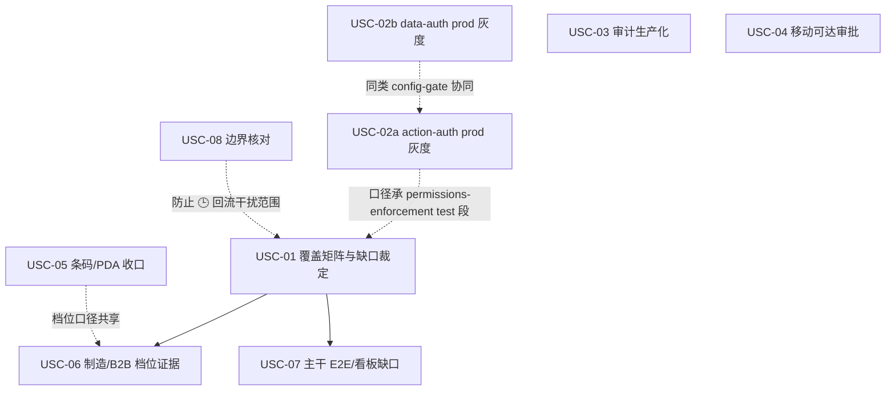

# 用户故事覆盖 Roadmap（设计 / 实现 / 测试收口）

> 最后更新：2026-09-22
> 来源：`docs/requirements/2026-09-22-erp-user-stories.md`（约 50 条 US × 10 Personas × 8+ Epic）、`docs/analysis/2026-09-22-erp-user-story-gap-analysis.md`（✅/🔶/🕒/❌ + Must/Should/Could/Won't 裁决）
> 产品范围权威：`docs/requirements/product-scope.md`（18 域 + notify；档位组装 `:46`；延迟段 `:72-75`）
> 规范：`docs/backlog/00-roadmap-authoring-guide.md`
> Skill: none（roadmap 起草本身无匹配技能；各工作项实施时按第 2 节 Skill 列从 `.opencode/skills/<name>/SKILL.md` 加载）

## 1. 目的

将用户故事差距分析的裁决转为可执行的工作项队列，使**每条「需要满足」的用户故事**最终具备三维覆盖证据：

1. **设计** — 有 owner doc 或 product-scope / feature-inventory 登记；
2. **实现** — 有落地能力（模型 / BizModel / 页面 / 配置门控），config-gated 项如实标注默认态；
3. **测试** — 有与风险匹配的验证层（JUnit / E2E / 看板与报表回归 / 负向隔离断言），不以「文档提到」冒充运行时全绿。

本 roadmap **不是**差距分析的重写，也**不是**新业务域立项清单。硬约束：

- 不新增业务域；不把联网调研词汇直接变成新计划（gap analysis §四）；
- 「需满足但收口」项对齐既有路线：**R2.7**（API 契约一致性收口，`audit-remediation-roadmap.md:183`，enforcement 翻转=config-gated successor）、**MA6**（安全与权限层审计，同文件 `:115`，全 done）、**看板运行时视觉/浏览器回归**与**各域细化端到端验证**（`AGENTS.md` 当前阶段、`product-scope.md:69-71`）；
- 档位能力（条码 PDA、制造链、B2B）按 `product-scope.md:46` 组装档位标 Must，禁止全量冒充 Must；
- 🕒/Won't 项维持延迟/出界，不因本 roadmap 升入近期范围。

工作项按既定顺序由 AI 取用；AI 不重新仲裁优先级、不发明工作项。结构变更（增删/重排）标记供人工审查。每个工作项实施前须形成 `docs/plans/` 独立计划并通过独立草案审查（`todo → ready`）；独立结束审计通过后方可 `ready → done`。

## 2. Work Item Status

状态计数（唯一动态状态块；里程碑无状态）：

| 状态 | 数量 |
| --- | --- |
| todo | 8 |
| ready | 0 |
| done | 1 |

### M1 覆盖基线与缺口裁定

| # | Work Item | Status | Owner Doc | Deps | Skill |
| --- | --- | --- | --- | --- | --- |
| USC-01 | 全量 US 三维覆盖矩阵与隐性缺口裁定 | done（2026-10-01，plan `2026-10-01-0214-1-usc01-us-coverage-matrix` 落地 + 独立草案审查 2 轮收敛 accept + 独立结束审计 ACCEPT：矩阵 `docs/analysis/2026-10-01-0300-1-us-coverage-matrix.md` 53 US 四列证据全实仓核验（判定 ✅40/🔶12/🕒1/❌0，ID 集合 comm 与需求文档精确一致）；分流表承接编号×9（USC-02a/02b/03×2/04/05/06×2/07）+ 归属冲突升级×2（US-PO-01 RFQ→报价→PO 链断 Must⚠、US-SO-06 同屏视图缺 Should，见审查记录段升级登记行）+ 仅登记×36；差异清单 10 项含 gap analysis US-PO-01 ✅→🔶⚠ 降档；结束审计独立复跑 9 锚点全命中） | `docs/analysis/2026-09-22-erp-user-story-gap-analysis.md` | — | none |

### M2 横切生产化收口（需满足 · 非新功能）

| # | Work Item | Status | Owner Doc | Deps | Skill |
| --- | --- | --- | --- | --- | --- |
| USC-02a | action-auth 生产灰度 + 菜单/动作完整性收口（US-PL-01） | todo | `docs/design/roles-and-permissions.md` | —（prod 翻转唯一载体；test 环境验收口径承 `permissions-enforcement-roadmap.md`） | nop-backend-dev + nop-testing |
| USC-02b | data-auth 行过滤生产灰度与负向隔离证明（US-PL-02） | todo | `docs/design/roles-and-permissions.md` | —（与 USC-02a 可并行，各自独立 plan） | nop-backend-dev + nop-testing |
| USC-03 | 审计日志生产化与主数据变更可追溯（US-FN-06 / US-MD-04） | todo | `docs/design/roles-and-permissions.md` | — | nop-backend-dev + nop-testing |
| USC-04 | 移动可达 Web 审批与待办体验（US-PL-03） | todo | `docs/architecture/approval-framework.md`、`docs/architecture/notification-strategy.md` | — | nop-frontend-dev + nop-testing |

### M3 档位能力设计 / 实现 / 测试（组装档位 Must）

| # | Work Item | Status | Owner Doc | Deps | Skill |
| --- | --- | --- | --- | --- | --- |
| USC-05 | 条码 / PDA 作业面运行时收口（US-IV-05、US-PL-08） | todo | `docs/design/inventory/barcode-integration.md` | — | nop-frontend-dev + nop-testing |
| USC-06 | 制造链与 B2B 档位验收证据补齐（US-MF-*、US-B2-01） | todo | 各域 owner doc（manufacturing / b2b） | USC-01 | nop-testing |

### M4 核心主干验证深化（✅ 已满足 · 补测试深度）

| # | Work Item | Status | Owner Doc | Deps | Skill |
| --- | --- | --- | --- | --- | --- |
| USC-07 | 核心主干故事 E2E / 看板回归缺口补齐（P2P·O2C·库存·业财·制造） | todo | `docs/design/feature-inventory.md`、`docs/testing/e2e-runbook.md` | USC-01 | nop-testing |

### M5 边界固化（不需要满足项 · 防范围回流）

| # | Work Item | Status | Owner Doc | Deps | Skill |
| --- | --- | --- | --- | --- | --- |
| USC-08 | 延迟/出界故事边界核对与 Non-Goal 登记一致性 | todo | `docs/requirements/product-scope.md`、`docs/design/portal/README.md` | — | none |

## 3. 框架 / 平台复用

以下能力已存在，实施工作项时**禁止重建**；收口动作优先是接线、翻转门控、补测试或补页面，而非新机制：

| 能力 | 现状 | 覆盖的故事 | 复用要点 |
| --- | --- | --- | --- |
| action-auth 操作级权限 | 机制 + 种子 + **%test ON**；%dev/%prod 默认 OFF | US-PL-01 | prod 灰度 = config 翻转 + 菜单/动作完整性收口（R2.7 successor），非新权限框架 |
| data-auth 行级过滤 | 规则 + **%test 双开关 ON**；prod OFF；orgId 隔离开关独立默认 false | US-PL-02 | 角色行过滤 prod 化优先；org 隔离随多公司需求（`multi-company.md`） |
| 审计日志 / 高危操作留痕 | 机制在，%test 已开 | US-FN-06、US-MD-04 | 生产化与查询可达性收口；主数据变更历史不默认单独立项 |
| 审批轴 + SoD + 通知派发 | 4 核心域 SoD；notify 子系统；待办语义在 | US-PL-03、US-PO-05 | 移动入口 = 响应式 Web 审批面复用既有待办；**不建原生 App** |
| 业财过账 / 红冲 / 三单匹配 / 预算 | M4/M5 已完成 + 大量凭证行 E2E | US-FN-*、US-PO-03/04 | 保持回归绿；缺口属验证深度非新功能 |
| 库存三层模型 / 批次 / 调拨 / 盘点 | 已实现 + E2E | US-IV-01..04 | 不重建；条码触发层见 USC-05 |
| 条码 / PDA 设计 | owner doc 在册，现场体验未作独立 UX 基线验收 | US-IV-05、US-PL-08 | 补运行时接线 + 页面 + 档位验收，不换设计方向 |
| 看板 / 报表 / 像素回归基建 | nop-report + 24 报表 + visual/value/smoke 分层 | US-PL-04、US-FN-07 | 缺口按 `e2e-runbook.md` 分层补，不平行造套件 |
| Nop Delta（Model→Delta→Java） | 平台标准 | US-PL-05 | 定制走 Delta，不改基线生成物 |
| 模块组装档位 | `customization-capabilities.md` 能力五 | US-MF-*、US-B2-01、US-IV-05 | 纯商贸 / 制造 / 完整 三档分别标 Must/Won't |
| E2E 分层与运行协议 | smoke / value / business-actions / orchestration / visual；**强制 flux** | 全部测试类交付 | `e2e-runbook.md` 为唯一编写规范 |

## 4. 当前基线

依据差距分析（证据口径 = owner doc + feature-inventory + 既有 roadmap/E2E，不以文档提及冒充全绿）：

| 判定 | 代表范围 | 对本 roadmap 的含义 |
| --- | --- | --- |
| ✅ 已基本满足（多数 Must） | US-PO-*、US-SO-*、US-IV-01..04、US-FN-01..07、US-MF-*（制造档）、US-OP-*、US-HR-*、US-CT-01、US-B2-01、US-LG-01、US-PL-04/05 | 不新开域；M4 只补**测试深度与看板/端到端回归**，覆盖证据以 USC-01 矩阵登记为准 |
| 🔶 部分具备（Must/Should 收口） | US-PL-01/02/03/08、US-IV-05、US-FN-06（主表 ✅，prod 默认关故采收口口径，见下注）、US-MD-04（Should·条件触发） | M2 + M3 主体；路径是既有 R2.7 successor / config 翻转 / Web 体验验收，**非新产品方向** |
| 🕒 延迟 / Won't（当前不需满足） | US-PL-06 门户、US-PL-07 中 SSO=平台能力登记 / 多租户=延迟、POS、电商（`nop-app-mall`）、SaaS 多租户、原生 App、税控/银行/物流/电签等外部集成、AI 预测分析 | 仅 USC-08 做边界一致性核对；**不设实现工作项** |
| ❌ 相对「通用完整故事」的显缺 | 用户级个性化配置、审批移动端专用面（独立 App 语义）、门户未立项 | 维持 gap analysis 裁决：不默认进 backlog；若升需求走 `product-scope` 变更 + 单故事 Feature 拆分 |

分级注记（与差距分析对齐，避免悬空引用）：

- **US-FN-06**：主表（gap analysis `:83`）为 ✅/Must/保持；叙述段（`:137`）归入「权限与审计生产化…需要满足」。本 roadmap **采收口口径**（与 config-gate 诚实性一致），权威 = gap analysis 叙述段 + 横切关注点 2；实现工作项 = USC-03。
- **US-MD-04**：Should +「审计日志可查即可，不单独立项除非合规客户点名」（`:39`）。并入 USC-03 时保持 **Should·条件触发**，完成时可以「已满足/不扩展」关闭，不静默升格 Must。
- **US-PL-07**：SSO 走平台能力登记 Could-Should、SaaS 多租户与外部集成维持延迟（`:127`）→ 归 🕒 行，由 USC-08 核对，不设 M2 实现项。

已知必须回答「需不需要」并已在差距分析裁决的收口主题（进入 M2/M3，不重复仲裁）：

1. 权限与行过滤的 **%prod 灰度**（机制在，prod 默认关）；
2. **移动可达**审批（Web 优先，非原生承诺）；
3. **审计生产化**（%test 已开，prod 默认关）；
4. 条码 PDA / 制造链 / B2B 的**档位 Must** 标注与对应验收，而非全量 Must。

## 5. Milestones

| Milestone | 工作项 | Owner Doc（主） | Deps | 组织意图 |
| --- | --- | --- | --- | --- |
| M1 覆盖基线与缺口裁定 | USC-01 | gap analysis | — | 先把「每条 US 是否真有设计+实现+测试」写成可核对矩阵，再允许下游补缺口类工作项按需收窄范围 |
| M2 横切生产化收口 | USC-02a, USC-02b, USC-03, USC-04 | `roles-and-permissions.md`、approval/notification 架构 | —（02a/02b/03/04 相互可并行） | 差距分析判为「需要满足、但是收口」的横切项；prod 翻转由本 roadmap 工作项持有，test 口径承 permissions-enforcement |
| M3 档位能力 | USC-05, USC-06 | barcode-integration、mfg/b2b owner doc | USC-06 ← USC-01 | 商贸/制造档 Must 能力的设计-实现-测试闭环；依赖矩阵裁定是否只需验收补证还是需补实现 |
| M4 核心主干验证深化 | USC-07 | feature-inventory、e2e-runbook | USC-01 | ✅ 故事的端到端与看板回归深度；对接既有看板回归 + 各域细化 E2E + 测试覆盖 roadmap，不新建域 |
| M5 边界固化 | USC-08 | product-scope、portal/README | — | 确保 🕒/Won't 不因本 roadmap 或后续调研回流为「默认 Must」 |

里程碑无状态；**状态列不在本表维护**，进度只读第 2 节 Work Item Status（避免双真相源）。Owner Doc / Deps 与第 2 节表格同源，以第 2 节为准。

## 6. Work Item Details

交付范围保持粗粒度；实现步骤、复选框与关闭标准归各工作项对应的 `docs/plans/` 计划。

### USC-01 — 全量 US 三维覆盖矩阵与隐性缺口裁定

- 逐条 US（约 50 条）登记三列证据：设计（owner doc / scope / inventory 路径）、实现（能力落点或 config 默认态）、测试（既有 JUnit/E2E/spec 名或「无」）；与 gap analysis 的 ✅/🔶/🕒/❌ 对照；与既有 `docs/analysis/2026-06-30-1200-feature-coverage-matrix.md` 或实时仓库冲突时，**以 coverage 矩阵 + 实时仓库为准**（承 gap analysis 诚实性声明）。
- 单列「隐性缺口」：文档与实现具备但缺测试断言、或测试存在但未覆盖该故事验收条件者；按 Must/Should/档位 分流至 USC-02a..07 或标记「无缺口、仅登记」。
- 产出放入 `docs/analysis/`（dated）；**不在本 roadmap 内维护第二套带状态的覆盖表**（避免与 Work Item Status 双真相源）。
- 明确不产出：字段级 schema、新域提案、对 🕒/Won't 的实现计划。

### USC-02a — action-auth 生产灰度 + 菜单/动作完整性收口

- 载体声明：**%prod action-auth 翻转的唯一执行载体是本项**。`permissions-enforcement-roadmap.md` 范围限定测试环境（其 Non-Goals 明确「生产环境 enforcement 翻转不在本 roadmap」，触发 = 该 roadmap 全绿 + 生产灰度计划人工批准）；本项承接其 successor 叙述，**不**把 prod 翻转委托回该 roadmap。
- 前置门控（沿用 permissions successor 条件）：测试环境 enforcement 全绿（该 roadmap 已 done）+ 生产灰度计划经独立 plan 审查；未过门控时本项保持 `todo`/`ready` 不硬翻。
- 设计：核对 `roles-and-permissions.md` 与 R2.7 finding（动作保护、菜单塌缩注记 P1.5a）是否仍为当前意图；仅在不一致时修订 owner doc。
- 实现：`enable-action-auth` 的 %prod 灰度路径 + US-PL-01 高危动作独立权限点与菜单/动作完整性收口；不发明新权限模型。
- 测试：prod/测试双态下无权拒绝负向断言 + 既有 E2E 在灰度开/关回归；验收口径引用 permissions roadmap「测试环境全 E2E 绿 + 负向隔离证明拒绝」的生产对应面。

### USC-02b — data-auth 行过滤生产灰度与负向隔离证明

- 载体声明：同 USC-02a——**%prod data-auth/role-row-filter 翻转由本项持有**；test 环境规则与开关历史以 `permissions-enforcement-roadmap.md` E2 为证据，不重复实现规则引擎。
- 设计：`roles-and-permissions.md` §行级过滤落地状态与 US-PL-02 验收对齐；orgId 隔离开关保持独立、不捆绑默认开启。
- 实现：角色行过滤 %prod 可用配置；多公司 org 隔离不在本项升 Must（随 `multi-company.md` 需求另裁）。
- 测试：行过滤越权不可见负向断言 + 双态回归；与 USC-02a 各自独立 plan，避免单次交付过大（原子工作项）。

### USC-03 — 审计日志生产化与主数据变更可追溯

- 分级：US-FN-06 按收口口径（主表 ✅ / 叙述归 prod 默认关，见 §4 注记）；**US-MD-04 = Should·条件触发**——合规客户点名变更历史 UI 才升独立范围，否则以「软停用/引用约束 + 审计可查已满足」关闭。
- 设计：明确「高危操作留痕可查」的最小生产承诺；主数据**变更历史独立 UI** 默认不单独立项（gap analysis `:39`）。
- 实现：审计相关 config 与 %test→生产可用路径对齐（与 USC-02a/02b 同类 config-gate，机制复用不重写）；红冲回链、操作留痕读路径可达。
- 测试：留痕写入可查询断言 + 红冲回链回归（复用既有 reverse E2E 范式）；避免只测「开了开关」不测「查得到」。

### USC-04 — 移动可达 Web 审批与待办体验

- 设计：在 approval / notification 既有架构上定义「移动可达」= 响应式 Web 待办列表 + 审批/驳回动作在窄屏可用；**不承诺原生 App / 推送 SDK**（Non-Goal 见第 9 节）。
- 实现：待办/我发起的入口与审批表单的移动视口可达性（页面层，flux 优先）；通知派发子系统复用，不新建通道。
- 测试：移动视口下 E2E（待办可见 → 打开 → approve/reject → 状态翻转断言，复用 `verifyState` 范式）；桌面回归不破坏。
- 依赖协同：xwf 浏览器层不可行之 2330-1 裁决仍有效——测试设计不得假设浏览器层可驱动 submit 起点的 xwf 轴，优先 DIRECT useApproval 路径或后端已覆盖段。

### USC-05 — 条码 / PDA 作业面运行时收口

- 设计：以 `barcode-integration.md` §PDA 功能场景（收/上架/拣/发/盘/领料/质检）为范围，不扩展新场景；与 US-PL-08 同一档位裁决。
- 实现：扫码触发的作业入口落到既有库存/采购/制造 BizMutation（触发层接线 + 必要页面）；PDA 专用面按 flux 响应式优先，不引入独立 App 工程。
- 测试：代表场景（收货 / 发货 / 盘点至少各一）浏览器层或 API 层触发断言 + 档位说明（纯财务轻部署可不组装）。
- 档位：**商贸档与制造档 Must**；完整档继承。非仓储客户不阻塞核心发布。

### USC-06 — 制造链与 B2B 档位验收证据补齐

- 触发：仅当 USC-01 矩阵显示 US-MF-* / US-B2-01 存在设计或测试缺口时执行实现类补洞；若矩阵为「已覆盖」，本项降级为**档位验收登记**（在矩阵中勾选档位 Must + 指向既有 E2E，如 `mfg-chain` / ASN 匹配 spec）。
- 设计/实现：缺口存在时才改 owner doc 或补最小实现；已有历史制造与 B2B E2E 的不重做。
- 测试：优先复用 orchestration / business-actions 既有链，按缺口补断言而非新套件。
- 档位：制造链 = 制造档 Must、非制造 Won't；B2B EDI 内部模块 = 完整档/大客户 Should，真实 EDI 网关仍属外部集成延迟段。

### USC-07 — 核心主干故事 E2E / 看板回归缺口补齐

- 触发：USC-01 标出的「✅ 故事但验收条件无运行时断言」清单；无清单则本项只输出「维持既有基线绿」的回归确认记录并结束。
- 载体去重：与 `comprehensive-test-data-and-visual-coverage-roadmap.md`（测试数据 seed + 视觉像素断言扩面）重叠时，**以该 roadmap 工作项为执行载体**，本项只登记 US 验收条件 ↔ 测试映射与完成证据，避免双任务双状态（同横切 5 模式）。
- 设计：一般不改 owner doc；仅当验收条件与实现行为漂移时回写设计。
- 实现：仅修复回归中暴露的缺陷（走既有 bug 流程），不借机加功能。
- 测试：按 `e2e-runbook.md` 分层归位——业务断言→business-actions/orchestration，KPI/报表数值→value，页面渲染→visual/看板套件，下载→download 层；**禁止新 AMIS 用例**，E2E_ENGINE 缺省 flux。
- 对齐：与 AGENTS.md 当前重点「看板运行时视觉/浏览器回归、各域细化端到端验证」同一工作流，不另立平行验证体系。

### USC-08 — 延迟/出界故事边界核对与 Non-Goal 登记一致性

- 设计：核对 gap analysis §3.3 表与 `product-scope.md` 延迟段、`portal/README.md` future 状态、coverage 矩阵 POS 🕒、**US-PL-07 SSO/多租户分界**是否一致；不一致时以 product-scope 为权威并修正分析/索引用词。
- 实现：**无**。本项零生产代码。
- 测试：无；完成标准 = 文档一致性核对记录（可附在分析文档或日志），并确认 backlog/README 无误把 🕒 项登记为近期 P 项。
- 输出：确认「门户触发=协同需求立项（plan-first+人工批准）」「多租户待业务确认」「外部集成维持延迟」三句语义仍成立。

## 7. 依赖图

**表格为权威**（§2 Deps 列）。下图仅示意：**实线 = 依赖**；**虚线 = 对齐/协同关系，不是依赖**，不表示排他先后。

并行说明：USC-02a/02b/03/04/05/08 的 Deps 均为「—」，不依赖 USC-01 即可启动（裁决已来自差距分析）；USC-01 优先完成是为了让 USC-06/07 按真实缺口收窄，避免重复建设。

## 8. 横切关注点

1. **档位化验收**：任何「Must」声明必须带档位（纯商贸 / 制造 / 完整）。US-IV-05、US-PL-08、US-MF-*、US-B2-01 禁止写成无条件全量 Must。
2. **config-gate 诚实性**：%test 已开、%prod 默认关 → 记 🔶 与「已实现未默认」，测试须覆盖开/关两态，禁止只在测试态绿就标 done。
3. **保护区域**：`module-<domain>/model/*.orm.xml` 变更 = ask-first / 双独立子 agent 批准；会计与数据删除路径同 AGENTS.md / autonomy policy。USC-02a..07 预期**以应用层、配置、页面、测试为主**；若计划触 ORM，计划审查必须显式升级自主权档。
4. **验证命令**（与 `project-context.md` 一致）：`mvn clean install -DskipTests`、`mvn test`、`bash docs/audits/nop-compliance-checker.sh`、`npm run validate:flux`、`npx playwright test …`（分层子集见 `e2e-runbook.md` 命令表）；基线对照 `docs/testing/known-good-baselines.md`。完成类工作项在日志中记录验证状态。
5. **与既有 backlog 接线**：
   - **test 环境 enforcement** 的规则、种子、E1–E4 执行与验收口径 → 以 `permissions-enforcement-roadmap.md` 为准（已 done）；本 roadmap 不重开 test 环境工作项。
   - **%prod 翻转（action-auth / data-auth）不在 permissions-enforcement 范围**（其 Non-Goals 显式排除）→ 由 **USC-02a / USC-02b 作为唯一执行载体**；前置门控 = 该 roadmap 全绿（已满足）+ 生产灰度计划人工批准（独立 plan 审查）。
   - **测试数据 seed / 视觉像素断言扩面** → 与 `comprehensive-test-data-and-visual-coverage-roadmap.md` 重叠时以该 roadmap 为载体（USC-07 只做 US 映射登记）。
   - 重叠时**只允许一个 roadmap 携带该工作项状态**，另一侧只记映射与证据，禁止双任务双状态。
6. **测试编排约束**：xwf submit 浏览器层不可行（2330-1）仍然有效；审批类故事测试优先 DIRECT useApproval 或既有后端 JUnit 面。
7. **技能加载**：进入实现类工作项时按第 2 节 Skill 列从 `.opencode/skills/<name>/SKILL.md` 加载并遵循其必读文档与自检；纯文档项（USC-01/08）Skill: none。
8. **状态真相源**：仅本文件 Work Item Status；覆盖矩阵是 USC-01 的**一次性产物**，不复制状态列。活跃工作从 todo/ready 工作项读取，不写回 `project-context.md` 字段。

## 9. Non-Goals

以下**不设**设计/实现/测试工作项；触发条件变化时走 product-scope 变更或独立立项，不从本 roadmap 静默升级：

- **US-PL-06 门户自助**：`portal/README.md` 已标 future、非 18 域基线。触发 = 客户协同需求人工批准立项（plan-first）。
- **POS 零售**：coverage 矩阵 🕒；非 18 域。触发 = 产品明确零售档立项。
- **电商商城**：配套 `nop-app-mall`，不进本仓。
- **SaaS 多租户启用**：product-scope 延迟段，待业务确认；平台多租户标准不等于本仓启用。
- **原生移动 App / 推送 SDK**：无产品承诺；USC-04 只做移动可达 Web。触发 = 独立产品决策。
- **税控 / 银企直连 / 真实承运商 / 真实 EDI 网关 / 电签等外部集成**：product-scope 延迟段；本地 mock 已允许用于测试。
- **AI 预测性分析、GenAI 单据、预测性维护 IoT**：调研有、基线无；不阻塞通用 ERP 定义。
- **用户级个性化配置、审批金额多级矩阵独立域化**：gap analysis §3.4 裁为 Could/细则归配置，不默认进本队列。
- **核销时点动态汇兑损益等 watch-only residual**：维持既有 backlog watch-only，不并入本 roadmap。
- **test 环境权限 enforcement 执行**：已由 `permissions-enforcement-roadmap.md` done 承接，不重开。

## 10. 规则

1. 按第 2 节顺序执行；不跳过 USC-01 去根据「调研印象」直接新建实现项（USC-02a/02b/03/04/05/08 例外：裁决已闭环，可并行，但仍须各自独立 plan）。
2. 每个工作项实施前：独立 plan（`docs/plans/{YYYY-MM-DD-HHmm}-{N}-{slug}.md`）+ 独立草案审查 → `ready`；独立结束审计 → `done`。结束前重审计实时仓库。USC-02a/02b 均为单次 plan 可交付粒度；若执行期发现仍过大 → 标记供人工拆分，AI 不擅自增项。
3. 工作项完成时写回：状态、owner doc 必要同步、`docs/logs/2026/09-22.md` 或对应日志（重大代码变更必须记日志）；全绿则在日志与提交信息记录验证状态。
4. 不重述 owner doc 业务规则；不在本文件添加复选框式关闭标准（归 plan Closure Gates）。
5. 新增/删除/重排工作项或里程碑 → 标记供人工审查，AI 不擅自改队列。
6. 若 USC-01 揭示的缺口与本文件 Milestone 归属冲突，允许人工修订归属后继续；AI 不发明新里程碑。
7. 任何工作项若发现需要改 `product-scope.md` 域范围或把 🕒 升为近期范围 → 停止，升级人工裁决。
8. **todo → ready** 须独立草案审查通过；首轮审查的 Major 修复完成前，任何工作项不得转 `ready`。

## 审查记录

- **2026-09-22 iteration 1（初稿）**：按 `00-roadmap-authoring-guide.md` 十段结构起草；工作项初始全部 `todo`。
- **2026-09-22 iteration 1 独立草案审查**（独立子 agent，只读）：**0 Blocker / 2 Major / 8 Minor**。
  - Major M1：横切 5 曾将 prod 翻转委托给 `permissions-enforcement-roadmap`，但其范围仅 test 环境且 Non-Goals 排除 prod 翻转 → **载体矛盾**。
  - Major M2：USC-02 打包 action+data 等多切片，超过单次交付粒度 → **须拆分**。
  - Minor 已修：§5 补 Owner/Deps 并声明状态只在 §2（m1）；US-PL-07 移入 🕒 消除悬空 🔶（m2）；US-FN-06/US-MD-04 分级注记（m3/m4）；依赖图虚线=对齐非依赖（m5）；USC-01 补 feature-coverage-matrix 冲突权威（m6）；USC-07 接线 comprehensive-test roadmap（m7）；Skill 路径可解析注记（m8）。
- **2026-09-22 iteration 2（修订）**：按审查意见完成 M1/M2 修复（USC-02 → USC-02a + USC-02b；横切 5 改为「prod 唯一载体 = USC-02a/02b + 前置门控」）及 m1–m8。状态计数 8→9，全部保持 `todo`。
- **2026-10-01 USC-01 归属冲突升级登记（plan `2026-10-01-0214-1` Phase 3，roadmap §10 规则 6）**：USC-01 覆盖矩阵（`docs/analysis/2026-10-01-0300-1-us-coverage-matrix.md`）发现 2 项真实缺口无 USC-02a..07 既有承接项，按第三分支升级人工裁决（AI 不发明新工作项、不改队列）：① **US-PO-01「RFQ→报价→PO 转单链实现缺」**（Must⚠——实仓仅请购→订单有实现，RFQ/报价单为孤立 CRUD+审批实体；gap analysis 曾记 ✅ 属文档级证据；建议裁决 (a) 新立寻源链收口工作项或 (b) 验收口径收窄为「请购→订单+PO 状态可见」）；② **US-SO-06「预测/配额/实际同屏对比视图缺」**（Should——实现件齐、组合视图载体缺；建议裁决 (a) CRM 报表增量或 (b) 验收口径收窄为「配额聚合与预测报表各自可达」）。两项在裁决前不阻塞本 roadmap 其余工作项推进（USC-06/07 的分流表范围不含这两项）。
- **后续**：`todo → ready` 仍须针对「将进入实施的工作项对应 plan」再走独立草案审查（本记录的 roadmap 级审查不替代 per-plan 审查）。
