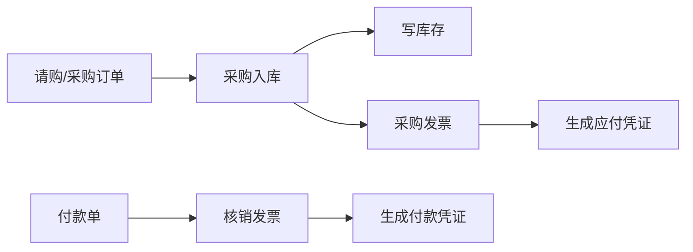
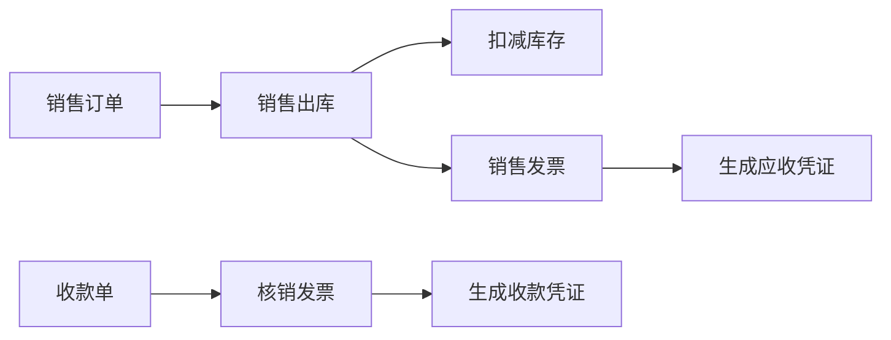
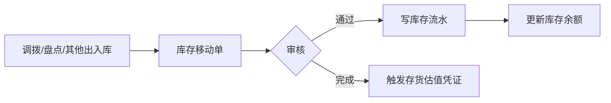
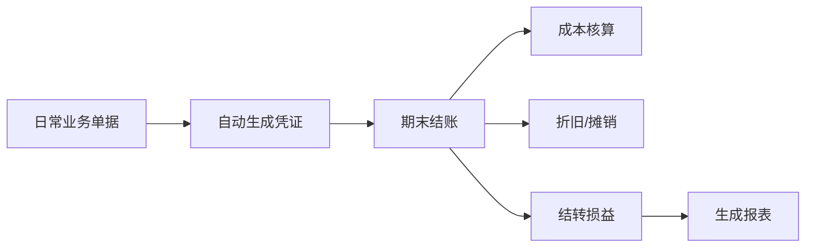
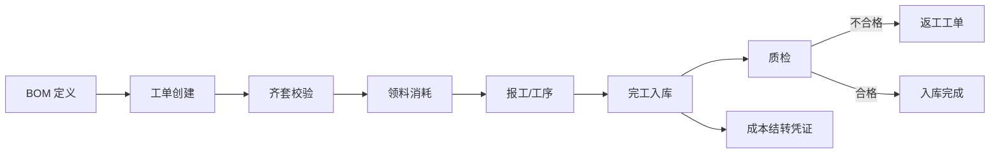
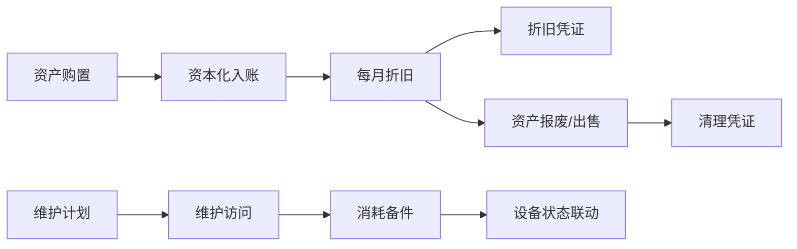

# 全局业务流程总览

## 目的

本文件是项目的全局流程总览，分三层：

- L1 宏观流程：用户与系统如何在各业务域之间推进业务
- L2 状态机映射：核心业务对象的状态机与所属域/文档的对应
- L3 跨域协作规则：业财打通、库存余量、快照等跨域通用规则

每域的详细业务规则归该域目录下的设计文档，本文件只给全局视图与跨域映射。

## 边界

- 本文件拥有全局流程编排、状态/域/文档映射、跨域通用规则。
- 每个状态的完整业务规则归所属域的设计文档。
- 持久化状态码字典归 `model/app-erp-<domain>.orm.xml`。
- 技术实现（调度、集成协议、事务传播）归 `docs/architecture/`。

## 域与文档映射

不同域文档结构因域而异（见 `README.md`），状态机重的域才有独立 `state-machine.md`：

### 核心业务域

| 域 | 概览文档 | 详细文档 |
|----|----------|----------|
| 主数据 | `master-data/README.md` | （无状态机文档，启停二态内嵌 README） |
| 库存 | `inventory/README.md` | `inventory/state-machine.md`、`inventory/cross-domain.md` |
| 采购 | `purchase/README.md` | `purchase/state-machine.md`、`purchase/three-way-match.md` |
| 销售 | `sales/README.md` | `sales/state-machine.md` |
| 财务 | `finance/README.md` | `finance/state-machine.md`、`finance/posting.md`（业财打通） |

### 扩展业务域

| 域 | 概览文档 | 详细文档 |
|----|----------|----------|
| 固定资产 | `assets/README.md` | `assets/state-machine.md`（资产生命周期+折旧） |
| 项目管理 | `projects/README.md` | `projects/state-machine.md`（项目+任务） |
| 制造 | `manufacturing/README.md` | `manufacturing/state-machine.md`（工单+作业卡）、`manufacturing/bom-and-routing.md` |
| 质量管理 | `quality/README.md` | `quality/state-machine.md`（质检+NCR） |
| 设备维护 | `maintenance/README.md` | `maintenance/state-machine.md`（维护访问+请求） |

---

## L1 — 宏观流程

### 采购到付款流程（Procure-to-Pay）



业务叙述：

1. 采购员创建采购订单（采购域），与供应商确认采购意向。
2. 收货时创建采购入库单（采购域），审核通过后调用库存域生成入库移动单，库存余额增加。
3. 收到供应商发票后创建采购发票（采购域），发票行回链入库行（三单匹配），审核通过后财务域生成应付凭证。
4. 创建付款单（采购域），核销一张或多张采购发票，审核通过后财务域生成付款凭证，应付减少。

### 销售到收款流程（Order-to-Cash）



业务叙述：

1. 销售员创建销售订单（销售域），与客户确认销售意向。
2. 发货时创建销售出库单（销售域），审核通过后调用库存域生成出库移动单，库存余额减少。
3. 开票时创建销售发票（销售域），发票行回链出库行，审核通过后财务域生成应收凭证。
4. 创建收款单（销售域），核销一张或多张销售发票，审核通过后财务域生成收款凭证，应收减少。

### 库存内部流程



### 财务期末流程



### 生产流程（Make-to-Order/Stock）



业务叙述：

1. 定义 BOM（物料清单+工艺路线）→ 制造域。
2. 创建工单（引用 BOM）→ 齐套校验（所需子件库存）→ 领料消耗（出库移动单）。
3. 报工（作业卡记录工时）→ 完工入库（入库移动单）。
4. 完工触发质检（若 BOM 配置）→ 合格则入库完成，不合格则返工。
5. 完工同时触发成本结转凭证（财务域）。

### 资产与维护流程



业务叙述：

1. 资产购置 → 资本化入账（资产卡片+入账凭证）→ 每月折旧（折旧凭证）。
2. 维护计划周期触发维护访问 → 消耗备件（出库）→ 设备状态联动。
3. 资产报废/出售 → 清理凭证（结转原值/累计折旧/清理损益）。

---

## L2 — 状态机映射

每域单据普遍采用三轴状态分离（业务状态 / 审核状态 / 收付款状态）。详细状态值与迁移规则归各域 `state-machine.md`。

### 状态-域-文档-页面映射

| 状态轴 | 所属域 | 详细文档 | 相关页面 |
|--------|--------|----------|----------|
| 单据状态（docStatus） | 采购/销售/财务 | 各域 `state-machine.md` | 单据列表、单据详情 |
| 审核状态（approveStatus） | 采购/销售/库存/财务/资产/项目/制造/质量/维护 | 各域 `state-machine.md` | 待审核任务、审核页 |
| 付款状态（paidStatus） | 采购 | `purchase/state-machine.md` | 付款进度查看 |
| 收款状态（receivedStatus） | 销售 | `sales/state-machine.md` | 收款进度查看 |
| 库存移动状态（moveStatus） | 库存 | `inventory/state-machine.md` | 库存移动单列表 |
| 凭证状态（voucherStatus） | 财务 | `finance/state-machine.md` | 凭证列表、过账页 |
| 会计期间状态 | 财务 | `finance/state-machine.md` | 期间管理、结账 |
| 资产状态（assetStatus） | 资产 | `assets/state-machine.md` | 资产卡片、折旧 |
| 项目/任务状态 | 项目 | `projects/state-machine.md` | 项目看板、任务列表 |
| 工单/作业卡状态 | 制造 | `manufacturing/state-machine.md` | 工单管理、报工 |
| 质检/NCR 状态 | 质量 | `quality/state-machine.md` | 质检任务、NCR 追踪 |
| 维护访问/请求状态 | 维护 | `maintenance/state-machine.md` | 维护排程、报修 |

### 单据通用状态机（采购/销售单据）

```
草稿 (DRAFT)
  ├─ 提交 → 未提交 → 已提交 → 已审核
  │                              ├─ 触发后续业务（写库存/生成凭证）
  │                              └─ 驳回 → 已驳回 → 回到未提交
  └─ 作废 → 已作废
```

详细迁移规则（前置条件、触发人、结果）见各域 `state-machine.md`。

---

## L3 — 跨域通用规则

### 业财打通（过账触发）

**主 owner**：`finance/posting.md`。本节给全局视图。

- **统一钩子**：所有业务单据（采购入库/采购发票/付款/销售出库/销售发票/收款/库存移动）在审核通过时触发财务域凭证生成。
- **业务类型映射**：每种业务单据对应一个 `businessType`，财务域按类型选择凭证模板：

| 业务单据 | businessType | 凭证方向 |
|----------|--------------|----------|
| 采购入库 | PURCHASE_INPUT | 存货增加、暂估应付 |
| 销售出库 | SALES_OUTPUT | 存货减少、结转成本 |
| 采购发票 | AP_INVOICE | 确认应付、进项税 |
| 销售发票 | AR_INVOICE | 确认应收、收入、销项税 |
| 付款 | PAYMENT | 应付减少、资金减少 |
| 收款 | RECEIPT | 应收减少、资金增加 |
| 资产资本化 | ASSET_CAPITALIZATION | 借固定资产/贷在建工程或存货 |
| 资产折旧 | DEPRECIATION | 借折旧费用/贷累计折旧 |
| 资产处置 | ASSET_DISPOSAL | 结转原值/累计折旧/清理损益 |
| 工单完工 | PRODUCTION_COMPLETED | 借产成品/贷原材料+在制品 |
| 工时成本 | TIMESHEET_COST | 借项目成本/贷应付职工薪酬 |

- **过账时机**：业务单据审核通过（主事务落单据 + `posted=false`），财务域异步过账（post-commit 事件），失败可重试不阻塞主单据。
- **冲销**：业务单据作废/反审核时，财务域按业财回链表反查并生成红字冲销凭证。
- **业财回链**：凭证与业务单据通过回链表（`source_bill_type` + `source_head_code`）双向关联，保证生命周期一致。

详细凭证模板、科目映射、过账引擎实现见 `finance/posting.md`。

### 库存余量校验

- **出库前校验**：销售出库、生产领料等减少库存的业务，在移动单确认前校验可用量（现有量 − 预留量）是否充足。
- **预留量机制**：已确认未完成的出库移动单占用量计入预留量，可用量 = 现有量 − 预留量。
- **不足处理**：可用量不足时拒绝移动单确认（除非全局配置允许负库存，默认禁止）。
- **快照**：业务单据引用物料/SKU 价格与仓库库存时，在单据提交时固化快照，后续主数据变化不影响已提交单据。

详细规则见 `inventory/cross-domain.md`。

### 快照语义

- **价格快照**：采购/销售单据提交时固化 SKU 价格（含税/不含税/税率），后续 SKU 价格变化不影响已提交单据。
- **库存快照**：库存移动单确认时固化当时的单位成本与库存价值，写入不可变流水。
- **汇率快照**：多币种单据提交时按业务日期匹配汇率并固化，凭证按快照汇率转换本位币。
- **主数据快照**：往来单位开票信息（税号/银行/账号）在发票提交时固化。

### 多币种一致性

- 所有金额字段支持多币种；单据引用币种（外键列）。
- 凭证分录行同时记录源币种金额与本位币金额，按业务日期汇率转换。
- 汇率缺失时凭证过账报错，不静默使用默认值。

### 一致性总则

- 结算与单据提交必须基于当前可售价格和库存可用量，而非沿用过期假设。
- 已提交单据的快照（价格、成本、汇率、开票信息）不可被后续主数据变化篡改。
- 状态迁移必须遵循允许的业务流转，不得静默跳过中间业务含义。
- 作废/冲销必须生成反向凭证或反向单据，不可直接删除影响余额的数据。

## References

| 文档 | 路径 | 说明 |
|------|------|------|
| 主数据域 | `master-data/README.md` | 物料/SKU/往来单位等基础数据 |
| 库存域 | `inventory/README.md` | 库存移动/流水/余额 |
| 采购域 | `purchase/README.md` | 采购到付款流程 |
| 销售域 | `sales/README.md` | 销售到收款流程 |
| 财务域 | `finance/README.md` | 凭证/科目/业财打通 |
| 架构基线 | `docs/architecture/system-baseline.md` | 技术栈与模块结构 |
| 领域归属 | `domain-design-guidelines.md` | 跨域归属规则 |
