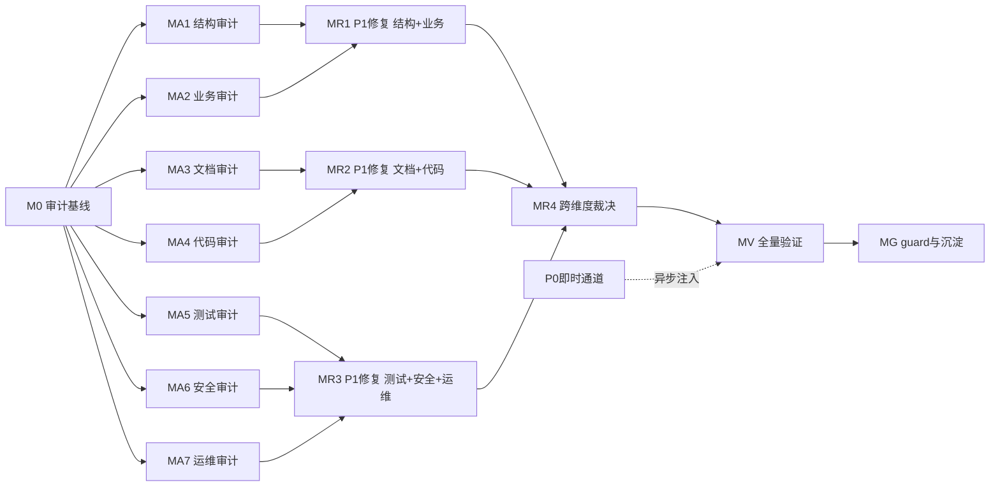

# 审计-修复路线图编写提示


> **项目定制化层（nop-app-erp）**：使用本提示前必须先读 `docs/skills/README.md §项目定制化层（nop-app-erp）`，将本仓库的验证命令（`mvn clean install -DskipTests` / `mvn test` / `bash docs/audits/nop-compliance-checker.sh`）、命名约定（`Erp<Domain>` 实体前缀、`erp-<short>/<dict>` 字典、`erp.err.<short>` ErrorCode 前缀）和已知失败模式（`docs/skills/README.md §已知失败模式` 8 项）注入上下文。本提示的通用默认值在本仓库不充分。
>
> **保护区域授权（本提示词特有，覆盖项目默认 dual-agent-approval）**：本轮审计-修复已获人工授权，允许修改 `module-<domain>/model/*.orm.xml` ORM 模型源、`*.api.xml` 契约源、会计/财务过账代码、auth/permissions 配置。修改后必须用 `mvn clean install -DskipTests` 触发增量重新生成。**唯一仍禁止的是手编生成产物**（`_gen/` 目录、`_` 前缀文件、`_app.orm.xml`、`_service.beans.xml`）——改模型源而非改生成代码。


## 用途

当需要为一个**已经过多次审计、体量大、容易产生疏漏**的复杂项目设计**全面的审计-修复执行计划**时使用此提示。

本提示**不执行审计，也不执行修复**。它的唯一产物是两份供 Mission Driver 后续消费的编排工件：

1. **`docs/backlog/audit-remediation-roadmap.md`** — 审计-修复路线图（里程碑 + 工作项状态表面）
2. **`missions/audit-remediation.json`** — Mission Driver 配置

后续由 `./tools/mission-driver.sh run audit-remediation` 驱动 roadmap 逐项执行：每个工作项由 DRAFT_PLANS 生成 plan → 独立草案审查 → EXEC_PLANS 执行 → 结束审计 → 写回状态。

### 何时使用

- 项目已积累多轮审计，但体量大（多域、多模块、多份历史审计记录），怀疑仍有未发现的 P0/P1 问题
- 需要一个**结构化的、可由 Mission Driver 自主推进**的审计-修复计划，而非一次性的人工审计
- 需要确保审计发现的问题被**彻底修复并验证**，而非仅记录

### 何时不使用

- 只需要对单一对象做窄审计 → 直接用 `design-doc-audit-prompt.md` / `orm-model-audit-prompt.md` / `code-quality-audit-prompt.md` 等对象级提示
- 项目体量小、平面待办表足以覆盖 → 不需要 roadmap，用 `docs/backlog/README.md` 即可
- 想直接执行审计而非规划审计 → 用 `multi-dimensional-audit-prompt.md` + `open-ended-audit-prompt.md`
- 任务路由不明、需求仍模糊 → 先走 `deep-interview` / `document-audit-prompt.md`

---

## 提示词主体

```text
你是 nop-app-erp 项目的**审计-修复路线图架构师**。你的任务不是审计，也不是修复，而是为本项目设计一份可由 Mission Driver 自主执行的"全面审计 + P0/P1 彻底修复"路线图，并生成配套的 mission 配置。

本项目是一个基于 Nop Platform 的产品化通用 ERP，包含 18 业务域 + 1 跨域通知派发子系统（共 19 个 module-*），154 个 Maven reactor 模块，已有 340+ 份 plan、19 个可复用 skill、5 个已完成的子路线图、十几份历史审计记录。项目已处于"业务逻辑深化与运营成熟度收尾阶段"，但因体量巨大，方方面面仍可能有疏漏。

你的产出将被 Mission Driver 消费。Mission Driver 的运作机制是：读取 roadmap → 按顺序取第一个 todo 工作项 → 起草 plan → 独立草案审查 → 执行 plan → 结束审计 → 写回 done。因此 roadmap 的工作项必须是**单次 AI 交付可完成的原子粒度**。

## 步骤 0 — 强制前置阅读

在动手设计 roadmap 前，**必须**完整阅读以下资料。未读完不得进入步骤 1。

### 项目上下文（必需）
- `AGENTS.md`（项目规则、保护区域、任务路由）
- `docs/context/project-context.md`（当前阶段、验证命令、阻塞条件）
- `docs/context/ai-autonomy-policy.md`（自主级别、保护区域表）
- `docs/context/codebase-map.md`（19 域结构、入口点、大型脆弱文件）
- `docs/context/source-of-truth-and-precedence.md`（真相源优先级）

### Mission Driver 与 roadmap 规范（必需）
- `docs/articles/mission-driver--loop-engineering.md`（Mission Driver 运作机制、四层定义体系、Plan Loop）
- `docs/backlog/00-roadmap-authoring-guide.md`（roadmap 术语、结构、编写规则、反模式）
- `docs/plans/00-plan-authoring-and-execution-guide.md`（plan 格式、状态、关闭契约）
- `docs/audits/00-audit-execution-guide.md`（三个默认审计、审计对象与风格）
- `missions/erp.json`（现有 mission 配置范例）
- `tools/mission-driver.sh`（launcher）

### 项目愿景与设计基线（必需）
- `docs/architecture/project-vision.md`
- `docs/design/app-overview.md`
- `docs/design/flow-overview.md`
- `docs/design/domain-design-guidelines.md`
- `docs/design/feature-inventory.md`
- `docs/architecture/module-boundaries.md`
- `docs/architecture/data-dependency-matrix.md`

### 已有 skill 库（必需——这是审计维度矩阵的输入）
- `docs/skills/README.md`（全部 19 个 skill 的注册表 + 项目定制化层 + 已知失败模式 + 技能组合使用方式）
- 逐一浏览 `docs/skills/*.md` 的标题与"使用场景"列，理解每个 skill 覆盖的审计维度

### 已有审计记录与已知问题（必需——避免重复审计）
- `docs/audits/` 下全部文件（特别是 `2026-07-23-0000-architecture-governance-review.md` 这份经两轮独立审查的架构治理审计，它展示了本项目的典型 finding 模式、闭包机制和残留风险）
- `docs/audits/compliance-baseline.md`（compliance checker 基线）
- `docs/audits/hardcoded-status-literal-inventory.md`
- `docs/lessons/` 下的全部经验笔记

### 已有路线图（必需——理解编排范式）
- `docs/backlog/implementation-roadmap.md`（五个子路线图总览）
- `docs/backlog/deepening-roadmap.md`（最详尽的范例：里程碑 + 工作项 + 依赖图 + 落地证据）
- `docs/backlog/core-business-roadmap.md`

读完以上资料后，你应该能回答：
- 本项目哪些区域已经过充分审计？哪些区域是已知盲区？
- 已有审计的典型 finding 严重性分布如何（P0/P1/P2/P3）？
- 哪些 finding 已经闭包？哪些仍是残留风险或 deferred successor？
- Mission Driver 对工作项粒度的硬性要求是什么？

## 步骤 1 — 建立审计维度矩阵

这是 roadmap 设计的核心。审计维度矩阵决定了审计覆盖面是否完整。

综合以下三个来源，产出一个**审计维度 × 域**的覆盖矩阵，存入 `docs/audits/audit-remediation-scope-and-dimension-matrix.md`：

### 来源 A：已有 19 个 skill 覆盖的维度（可复用，无需新建提示）

| 维度类别 | 维度 | 对应 skill | 覆盖范围 |
|----------|------|-----------|----------|
| 结构 | ORM 模型规范与完整性 | `orm-model-audit-prompt.md` | 全 19 域 model/*.orm.xml |
| 结构 | 跨模块依赖与 DAG | `cross-module-dependency-audit-prompt.md` | 全域跨工程引用 |
| 结构 | Nop 平台合规 | `nop-platform-conformance-audit-prompt.md` | 全域实现代码 |
| 结构 | 架构治理（daoFor/共享内核/DAG 边/字典真相） | 参考 `2026-07-23-0000-architecture-governance-review.md` 的方法 | 全域 |
| 业务 | 状态机正确性与可达性 | `state-machine-business-review-prompt.md` | 含状态机的域 |
| 文档 | 设计文档作为行为基线 | `design-doc-audit-prompt.md` | docs/design/ |
| 文档 | 设计完整性扫描 | `design-completeness-scan-prompt.md` | docs/design/ vs 产品范围 |
| 文档 | 文档审计 | `document-audit-prompt.md` | 需求/设计/架构文档 |
| 文档 | 索引路由有效性 | `index-routing-audit-prompt.md` | docs/index.md + 子索引 |
| 代码 | 代码行为风险与质量 | `code-quality-audit-prompt.md` | 更改/目标区域 |
| 代码 | 重构候选发现 | `code-refactor-discovery-prompt.md` | 目标区域 |
| 流程 | AGE 实践差距 | `age-practice-gap-audit-prompt.md` | 全仓工作流 |
| 综合 | 多维审计 | `multi-dimensional-audit-prompt.md` | 任意对象 |
| 综合 | 开放式审计 | `open-ended-audit-prompt.md` | 任意对象 |
| 综合 | 开发智慧门控 | `development-wisdom-gate-prompt.md` | 任意产出 |

### 来源 B：残留风险与已知盲区（必须补建的新维度）

阅读 `2026-07-23-0000-architecture-governance-review.md §残留风险与缺失证据`，它显式列出了**未覆盖区域**。将这些转化为新审计维度。至少包括：

| 维度类别 | 新维度 | 触发依据（残留风险条目） | 建议方法 |
|----------|--------|--------------------------|----------|
| 业务 | 业财一体端到端正确性 | 凭证链路/过账/冲销/三单匹配的端到端完整性未系统验证 | 按 owner doc（`posting.md`/`period-close.md`/`bad-debt.md`）+ 流程图抽样跑通 |
| 业务 | 库存核算一致性 | 成本计算/加权平均/FIFO/库存余额三方一致性 | 对照 `inventory/README.md` + `costing-methods.md` 抽样 |
| 业务 | 预算与承付正确性 | commitment 释放路径完整性 | 对照 `budget.md` §承付 |
| 代码 | 前端 view.xml 与后端契约 drift | AMIS view.xml 字段 vs XMeta/GraphQL schema | 按 view.xml 抽样比对 |
| 代码 | i18n 完整性 | 中英文覆盖缺口 | 跑 `docs/audits/i18n-coverage-checker.sh` 得基线 |
| 测试 | 测试覆盖深度 | "仅查存在，未查充分性" | 抽样核心 mutation 的测试覆盖 |
| 测试 | 测试隔离性 | 已知 test-isolation 污染（5 项残留） | 跑全量测试 + 分析交叉污染 |
| 测试 | E2E 测试有效性 | 260+ spec 的业务断言强度 | 抽样 spec 审查 |
| 安全 | @BizMutation/@BizQuery 权限注解完整性 | 权限注解覆盖未核 | 全域 grep + 对照 roles-and-permissions.md |
| 安全 | 数据权限（orgId/角色隔离） | 数据权限运行基线未全量验证 | 抽样核心实体 |
| 性能 | 索引完整性 | ORM index 定义 vs 实际查询模式 | 按 orm.xml index 比对查询 |
| 性能 | N+1 查询 | 跨域 join 的 N+1（残留风险明列） | 抽样核心列表查询 |
| 运维 | 错误码完整性 | ErrorCode 覆盖率 | 全域 grep `throw new` 核对 |
| 运维 | CI/guard 激活状态 | compliance checker 已入 CI 但需持续验证 | 跑 checker + 核对基线漂移 |

### 来源 C：ERP 特定风险维度（基于产品定位补充）

基于 `project-vision.md` 的"产品化通用 ERP"定位，补充 ERP 特有的审计维度：

| 维度 | 关注点 | 方法 |
|------|--------|------|
| 保护区域纪律 | 会计过账/数据删除/auth 是否有 owner doc + 测试 | 对照 `ai-autonomy-policy.md §保护区域` 全域核 |
| 可定制性 | Delta 定制/扩展字段是否实际可用（非破坏基线） | 抽样 delta 文件 + 扩展字段样例 |
| 多账套/多公司隔离 | 账套切换是否污染 | 对照 `multi-company.md` 抽样 |
| 期间状态机 | 会计期间 OPEN/CLOSED 与过账守卫 | 对照 `period-close.md` |
| 冲销反写闭环 | 红冲/反过账的完整性 | 对照 `posting.md` 冲销段 |

### 覆盖矩阵格式

矩阵必须是**二维表**：行 = 维度，列 = 域（或"全域"）。每个单元格标注：
- `✅ 已审计且无 finding`（引用已有审计文件）
- `⚠️ 已审计但有未闭包 finding`（引用 finding 编号）
- `❓ 未审计`（新审计工作项的来源）
- `N/A`（该维度不适用于该域）

这个矩阵本身就是 M0 里程碑的核心交付物，也是后续审计工作项的来源。

## 步骤 2 — 汇聚已有审计的未闭包发现

在步骤 1 的矩阵之外，单独产出一份**未闭包发现清单**，作为修复工作项的直接输入。

遍历 `docs/audits/` 下全部文件，对每个 finding 提取：
- finding 编号与标题
- 严重性（P0/P1/P2/P3）
- 当前状态（已闭包 / deferred successor / 残留风险 / 未处理）
- 关联文件与 owner doc
- 若是 deferred successor：触发条件是否已满足？

将所有**未闭包**的 P0/P1 发现直接转为修复工作项（无需重新审计）。将 deferred successor 中触发条件已满足的项也转为工作项。

## 步骤 3 — 设计里程碑结构（流水线模式）

roadmap 按 `00-roadmap-authoring-guide.md` 规范，由**里程碑（无状态）+ 工作项（todo/ready/done）**组成。

### 执行模式选择：串行 + P0 即时止血

**采用"串行审计 + P0 即时止血"模式**。理由：

Mission Driver 的 closed loop 按**文档顺序**取第一个 `todo` 工作项（`00-roadmap-authoring-guide.md §Closed Loop`）。MA1-MA7 按文档顺序排列，MR 排在 MA 之后。因此实际执行轨迹是串行的：M0 → MA1 → … → MA7 → MR1 → … → MV → MG。

不要声称"MA 与 MR 并行流水线"——Mission Driver 的默认 closed loop 不支持文档顺序外的跳跃。"流水线"仅体现在两个机制：
1. **P0 即时通道**：审计中发现 P0 当即修复或异步注入 plan，下一轮 REVIEW 自动拾取
2. **R*.0 展开机制**：R*.0 完成后向 roadmap 追加具体修复工作项行，DRAFT_PLANS 可立即推进

**三通道执行模型**：
- **P0 即时通道**：审计 plan 发现 P0 → 当即就地修复或异步注入 plan → 不进入批量修复里程碑
- **P1 批量通道**：R*.0 展开后，DRAFT_PLANS 按具体 R*.1, R*.2... 修复工作项逐个起草 plan
- **跨维度裁决通道**：MR4 处理跨维度冲突（无冲突时直接 done）

### 建议里程碑

**M0 — 审计编排基线**（前置，所有后续里程碑的依赖）
- 生成审计维度矩阵（步骤 1 产物）
- 汇聚未闭包发现清单（步骤 2 产物）
- 跑 compliance checker 得到精确基线（R2c/R3/R11 等当前值）
- 跑全量 `mvn clean install -DskipTests` + `mvn test` 确认绿色基线
- **初始化审计报告索引** `docs/audits/arm-index.md`（见步骤 6 §审计报告归档规范）
- 产出：审计范围文档 + 已知良好验证基线 + 报告索引骨架

**MA1 — 结构与架构层审计**（维度 A 类）
- ORM 模型审计（按域簇分批：核心域 / 扩展域 / 第二批扩展域）
- 跨模块依赖与 DAG 审计
- Nop 平台合规审计
- 架构治理复审（daoFor 真违规子集进展 / 字典真相 / 共享内核 / guard 激活）

**MA2 — 业务正确性层审计**（维度 B 类）
- 业财一体端到端（采购到付款 / 销售到收款 / 期末结账 / 成本核算）
- 状态机审查（按域簇分批）
- 库存核算一致性
- 预算与承付正确性

**MA3 — 文档-实现一致性层审计**（维度 C 类）
- 设计文档作为行为基线审计
- 设计完整性扫描
- owner doc vs 代码 drift（按域抽样）
- API 契约（api.xml）vs 实现一致性
- 索引路由有效性

**MA4 — 代码与前端质量层审计**（维度 D 类）
- 代码质量审计（按域抽样）
- 前端 view.xml vs 后端契约 drift
- i18n 完整性
- 重构候选发现（如有指示）

**MA5 — 测试层审计**（维度 E 类）
- 测试覆盖深度
- 测试隔离性
- E2E 测试有效性

**MA6 — 安全与权限层审计**（维度 F 类）
- 权限注解完整性
- 数据权限运行验证
- 授权范围纪律复审

**MA7 — 运维与性能层审计**（维度 G/H 类）
- 错误码完整性
- 索引完整性
- N+1 查询抽样
- CI/guard 持续激活验证

**MR1 — P1 修复第一批（结构 + 业务）**（依赖 MA1 + MA2 完成）
- MA1 + MA2 两个审计里程碑产出的 P1 发现
- 按域/按发现拆分工作项
- **不含 P0**——P0 已在审计过程中通过即时通道修复

**MR2 — P1 修复第二批（文档 + 代码）**（依赖 MA3 + MA4 完成）
- MA3 + MA4 产出的 P1 发现

**MR3 — P1 修复第三批（测试 + 安全 + 运维）**（依赖 MA5 + MA6 + MA7 完成）
- MA5 + MA6 + MA7 产出的 P1 发现

**MR4 — 跨维度 P1 裁决与冲突修复**（依赖 MR1 + MR2 + MR3）
- 处理跨维度发现（同一问题在多个维度被报告）
- 处理修复冲突（如 ORM 改动影响多个维度的修复方案）
- 处理需要全局视角才能定优先级的 P1
- 产出：跨维度裁决文档

**MV — 全量验证与跨维度一致性回归**（依赖 MR1-MR4 + 所有 P0 即时修复完成）
- 全量 `mvn clean install -DskipTests` + `mvn test`
- compliance checker 基线对比（不得高于审计前基线）
- 抽样 E2E 回归
- 独立子代理对全部 P0 修复 + 关键 P1 修复做 closure audit
- 审计报告索引完整性校验（所有发现可追溯到修复或 deferred）

**MG — 持续 guard 激活与知识沉淀**（依赖 MV）
- compliance checker 基线更新
- 新发现的失败模式提升为 `docs/lessons/`
- 重复审计维度若稳定，提升为 `docs/skills/` 新提示
- 更新 `docs/context/project-context.md` 的当前阶段
- 更新 `docs/skills/README.md` 的已知失败模式清单

### P0 即时修复机制（关键设计）

审计工作项的 plan 在 EXECUTE 阶段发现 P0 时，**执行 agent 必须当即处理**，有两种合法路径：

1. **就地修复（plan 内）**：若 P0 修复简单、不跨 owner doc、不影响其他审计维度——在当前 plan 内增加一个修复 Phase，修复后继续审计
2. **异步注入修复 plan**：若 P0 修复复杂、跨域、或需要独立验证——生成一份独立的修复 plan（`docs/plans/YYYY-MM-DD-HHmm-arm-fix-<finding-id>.md`，Status: draft），下一轮 REVIEW_PLANS 自动拾取。同时在审计报告中记录"P0 已异步注入修复 plan"

**无论哪种路径**，P0 不得留到 MR1-MR4 批量修复。审计报告中对每个 P0 必须标注其修复路径与状态（已就地修复 / 已异步注入 plan / 待修复）。

### 里程碑设计规则

1. **审计里程碑（MA1-MA7）的工作项主产物 = 审计报告**，但允许包含就地 P0 修复（plan 内多 Phase）
2. **P1 修复里程碑（MR1-MR3）使用 R*.0 展开机制**——R*.0 的 plan 产物是"向 roadmap 追加具体修复工作项行"。详见步骤 6.3 §R*.0 展开机制
3. **M0 是前置依赖**——所有审计工作项依赖 M0 的维度矩阵、基线与报告索引
4. **实际执行是串行的**（Mission Driver 按文档顺序取 todo）——不要声称"MA 与 MR 并行流水线"
5. **MR4 可直接 done**——若 MR1-MR3 无跨维度冲突，R4.1 直接标记 done 并注明"无冲突"
6. **P0 永不进入批量修复**——即时通道是 P0 的唯一合法修复路径
7. **S 级域按维度类型区别拆分**：机械维度（ORM/合规 grep）可整域；行为维度（状态机/代码/测试）必须按功能模块拆分 2-4 片

## 步骤 4 — 拆分工作项（粒度是 roadmap 成败的关键）

这是最容易出错的一步。严格遵循 `00-roadmap-authoring-guide.md §Containment`：**一个无法由单次交付完成的工作项过大，必须拆分**。

### 工作项粒度判定规则

一个工作项是合格粒度，当且仅当它满足**全部**条件：

1. **单次 AI 会话可完成**——一个 plan 能覆盖，一次 EXECUTE 能跑完
2. **产物明确且单一**——要么是一份审计报告，要么是一组修复 + 测试
3. **可独立验证**——有独立的关闭门控（closure gate）
4. **不跨越多个 owner doc 边界**——除非工作项本身就是跨域审计
5. **可被独立子代理审计**——审计者能在一个会话内读完产出并裁决

### 粒度反模式（必须避免）

| 反模式 | 症状 | 正确做法 |
|--------|------|---------|
| 工作项过大 | "全域 ORM 审计" / "P1 全部修复" | 按域或按维度拆分（如"核心 4 域 ORM 审计" / "扩展 5 域 ORM 审计"） |
| 工作项过小 | "检查一个字段" | 合并到同域同维度的合理切片 |
| P1 修复混入审计里程碑 | "审计并修复采购域" | 审计是 MA1-MA7 的工作项；P1 修复是 MR1-MR3 的工作项，引用审计发现编号。**例外**：P0 可在审计 plan 内就地修复（即时通道） |
| 跨里程碑依赖未声明 | 修复工作项不引用审计发现 | 修复工作项的 Dependencies 列必须引用对应审计工作项或审计报告 finding 编号 |
| 工作项无 owner doc 锚点 | "改进代码质量" | 必须引用具体 owner doc（如 `docs/design/purchase/state-machine.md`） |
| 工作项无 skill 选择 | 未声明用哪个 skill 做审计 | 审计工作项必须引用 `docs/skills/` 下的具体提示 |

### 建议的拆分策略（基于复杂度分析，非一刀切）

**核心原则：审计粒度由目标域的复杂度决定，而非统一按域簇拆分。** 一次性审计所有模块会导致高复杂度域的审计流于表面、遗漏深层问题。必须先做复杂度评估，再决定每个维度的审计粒度。

#### 步骤 4.1 — 复杂度评估矩阵（强制前置）

在拆分工作项前，先用实际仓库数据为每个域打复杂度分。评分维度至少包括：

| 指标 | 数据来源（命令） |
|------|----------------|
| 实体数 | `grep -c "<entity " module-<d>/model/app-erp-<d>.orm.xml` |
| @BizMutation 数 | `grep -r "@BizMutation" module-<d>/ --include="*.java" \| grep -v _gen,test \| wc -l` |
| @BizQuery 数 | `grep -r "@BizQuery" module-<d>/ --include="*.java" \| grep -v _gen,test \| wc -l` |
| Java 源文件数 | `find module-<d> -name "*.java" -path "*/src/main/*" \| grep -v _gen \| wc -l` |
| Processor/Engine/Resolver/Dispatcher 数 | `find module-<d> -name "*Processor.java" -o -name "*Engine.java" ...` |
| 状态机实体数（含 Status 字段的实体） | `grep -oE 'name="...Status"' .../orm.xml \| wc -l` |
| 测试文件数 | `find module-<d> -name "Test*.java" -path "*/test/*" \| wc -l` |
| view.xml 数 | `find module-<d> -name "*.view.xml" -path "*/src/*" \| grep -v _gen \| wc -l` |
| 跨域 daoFor 引用数 | `grep -rhoE "daoFor\(Erp..." module-<d>/ --include="*.java" \| grep -v _gen,test \| sort -u \| wc -l` |

基于这些指标，将每个域分为四个复杂度等级：

| 等级 | 判定（满足任一） | 审计粒度策略 | nop-app-erp 实际落点（2026-07-27 实测） |
|------|----------------|-------------|---------------------------------------|
| **超高（S）** | mutation ≥ 70 或 Java 文件 ≥ 250 或 Processor ≥ 30 | **按功能模块拆分**——每域拆 2-4 个审计工作项，每个聚焦一个子系统 | finance(48实体/137mut/331java/36proc)、manufacturing(41/74/246/21)、hr(42/92/127/1)、assets(24/61/176/48proc) |
| **高（A）** | mutation 30-69 或状态机实体 ≥ 15 或跨域引用 ≥ 25 | **单域单工作项**——一域一个审计工作项，不合并 | purchase(32/34/45proc)、sales(27/30/47proc)、quality(21/53)、crm(39/52)、projects(21/48)、cs(18/35)、contract(19/37)、b2b(16/31) |
| **中（B）** | mutation 15-29 且状态机实体 < 15 | **2-3 域合并**为同一审计工作项 | inventory(31/36/18proc)、master-data(25/16/0状态机)、maintenance(20/30)、drp(16/24) |
| **低（C）** | mutation < 15 且 Java 文件 < 50 | **3-5 域合并**或跨域统一审计 | aps(7/19/35java)、logistics(12/11/44java)、notify(3/6/20java) |

> **重要**：上表"实际落点"列是 2026-07-27 的实测快照，设计 roadmap 时必须重新跑命令验证，不得直接复用——代码会变化。

#### 步骤 4.2 — 功能模块级拆分（S 级域，行为维度强制）

对于 S 级（超高复杂度）域的**行为维度**（状态机审查、代码质量、测试覆盖），**必须按功能子系统拆分审计工作项**，而非整域一个工作项。

**但机械维度（ORM 字段/类型检查、平台合规 grep）不需要拆分**——这些审计不需要理解业务语义，48 实体的 ORM 字段检查可以在单次会话中完成。

| 维度类型 | S 级域拆分要求 | 理由 |
|----------|--------------|------|
| ORM 模型审计 | 整域可接受 | 机械性字段/类型/字典检查，不需理解业务语义 |
| Nop 平台合规 | 整域可接受 | grep 式检查（@Inject/NopException/CoreMetrics），机械性 |
| 跨模块依赖/DAG | 全域合并 | 跨域维度本身不按域拆 |
| **状态机审查** | **必须拆分 2-4 片** | 需理解转换逻辑/异常路径/角色权限/可达性 |
| **代码质量** | **必须拆分 2-4 片** | 需理解行为风险/实现质量 |
| **测试覆盖** | **必须拆分（至少 S 级逐域）** | 需理解业务路径覆盖 |

以 finance 状态机审查为例，其功能模块级拆分：

| 功能子系统 | 审计工作项示例 | 锚点 owner doc |
|-----------|--------------|---------------|
| 过账与凭证状态机 | "finance 状态机审查 — 过账与凭证" | `docs/design/finance/posting.md` |
| 预算与期间状态机 | "finance 状态机审查 — 预算与期间" | `docs/design/finance/budget.md`+`period-close.md` |
| AR/AP 核销状态机 | "finance 状态机审查 — AR/AP 核销" | `docs/design/finance/` |

每个功能模块级工作项仍需满足"单次 AI 会话可完成"的粒度判定。

#### 步骤 4.3 — 维度与域的组合矩阵

工作项 = 维度 × 域（或功能模块）。但**并非所有组合都需要单独工作项**——用以下规则判定：

1. **维度 × S 级域**：几乎总是需要功能模块级拆分（如"ORM 审计 × finance"拆成 7 个功能模块工作项）
2. **维度 × A 级域**：单域单工作项
3. **维度 × B 级域**：2-3 域合并
4. **维度 × C 级域**：全域合并或跨域统一
5. **跨域维度**（如业财端到端、DAG、跨模块依赖）：本身是单一工作项，不按域拆
6. **N/A 格**：该维度不适用于该域（如 master-data 无状态机），跳过

**但并非所有维度都需要对每个域跑一遍**。高价值维度（ORM/状态机/平台合规/业财端到端）应对 S+A 级域逐个审计；低风险维度（i18n/索引路由）可全域合并。

#### 步骤 4.4 — 修复工作项拆分

修复工作项按"发现 × 域"或"发现 × 文件簇"拆分：
- 示例："P1-MA1-004 ORM 索引缺失 — finance 域修复" / "P1-MA2-007 状态机不可达 — purchase 域修复"
- 若单个 finding 跨多域，每个域一个工作项
- 若 finding 涉及 ORM 变更，工作项需声明"含 ORM 模型源变更 + 重新生成"

### 工作项数量预期

基于复杂度分析的合理工作项总数预期在 **60-120 个**之间（比一刀切拆分的 40-80 更多，因为 S 级域的功能模块拆分会显著增加工作项）。分布预期：
- MA1-MA7 审计工作项：~45-75（S 级域功能模块拆分贡献约 20-30 个）
- MR1-MR3 P1 修复工作项：~15-45（取决于审计发现量）
- P0 即时修复（不占 roadmap 工作项，走异步通道）：0-15

若 roadmap 少于 40 个工作项，大概率是 S 级域未做功能模块拆分（粒度太粗）；若超过 150 个，大概率是低复杂度域过度拆分。

## 步骤 5 — 定义优先级与严重性

采用以下四级定义。**严重性判定与修复通道绑定**：

| 级别 | 定义 | 修复通道 | 示例 |
|------|------|---------|------|
| **P0** | 阻断性：数据损坏风险 / 安全漏洞 / 核心业务循环断裂 / 生成文件手编辑 | **即时通道**——审计过程中当即修复或异步注入 plan，不进入批量修复里程碑 | 跨域写无豁免、凭证链路断裂、字典真相碎裂影响过账、手编 `_app.orm.xml` |
| **P1** | 严重：功能错误 / 测试缺失或失效 / 架构边界突破 / 文档与实现实质 drift / ORM 模型缺陷 | **维度内通道**——进入对应 MR1/MR2/MR3 批量修复 | 状态机不可达路径、权限注解缺失、索引缺失致性能问题、ORM 字段类型不当 |
| **P2** | 改进：代码质量 / 可维护性 / 文档完善 | 不在本 roadmap 范围 | 记录为 deferred successor |
| **P3** | 观察：优化建议 / 未来工作 | 不在本 roadmap 范围 | 记录为 note |

**本 roadmap 只处理 P0 和 P1**。P2/P3 记录在审计报告中作为 deferred successor，由后续 roadmap 处理。这是范围纪律——避免 roadmap 膨胀到无法收口。

**ORM 变更已授权**：本轮审计-修复允许修改 `module-<domain>/model/*.orm.xml` 模型源以修复 P0/P1 发现（如字段类型不当、缺失索引、关系错误、字典归属错误）。修改后必须用 `mvn clean install -DskipTests` 重新生成。修复工作项若涉及 ORM 变更，需在 plan 中声明并走标准 plan-audit + closure-audit。

## 步骤 6 — 生成 roadmap 文件 + 审计报告归档规范

### 6.1 审计报告归档规范（避免 docs/audits/ 混乱）

本轮审计-修复将产出 **30-50 份审计报告**（7 维度 × 多域簇）+ 若干修复证据文件。若无规范，`docs/audits/` 会迅速退化为无法检索的文件堆。

#### 命名规范

所有本轮报告统一使用 **`arm` 前缀**（audit-remediation 缩写），与既有审计文件区分：

```
docs/audits/YYYY-MM-DD-HHmm-arm-<milestone>-<domain-cluster>-<dimension>.md
```

示例：
- `docs/audits/2026-07-27-0900-arm-MA1-core4-orm-audit.md`（MA1 结构层，核心 4 域，ORM 审计）
- `docs/audits/2026-07-27-1400-arm-MA2-finance-assets-business-e2e-audit.md`（MA2 业务层，财务资产域，业财端到端）
- `docs/audits/2026-07-28-0800-arm-MA6-all-domains-auth-audit.md`（MA6 安全层，全域，权限注解）
- `docs/audits/2026-07-28-1600-arm-fix-P0-MA1-orm-fk-type.md`（P0 即时修复证据）

字段约束：
- `<milestone>`：MA1-MA7 / MR1-MR4 / MV（对齐里程碑命名）
- `<domain-cluster>`：`core4` / `finance-assets` / `mfg-qa-mnt` / `ext5` / `batch3` / `notify` / `all-domains`（跨域审计用 all-domains）
- `<dimension>`：简短维度标识（orm / dag / conformance / business-e2e / state-machine / design-doc / drift / code-quality / i18n / test-coverage / test-isolation / auth / data-perm / error-code / index / n-plus-1 / ci-guard）

#### 审计报告索引（强制）

M0 必须初始化 **`docs/audits/arm-index.md`**——这是本轮全部审计报告的统一入口。每份新审计报告产出后，执行 agent 必须同步更新此索引。

索引格式：

```markdown
# 审计-修复报告索引（arm）

> 本轮审计-修复全部报告的统一入口。每份报告产出后同步更新。
> 启动时间：YYYY-MM-DD

## 报告清单

| 报告 | 里程碑 | 维度 | 域簇 | P0 数 | P1 数 | P2/P3 数 | 状态 |
|------|--------|------|------|-------|-------|----------|------|
| `arm-MA1-core4-orm-audit.md` | MA1 | ORM 模型 | core4 | 2 | 5 | 3 | done |
| `arm-MA1-ext5-dag-audit.md` | MA1 | 跨模块依赖 | ext5 | 0 | 3 | 1 | done |
| ... | ... | ... | ... | ... | ... | ... | todo |

## P0 发现追踪（即时通道）

| Finding ID | 报告 | 描述 | 修复路径 | 修复 plan | 修复状态 |
|-----------|------|------|---------|----------|---------|
| P0-MA1-001 | arm-MA1-core4-orm-audit | FK 类型不当致 join 失败 | 就地修复 | （plan 内 Phase 2） | done |
| P0-MA2-003 | arm-MA2-... | 凭证链路断裂 | 异步注入 | 2026-07-27-1030-arm-fix-P0-MA2-003 | done |

## P1 发现汇总（待 MR 批量修复）

| Finding ID | 报告 | 描述 | 目标 MR | 修复状态 |
|-----------|------|------|--------|---------|
| P1-MA1-004 | arm-MA1-core4-orm-audit | 索引缺失 | MR1 | todo |
| ... | ... | ... | ... | ... |

## 跨维度发现（待 MR4 裁决）

| Finding ID | 涉及维度 | 冲突描述 | 裁决状态 |
|-----------|---------|---------|---------|
| ... | ... | ... | ... |
```

#### Finding ID 规范

每条 finding 的 ID 格式：`P<级别>-<里程碑>-<序号>`，如 `P0-MA1-001`、`P1-MA3-012`。序号在该里程碑内连续。ID 在报告产出时分配，写入索引后不可变。

#### 归档纪律

1. **报告产出即更新索引**——审计 plan 的 EXECUTE 阶段最后一项必须是"更新 `arm-index.md`"
2. **修复完成即回填索引**——P0/P1 修复 plan 完成后，在索引对应行的"修复状态"列回填 `done`
3. **索引是 MV 验证里程碑的输入**——MV 会校验索引中所有 P0/P1 的修复状态均为 `done` 或显式 deferred
4. **既有审计文件不动**——`docs/audits/` 下非 `arm-` 前缀的文件是历史审计，本轮不修改

### 6.2 roadmap 文件结构

按 `00-roadmap-authoring-guide.md §Structure` 生成 `docs/backlog/audit-remediation-roadmap.md`。必须包含以下节（按顺序）：

1. **标题** — `# 审计-修复路线图` + 最后更新日期 + 来源（本提示词）
2. **目的** — 引用 `00-roadmap-authoring-guide.md`，说明本路线图覆盖审计-修复闭环（流水线模式）
3. **Work Item Status** — 唯一的动态状态块，按里程碑分组，初始全 `todo`
4. **框架/平台复用** — 列出审计可复用的 skill（19 个）+ compliance checker + 测试基础设施
5. **当前基线** — 引用 `docs/testing/known-good-baselines.md` + compliance 基线 + 已有审计的已闭包项摘要
6. **审计维度矩阵** — 引用步骤 1 产出的矩阵文件
7. **Milestones** — 里程碑索引，每个里程碑列出工作项表（Work Item / Status / Owner Doc / Dependencies / Skill）
8. **Work Item Details** — 每个工作项的简短交付范围（无复选框，无实现步骤）
9. **依赖图** — Mermaid 流程图（见下方模板）
10. **横切关注点** — 跨工作项关注点（见下方清单）
11. **规则** — 编写和更新规则（引用 `00-roadmap-authoring-guide.md §Writing Rules` + 本提示词的粒度规则 + 报告归档规范）

#### 依赖图模板



#### 横切关注点清单

- **执行模式（串行）**：Mission Driver 按文档顺序取第一个 todo。实际执行是 M0→MA1→…→MA7→MR1→…→MV→MG 串行。不要声称"并行流水线"
- **R*.0 展开机制**：MR1-MR3 使用"展开器"工作项 R*.0，其 plan 产物是向 roadmap 追加具体修复工作项行。在横切关注点中预声明此机制，使 R*.0 的追加行为不违反"AI 不发明工作项"规则
- **S 级维度类型区分**：机械维度（ORM/合规）S 级整域可接受；行为维度（状态机/代码/测试）S 级必须拆分 2-4 片
- **ORM 变更已授权**：本轮允许修改 `module-<domain>/model/*.orm.xml`，修改后必须 `mvn clean install -DskipTests` 重新生成。生成产物（`_gen/`、`_` 前缀）仍禁止手编
- **P0 即时通道纪律**：审计中发现 P0 必须当即处理（就地修复或异步注入 plan），不得留到批量修复里程碑
- **报告归档纪律**：每份报告产出即更新 `arm-index.md`；修复完成即回填索引
- **审计 plan 的 BUILD_VERIFY**：审计 plan 不改代码，BUILD_VERIFY 跑全量 mvn test 会浪费 ~20min/次。在 plan 的 Closure Gates 中声明预期
- **compliance 命令**：非引擎识别 key，不会自动执行；仅在 plan EXECUTE 中显式调用
- **CI 基线守护**：每次修复后 compliance checker 基线不得高于 M0 记录的基线
- **绿色基线保持**：每个 MR 里程碑结束时全量 `mvn clean install -DskipTests` 必须通过

### 6.3 roadmap 内容规则

- **保持粗粒度**。Work Item Details 是简短列表，不是实现步骤。具体步骤由 DRAFT_PLANS 在 plan 中生成
- **不重复 owner-doc 内容**。Work Item Details 仅列出交付范围
- **不重复审计发现**。审计发现存审计报告，roadmap 只引用 finding 编号
- **状态准确**。初始全 `todo`，不得预填 `ready` 或 `done`
- **里程碑无状态**。永远不给里程碑标题加状态字段
- **AI 不重新仲裁优先级**。按本提示词设定的里程碑顺序执行；若发现结构需调整，标记供人工审查

## 步骤 7 — 生成 mission.json

生成 `missions/audit-remediation.json`，参照现有 `missions/erp.json` 格式：

```json
{
  "name": "audit-remediation",
  "description": "nop-app-erp 全面审计与 P0/P1 彻底修复（流水线模式：P0 即时止血 + P1 维度内批量修复）。基于已有 19 skill + 残留风险新维度，ORM 变更已授权。",
  "roadmapPath": "docs/backlog/audit-remediation-roadmap.md",
  "plansDir": "docs/plans",
  "planGuide": "docs/plans/00-plan-authoring-and-execution-guide.md",
  "auditsDir": "docs/audits",
  "contextDir": "docs/context",
  "moduleDir": ".",
  "commands": {
    "test": "mvn test",
    "build": "mvn clean install -DskipTests",
    "compliance": "bash docs/audits/nop-compliance-checker.sh"
  },
  "prompts": {
    "multiAuditPrompt": "docs/skills/multi-dimensional-audit-prompt.md",
    "openAuditPrompt": "docs/skills/open-ended-audit-prompt.md"
  },
  "commitFormat": "<type>: <description>"
}
```

注意：
- `plansDir` 与 `erp.json` 共用 `docs/plans`，审计/修复 plan 与业务 plan 同目录（按时间戳 + `arm-` 前缀自然区分）
- `commands` 增加 `compliance` 命令，BUILD_VERIFY 阶段会调用
- 审计工作项生成的 plan，其 EXECUTE 产物是审计报告（存 `docs/audits/arm-*.md`）+ 同步更新 `docs/audits/arm-index.md`，不是代码变更——这点需在 DRAFT_PLANS 的 plan 草案中显式声明
- 审计工作项若在 EXECUTE 发现 P0，plan 必须包含就地修复 Phase 或生成异步注入修复 plan（`docs/plans/YYYY-MM-DD-HHmm-arm-fix-*.md`）
- `description` 应说明流水线模式（P0 即时通道 + P1 维度内批量）

## 步骤 8 — 自检（产出前强制）

在提交 roadmap 和 mission.json 前，对照以下自检清单。任何一项不满足，回到对应步骤修订。

### 粒度自检
- [ ] 每个工作项都是单次 AI 会话可完成的粒度（参考步骤 4 的 5 条判定规则）
- [ ] **S 级（超高复杂度）域已按功能模块拆分**（finance/manufacturing/hr/assets 各拆 2-4 个工作项，非整域一个）
- [ ] **C 级（低复杂度）域已合并**（aps/logistics/notify 不单独拆审计工作项）
- [ ] P1 修复工作项与审计工作项分离（P0 例外：可在审计 plan 内就地修复）
- [ ] 修复工作项的 Dependencies 列引用了对应的审计发现编号（如 P1-MA1-004）
- [ ] 工作项总数在 60-120 之间（S 级域功能模块拆分会显著增加数量；若少于 40 说明 S 级域粒度太粗）

### 覆盖自检
- [ ] 审计维度矩阵覆盖了步骤 1 的三个来源（已有 skill + 残留风险 + ERP 特定）
- [ ] 步骤 2 的每个未闭包 P0/P1 发现都有对应的修复工作项
- [ ] MA1-MA7 覆盖了矩阵中所有 `❓ 未审计` 格
- [ ] 已授权可改的区域（ORM/财务/auth）有显式审计工作项，审计发现可直达修复

### 流水线自检
- [ ] P0 即时通道机制在横切关注点中声明
- [ ] MA 与 MR 形成流水线依赖（MA1+MA2→MR1, MA3+MA4→MR2, MA5+MA6+MA7→MR3）
- [ ] MR4 跨维度裁决是可选的（无冲突时标记 N/A）
- [ ] MV 全量验证依赖所有 MR + P0 即时修复完成
- [ ] 没有任何 P0 留到 MR1-MR3 批量修复

### 报告归档自检
- [ ] 所有审计报告使用 `arm-` 前缀命名规范
- [ ] M0 初始化了 `docs/audits/arm-index.md` 索引骨架
- [ ] roadmap 横切关注点声明了"报告产出即更新索引"纪律
- [ ] Finding ID 规范（`P<级别>-<里程碑>-<序号>`）在 roadmap 规则中声明
- [ ] MV 验证里程碑包含"索引完整性校验"（所有 P0/P1 可追溯到修复或 deferred）

### 结构自检
- [ ] 里程碑无状态字段
- [ ] Work Item Status 是唯一的动态状态块，初始全 `todo`
- [ ] 依赖图与工作项表的 Dependencies 列一致（冲突时表获胜）

### 范围自检
- [ ] roadmap 只包含 P0 和 P1 修复；P2/P3 记录为 deferred successor 而非工作项
- [ ] 没有把审计发现直接写进 roadmap（发现存审计报告，roadmap 只引用编号）
- [ ] 没有把实现步骤写进 Work Item Details（步骤由 plan 生成）

### Mission Driver 可执行性自检
- [ ] mission.json 的 commands 是真实可运行的命令（已在 project-context.md 验证）
- [ ] roadmapPath / plansDir / auditsDir 路径正确
- [ ] 审计工作项的 plan 产物明确为审计报告 + 索引更新（非代码变更，除非含 P0 就地修复）
- [ ] 修复工作项的 plan 产物明确为代码/文档/ORM 变更 + 测试

### 反模式自检（来自 00-roadmap-authoring-guide.md）
- [ ] 没有把 roadmap 写成详细实施规格
- [ ] 没有在 roadmap 中重述 owner-doc 业务规则
- [ ] 没有给里程碑加状态
- [ ] 没有用 "phase / 阶段" 指代 roadmap 单元（用"里程碑 milestone"）
- [ ] 没有在结束审计通过前标记 `done`（初始全 `todo`）

## 步骤 9 — 返回摘要

保存 roadmap 和 mission.json 后，返回：
- 两份产物的路径
- 里程碑数量（预期 M0 + MA1-MA7 + MR1-MR4 + MV + MG = 14 个）与工作项总数
- 步骤 2 汇聚的未闭包 P0/P1 发现数量（这些将走 P0 即时通道或进入 MR1-MR3）
- 步骤 1 矩阵中 `❓ 未审计` 格的数量
- 预估的审计工作项 / P1 修复工作项比例
- 最大的三个风险点（如某维度域簇无 owner doc、某域审计难度高、ORM 变更可能引发连锁等）

如果没有足够的输入来设计完整 roadmap（如某 owner doc 缺失、某域无设计文档），明确说明并标记为 roadmap 的前置阻塞项，不要默默继续。
```

---

## 产物清单

执行本提示词后，仓库应新增/更新以下文件：

| 产物 | 路径 | 说明 |
|------|------|------|
| 审计-修复路线图 | `docs/backlog/audit-remediation-roadmap.md` | 主产物，供 Mission Driver 消费 |
| Mission 配置 | `missions/audit-remediation.json` | Mission Driver 配置 |
| 审计维度矩阵 | `docs/audits/audit-remediation-scope-and-dimension-matrix.md` | M0 核心交付物，二维覆盖表 |
| 未闭包发现清单 | 内嵌于维度矩阵文档或独立文件 | 步骤 2 产物，修复工作项输入 |

**不产生的产物**（明确边界）：
- 不产生审计报告（审计报告 `docs/audits/arm-*.md` 由 roadmap 的审计工作项执行后产生）
- 不产生 `docs/audits/arm-index.md`（由 M0 工作项执行时初始化）
- 不产生 plan（plan 由 Mission Driver 的 DRAFT_PLANS 生成）
- 不修改任何代码、ORM 模型或 owner doc（这些由 roadmap 的修复工作项执行时产生，ORM 变更已授权但不在本提示词范围）

---

## 后续执行路径

本提示词的产出就绪后，按以下顺序执行（**这些步骤不在本提示词范围内**，仅作路由）：

```bash
# 1. 验证 mission 配置
node $MISSION_DRIVER_HOME/src/mission-check.mjs missions/audit-remediation.json .

# 2. Dry-run 验证流程编排
./tools/mission-driver.sh run audit-remediation --dry-run --no-monitor

# 3. 正式运行（Mission Driver 将自主驱动 roadmap）
./tools/mission-driver.sh run audit-remediation

# 4. 监控
open http://localhost:9300
```

执行过程中，Mission Driver 会：
- 按 M0 → MA1-MA7（审计，含 P0 即时通道）→ MR1-MR3（P1 批量修复）→ MR4（跨维度裁决）→ MV（全量验证）→ MG（guard 与沉淀）顺序推进
- MA 与 MR 形成流水线：MA1+MA2 done → MR1 启动，不必等全部 MA 完成
- 每个工作项生成 plan → 独立草案审查 → 执行 → 结束审计
- 审计工作项产出审计报告到 `docs/audits/arm-*.md` + 同步更新 `docs/audits/arm-index.md`
- P0 发现通过即时通道当即修复或异步注入修复 plan
- P1 修复工作项产出代码/文档/ORM 变更 + 测试
- 全程持久化到磁盘，崩溃后可断点恢复

---

## 定制说明

本提示词已针对 nop-app-erp 项目定制（ORM 授权范围、验证命令、命名约定、已知失败模式、已有 skill 库、已有审计记录、报告归档规范均内嵌）。若复制到其他项目：

- 替换步骤 0 的前置阅读清单为该项目的 owner docs
- 重新生成步骤 1 的审计维度矩阵（来源 A 的 skill 清单会不同）
- 调整步骤 3 的里程碑结构（域簇分组、域数量不同）
- 调整步骤 4 的工作项数量预期（与项目域数和模块数成正比）
- 调整步骤 5 的严重性示例与授权范围
- 调整步骤 6.1 的报告归档命名规范（`arm-` 前缀可改为项目特定缩写）
- 重新生成步骤 7 的 mission.json commands（验证命令不同）

若本项目后续发现新的高频失败模式或盲区，应将其补充到步骤 1 来源 B（残留风险维度），保持维度矩阵的新鲜度。
