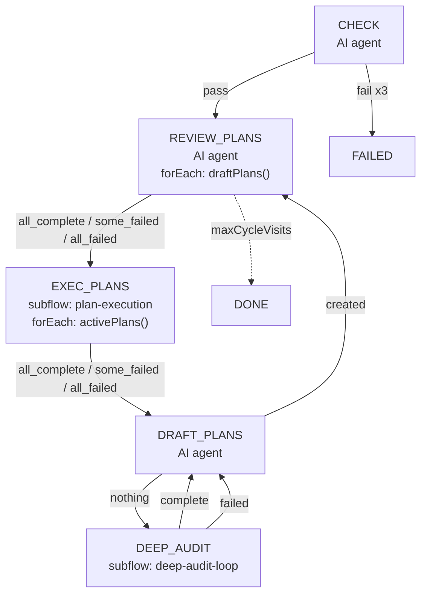
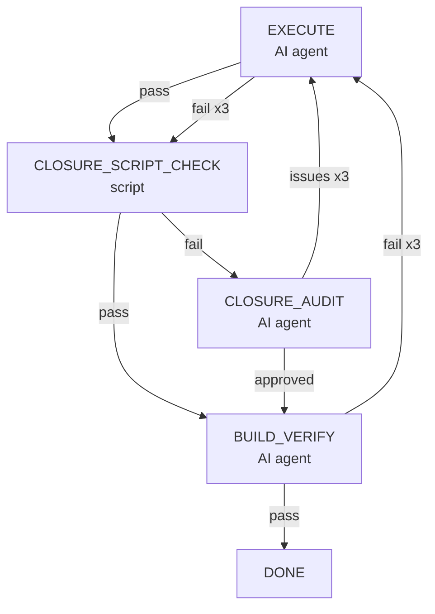
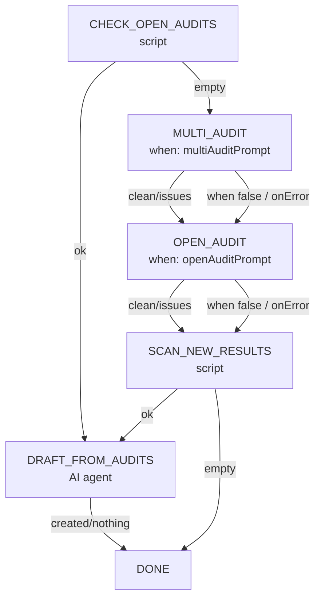

# Mission Driver Flow Design

**Date**: 2026-06-16 (step name simplification: HEALTH_CHECK->CHECK, EXECUTE_ALL_ACTIVE_PLANS->PLANS, ROADMAP_CHECK->ROADMAP, PLAN_DRAFT->DRAFT, DEEP_AUDIT_LOOP->AUDIT)
**Scope**: `tools/mission-driver/flows/mission-driver.json`, subflows `tools/mission-driver/flows/plan-execution.json`, `tools/mission-driver/flows/deep-audit-loop.json`
**Status**: active
**Replaces**: v3 `execute-all-active-plans` subflow + `plan-router` script
**Changes**:
- 2026-06-21: Reordered main cycle from `CHECK -> EXEC -> DRAFT -> REVIEW -> EXEC` to `CHECK -> REVIEW -> EXEC -> DRAFT -> REVIEW`. Single transition change: `CHECK.pass` now goes to `REVIEW_PLANS` instead of `EXEC_PLANS`. Rationale: on resume (restart with state on disk), the previous order ran `DRAFT_PLANS` before `REVIEW_PLANS`, which risks re-drafting plans that already exist as `draft` from a previous run. New order ensures any `draft` backlog is reviewed and promoted to `active` before `DRAFT_PLANS` is allowed to create new work. Steady-state cycle is unchanged in shape (3-step), just rotated. Empty `draftPlans()` forEach short-circuits to `all_complete` without an AI call, so the extra REVIEW on fresh start is one cheap file scan. Also brought Section 3 mermaid in line with the actual JSON transitions (REVIEW_PLANS is `type: "agent"` with `forEach: draftPlans()`, not the doc's old "group + scan-reviewed-plans script" — that broader drift is not fully cleaned up here, only the arrows relevant to this reorder).

---

## 1. Design Conclusions

1. **Stack-nested flows**: Main flow + two reusable subflows (`plan-execution`, `deep-audit-loop`), replacing v3's `execute-all-active-plans` subflow.
2. **AI fix up-front**: `CHECK` is an AI agent step that can auto-diagnose and fix build failures, with **context-free retry** (fresh session each time).
3. **EXEC_PLANS uses group + forEach**: `scan-active-plans` script scans all active plans into `items`, `EXECUTE_EACH_PLAN` uses `forEach` to run `plan-execution` subflow for each plan. No internal loop -- the main flow re-scans after returning from `DRAFT_PLANS` or `AUDIT`.
4. **Deep audit flow**: `deep-audit-loop` subflow (MULTI_AUDIT -> OPEN_AUDIT -> DRAFT_FROM_AUDITS), completes audit and plan creation within the subflow; execution is handled by the main flow's `EXEC_PLANS`.
5. **Plan Draft merges audit (v5)**: `DRAFT_PLANS` merges drafting and independent sub-agent review into a single step outputting `created` + PLAN_FILE. The review loop (max 2 rounds, independent session sub-agent) completes within the step, removing the engine-level PLAN_AUDIT step and its retry/onMaxRetries transitions.
6. **Subflow marker passthrough**: Subflows return the actual marker of their last internal step, not a hardcoded `"complete"`/`"failed"`.
7. **Fault-tolerant fallback to EXEC_PLANS**: All unexpected failures in subflows and agent steps route back to plan execution, never breaking the overall loop.
8. **No parameter passing between top-level steps**: Top-level transitions never use `append`. Each step reads its own data from `delegates.vars` (mission.json config) or from files on disk. This ensures any top-level step can be executed independently via `--step <STEP_NAME>` without needing a prior step to have run. Data sharing between steps happens through files (plan files, audit result files, roadmap), not through in-memory prompt appends.

---

## 2. Background and Motivation

Problems with the old flow:

| Problem | Impact |
|---------|--------|
| `DETECT_START` all transitions pointed to `HEALTH_CHECK` | Wasted a subprocess, result unused |
| `HEALTH_CHECK` was a tool step (only ran `mvnw`) | Build failure could only go to `FIX_BUILD`, no self-healing |
| `FIX_BUILD` had no retry loop | One fix failure ended everything |
| No active plan detection | Entire flow processed one plan at a time, no "process all active plans first" logic |
| `DEEP_AUDIT` was single-step | Audit -> draft -> execute -> no re-audit, couldn't ensure all issues were addressed |

v2 introduced subflows and PLAN_ROUTER, but PLAN_ROUTER's goto jumps caused ping-pong semantics: "execute one plan -> jump back to router -> jump again", which didn't match the intuitive "execute all plans first" expectation.

v3 switched to stack nesting: `EXEC_PLANS` is a self-contained step that iterates all active plans via `plan-execution` subflow, returning only when done. This is like a function call stack -- "push execution frame, pop execution frame".

---

## 3. Top-Level Flow



Steady-state cycle: `REVIEW_PLANS -> EXEC_PLANS -> DRAFT_PLANS -> REVIEW_PLANS -> ...`

Entry point is now `REVIEW_PLANS` (right after `CHECK`), not `EXEC_PLANS`. This ensures that on resume (restart with `draft` plans left over from a previous run), the backlog is reviewed and promoted to `active` *before* `DRAFT_PLANS` gets a chance to create duplicate plans for the same roadmap items. On a fresh start with empty queues, `REVIEW_PLANS` runs with `draftPlans() -> []`, the engine short-circuits the empty forEach to `all_complete` without invoking the AI, and the flow falls through to `EXEC_PLANS` -> `DRAFT_PLANS` normally.

### Step Descriptions

**CHECK** (`prompts/health-check.md`)
- AI agent step, runs build command, on failure AI self-diagnoses and fixes.
- `fail` transition configured with `retry: CHECK, maxRetries: 3`, no append buffer, so each retry is **empty context + new session**.
- On continued failure, exits via `onMaxRetries`.

**EXEC_PLANS** (`type: "group"`, `maxRounds: 1`)
- Two internal steps: `SCAN_PLANS` (`scan-active-plans` script) -> `EXECUTE_EACH_PLAN` (`forEach: "items"`).
- `SCAN_PLANS` scans `plansDir`, collects all active plan paths into a JSON array in `flowVars.items`.
- No active plans -> `exit: "done"`, skips execution.
- Has active plans -> `EXECUTE_EACH_PLAN` uses `forEach` to run `plan-execution` subflow for each item.
- Each item passed via `flowArgs: { PLAN_FILE: "{{forEachItem}}" }` (template variables resolved per iteration).
- No internal loop -- main flow re-scans after returning from `DRAFT_PLANS` or `AUDIT`.
- See Section 4.

**DRAFT_PLANS** (`prompts/draft-from-roadmap.md`)
- Merges drafting and self-audit (v5): agent writes the plan, then switches to coordinator mode, spawns independent sub-agent for adversarial review (max 2 rounds), outputs `created` after passing (zero Blocker/Major).
- Review loop completes within a single step, no engine-level PLAN_AUDIT step.
- On failure to pass: degraded mode, still outputs `created`, plan proceeds to execution, downstream closure/deep audit provides fallback.
- Independence guarantee: review sub-agent is an independent session (different task_id), cannot see coordinator context.

**REVIEW_PLANS** (`type: "group"`, `maxRounds: 1`)
- Pure mechanical step: `scan-reviewed-plans` script finds `reviewed` plans -> `PROMOTE_EACH_PLAN` promotes each to `active` via `plan-promote` subflow.
- Zero AI calls.

**AUDIT** (subflow `deep-audit-loop.json`)
- See Section 6.

**Exit Mechanism**
- `EXEC_PLANS` `done` -> `DRAFT_PLANS` `nothing` -> `AUDIT` -> `DRAFT_PLANS` -> ...
- Engine's `maxCycleVisits` (default 30) or `maxTotalSteps` (default 500) triggers natural termination.
- When all active plans executed, no roadmap backlog, no new audit findings, the loop idles until `maxCycleVisits`.
- `EXEC_PLANS` is a group (`maxRounds: 1`), no internal loop -- re-scanning relies on main flow returning from `DRAFT_PLANS`/`AUDIT`.

---

## 4. SCAN_PLANS + forEach Pattern

`EXEC_PLANS` is a `type: "group"` step (`maxRounds: 1`) with two internal sub-steps:

### SCAN_PLANS (`scan-active-plans` script)

```javascript
function scanActivePlans(delegates, flowVars) {
  // Scan all non-00- prefixed .md files in plansDir
  // Extract Plan Status, collect all active/planned/in-progress plans
  // Write JSON array ['path1.md', 'path2.md', ...] to flowVars.items
  // Return "ok" (has active plans) or "empty" (none)
}
```

### EXECUTE_EACH_PLAN (forEach subflow)

```json
{
  "type": "subflow",
  "flow": "plan-execution",
  "forEach": "items",
  "flowArgs": { "PLAN_FILE": "{{forEachItem}}" }
}
```

### Flow

1. `SCAN_PLANS` scans and sets `flowVars.items` -> returns `ok` (has plans) or `empty` (none).
2. `ok` -> `EXECUTE_EACH_PLAN` iterates `items`, calling `plan-execution` subflow per item.
3. `forEachItem` mapped to `PLAN_FILE` via `flowArgs` (engine resolves template variables per iteration).
4. `EXECUTE_EACH_PLAN` returns `all_complete`/`some_failed`/`all_failed` -> group exits `done`.
5. `empty` -> group exits `done` directly.

---

## 5. plan-execution Subflow



### Step Descriptions

**EXECUTE** (`prompts/execute.md`)
- AI executes each Phase of the plan file (from the first `- [ ]` to all `[x]`).
- Runs tests after each Phase to confirm.
- Updates plan `Plan Status: completed` + roadmap item status.
- Returns `success` (alias -> `pass`) or `failed`.

**CLOSURE_SCRIPT_CHECK** (`closureScriptCheck` script function)
- Calls `plan-check.mjs`'s `inspectPlan()` to check:
  - All checklist items are checked `[x]`
  - Status consistency (Status completed with Closure evidence)
- **pass -> BUILD_VERIFY**: Mechanical check passed, skip AI audit (AI audit's core value is diagnosing failures; redundant on pass).
- **fail -> CLOSURE_AUDIT**: Script found non-compliance, AI intervenes to diagnose and fix.

**CLOSURE_AUDIT** (`prompts/closure-audit.md`)
- AI-driven closure audit (only entered when script check fails):
  - Strictly fixes per plan guide (mandatory section names, field names, Phase format).
  - After fix returns `approved` -> BUILD_VERIFY.
  - If unfixable returns `issues` -> retry EXECUTE with audit feedback appended.

**BUILD_VERIFY** (`prompts/build-verify.md`)
- Runs build command to confirm compilation passes.
- Diagnoses and fixes on failure, then retries.
- Returns `pass` -> subflow completes.
- Returns `fail` -> retry EXECUTE (with build error info).

### Retry Strategy

| Step | On Failure | Max Retries |
|------|-----------|-------------|
| EXECUTE | retry EXECUTE | 3 |
| CLOSURE_AUDIT issues | retry EXECUTE | 3 (with audit feedback) |
| BUILD_VERIFY | retry EXECUTE | 3 (with build errors) |
| CLOSURE_AUDIT onMaxRetries | goto BUILD_VERIFY | -- |

---

## 6. deep-audit-loop Subflow



### Flow Logic (Linear, No Loop)

1. **CHECK_OPEN_AUDITS** (script): Scans `auditsDir` for result files with `Audit Status: open` (leftover unprocessed results from previous runs).
   - `ok` (found) -> DRAFT_FROM_AUDITS processes them directly.
   - `empty` (none) -> enter audit phase.
2. **MULTI_AUDIT** (when `multiAuditPrompt` is non-empty): Multi-dimensional audit, writes result file (`Audit Status: open`). **No data dependency** with OPEN_AUDIT; clean/issues both proceed to next step.
3. **OPEN_AUDIT** (when `openAuditPrompt` is non-empty): Open-ended audit, writes result file. Independent from MULTI_AUDIT.
4. **SCAN_NEW_RESULTS** (script): Scans again for `open` results (newly written).
   - `ok` -> DRAFT_FROM_AUDITS.
   - `empty` (both audits not configured or wrote nothing) -> done:completed.
5. **DRAFT_FROM_AUDITS**: Reads `planGuide` + audit result files, drafts plans, marks results as `planned`.

### Design Rationale

- **Audit and drafting separated**: Audit steps read only their own `multiAuditPrompt` / `openAuditPrompt`, not planGuide; the drafting step reads planGuide + audit results.
- **MULTI_AUDIT / OPEN_AUDIT fully independent**: Sequential execution, no append handoff, no marker-driven branching. Each independently configured (`prompts.multiAudit` / `prompts.openAudit`); skipped if empty.
- **Script-driven**: The `scan-open-audits` script checks `Audit Status` to decide whether plan drafting is needed, not relying on AI marker output.
- **Linear, no loop**: Two scan points (CHECK_OPEN_AUDITS + SCAN_NEW_RESULTS), no infinite loop risk.

---

## 7. Subflow Marker Propagation Rules

Subflow steps (`type: "subflow"`) use **transparent passthrough** -- the subflow returns the actual marker of its last internal step.

### Impact on Flow

| Step Type | Returned Marker | Consumer |
|-----------|----------------|----------|
| `EXEC_PLANS` (group) | `"done"` (SCAN_PLANS finds no active plans or execution complete) | Main flow -> `REVIEW_PLANS` |
| `plan-execution` (subflow) | `"pass"` (BUILD_VERIFY passed) | `EXECUTE_EACH_PLAN` (forEach) |
| `plan-execution` (subflow) | `"failed"` (BUILD_VERIFY or EXECUTE exceeded limit) | `EXECUTE_EACH_PLAN` (forEach) |
| `deep-audit-loop` (subflow) | `"completed"` (subflow finished) | `AUDIT` step in main flow |

---

## 8. Fault Tolerance Design

### Recovery Chain for Unexpected AI Markers

| Layer | Mechanism | Effect |
|-------|-----------|--------|
| **markerAliases** | `none->created`, `revised->created` alias mapping | Old markers or common variants auto-normalized |
| **Correction retry** | `onUnknownMaxRetries: 2`, system prompt asks AI for valid value | Novel marker values corrected via retry |
| **Subflow failure propagation** | Subflow internal `no_transition` -> subflow `failed` -> parent transition `failed->EXEC_PLANS` | Unexpected output from any subflow step doesn't deadlock; parent routes to plan execution loop |
| **onError fallback** | For killed agent/subprocess (`ok:false`), routes to `EXEC_PLANS` | Process-level failures also recoverable |

### Subflow Failure Propagation Example

```
DRAFT (inside deep-audit-loop subflow)
  -> AI outputs "none" (removed old marker)
  -> markerAliases: none -> created (if no alias)
  -> correction retry fails 2x -> no_transition
  -> deep-audit-loop subflow returns status="no_transition"
  -> parent step AUDIT: marker="failed"
  -> transition: failed -> EXEC_PLANS
  -> flow continues (no active plan, back to DRAFT_PLANS)
```

### Subflow Notes

- `EXEC_PLANS` is `type: "group"` (inline steps, no isolated flowVars); `EXECUTE_EACH_PLAN` is `type: "subflow"`.
- Group sub-steps share main flow's `flowVars`; subflow `flowVars` are isolated from parent (passed via `flowArgs`/`delegates.vars`).
- `{{forEachItem}}` template variable in `flowArgs` is resolved per forEach iteration (v4 engine fix).
- Any step's `onError`/`onUnknown` failure inside a subflow/group does not directly terminate the parent flow.

---

## 9. Rejected Alternatives

| Alternative | Rejection Reason |
|-------------|-----------------|
| `HEALTH_CHECK` stays as tool step | AI has diagnosis and fix capability; tool step only runs build command, cannot auto-fix |
| `DEEP_AUDIT` linear in main flow | Cannot form audit-execute-re-audit closed loop |
| `execute-all-active-plans` subflow keeps internal loop | PLAN_ROUTER <-> EXECUTE_PLAN jumping violates stack-nesting semantics; group + forEach executes all active plans in one pass, external loop (DRAFT_PLANS/AUDIT) handles re-scanning |
| v2 `PLAN_ROUTER` goto jumps | PLAN_ROUTER mixed scanning + routing responsibilities; goto semantics caused "execute one plan -> jump to router -> jump again" ping-pong |
| `plan-router` script keeps single-plan scan | Replaced with `scan-active-plans` that scans all active plans into `items`, paired with `forEach` to execute multiple in one pass |
| PLAN_DRAFT keeps `none`/`revised` branches | AI frequently picked wrong branch, plans got skipped; single `created` output forces plan creation always |
| Inline `plan-execution` logic into main flow | Used in two places (EXEC_PLANS + deep-audit-loop), extracted as subflow to avoid duplication |
| PLAN_AUDIT as independent engine step (v4 and earlier) | In continuous auto-loop, review only follows draft; independent orchestration step adds round-trip overhead without information gain; review independence comes from independent session sub-agent (not independent orchestration step); merged degraded fallback handled by downstream closure/deep audit |

---

## 10. Relationship to Existing Design

- This design depends on `flow-engine-design.md`'s Step/Transition/Subflow/Group/forEach mechanism.
- Flow definitions at `flows/mission-driver.json`, subflows at `flows/plan-execution.json`, `flows/deep-audit-loop.json`.
- Script functions `scanActivePlans`, `closureScriptCheck` in `src/flow-loader.js`.
- `flowArgs` template variables resolved per forEach iteration in `src/engine.js`.
